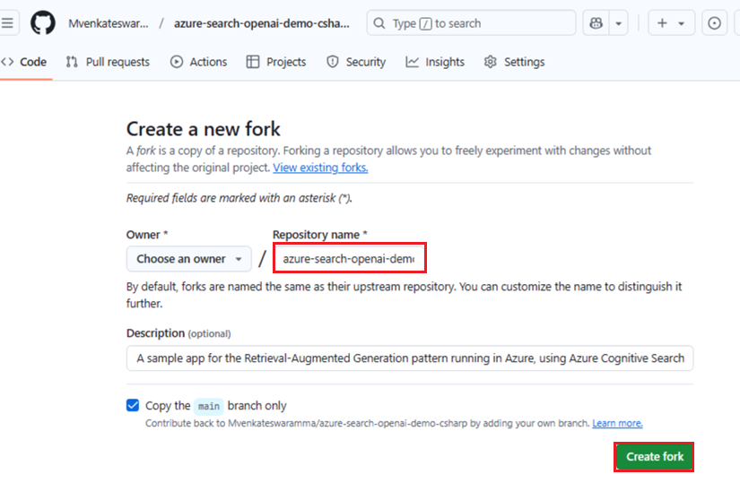
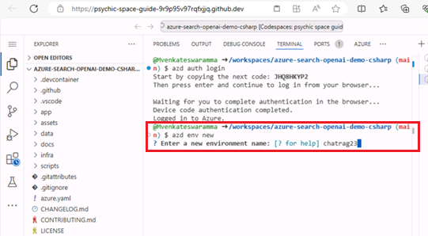
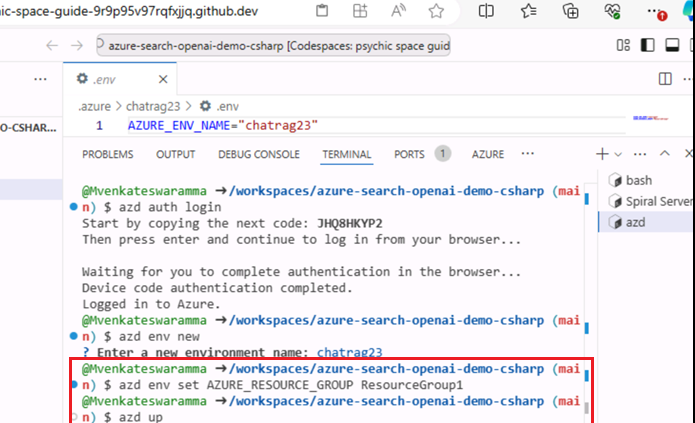
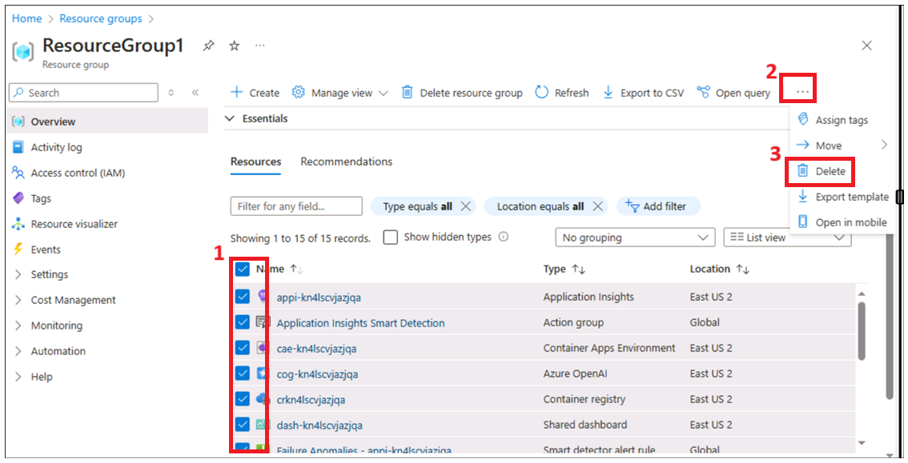
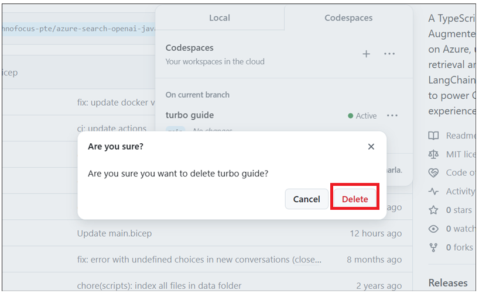

# 用例 04 - 使用 Azure OpenAI 服务和 RAG 构建聊天应用程序（使用 .NET）

此示例演示了使用 Retrieval Augmented Generation
模式在您自己的数据上创建类似 ChatGPT 的体验的几种方法。它使用 Azure
OpenAI 服务访问 ChatGPT 模型 （gpt-4o-mini），并使用 Azure AI
搜索进行数据索引和检索。

存储库包含示例数据，因此可以进行端到端尝试。在此示例应用程序中，我们使用了一家名为
Contoso Electronics
的虚构公司，该体验允许其员工询问有关权益、内部策略以及职位描述和角色的问题。

- 语音聊天、聊天和 Q&A 界面

- 探索各种选项，以帮助用户评估带有引文、跟踪源内容等的响应的可信度。

- 展示模型 （ChatGPT） 和检索器之间交互的数据准备、提示构建和编排
  （Azure AI 搜索） 的可能方法

- 直接在 UX 中进行调整，以调整行为并试验选项

**使用的关键技术 --** Azure OpenAI 服务、ChatGPT 模型 （gpt-4o-mini） 和
Azure AI 搜索

**预计持续时间 --** 40 分钟

# 练习 1 ：部署应用程序并从浏览器对其进行测试

## 任务 1：开放开发环境

1.  打开浏览器，导航到地址栏，键入或粘贴以下URL：+++https://github.com/technofocus-pte/azure-search-openai-demo-csharp.git+++，然后使用您的
    Github 帐户登录。

> 

2.  单击  **Fork**。

> 

3.  输入仓库名称，然后单击 **Create fork**（创建复刻）。

> 

4.  单击**Code -\> Codespaces -\> +**

> 

5.  等待环境设置完成。需要 5-10 分钟。

> 

## 任务 2：预配所需的服务以生成聊天应用并将其部署到 Azure 

1.  在终端上运行以下命令。复制代码并按 Enter。

> +++azd auth login+++
>
> 

2.  默认浏览器打开以输入代码。输入复制的代码，然后单击 **Next**。

> 

3.  使用 Azure 凭据登录。

4.  切换回 Github Codespace
    选项卡。执行以下命令，初始化当前目录下的工程环境。将环境名称输入为
    +++**chatragXXX+++**，然后按 Enter。

> 注意：env name 应该是唯一的
>
> +++azd env new+++

5.  运行以下命令将服务预配到 Azure，构建容器。

> +++azd env set AZURE_RESOURCE_GROUP ResourceGroup1+++
>
> 

6.  运行 azd up - 这将预配 Azure 资源并将此示例部署到这些资源，包括根据
    ./data 文件夹中找到的文件生成搜索索引。

> **+++azd up+++**
>
> 

7.  选择以下值。

- **选择要使用的 Azure 订阅 ：**选择您的订阅

- **选择要使用的 Azure 位置：East us2/west us2**（有时，East US
  可能不可用，请从下面提到的列表中选择位置。

- 选择现有资源组 ： 您现有的资源组 （例如 ：**ResourceGroup1** ）

> 
>
> 

7.  等待资源完全预置。此过程需要 5-10 分钟才能创建所有必需的资源。

> 
>
> 
>
> 

8.  成功部署应用程序后，您会在终端中看到一个 URL。复制**URL**

> 

9.  点击**Open**

> 

10. 它会在新选项卡中打开应用程序。

> 

11. 打开浏览器，转到<https://portal.azure.com> 并使用 Azure
    订阅帐户登录。

12. 在 Home （主页） 上，单击 **Resource Groups** （资源组）

> 

13. 单击您的资源组。

> 

14. 确保已成功部署以下资源

> 

> 

15. 在资源组上，然后单击 **Azure OpenAI** 资源名称。

> 

16. 在 **Azure OpenAI**
    窗口中，单击左侧导航菜单中的“**Overview**”，然后在“**Get Started**
    ”选项卡下，单击“**Go to Azure OpenAI Studio**”按钮，在新浏览器中打开
    **Azure OpenAI Studio**。

> 

17. 确保 **gpt-4o-mini， text-embedding-ada-002** 应成功部署。

> 

18. 在资源组上，然后单击 **storage account resource
    name**（存储帐户资源名称）。

> 
>
> 

19. 现在在浏览器中打开 URL

> 

20. 点击 **Chat**

> 

21. 在 **Blazor OpenAI** Web 应用页中，输入以下文本，然后单击“**Submit**
    ”**图标**，如下图所示。

> **+++What is included in my Northwind Health Plus plan that is not in
> standard?+++**
>
> 
>
> 

22. 在 **Blazor OpenAI** Web
    应用页中，输入以下文本，然后单击“**Submit**”**图标**，如下图所示。

> **+++Can I use out-of-network providers?+++**
>
> 
>
> 

23. 在 **Blazor OpenAI** Web
    应用页中，输入以下文本，然后单击“**Submit**”**图标**，如下图所示。

> **+++Are there any exclusions or restrictions?+++**
>
> 
>
> 

24. 在 Blazor OpenAI Web
    应用页中，输入以下文本，然后单击“**Submit**”**图标**，如下图所示。

> **+++What does a Product Manager do?+++**
>
> 

25. 点击 **Documents。**

> 

## **任务 3 ：清理所有资源**

1.  切换回 **Azure 门户 -\> 资源组 -\> 资源组名称。**

> 

2.  选择所有资源，然后单击 Delete （删除），如下图所示。（**DO NOT
    DELETE** 资源组）

> 

3.  在文本框中键入 delete，然后单击 **Delete**。

> 

4.  单击 **Delete** 确认删除。

> 

5.  切换回 Github 门户选项卡并刷新页面。

> 

6.  单击 Code ，选择为此实验室创建的分支，然后单击 **Delete** 。

> 

7.  单击 **Delete** 按钮确认分支删除。

**总结：**

此用例认为您，为在 Azure 上运行的检索增强一代模式部署聊天应用程序，使用
Azure AI 搜索进行检索，并使用 Azure OpenAI 和 LangChain 大型语言模型
（LLM） 来支持 ChatGPT 风格和 Q&A 体验
