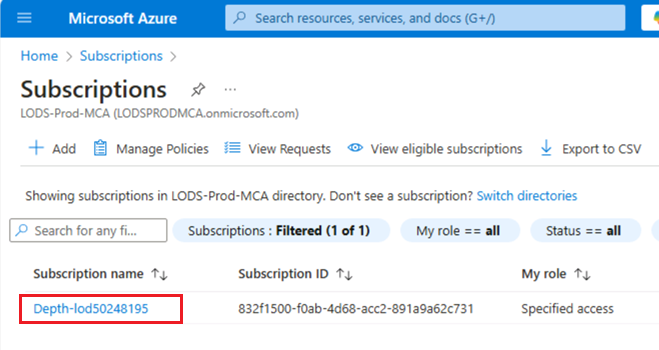
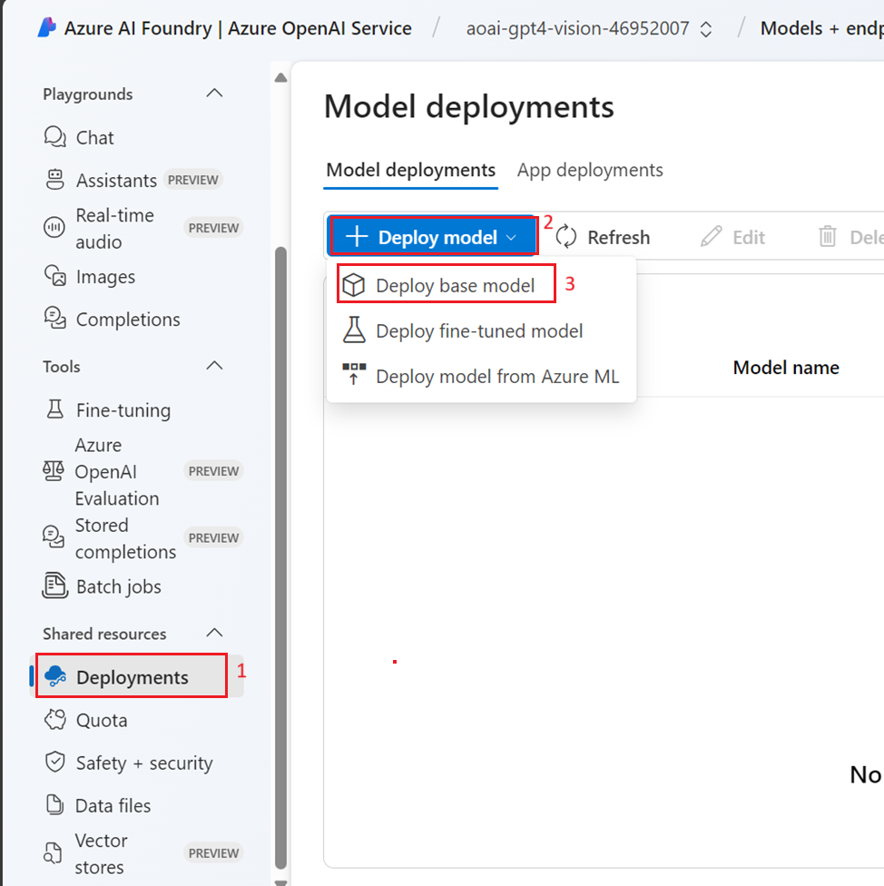
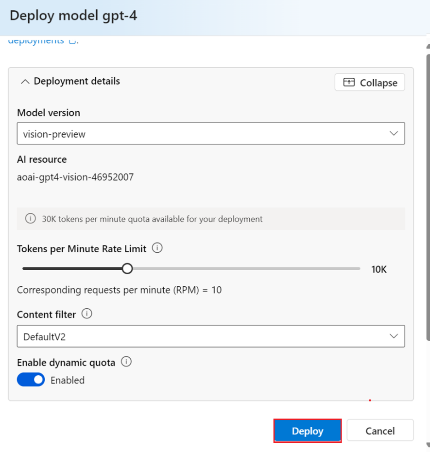
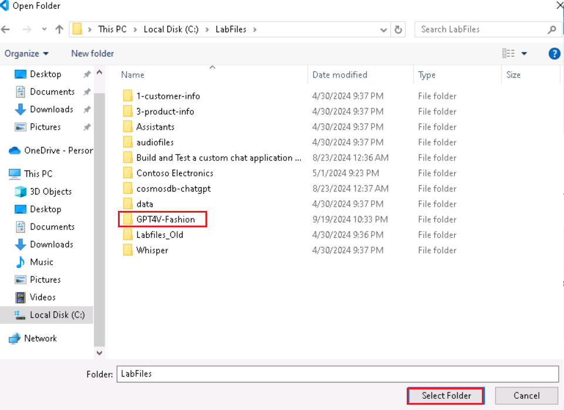
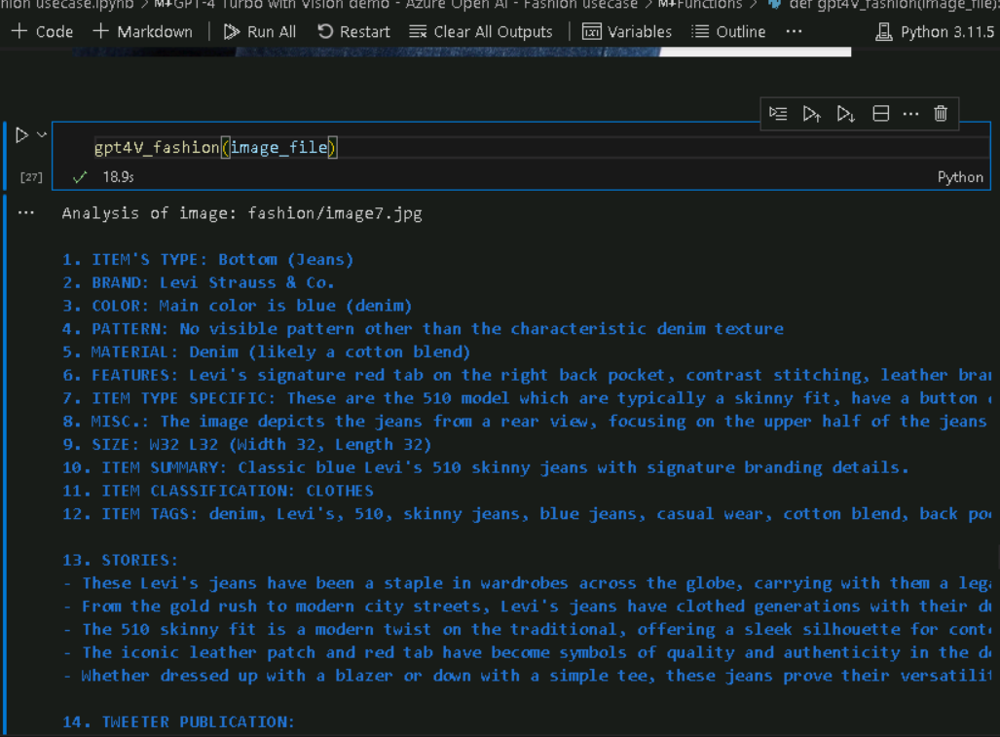
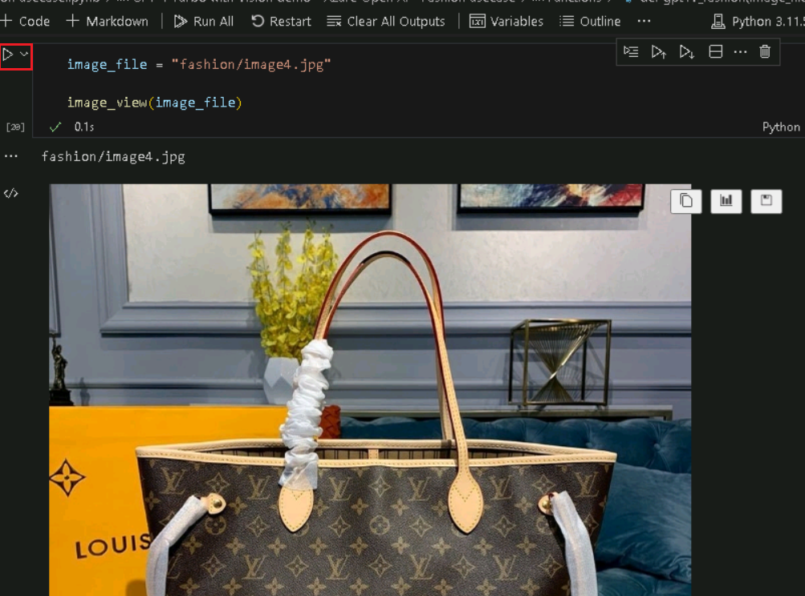
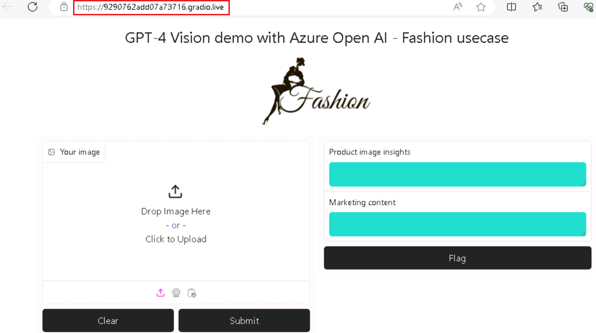
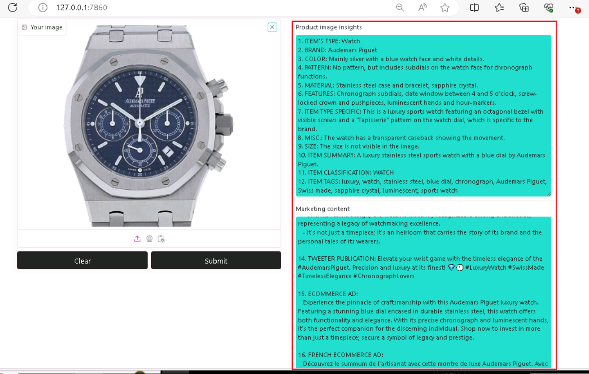
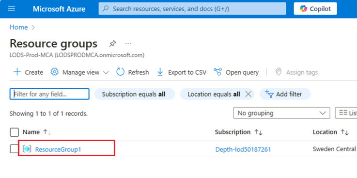
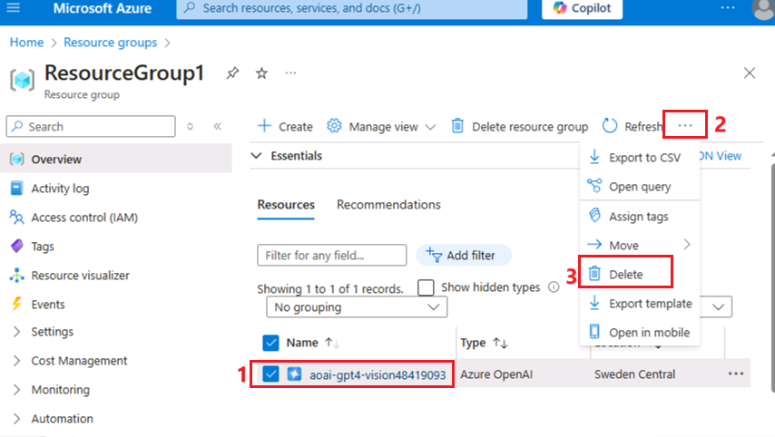

**用例 01 - 在 Azure OpenAI 上使用 GPT-4 Turbo 和 Vision
进行时尚趋势分析**

**介绍：**

Azure OpenAI 服务上的 GPT-4 Turbo with Vision 现已推出公共预览版。GPT-4
Turbo with Vision 是由 OpenAI 开发的大型多模态模型
（LMM），可以分析图像并为有关图像的问题提供文本回答。它结合了自然语言处理和视觉理解。在增强模式下，可以使用
Azure AI Vision 功能从图像中生成其他见解

**目的：**

- 部署 Azure OpenAI 资源并对其进行配置。

- 部署特定的 Azure OpenAI 模型，如 GPT-4 Vision。

- 使用 Python、Jupyter Notebook 和所需的库设置您的开发环境。

- 此用例与时尚用例相关。这些任务可能涉及图像分析、文本生成或其他 AI
  任务。

## 任务 0：了解 VM 和凭据

在此任务中，我们将识别并了解我们将在整个实验室中使用的凭证。

1.  **Instructions** 选项卡包含实验室指南，其中包含在整个实验室中要遵循的说明。

2.  **Resources** 选项卡已获取执行实验室所需的凭证。

    - **URL** – Azure 门户的 URL

    - **Subscription （订阅）** – 这是分配给您的订阅的 ID

    - **用户名** – 您需要用于登录 Azure 服务的用户 ID。

    - **Password （密码）** – Azure
      登录名的密码。让我们将此用户名和密码称为 Azure
      登录凭据。我们将在提及 Azure 登录凭据的任何地方使用这些凭据。

    - **Resource Group （资源组）** – 分配给您的**资源组**。

\[!Alert\] **重要提示：**请确保在此资源组下创建所有资源

> 

3.  **Help （帮助）** 选项卡包含 Support （支持） 信息。此处的 **ID**
    值是将在实验室执行期间使用的**实验室实例 ID**。

> 

## 任务 1 ：注册服务提供商

1.  打开浏览器，转到 +++https://portal.azure.com+++，然后使用下面的
    Cloud Slice 帐户登录。

> 用户名： <+++@lab.CloudPortalCredential> （User1） 的用户名 +++
>
> 密码： <+++@lab.CloudPortalCredential(User1).Password>+++
>
> 
>
> 

2.  单击 **Subscriptions** 磁贴。

> 

3.  单击订阅名称。

> 

4.  展开 设置 从左侧导航菜单中。单击“**资源提供程序**”，输入
    +++**Microsoft.AlertsManagement+++** 并选择
    i，t，然后单击“**注册**”。

5.  单击 “**资源提供程序**” ，输入
    +++**Microsoft.DBforPostgreSQL+++** 并选择 i，t，然后单击 “**注册**”
    。

6.  重复步骤 \#10 和 \#11 以注册以下资源提供程序。

- Microsoft.搜索

- Microsoft.Web 网站

- Microsoft.ManagedIdentity

## **任务 2：创建 Azure OpenAI 资源**

1.  在 Azure
    门户中，单击页面左上角的三个水平条表示的**门户菜单**，如下图所示。

> 

2.  导航并单击 **+ Create a resource**。

> 

3.  在 **Create a resource page**（创建资源页面）的 **Search services
    and marketplace**（搜索服务和市场）搜索栏中，键入**+++Azure OpenAI+++**,
    然后按 **Enter** 按钮。

> 

4.  在 **Marketplace** 页面中，导航到 **Azure OpenAI**
    磁贴，单击“**创建**”旁边的 V V 形按钮，然后导航并单击 **Azure
    OpenAI**，如下图所示。

> 

5.  在 **Create Azure OpenAI** 窗口的 **Basics**
    选项卡下，输入以下详细信息，然后单击 **Next** 按钮。

    1.  **订阅：**选择分配的订阅

    2.  **资源组：**：选择分配的资源组

    3.  **区域：**在本实验中，您将使用 **gpt-4-vision** 模型**。**
        此模型目前仅在某 [些区域](https://learn.microsoft.com/azure/ai-services/openai/concepts/models#embeddings-models)
        提供。请从此列表中选择一个区域，在此实验室中，**瑞典中部**将用于此资源。

    4.  **名你**: **aoai-gpt4-visionXXXXX** （XXXXX 可以是实验室即时
        ID）

    5.  **定价层**：选择**Standard S0**

> **注意：**要查找您的实验室即时 ID，请选择“帮助”并复制即时 ID。
>
> 
>
> 
>
> 

6.  在 **Network** 选项卡中，将所有单选按钮保留为默认状态，然后单击
    **Next** 按钮。

> 

7.  在 **Tags** 选项卡中，将所有字段保留为默认状态，然后单击 **Next**
    按钮。

> 

8.  在 **Review + submit** 选项卡中，验证通过后，单击 **Create** 按钮。

> 

9.  等待部署完成。部署大约需要 2-3 分钟。

10. 在 **Microsoft.CognitiveServicesOpenAI** 窗口中，部署完成后，单击
    **Go to resource** 按钮。

> 

11. 单击左侧导航菜单中的**Keys and Endpoints**
    ，然后将记事本中的“终结点”值复制到 **AzureAI
    ENDPOINT**，将“密钥”复制到变量 **AzureAIKey**。

> 

12. 在 **aoai-gpt4-visionXX** 窗口中，单击左侧导航菜单中的
    “**Overview**” ，向下滚动到“**Get Started**”磁贴，然后单击“**Go to
    AzureOpenAI Studio**”按钮，如下图所示，在新浏览器中打开 **Azure
    OpenAI Studio**。

## **任务 3：部署 Azure OpenAI 模型 gpt-4-vision**

1.  在 **Azure AI Foundry** |**Azure Open AI Service**主页，导航到
    “**Components” 部分**，然后单击 “**Deployments**”。

2.  在 **Deployments** （部署） 窗口中，下拉 **+Deploy model**
    （部署模型），然后选择 **Deploy base model**（部署基础模型）。

3.  在 **Select a model** 对话框中，导航并仔细选择 **gpt-4**，然后单击
    **Confirm** 按钮。

4.  在 **Deploy model gpt-4** 对话框的 **Deployment name** 字段下，确保
    **gpt-4**，选择 Deployment type 作为 **Standard**，并选择 Model
    ersion 作为 Vision- preview。然后单击 **Deploy** 按钮。

## 任务 4：GPT-4 Turbo with Vision 演示

1.  在 Windows 搜索框中，键入 Visual Studio，然后单击 **Visual Studio
    Code**。

> 

2.  在 **Visual Studio Code** 编辑器中，单击
    **File**（文件），然后导航并单击 **Open Folder**（打开文件夹）。

> 

3.  从 **C：\LabFiles** 导航并选择 **GPT4V-Fashion** 文件夹，然后单击
    “**Select Folder** ”按钮。

4.  如果您看到一个对话框 - **Does you trust the authors of the files in
    this folder？**，然后单击 **Yes， I trust the
    author**（是的，我信任作者）。

5.  在 Visual Studio Code 下拉列表中的 **Gpt 4V-FASHION** 中，单击
    **azure.env** 文件。

1.  更新参数，替换 **Azure OpenAI Endpoint、Azure OpenAI
    Key（**您在**Task 1** 的记事本中保存的值）并保存文件。

2.  在 Visual Studio Code 下拉列表中，选择 **GPT 4V-FASHION**，然后选择
    **GPT-4 with Vision demo with Azure Open AI - Fashion
    usecase.ipynb** notebook。

> 

3.  在 Visual Studio Code 编辑器的主页中，向下滚动到“**install
    requirements**”标题并运行第 1 个单元格。如果系统提示选择环境，请选择
    **Python Environments**，如图所示。

> 
>
> 

4.  如果系统提示选择路径，请选择 **Python version 3.11.5**
    路径，如图所示。

> 

5.  如果您看到 Windows 安全警报对话框 - 然后单击 **Allow access**。

> 
>
> 
>
> 
>
> 

6.  要重新启动 Jupyter 内核，请单击 **Restart** 按钮。

> 

7.  要导入库，请选择**第 4**
    个单元格。然后，通过单击**开始图标**执行单元格。

> 

8.  选择**第 5** 个单元格。然后，通过单击**开始图标**执行单元格。

> 

9.  要检查 OpenAI 的系统版本，请选择**第 6** 、第 7 、第 8 和第 9
    个单元格。然后，通过单击**开始图标**执行单元格。

> 

10. 要加载配置值，请单击 **Play** 按钮选择并执行**第 10** 、11 和 12
    个单元格。

> 

11. 定义一个辅助函数来创建嵌入，通过单击 **Play** 按钮选择并执行第 13 个
    .14th 单元格。

> 
>
> 

12. 要运行该示例，请单击 **Play** 按钮，选择并执行第 15 、16 个单元格。

> 
>
> 

13. 要运行该示例，请单击 **Play** 按钮选择并执行**第 17 、18**
    个单元格。

> 
>
> 

14. 要运行该示例，请单击 Play 按钮选择并执行**第 19 、20** 个单元格。

> 
>
> 

15. 要运行示例，请单击 **Play** 按钮，选择并执行**第 21 、22**
    个单元格。

> 
>
> 

16. 要运行该示例，请单击 **Play** 按钮选择并执行**第 23 、24**
    个单元格。

> 

17. 要运行该示例，请单击 **Play** 按钮选择并执行**第 25 、26**
    个单元格。

> 
>
> 

18. 要运行示例，请单击 **Play** 按钮选择并执行**第 27 、28** 个单元格。

> 
>
> 

19. 要运行示例，请单击 **Play** 按钮选择并执行**第 27 、28** 个单元格。

> 
>
> 

20. 要生成 WebApp，请单击 **Play** 按钮选择并执行**第 29** 个单元格。

> 

21. 要生成 WebApp，请单击 **Play** 按钮选择并执行**第 30** 个单元格。

> 

22. 成功部署应用程序后，您会在终端中看到一个 URL。复制 **URL**

23. 打开浏览器，导航到地址栏，粘贴 Public URL 链接。
    

24. 打开浏览器，导航到地址栏，粘贴本地 URL 链接。选择任何项目

25. 单击 **Submit** 按钮。

> 

## 任务 5：删除资源

1.  若要删除存储帐户，请导航到 **Azure 门户主页**，单击“**Resource
    groups**”。

> 

2.  单击 **ResourceGroup1** 资源组。

> 

3.  在 **Resource group** （资源组） 主页中，选择**delete resource
    group**

4.  在右侧显示的 **Delete Resources** 窗格中，导航到 **Enter “resource
    group name**” **以确认删除**字段，然后单击 **Delete** 按钮。

5.  在 **Delete confirmation** 对话框中，单击 **Delete** 按钮。

> 

6.  单击铃铛图标，您将看到通知 – **Deleted resource group AOAI-RG89.**

**总结**

在此动手实验中，参与者将使用 Azure OpenAI 深入研究高级 AI
功能。从设置基本的 Azure 资源开始，他们部署 GPT-4-vision 等 AI
模型。该实验室专门探讨了配备视觉功能的 GPT-4
如何彻底改变与时尚相关的任务——想想图像识别、个性化风格推荐和趋势分析。
