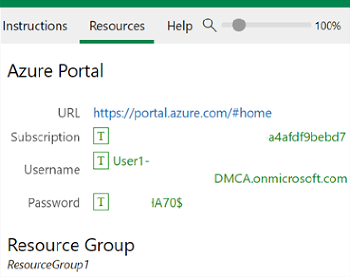
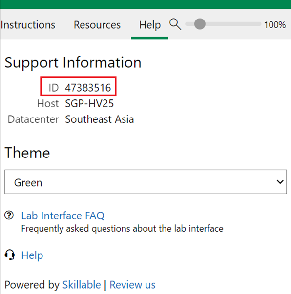
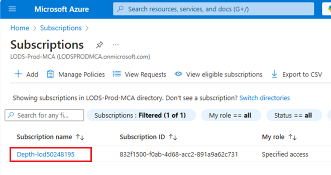
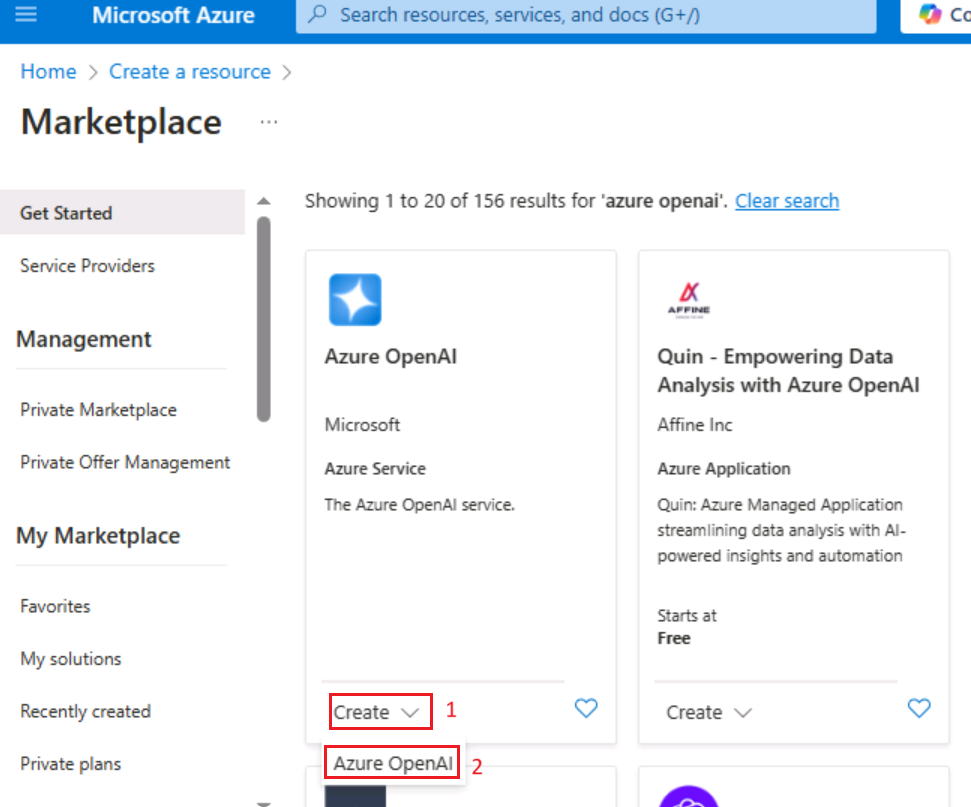
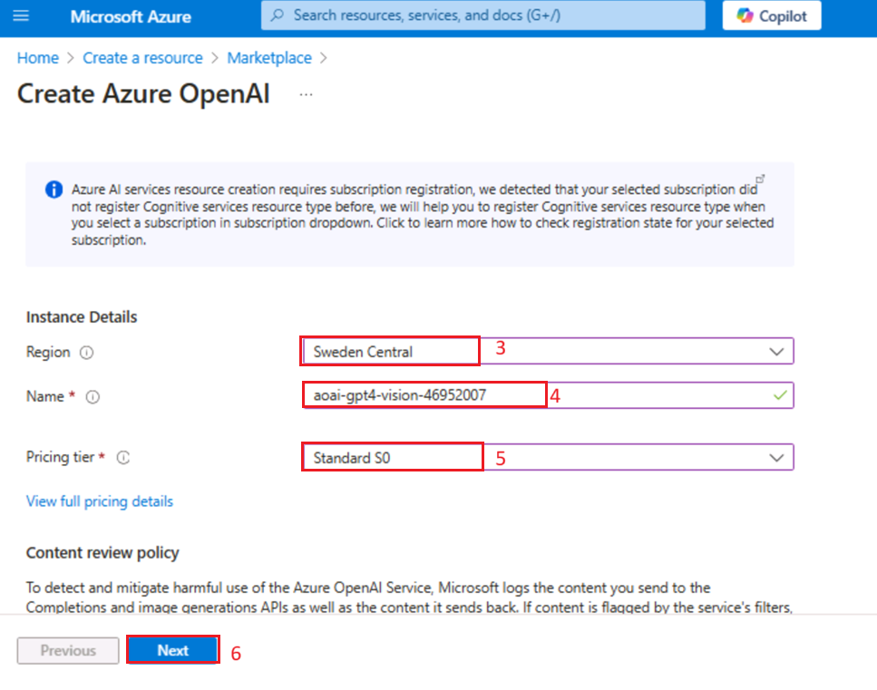
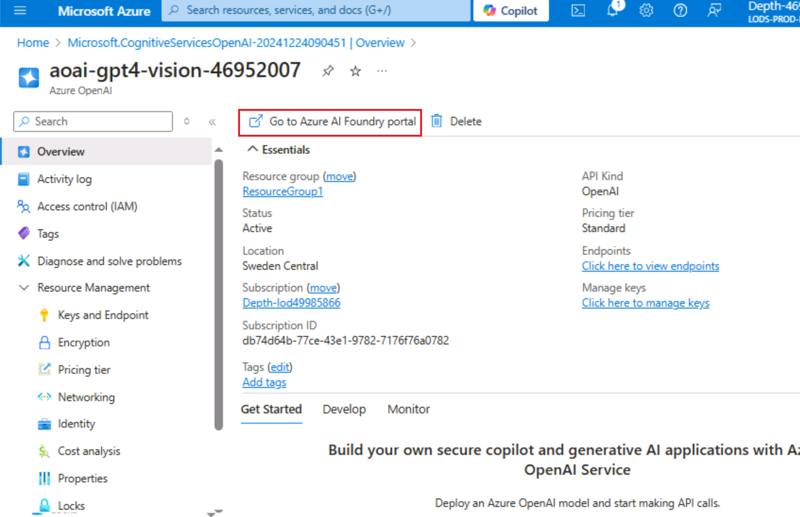
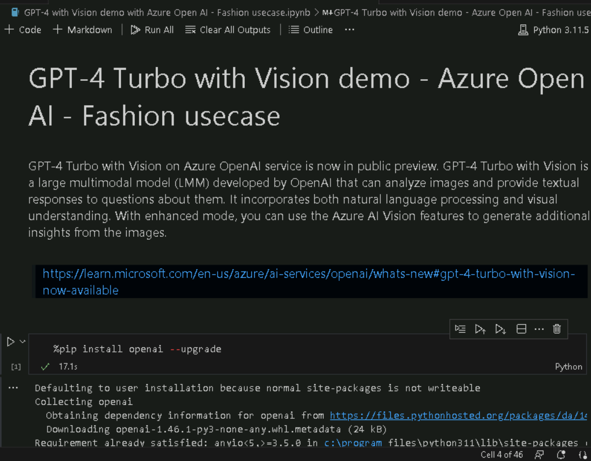
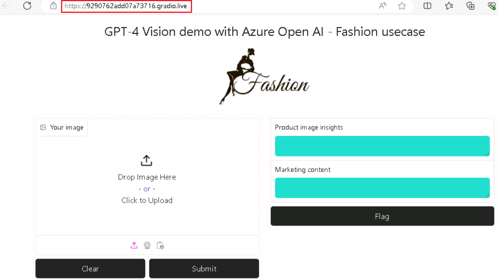
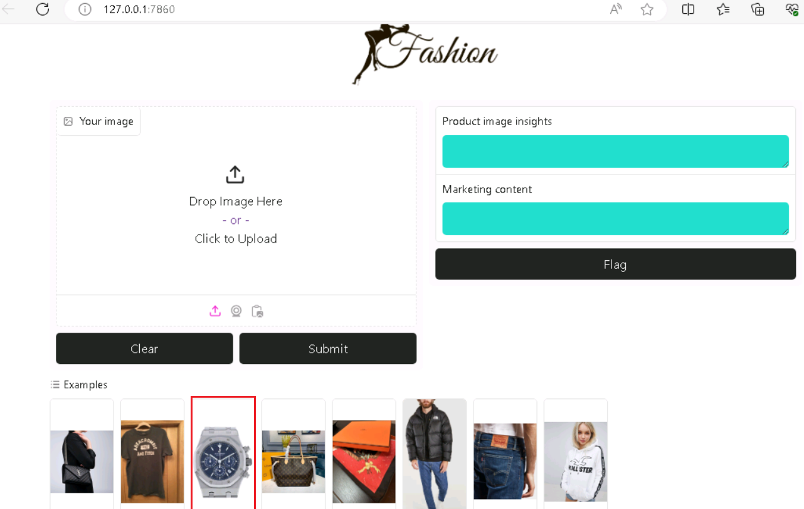

**Cas d'utilisation 01 - Analyse des tendances de la mode avec GPT-4
Turbo et Vision sur Azure OpenAI**

**Introduction:**

GPT-4 Turbo avec Vision sur le service OpenAI d'Azure est désormais en
préversion publique. GPT-4 Turbo avec Vision est un grand modèle
multimodal (LMM) développé par OpenAI qui peut analyser des images et
fournir des réponses textuelles aux questions les concernant. Il intègre
à la fois le traitement du langage naturel et la compréhension visuelle.
Avec le mode amélioré, vous pouvez utiliser les fonctionnalités Azure AI
Vision pour générer des informations supplémentaires à partir des images

**Objectif:**

- Déployer des ressources Azure OpenAI et les configurer.

- Pour déployer un modèle Azure OpenAI spécifique tel que GPT-4 Vision.

- Configurez votre environnement de développement avec Python, Jupyter
  Notebook et les bibliothèques requises.

- Ce cas d'utilisation était lié à des cas d'utilisation de la mode. Il
  peut s'agir d'une analyse d'images, d'une génération de texte ou
  d'autres tâches d'IA.

## Tâche 0 : Comprendre la machine virtuelle et les informations d'identification

Dans cette tâche, nous identifierons et comprendrons les informations
d'identification que nous utiliserons tout au long du laboratoire.

1.  L'onglet **Instructions** contient le guide de laboratoire avec les
    instructions à suivre tout au long du laboratoire.

2.  **L**'onglet **Ressources** contient les informations
    d'identification nécessaires à l'exécution du laboratoire.

    - **URL** – URL du portail Azure

    - **Abonnement** – Il s'agit de l'ID de l'abonnement qui vous a été
      attribué

    - **Nom d'utilisateur** : ID utilisateur avec lequel vous devez vous
      connecter aux services Azure.

    - **Mot de passe** : mot de passe pour la connexion Azure. Appelons
      ce nom d'utilisateur et ce mot de passe en tant qu'identifiants de
      connexion Azure. Nous utiliserons ces crédits chaque fois que nous
      mentionnerons les identifiants de connexion Azure.

    - **Groupe de ressources** : groupe de **ressources** qui vous est
      attribué.

\[ ! Alerte\] **Important :** Assurez-vous de créer toutes vos
ressources sous ce groupe de ressources

> 

3.  L'onglet **Help** contient les informations d'assistance. La valeur
    **ID** ici est le **Lab instance ID** qui sera utilisé lors de
    l'exécution du laboratoire.

> 

## Tâche 1 : Enregistrer le prestataire de services

1.  Ouvrez un navigateur, accédez à +++https://portal.azure.com+++ et
    connectez-vous avec votre compte Cloud Slice ci-dessous.

> Nom d'utilisateur : [+++@lab.
> CloudPortalCredential](mailto:+++@lab.CloudPortalCredential)(Utilisateur1).
> Nom d'utilisateur+++
>
> Mot de passe : [+++@lab. CloudPortalCredential(Utilisateur1). Mot de
> passe](mailto:+++@lab.CloudPortalCredential(User1).Password)+++
>
> 
>
> 

2.  Cliquez sur la tuile **Subscriptions.**

> 

3.  Cliquez sur subscription name.

> 

4.  Développez Settings dans le menu de navigation de gauche. Cliquez
    sur **Resource providers**, entrez
    +++**Microsoft.AlertsManagement+++** et sélectionnez i,t, puis
    cliquez sur **Register**.

5.  Cliquez sur **Resource providers**, entrez
    +++**Microsoft.DBforPostgreSQL+++** et sélectionnez i,t, puis
    cliquez sur **Register**.

6.  Répétez les étapes \#10 et \#11 pour enregistrer les fournisseurs de
    ressources suivants.

- Microsoft.Search

- Sur Microsoft.Web

- Microsoft.ManagedIdentity

## **Tâche 2 : Create a resource Azure OpenAI**

1.  Dans le portail Azure, cliquez sur le **portal menu** représenté par
    trois barres horizontales dans le coin supérieur gauche de la page,
    comme illustré dans l'image ci-dessous.

> 

2.  Naviguez et cliquez sur **+ Create a resource**.

> 

3.  Dans la page **Create a resource**, dans la barre de recherche
    Services **le Search services and marketplace**, tapez **Azure
    OpenAI,** puis appuyez sur le bouton **Enter**.

> 

4.  Dans la page **Marketplace**, accédez à la vignette **Azure
    OpenAI**, cliquez sur le bouton en forme de chevron V en regard de
    **Create**, puis naviguez et cliquez sur **Azure OpenAI,** comme
    illustré dans l'image ci-dessous.

> 

5.  Dans la window **Craete Azure OpenAI**, sous l'onglet **Basics**,
    entrez les détails suivants et cliquez sur le bouton **Next**.

    1.  **Abonnement** : sélectionnez l'abonnement attribué

    2.  **Groupe de ressources :** sélectionnez le groupe de ressources
        attribué

    3.  **Région** : pour cet atelier, vous allez utiliser un **modèle
        gpt-4-vision**. Ce modèle n'est actuellement disponible que dans
        [certaines
        régions](https://learn.microsoft.com/azure/ai-services/openai/concepts/models#embeddings-models).
        Veuillez sélectionner une région dans cette liste, dans cet
        atelier **que Sweden Central** utilise pour cette ressource.

    4.  **Nom** : **aoai-gpt4-visionXXXXX** (XXXXX peut être l'ID
        instantané du laboratoire)

    5.  **Niveau tarifaire** : sélectionnez **Standard S0**

> **Remarque** : Pour trouver l'ID instantané de votre laboratoire,
> sélectionnez « Aide » et copiez l'ID instantané.
>
> 
>
> 
>
> 

6.  Dans l'onglet **Network** , laissez toutes les cases d'option dans
    l'état par défaut et cliquez sur le bouton **Next**.

> 

7.  Dans l'onglet **Tags**, laissez tous les champs dans l'état par
    défaut et cliquez sur le bouton **Next**.

> 

8.  Dans l'onglet **Review + submit**, une fois la Validation réussie,
    cliquez sur le bouton **Create**.

> 

9.  Attendez la fin du déploiement. Le déploiement prendra environ 2 à 3
    minutes.

10. Dans la **window Microsoft.CognitiveServicesOpenAI**, une fois le
    déploiement terminé, cliquez sur le bouton **Go to resource**.

> 

11. Cliquez sur **Keys and Endpoints** dans le menu de navigation de
    gauche, puis copiez la valeur du point de terminaison dans un
    bloc-notes dans **AzureAI ENDPOINT** et la clé dans une variable
    **AzureAIKey**.

> 

12. Dans la **window aoai-gpt4-visionXX**, cliquez sur **Overview** dans
    le menu de navigation de gauche, faites défiler jusqu'à **Get
    Started** et cliquez sur le bouton **Go to AzureOpenAI Studio**
    comme indiqué dans l'image ci-dessous pour ouvrir **Azure OpenAI
    Studio** dans un nouveau navigateur.

## **Tâche 3 : Déploiement d'un modèle Azure OpenAI gpt-4-vision**

1.  Sur Azure **AI Foundry |** Ouvrez la page d'accueil **d'Azure Open
    AI Service**, accédez à la section **Components** et cliquez sur
    **Deployment**.

2.  Dans la window **Deployment**, déroulez le **+ Deploy model** et
    sélectionnez **Deploy base model.**

3.  Dans la boîte de dialogue **Select a model**, naviguez et
    sélectionnez soigneusement **gpt-4**, puis cliquez sur le bouton
    **Confirm.**

4.  Dans la boîte de dialogue **Deploy model gpt-4**, sous le champ
    **Deployment name**, assurez-vous que **gpt-4**, sélectionnez le
    type de déploiement **Standard** et sélectionnez Modèle en tant que
    Vision - préversion. Cliquez ensuite sur le bouton **Deploy.**

## Tâche 4 : Démonstration GPT-4 Turbo avec Vision

1.  Dans votre zone de recherche Windows, tapez Visual Studio, puis
    cliquez sur **Visual Studio Code**.

> 

2.  Dans l'éditeur **Visual Studio Code**, cliquez sur **File**, puis
    naviguez et cliquez sur **Open Folder**.

> 

3.  Naviguez et sélectionnez le dossier **GPT4V-Fashion** dans
    **C :\LabFiles** et cliquez sur le bouton **Select Folder**.

4.  Si vous voyez une boîte de dialogue - **Do you trust the authors of
    the files in this folder?**,puis cliquez sur **Yes, I trust the
    author.**

5.  Dans la liste déroulante Visual Studio Code Gpt **4V-FASHION,**
    cliquez sur **le fichier azure.env**.

6.  Mettez à jour les paramètres, remplacez **Azure OpenAI Endpoint,
    Azure OpenAI Key (**les valeurs que vous avez enregistrées dans
    votre bloc-notes dans la **tâche 1)** et enregistrez le fichier.

7.  Dans Visual Studio Code, déroulant le **GPT 4V-FASHION** et
    sélectionnez **GPT-4 with Vision demo with Azure Open AI - Fashion
    usecase.ipynb** notebook.

> 

8.  Dans la page principale de l'éditeur Visual Studio Code, faites
    défiler vers le bas jusqu'à **l'**en-tête des **install
    requirements** et exécutez la 1ère cellule. Si vous êtes invité à
    sélectionner l'environnement, sélectionnez **Python Environments**
    comme indiqué dans l'image.

> 
>
> 

9.  Si vous êtes invité à sélectionner le chemin d'accès, sélectionnez
    le chemin d'accès à la **version 3.11.5 de Python**, comme indiqué
    dans l'image.

> 

10. Si vous voyez une boîte de dialogue d'alerte de sécurité Windows,
    cliquez sur **Allow access**.

> 
>
> 
>
> 
>
> 

11. Pour redémarrer le noyau Jupyter, cliquez sur le bouton **Restart**.

> 

12. Pour importer les bibliothèques, sélectionnez la **4e** cellule.
    Ensuite, exécutez la cellule en cliquant sur **start icon**.

> 

13. Sélectionnez la **5e** cellule. Ensuite, exécutez la cellule en
    cliquant sur **start icon** .

> 

14. Pour vérifier les versions du système OpenAI, sélectionnez les
    **6e**, 7e, 8e et 9e cellules. Ensuite, exécutez la cellule en
    cliquant sur le **start icon** .

> 

15. Pour charger les valeurs de configuration, sélectionnez et exécutez
    les **10e,** 11e et 12e cellules en cliquant sur le bouton **Play**.

> 

16. Définissez une fonction d'assistance pour créer des plongements,
    sélectionnez et exécutez les 13 cellules .14^(th) en cliquant sur le
    bouton **Play**.

> 
>
> 

17. Pour exécuter l'exemple, sélectionnez et exécutez les 15^(e) et
    16^(e) cellules en cliquant sur le bouton **Play**.

> 
>
> 

18. Pour exécuter l'exemple, sélectionnez et exécutez les **17e et 18e**
    cellules en cliquant sur le bouton **Play**.

> 
>
> 

19. Pour exécuter l'exemple, sélectionnez et exécutez les **19e et 20e**
    cellules en cliquant sur le bouton **Play**.

> 
>
> 

20. Pour exécuter l'exemple, sélectionnez et exécutez les **21e et 22e**
    cellules en cliquant sur le bouton **Play**.

> 
>
> 

21. Pour exécuter l'exemple, sélectionnez et exécutez les **23 et
    24^(nd)**cellules en cliquant sur le bouton **Play**.

> 

22. Pour exécuter l'exemple, sélectionnez et exécutez les **25e et 26e**
    cellules en cliquant sur le bouton **Play** .

> 
>
> 

23. Pour exécuter l'exemple, sélectionnez et exécutez les **27e et 28e**
    cellules en cliquant sur le bouton **Play** .

> 
>
> 

24. Pour exécuter l'exemple, sélectionnez et exécutez les **27e et 28e**
    cellules en cliquant sur le bouton **Play** .

> 
>
> 

25. Pour générer WebApp, sélectionnez et exécutez les **29e** cellules
    en cliquant sur le bouton **Play** .

> 

26. Pour générer WebApp, sélectionnez et exécutez la **30^(e)**cellule
    en cliquant sur le bouton **Play** .

> 

27. Une fois l'application déployée avec succès, une URL s'affiche dans
    le terminal. Copiez l' **URL**

28. Ouvrez votre navigateur, naviguez jusqu'à la barre d'adresse, collez
    le lien URL Publick. 

29. Ouvrez votre navigateur, accédez à la barre d'adresse, collez le
    lien URL local. Sélectionnez n'importe quel article

30. Cliquez sur le bouton **Submit**.

> 

## Tâche 5 : Supprimer les ressources

1.  Pour supprimer le compte de stockage, accédez à la page **Azure
    portal Home**, puis cliquez sur **Resource groups**.

> 

2.  Cliquez sur le groupe de ressources **ResourceGroup1**.

> 

3.  Dans la page d'accueil du **Resource group** , sélectionnez le
    **delete resource group**

4.  Dans le volet **Delete Resources** qui s'affiche sur le côté droit,
    accédez à **Enter « resource group name» to confirm deletion** champ
    , puis cliquez sur le bouton **Delete**.

5.  Dans la boîte de dialogue de **Delete confirmation**, cliquez sur le
    bouton **Delete**.

> 

6.  Cliquez sur l'icône en forme de cloche, vous verrez la notification
    –**Deleted resource group AOAI-RG89.**

**Résumé**

Dans cet atelier pratique, les participants se penchent sur les
fonctionnalités d'IA avancées à l'aide d'Azure OpenAI. En commençant par
la configuration des ressources Azure essentielles, ils déploient des
modèles d'IA comme GPT-4-vision. Le laboratoire explore spécifiquement
comment GPT-4, équipé de capacités de vision, peut révolutionner les
tâches liées à la mode, pensez à la reconnaissance d'images, aux
recommandations de style personnalisées et à l'analyse des tendances.
