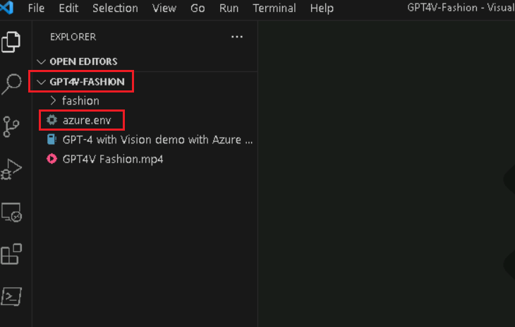
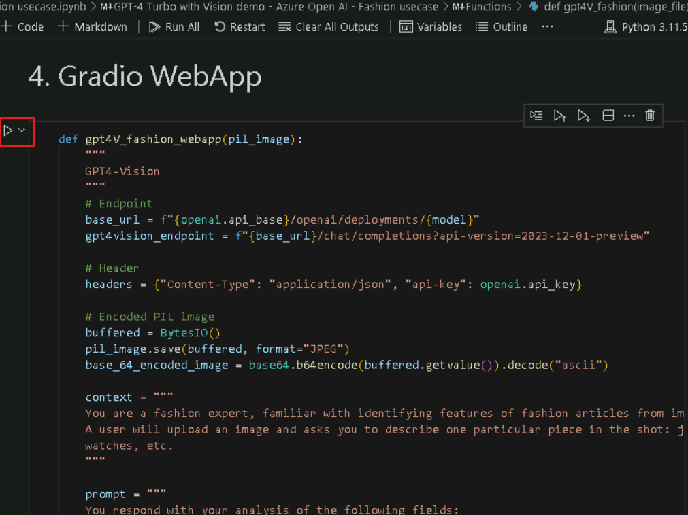
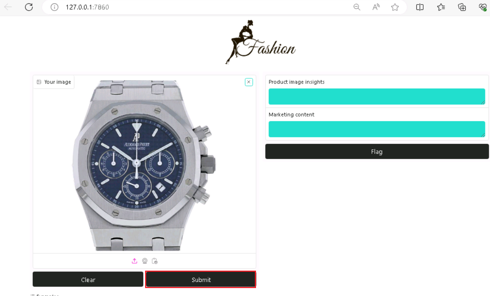

**ユースケース 01 - Azure OpenAI での GPT-4 Turbo と Vision
によるファッショントレンド分析**

**紹介：**

Azure OpenAI サービス上の GPT-4 Turbo with Vision がパブリック
プレビューになりました。GPT-4 Turbo with Visionは、OpenAIが開発したlarge
multimodal model
(LMM)で、画像を分析し、画像に関する質問に対してテキストで回答することができます。自然言語処理と視覚理解の両方が組み込まれています。拡張モードでは、Azure
AI Vision 機能を使用して、画像から追加の分析情報を生成できます

**目的：**

- Azure OpenAI リソースをデプロイして構成します。

- GPT-4 Vision などの特定の Azure OpenAI モデルをデプロイするため。

- Python、Jupyter
  Notebook、および必要なライブラリを使用して開発環境を設定します。

- このユースケースは、ファッションのユースケースに関連しています。これには、画像分析、テキスト生成、またはその他のAIタスクが含まれる場合があります。

## タスク 0: VM と資格情報を理解する

このタスクでは、ラボ全体で使用する資格情報を特定して理解します。

1.  **\[Instructions\]**
    タブには、ラボ全体に従うべき指示が記載されたラボガイドがあります。

2.  **\[Resources**\] タブには、ラボの実行に必要な資格情報があります。

    - **URL** – Azure portal の URL

    - **サブスクリプション** –
      これは、お客様に割り当てられたサブスクリプションの ID です

    - **ユーザー名** – Azure サービスにログインするために必要なユーザー
      ID。

    - **パスワード** – Azure
      ログインのパスワード。このユーザー名とパスワードを Azure
      ログイン資格情報と呼ぶことにします。これらのクレドは、Azure
      のログイン資格情報について言及するすべての場所で使用します。

    - **リソースグループ** – **自分に割り当てられた**リソースグループ。

\[!アラート\]**重要:**このリソースグループの下にすべてのリソースを作成してください

> 

3.  **\[Help** \] タブには、サポート情報が表示されます。ここでの **ID**
    値は、 **ラボの実行中に使用される**ラボ インスタンス ID です。

> 

## タスク 1 : サービスプロバイダーの登録

1.  ブラウザを開き、+++https://portal.azure.com++++に移動して、以下のクラウドスライスアカウントでサインインします。

> ユーザー名: <+++@lab.CloudPortalCredential>(User1).Username+++
>
> パスワード: <+++@lab.CloudPortalCredential(User1).Password>+++
>
> 
>
> 

2.  **Subscriptions** **タイル**をクリックします。

> 

3.  サブスクリプション名をクリックします。

> 

4.  左側のナビゲーションメニューから\[設定\]を展開します。\[**Resource
    providers\]
    をクリックし**、「+++**Microsoft.AlertsManagement+++」**と入力して
    \[i,t\] を選択し、\[**Register**\] をクリックします。

5.  \[**Resource providers\]
    をクリックし**、「+++**Microsoft.DBforPostgreSQL+++**」と入力して
    \[i,t\] を選択し、\[**Register**\] をクリックします。

6.  手順 \#10 と \#11 を繰り返して、次のリソース
    プロバイダーを登録します。

- Microsoft.Search

- Microsoft.Web

- Microsoft.ManagedIdentity

## **タスク 2: Azure OpenAI リソースを作成する**

1.  Azure portal で、 **次の図に示すように、ページの左上隅にある 3
    本の水平バーで表されるportal menu**をクリックします。

> 

2.  移動して **+ Create a resourceをクリックします**。

> 

3.  **Create a resource**ページの**Search services and
    marketplace**検索バーに「 **Azure OpenAI**」と入力し、 **Enter**
    キーを押します。

> 

4.  \[Marketplace**\]** ページで **\[Azure OpenAI**\]
    タイルに移動し、\[**Create**\] **の横にある \[V\] シェブロン
    ボタンをクリックして**から、次の図に示すように **Azure OpenAI**
    に移動してクリックします。

> 

5.  \[**Create Azure OpenAI**\] ウィンドウの \[**Basics**\]
    タブで、次の詳細を入力し、\[**Next\]** ボタンをクリックします。

    1.  **サブスクリプション**:
        割り当てられたサブスクリプションを選択します

    2.  **リソースグループ:** 割り当てられたリソースグループを選択します

    3.  **地域**: このラボでは、**gpt-4-vision**
        モデルを使用します。このモデルは現在、[certain
        regions](https://learn.microsoft.com/azure/ai-services/openai/concepts/models#embeddings-models)のみご利用いただけます。このリストから地域を選択してください。このラボでは、**スウェーデン中部が**このリソースに使用しています。

    4.  **名前**: **aoai-gpt4-visionXXXXX** (XXXXX は Lab のインスタント
        ID にすることができます)

    5.  **価格レベル**: **\[Standard S0\] を選択します**

> **注**: ラボのインスタント ID を見つけるには、\[Help\]
> を選択し、インスタント ID をコピーします。
>
> 
>
> 
>
> 

6.  \[Network\]
    タブで、すべてのラジオボタンをデフォルトの状態のままにして、\[Next\]ボタンをクリックします。

> 

7.  **\[Tags\]**
    タブで、すべてのフィールドをデフォルトの状態のままにして、\[**Next\]**
    ボタンをクリックします。

> 

8.  「Review +
    submit」タブで、検証に合格したら「Create」ボタンをクリックします。

> 

9.  デプロイが完了するまで待ちます。デプロイには約 2-3 分かかります。

10. Microsoft.CognitiveServicesOpenAI
    ウィンドウで、デプロイが完了したら、**Go to
    resource**ボタンをクリックします。

> 

11. 左側のナビゲーション メニューから \[**Keys and Endpoints**\]
    をクリックし 、メモ帳のエンドポイント値を **AzureAI
    ENDPOINT**にコピーし、キーを変数 AzureAIKey にコピーします。

> 

12. **aoai-gpt4-visionXX** ウィンドウで、 **左側のナビゲーション
    メニューの** \[**Overview**\] をクリックし、\[**Get Started\]**
    タイル**まで下にスクロールし、下の画像に示すように** \[AzureOpenAI
    Studio に移動\] ボタンをクリックして、**新しいブラウザーで** Azure
    OpenAI Studio を開きます。

## **タスク 3: Azure OpenAI モデル gpt-4-vision のデプロイ**

1.  **Azure AI Foundry |Azure Open AI Service** のホームページで、
    \[コンポーネント**\] セクションに移動し**、 \[デプロイ**\]
    をクリックします**。

2.  \[**Deployments\]** ウィンドウで、 **\[+ Deploy
    model\]を**ドロップダウンし、 \[**Deploy base model\]
    を選択します。**

3.  \[**Select a model**\] ダイアログ ボックスで、gpt-4
    をナビゲートして慎重に選択し、\[**Confirm\]**
    ボタンをクリックします。

4.  \[**Deploy model gpt-4**\] ダイアログボックスの \[**Deployment
    name**\] フィールドで、**gpt-4** で \[Deployment type\] を
    **\[Standard\] として選択**し、\[Model ersion\] を \[Vision-
    preview\]
    として選択していることを確認します。次に、\[**Deploy\]**ボタンをクリックします。

## タスク4:GPT-4 Turbo with Visionデモ

1.  Windowsの検索ボックスに「Visual Studio」と入力し、\[**Visual Studio
    Code\]をクリックします**。

> 

2.  Visual Studio Code**エディターで、\[File\]をクリックし**、\[**Open
    Folder**\]**に移動してクリックします**。

> 

3.  C:\LabFilesから**GPT4V-Fashion**フォルダ**に移動して選択**し、\[**Select
    Folder\]**ボタンをクリックします。

4.  ダイアログボックス- **Do you trust the authors of the files in this
    folder?** が表示されたら、\[ **Yes, I trust the
    author**\]をクリックします。

5.  Visual Studio Code で **Gpt 4V-FASHION**
    をドロップダウンし、**azure.env** ファイルをクリックします。

1.  パラメータを更新し**、Azure OpenAI Endpoint、Azure OpenAI
    Key(**タスク1**のメモ帳に保存した値**)を置き換えて、ファイルを保存します。

2.  Visual Studio Code で **GPT 4V-FASHION をドロップダウンし、GPT-4
    with Vision demo with Azure Open AI - Fashion usecase.ipynb**
    notebook**を選択します**。

> 

3.  Visual Studio
    Codeエディターのメインページで、**下にスクロールして要件の見出しをインストールし**、1番目のセルを実行します。
    環境を選択するように求められた場合は、 **図に示すように**\[Python
    Environments\]を選択します。

> 
>
> 

4.  パスを選択するように求められた場合は、**図に示すようにPython version
    3.11.5**のパスを選択します。

> 

5.  Windowsセキュリティアラートダイアログボックスが表示された場合は、\[**Allow
    access\]をクリックします**。

> 
>
> 
>
> 
>
> 

6.  Jupyter kernelを再起動するには、\[**Restart\]**
    ボタンをクリックします。

> 

7.  ライブラリをインポートするには、**4
    番目の**セルを選択します。次に、**開始アイコンをクリックして**セルを実行します。

> 

8.  **5
    番目の**セルを選択します。次に、**開始アイコンをクリックして**セルを実行します。

> 

9.  OpenAIのシステムバージョンを確認するには、**6番目**、7^(番目)、8^(番目)、9^(番目の)セルを選択します。次に、**開始アイコンをクリックして**セルを実行します。

> 

10. 設定値をロードするには、プレイボタンをクリックして**、10番目**、11番目、12番目のセルを選択して実行します。

> 

11. 埋め込みを作成するヘルパー関数を定義し、\[プレイ\]
    ボタンをクリックして 13 番目、14 **番目の**
    セルを選択して実行します。

> 
>
> 

12. この例を実行するには、\[プレイ\] ボタンをクリックして 15と
    16**番目の**セルを選択して実行します。

> 
>
> 

13. この例を実行するには、\[**プレイ**\] ボタンをクリックして **17
    番目と 18 番目の**セルを選択して実行します。

> 
>
> 

14. この例を実行するには、\[**プレイ**\] ボタンをクリックして **19
    番目と 20 番目の**セルを選択して実行します。

> 
>
> 

15. この例を実行するには、\[**Play\] ボタンをクリックして** 21 番目と 22
    番目の**セル**を選択して実行します。

> 
>
> 

16. この例を実行するには、\[**プレイ\] ボタンをクリックして 23 番目と
    24**番目の**セル**を選択して実行します。

> 

17. この例を実行するには、\[**プレイ**\] ボタンをクリックして **25
    番目と 26 番目の**セルを選択して実行します。

> 
>
> 

18. この例を実行するには、\[**プレイ**\] ボタンをクリックして **27
    番目と 28 番目の**セルを選択して実行します。

> 
>
> 

19. この例を実行するには、\[**プレイ**\] ボタンをクリックして **27
    番目と 28 番目の**セルを選択して実行します。

> 
>
> 

20. WebAppを生成するには、\[プレイ\]ボタンをクリックして**29番目の**セル**を選択して実行します**
    。

> 

21. WebAppを生成するには、\[プレイ\]ボタンをクリックして**30番目の**セル**を選択して実行します**
    。

> 

22. アプリケーションが正常にデプロイされると、ターミナルに URL
    が表示されます。**URLをコピーします**

23. ブラウザを開き、アドレスバーに移動して、PublickURLリンクを貼り付けます。
    

24. ブラウザを開き、アドレスバーに移動して、ローカルURLリンクを貼り付けます。
    どんなアイテムも選択できます。

25. 「**Submit」** ボタンをクリックします。

> 

## タスク 5: リソースの削除

1.  ストレージ アカウントを削除するには、**Azure portal のホーム**
    ページに移動し、 \[**Resource groups\] をクリックします**。

> 

2.  ResourceGroup1 **リソース グループ**をクリックします。

> 

3.  \[**Resource groups\]** ホーム ページで、**delete resource
    groupを選択します**

4.  右側に表示される **\[Delete Resources**\] ペインで、\[**Enter
    "resource group name" to confirm deletion**\]
    フィールドに移動し、\[**Delete\]** ボタンをクリックします。

5.  **Delete confirmation**
    ダイアログボックスで、\[**Delete**\]ボタンをクリックします。

> 

6.  ベルのアイコンをクリックすると、通知 –**Deleted resource group
    AOAI-RG89 が表示されます。**

**概要**

このハンズオン ラボでは、参加者は Azure OpenAI を使用して高度な AI
機能について詳しく説明します。重要な Azure
リソースのセットアップから始めて、GPT-4-vision などの AI
モデルをデプロイします。このラボでは、ビジョン機能を備えたGPT-4が、画像認識、パーソナライズされたスタイルの推奨、トレンド分析など、ファッション関連のタスクにどのように革命を起こすことができるかを具体的に探求しています。
