**Introduction**

Dans ce laboratoire, vous allez apprendre à intégrer les services Azure
AI à PostgreSQL pour améliorer votre base de données avec des
fonctionnalités d'IA avancées. En tirant parti de la puissance d'Azure
OpenAI et des extensions PostgreSQL telles que pgvector et PostGIS, vous
permettrez des analyses de texte sophistiquées, des recherches de
similarité vectorielle et des requêtes géospatiales directement dans
votre base de données. Ce laboratoire vous guide dans
l'approvisionnement des ressources Azure nécessaires, la configuration
de votre base de données et l'exécution de requêtes complexes qui
combinent des informations basées sur l'IA avec des données
géospatiales.**Objectifs**

- Pour approvisionner et configurer Azure Database pour PostgreSQL
  Flexible Server.

- Pour créer et gérer des intégrations de vecteurs à l'aide du service
  Azure OpenAI.

- Effectuer des recherches de similarité vectorielle afin de trouver des
  données textuelles sémantiquement similaires.

- Utiliser l'extension PostGIS pour l'analyse de données géospatiales.

- Intégrer les services Azure AI Language pour l'analyse des sentiments
  et d'autres fonctions cognitives.

- Optimiser et analyser les performances des requêtes à l'aide d'outils
  d'indexation et de planification des requêtes.

# Exercice 1 : Approvisionner une base de données Azure pour un serveur flexible PostgreSQL

1.  

## Tâche 1 : Approvisionner une base de données Azure pour un serveur flexible PostgreSQL

1.  Ouvrez votre navigateur, accédez à la barre d'adresse et tapez ou
    collez l'URL suivante : +++https://portal.azure.com/+++ puis appuyez
    sur le bouton **Enter**.

> 

2.  Dans la **window Microsoft Azure**, utilisez les **User
    Credentials** pour vous connecter à Azure.

3.  Ensuite, entrez le mot de passe et cliquez sur le bouton **Sign in**

> 

4.  Dans **Stay signed in ?** cliquez sur le bouton **Yes.**

> 

5.  Sélectionnez l'icône **Cloud Shell** dans la barre d'outils du
    portail Azure pour ouvrir un nouveau [volet Cloud
    Shell](https://learn.microsoft.com/azure/cloud-shell/overview) en
    haut de la window de votre navigateur.

6.  La première fois que vous ouvrez Cloud Shell, vous pouvez être
    invité à choisir le type de shell que vous souhaitez utiliser
    (**Bash** ou **PowerShell**). Sélectionnez **Bash**.

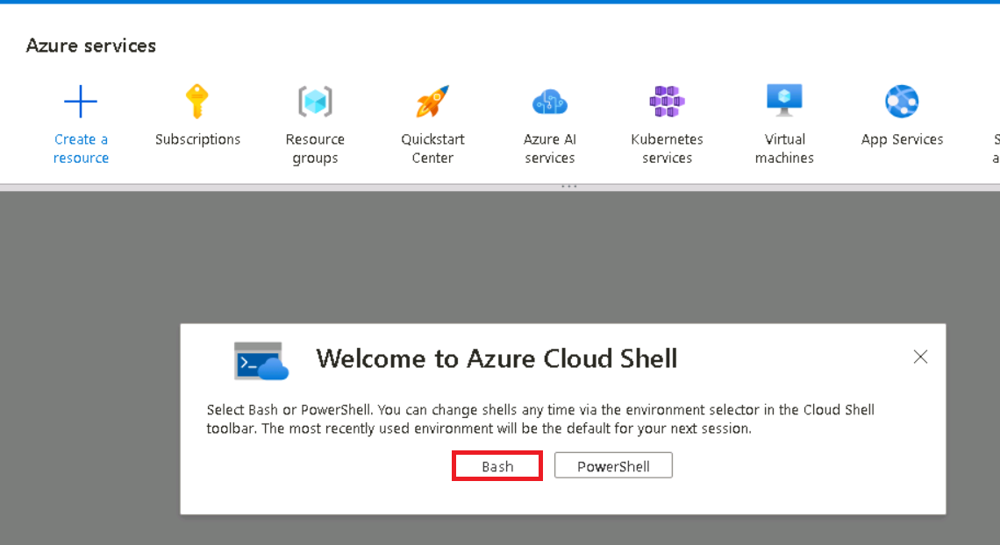

7.  Dans la boîte de dialogue **Getting started**, sélectionnez **Mount
    storage account,** puis sélectionnez votre abonnement Azure. Cliquez
    sur le bouton **Apply.**

8.  Dans la boîte de dialogue **Mount storage account**, sélectionnez
    **we will create a storage account for you** et cliquez sur le
    bouton **Next.**

> 
>
> 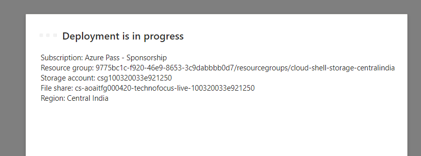

9.  À l'invite Cloud Shell, exécutez les commandes suivantes pour
    définir des variables pour la création de ressources. Les variables
    représentent les noms à attribuer à votre Resource group et à votre
    base de données et spécifient la région Azure dans laquelle les
    ressources doivent être déployées.

10. Le nom du Resource group spécifié est **rg-postgresql-labs**, mais
    vous pouvez fournir n'importe quel nom que vous souhaitez utiliser
    pour héberger les ressources associées à ce laboratoire.

> **+++RG_NAME=ResourceGroup1**
>
> 

11. Dans le nom de la base de données, remplacez le jeton {SUFFIX} par
    une valeur unique, telle que vos initiales, pour vous assurer que le
    nom du serveur de base de données est globalement unique.

> **+++DATABASE_NAME=pgsql-flex-{SUFFIX}+++**

12. Remplacez la région par l'emplacement que vous souhaitez utiliser
    pour les ressources de laboratoire. Dans ce laboratoire, nous
    utilisons eastus

> **+++REGION=eastus2+++**

13. Approvisionnez une instance de base de données Azure Database pour
    PostgreSQL au sein du Resource group que vous avez créé ci-dessus en
    exécutant la commande Azure CLI suivante (10 min)

**az postgres flexible-server create --name $DATABASE_NAME --location
$REGION --resource-group $RG_NAME \\**

**--admin-user s2admin --admin-password Seattle123Seattle123 --nom-base
de données airbnb \\**

**--public-access 0.0.0.0-255.255.255.255 --version 16 \\**

**--sku-name Standard_D2s_v3 --storage-size 32 --yes**

## Tâche 2 : Se connecter à la base de données à l'aide de psql dans Azure Cloud Shell

Dans cette tâche, vous allez utiliser l'[utilitaire de ligne de commande
psql](https://www.postgresql.org/docs/current/app-psql.html) d'[Azure
Cloud Shell](https://learn.microsoft.com/azure/cloud-shell/overview)
pour vous connecter à votre base de données.

1.  Ouvrez un navigateur, accédez à https://portal.azure.com et
    connectez-vous avec votre compte d'abonnement Azure.

2.  Sur la page d'accueil, cliquez sur **Resource Groups**

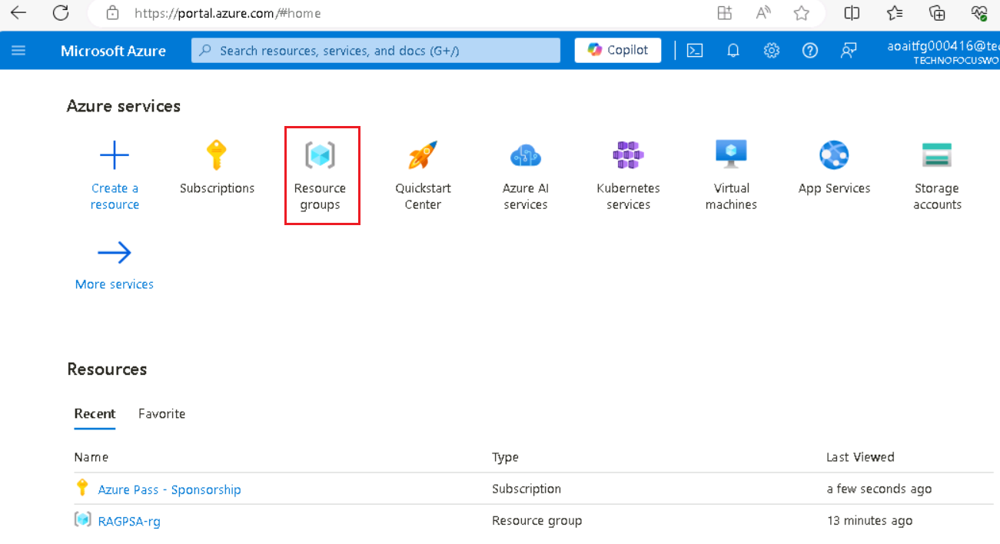

3.  Cliquez sur le nom de votre Resource group

> 

4.  Dans le Resource group , sélectionnez la ressource **PostgreSQL
    Flexible Server.**

5.  Dans le menu de navigation de gauche, sélectionnez Connect sous
    **Settings**.

6.  À partir de la page Connect de la base de données dans le portail
    Azure, sélectionnez **airbnb** pour le **Database name**, puis
    copiez le bloc **Connection details** et collez-le dans le
    bloc-notes pour utiliser les informations dans les tâches à venir.

> 

7.  Dans la page d'accueil d'Azure Database for PostgresSQL, cliquez sur
    **Overview** dans le menu de navigation de gauche, copiez le nom du
    serveur et ajoutez-le au bloc-notes, puis **Save** le bloc-notes
    pour utiliser les informations dans le laboratoire suivant.

8.  Dans la page d'accueil d'Azure Database for PostgreSQL, sélectionnez
    **Networking** sous Settings puis sélectionnez **Allow public access
    to this resource through the internet using a public IP
    address**.Cliquez sur le bouton **Save.**

9.  Sélectionnez l'**icône Cloud Shell** dans la barre d'outils du
    portail Azure pour ouvrir un nouveau [volet Cloud
    Shell](https://learn.microsoft.com/azure/cloud-shell/overview) en
    haut de la window de votre navigateur.

10. Collez **Connection details** dans Cloud Shell.

11. À l'invite Cloud Shell, remplacez le jeton **{your_password}** par
    le mot de passe que vous avez attribué à l' utilisateur **s2admin**
    lors de la création de votre base de données, le mot de passe doit
    être **Seattle123Seattle123**.

> 

12. Connectez-vous à votre base de données à l'aide de l'utilitaire de
    ligne de commande psql en entrant ce qui suit à l'invite :

> **+++psql+++**

La connexion à la base de données à partir de Cloud Shell nécessite que
la case Autoriser l'accès public à partir de n'importe quel service
Azure au sein d'Azure vers le serveur soit cochée sur la page
**Networking** de la base de données. Si vous recevez un message
indiquant que vous ne parvenez pas à vous connecter, vérifiez que cette
option est cochée et réessayez.

## Tâche 3 : Ajouter des données à la base de données

À l'aide de l'invite de commande psql, vous allez créer des tables et
les remplir avec des données à utiliser dans le laboratoire.

1.  Exécutez les commandes suivantes pour créer des tables temporaires
    pour l'importation de données JSON à partir d'un compte de stockage
    d'objets blob public.

> !! CREATE TABLE temp_calendar (data jsonb) ;
>
> CREATE TABLE temp_listings (data jsonb) ;
>
> CRÉER UNE TABLE temp_reviews (data jsonb) ;!!

2.  À l'aide de la commande COPY, remplissez chaque table temporaire
    avec des données provenant de fichiers JSON dans un compte de
    stockage public.

+++\COPY temp_calendar (data) FROM PROGRAM 'curl
https://solliancepublicdata.blob.core.windows.net/ms-postgresql-labs/calendar.json'+++

!!\COPY temp_listings (data) FROM PROGRAM 'curl
https://solliancepublicdata.blob.core.windows.net/ms-postgresql-labs/listings.json'!!

\COPY temp_reviews (data) FROM PROGRAM 'curl
https://solliancepublicdata.blob.core.windows.net/ms-postgresql-labs/reviews.json'

3.  Exécutez la commande suivante pour créer les tables de stockage des
    données dans la forme utilisée par ce laboratoire

> CREATE TABLE listings (
>
> listing_id int,
>
> name varchar(50),
>
> street varchar(50),
>
> city varchar(50),
>
> state varchar(50),
>
> country varchar(50),
>
> zipcode varchar(50),
>
> bathrooms int,
>
> bedrooms int,
>
> latitude decimal(10,5),
>
> longitude decimal(10,5),
>
> summary varchar(2000),
>
> description varchar(2000),
>
> host_id varchar(2000),
>
> host_url varchar(2000),
>
> listing_url varchar(2000),
>
> room_type varchar(2000),
>
> amenities jsonb,
>
> host_verifications jsonb,
>
> data jsonb
>
> );
>
> 
>
> CREATE TABLE reviews (
>
> id int,
>
> listing_id int,
>
> reviewer_id int,
>
> reviewer_name varchar(50),
>
> date date,
>
> comments varchar(2000)
>
> );
>
> CREATE TABLE calendar (
>
> listing_id int,
>
> date date,
>
> price decimal(10,2),
>
> available boolean
>
> );
>
> 

4.  Enfin, exécutez les instructions INSERT INTO suivantes pour charger
    les données des tables temporaires dans les tables principales, en
    extrayant les données du champ de données JSON dans des colonnes
    individuelles :

> INSERT INTO listings
>
> SELECT
>
> data\['id'\]::int,
>
> replace(data\['name'\]::varchar(50), '"', ''),
>
> replace(data\['street'\]::varchar(50), '"', ''),
>
> replace(data\['city'\]::varchar(50), '"', ''),
>
> replace(data\['state'\]::varchar(50), '"', ''),
>
> replace(data\['country'\]::varchar(50), '"', ''),
>
> replace(data\['zipcode'\]::varchar(50), '"', ''),
>
> data\['bathrooms'\]::int,
>
> data\['bedrooms'\]::int,
>
> data\['latitude'\]::decimal(10,5),
>
> data\['longitude'\]::decimal(10,5),
>
> replace(data\['description'\]::varchar(2000), '"', ''),
>
> replace(data\['summary'\]::varchar(2000), '"', ''),
>
> replace(data\['host_id'\]::varchar(50), '"', ''),
>
> replace(data\['host_url'\]::varchar(50), '"', ''),
>
> replace(data\['listing_url'\]::varchar(50), '"', ''),
>
> replace(data\['room_type'\]::varchar(50), '"', ''),
>
> data\['amenities'\]::jsonb,
>
> data\['host_verifications'\]::jsonb,
>
> data::jsonb
>
> FROM temp_listings;
>
> INSERT INTO reviews
>
> SELECT
>
> data\['id'\]::int,
>
> data\['listing_id'\]::int,
>
> data\['reviewer_id'\]::int,
>
> replace(data\['reviewer_name'\]::varchar(50), '"', ''),
>
> to_date(replace(data\['date'\]::varchar(50), '"', ''), 'YYYY-MM-DD'),
>
> replace(data\['comments'\]::varchar(2000), '"', '')
>
> FROM temp_reviews;
>
> INSERT INTO calendar
>
> SELECT
>
> data\['listing_id'\]::int,
>
> to_date(replace(data\['date'\]::varchar(50), '"', ''), 'YYYY-MM-DD'),
>
> data\['price'\]::decimal(10,2),
>
> replace(data\['available'\]::varchar(50), '"', '')::boolean
>
> FROM temp_calendar;

# Exercice 2 : Ajouter des extensions Azure AI et Vector à la liste d'autorisation

Tout au long de cet atelier, vous utiliserez les [extensions
azure_ai](https://learn.microsoft.com/azure/postgresql/flexible-server/generative-ai-azure-overview)
et
[pgvector](https://learn.microsoft.com/azure/postgresql/flexible-server/how-to-use-pgvector)
pour ajouter des fonctionnalités d'IA générative à votre base de données
PostgreSQL. Dans cet exercice, vous allez ajouter ces extensions à la
*liste d'autorisation de votre serveur*, comme décrit dans la section
[Utilisation des extensions
PostgreSQL](https://learn.microsoft.com/azure/postgresql/flexible-server/concepts-extensions#how-to-use-postgresql-extensions).

1.  Sur la page d'accueil, cliquez sur **Resource Groups**

2.  Cliquez sur le nom de votre resource group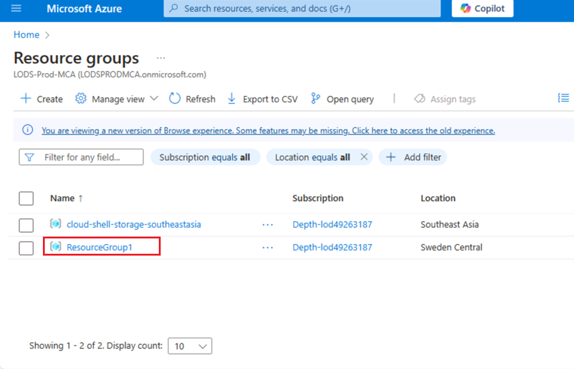

3.  Dans le resource group, sélectionnez la ressource **PostgreSQL
    Flexible Server**

4.  Dans le menu de navigation de gauche de la base de données,
    sélectionnez **Server parameters** sous **Settings**, puis entrez
    azure.extensions dans la zone de recherche. Développez la liste
    déroulante VALUE, puis recherchez et cochez la case en regard de
    chacune des extensions suivantes :

    - AZURE_AI

    - POSTGIS (Notez que cela sera déjà vérifié si vous avez terminé
      l'atelier 3.)

    - VECTEUR

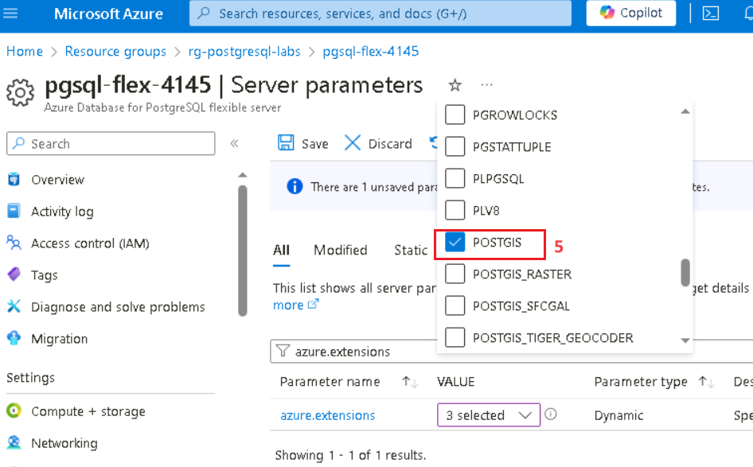

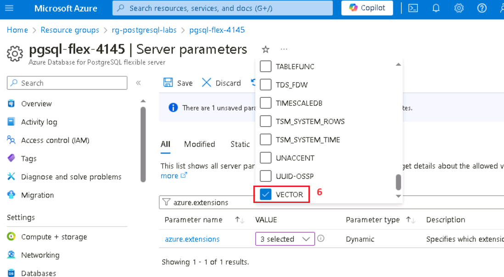

5.  Sélectionnez **Save** dans la barre d'outils, ce qui déclenchera un
    déploiement sur la base de données.

# Exercice 3 : Créer une ressource Azure OpenAI

L'extension azure_ai nécessite un service Azure OpenAI sous-jacent pour
créer des intégrations de vecteurs. Dans cet exercice, vous allez
provisionner une ressource Azure OpenAI dans le portail Azure et
déployer un modèle d'incorporation dans ce service.

## Tâche 1 : Approvisionner un service Azure OpenAI

Dans cette tâche, vous allez créer un service Azure OpenAI.

1.  À partir de la page d'accueil du portail Azure, cliquez sur le
    **menu du portail Azure** représenté par trois barres horizontales
    sur le côté gauche de la barre de commandes Microsoft Azure, comme
    illustré dans l'image ci-dessous.

> 

2.  Naviguez et cliquez sur **+ Create a resource.**

> 

3.  Dans la page **Create a resource**, dans la barre de recherche
    **Search services and marketplace**, tapez **Azure OpenAI,** puis
    appuyez sur le bouton **Enter**.

> 

4.  Sur la page **Marketplace**, accédez à la section **Azure OpenAI**,
    cliquez sur la liste déroulante du bouton Créer, puis sélectionnez
    **Azure OpenAI** comme indiqué dans l'image. (Au cas où vous auriez
    déjà cliqué sur l'icône **Azure OpenAI**, puis cliquez sur le bouton
    **Create** sur la **page Azure OpenAI**).

> 

5.  Sous l'onglet Create les **Basics** d'Azure OpenAI , entrez les
    informations suivantes et cliquez sur le bouton **Next**.

[TABLE]

> 

6.  Dans l' onglet **Network**, laissez toutes les cases d'option dans
    l'état par défaut et cliquez sur le bouton **Next.**

> 

7.  Dans l'onglet **Tags**, laissez tous les champs dans l'état par
    défaut et cliquez sur le bouton **Next.**

> 

8.  Dans l'onglet **Review + submit**, une fois la validation réussie,
    cliquez sur le bouton **Create**.

9.  Attendez la fin du déploiement. Le déploiement prendra environ 2 à 3
    minutes.

> **Remarque** : Si vous voyez un message indiquant que le service Azure
> OpenAI est actuellement disponible pour les clients via un formulaire
> d'application. L'abonnement sélectionné n'a pas été activé pour le
> service et n'a pas de quota pour les niveaux tarifaires ; vous devrez
> cliquer sur le lien pour demander l'accès au service Azure OpenAI et
> remplir le formulaire de demande.

## Tâche 2 : Récupérer la clé et le point de terminaison du service Azure OpenAI

1.  Sur la page Overview, sélectionnez le bouton **Go to resource**. Si
    vous y êtes invité, sélectionnez les informations d'identification
    du laboratoire :

2.  Dans votre window **Azure OpenAI home**, accédez à la section
    **Resource Management**, puis cliquez sur **Keys and Endpoints.**

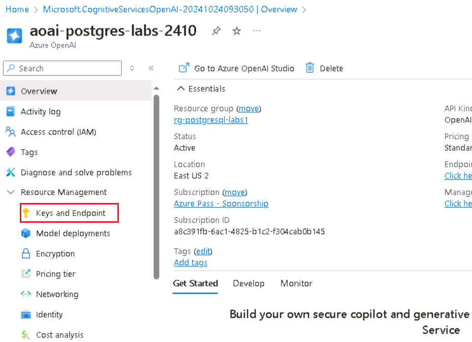

3.  Dans la page **Keys and Endpoints**, copiez les valeurs **KEY1, KEY
    2** et **Endpoint** et collez-les dans un bloc-notes comme illustré
    dans l'image ci-dessous, puis **save** le bloc-notes pour utiliser
    les informations dans les tâches à venir.

***Remarque :** Vous pouvez utiliser KEY1 ou KEY2. Le fait d'avoir
toujours deux clés vous permet de faire pivoter et de régénérer les clés
en toute sécurité sans provoquer d'interruption de service*.

## Tâche 3 : Déployer un modèle d'incorporation

L'extension azure_ai permet la création d'embeddings vectoriels à partir
de texte. Pour créer ces intégrations, vous devez déployer un modèle
text-embedding-ada-002 (version 2) au sein de votre service Azure
OpenAI. Dans cette tâche, vous allez utiliser Azure OpenAI Studio pour
créer un déploiement de modèle que vous pouvez utiliser.

1.  Dans la page **Azure OpenAI**, cliquez sur **Overview** dans le menu
    de navigation de gauche, faites défiler vers le bas et cliquez sur
    le bouton **Go to Azure OpenAI Studio**, comme illustré dans l'image
    ci-dessous.

> 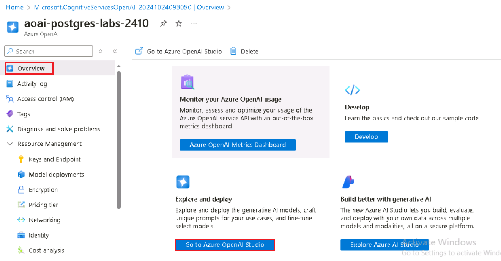
>
> 

2.  Sur Azure **AI Foundry |** Ouvrez la page d'accueil **d'Azure Open
    AI Service**, accédez à la section Composants et cliquez sur
    **Deployment**

3.  Dans la window **Deployment** déroulez le **+ Deploy model** et
    sélectionnez **Deploy base model.**

4.  Dans la boîte de dialogue **Select a model**, naviguez et
    sélectionnez soigneusement **text-embedding-ada-002** , puis cliquez
    sur le bouton **Confirm**

4.  Dans la boîte de dialogue **Deploy model**, définissez les éléments
    suivants et sélectionnez **Create** pour déployer le modèle.

    - **Sélectionnez un modèle** : Choisissez **text-embedding-ada-002**
      dans la liste.

    - **Version du modèle** : Assurez-vous que **2 (par défaut)** est
      sélectionné.

    - **Nom du déploiement** : Entrez **+++embeddings+++**

> 
>
> 

5.  Dans la window **Deployments**, copiez le **Deployment name** et
    collez-le dans un bloc-notes (comme illustré dans l'image), puis
    **save**le bloc-notes pour utiliser les informations dans la tâche à
    venir.

# Exercice 4 : Installer et configurer l'extension azure_ai

Dans cet exercice, vous allez installer l' extension azure_ai dans votre
base de données et la configurer pour qu'elle se connecte à votre
service Azure OpenAI.

## Tâche 1 : Se connecter à la base de données à l'aide de psql dans Azure Cloud Shell

Dans cette tâche, vous allez utiliser l'utilitaire de ligne de commande
psql d'Azure Cloud Shell pour vous connecter à votre base de données.

1.  Sélectionnez l' icône **Cloud Shell** dans la barre d'outils du
    portail Azure pour ouvrir un nouveau [volet Cloud
    Shell](https://learn.microsoft.com/azure/cloud-shell/overview) en
    haut de la window de votre navigateur.

2.  Les **Connection details** dans Cloud Shell.

3.  À l'invite Cloud Shell, remplacez le jeton **{your_password}** par
    le mot de passe que vous avez attribué à l'utilisateur **s2admin**
    lors de la création de votre base de données, le mot de passe doit
    être **Seattle123Seattle123**.

4.  Connectez-vous à votre base de données à l'aide de l' utilitaire de
    ligne de commande psql en entrant ce qui suit à l'invite :

> **!! psql !!**

## Tâche 2 : Installer l'extension azure_ai

L'extension azure_ai vous permet d'intégrer Azure OpenAI et Azure
Cognitive Services dans votre base de données. Pour activer l'extension
dans votre base de données, procédez comme suit :

1.  Vérifiez que l'extension a bien été ajoutée à la liste
    d'autorisation en exécutant ce qui suit à partir de l'invite de
    commande psql :

> **!! SHOW azure.extensions ;!!**

2.  Installez l'extension azure_ai à l'aide de la [commande CREATE
    EXTENSION](https://www.postgresql.org/docs/current/sql-createextension.html).

> **!!CREATE EXTENSION IF NOT EXISTS azure_ai;!!**

## Tâche 3 : Examiner les objets contenus dans l' extension azure_ai

L'examen des objets de l' extension azure_ai peut permettre de mieux
comprendre ses capacités. Dans cette tâche, vous allez inspecter les
différents schémas, fonctions définies par l'utilisateur (UDF) et types
composites ajoutés à la base de données par l'extension.

1.  Vous pouvez utiliser la [méta-commande
    \dx](https://www.postgresql.org/docs/current/app-psql.html#APP-PSQL-META-COMMAND-DX-LC)
    à partir de l'invite de **commande psql** pour répertorier les
    objets contenus dans l'extension.

> **+++\dx+ azure_ai+++**
>
> 
>
> 
>
> Le résultat de la méta-commande montre que l' extension azure_ai crée
> trois schémas, plusieurs fonctions définies par l'utilisateur (UDF) et
> plusieurs types composites dans la base de données. Le tableau
> ci-dessous répertorie les schémas ajoutés par l'extension et les
> décrit.

[TABLE]

2.  Les fonctions et les types sont tous associés à l'un des schémas.
    Pour passer en revue les fonctions définies dans le schéma azure_ai,
    utilisez la méta-commande \df, en spécifiant le schéma dont les
    fonctions doivent être affichées. La commande \x auto qui précède
    \df permet d'appliquer automatiquement l'affichage étendu si
    nécessaire pour faciliter l'affichage de la sortie de la commande
    dans Azure Cloud Shell.

> **!! \x auto !!**
>
> **\df+ azure_ai.\***

La fonction azure_ai.set_setting() vous permet de définir le point de
terminaison et les valeurs de clé pour les services Azure AI. Il accepte
une **key** et la **value** à lui attribuer. La fonction
azure_ai.get_setting() permet de récupérer les valeurs que vous avez
définies avec la fonction set_setting(). Il accepte la **clé** du
paramètre que vous souhaitez afficher. Pour les deux méthodes, la clé
doit être l'une des suivantes :

## Tâche 4 : Définir le point de terminaison et la clé Azure OpenAI

Avant d'utiliser les fonctions azure_openai, configurez l'extension à
votre point de terminaison et à votre clé de service Azure OpenAI.

1.  Dans la commande ci-dessous, remplacez les jetons {endpoint} et
    {api-key} par les valeurs que vous avez récupérées à partir du
    portail Azure, puis exécutez les commandes à partir de l'invite de
    commande psql dans le volet Cloud Shell pour ajouter vos valeurs à
    la table de configuration.

> **!! SELECT
> azure_ai.set_setting('azure_openai.endpoint','{endpoint}') ;**
>
> **SELECT azure_ai.set_setting('azure_openai.subscription_key',
> '{api-key}') ;!!**

2.  Vérifiez les paramètres écrits dans la table de configuration à
    l'aide des requêtes suivantes :

> +++SELECT azure_ai.get_setting('azure_openai.endpoint') ;

SELECT azure_ai.get_setting('azure_openai.clé_abonnement') ;+++

L'extension azure_ai est maintenant connectée à votre compte Azure
OpenAI et prête à générer des plongements de vecteurs.

# Exercice 5 : Générer des intégrations de vecteurs avec Azure OpenAI

Le schéma azure_openai de l'extension azure_ai permet à Azure OpenAI de
créer des plongements vectoriels pour les valeurs de texte. À l'aide de
ce schéma, vous pouvez [générer des intégrations avec Azure
OpenAI](https://learn.microsoft.com/azure/ai-services/openai/how-to/embeddings)
directement à partir de la base de données pour créer des
représentations vectorielles du texte d'entrée, qui peuvent ensuite être
utilisées dans des recherches de similarité vectorielle, ainsi que
consommées par des modèles d'apprentissage automatique.

[Les
intégrations](https://learn.microsoft.com/azure/postgresql/flexible-server/generative-ai-overview#embeddings)
sont un concept d'apprentissage automatique et de traitement du langage
naturel (NLP) qui consiste à représenter des objets, tels que des mots,
des documents ou des entités, sous forme [de
vecteurs](https://learn.microsoft.com/azure/postgresql/flexible-server/generative-ai-overview#vectors)
dans un espace multidimensionnel. Les intégrations permettent aux
modèles d'apprentissage automatique d'évaluer dans quelle mesure les
informations sont étroitement liées. Cette technique identifie
efficacement les relations et les similitudes entre les données, ce qui
permet aux algorithmes d'identifier des modèles et de faire des
prédictions précises.

## Tâche 1 : Activer la prise en charge des vecteurs avec l'extension pgvector

L'extension azure_ai vous permet de générer des plongements pour le
texte d'entrée. Pour permettre aux vecteurs générés d'être stockés avec
le reste de vos données dans la base de données, vous devez installer l'
extension pgvector en suivant les instructions de la [section Activer la
prise en charge des vecteurs dans la documentation de votre base de
données](https://learn.microsoft.com/azure/postgresql/flexible-server/how-to-use-pgvector#enable-extension).

1.  Installez l' extension pgvector à l'aide de la commande [CREATE
    EXTENSION](https://www.postgresql.org/docs/current/sql-createextension.html).

> **!!CREATE EXTENSION IF NOT EXISTS vector;!!**
>
> 

2.  Une fois le vecteur pris en charge ajouté à votre base de données,
    ajoutez une nouvelle colonne à la table des listes à l'aide du type
    de données vectoriel pour stocker les plongements dans la table. Le
    modèle text-embedding-ada-002 produit des vecteurs avec des
    dimensions de 1536, vous devez donc spécifier 1536 comme taille de
    vecteur.

+++**ALTER TABLE listings**

**ADD COLUMN description_vector vector(1536);+++**

## Tâche 2 : Générer et stocker des plongements de vecteurs

Le tableau des listes est maintenant prêt à stocker les intégrations. À
l'aide de la fonction azure_openai.create_embeddings(), vous créez des
vecteurs pour le champ de description et les insérez dans la colonne
description_vector nouvellement créée dans la table des listings.

1.  Avant d'utiliser la fonction create_embeddings(), exécutez la
    commande suivante pour l'inspecter et vérifier les arguments requis
    :

> **+++\df+ azure_openai.\*+++**

La propriété Types de données Argument dans la sortie de la commande
\df+ azure_openai.\* révèle la liste des arguments attendus par la
fonction.

[TABLE]

2.  À l'aide du nom du déploiement, exécutez la requête suivante pour
    mettre à jour chaque enregistrement dans la table des listes, en
    insérant les plongements de vecteurs générés pour le champ de
    description dans la colonne description_vector à l'aide de la
    fonction azure_openai.create_embeddings(). Remplacez
    {votre-nom-de-déploiement} par la valeur **Deployment name** que
    vous avez copiée à partir de la page **Deplyoment** d'Azure OpenAI
    Studio . Notez que cette requête prend environ cinq minutes.

> **DO $$**
>
> **DECLARE counter integer := (SELECT COUNT(\*) FROM listings WHERE
> description \<\> '' AND description_vector IS NULL);**
>
> **DECLARE r record;**
>
> **BEGIN**
>
> **RAISE NOTICE 'Total descriptions to embed: %', counter;**
>
> **WHILE counter \> 0 LOOP**
>
> **BEGIN**
>
> **FOR r IN**
>
> **SELECT listing_id FROM listings WHERE description \<\> '' AND
> description_vector IS NULL**
>
> **LOOP**
>
> **BEGIN**
>
> **UPDATE listings**
>
> **SET description_vector =
> azure_openai.create_embeddings('{your-deployment-name}',
> description)**
>
> **WHERE listing_id = r.listing_id;**
>
> **EXCEPTION**
>
> **WHEN OTHERS THEN**
>
> **RAISE NOTICE 'Waiting 1 second before trying again...';**
>
> **PERFORM pg_sleep(1);**
>
> **END;**
>
> **counter := (SELECT COUNT(\*) FROM listings WHERE description \<\> ''
> AND description_vector IS NULL);**
>
> **IF counter % 25 = 0 THEN**
>
> **RAISE NOTICE 'Remaining descriptions to embed: %', counter;**
>
> **END IF;**
>
> **END LOOP;**
>
> **END;**
>
> **END LOOP;**
>
> **END;**
>
> **$$;!!**
>
> 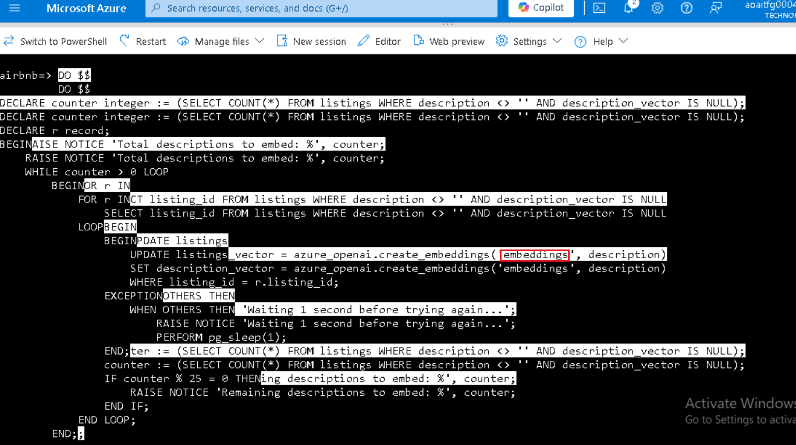
>
> La requête ci-dessus utilise une loop WHILE pour récupérer les
> enregistrements de la table des listes où le champ description_vector
> est null et le champ description n'est pas une chaîne vide. La requête
> tente ensuite de mettre à jour la colonne description_vector avec une
> représentation vectorielle de la colonne de description à l'aide de la
> fonction azure_openai.create_embeddings. La boucle est utilisée lors
> de l'exécution de cette mise à jour pour empêcher les appels à la
> fonction de création d'intégrations de dépasser la limite de débit
> d'appels du service Azure OpenAI. Si la limite de débit d'appel est
> dépassée, vous verrez des avertissements similaires à ce qui suit dans
> la sortie :
>
> **AVIS** : Attendre 1 seconde avant de réessayer...

> 

3.  Vous pouvez vérifier que la colonne description_vector a été
    renseignée pour tous les enregistrements d'annonces en exécutant la
    requête suivante :

**!!SELECT COUNT(\*) FROM listings WHERE description_vector IS NULL AND
description \<\> '';!!**

> Le résultat de la requête doit être un nombre de 0.

## Tâche 3 : Effectuer une recherche de similarité vectorielle

La similarité vectorielle est une méthode utilisée pour mesurer la
similarité entre deux éléments en les représentant sous forme de
vecteurs, c’est-à-dire une série de nombres. Les vecteurs sont souvent
utilisés pour effectuer des recherches à l’aide de modèles de langage
(LLM). La similarité vectorielle est généralement calculée à l’aide de
métriques de distance, comme la distance euclidienne ou la similarité
cosinus. La distance euclidienne mesure la distance en ligne droite
entre deux vecteurs dans un espace n-dimensionnel, tandis que la
similarité cosinus mesure le cosinus de l’angle entre deux vecteurs.
Chaque embedding est un vecteur de nombres à virgule flottante ; ainsi,
la distance entre deux embeddings dans l’espace vectoriel reflète la
similarité sémantique entre deux entrées dans leur format d’origine.

.

1.  Avant d'exécuter une recherche de similarité vectorielle, exécutez
    la requête ci-dessous à l'aide de la clause ILIKE pour observer les
    résultats de la recherche d'enregistrements à l'aide d'une requête
    en langage naturel sans utiliser de similarité vectorielle :

**SELECT listing_id, name, description FROM listings WHERE description
ILIKE '%Properties with a private room near Discovery Park%';!!**

> La requête ne renvoie aucun résultat, car elle tente de faire
> correspondre le texte du champ de description avec la requête en
> langage naturel fournie.

2.  Maintenant, exécutez une requête de [recherche de similarité
    cosinusoïdale](https://learn.microsoft.com/azure/ai-services/openai/concepts/understand-embeddings#cosine-similarity)
    sur la table des listes pour effectuer une recherche de similarité
    vectorielle sur les descriptions des listes. Les plongements sont
    générés pour une question d'entrée, puis convertis en un tableau de
    vecteurs ( ::vector), ce qui permet de le comparer aux vecteurs
    stockés dans la table des listes. Remplacez
    {votre-nom-de-déploiement} par la valeur **Deployment name** que
    vous avez copiée à partir de la page **Deployment** d'Azure OpenAI
    Studio .

> **!!SELECT listing_id, name, description FROM listings**
>
> **ORDER BY description_vector \<=\>
> azure_openai.create_embeddings('{your-deployment-name}', 'Properties
> with a private room near Discovery Park')::vector**
>
> **LIMIT 3;!!**

La requête utilise l'opérateur vectoriel
[\<=\>](https://github.com/pgvector/pgvector#vector-operators), qui
représente l'opérateur « distance cosinus » utilisé pour calculer la
distance entre deux vecteurs dans un espace multidimensionnel.

3.  Exécutez à nouveau la même requête à l'aide de la clause EXPLAIN
    ANALYZE pour afficher les temps de planification et d'exécution de
    la requête. Remplacez {votre-nom-de-déploiement} par la valeur
    **Deployment name** que vous avez copiée à partir de la page
    **Deployments** d'Azure OpenAI Studio .

> **!!EXPLAIN ANALYZE**
>
> **SELECT listing_id, name, description FROM listings**
>
> **ORDER BY description_vector \<=\>
> azure_openai.create_embeddings('{your-deployment-name}', 'Properties
> with a private room near Discovery Park')::vector**
>
> **LIMIT 3;!!**

Dans la sortie, notez le plan de requête, qui commencera par quelque
chose de similaire à :

> Limite (coût = 1098,54 1098,55 lignes = 3 largeur = 261) (temps réel =
> 10,505,.10,507 rangées = 3 boucles = 1)
>
> -\> Trier (coût=1098.54..1104.10 lignes=2224 largeur=261) (temps
> réel=10.504..10.505 lignes=3 boucles=1)
>
> ...
>
> Méthode de tri : top-N heapsort Mémoire : 27 Ko
>
> -\> Seq Scan sur les annonces (coût=0.00..1069.80 lignes=2224
> largeur=261) (temps réel=0.005..9.997 lignes=2224 boucles=1)
>
> La requête utilise un tri par balayage séquentiel pour effectuer la
> recherche. Les délais de planification et d'exécution seront indiqués
> à la fin des résultats et doivent ressembler à ce qui suit :
>
> Temps de planification : 62.020 ms
>
> Temps d'exécution : 10.530 ms

4.  Pour permettre une recherche plus efficace dans le champ vectoriel,
    créez un index sur les listes à l'aide de la distance cosinus et [de
    HNSW](https://github.com/pgvector/pgvector#hnsw), qui est
    l'abréviation de Hierarchical Navigable Small World. HNSW permet à
    pgvector d'utiliser les derniers algorithmes basés sur des graphes
    pour approximer les requêtes du voisin le plus proche.

**!!CREATE INDEX ON listings USING hnsw (description_vector
vector_cosine_ops);!!**

5.  Pour observer l'impact de l' index hnsw sur la table, exécutez à
    nouveau la requête avec la clause EXPLAIN ANALYZE pour comparer les
    temps de planification et d'exécution de la requête. Remplacez
    {votre-nom-de-déploiement} par la valeur **Deployment name** que
    vous avez copiée à partir de la page Deployment d'Azure OpenAI
    Studio .

> EXPLIQUER ANALYSER
>
> SELECT listing_id, name, description FROM listings
>
> ORDER BY description_vector \<=\>
> azure_openai.create_embeddings('{your-deployment-name}', 'Properties
> with a private room near Discovery Park')::vector
>
> LIMIT 3;

Dans la sortie, notez que le plan de requête inclut désormais une
analyse d'index plus efficace :

Limit (cost=116.48..119.33 rows=3 width=261) (actual time=1.112..1.130
rows=3 loops=1)

-\> Index Scan using listings_description_vector_idx on listings
(cost=116.48..2228.28 rows=2224 width=261) (actual time=1.111..1.128
rows=3 loops=1)

Les temps d'exécution de la requête doivent refléter une réduction
significative du temps nécessaire à la planification et à l'exécution de
la requête :

Temps de planification : 56.802 ms

Temps d'exécution : 1.167 ms

# Exercice 6 : Intégrer Azure AI Services

Les intégrations de services Azure AI incluses dans le schéma
azure_cognitive de l'extension azure_ai fournissent un ensemble complet
de fonctionnalités du langage AI accessibles directement à partir de la
base de données. Les fonctionnalités incluent l'analyse des sentiments,
la détection de la langue, l'extraction de phrases clés, la
reconnaissance d'entités et la synthèse de texte. Ces fonctionnalités
sont activées via le [service Azure AI
Language](https://learn.microsoft.com/azure/ai-services/language-service/overview).

Pour consulter la liste complète des fonctionnalités Azure AI
accessibles via l'extension, consultez la [documentation Intégrer Azure
Database pour PostgreSQL Flexible Server à Azure Cognitive
Services](https://learn.microsoft.com/azure/postgresql/flexible-server/generative-ai-azure-cognitive).

## Tâche 1 : Approvisionner un service Azure AI Language

Un service [Azure AI
Language](https://learn.microsoft.com/azure/ai-services/language-service/overview)
est requis pour tirer parti des fonctions cognitives des extensions
azure_ai. Dans cet exercice, vous allez créer un service Azure AI
Language.

1.  À partir de la page d'accueil du portail Azure, cliquez sur le
    **Azure portal menu** représenté par trois barres horizontales sur
    le côté gauche de la barre de commandes Microsoft Azure, comme
    illustré dans l'image ci-dessous.

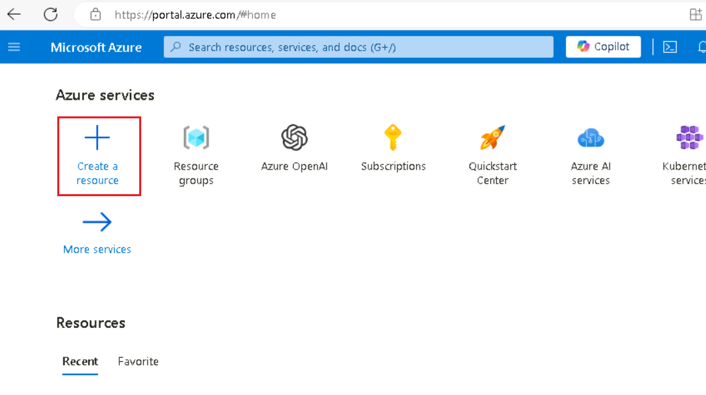

2.  Sur la page **Create a resource**, sélectionnez IA + Machine
    Learning dans le menu de gauche, puis sélectionnez **Language
    service**

3.  Dans la boîte de dialogue **Select additional features,**
    sélectionnez **Continue to create your resource.**

> 

4.  Dans l'onglet Create Langauge **Basics** , entrez ce qui suit :

[TABLE]

> 
>
> 

5.  Les paramètres par défaut seront utilisés pour les onglets restants
    de la configuration du service de langue, sélectionnez donc le
    bouton **Review + create**.

6.  Sélectionnez le bouton **Create** dans l' onglet **Review + craete**
    pour provisionner le service de langue.

> 

7.  Sélectionnez **Go to resource group** sur la page de déploiement
    lorsque le déploiement du service de langage est terminé.

## Tâche 2 : Définir le point de terminaison et la clé du service Azure AI Language

Comme pour les fonctions azure_openai, pour effectuer des appels sur les
services Azure AI à l'aide de l' extension azure_ai, vous devez fournir
le point de terminaison et une clé pour votre service Azure AI Language.

1.  Sur la page d'accueil Langue, sélectionnez l' élément **Keys and
    Endpoints** sous **Resource Management** dans le menu de navigation
    de gauche.

2.  Dans la page **Keys and Endpoints** , copiez les valeurs **KEY1, KEY
    2** et **Endpoint** et collez-les dans un bloc-notes comme illustré
    dans l'image ci-dessous, puis **save** le bloc-notes pour utiliser
    les informations dans les tâches à venir.

3.  Copiez les valeurs de votre point de terminaison et de votre clé
    d'accès, puis dans la commande ci-dessous, remplacez les jetons
    {endpoint} et {api-key} par les valeurs que vous avez récupérées à
    partir du portail Azure. Exécutez les commandes à partir de l'invite
    de commande psql dans Cloud Shell pour ajouter vos valeurs à la
    table de configuration.

> !! SELECT
> azure_ai.set_setting('azure_cognitive.endpoint','{endpoint}') ;
>
> SELECT azure_ai.set_setting('azure_cognitive.subscription_key',
> '{api-key}') ;!!

## Tâche 3 : Analyser le sentiment des avis

Dans cette tâche, vous allez utiliser la fonction
azure_cognitive.analyze_sentiment pour évaluer les avis sur les annonces
Airbnb.

1.  Pour effectuer une analyse des sentiments à l'aide du schéma
    azure_cognitive dans l' extension azure_ai, vous utilisez la
    fonction analyze_sentiment. Exécutez la commande ci-dessous pour
    examiner cette fonction :

> **!! \df azure_cognitive.analyze_sentiment !!**

La sortie affiche le schéma, le nom, le type de données de résultat et
les types de données d'argument de la fonction. Ces informations aident
à comprendre comment utiliser la fonction.

2.  Il est également essentiel de comprendre la structure du type de
    données de résultat généré par la fonction afin de pouvoir gérer
    correctement sa valeur de retour. Exécutez la commande suivante pour
    inspecter le type de sentiment_analysis_result :

> **+++\dT+ azure_cognitive.sentiment_analysis_result+++**

3.  Le résultat de la commande ci-dessus révèle que le type
    sentiment_analysis_result est un tuple. Pour comprendre la structure
    de ce tuple, exécutez la commande suivante pour examiner les
    colonnes contenues dans le type composite sentiment_analysis_result
    :

> **!! \d+ azure_cognitive.sentiment_analysis_result !!**

Le résultat de cette commande doit ressembler à ce qui suit :

> Type composite « azure_cognitive.sentiment_analysis_result »
>
> Chronique | Type | Collation | Nullable | Par défaut | Stockage |
> Description
>
> ----------------+------------------+-----------+----------+---------+----------+-------------
>
> Sentiment | Texte | | | | Prolongé |
>
> positive_score | double précision | | | | uni |
>
> neutral_score | double précision | | | | uni |
>
> negative_score | double précision | | | | uni |

L’ azure_cognitive.sentiment_analysis_result est un type composite
contenant les prédictions de sentiment du texte d'entrée. Il comprend le
sentiment, qui peut être positif, négatif, neutre ou mitigé, et les
scores pour les aspects positifs, neutres et négatifs trouvés dans le
texte. Les scores sont représentés sous forme de nombres réels entre 0
et 1. Par exemple, dans (neutre,0,26,0,64,0,09), le sentiment est neutre
avec un score positif de 0,26, neutre de 0,64 et négatif à 0,09.

4.  Maintenant que vous savez comment analyser le sentiment à l'aide de
    l'extension et de la forme du type de retour, exécutez la requête
    suivante qui recherche les avis extrêmement positifs :

WITH cte AS (

SELECT id, azure_cognitive.analyze_sentiment(comments, 'en') AS
sentiment FROM reviews LIMIT 100

)

SELECT

id,

(sentiment).sentiment,

(sentiment).positive_score,

(sentiment).neutral_score,

(sentiment).negative_score,

comments

FROM cte

WHERE (sentiment).positive_score \> 0.98

LIMIT 10;

La requête ci-dessus utilise une expression de table commune ou CTE pour
obtenir les scores de sentiment pour les trois premiers enregistrements
de la table des avis. Il sélectionne ensuite les colonnes de type
composite de sentiment dans le CTE pour extraire les valeurs
individuelles du sentiment_analysis_result.

# Exercice 7 : Exécuter une requête finale pour lier le tout 

Dans cet exercice, vous vous connectez à votre base de données dans
**pgAdmin** et exécutez une requête finale qui relie votre travail aux
extensions azure_ai, postgis et pgvector dans les labos 3 et 4.

## Tâche 1 : Installer pgAdmin

1.  Ouvrez un navigateur Web et accédez au
    !!https://www.pgadmin.org/download/pgadmin-4-windows/ !!

2.  Cliquez sur la dernière version de **pgAdmin**

3.  Sélectionnez **pgadmin4-8.9-x64.exe**

4.  Exécuter et installer le fichier téléchargé

5.  Sur l'onglet Select Install Mode, sélectionnez **Install for me only
    (recommended)**

6.  Cliquez sur le bouton **Next**

7.  Sélectionnez **I accept the agreement** et cliquez sur le bouton
    **Next**

8.  Sélectionnez le chemin d'accès et cliquez sur le bouton **Next**

9.  Dans la **window Setup-pgAdmin 4**, cliquez sur le bouton **Next**

10. Cliquez sur le bouton **Install**

11. Dans la **window Setup-pgAdmin 4**, cliquez sur le bouton **Finish**

## Tâche 2 : Se connecter à la base de données à l'aide de pgAdmin

Dans cette tâche, vous allez ouvrir pgAdmin et vous connecter à votre
base de données.

1.  Dans votre champ de recherche Windows, tapez **pgAdmin**, puis
    cliquez sur **pgAdmin**

2.  Enregistrez votre serveur en cliquant avec le bouton droit sur
    **Servers** dans l'Explorateur d'objets et en sélectionnant
    **Register \> Server**.

3.  Dans la boîte de dialogue **Register - Server**, collez le nom de
    votre serveur Azure Database for PostgreSQL Flexible Server (que
    vous avez enregistré dans l'exercice 1\> tâche 1) dans le **c**hamp
    **Name** de l' onglet **General** .

> 

4.  Ensuite, sélectionnez l'onglet **Connection** et collez le nom de
    votre serveur dans le champ **Hostname/address**. Entrez **s2admin**
    dans le champ **Username**, entrez **Seattle123Seattle123** dans la
    zone **Password**, et éventuellement, sélectionnez **Save
    password**.

> 

3.  Enfin, sélectionnez l'onglet **Paramètres** et définissez le **SSL
    mode** à **require**. Sélectionnez **Save** pour enregistrer votre
    serveur.

> 
>
> 

4.  Une fois connecté à votre serveur, développez le nœud **Databases**
    et sélectionnez la base de données **airbnb**. Faites un clic droit
    sur la base de données **airbnb** et sélectionnez **Query Tool**
    dans le menu contextuel.

> 
>
> 

## Tâche 3 : Vérifiez que l'extension PostGIS est installée dans votre base de données

Pour installer l' extension postgis dans votre base de données, vous
allez utiliser la commande CREATE EXTENSION.

1.  Dans la window de requête que vous avez ouverte ci-dessus, exécutez
    la commande CREATE EXTENSION avec la clause IF NOT EXISTS pour
    installer l' extension postgis dans votre base de données.

> CREATE EXTENSION IF NOT EXISTS postgis ;
>
> 
>
> Avec l' extension PostGIS maintenant chargée, vous êtes prêt à
> commencer à travailler avec des données géospatiales dans la base de
> données. Le tableau des annonces que vous avez créé et rempli
> ci-dessus contient la latitude et la longitude de toutes les
> propriétés répertoriées. Pour utiliser ces données à des fins
> d'analyse géospatiale, vous devez modifier la table des listes afin
> d'ajouter une colonne de géométrie qui accepte le type de données de
> point. Ces nouveaux types de données sont inclus dans l'extension
> postgis.

2.  Pour prendre en charge les données ponctuelles, ajoutez une nouvelle
    colonne de géométrie à la table qui accepte les données ponctuelles.
    Copiez et collez la requête suivante dans la window de requête
    pgAdmin ouverte :

> !!ALTER TABLE listings
>
> ADD COLUMN listing_location geometry(point, 4326);!!

3.  Ensuite, mettez à jour la table avec les données géospatiales
    associées à chaque liste en ajoutant les valeurs de longitude et de
    latitude dans la colonne de géométrie.

> !!UPDATE listings
>
> SET listing_location = ST_SetSRID(ST_Point(longitude, latitude),
> 4326);!!

## Tâche 4 : Exécuter une requête et afficher les résultats sur une carte

Dans cette tâche, vous exécutez une dernière requête qui relie votre
travail aux labos 3 et 4.

1.  Exécutez la requête ci-dessous qui intègre des éléments des
    extensions azure_ai, pgvector et PostGIS avec lesquelles vous avez
    travaillé dans les labos 3 et 4. Remplacez
    {votre-nom-de-déploiement} par la valeur **Deployment name** que
    vous avez copiée à partir de la page **Deployments** d'Azure OpenAI
    Studio .

> !!WITH listings_cte AS (
>
> SELECT l.listing_id, name, listing_location, summary FROM listings l
>
> INNER JOIN calendar c ON l.listing_id = c.listing_id
>
> WHERE ST_DWithin(
>
> listing_location,
>
> ST_GeomFromText('POINT(-122.410347 47.655598)', 4326),
>
> 0.025
>
> )
>
> AND c.date = '2016-01-13'
>
> AND c.available = 't'
>
> AND c.price \<= 75.00
>
> AND l.listing_id IN (SELECT listing_id FROM reviews)
>
> ORDER BY description_vector \<=\>
> azure_openai.create_embeddings('{your-deployment-name}', 'Properties
> with a private room near Discovery Park')::vector
>
> LIMIT 3
>
> ),
>
> sentiment_cte AS (
>
> SELECT r.listing_id, comments,
> azure_cognitive.analyze_sentiment(comments, 'en') AS sentiment
>
> FROM reviews r
>
> INNER JOIN listings_cte l ON r.listing_id = l.listing_id
>
> )
>
> SELECT
>
> l.listing_id,
>
> name,
>
> listing_location,
>
> summary,
>
> avg((sentiment).positive_score) as avg_positive_score,
>
> avg((sentiment).neutral_score) as avg_neutral_score,
>
> avg((sentiment).negative_score) as avg_negative_score
>
> FROM sentiment_cte s
>
> INNER JOIN listings_cte l on s.listing_id = l.listing_id
>
> GROUP BY l.listing_id, name, listing_location, summary;!!

2.  Dans le panneau **Data Output**, sélectionnez le bouton **View all
    geometries in this column** affiché dans la colonne listing_location
    des résultats de la requête.

Le bouton **View all geometries in this column** ouvre le **Geometry
Viewer**, qui vous permet d'afficher les résultats de la requête sur une
carte.

3.  Sélectionnez l'un des trois points affichés sur la carte pour
    afficher des détails sur l'emplacement, y compris les scores de
    sentiment positifs moyens, neutres et négatifs pour toutes les
    évaluations de l'établissement.

## Tâche 5 : Nettoyer les ressources 

Il est essentiel que vous nettoyiez toutes les ressources que vous avez
créées pour ces labos une fois que vous les avez terminés. La capacité
configurée vous est facturée, et non la quantité utilisée par la base de
données. Pour supprimer votre Resource group et toutes les ressources
que vous avez créées pour cet atelier, suivez les instructions
ci-dessous :

Pour éviter d'encourir des coûts Azure inutiles, vous devez supprimer
les ressources que vous avez créées dans ce guide de démarrage rapide si
elles ne sont plus nécessaires. Pour gérer les ressources, vous pouvez
utiliser le [portail
Azure](https://portal.azure.com/?azure-portal=true).

1.  Pour supprimer le compte de stockage, accédez à la page **Azure
    portal Home**, puis cliquez sur Resource groups.

> 

2.  Cliquez sur le Resource group que vous avez créé.

> 

3.  Dans la page d'accueil du **Resource group** , sélectionnez le
    **delete** r**esource group** .

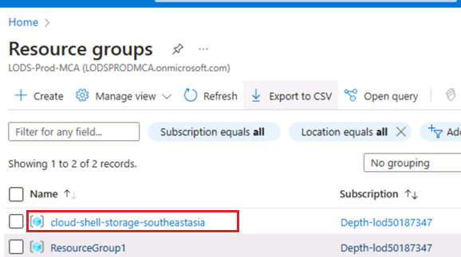

4.  Dans le volet **Delete Resources** qui s'affiche sur le côté droit,
    accédez à **Entre « resource group name » to confirm deletion** ,
    puis cliquez sur le bouton **Delete**.

5.  Dans la boîte de dialogue de **Delete confirmation** , cliquez sur
    le bouton **Delete**.

> 

6.  Cliquez sur l'icône en forme de cloche, vous verrez la notification
    –**Deleted resource group AOAI-RG89.**

**Résumé**

Dans ce laboratoire , vous avez réussi à intégrer les services Azure AI
à PostgreSQL pour créer un puissant environnement de base de données
basé sur l'IA. Vous avez commencé par approvisionner les ressources
Azure et configurer votre base de données PostgreSQL avec les extensions
nécessaires. Vous avez ensuite généré des plongements vectoriels pour
les données textuelles et effectué des recherches de similarité
vectorielle pour trouver des enregistrements sémantiquement similaires.
En outre, vous avez utilisé l'extension PostGIS pour l'analyse des
données géospatiales et le service Azure AI Language pour l'analyse des
sentiments. Enfin, vous avez optimisé vos requêtes à l'aide de
l'indexation et analysé leurs performances, démontrant ainsi
l'efficacité et la capacité de cette solution intégrée d'analyse avancée
des données.
