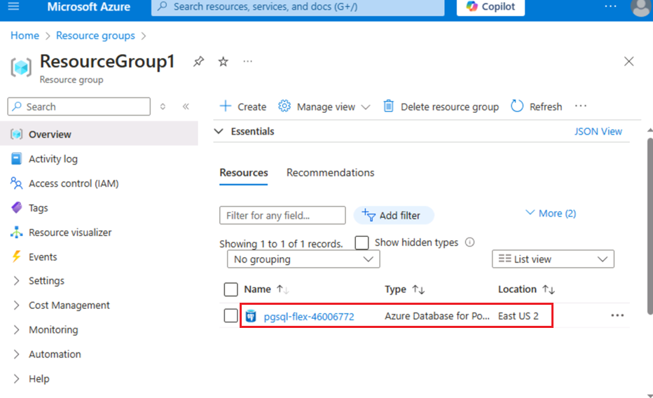
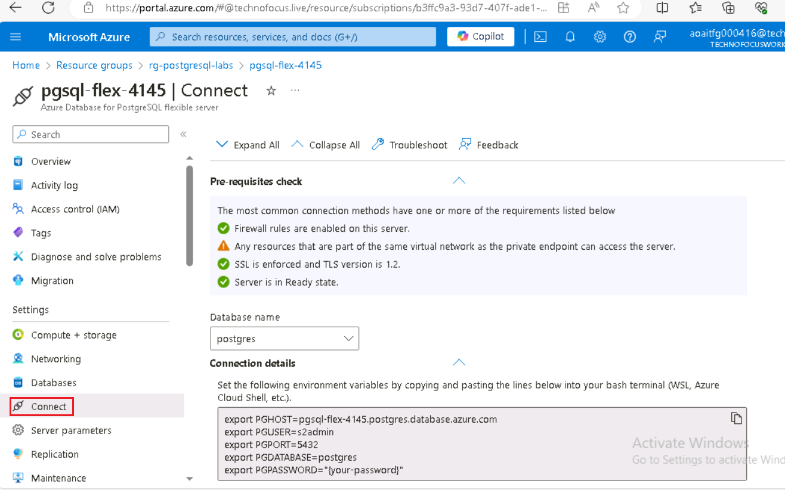
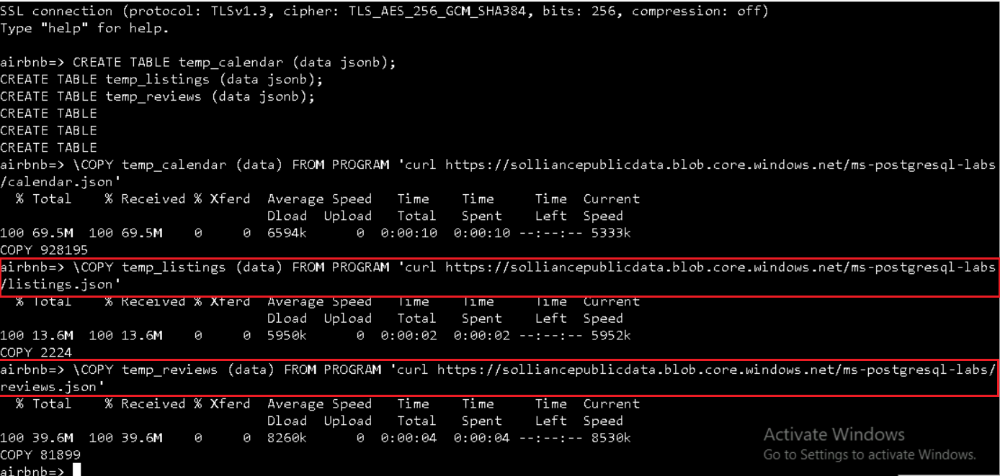
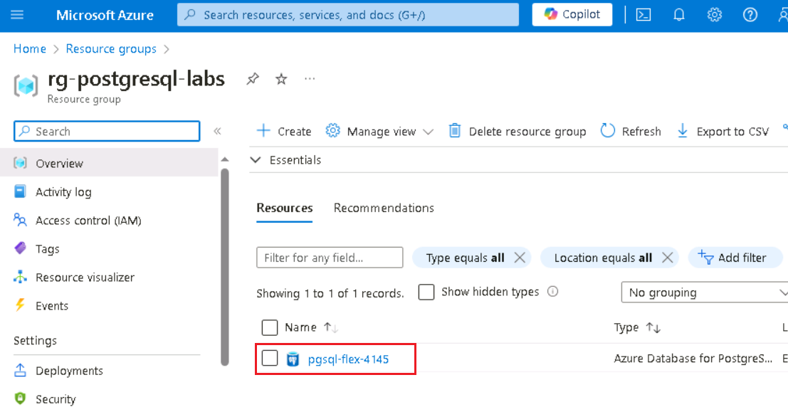
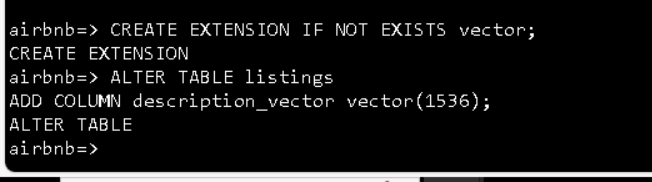
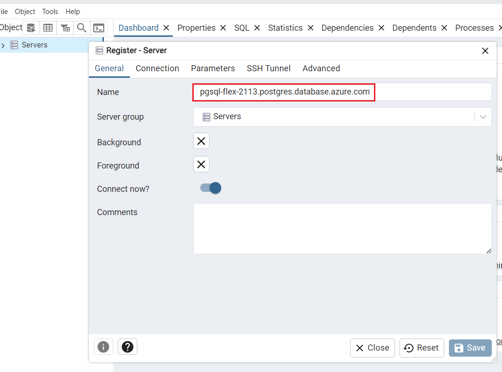
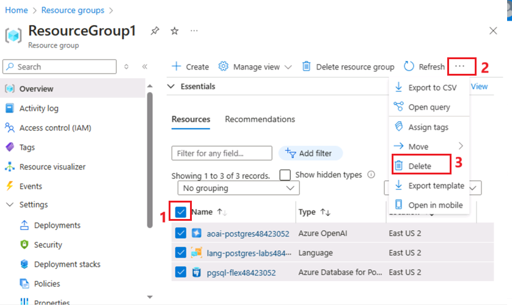

**紹介**

このラボでは、Azure AI サービスを PostgreSQL と統合して、高度な AI
機能でデータベースを強化する方法を学習します。Azure OpenAI と PostgreSQL
拡張機能 (pgvector や PostGIS など)
を活用することで、高度なテキスト分析、ベクトル類似性検索、地理空間クエリをデータベース内で直接行うことができます。このラボでは、必要な
Azure リソースのプロビジョニング、データベースの構成、AI
主導の分析情報と地理空間データを組み合わせた複雑なクエリの実行について説明します。**目標**

- Azure Database for PostgreSQL フレキシブル
  サーバーをプロビジョニングして構成します。

- Azure OpenAI
  サービスを使用してベクター埋め込みを作成および管理します。

- 意味的に類似したテキストデータを見つけるためにベクトル類似性検索を実行する。

- PostGIS拡張機能を地理空間データ分析に利用する。

- Azure AI
  Languageサービスを統合して、感情分析やその他の認知機能を実現する。

- インデックス作成ツールとクエリ計画ツールを使用して、クエリのパフォーマンスを最適化および分析します。

# 演習 1: Azure Database for PostgreSQL フレキシブル サーバーをプロビジョニングする

1.  

## タスク 1: Azure Database for PostgreSQL フレキシブル サーバーのプロビジョニング

1.  ブラウザを開き、アドレスバーに移動して、次のURLを入力または貼り付けます:
    +++https://portal.azure.com/+++、Enter ボタンを押します。

> 

2.  **Microsoft
    Azure**ウィンドウで、**ユーザー資格情報を使用して**Azureにログインします。

3.  次に、パスワードを入力して\[**Sign
    in\]**ボタンをクリックします**。**

> 

4.  **Stay signed in?**ウィンドウで、\[**Yes\]**ボタンをクリックします。

> 

5.  Azure portal ツール バーで **Cloud Shell**
    アイコンを選択して、[ブラウザー
    ウィンドウの上部に](https://learn.microsoft.com/azure/cloud-shell/overview)新しい
    Cloud Shell ウィンドウを開きます。

6.  Cloud Shell を初めて開くときに、使用するシェルの種類 (**Bash**
    または **PowerShell**)
    を選択するように求められる場合があります。\[**Bash\]**
    を選択します。

7.  \[**Getting started**\] ダイアログ ボックスで、 \[**Mount storage
    account**\] を選択し、Azure
    サブスクリプションを選択します。「**Apply」**ボタンをクリックします**。**

8.  \[**Mount storage account**\] ダイアログ ボックスで、\[**we will
    create a storage account for you\] を選択し**、\[**Next\]**
    ボタンをクリックします。

> 
>
> 

1.  クラウド・シェル・プロンプトで、次のコマンドを実行して、リソースを作成するための変数を定義します。変数は、リソース
    グループとデータベースに割り当てる名前を表し、リソースをデプロイする
    Azure リージョンを指定します。

2.  指定されたリソースグループ名は **rg-postgresql-labs**
    ですが、このラボに関連付けられたリソースをホストするために使用する任意の名前を指定できます。

**+++RG_NAME=ResourceGroup1**

> 

3.  データベース名で、{SUFFIX}
    トークンを自分のイニシャルなどの一意の値に置き換えて、データベース・サーバ名がグローバルに一意になるようにします。

> **+++DATABASE_NAME=pgsql-flex-{ SUFFIX }+++**

4.  リージョンを、ラボ
    リソースに使用する任意の場所に置き換えます。このラボでは、eastus
    を使用しています

> **+++ REGION =eastus2+++**

5.  次の Azure CLI コマンドを実行して、上記で作成したリソース
    グループ内に Azure Database for PostgreSQL データベース
    インスタンスをプロビジョニングします (10 分)

**az postgres flexible-server create --name $DATABASE_NAME --location
$REGION --resource-group $RG_NAME \\**

**--admin-user s2admin --admin-password Seattle123Seattle123
--database-name airbnb \\**

**-- public-access 0.0.0.0-255.255.255.255 --version 16 \\**

**--SKU-name Standard_D2s_v3 --storage-size 32 --yes**

## タスク 2: Azure Cloud Shell で psql を使用してデータベースに接続する

このタスクでは、[Azure Cloud
Shell](https://www.postgresql.org/docs/current/app-psql.html) の [psql
コマンドライン
ユーティリティ](https://learn.microsoft.com/azure/cloud-shell/overview)を使用してデータベースに接続します。

1.  ブラウザーを開き、\[https://portal.azure.com\] に移動して 、Azure
    サブスクリプション アカウントでサインインします。

2.  ホームページで、「**Resource Groups」をクリックします**。

3.  リソース・グループ名をクリックします

> 

4.  リソース グループで、**PostgreSQL Flexible
    Server**リソースを選択します

5.  左側のナビゲーション メニューで、**設定** の下の
    **Connect** **を選択します**。

6.  Azure ポータルのデータベースの \[Connect \]
    ページで、\[データベース名\] に \[airbnb\] を選択し、\[接続の詳細\]
    ブロックをコピーしてメモ帳に貼り付け、今後のタスクで情報を使用します。

> 

7.  Azure Database for PostgresSQL ホーム ページで、左側のナビゲーション
    メニューの \[**Overview\] をクリックし**
    、サーバー名をコピーしてメモ帳に貼り付け、
    メモ帳**を保存し**て、今後のラボで情報を使用します。

8.  Azure Database for PostgreSQL ホーム ページで、設定の
    \[**Networking**\] を選択し、 **Allow public access to this resource
    through the internet using a public IP
    address**を選択します。「**Save**」ボタンをクリックします。

9.  Azure portal ツール バーで **Cloud Shell**
    アイコンを選択して、[ブラウザー
    ウィンドウの上部に](https://learn.microsoft.com/azure/cloud-shell/overview)新しい
    Cloud Shell ウィンドウを開きます。

10. **Connection details** **を** Cloud Shell に貼り付けます。

![Azure Cosmos DB クラスター リソースの \[接続文字列\]
ページが強調表示されます。\[接続文字列\] ページでは、psql
接続文字列の右側にある \[クリップボードにコピー\]
ボタンが強調表示されます。](./media/image22.png)

11. Cloud Shell プロンプトで、**{your_password}**
    トークンをデータベースの作成時に **s2admin**
    ユーザーに割り当てたパスワードに置き換え、パスワードは
    **Seattle123Seattle123 にする必要があります**。

> 

12. psql
    コマンドラインユーティリティを使用してデータベースに接続するには、プロンプトで次のように入力します。

> **+++psql+++**

Cloud Shell からデータベースに接続するには、データベースの
\[ネットワーク\] ページで \[Azure 内の任意の Azure
サービスからサーバーへのパブリックアクセスを許可する\] チェック
ボックスがオンになっている必要があります。接続できないというメッセージが表示された場合は、これがオンになっていることを確認して、もう一度お試しください。

## タスク 3: データベースへのデータの追加

psql
コマンド・プロンプトを使用して、テーブルを作成し、ラボで使用するデータをテーブルに入力します。

1.  次のコマンドを実行して、パブリック BLOB ストレージ アカウントから
    JSON データをインポートするための一時テーブルを作成します。

> !!CREATE TABLE temp_calendar (data jsonb);
>
> CREATE TABLE temp_listings (data jsonb);
>
> CREATE TABLE temp_reviews (data jsonb);!!

2.  COPY
    コマンドを使用して、各一時テーブルにパブリックストレージアカウントの
    JSON ファイルのデータを移入します。

+++\COPY temp_calendar (data) FROM PROGRAM 'curl
https://solliancepublicdata.blob.core.windows.net/ms-postgresql-labs/calendar.json'+++

!!\COPY temp_listings (data) FROM PROGRAM 'curl
https://solliancepublicdata.blob.core.windows.net/ms-postgresql-labs/listings.json'!!

\COPY temp_reviews (data) FROM PROGRAM 'curl
https://solliancepublicdata.blob.core.windows.net/ms-postgresql-labs/reviews.json'

3.  次のコマンドを実行して、このラボで使用する図形にデータを格納するためのテーブルを作成します。

> CREATE TABLE listings (
>
> listing_id int,
>
> name varchar(50),
>
> street varchar(50),
>
> city varchar(50),
>
> state varchar(50),
>
> country varchar(50),
>
> zipcode varchar(50),
>
> bathrooms int,
>
> bedrooms int,
>
> latitude decimal(10,5),
>
> longitude decimal(10,5),
>
> summary varchar(2000),
>
> description varchar(2000),
>
> host_id varchar(2000),
>
> host_url varchar(2000),
>
> listing_url varchar(2000),
>
> room_type varchar(2000),
>
> amenities jsonb,
>
> host_verifications jsonb,
>
> data jsonb
>
> );
>
> 
>
> CREATE TABLE reviews (
>
> id int,
>
> listing_id int,
>
> reviewer_id int,
>
> reviewer_name varchar(50),
>
> date date,
>
> comments varchar(2000)
>
> );
>
> CREATE TABLE calendar (
>
> listing_id int,
>
> date date,
>
> price decimal(10,2),
>
> available boolean
>
> );
>
> 

4.  最後に、次の INSERT INTO
    ステートメントを実行して、一時テーブルからメイン
    テーブルにデータを読み込み、JSON データ
    フィールドから個々の列にデータを抽出します。

> INSERT INTO listings
>
> SELECT
>
> data\['id'\]::int,
>
> replace(data\['name'\]::varchar(50), '"', ''),
>
> replace(data\['street'\]::varchar(50), '"', ''),
>
> replace(data\['city'\]::varchar(50), '"', ''),
>
> replace(data\['state'\]::varchar(50), '"', ''),
>
> replace(data\['country'\]::varchar(50), '"', ''),
>
> replace(data\['zipcode'\]::varchar(50), '"', ''),
>
> data\['bathrooms'\]::int,
>
> data\['bedrooms'\]::int,
>
> data\['latitude'\]::decimal(10,5),
>
> data\['longitude'\]::decimal(10,5),
>
> replace(data\['description'\]::varchar(2000), '"', ''),
>
> replace(data\['summary'\]::varchar(2000), '"', ''),
>
> replace(data\['host_id'\]::varchar(50), '"', ''),
>
> replace(data\['host_url'\]::varchar(50), '"', ''),
>
> replace(data\['listing_url'\]::varchar(50), '"', ''),
>
> replace(data\['room_type'\]::varchar(50), '"', ''),
>
> data\['amenities'\]::jsonb,
>
> data\['host_verifications'\]::jsonb,
>
> data::jsonb
>
> FROM temp_listings;
>
> INSERT INTO reviews
>
> SELECT
>
> data\['id'\]::int,
>
> data\['listing_id'\]::int,
>
> data\['reviewer_id'\]::int,
>
> replace(data\['reviewer_name'\]::varchar(50), '"', ''),
>
> to_date(replace(data\['date'\]::varchar(50), '"', ''), 'YYYY-MM-DD'),
>
> replace(data\['comments'\]::varchar(2000), '"', '')
>
> FROM temp_reviews;
>
> INSERT INTO calendar
>
> SELECT
>
> data\['listing_id'\]::int,
>
> to_date(replace(data\['date'\]::varchar(50), '"', ''), 'YYYY-MM-DD'),
>
> data\['price'\]::decimal(10,2),
>
> replace(data\['available'\]::varchar(50), '"', '')::boolean
>
> FROM temp_calendar;

# 演習 2: Azure AI とベクターの拡張機能を許可リストに追加する

このラボでは、[azure_ai](https://learn.microsoft.com/azure/postgresql/flexible-server/generative-ai-azure-overview)
拡張機能と
[pgvector](https://learn.microsoft.com/azure/postgresql/flexible-server/how-to-use-pgvector)
拡張機能を使用して、PostgreSQL データベースにgenerative AI
機能を追加します。この演習では、*PostgreSQL
拡張機能の使用方法*で説明されているように、これらの拡張機能をサーバーの[許可リストに追加します](https://learn.microsoft.com/azure/postgresql/flexible-server/concepts-extensions#how-to-use-postgresql-extensions)。

1.  ホームページで、「**Resource Groups」をクリックします**。

2.  リソース・グループ名をクリックします

> 

3.  リソース グループで、**PostgreSQL Flexible Server**
    リソースを選択します

4.  データベースの左側のナビゲーション メニューから、 **\[設定**\] の
    **\[Server parameters** \]
    を選択し、検索ボックスに「azure.extensions」と入力します
    。\[**VALUE**\]
    ドロップダウンリストを展開し、次の各拡張機能の横にあるボックスを見つけてチェックします。

    - AZURE_AI

    - POSTGIS (ラボ 3
      を完了している場合は、すでにチェックされていることに注意してください。

    - VECTOR

5.  ツールバーの \[**Save**\] を選択すると
    、データベースへのデプロイがトリガーされます。

# 演習 3: Azure OpenAI リソースを作成する

azure_ai 拡張機能では、ベクター埋め込みを作成するために、基になる Azure
OpenAI サービスが必要です。この演習では、Azure portal で Azure OpenAI
リソースをプロビジョニングし、そのサービスに埋め込みモデルをデプロイします。

## タスク 1: Azure OpenAI サービスをプロビジョニングする

このタスクでは、新しい Azure OpenAI サービスを作成します。

1.  Azure ポータルのホーム ページで、 **次の図に示すように、Microsoft
    Azure コマンド バーの左側にある 3 本の水平バーで表される** Azure
    ポータル メニューをクリックします。

> 

2.  移動して **+ Create a resourceをクリックします**。

> 

3.  **Create a resource**ページの **\[検索サービスとマーケットプレース**
    \] 検索バーに「 **Azure OpenAI**」と入力し、 **Enter**
    キーを押します。

> 

4.  \[Marketplace\] ページで、\[Azure
    OpenAI\]セクションに移動し、\[Create\]ボタンのドロップダウンをクリックして、図に示すように\[Azure
    OpenAI\]を選択します。(すでにAzure OpenAI
    タイルをクリックしている場合は、Azure OpenAI ページの \[**Create**\]
    ボタンをクリックします。

> 

5.  \[Azure OpenAI の基本の作成\] タブで、次の情報を入力し、\[**Next\]**
    ボタンをクリックします。

[TABLE]

> 

6.  \[ネットワーク\]
    タブで、すべてのラジオボタンをデフォルトの状態のままにして、**Next**ボタンをクリックします。

> 

7.  **Tags**タブで、すべてのフィールドをデフォルトの状態のままにして、**Next**ボタンをクリックします。

> 

8.  **「Review+submit**」タブで、検証に合格したら、「Create」ボタンをクリックします。

9.  デプロイが完了するまで待ちます。デプロイには約 2 -3 分かかります。

> **注: Azure OpenAI Service
> が現在、アプリケーションフォームを通じてお客様に利用可能であることを示すメッセージが表示された場合。選択したサブスクリプションはサービスに対して有効になっておらず、価格レベルのクォータはありません。Azure
> OpenAI
> サービスへのアクセスをリクエストするには、リンクをクリックし、リクエストフォームに記入する必要があります。**

## タスク 2: Azure OpenAI サービスのキーとエンドポイントを取得する

1.  リソースの \[ Overview \] ページで、 \[Go to resource \]
    ボタンを選択します。メッセージが表示されたら、ラボの資格情報を選択します。

2.  **Azure OpenAI ホーム** ウィンドウで、 \[**Resource Management**\]
    セクションに移動し、 **\[Keys and Endpoints\] をクリックします**。

3.  **\[**Keys and Endpoints\] ページで、次の図に示すように KEY1、KEY
    2、エンドポイント の値をコピーしてメモ帳に貼り付け、
    メモ帳を保存して今後のタスクで情報を使用します。

***注: KEY1 または KEY2 のいずれかを使用できます。常に 2
つのキーを持つことで、サービスを中断することなく、キーを安全にローテーションして再生成できます。***

## タスク 3: 埋め込みモデルをデプロイする

azure_ai
拡張機能を使用すると、テキストからベクトル埋め込みを作成できます。これらの埋め込みを作成するには、
Azure OpenAI サービス内に text-embedding-ada-002 (バージョン 2)
モデルをデプロイする必要があります。このタスクでは、Azure OpenAI Studio
を使用して、採用できるモデル デプロイを作成します。

1.   **Azure OpenAI** ページで、左側のナビゲーション メニューの
    **\[Overview**\]
    をクリックし、下にスクロールして、**次の図に示すように \[**Azure
    OpenAI Studio に移動\] ボタンをクリックします。

> 
>
> 

2.  **Azure AI Foundry |Azure Open AI Service** のホームページで、
    \[コンポーネント**\] セクションに移動し**、 \[デプロイ**\]
    をクリックします**。

3.  \[**デプロイ\]** ウィンドウで、 **+Deploy model\]
    モデルを**ドロップダウンし、 \[**Deploy base model\] を選択します**

4.  \[**Select a model\]** ダイアログ ボックスで、移動して
    **text-embedding-ada-002** を慎重に選択し、\[**Confirm\]**
    ボタンをクリックします。

4.  \[**Deploy model**\] ダイアログで、次のように設定し、\[**Create\]**
    を選択してモデルをデプロイします。

    - **モデルを選択する**: リストから **text-embedding-ada-002**
      を選択します。

    - **モデルバージョン**: **2 (Default)**
      が選択されていることを確認します。

    - **デプロイ名**: +++embeddings+++ と入力します

> 
>
> 

5.  \[**Deployments**\]ウィンドウで、\[Deployment
    name\]をコピーしてメモ帳に貼り付け(図を参照)、
    メモ帳を保存して、次のタスクで情報を使用します。

# 演習 4: azure_ai 拡張機能をインストールして構成する

この演習では、azure_ai 拡張機能をデータベースにインストールし、Azure
OpenAI サービスに接続するように構成します。

## タスク 1: Azure Cloud Shell で psql を使用してデータベースに接続する

このタスクでは、Azure Cloud Shell の psql コマンドライン
ユーティリティを使用してデータベースに接続します。

1.  Azure portal ツール バーで **Cloud Shell**
    アイコンを選択して、[ブラウザー
    ウィンドウの上部に](https://learn.microsoft.com/azure/cloud-shell/overview)新しい
    Cloud Shell ウィンドウを開きます。

2.  Cloud Shell への過去の接続の詳細。

![Azure Cosmos DB クラスター リソースの \[接続文字列\]
ページが強調表示されます。\[接続文字列\] ページでは、psql
接続文字列の右側にある \[クリップボードにコピー\]
ボタンが強調表示されます。](./media/image22.png)

3.  Cloud Shell プロンプトで、**{your_password}**
    トークンをデータベースの作成時に **s2admin**
    ユーザーに割り当てたパスワードに置き換え、パスワードは
    **Seattle123Seattle123 にする必要があります**。

4.  psql
    コマンドラインユーティリティを使用してデータベースに接続するには、プロンプトで次のように入力します:

> **!! psql!!**

## タスク 2: azure_ai 拡張機能をインストールする

azure_ai 拡張機能を使用すると、Azure OpenAI と Azure Cognitive Services
をデータベースに統合できます。データベースで拡張機能を有効にするには、次の手順に従います:

1.  拡張機能が許可リストに正常に追加されたことを確認するには、psql
    コマンド プロンプトから次のコマンドを実行します。

> **!!SHOW azure.extensions;!!**

2.  CREATE EXTENSION
    [コマンドを使用して](https://www.postgresql.org/docs/current/sql-createextension.html)、azure_ai
    拡張機能をインストールします。

> **!!CREATE EXTENSION IF NOT EXISTS azure_ai;!!**

## タスク 3: azure_ai 拡張機能に含まれるオブジェクトを確認する

azure_ai
拡張機能内のオブジェクトを確認すると、その機能について理解を深めることができます。このタスクでは、拡張機能によってデータベースに追加されたさまざまなスキーマ、user-defined
functions (UDF)、および複合型を検査します。

1.  psql
    コマンドプロンプトから[\dx meta-command](https://www.postgresql.org/docs/current/app-psql.html#APP-PSQL-META-COMMAND-DX-LC)を使用して、拡張機能に含まれるオブジェクトを一覧表示できます。

> **+++\dx+ azure_ai+++**
>
> 
>
> 
>
> メタコマンドの出力は、azure_ai 拡張機能がデータベース内に 3
> つのスキーマ、複数のuser-defined functions
> (UDF)、およびいくつかの複合型を作成することを示しています。次の表に、拡張機能によって追加されたスキーマとそれぞれについて説明します。

[TABLE]

2.  関数と型はすべて、スキーマの 1 つに関連付けられています。azure_ai
    スキーマで定義されている関数を確認するには 、\df
    メタコマンドを使用して、関数を表示するスキーマを指定します。\df
    の前に \x auto
    コマンドを使用すると、必要に応じて展開されたディスプレイを自動的に適用して、コマンドからの出力を
    Azure Cloud Shell で見やすくすることができます。

> **!!\\ x auto!!**
>
> **\df+ azure_ai.\***

azure_ai.set_setting() 関数を使用すると、Azure AI
サービスのエンドポイントとキーの値を設定できます。キー と
それを割り当てる値を受け入れます。azure_ai.get_setting()
関数は、set_setting() 関数で設定した値を取得する方法を提供します 。
表示したい設定のキーを受け入れます。どちらの方法でも、キーは次のいずれかである必要があります：

## タスク 4: Azure OpenAI エンドポイントとキーを設定する

azure_openai 関数を使用する前に、拡張機能を Azure OpenAI サービス
エンドポイントとキーに構成します。

1.  次のコマンドで、{endpoint} トークンと {api-key} トークンを Azure
    portal から取得した値に置き換え、 Cloud Shell ウィンドウの psql
    コマンド
    プロンプトからコマンドを実行して、値を構成テーブルに追加します。

> **!!SELECT
> azure_ai.set_setting('azure_openai.endpoint','{endpoint}');**
>
> **SELECT azure_ai.set_setting('azure_openai.subscription_key',
> '{api-key}');!!**

2.  次のクエリを使用して、構成テーブルに記述された設定を確認します。

> +++SELECT azure_ai.get_setting('azure_openai.endpoint');

SELECT azure_ai.get_setting('azure_openai.subscription_key');+++

これで、azure_ai 拡張機能が Azure OpenAI
アカウントに接続され、ベクター埋め込みを生成する準備が整いました。

# 演習 5: Azure OpenAI を使用してベクター埋め込みを生成する

azure_ai 拡張機能の azure_openai スキーマを使用すると、Azure OpenAI
でテキスト値のベクター埋め込みを作成できます。このスキーマを使用すると、[Azure
OpenAI
を使用して](https://learn.microsoft.com/azure/ai-services/openai/how-to/embeddings)データベースから直接埋め込みを生成し、入力テキストのベクトル表現を作成し、ベクトル類似性検索で使用したり、機械学習モデルで使用したりできます。

[埋め込み](https://learn.microsoft.com/azure/postgresql/flexible-server/generative-ai-overview#embeddings)は、機械学習とnatural
language processing (NLP)
の概念であり、単語、ドキュメント、エンティティなどのオブジェクトを
多次元空間のベクトルとして表現することが含まれます。埋め込みにより、機械学習モデルは情報の関連性を評価できます。この手法は、データ間の関係と類似性を効率的に識別し、アルゴリズムがパターンを識別し、正確な予測を行うことを可能にします。

## タスク 1: pgvector 拡張機能でベクター サポートを有効にする

azure_ai
拡張機能を使用すると、入力テキストの埋め込みを生成できます。生成されたベクトルをデータベース内の他のデータと共に保存できるようにするには、データベースドキュメントのベクトルサポートの有効化のガイダンスに従って[、pgvector
拡張機能をインストールする必要があります](https://learn.microsoft.com/azure/postgresql/flexible-server/how-to-use-pgvector#enable-extension)。

1.  CREATE EXTENSION コマンドを使用して pgvector
    [拡張機能](https://www.postgresql.org/docs/current/sql-createextension.html)をインストールします。

> **!!CREATE EXTENSION IF NOT EXISTS ベクトル;!!**
>
> 

2.  データベースに vector supported を追加したら、vector
    データ型を使用して listings
    テーブルに新しい列を追加し、テーブル内に埋め込みを格納します。text-embedding-ada-002
    モデルは 1536 次元のベクトルを生成するため、 ベクトル サイズとして
    1536 を指定する必要があります。

> +++**ALTER TABLE listings**

**ADD COLUMN description_vector vector(1536);+++**

## タスク 2: ベクトル埋め込みの生成と保存

これで、listings
テーブルに埋め込みを格納する準備が整いました。azure_openai.create_embeddings()
関数を使用して、description フィールドのベクトルを作成し、listings
テーブルの新しく作成した description_vector 列に挿入します。

1.  create_embeddings()
    関数を使用する前に、次のコマンドを実行して検査し、必要な引数を確認してください。

> **+++\df+ azure_openai.\*+++**

\df+ azure_openai.\* コマンドの出力にある Argument
データ型プロパティは、関数が期待する引数の一覧を示します。

[TABLE]

2.  デプロイメント名を使用して、次のクエリを実行して listings
    テーブルの各レコードを更新し、azure_openai.create_embeddings()
    関数を使用して description フィールドに生成されたベクトル埋め込みを
    description_vector 列に挿入します。{your-deployment-name} を、Azure
    OpenAI Studio の \[デプロイ\] ページからコピーした \[デプロイ名\]
    の値に置き換えます。このクエリは、完了するまでに約 5 分かかります。

> **DO $$**
>
> **DECLARE counter integer := (SELECT COUNT(\*) FROM listings WHERE
> description \<\> '' AND description_vector IS NULL);**
>
> **DECLARE r record;**
>
> **BEGIN**
>
> **RAISE NOTICE 'Total descriptions to embed: %', counter;**
>
> **WHILE counter \> 0 LOOP**
>
> **BEGIN**
>
> **FOR r IN**
>
> **SELECT listing_id FROM listings WHERE description \<\> '' AND
> description_vector IS NULL**
>
> **LOOP**
>
> **BEGIN**
>
> **UPDATE listings**
>
> **SET description_vector =
> azure_openai.create_embeddings('{your-deployment-name}',
> description)**
>
> **WHERE listing_id = r.listing_id;**
>
> **EXCEPTION**
>
> **WHEN OTHERS THEN**
>
> **RAISE NOTICE 'Waiting 1 second before trying again...';**
>
> **PERFORM pg_sleep(1);**
>
> **END;**
>
> **counter := (SELECT COUNT(\*) FROM listings WHERE description \<\> ''
> AND description_vector IS NULL);**
>
> **IF counter % 25 = 0 THEN**
>
> **RAISE NOTICE 'Remaining descriptions to embed: %', counter;**
>
> **END IF;**
>
> **END LOOP;**
>
> **END;**
>
> **END LOOP;**
>
> **END;**
>
> **$$;!!**
>
> 
>
> 上記のクエリでは、WHILE ループを使用して、description_vector
> フィールドが null で、description フィールドが空の文字列ではない
> listings テーブル からレコードを取得します 。次に、クエリは
> azure_openai.create_embeddings 関数を使用して、description
> カラムのベクトル表現で description vector
> カラムを更新しようとします。このループは、この更新を実行するときに、埋め込み関数を作成する呼び出しが
> Azure OpenAI
> サービスの呼び出しレート制限を超えないようにするために使用されます。コールレート制限を超えると、出力に次のような警告が表示されます:
>
> **注意**: Waiting 1 second before trying again...

> 

3.  すべての出品レコードに対してdescription_vector列が入力されていることを確認するには、
    次のクエリを実行します：

**!!SELECT COUNT(\*) FROM listings WHERE description_vector IS NULL AND
description \<\> '';!!**

> クエリの結果は 0 のカウントである必要があります。

## タスク 3: ベクトル類似性検索の実行

ベクトル類似度は、2つのアイテムをベクトル(一連の数値)として表すことにより、2つのアイテムの類似性を測定するために使用される方法です。ベクトルは、LLM
を使用して検索を実行するためによく使用されます。ベクトル類似度は、通常、ユークリッド距離やコサイン類似度などの距離メトリックを使用して計算されます。ユークリッド距離は
n 次元空間内の 2 つのベクトル間の直線距離を測定し、コサイン類似度は 2
つのベクトル間の角度のコサインを測定します。各埋め込みは浮動小数点数のベクトルであるため、ベクトル空間内の
2 つの埋め込み間の距離は、元の形式の 2
つの入力間の意味的類似性と相関します。

1.  ベクトル類似性検索を実行する前に、ILIKE
    句を使用して次のクエリを実行し、ベクトル類似性を使用せずに自然言語クエリを使用してレコードを検索した結果を観察します：

**!!SELECT listing_id, name, description FROM listings WHERE description
ILIKE '%Properties with a private room near Discovery Park%';!!**

> クエリは、説明フィールドのテキストを指定された自然言語クエリと一致させようとしているため、結果を
> 0 に返します。

2.  次に、[listings](https://learn.microsoft.com/azure/ai-services/openai/concepts/understand-embeddings#cosine-similarity)
    テーブルに対してコサイン類似性検索クエリを実行して、listing
    description
    に対してベクトル類似性検索を実行します。埋め込みは入力質問に対して生成され、ベクトル配列
    (::vector)
    にキャストされます。これにより、リストテーブルに格納されているベクトルと比較できます
    。{your-deployment-name} を、Azure OpenAI Studio の \[デプロイ\]
    ページからコピーした \[デプロイ名\] の値に置き換えます。

> **!!SELECT listing_id, name, description FROM listings**
>
> **ORDER BY description_vector \<=\>
> azure_openai.create_embeddings('{your-deployment-name}', 'Properties
> with a private room near Discovery Park')::vector**
>
> **LIMIT 3;!!**

このクエリでは、多次元空間内の 2
つのベクトル間の距離を計算するために使用される "コサイン距離"
演算子を表す
[\<=\>](https://github.com/pgvector/pgvector#vector-operators)
ベクトル演算子を使用します。

3.  EXPLAIN ANALYZE
    句を使用して同じクエリを再度実行し、クエリの計画時間と実行時間を表示します。{your-deployment-name}
    を、Azure OpenAI Studio の \[デプロイ\] ページからコピーした
    \[デプロイ名\] の値に置き換えます。

> **!!EXPLAIN ANALYZE**
>
> **SELECT listing_id, name, description FROM listings**
>
> **ORDER BY description_vector \<=\>
> azure_openai.create_embeddings('{your-deployment-name}', 'Properties
> with a private room near Discovery Park')::vector**
>
> **LIMIT 3;!!**

出力では、次のようなもので始まるクエリプランに注目してください：

> Limit (cost=1098.54..1098.55 rows=3 width=261) (actual
> time=10.505..10.507 rows=3 loops=1)
>
> -\> Sort (cost=1098.54..1104.10 rows=2224 width=261) (actual
> time=10.504..10.505 rows=3 loops=1)
>
> ...
>
> Sort Method: top-N heapsort Memory: 27kB
>
> -\> Seq Scan on listings (cost=0.00..1069.80 rows=2224 width=261)
> (actual time=0.005..9.997 rows=2224 loops=1)
>
> クエリは、シーケンシャル
> スキャンソートを使用してルックアップを実行しています。計画時間と実行時間は結果の最後にリストされ、次のようになります：
>
> 計画時間: 62.020 ms
>
> 実行時間: 10.530 ms

4.  ベクトル場をより効率的に検索できるようにするには、コサイン距離と
    HNSW (Hierarchical Navigable Small World の略)
    を使用してリストにインデックスを作成します。HNSW により、pgvector
    は最新のグラフベースのアルゴリズムを利用して、最近隣クエリを近似できます。

> **!!CREATE INDEX ON listings USING hnsw (description_vector
> vector_cosine_ops);!!**

5.  テーブルに対する hnsw インデックスの影響を観察するには、EXPLAIN
    ANALYZE
    句を使用してクエリを再度実行し、クエリの計画時間と実行時間を比較します。{your-deployment-name}
    を、Azure OpenAI Studio の \[デプロイ\] ページからコピーした
    \[デプロイ名\] の値に置き換えます。

> 分析の説明
>
> SELECT listing_id, name, description FROM listings
>
> ORDER BY description_vector \<=\>
> azure_openai.create_embeddings('{your-deployment-name}', 'Properties
> with a private room near Discovery Park')::vector
>
> LIMIT 3;

出力では、クエリプランに、より効率的なインデックス
スキャンが含まれていることに注意してください。

Limit (cost=116.48..119.33 rows=3 width=261) (actual time=1.112..1.130
rows=3 loops=1)

-\> Index Scan using listings_description_vector_idx on listings
(cost=116.48..2228.28 rows=2224 width=261) (actual time=1.111..1.128
rows=3 loops=1)

クエリの実行時間は、クエリの計画と実行にかかった時間が大幅に短縮されたことを反映する必要があります：

計画時間: 56.802 ms

実行時間: 1.167 ms

# 演習 6: Azure AI Services の統合

azure_ai 拡張機能の azure_cognitive スキーマに含まれる Azure AI
サービス統合は、データベースから直接アクセスできる豊富な AI
言語機能のセットを提供します。機能には、感情分析、言語検出、キー
フレーズ抽出、エンティティ認識、テキスト要約が含まれます。これらの機能は、[Azure
AI Language
サービスを通じて有効になります](https://learn.microsoft.com/azure/ai-services/language-service/overview)。

拡張機能を通じてアクセスできる Azure AI
機能の完全な一覧を確認するには、[Azure Database for PostgreSQL
フレキシブル サーバーと Azure Cognitive Services
の統合に関するドキュメントを参照してください](https://learn.microsoft.com/azure/postgresql/flexible-server/generative-ai-azure-cognitive)。

## タスク 1: Azure AI 言語サービスをプロビジョニングする

azure_ai
[拡張機能の認知機能を利用するには、](https://learn.microsoft.com/azure/ai-services/language-service/overview)Azure
AI 言語サービスが必要です 。この演習では、Azure AI
言語サービスを作成します。

1.  Azure ポータルのホーム ページで、 次の図に示すように、Microsoft
    Azure コマンド バーの左側にある 3 本の水平バーで表される **Azure
    portal menu**をクリックします。

2.  \[**Create a resource** **\] ページで、左側のメニューから** \[AI +
    Machine Learning\] を選択し 、 \[**Language service\]
    を選択します**。

3.  \[**Select additional features** \] ダイアログで、 **Continue to
    create your resourceをクリックします**。

> ![\[リソースの作成を続行\]
> ボタンは、追加機能の選択ダイアログで強調表示されています。](./media/image85.png)

4.  「Create Language **基本」**タブで次のように入力します：

[TABLE]

> 
>
> 

5.  既定の設定は言語サービス構成の残りのタブに使用されるため、
    \[**Review + create\]** ボタンを選択します。

6.  \[**Review + create**\] タブの \[**Create**\] ボタンを選択して
    、言語サービスをプロビジョニングします。

> 

7.  言語サービスのデプロイが完了したら、デプロイページで \[**Go to
    resource group**\] を選択します。

## タスク 2: Azure AI Language サービスのエンドポイントとキーを設定する

azure_openai 関数と同様に、azure_ai 拡張機能を使用して Azure AI
サービスに対して正常に呼び出しを行うには 、Azure AI Language
サービスのエンドポイントとキーを指定する必要があります。

1.  言語のホームページで、 左側のナビゲーションメニューから「**Resource
    Management**」の下の「**Keys and Endpoint** 」項目を選択します。

2.  \[**Keys and Endpoints**\] ページで、次の図に示すように KEY1、KEY
    2、エンドポイント の値をコピーしてメモ帳に貼り付け、
    メモ帳を保存して今後のタスクで情報を使用します。

3.  エンドポイントとアクセスキーの値をコピーし、次のコマンドで、{endpoint}
    トークンと {api-key} トークンを Azure portal
    から取得した値に置き換えます。 Cloud Shell の psql
    コマンドプロンプトからコマンドを実行して、構成テーブルに値を追加します。

> !!SELECT
> azure_ai.set_setting('azure_cognitive.endpoint','{endpoint}');
>
> SELECT azure_ai.set_setting('azure_cognitive.subscription_key',
> '{api-key}');!!

## タスク 3: レビューのセンチメントを分析する

このタスクでは、azure_cognitive.analyze_sentiment
関数を使用して、Airbnbリスティングのレビューを評価します。

1.  azure_ai 拡張機能の azure_cognitive
    スキーマを使用して感情分析を実行するには、analyze_sentiment
    関数を使用します。次のコマンドを実行して、その機能を確認します。

> **!!\df azure_cognitive.analyze_sentiment!!**

出力には、関数のスキーマ、名前、結果のデータ型、および引数のデータ型が表示されます。この情報は、機能の使用方法を理解するのに役立ちます。

2.  また、関数が出力する結果のデータ型の構造を理解して、その戻り値を正しく処理できるようにすることも不可欠です。次のコマンドを実行して、sentiment_analysis_resultタイプを検査します。

> **+++\dT+ azure_cognitive.sentiment_analysis_result+++**

3.  上記のコマンドの出力は、sentiment_analysis_result型がタプルであることを示しています。そのタプルの構造を理解するには、次のコマンドを実行して、sentiment_analysis_result複合型に含まれる列を確認します：

> **!!\d+ azure_cognitive.sentiment_analysis_result!!**

このコマンドの出力は、次のようになります。

> Composite type "azure_cognitive.sentiment_analysis_result"
>
> Column | Type | Collation | Nullable | Default | Storage | Description
>
> ----------------+------------------+-----------+----------+---------+----------+-------------
>
> sentiment | text | | | | extended |
>
> positive_score | double precision | | | | plain |
>
> neutral_score | double precision | | | | plain |
>
> negative_score | double precision | | | | plain |

azure_cognitive.sentiment_analysis_result
は、入力テキストの感情予測を含む複合型です。これには、肯定的、否定的、中立的、または混合の感情と、テキストで見つかった肯定的、中立的、否定的な側面のスコアが含まれます。スコアは
0 から 1 までの実数で表されます。たとえば、(neutral,0.26,0.64,0.09)
では、センチメントは中立で、正のスコアは 0.26、中立のスコアは
0.64、負のスコアは 0.09 です。

4.  拡張機能と戻り値の型の形状を使用してセンチメントを分析する方法を理解したので、圧倒的に肯定的なレビューを探す次のクエリを実行します。

WITH cte AS (

SELECT id, azure_cognitive.analyze_sentiment(comments, 'en') AS
sentiment FROM reviews LIMIT 100

)

SELECT

id,

(sentiment).sentiment,

(sentiment).positive_score,

(sentiment).neutral_score,

(sentiment).negative_score,

comments

FROM cte

WHERE (sentiment).positive_score \> 0.98

> LIMIT 10;

上記のクエリでは、共通のテーブル式または CTE を使用して、reviews
テーブルの最初の 3 つのレコードのセンチメント スコアを取得します
。次に、 CTE
からセンチメント複合タイプの列を選択して、sentiment_analysis_resultから個々の値を抽出します。

# 演習 7: すべてのクエリを結び付けるための最終的なクエリの実行 

この演習では、**pgAdmin** でデータベースに接続し、ラボ 3 と 4 の
azure_ai、postgis、pgvector
拡張機能と作業を結び付ける最終的なクエリを実行します。

## タスク 1: pgAdmin のインストール

1.  Webブラウザを開き、!!https://www.pgadmin.org/download/pgadmin-4-windows/!!に移動します

2.  pgAdminの最新バージョンをクリックします

3.  pgadmin4-8.9-x64.exeを選択 する

4.  ダウンロードしたファイルを実行してインストールします

5.  Select Setup Install Modeタブで、 **Install for me
    only(recommended)を選択します**

6.  「**Next」** ボタンをクリックします

7.  「**I accept the agreement」を選択し**
    、「**Next」**ボタンをクリックします

8.  パスを選択し、\[**Next\]**ボタンをクリックします

9.  **Setup-pgAdmin 4**ウィンドウで、**Next**ボタンをクリックします。

10. 「**Install」**ボタンをクリックします

11. **Setup-pgAdmin 4** ウィンドウで、 **Finish** ボタンをクリックします

## タスク 2: pgAdmin を使用してデータベースに接続する

このタスクでは、pgAdminを開き、データベースに接続します。

1.  Windowsの検索ボックスに**「pgAdmin**」と入力し、\[pgAdmin**\]をクリックします**

2.  サーバーを登録するには **、オブジェクト エクスプローラーで**
    \[**Servers** \] を右クリックし、\[**Register \> Server**.**\]
    を選択します**。

3.  \[**Register - Server** \] ダイアログで、Azure Database for
    PostgreSQL フレキシブル サーバー サーバー名 (演習 1\>タスク 1
    で保存したもの) を **\[General**\] タブの **\[Name**\]
    フィールドに貼り付けます。

> 

4.  次に、\[**Connection**\]タブを選択し、サーバー名を\[**Hostname/address**\]フィールドに貼り付けます。**\[Username**\]
    フィールドに**「s2admin**」と入力し、\[**Password** \]
    ボックスに**「Seattle123Seattle123**」と入力し、必要に応じて
    \[**Save password\] を選択します**。

> 

3.  最後に、\[**Parameters**\] タブを選択し、**SSL モード**を
    **require** に設定します。\[**Save**\]
    を選択して、サーバーを登録します。

> 
>
> 

4.  サーバーに接続したら、\[Databases \]ノードを展開し、airbnbデータベースを選択します。airbnbデータベースを右クリックし、
    コンテキストメニューからクエリツールを選択します。

> 
>
> 

## タスク 3: PostGIS 拡張機能がデータベースにインストールされていることを確認する

データベースに postgis 拡張機能をインストールするには、CREATE EXTENSION
コマンドを使用します。

1.  上記で開いたクエリウィンドウで、CREATE EXTENSION コマンドを IF NOT
    EXISTS 句とともに実行し、データベースに postgis
    拡張機能をインストールします。

> CREATE EXTENSION IF NOT EXISTS postgis;
>
> 
>
> PostGIS
> 拡張機能が読み込まれたので、データベース内の地理空間データの操作を開始する準備が整いました。
> 上記で作成して入力したリスティング
> テーブルには、リスティングされたすべての宿泊施設の緯度と経度が含まれています。これらのデータを地理空間分析に使用するには、listings
> テーブルを変更して、point データ型を受け入れる geometry
> 列を追加する必要があります。これらの新しいデータ型は、postgis
> 拡張機能に含まれています。

2.  ポイント データを格納するには、ポイント
    データを受け入れる新しいジオメトリ列をテーブルに追加します。次のクエリをコピーして、開いているpgAdminクエリウィンドウに貼り付けます。

> !!ALTER TABLE listings
>
> ADD COLUMN listing_location geometry(point, 4326);!!

3.  次に、経度と緯度の値を geometry
    列に追加して、各リストに関連付けられた地理空間データでテーブルを更新します
    。

> !!UPDATE listings
>
> SET listing_location = ST_SetSRID(ST_Point(longitude, latitude),
> 4326);!!

## タスク 4: クエリの実行とマップ上での結果の表示

このタスクでは、ラボ 3 とラボ 4
の作業を結び付ける最後のクエリを実行します。

1.  ラボ 3 と 4 で使用した azure_ai、pgvector、PostGIS
    拡張機能の要素を組み込んだ次のクエリを実行します
    。{your-deployment-name} を、Azure OpenAI Studio の
    \[**Deployments** \] ページからコピーした \[デプロイ名\]
    の値に置き換えます。

> !!WITH listings_cte AS (
>
> SELECT l.listing_id, name, listing_location, summary FROM listings l
>
> INNER JOIN calendar c ON l.listing_id = c.listing_id
>
> WHERE ST_DWithin(
>
> listing_location,
>
> ST_GeomFromText('POINT(-122.410347 47.655598)', 4326),
>
> 0.025
>
> )
>
> AND c.date = '2016-01-13'
>
> AND c.available = 't'
>
> AND c.price \<= 75.00
>
> AND l.listing_id IN (SELECT listing_id FROM reviews)
>
> ORDER BY description_vector \<=\>
> azure_openai.create_embeddings('{your-deployment-name}', 'Properties
> with a private room near Discovery Park')::vector
>
> LIMIT 3
>
> ),
>
> sentiment_cte AS (
>
> SELECT r.listing_id, comments,
> azure_cognitive.analyze_sentiment(comments, 'en') AS sentiment
>
> FROM reviews r
>
> INNER JOIN listings_cte l ON r.listing_id = l.listing_id
>
> )
>
> SELECT
>
> l.listing_id,
>
> name,
>
> listing_location,
>
> summary,
>
> avg((sentiment).positive_score) as avg_positive_score,
>
> avg((sentiment).neutral_score) as avg_neutral_score,
>
> avg((sentiment).negative_score) as avg_negative_score
>
> FROM sentiment_cte s
>
> INNER JOIN listings_cte l on s.listing_id = l.listing_id

GROUP BY l.listing_id, name, listing_location, summary;!!

2.  \[**Data Output** \] パネルで、 **クエリ結果の listing_location
    列に表示される** \[**View all geometries in this column** \]
    ボタンを選択します。

\[**View all geometry in this column**\] ボタンは **Geometry Viewer**
を開き、クエリ結果をマップ上に表示できます。

3.  マップ上に表示されている 3
    つのポイントのいずれかを選択すると、その物件のすべての評価における平均肯定的、中立的、否定的なセンチメント
    スコアなど、そのロケーションに関する詳細が表示されます。

## タスク 5: リソースをクリーンアップする 

これらのラボ用に作成したリソースは、完了後にクリーンアップすることが重要です。データベースがどれだけ使用されているかではなく、設定された容量に対して課金されます。リソース
グループと、このラボ用に作成したすべてのリソースを削除するには、次の手順に従います。

不要な Azure コストが発生しないように、このクイック
スタートで作成したリソースが不要になった場合は削除する必要があります。リソースを管理するには、[Azure
portal を使用できます](https://portal.azure.com/?azure-portal=true)。

1.  ストレージ アカウントを削除するには、**Azure portal のホーム**
    ページに移動し、 \[**Resource groups\] をクリックします**。

> 

2.  作成したリソース グループをクリックします。

> 

3.  **Resource groupの**ホーム・ページで、**delete resource
    groupを選択します**。

4.  右側に表示される **\[Delete Resources**\] ペインで、\[**Enter
    "resource group name" to confirm deletion**\]
    フィールドに移動し、\[**Delete\]** ボタンをクリックします。

5.  **Delete confirmation**ダイアログボックスで、\[
    **Delete**\]ボタンをクリックします。

> 

6.  ベルのアイコンをクリックすると、通知 –**Deleted resource group
    AOAI-RG89 が表示されます。**

**概要**

このラボでは、Azure AI サービスと PostgreSQL を正常に統合して、強力な AI
対応データベース環境を作成しました。まず、Azure
リソースをプロビジョニングし、必要な拡張機能を使用して PostgreSQL
データベースを構成しました。次に、テキスト
データのベクトル埋め込みを生成し、ベクトル類似性検索を実行して、意味的に類似したレコードを見つけました。さらに、地理空間データ分析には
PostGIS 拡張機能、また感情分析には Azure AI Language
サービスを利用しました。最後に、インデックス作成を使用してクエリを最適化し、そのパフォーマンスを分析し、高度なデータ分析のためのこの統合ソリューションの効率性と機能を実証しました。
