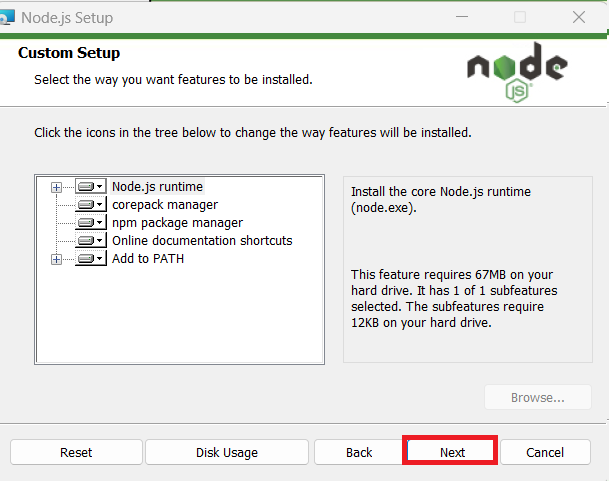
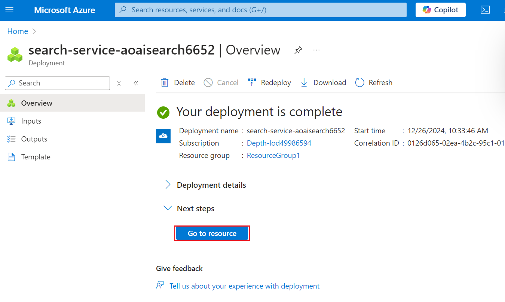
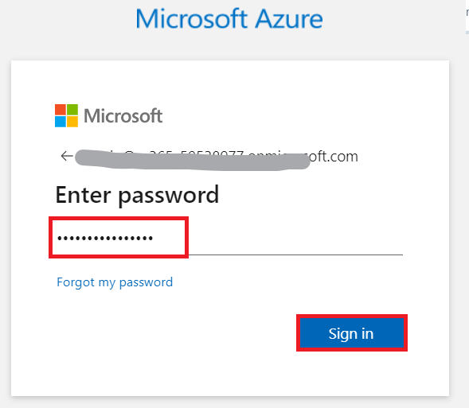
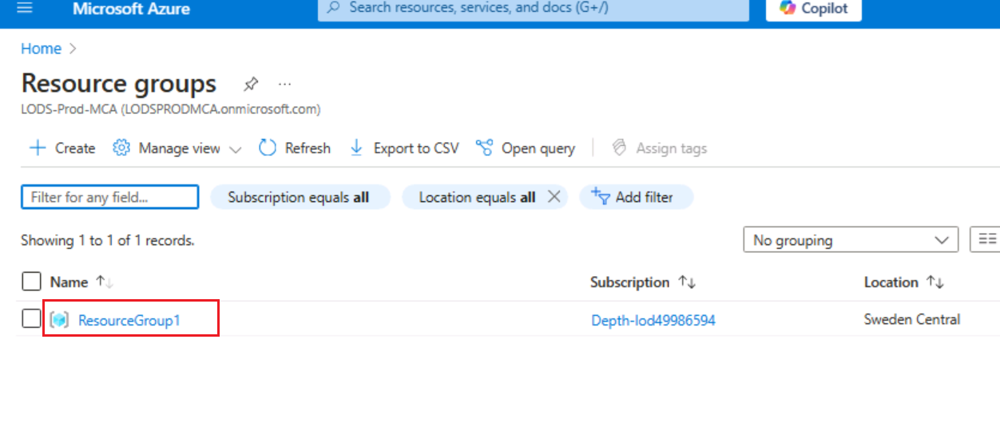

**介绍**

此示例演示了使用 Retrieval Augmented Generation
模式在您自己的数据上创建类似 ChatGPT 的体验的几种方法。它使用 Azure
OpenAI 服务访问 ChatGPT 模型 （gpt-35-turbo），并使用 Azure
认知搜索进行数据索引和检索。

该存储库包含示例数据，因此可以端到端尝试。在此示例应用程序中，我们使用一家名为
Contoso Electronics
的虚构公司，该体验允许其员工询问有关权益、内部策略以及职位描述和角色的问题。

此用例介绍了在 Azure 平台上使用 Retrieval Augmented Generation （RAG）
模式开发复杂聊天应用程序的过程。通过利用 Azure OpenAI 服务和 Azure
认知搜索，你将创建一个聊天应用程序，该应用程序可以使用你自己的数据智能地回答问题。此实验室使用一家虚构的公司
Contoso Electronics 作为案例研究，演示如何在企业数据上构建类似 ChatGPT
的体验，涵盖员工福利、内部政策和工作角色等方面。

**目的**

- 在本地计算机上安装 Azure CLI 和 Node.js。

- 为用户分配所有者角色。

- 安装 Dev Containers 扩展并设置开发环境。

- 将聊天应用程序部署到 Azure 并使用它从 PDF 文件中获取答案。

- 删除已部署的资源和模型。

## 任务 1：安装 Azure Cli 并将策略范围设置为“本地计算机

1.  在 Windows 搜索栏中，键入 **PowerShell**。在 **PowerShell**
    对话框中，导航并单击 **Run as
    administrator**（以管理员身份运行）。如果您看到对话框 - **Do you
    want to allow this app to make changes to your device?** 然后点击
    **Yes** 按钮。

> 

2.  运行以下命令以在 PowerShell 上安装 Azure Cli

PowerShell 复制

> **winget install microsoft.azd**

3.  运行以下命令，将策略设置为 **Unrestricted**
    （不受限制），并在要求更改执行策略时输入 **A**。

> **Set-ExecutionPolicy Unrestricted**
>
> 

## 任务 2：安装 Node.js

1.  打开浏览器，导航到地址栏，键入或粘贴以下
    URL：+++https://nodejs.org/en/download/+++，然后按 **Enter** 按钮。

2.  选择并单击 **Windows Installer**。

3.  **Node-V** 文件。单击下载的文件以设置**Node.js**

4.  在 **Welcome to the Node.js Setup Wizard** 窗口中，单击 **Next
    按钮**。

5.  在 **End-User License Agreement**（最终用户许可协议）窗口中，选择**I
    accept the terms in the License agreement** 单选按钮，然后单击
    **Next**（下一步）按钮。

6.  在 **Destination Folder** 窗口中，单击 **Next** 按钮。

7.  在 **Custom Setup** 窗口中，单击 **Next** 按钮。

8.  在 Ready to install Node.js 窗口中，单击 **Install**。

9.  在 **Completing the Node.js Setup Wizard** **窗口**中，单击
    **Finish** 按钮以完成安装过程。

## 任务 3：检索资源组名称和位置

1.  打开浏览器，导航到地址栏，然后键入或粘贴以下
    URL：+++https://portal.azure.com/+++，然后按 **Enter** 按钮。

> 

2.  在 **Microsoft Azure** 窗口中，使用**用户凭证**登录 Azure。

3.  然后，输入密码并单击 **Sign in** 按钮。

> 

4.  在 **Stay signed in?** 窗口中，单击 **Yes** 按钮。

> 

5.  在搜索栏中键入 **+++Resource group+++**，然后选择 **Resource
    groups**。

> 

6.  单击分配的 **Resource group**。

7.  在 **Resource group** （资源组）
    页面中，复制**资源组名称和位置**并将其粘贴到记事本中，然后**保存**记事本以在即将到来的任务中使用这些信息。

## 任务 4：创建 AI 搜索服务

1.  在 Azure 门户中，在搜索栏中键入 **+++AI search+++**，然后选择 **AI
    Search**

2.  单击 +**Create。**

3.  选择以下值，然后单击 **Review + Create**。

&nbsp;

1)  订阅：**您的 Azure 订阅。**

2)  资源组 - **选择现有资源组**

3)  服务名称 - **aisearchXXXX（XXXXX 可以是实验室即时 ID）**

4)  位置 ： **美国中部** /您附近

5)  定价层： 标准

4.  单击 **Create** now（立即创建）。

5.  等待部署，然后单击 **Go to resource**（转到资源）。

> 
>
> 

6.  在 **AI Search** Overview （AI 搜索概述） 页面中。在左侧导航窗格中的
    **Settings** 部分下，选择 **Semantic ranker**

7.  在 **Semantic ranker** 选项卡上，选择 **Standard** tile
    （标准磁贴），然后单击 **Select plan** （选择计划）。

> 

8.  选择 **Yes**

> 

9.  你将看到一条通知 - **Successfully updated semantic ranker to
    standard plan**

> 

10. 打开记事本并记下 AI 搜索名称、资源组名称和位置
    。我们稍后将使用它来与服务通信

> 

## 任务 5：运行 Docker

1.  I在 Windows 搜索框中，键入 Docker ，然后单击 **Docker Desktop**。

2.  运行 Docker Desktop。

## **任务 6：安装 Dev Containers 扩展**

1.  在 Windows 搜索框中，键入 Visual Studio，然后单击 **Visual Studio
    Code**。

> 

2.  打开浏览器，导航到地址栏，键入或粘贴以下 URL：
    +++https://marketplace.visualstudio.com/items?itemName=ms-vscode-remote.remote-containers+++，然后按
    **Enter** 按钮。

> 

3.  在 Dev Containers 页面上，选择 Install 按钮。

4.  此时将显示 Visual Studio Code is required to install this extension
    对话框，然后单击 **Continue** 按钮。

5.  此站点正在尝试打开 Visual Studio Code 对话框出现，然后单击
    “**Open**” 按钮。

6.  在 Visual Studio 中，单击 Dev 容器下的 Install 按钮。

## 任务 7：开放开发环境

1.  打开浏览器，导航到地址栏，键入或粘贴以下 URL：

+++<https://vscode.dev/redirect?url=vscode://ms-vscode-remote.remote-containers/cloneInVolume?url=https://github.com/azure-samples/azure-search-openai-demo>+++，
然后按 **Enter** 按钮。

2.  此站点正在尝试打开 Visual Studio Code
    对话框出现，然后单击“**Open**”按钮。

> 

3.  是否允许 'Dev Containers' 扩展打开此 URI？对话框，然后单击 **Open**
    按钮。

> 

4.  Cloning a repository in a Dev Container may execute arbitrary code
    对话框出现，然后单击 **Got It** 按钮

> 

5.  启动 Dev 容器需要 13-15 分钟。部署后，按 Enter。

6.  按任意键关闭终端

> 

## 任务 8：将聊天应用部署到 Azure

1.  使用 Azure 开发人员 CLI 登录到 Azure。在终端上运行以下命令

> BashCopy
>
> **azd auth login**
>
> 

2.  默认浏览器打开以登录 。使用 Azure 订阅帐户登录。

> 

3.  关闭浏览器

> 

4.  登录后，Azure 登录的详细信息将填充到终端中。

> 

5.  创建新的 azd 环境。在终端上运行以下命令

Copy

**azd env new**

6.  将新环境名称输入为+++**chatapprag+++**

> 

7.  分配现有的 Azure 资源组。在终端中运行以下命令

> azd env set AZURE_RESOURCE_GROUP {Name of existing resource group}
>
> azd env set AZURE_LOCATION {Location of existing resource group}
>
> 

8.  分配现有的 Azure AI 搜索服务。在终端中运行以下命令

> +++azd env set AZURE_SEARCH_SERVICE {Name of existing Azure AI Search
> service}+++
>
> +++azd env set AZURE_SEARCH_SERVICE_RESOURCE_GROUP {Name of existing
> resource group with ACS service}+++
>
> +++azd env set AZURE_SEARCH_SERVICE_LOCATION {Location of existing
> service}+++
>
> +++azd env set AZURE_SEARCH_SERVICE_SKU {Name of SKU}+++
>
> 

9.  检查分配的现有资源，选择 Azure，然后选择 **.env** 文件。

> 

10. 创建新的 azd 环境：

> shellCopy
>
> **azd up**
>
> 

11. 选择你的 Azure 订阅

> 

12. 出现提示时，**为
    “documentIntelligenceResourceGroupLocation”基础结构参数输入值**，选择
    **West US2**。

> 

13. 出现提示时，**为 “openAiResourceGroupLocation”
    基础设施参数输入一个值，然后**选择 **France Central** 。

> 

14. 等待应用程序部署完成。部署可能需要 **35-40** 分钟才能完成。

> 
>
> 
>
> 
>
> 
>
> 

15. 成功部署应用程序后，您将看到一个打印到控制台的 URL。单击该 URL
    可在浏览器中与应用程序进行交互。它将如下所示：

> 

16. 打开浏览器，导航到地址栏，粘贴链接。现在，资源组将在新的浏览器中打开

## 任务 9：在 Azure 门户中验证已部署的资源

1.  选择 **Resource groups**

> 

2.  单击分配的 **Resource group**。

3.  确保已成功部署以下资源

- Azure 应用服务

- Azure 应用程序见解

- 容器应用程序

- 容器注册表

- Azure OpenAI

- Azure 文档智能

- Azure 搜索服务

- Azure 存储帐户

- Azure 语音服务

4.  在资源组上，然后单击 **AI Search service**。

> 

5.  确保 Indexes 应已成功部署

> 

6.  返回 resorcegroup 并单击 **Storage account**。

> 

7.  从左侧导航菜单中，单击 **Containers** ，确保数据应该部署成功

> 

## 任务 10：使用聊天应用程序从 PDF 文件中获取答案

1.  等待 Web 应用程序部署完成。

> 

2.  在 **GPT+Eneterprise 数据 |示例** Web
    应用程序页面，输入以下文本，然后单击 **Submit 图标**，如下图所示。

> **What happens in a performence review?**

3.  从答案中，选择一个**citation**。

4.  在右侧窗格中，使用选项卡了解答案是如何生成的。

[TABLE]

5.  再次选择所选选项卡以关闭窗格。

6.  聊天的智能由 OpenAI 模型和用于与模型交互的设置决定。

7.  选择 **Developer settings** （开发人员设置）。

[TABLE]

8.  选中 **Suggest follow-up questions**
    复选框，然后再次提出相同的问题。

9.  输入以下文本，然后单击 **Submit 图标**，如下图所示。

> What happens in a performance review?

10. 聊天返回了建议的后续问题，例如：

11. 在 **Settings** （设置） 选项卡中，取消选择 **Use semantic ranker
    for retrieval** （使用语义排名程序进行检索）。

12. 输入以下文本，然后单击 **Submit 图标**，如下图所示。

> What happens in a performance review?

## 任务 11：删除资源

1.  若要删除 资源组 ，请在 Azure 门户搜索栏中键入 **Resource
    groups**，导航并单击“**Services**”下的“**Resource groups**”。

> 

2.  单击示例 Web 应用程序资源组。

> 

3.  在 资源组主页 中，选择 **所有资源** 。

4.  选择 Delete

**总结**

> 在本实验中，你学习了如何使用 Azure
> 的工具和服务套件设置和部署智能聊天应用程序。从安装 Azure CLI 和
> Node.js 等基本工具开始，你已使用 Visual Studio Code
> 中的开发容器配置了开发环境。你已部署一个聊天应用程序，该应用程序利用
> Azure OpenAI 和 Azure 认知搜索来回答 PDF
> 文件中的问题。最后，您删除了已部署的资源以有效地管理资源。此实践经验使你具备了在
> Azure 上使用 Retrieval Augmented Generation
> 模式开发和管理智能聊天应用程序的技能。
