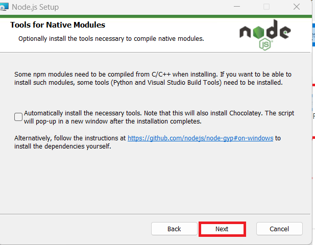
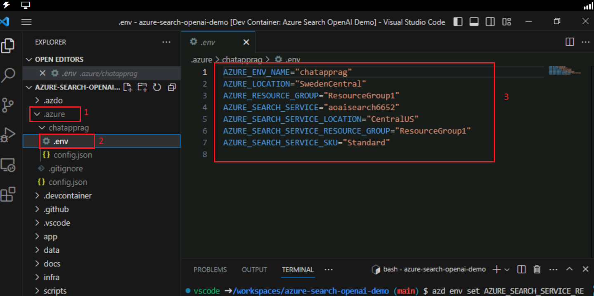
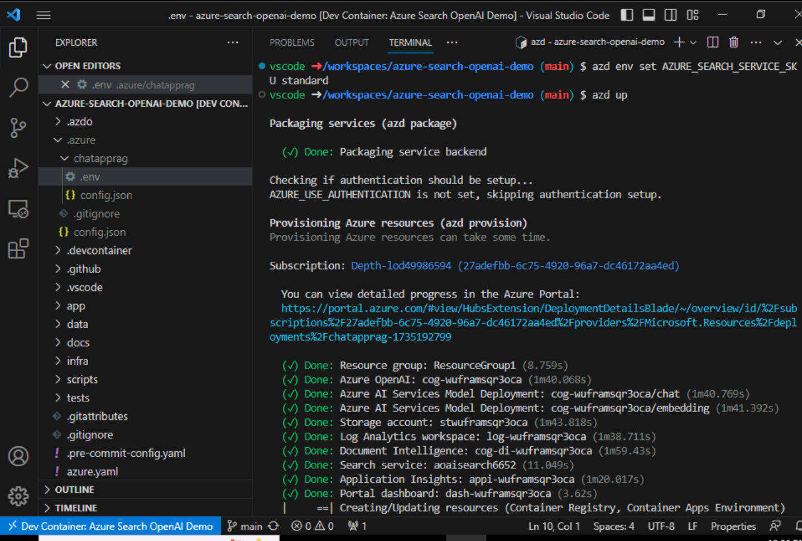

**Introduction**

Cet exemple présente quelques approches pour créer des expériences de
type ChatGPT sur vos propres données à l'aide du modèle Retrieval
Augmented Generation. Il utilise le service Azure OpenAI pour accéder au
modèle ChatGPT (gpt-35-turbo) et la recherche cognitive Azure pour
l'indexation et la récupération des données.

Le référentiel inclut des exemples de données afin d'être prêt à être
essayé de bout en bout. Dans cet exemple d'application, nous utilisons
une société fictive appelée Contoso Electronics, et l'expérience permet
à ses employés de poser des questions sur les avantages, les politiques
internes, ainsi que les descriptions de poste et les rôles.

Ce cas d'usage vous permet de développer une application de conversation
sophistiquée à l'aide du modèle RAG (Retrieval Augmented Generation) sur
la plateforme Azure. En tirant parti du service Azure OpenAI et de la
recherche cognitive Azure, vous allez créer une application de
conversation qui peut répondre intelligemment aux questions à l'aide de
vos propres données. Ce laboratoire utilise une société fictive, Contoso
Electronics, comme étude de cas pour démontrer comment créer une
expérience de type ChatGPT sur les données d'entreprise, en couvrant des
aspects tels que les avantages sociaux, les politiques internes et les
rôles.

**Objectif**

- Pour installer Azure CLI et Node.js sur votre ordinateur local.

- Attribuer un rôle de propriétaire à l'utilisateur.

- Pour installer l'extension Dev Containers et configurer
  l'environnement de développement.

- Déployer une application de conversation sur Azure et l'utiliser pour
  obtenir des réponses à partir de fichiers PDF.

- Pour supprimer les ressources et les modèles déployés.

## Tâche 1 : Installer Azure CLI et définir l'étendue de la stratégie sur Ordinateur local

1.  Dans la barre de recherche de Windows, tapez **PowerShell**. Dans la
    boîte de dialogue **PowerShell**, naviguez et cliquez sur **Run as
    administrator**. Si vous voyez la boîte de dialogue – **Do you want
    to allow this app to make changes to your device?** puis cliquez sur
    le bouton **Yes**.

> 

2.  Exécutez la commande suivante pour installer Azure Cli sur
    PowerShell

Copie PowerShell

> **winget install microsoft.azd**

3.  Exécutez la commande ci-dessous pour définir la stratégie sur
    **Unrestricted** et entrez **A** lorsque vous êtes invité à modifier
    la stratégie d'exécution.

> **set-executionPolicy sans restriction**
>
> 

## Tâche 2 : Installer Node.js

1.  Ouvrez votre navigateur, naviguez jusqu'à la barre d'adresse, tapez
    ou collez l'URL suivante : +++https://nodejs.org/ fr/télécharger/+++
    puis appuyez sur le bouton **Enter**.

2.  Sélectionnez et cliquez sur **Windows Installer**.

3.  Le fichier **Node-V** sera téléchargé. Cliquez sur le fichier
    téléchargé pour configurer **Node.js**

4.  Dans la window **Welcome to the Node.js Setup Wizard**, cliquez sur
    le bouton **Next**.

5.  Dans la window **End-User License Agreement** , sélectionnez **I
    accept the terms in the License agreement** et cliquez sur le bouton
    **Next**.

6.  Dans la window D**estination Folder**, cliquez sur le bouton
    **Next**.

7.  Dans la window **Custom Setup ,** cliquez sur le bouton **Next**.

8.  Dans la window Ready to install Node.js, cliquez sur **Installe.**

9.  Dans la window **Completing the Node.js Setup Wizard** , cliquez sur
    le bouton **Finish** pour terminer le processus d'installation.

## Tâche 3 : Récupérer le nom et l'emplacement du Resource group

1.  Ouvrez votre navigateur, accédez à la barre d'adresse et tapez ou
    collez l'URL suivante : +++https://portal.azure.com/+++, puis
    appuyez sur le bouton **Enter**.

> 

2.  Dans la window **Microsoft Azure**, utilisez les **User
    Credentials** pour vous connecter à Azure.

3.  Ensuite, entrez le mot de passe et cliquez sur le bouton **Sign
    in.**

> 

4.  Dans **Stay signed in?** , cliquez sur le bouton **Oui**.

> 

5.  Tapez **+++Resource group+++** dans la barre de recherche et
    sélectionnez **Resource group**.

> 

6.  Cliquez sur le **Resource group** qui vous a été attribué.

7.  Dans la page **Resource group**, copiez le r**esource group name and
    location** et collez-les dans un bloc-notes, puis **Save** le
    bloc-notes pour utiliser les informations dans les tâches à venir.

## Tâche 4 : Créer un service de recherche IA

1.  Dans le portail Azure, tapez **+++AI search+++** dans la barre de
    recherche, puis sélectionnez **AI Search**

2.  Cliquez sur +**Create**.

3.  Sélectionnez les valeurs ci-dessous, puis cliquez sur **Review +
    Create**.

&nbsp;

1)  Subscription: **Your Azure subscription**.

2)  Resource group - **Select your existing resource group**

3)  Service name - **aisearchXXXX(XXXXX can be Lab instant ID)**

4)  Location : **Central US** / Emplacement à proximité

5)  Pricing tier: Standard

4.  Cliquez sur **Create** maintenant.

5.  Attendez le déploiement puis cliquez sur **Go to resource**.

> 
>
> 

6.  Sur la page Vue d'ensemble de la **AI Search**. Dans le volet de
    navigation de gauche, sous la section **Settings**, sélectionnez
    **Semantic ranker**

7.  Dans l'onglet **Sematic ranker,** sélectionnez la tuile **Standard**
    et cliquez sur **Select plan.**

> 

8.  Sélectionnez **Yes**

> 

9.  Vous verrez une notification -**Successfully updated semantic ranker
    to standard plan**

10. Ouvrez un Bloc-notes et notez le nom de la recherche IA, le nom du
    Resource group et l'emplacement. Nous les utiliserons ultérieurement
    pour communiquer au service

> 

## Tâche 5 : Exécuter le Docker

1.  Dans votre champ de recherche Windows, tapez Docker , puis cliquez
    sur **Docker Desktop**.

2.  Exécutez le Docker Desktop.

## **Tâche 6 : Installer l'extension Dev Containers**

1.  Dans votre zone de recherche Windows, tapez Visual Studio, puis
    cliquez sur **Visual Studio Code**.

> 

2.  Ouvrez votre navigateur, naviguez jusqu'à la barre d'adresse, tapez
    ou collez l'URL suivante :
    +++https://marketplace.visualstudio.com/items?itemName=ms-vscode-remote.remote-containers+++
    puis appuyez sur le bouton **Enter**.

> 

3.  Sur la page Conteneurs de développement, sélectionnez le bouton
    Install

4.  La boîte de dialogue Visual Studio Code est requise pour installer
    cette extension s'affiche, puis cliquez sur le bouton **Continue**.

5.  La boîte de dialogue Ce site tente d'ouvrir Visual Studio Code
    s'affiche, puis cliquez sur le bouton **Open**.

6.  Dans Visual Studio, cliquez sur le bouton Installer sous le Dev
    containes.

## Tâche 7 : Environnement de développement ouvert

1.  Ouvrez votre navigateur, accédez à la barre d'adresse, tapez ou
    collez l'URL suivante :

+++<https://vscode.dev/redirect?url=vscode://ms-vscode-remote.remote-containers/cloneInVolume?url=https://github.com/azure-samples/azure-search-openai-demo>+++
puis appuyez sur le bouton **Enter**.

2.  La boîte de dialogue Ce site tente d'ouvrir Visual Studio Code
    s'affiche, puis cliquez sur le bouton **Open**.

> 

3.  La boîte de dialogue Autoriser l'extension 'Dev Containers' à ouvrir
    cet URI ? s'affiche, puis cliquez sur le bouton **Open**.

> 

4.  La boîte de dialogue Cloner un référentiel dans un conteneur de
    développement peut exécuter du code arbitraire s'affiche, puis
    cliquez sur le bouton **Got it**

> 

5.  Le démarrage du Dev container prend 13 à 15 minutes. Après le
    déploiement, appuyez sur Enter.

6.  Appuyez sur n'importe quelle touche pour fermer le terminal

> 

## Tâche 8 : Déployer l'application de conversation sur Azure

1.  Connectez-vous à Azure à l'aide de l'interface de ligne de commande
    Azure Developer. Exécutez la commande suivante sur le Terminal

> BashCopy
>
> **azd auth login**
>
> 

2.  Le navigateur par défaut s'ouvre pour sign in. Sign in avec votre
    compte d'abonnement Azure.

> 

3.  Fermez le navigateur

> 

4.  Une fois connecté, les détails de la connexion Azure sont renseignés
    dans le terminal.

> 

5.  Créez un nouvel environnement azd. Exécutez la commande suivante sur
    le Terminal

Copier

**azd env nouveau**

6.  Entrez le nouveau nom de l'environnement comme +++**chatapprag+++**

> 

7.  Attribuez le Azure resource group existant. Exécutez la commande
    suivante dans le terminal

> azd env set AZURE_RESOURCE_GROUP {Nom du Resource group existant}
>
> azd env set AZURE_LOCATION {Emplacement du Resource group existant}
>
> 

8.  Attribuez le service Azure AI Search existant. Exécutez la commande
    suivante dans le Terminal

> +++azd env set AZURE_SEARCH_SERVICE {Nom du service Azure AI Search
> existant}+++
>
> +++azd env set AZURE_SEARCH_SERVICE_RESOURCE_GROUP {Nom du Resource
> group existant avec le service ACS}+++
>
> +++azd env set AZURE_SEARCH_SERVICE_LOCATION {Emplacement du service
> existant}+++
>
> +++azd env set AZURE_SEARCH_SERVICE_SKU {Nom du SKU}+++
>
> 

9.  Vérifiez les ressources existantes attribuées, sélectionnez Azure,
    puis choisissez le **file.env**.

> 

10. Créez un nouvel environnement azd :

> shellCopy
>
> **azd up**
>
> 

11. Sélectionnez votre abonnement azure

> 

12. Lorsque vous y êtes invité, **Enter a value for the
    ‘documentIntelligenceResourceGroupLocation’ infrastructure
    parameter»** sélectionnez **West US2.**

> 

13. Lorsque vous y êtes invité **enter a value for the
    ‘openAiResourceGroupLocation’ infrastructure parameter** et
    sélectionnez **France Centre.**

> 

14. Attendez que l'application soit déployée. Le déploiement peut
    prendre **35- 40** minutes.

> 
>
> 
>
> 
>
> 
>
> 

15. Une fois l'application déployée avec succès, une URL s'affiche sur
    la console. Cliquez sur cette URL pour interagir avec l'application
    dans votre navigateur. Il se présentera comme suit :

> 

16. Ouvrez votre navigateur, accédez à la barre d'adresse, collez le
    lien. Maintenant, le resource group s'ouvrira dans un nouveau
    navigateur

## Tâche 9 : Vérifier les ressources déployées dans le portail Azure

1.  Sélectionner **Resource groups**

> 

2.  Cliquez sur le **Resource group** qui vous a été attribué.

3.  Assurez-vous que la ressource ci-dessous a été déployée avec succès

- Azure App Service

- Azure Application Insights

- Container App

- Container registry

- Azure OpenAI

- Azure Document Intelligence

- Azure Search Service

- Azure Storage Account

- Azure Speech Service

4.  Dans le Resource group, cliquez sur **AI Search service.**

> 

5.  Assurez-vous que les index doivent être déployés avec succès

> 

6.  Retournez dans resorce group et cliquez sur **Storage account**

> 

7.  Dans le menu de navigation de gauche, cliquez sur **Containers**,
    Assurez-vous que les données doivent être déployées avec succès

> 

## Tâche 10 : Utiliser l'application de chat pour obtenir des réponses à partir de fichiers PDF

1.  Attendez la fin du déploiement de l'application Web.

> 

2.  Dans les **GPT+Eneterprise data |Sample** de page d'application Web,
    saisissez le texte suivant et cliquez sur l' **Submit icon** , comme
    illustré dans l'image ci-dessous.

> **What happens in a performence review?**

3.  Dans la réponse, sélectionnez une **citation**.

4.  Dans le volet de droite, utilisez les onglets pour comprendre
    comment la réponse a été générée.

[TABLE]

5.  Sélectionnez à nouveau l'onglet sélectionné pour fermer le volet.

6.  L'intelligence du chat est déterminée par le modèle OpenAI et les
    paramètres utilisés pour interagir avec le modèle.

7.  Sélectionnez les **Developer settings**

[TABLE]

8.  Cochez la case **Suggest follow-up questions** et posez à nouveau la
    même question.

9.  Entrez le texte suivant et cliquez sur le **Submit icon** comme
    indiqué dans l'image ci-dessous.

> What happens in a performance review?

10. Le chat a renvoyé des questions de suivi suggérées telles que les
    suivantes

11. Dans l'onglet **Settings** , désélectionnez **Use semantic ranker
    for retrieval**.

12. Entrez le texte suivant et cliquez sur le **Submit icon** comme
    indiqué dans l'image ci-dessous.

What happens in a performance review?

## Tâche 11 : Supprimer les ressources

1.  Pour supprimer Resource group, tapez **Resource group** dans la
    barre de recherche du portail Azure, naviguez et cliquez sur
    **Resource group** sous **Services**.

> 

2.  Cliquez sur l'exemple de resource group d'application web.

> 

3.  Dans la page d'accueil du resource group , sélectionnez **all
    resources**.

4.  Sélectionnez Delete

**Résumé**

Dans ce laboratoire, vous avez appris à configurer et à déployer une
application de conversation intelligente à l'aide de la suite d'outils
et de services Azure. En commençant par l'installation d'outils
essentiels tels qu'Azure CLI et Node.js, vous avez configuré votre
environnement de développement à l'aide de Dev Containers dans Visual
Studio Code. Vous avez déployé une application de conversation
instantanée qui utilise Azure OpenAI et Recherche cognitive Azure pour
répondre aux questions à partir de fichiers PDF. Enfin, vous avez
supprimé les ressources déployées pour gérer efficacement les
ressources. Cette expérience pratique vous a permis d'acquérir les
compétences nécessaires pour développer et gérer des applications de
conversation intelligente à l'aide du modèle de génération augmentée de
récupération sur Azure.
