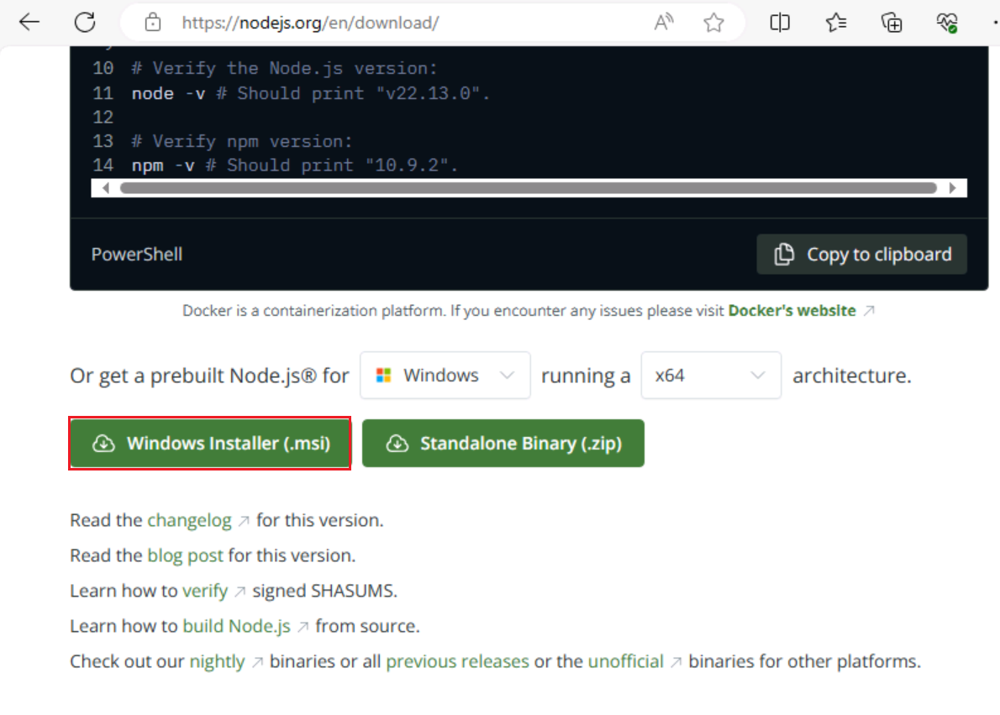
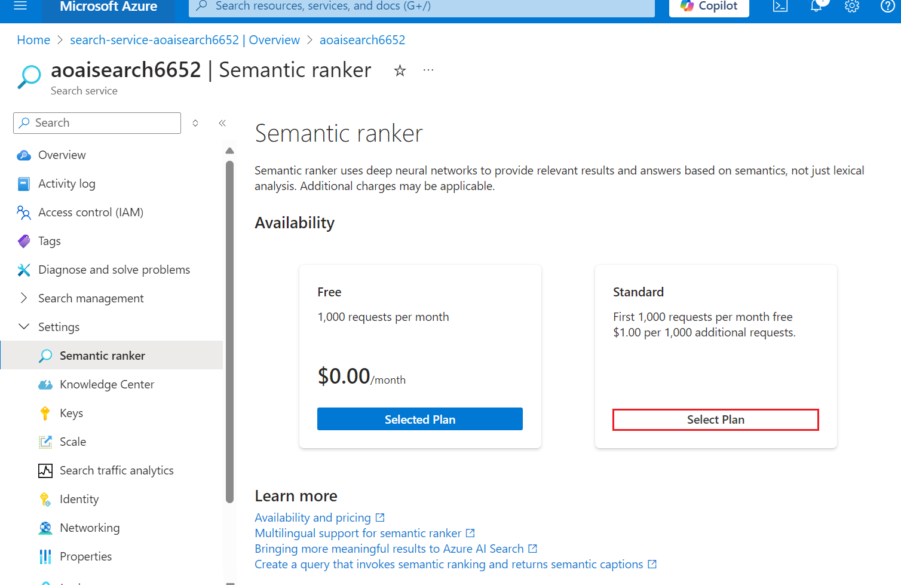
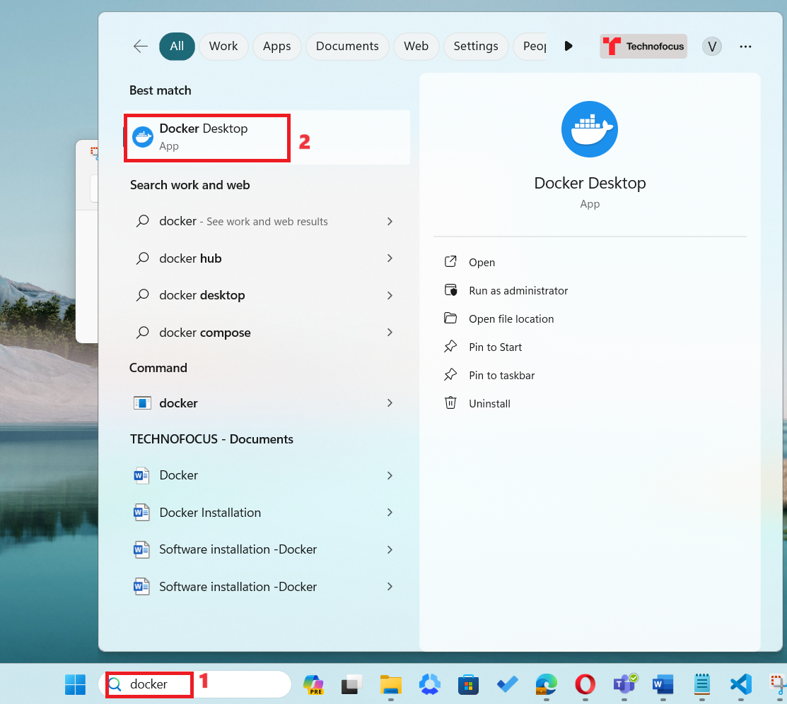
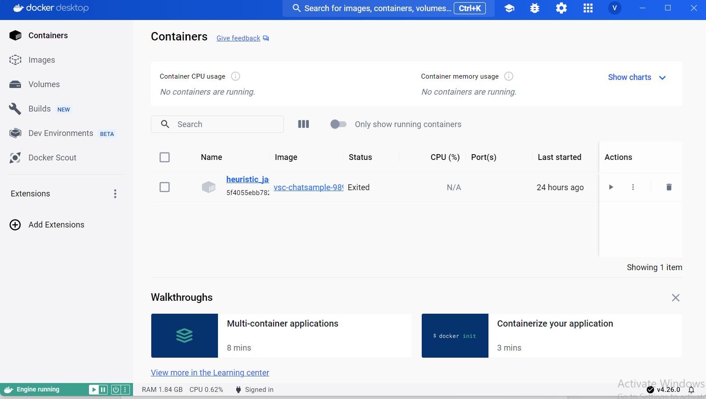
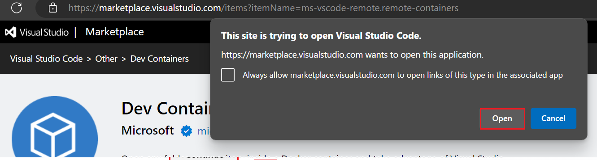
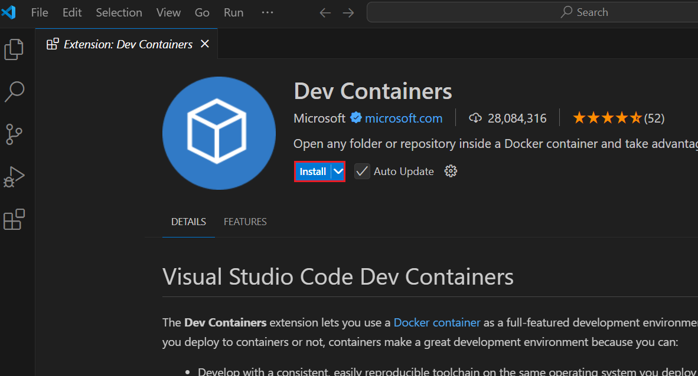
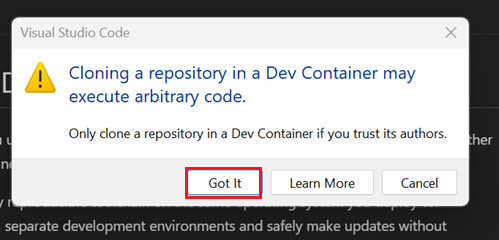
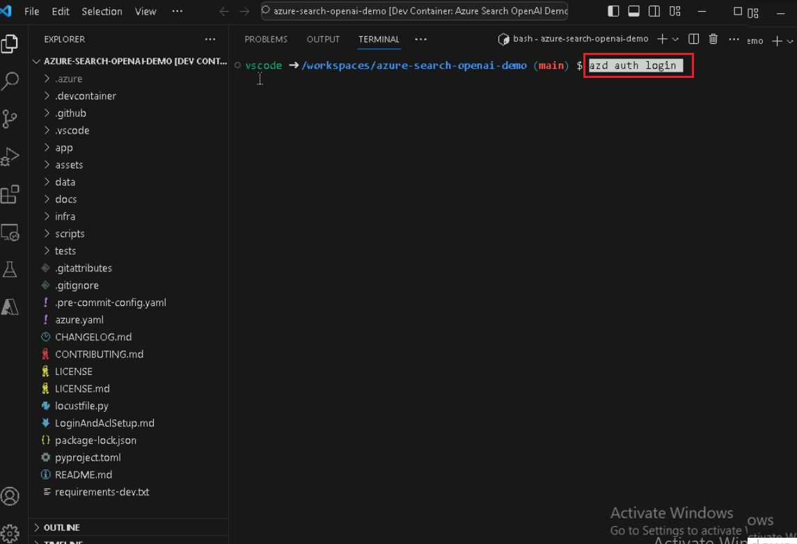
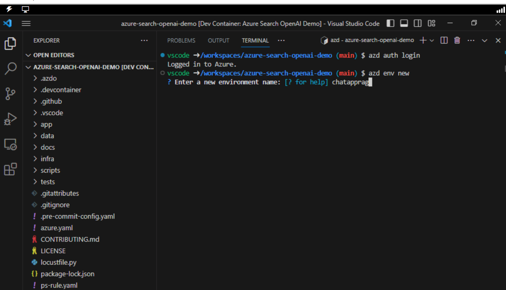

**紹介**

このサンプルでは、Retrieval Augmented Generation
パターンを使用して、自分のデータに対して ChatGPT
のようなエクスペリエンスを作成するためのいくつかの方法を示します。Azure
OpenAI Service を使用して ChatGPT モデル (gpt-35-turbo)
にアクセスし、Azure Cognitive Search
を使用してデータのインデックス作成と取得を行います。

リポジトリにはサンプル データが含まれているため、エンド ツー
エンドで試す準備ができています。このサンプル
アプリケーションでは、Contoso Electronics
という架空の会社を使用しており、そのエクスペリエンスにより、従業員は福利厚生、内部ポリシー、職務内容、役割について質問できます。

このユース ケースでは、Azure プラットフォーム上の Retrieval Augmented
Generation (RAG)
パターンを使用して高度なチャットアプリケーションを開発するプロセスについて説明します。Azure
OpenAI Service と Azure Cognitive Search
を活用することで、独自のデータを使用して質問にインテリジェントに回答できるチャットアプリケーションを作成します。このラボでは、架空の会社である
Contoso Electronics をケース
スタディとして使用し、従業員の福利厚生、内部ポリシー、職務などの側面をカバーする、エンタープライズ
データに対して ChatGPT
のようなエクスペリエンスを構築する方法を示します。

**目的**

- Azure CLI と Node.js をローカル マシンにインストールするため。

- ユーザーに所有者ロールを割り当てる。

- Dev Containers 拡張機能をインストールし、開発環境を設定します。

- チャット アプリケーションを Azure にデプロイし、それを使用して PDF
  ファイルから回答を取得する。

- デプロイされたリソースとモデルを削除します。

## タスク 1: Azure CLI をインストールし、 ポリシーのスコープをローカルコンピューターに設定する

1.  Windows の検索バーに「PowerShell」と入力します。\[PowerShell\]
    ダイアログ ボックスで、\[**Run as administrator**\]
    に移動してクリックします。**Do you want to allow this app to make
    changes to your
    device**ダイアログボックスが表示された場合**?**次に、\[**Yes**\]ボタンをクリックします。

> 

2.  次のコマンドを実行して 、PowerShell に Azure CLI
    をインストールします

PowerShell copy

> **winget install microsoft.azd**

3.  次のコマンドを実行してポリシーを \[無制限\]
    に設定し、実行ポリシーの変更を求められたら「A」と入力します。

> **Set-ExecutionPolicy Unrestricted**
>
> 

## タスク 2: Node.js のインストール

1.  ブラウザを開き、アドレスバーに移動し、次のURLを入力または貼り付けます:+++https://nodejs.org/en/download/+++を押してから、
    **Enter** ボタンを押します。

2.  **Windows Installerを選択してクリックします**。

3.  **Node-V**
    ファイルがダウンロードされます。ダウンロードしたファイルをクリックして**Node.js**を設定します
    

4.  「**Welcome to the Node.js Setup Wizard」**
    ウィンドウで、「**Next」ボタンをクリックします**。

5.  「**End-User License Agreement」**ウィンドウで、「**I accept the
    terms in the License
    agreement」**ラジオボタンを選択し、「**Next」**ボタンをクリックします。

6.  「**Destination Folder」**
    ウィンドウで、「**Next」**ボタンをクリックします。

7.  \[Custom Setup**\] ウィンドウで**、\[**Next\]**
    ボタンをクリックします。

8.  「インストールできますNode.jsウィンドウで、「**Install**」をクリックします
    **。**

9.  **「Completing the Node.js Setup Wizard
    window」ウィンドウで**、「**Finish**」ボタンをクリックしてインストールプロセスを完了します。

## タスク 3: リソース グループの名前と場所の取得

1.  ブラウザを開き、アドレスバーに移動して、次のURLを入力または貼り付けます+++https://portal.azure.com/+++、Enter
    ボタンを押します。

> 

2.  Microsoft
    Azureウィンドウで、ユーザー資格情報を使用してAzureにログインします。

3.  次に、パスワードを入力して\[**Sign
    in\]**ボタンをクリックします**。**

> 

4.  **Stay signed in?**ウィンドウで、\[**Yes\]**ボタンをクリックします。

> 

5.  検索バーに「+++Resource group+++」と入力し、\[ **Resource groups**\]
    を選択します。

> 

6.  割り当てられた**Resource groupをクリックします**。

7.  **\[**リソース グループ ページ\] で、リソース
    グループの名前と場所をコピーしてメモ帳に貼り付け、メモ帳を保存して、今後のタスクで情報を使用します。

## タスク 4: AI 検索サービスの作成

1.  Azure portal で、検索バーに「+++AI search+++」と入力し、\[**AI
    Search\] を選択します**

2.  \[+**Create**\]をクリックします。

3.  以下の値を選択し、\[**Review + Create\]をクリックします**。

&nbsp;

1)  サブスクリプション: **Your Azure subscription**。

2)  リソース グループ - **既存のリソース グループを選択します**

3)  サービス名 -
    **aisearchXXXX(XXXXXはLabインスタントIDにすることができます)**

4)  場所 : **米国中部** /お近くの場所

5)  価格レベル: Standard

4.  \[**Create** now**\] をクリックします** 。

5.  デプロイメントを待ってから、\[**Go to resource\]
    をクリックします**。

> 
>
> 

6.  AI 検索の概要ページ。左側のナビゲーション ウィンドウの
    \[**Settings**\] セクションで、\[**Semantic ranker**\]
    を選択します。

7.  \[**Semantic ranker\]** タブで**、\[Standard \]
    タイルを選択し、\[Select plan**\] をクリックします。

> 

8.  \[**Yes\] を選択します**

> 

9.  通知が表示されます- **Successfully updated semantic ranker to
    standard plan**

> 

10. メモ帳を開き、AI 検索の名前、リソース
    グループの名前、および場所をメモします。後でサービスへの連絡に使用します

> 

## タスク 5: Docker を実行する

1.  Windowsの検索ボックスに「Docker」と入力し、\[**Docker
    Desktop\]をクリックします**。

2.  Docker デスクトップを実行します。

## **タスク 6: Dev Containers 拡張機能のインストール**

1.  Windowsの検索ボックスに「Visual Studio」と入力し、\[**Visual Studio
    Code\]をクリックします**。

> 

2.  ブラウザを開き、アドレスバーに移動し、次のURLを入力または貼り付けます:

+++https://marketplace.visualstudio.com/items?itemName=ms-vscode-remote.remote-containers+++、そして**Enter**ボタンを押します。

> 

3.  \[Dev Containers\] ページで、\[Install\] ボタンを選択します。

4.  Visual Studio
    Codeをインストールするには、この拡張機能のダイアログボックスが表示されたら、\[**Continue**\]ボタンをクリックします。

5.  This site is trying to open Visual Studio
    Codeダイアログボックスが表示されたら、\[**Open**\]ボタンをクリックします。

6.  Visual Studio で、Dev コンテナーの下にある \[インストール\]
    ボタンをクリックします。

## タスク 7: オープンな開発環境

1.  ブラウザを開き、アドレスバーに移動して、次のURLを入力または貼り付けます：

+++<https://vscode.dev/redirect?url=vscode://ms-vscode-remote.remote-containers/cloneInVolume?url=https://github.com/azure-samples/azure-search-openai-demo>+++
を押してから、 **Enter** ボタンを押します。

2.  このサイトはVisual Studio
    Codeを開こうとしていますダイアログボックスが表示されたら、\[開く\]ボタンをクリックします。

> 

3.  「Dev Containers」拡張機能でこの URI
    を開くことを許可しますか?」ダイアログボックスが表示されたら、「**Open**」ボタンをクリックします。

> 

4.  Dev
    Container内のリポジトリをクローンすると、任意のコードが実行される可能性がありますダイアログボックスが表示されたら、\[
    Got It \]ボタンをクリックします

> 

5.  Dev コンテナの起動には 13 分から 15 分かかります。デプロイ後、Enter
    キーを押します。

6.  任意のキーを押してターミナルを閉じます

> 

## タスク 8: チャット アプリを Azure にデプロイする

1.  Azure Developer CLI を使用して Azure にサインインします。
    ターミナルで次のコマンドを実行します

> BashCopy
>
> **azd auth login**
>
> 

2.  デフォルトのブラウザが開き、サインインします。Azure
    サブスクリプション アカウントでサインインします。

> 

3.  ブラウザを閉じます

> 

4.  ログインすると、Azureログインの詳細がターミナルに入力されます。

> 

5.  新しい azd 環境を作成します。 ターミナルで次のコマンドを実行します

Copy

**azd env new**

6.  新しい環境名を+++chatapprag+++として入力します

> 

7.  既存の Azure リソース
    グループを割り当てます。ターミナルで次のコマンドを実行します

> azd env set AZURE_RESOURCE_GROUP {Name of existing resource group}
>
> azd env set AZURE_LOCATION {Location of existing resource group}
>
> 

8.  既存の Azure AI Search
    サービスを割り当てます。ターミナルで次のコマンドを実行します

> +++azd env set AZURE_SEARCH_SERVICE {Name of existing Azure AI Search
> service}+++
>
> +++azd env set AZURE_SEARCH_SERVICE_RESOURCE_GROUP {Name of existing
> resource group with ACS service}+++
>
> +++azd env set AZURE_SEARCH_SERVICE_LOCATION {Location of existing
> service}+++
>
> +++azd env set AZURE_SEARCH_SERVICE_SKU {Name of SKU}+++
>
> 

9.  割り当てられた既存のリソースを確認し、 \[Azure\] を選択して、
    **.env** ファイルを選択します。

> 

10. 新しい azd 環境を作成します：

> shellCopy
>
> **azd up**
>
> 

11. Azure サブスクリプションを選択します

> 

12. プロンプトが表示されたら、「**documentIntelligenceResourceGroupLocation」インフラストラクチャ
    パラメーターの値を入力し、**West US2 **を選択します。**

> 

13. プロンプトが表示されたら、**documentIntelligenceResourceGroupLocation’
    infrastructure
    parameterに値を入力し、**フランス中部**を選択します。**

> 

14. アプリがデプロイされるまで待ちます。 **デプロイが完了するまで**に 35
    分から 40 分かかる場合があります。

> 
>
> 
>
> 
>
> 
>
> 

15. アプリケーションが正常にデプロイされると、コンソールに URL
    が出力されます。そのURLをクリックして、ブラウザでアプリケーションを操作します。次のようになります。

> 

16. ブラウザを開き、アドレスバーに移動して、リンクを貼り付けます。
    これで、リソース グループが新しいブラウザーで開きます

## タスク 9: Azure portal でデプロイされたリソースを確認する

1.  \[リソース グループ**\] を選択します**

> 

2.  割り当てられた**Resource groupをクリックします**。

3.  以下のリソースが正常にデプロイされたことを確認します

- Azure App Service

- Azure Application Insights

- コンテナアプリ

- コンテナレジストリ

- Azure OpenAI

- Azure ドキュメント インテリジェンス

- Azure Search サービス

- Azure Storage アカウント

- Azure Speech Service

4.  リソース グループで **\[AI Search service\] をクリックします。**

> 

5.  インデックスが正常にデプロイされる必要があることを確認します

> 

6.  resorcegroup に戻り、 \[**Storage account\] をクリックします。**

> 

7.  左側のナビゲーション メニューから \[ コンテナー\]
    をクリックし、データが正常にデプロイされることを確認します

> 

## タスク 10: チャットアプリを使用して PDF ファイルから回答を取得する

1.  Web アプリケーションのデプロイが完了するまで待ちます。

> 

2.  **GPT+Eneterpriseデータ |サンプル** Web アプリ
    ページで、次のテキストを入力し、 **次の図に示すように** \[送信\]
    アイコンをクリックします。

> **What happens in a performence review?**

3.  回答から引用を選択します。

4.  右側のウィンドウで、タブを使用して、回答がどのように生成されたかを理解します。

[TABLE]

5.  選択したタブをもう一度選択して、ウィンドウを閉じます。

6.  チャットのインテリジェンスは、OpenAI
    モデルと、モデルとの対話に使用される設定によって決まります。

7.  \[**Developer settings\] を選択します**。

[TABLE]

8.  「**Suggest follow-up
    questions** 」チェックボックスをオンにして、同じ質問をもう一度質問します。

9.  次のテキストを入力し、**下の画像に示すように\[Submit**\]アイコンをクリックします。

> What happens in a performance review?

10. チャットからは、次のようなフォローアップの質問が提案されました

11. \[**Settings** **\]** タブで、\[**Use semantic ranker for
    retrieval\] の選択を解除します**。

12. 次のテキストを入力し、**下の画像に示すように\[Submit**\]アイコンをクリックします。

> What happens in a performance review?

## タスク 11: リソースの削除

1.  リソース グループを削除するには、Azure
    ポータルの検索バーに「**Resource groups**」と入力し、
    \[**Services**\] の下の \[**Resource groups**\]
    に移動してクリックします。

> 

2.  サンプル Web アプリ リソース グループをクリックします。

> 

3.  リソース・グループのホーム・ページで、**all
    resourcesを選択します**。

4.  \[Delete\] を選択します

**概要**

このラボでは、Azure
の一連のツールとサービスを使用して、インテリジェントなチャット
アプリケーションを設定してデプロイする方法を学習しました。Azure CLI や
Node.js などの重要なツールのインストールから始めて、Visual Studio Code
の Dev Containers を使用して開発環境を構成しました。Azure OpenAI と
Azure Cognitive Search を利用して PDF
ファイルからの質問に答えるチャットアプリケーションをデプロイしました。最後に、デプロイされたリソースを削除して、リソースを効果的に管理しました。この実践的なエクスペリエンスにより、Azure
で Retrieval Augmented Generation
パターンを使用してインテリジェントなチャット
アプリケーションを開発および管理するスキルを身に付けました。
