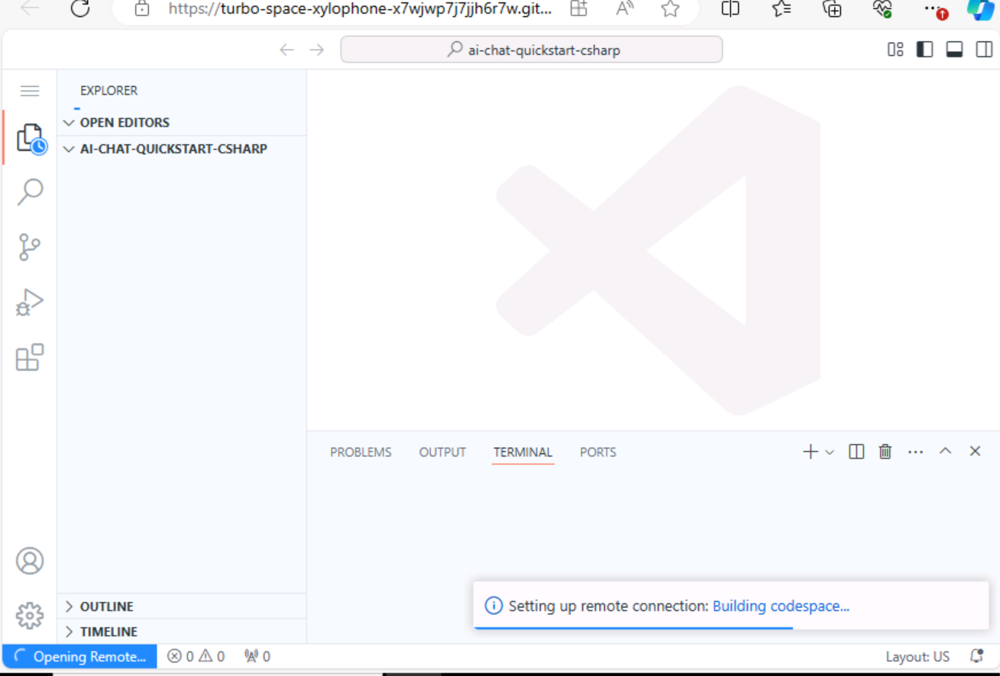
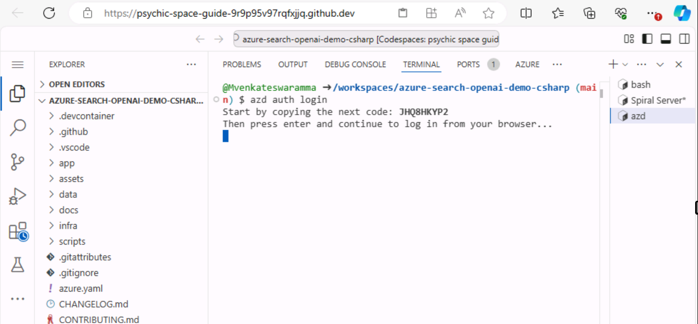
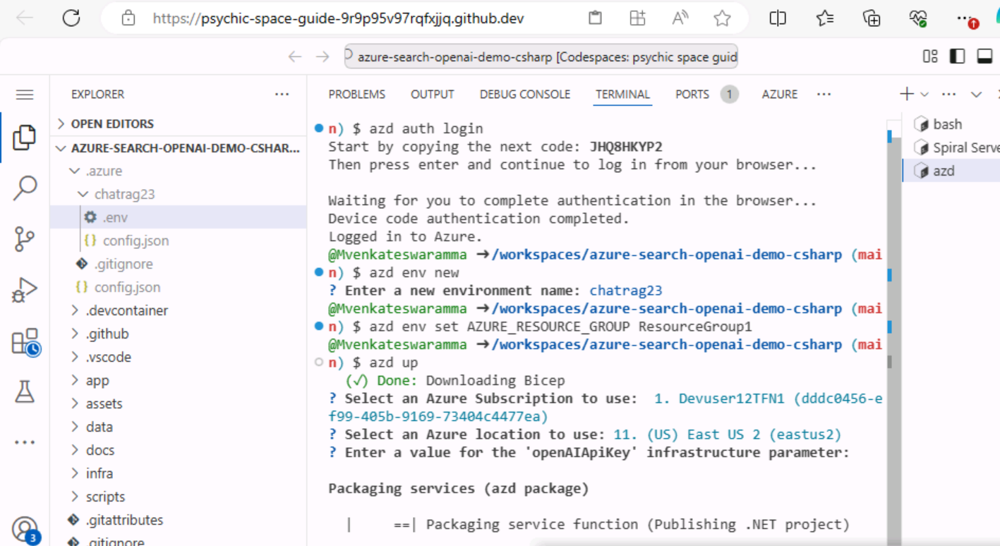
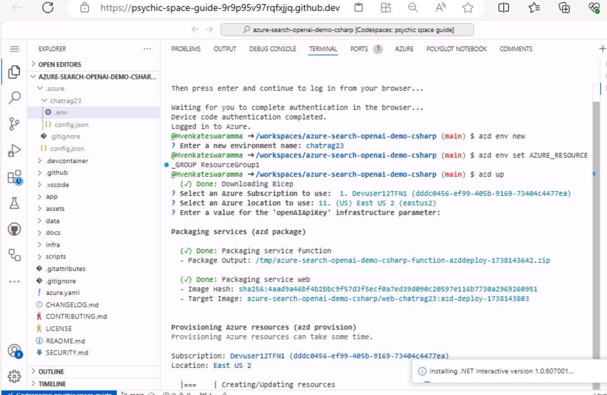
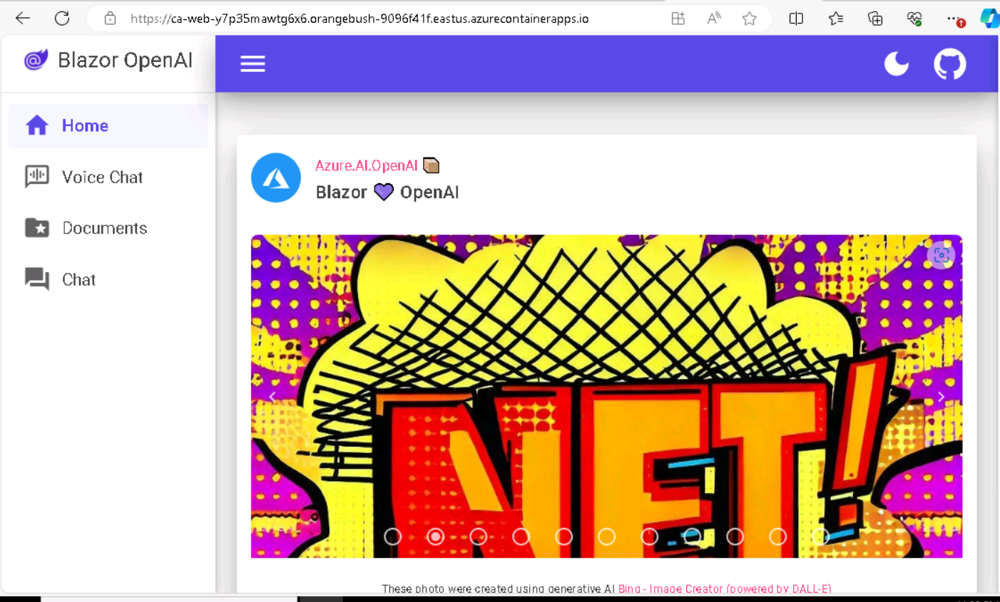
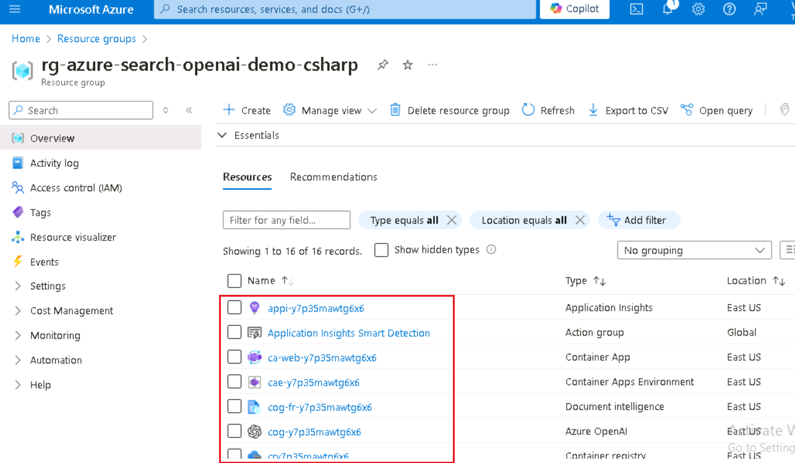
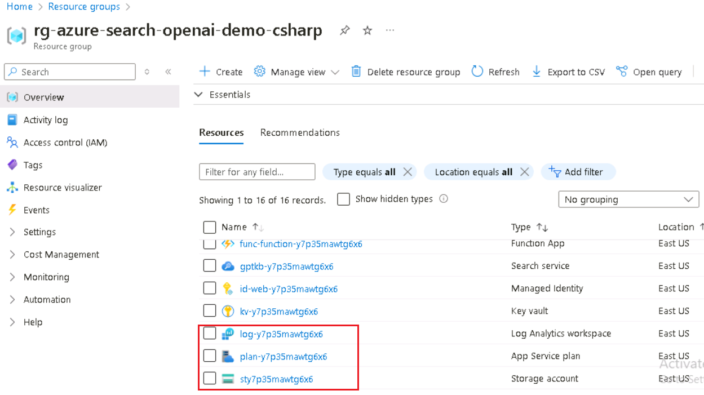
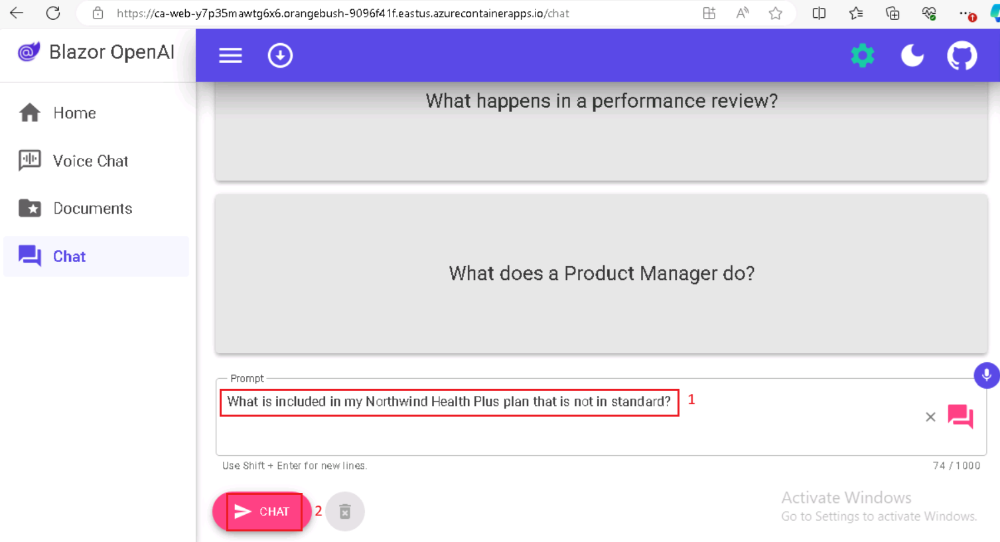
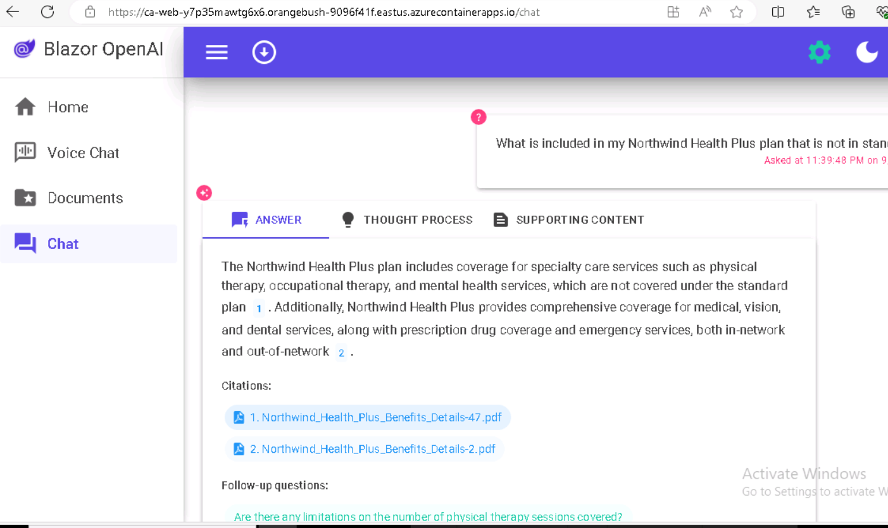

# Use Case 04-Building a chat app (using .NET) using Azure OpenAI Service and RAG

This sample demonstrates a few approaches for creating ChatGPT-like
experiences over your own data using the Retrieval Augmented Generation
pattern. It uses Azure OpenAI Service to access the ChatGPT model
(gpt-4o-mini), and Azure AI Search for data indexing and retrieval.

The repo includes sample data so it's ready to try end-to-end. In this
sample application, we use a fictitious company called Contoso
Electronics, and the experience allows its employees to ask questions
about the benefits, internal policies, as well as job descriptions and
roles.

   

- Voice Chat, Chat and Q&A interfaces

- Explores various options to help users evaluate the trustworthiness of
  responses with citations, tracking of source content, etc.

- Shows possible approaches for data preparation, prompt construction,
  and orchestration of interaction between model (ChatGPT) and retriever
  (Azure AI Search)

- Settings directly in the UX to tweak the behavior and experiment with
  options

**Key technologies used** -- Azure OpenAI Service, ChatGPT model
(gpt-4o-mini), and Azure AI Search

**Estimated duration --** 40 minutes

# Exercise 1 : Deploy the application and test it from the browser

## Task 1: Open development environment

1.  Open your browser, navigate to the address bar, type or paste the
    following URL:
    +++https://github.com/technofocus-pte/azure-search-openai-demo-csharp.git+++
    and sign in with your Github account.

      

2.  Click on **Fork**.

     

3.  Enter the repository name and then click on **Create fork**.

     

4.  Click on **Code -\> Codespaces -\> +**

      

5.  Wait for the environment to setup. It takes 5-10 minutes.

      

## Task 2: Provision required services to build and deploy chat app to Azure

1.  Run the following command on the Terminal. Copy the code and press
    enter.

    +++azd auth login+++
 
      

2.  Default browser opens to enter a code.Enter the copied code and
    click **Next**.

      
      
      

3.  Sign in with your Azure credentials.

      
      
      

4.  Switch back to Github Codespace tab. Run below command to Initialize
    the project environment in the current directory. Enter the
    Environment name as **+++chatragXXX+++** and press Enter.

        Note : env name should be unique
       
        +++azd env new+++
 
    

5.  Run azd up - This will provision Azure resources and deploy this
    sample to those resources, including building the search index based
    on the files found in the ./data folder.

     +++azd up+++

6.  When prompted, select a **subscription** to create the resources and
    select a location **East US2**, This location is used for most the
    resources including hosting.

     
    
     

7.  When prompted, enter a value for the OpenAIApiKey infrastructure
    parameters and then just click the button

     
    
     

7.  Wait for the resource to provision completely. This process wil take
    5-10 min to create al the required resources.

     
     
     
     

8.  After the application has been successfully deployed, you see a URL
    displayed in the terminal. Copy the **URL**

     

9.  Click on the **Open**

    

10. It opens app in new tab.

    

11. Open a browser go to +++https://portal.azure.com+++ and sign in with
    your Azure subscription account.

12. On the Home page, click on **Resource Groups**

      

13. Click on your resource group.

     

14. Make sure the below resource got deployed successfully

      
       
      
      
      

     

15. On the resource group and click on **Azure OpenAI** resource name.

      

16. On the **Azure OpenAI** window, click on **Overview** in the left
    navigation menu, then under the **Get Started** tab, click on the
    **Go to Azure OpenAI Studio** button to open **Azure OpenAI Studio**
    in a new browser.

     

17. Make sure **gpt-4o-mini**, **text-embedding-ada-002** should be
    deployed successfully .

      

18. On the resource group and click on **storage account** resource
    name.

      
      

19. Now open the URL it into a browser

      

20. Click on the **Chat**

      

21. In the **Blazor OpenAI** web app page, enter the following text and
    click on the **Submit icon** as shown in the below image.

     **+++What is included in my Northwind Health Plus plan that is not in
     standard?+++**
      
      
23. In the **Blazor OpenAI** web app page, enter the following text and
    click on the **Submit icon** as shown in the below image.

     **+++Can I use out-of-network providers?+++**
 
      
      

23. In the **Blazor OpenAI** web app page, enter the following text and
    click on the **Submit icon** as shown in the below image.

    **+++Are there any exclusions or restrictions?+++**
 
      
      

24. In the **Blazor OpenAI** web app page, enter the following text and
    click on the **Submit icon** as shown in the below image.

    **+++What does a Product Manager do?+++**
      

25. Click on the **Documents.**

      
## **Task 3 : Clean up all the resources**

1.  Switch back to **Azure portal -\> Resource group-\> Resource group
    name.**

     

2.  Select all the resources and then click on Delete as shown in the
    below image. (**DO NOT DELETE** resource group)

      

3.  Type delete on the text box and then click on **Delete**.

      

4.  Confirm the deletion by clicking on **Delete**.

       

5.  Switch back to Github portal tab and refresh the page.

      

6.  Click on Code , select the branch created for this lab, and click
    on **Delete**.

     

7.  Confirm the branch deletion by clicking on **Delete** button.

      

**Summary:**

This use case thought you , deploying a chat application for the
Retrieval Augmented Generation pattern running on Azure, using Azure AI
Search for retrieval and Azure OpenAI and LangChain large language
models (LLMs) to power ChatGPT-style and Q&A experiences
