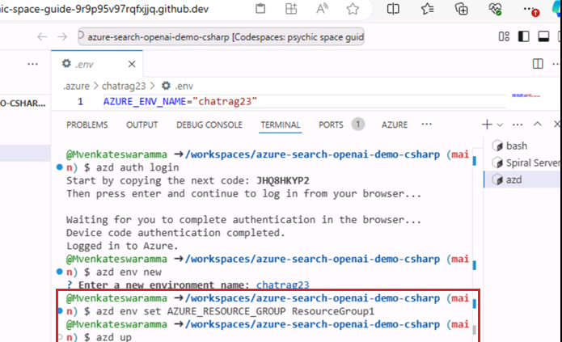
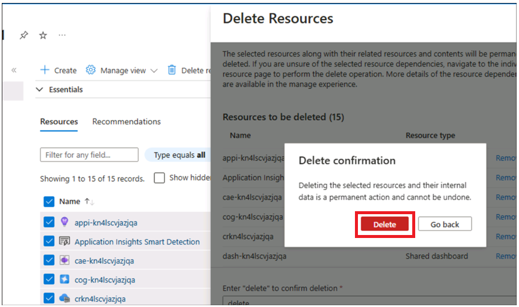
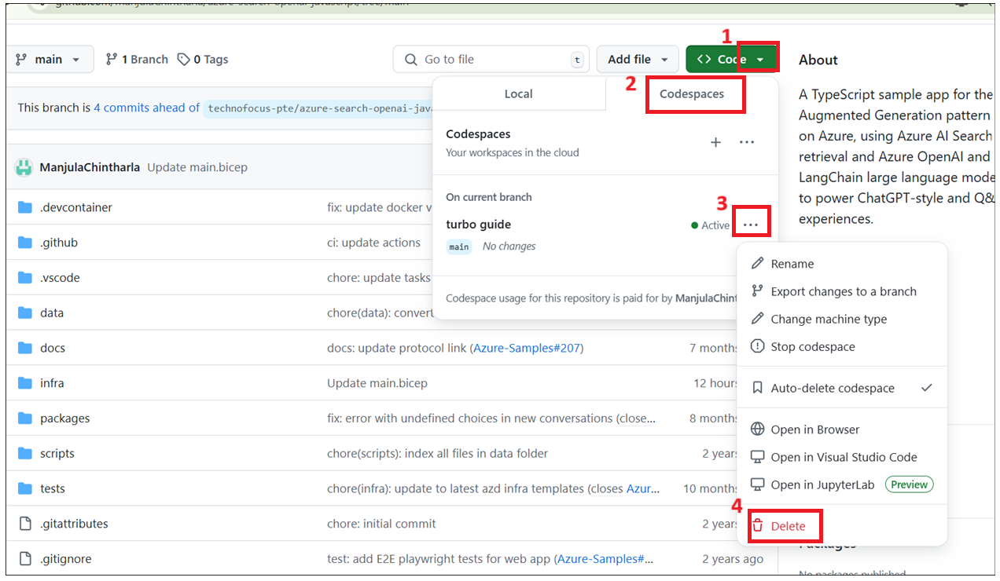

# Cas d'utilisation 04-Création d'une application de chat (à l'aide de .NET) à l'aide d'Azure OpenAI Service et de RAG

Cet exemple présente quelques approches pour créer des expériences de
type ChatGPT sur vos propres données à l'aide du modèle Retrieval
Augmented Generation. Il utilise le service Azure OpenAI pour accéder au
modèle ChatGPT (gpt-4o-mini) et Azure AI Search pour l'indexation et la
récupération des données.

Le référentiel inclut des exemples de données afin d'être prêt à être
essayé de bout en bout. Dans cet exemple d'application, nous utilisons
une société fictive appelée Contoso Electronics, et l'expérience permet
à ses employés de poser des questions sur les avantages, les politiques
internes, ainsi que les descriptions de poste et les rôles.

- Interfaces de chat vocal, de chat et de questions-réponses

- Explore diverses options pour aider les utilisateurs à évaluer la
  fiabilité des réponses avec des citations, le suivi du contenu source,
  etc.

- Montre les approches possibles pour la préparation des données, la
  construction d'invites et l'orchestration de l'interaction entre le
  modèle (ChatGPT) et l'extracteur (Azure AI Search)

- Paramètres directement dans l'UX pour modifier le comportement et
  expérimenter les options

**Principales technologies utilisées** : Azure OpenAI Service, modèle
ChatGPT (gpt-4o-mini) et Azure AI Search

**Durée estimée --** 40 minutes

# Exercice 1 : Déployer l'application et la tester depuis le navigateur

## Tâche 1 : Environnement de développement ouvert

1.  Ouvrez votre navigateur, accédez à la barre d'adresse, tapez ou
    collez l'URL suivante :
    +++https://github.com/technofocus-pte/azure-search-openai-demo-csharp.git+++
    et connectez-vous avec votre compte Github.

> 

2.  Cliquez sur **Fork**.

> 

3.  Entrez le repository name puis cliquez sur **Create fork**.

> 

4.  Click on **Code -\> Codespaces -\> +**

> 

5.  Attendez que l'environnement soit configuré. Cela prend 5 à 10
    minutes.

> 

## Tâche 2 : Fournir les services requis pour créer et déployer l'application de conversation sur Azure

1.  Exécutez la commande suivante sur le terminal. Copiez le code et
    appuyez sur Entrée.

> +++azd auth login+++
>
> 

2.  Le navigateur par défaut s'ouvre pour saisir un code. Entrez le code
    copié et cliquez sur **Next.**

> 

3.  Connectez-vous à l'aide de vos informations d'identification Azure.

4.  Revenez à l'onglet Github Codespace. Exécutez la commande ci-dessous
    pour initialiser l'environnement du projet dans le répertoire
    actuel. Entrez le nom de l'environnement sous la forme
    +++**chatragXXX+++** et appuyez sur Entrée.

> Remarque : le nom de l'environnement doit être unique
>
> +++azd env new+++

5.  Exécutez la commande ci-dessous pour provisionner les services sur
    Azure, créez votre conteneur.

> +++azd env set AZURE_RESOURCE_GROUP ResourceGroup1+++
>
> 

6.  Exécuter azd up : cela permet d'approvisionner des ressources Azure
    et de déployer cet exemple sur ces ressources, y compris la création
    de l'index de recherche basé sur les fichiers trouvés dans le
    dossier ./data.

> **+++azd haut+++**
>
> 

7.  Sélectionnez les valeurs ci-dessous.

- **Sélectionnez un abonnement Azure à utiliser** : sélectionnez votre
  abonnement

- **Sélectionnez un emplacement Azure à utiliser** : **East us2/west
  us2** (Parfois, USA Est peut ne pas être disponible, choisissez un
  emplacement dans la liste mentionnée ci-dessous.)

- Sélectionnez un groupe de ressources existant : Votre groupe de
  ressources existant (par exemple :**ResourceGroup1 )**

> 
>
> 

7.  Attendez que la ressource soit complètement provisionnée. Ce
    processus prendra 5 à 10 minutes pour créer toutes les ressources
    requises.

> 
>
> 
>
> 

8.  Une fois l'application déployée avec succès, une URL s'affiche dans
    le terminal. Copiez l' **URL**

> 

9.  Cliquez sur **Open**

> 

10. Il ouvre l'application dans un nouvel onglet.

> 

11. Ouvrez un navigateur, accédez à <https://portal.azure.com> et
    connectez-vous avec votre compte d'abonnement Azure.

12. Sur la page d'accueil, cliquez sur **Resource Groups**

> 

13. Cliquez sur votre resource group

> 

14. Assurez-vous que la ressource ci-dessous a été déployée avec succès

> 

> 

15. Dans le groupe de ressources, cliquez sur Nom de la ressource
    **Azure OpenAI**.

> 

16. Dans la **window Azure OpenAI**, cliquez sur **Vue d'ensemble** dans
    le menu de navigation de gauche, puis sous l' onglet **Get
    Started**, cliquez sur le bouton **Go to Azure OpenAI Studio** pour
    ouvrir **Azure OpenAI Studio** dans un nouveau navigateur.

> 

17. Assurez-vous que **gpt-4o-mini**, **text-embedding-ada-002** doit
    être déployé avec succès.

> 

18. Sur le groupe de ressources, cliquez sur le nom de la ressource du
    **storage account**

> 
>
> 

19. Ouvrez maintenant l'URL dans un navigateur

> 

20. Cliquez sur le **chat**

> 

21. Sur la page de l'application web **Blazor OpenAI**, saisissez le
    texte suivant et cliquez sur le **Submit icon** comme illustré dans
    l'image ci-dessous.

**+++What is included in my Northwind Health Plus plan that is not in
standard?+++**

> 
>
> 

22. Sur la page de l'application Web **Blazor OpenAI**, saisissez le
    texte suivant et cliquez sur **Submit icon** comme illustré dans
    l'image ci-dessous.

**+++Can I use out-of-network providers?+++**

> 
>
> 

23. Sur la page de l'application Web **Blazor OpenAI**, saisissez le
    texte suivant et cliquez sur **Submit icon** **,** comme illustré
    dans l'image ci-dessous.

**+++Are there any exclusions or restrictions?+++**

> 
>
> 

24. Sur la page de l' application Web **Blazor OpenAI**, saisissez le
    texte suivant et cliquez sur **Submit icon** comme illustré dans
    l'image ci-dessous.

**+++What does a Product Manager do?+++**

> 

25. Cliquez sur les **Documents.**

> 

## **Tâche 3 : Nettoyer toutes les ressources**

1.  Revenez au **Azure portal -\> Resource group-\> Resource group
    name.**

> 

2.  Sélectionnez toutes les ressources, puis cliquez sur Supprimer comme
    indiqué dans l'image ci-dessous. (resource group **DO NOT DELETE)**

> 

3.  Tapez delete dans la zone de texte, puis cliquez sur **Delete**

> 

4.  Confirmez la suppression en cliquant sur **Delete**.

> 

5.  Revenez à l'onglet du portail Github et actualisez la page.

> 

6.  Cliquez sur Code , sélectionnez la branche créée pour ce laboratoire
    et cliquez sur **Delete**

> 

7.  Confirmez la suppression de la branche en cliquant sur le bouton
    **Delete**

**Résumé:**

Ce cas d'utilisation vous a pensé, déployer une application de
conversation pour le modèle de Retrieval Augmented Generation
s'exécutant sur Azure, utiliser Azure AI Search pour la récupération et
les modèles de langage volumineux (LLM) Azure OpenAI et LangChain pour
alimenter les expériences de type ChatGPT et de questions-réponses
