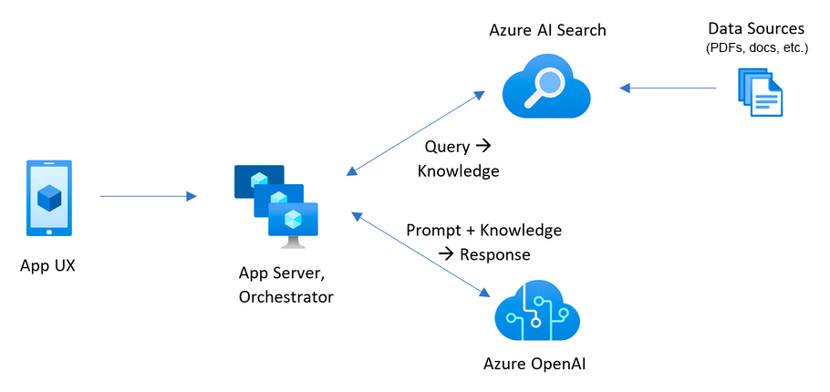
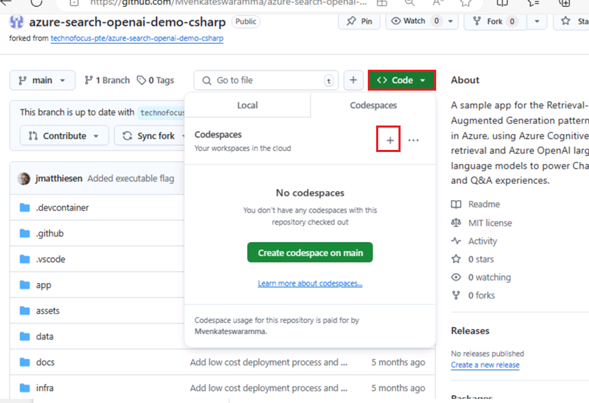
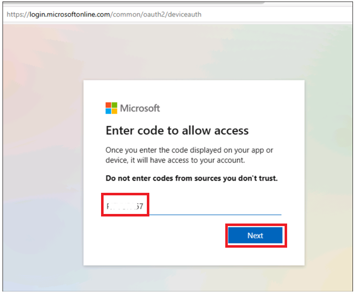
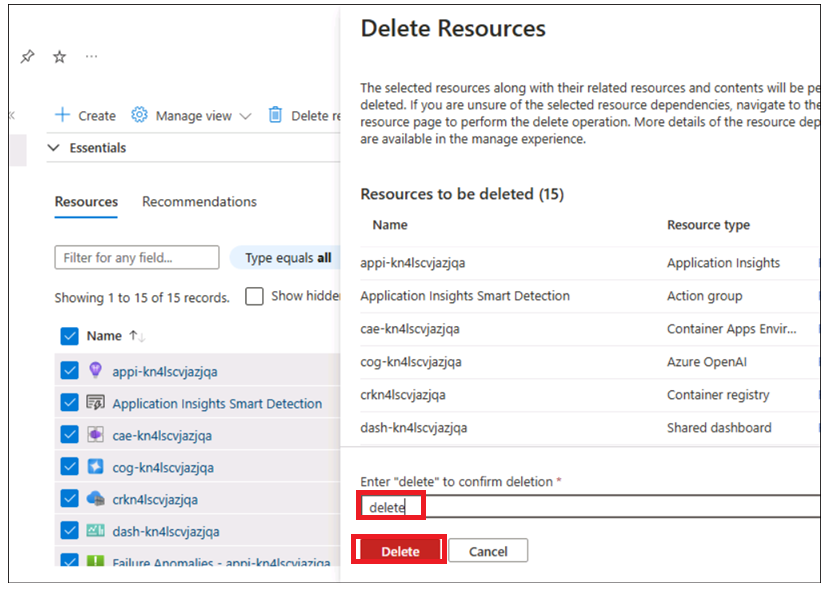
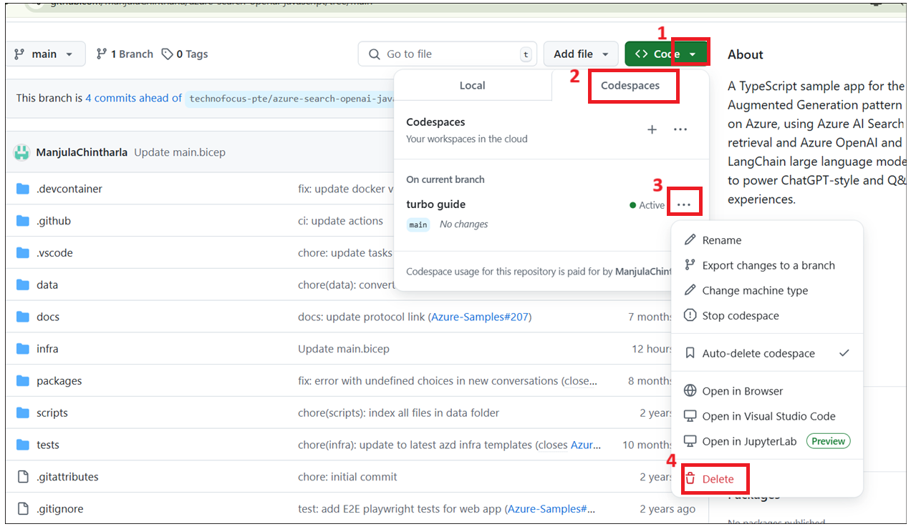

# ユースケース04-Azure OpenAI ServiceとRAGを使用したチャットアプリの構築(.NETを使用)

このサンプルでは、Retrieval Augmented Generation
パターンを使用して、自分のデータに対して ChatGPT
のようなエクスペリエンスを作成するためのいくつかの方法を示します。Azure
OpenAI Service を使用して ChatGPT モデル (gpt-4o-mini)
にアクセスし、Azure AI Search
を使用してデータのインデックス作成と取得を行います。

リポジトリにはサンプルデータが含まれているため、エンド ツー
エンドで試す準備ができています。このサンプルアプリケーションでは、Contoso
Electronicsという架空の会社を使用しており、そのエクスペリエンスにより、従業員は福利厚生、内部ポリシー、職務内容、役割について質問できます。

- ボイスチャット、チャット、Q&Aインターフェース

- 引用、ソースコンテンツの追跡など、ユーザーが回答の信頼性を評価するのに役立つさまざまなオプションを検討します。

- データの準備、迅速な構築、およびモデル (ChatGPT) とレトリーバー (Azure
  AI Search)
  の間の対話のオーケストレーションのための可能なアプローチを示します

- UXで直接設定して、動作を微調整し、オプションを試します

**使用した主なテクノロジ** -- Azure OpenAI Service、ChatGPT モデル
(gpt-4o-mini)、Azure AI Search

**推定所要時間 --** 40 分

# 演習 1 : アプリケーションをデプロイし、ブラウザーからテストする

## タスク 1: オープンな開発環境

1.  ブラウザを開き、アドレスバーに移動して、次のURLを入力または貼り付けます:+++https://github.com/technofocus-pte/azure-search-openai-demo-csharp.git+++

> そしてGithubアカウントでサインインします。
>
> 

2.  「**Fork」をクリックします**。

> 

3.  リポジトリ名を入力し、 **\[Create fork**\] をクリックします。

> 

4.  Code -\> Codespaces -\> + **をクリックします。**

> 

5.  環境がセットアップされるのを待ちます。5〜10分かかります。

> 

## タスク 2: チャット アプリを構築して Azure にデプロイするために必要なサービスをプロビジョニングする

1.ターミナルで次のコマンドを実行します。コードをコピーしてEnterキーを押します。

> +++azd auth login+++
>
> 

2.  デフォルトのブラウザが開き、コードを入力します。コピーしたコードを入力し、\[**Next**をクリックします。

> 

3.  Azure の資格情報でサインインします。

![自動的に生成されたコンピューターの \[説明\]
のスクリーンショット](./media/image10.png)

4.  Github の Codespace
    タブに戻ります。次のコマンドを実行して、現在のディレクトリのプロジェクト環境を初期化します。\[環境名\]
    に「+++chatragXXX+++」と入力し、Enter キーを押します。

> 注 : env 名は一意である必要があります
>
> +++azd env new+++

5.  次のコマンドを実行してサービスを Azure
    にプロビジョニングし、コンテナーをビルドします。

> +++azd env set AZURE_RESOURCE_GROUP ResourceGroup1+++
>
> 

6.  azd up を実行する - これにより、Azure
    リソースがプロビジョニングされ、./data
    フォルダーで見つかったファイルに基づいて検索インデックスを作成するなど、このサンプルがそれらのリソースにデプロイされます。

> **+++azd up+++**
>
> 

7.  以下の値を選択します。

- **使用する Azure サブスクリプションを選択する** :
  サブスクリプションを選択します

- **使用する Azure のロケーションを選択します**: **East us2/west us2**
  (米国東部が利用できない場合がある場合は、以下の一覧から場所を選択します)。

- 既存のリソースグループの選択 :
  既存のリソースグループ(例:**ResourceGroup1)**

> 
>
> 

7.リソースが完全にプロビジョニングされるまで待ちます。このプロセスでは、必要なリソースをすべて作成するのに5〜10分かかります。

> 
>
> 
>
> 

8.  アプリケーションが正常にデプロイされると、ターミナルに URL
    が表示されます。**URLをコピーします**

> 

9.  \[**Open\]をクリックします 。**

> 

10. 新しいタブでアプリが開きます。

> 

11. ブラウザーを開き、<https://portal.azure.com>に移動して 、Azure
    サブスクリプション アカウントでサインインします。

12. ホームページで、**Resource Groupsをクリックします**

> 

13. resource groupをクリックします。

> 

14. 以下のリソースが正常にデプロイされたことを確認します

> 

> 

15. リソース グループで、 **Azure OpenAI** リソース名をクリックします。

> 

16. **Azure OpenAI** ウィンドウで、 **左側のナビゲーション メニューの**
    \[**Overview**\] をクリックし、**Get Started** タブで**Go to Azure
    OpenAI Studio**ボタンをクリックして、新しいブラウザーで **Azure
    OpenAI Studio** を開きます。

> 

17. **gpt-4o-mini**、**text-embedding-ada-002**が正常にデプロイされていることを確認してください。

> 

18. リソース グループで、 **storage
    account**リソース名をクリックします。

> 
>
> 

19. 次に、URLをブラウザで開きます

> 

20. チャット**をクリックします**

> 

21. **Blazor OpenAI** Web アプリ ページで、次のテキストを入力し、
    **次の図に示すように** \[**Submit**\] アイコンをクリックします。

**+++What is included in my Northwind Health Plus plan that is not in
standard?+++**

> 
>
> 

22. **Blazor OpenAI** Web アプリ ページで、次のテキストを入力し、
    **次の図に示すように** \[**Submit**\] アイコンをクリックします。

> **+++Can I use out-of-network providers?+++**
>
> 
>
> 

23. **Blazor OpenAI** Web アプリ ページで、次のテキストを入力し、
    **次の図に示すように** \[**Submit**\] アイコンをクリックします。

> **+++Are there any exclusions or restrictions?+++**
>
> 
>
> 

24. **Blazor OpenAI** Web アプリ ページで、次のテキストを入力し、
    **次の図に示すように** \[**Submit**\] アイコンをクリックします。

> **+++What does a Product Manager do?+++**
>
> 

25. **Documents**をクリックします**。**

> 

## **タスク 3 : すべてのリソースをクリーンアップする**

1.  **Azure portal -\> Resource group-\> Resource group nameに戻ります**

> ![自動的に生成されたコンピューターの \[説明\]
> のスクリーンショット](./media/image44.png)

2.  すべてのリソースを選択し、次の画像に示すように\[Delete\]をクリックします。(**DO
    NOT DELETE** リソース・グループ)

> 

3.  テキストボックスに「delete」と入力し、\[**Delete**\]をクリックします。

> 

4.  \[**Delete\]をクリックして削除を確認します**。

> 

5.  Githubポータルタブに戻り、ページを更新します。

> 

6.  \[Code\]
    をクリックし、このラボ用に作成したブランチを選択して、\[**Delete**\]
    をクリックします。

> 

7.  \[**Delete** **\]ボタンをクリックして、ブランチの削除を確認します**
    。

**概要：**

このユース ケースでは、Azure で実行される検索拡張生成パターンのチャット
アプリケーションをデプロイし、検索には Azure AI Search を使用し、ChatGPT
スタイルと Q&A エクスペリエンスを強化するために Azure OpenAI と
LangChain large language models (LLM) を使用します。
