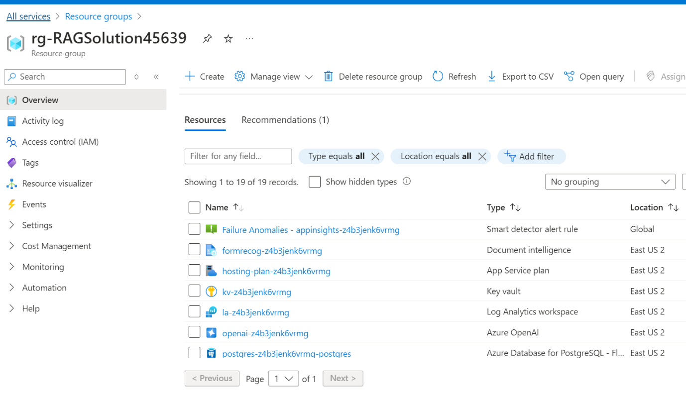

**Cas d'utilisation 05 - Déploiement et test d'une solution d'IA
conversationnelle avec Azure RAG Accelerator**

**Introduction**

L' accélérateur de solution *Discutez avec vos données* est un outil
puissant qui combine les fonctionnalités de la recherche Azure AI et des
grands modèles de langage (LLM) pour créer une expérience de recherche
conversationnelle. Cet accélérateur de solution utilise un modèle GPT
Azure OpenAI et un index Azure AI Search généré à partir de vos données,
qui est intégré à une application web pour fournir une interface en
langage naturel, y compris une fonctionnalité de reconnaissance vocale,
pour les requêtes de recherche. Les utilisateurs peuvent glisser-déposer
des fichiers, pointer vers le stockage et s'occuper de la configuration
technique pour transformer les documents. Il existe une application Web
que les utilisateurs peuvent créer dans leur propre abonnement avec
sécurité et authentification.

Les données de l'échantillon illustrent comment cet accélérateur
pourrait être utilisé dans le secteur des services financiers (FSI).

Dans ce scénario, un conseiller financier se prépare à une réunion avec
un client potentiel qui a exprimé son intérêt pour les fonds de marchés
émergents de Woodgrove Investments. Le conseiller se prépare à la
réunion en actualisant sa compréhension des objectifs globaux du fonds
des marchés émergents et des risques associés.

Maintenant que le conseiller financier est mieux informé sur les fonds
de marchés émergents de Woodgrove, il est mieux équipé pour répondre aux
questions de son client sur ce fonds.

Remarque : Certaines des données d'exemple incluses dans cet
accélérateur ont été générées à l'aide de l'IA et ne sont fournies qu'à
titre d'illustration.

Dans ce cas d'usage, vous allez déployer et tester une solution d'IA
conversationnelle à l'aide de l'accélérateur RAG (Retrieval-Augmented
Generation) Azure. Cette solution s'appuie sur les puissantes
fonctionnalités d'IA d'Azure, notamment Azure OpenAI et Azure AI Search,
pour créer une expérience de recherche conversationnelle avancée. À la
fin de cet atelier, vous disposerez d'une application Web entièrement
fonctionnelle qui utilise le traitement du langage naturel pour
interagir avec vos données et les interroger. Les étapes pratiques vous
guideront dans le déploiement de l'infrastructure nécessaire, la
vérification des ressources, le test de la solution et le nettoyage de
l'environnement.

**Objectifs**

- Déployer l'infrastructure nécessaire à partir d'un modèle personnalisé
  dans le portail Azure.

- Vérifier que toutes les ressources Azure requises ont été déployées
  avec succès.

- Tester les fonctionnalités de la solution déployée en téléchargeant et
  en traitant des documents et en interagissant avec l'application web.

- Pour supprimer les ressources et les modèles déployés.

**Tâche 1 : Déployer l'infrastructure à partir d'un modèle**

1.  Ouvrez votre navigateur, accédez à la barre d'adresse et tapez ou
    collez le
    UR :+++[www.portal.azure.com/+++](http://www.portal.azure.com/+++%20)
    appuyez sur le bouton **Enter**.

2.  Dans la **window Microsoft Azure**, entrez vos informations **Sign -
    in**, puis cliquez sur le bouton **Next**

> 

3.  Ensuite, entrez le mot de passe et cliquez sur le bouton **Sign
    in**\*\*.\*\*

> 

4.  Dans la window **Stay signed in ?** cliquez sur le bouton **Yes**.

> 

5.  Ouvrez un nouveau navigateur et entrez l'URL suivante dans la barre
    d'adresse :
    +++<https://portal.azure.com/#create/Microsoft.Template/uri/https%3A%2F%2Fraw.githubusercontent.com%2FAzure-Samples%2Fchat-with-your-data-solution-accelerator%2Fmain%2Finfra%2Fmain.json+++>
    pour ouvrir le portail Azure.

6.  Dans la window **Custom deployment** , sous l'onglet **Basics** ,
    entrez les détails suivants pour déployer le modèle personnalisé,
    puis cliquez sur **Review + create**

[TABLE]

> 

7.  Dans l'onglet **Review + create** , une fois la validation réussie,
    cliquez sur le bouton **Create**

> 

8.  Attendez la fin du déploiement. Le déploiement prendra environ 17 à
    19 minutes.

9.  Cliquez sur le bouton **Go to Subscription**

**Tâche 2 : Vérifier les ressources déployées dans le portail Azure**

1.  Sur la page d'accueil, cliquez sur **Resource Groups**

> 

2.  Cliquez sur le nom de votre groupe de ressources
    **rg-RAGSolutionXX**

3.  Assurez-vous que la ressource ci-dessous a été déployée avec succès
    dans la région USA Est

    - Azure App Service

    - Azure Application Insights

    - Azure Bot

    - Azure OpenAI

    - Azure Document Intelligence

    - Azure Function App

    - Azure Search Service

    - Azure Storage Account

    - Azure Speech Service

    - Azure Database for PostgreSQL - Serveur flexible

    - Key vault

 

**Tâche 3 : Test du déploiement**

1.  Dans le groupe de ressources, cliquez sur **Web-** {RESOURCE_TOKEN}
    **- admin-docker** resource name.

> 

2.  Accédez au site d'administration

> 
>
> 

3.  Dans la page **Chat with your data Solution Accelerator** , dans le
    menu de navigation de gauche, sélectionnez **Ingest Data**

> 

4.  Dans le volet Ajouter des documents par lots, cliquez sur **Browse
    file** et accédez à l' emplacement **C :\Labfiles \data** et
    sélectionnez **all files,** puis cliquez sur **l**e bouton **Open**.

> 

5.  Le téléchargement des fichiers prendra 1 à 2 minutes

6.  Cliquez sur le **Reprocess all documents in the Azure Storage
    account..**

7.  Dans la page **Chat with your data Solutions Accelerator**, dans le
    menu de navigation de gauche, sélectionnez **Configuration** et
    **cochez la cas -Enable post -answering prompt**

> 

8.  Dans le volet de configuration , cliquez sur **Save**
    **configuration.**

> 

9.  Revenez à la page du groupe de ressources et cliquez sur **l**e nom
    du **Storage account**

10. Dans le menu de navigation de gauche, cliquez sur **Containers.**

11. Dans la page Containers, sélectionnez **documents**.

12. Assurez-vous que tous les fichiers doivent être déployés avec succès

13. Revenir à la page du groupe de ressources

14. Dans la page du groupe de ressources, sélectionnez Service
    d'application en tant que **web-{RESOURCE_TOKEN}-docker**

15. Dans le menu réductible de gauche sous Settings , sélectionnez
    Aunthtication

16. Cliquez sur Add identity provider

17. Sélectionnez Microsoft comme fournisseur d'identité, mettez à jour
    Nom comme web-XXXXX-docker-new. Sélectionnez Durée d'expiration de
    la clé secrète client sur 90 jours, puis cliquez sur Suivant : Next
    Permissions.

18. Cliquez sur Add permission. Faites défiler la liste vers le bas pour
    développer Application et sélectionnez Application.ReadWrite.All.
    Cliquez ensuite sur Update permission

> 

19. Cliquez sur Add now

> 

20. Cliquez sur la page Vue d'ensemble de l'application. Attendez que la
    page se charge, puis cliquez sur Restart. Confirmez le restart en
    cliquant sur yes 

21. Sur la page **Overview** de l'application Web , accédez à la barre
    de commandes et cliquez sur **Browse**, cela vous mènera à
    l'application Web.

> 

22. Dans la page de l' application web **Azure AI**, entrez le texte
    suivant et cliquez sur le **Submit icon** , comme illustré dans
    l'image ci-dessous.

+++Describe in more detail the risks from market volatility+++ 

 

17. Dans la section C**hat session**, sélectionnez le lien des
    références et observez les détails du document de recherche sur le
    côté droit de la page.

18. Dans la page de l'application web **Azure AI**, entrez le texte
    suivant et cliquez sur **Submit icon** comme illustré dans l'image
    ci-dessous.

+++How does Woodgrove Financial handle payroll taxes for employees
outside the U.S.?+++ 

 

19. Dans la page de l'application web **Azure AI**, entrez le texte
    suivant et cliquez sur **Submit icon** , comme illustré dans l'image
    ci-dessous.

+++What is FORM 10-K and explain?+++ 

**Tâche 4 : Supprimer la ressource Azure OpenAI**

1.  Pour accéder à la ressource Azure OpenAI, tapez **Resource groups**
    dans la barre de recherche du portail Azure, naviguez et cliquez sur
    **Resource groups** sous **Services**.

2.  Cliquez sur votre resource group

3.  Sur une page de vue d'ensemble du groupe de ressources :
    sélectionnez **Delete resource group**

4.  Dans le **Delete Resources** les ressources qui s'affiche sur le
    côté droit, entrez le **resource group name** et cliquez sur le
    bouton **Delete**.

5.  Dans la boîte de dialogue **Delete confirmation**, cliquez sur le
    bouton **Delete**.

**Résumé** :

Ce laboratoire fournit une expérience pratique du déploiement d'une
solution d'IA conversationnelle à l'aide de l'accélérateur RAG Azure.
Vous avez démarré le laboratoire en déployant l'infrastructure requise à
l'aide d'un modèle personnalisé. Après avoir vérifié le déploiement
réussi des différentes ressources Azure, vous avez testé la solution en
chargeant des documents et en utilisant l'application web pour effectuer
des requêtes et récupérer des informations. Enfin, vous avez supprimé le
groupe de ressources pour gérer efficacement les ressources. Ce
laboratoire a démontré comment améliorer l'interaction et la
récupération des données à l'aide de technologies d'IA avancées.
