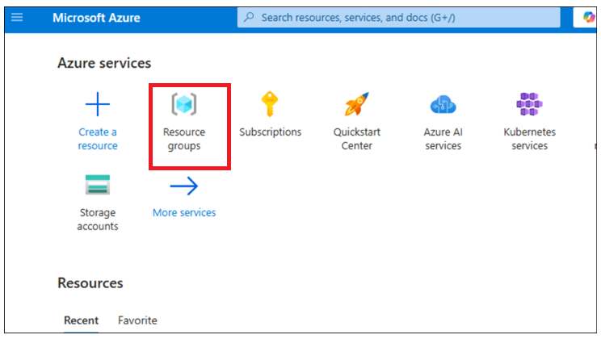
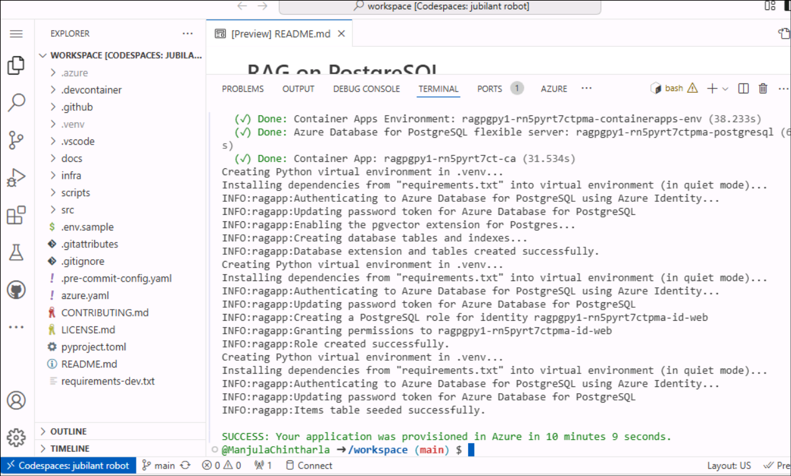
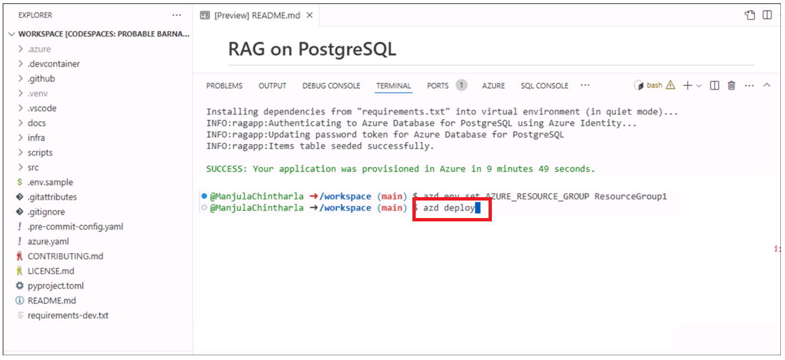
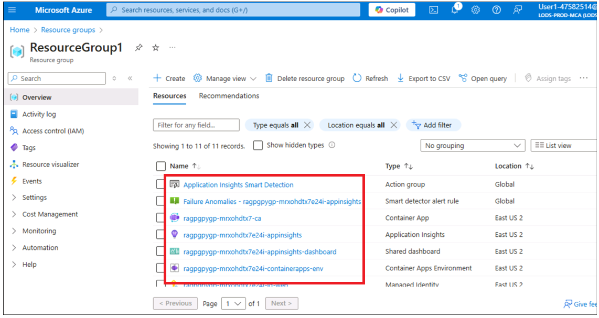

# 用例 06 - 使用 PostgreSQL 灵活服务器在 Azure 容器应用上部署聊天应用

**目的：**

- 若要通过安装 Azure CLI 在 Windows 上配置开发环境，Node.js、分配 Azure
  订阅角色、启动 Docker Desktop 以及启用带有开发容器扩展的 Visual Studio
  Code。

- 在 Azure 上使用 PostgreSQL 和 OpenAI 部署和测试自定义聊天应用程序。

在此用例中，您将设置一个全面的开发环境，部署与 PostgreSQL
集成的聊天应用程序，并验证其在 Azure 上的部署。这涉及安装 Azure
CLI、Docker 和 Visual Studio Code
等基本工具（我们已经在主机环境中为您完成了）、在 Azure
中配置用户角色、使用 Azure 开发人员 CLI
部署应用程序以及与部署的资源交互以确保功能。

**使用的关键技术 --** Python、FastAPI、Azure OpenAI 模型、Azure Database
for PostgreSQL 和 azure-container-apps、ai-azd-templates。

**预计持续时间 --** 45 分钟

**实验类型：** 讲师指导

**先决条件：**

GitHub 帐户 -- 您应该拥有自己的 GitHub
登录凭证。如果您没有，请从这里创建一个- +++<https://github.com/signup?user_email=&source=form-home-signupobjectives+++>

**练习 1 ：配置、部署应用程序并从浏览器对其进行测试**

## 任务 0：了解 VM 和凭据

在此任务中，我们将识别并了解我们将在整个实验室中使用的凭证。

1.  “**说明**”选项卡包含实验室指南，其中包含在整个实验室中要遵循的说明。

2.  **Resources** 选项卡已获取执行实验室所需的凭证**。**

    - **URL –** Azure 门户的 URL

    - **Subscription （订阅） –** 这是分配给您的订阅的 ID

    - **用户名 –** 您需要用于登录 Azure 服务的用户 ID。

    - **Password （密码） –** Azure
      登录名的密码。让我们将此用户名和密码称为 Azure
      登录凭据。我们将在提及 Azure 登录凭据的任何地方使用这些凭据。

    - **Resource Group （资源组） –** 分配给您的资源组。

\[!Alert\] **重要提示**：请确保在此资源组下创建所有资源

> 

3.  **Help** （帮助） 选项卡包含 Support （支持） 信息。此处的 **ID**
    值是将在实验室执行期间使用的**实验室实例ID。**

> 

## 任务 1 ：注册服务提供商

1.  打开浏览器，转到 +++https://portal.azure.com+++，然后使用下面的
    Cloud Slice 帐户登录。

> 用户名： <+++@lab.CloudPortalCredential>(User1).Username+++
>
> 密码： <+++@lab.CloudPortalCredential(User1).Password>+++
>
> 
>
> 

2.  单击 **Subscriptions** 磁贴。

> 

3.  单击订阅名称。

> 

4.  展开 设置 从左侧导航菜单中。单击“**Resource providers**”，输入
    +++**Microsoft.AlertsManagement**+++
    并选择它，然后单击“**Register**”。

5.  单击“**Resource providers**”，输入
    +++**Microsoft.DBforPostgreSQL**+++
    并选择它，然后单击“**Register**”。

6.  重复步骤 \#10 和 \#11 以注册以下资源提供程序。

- Microsoft.搜索

- Microsoft.Web 网站

- Microsoft.ManagedIdentity

## 任务 2：复制现有资源组名称

1.  在主页上，单击“Resource groups”磁贴。

2.  确保您已经创建了一个资源组供您使用。切勿删除此资源组。相反，您可以删除资源组中的资源，但不能删除资源组本身。

3.  单击 Resource Group Name（资源组名称）

4.  复制资源组名称并将其保存在记事本中，以用于将所有资源部署到此资源组

## 任务 3：运行 Docker

1.  在 Desktop 上，双击 **Docker Desktop**。

> 

2.  运行 Docker Desktop。

> 

## 任务 4 ：开放开发环境

1.  打开浏览器，导航到地址栏，键入或粘贴以下
    URL： +++<https://github.com/technofocus-pte/rag-postgres-openai-python-CSTesting.git+++%C2%A0tab> 选项卡打开，并要求您在
    Visual Studio Code 中打开。 选择**Open Visual Studio Code。**

> 

2.  单击 **fork** 以分叉存储库。为存储库指定唯一名称，然后单击 **Create
    repo** 按钮。

> 
>
> 

3.  单击 **Code -\> Codespaces -\> Codespaces+**

> 

4.  等待 Codespaces 环境设置 。完全设置需要几分钟

> 
>
> 

## 任务 5：预配服务并将应用程序部署到 Azure

1.  在终端上运行以下命令。它会生成要复制的代码。复制代码并按 Enter。

+++azd auth login+++

> 

2.  默认浏览器将打开，以输入生成的代码进行验证。输入代码，然后单击
    **Next**（下一步）。

> 

3.  使用 Azure 凭据登录。

> 

4.  若要为 Azure 资源创建环境，请运行以下 Azure 开发人员 CLI
    命令。它要求您输入 环境名称 。输入您选择的任何名称，然后按
    Enter（例如 ：+++ragpgpy+++）

**注：** 创建环境时，请确保名称由小写字母组成。

> +++azd env new+++

5.  运行以下 Azure Developer CLI 命令以预配 Azure 资源并部署代码。

+++azd provision+++

6.  出现提示时，选择 **subscription**
    以创建资源，然后选择离你最近的区域;在本实验中，我们选择了 **East
    US2**（美国东部 2）区域。

7.  它将提示您“**Enter a value for the 'existingResourceGroupName'
    infrastructure parameter:**”输入在任务 1
    中复制的资源组（例如：用于开发切片的 ResourceGroup1）。您可以从
    **Resources** 部分复制资源组名称，如下图所示

8.  出现提示时，为 **enter a value for the 'openAILocation'
    infrastructure
    parameter**，选择离你最近的区域;在本实验中，我们选择了**美国中北部**区域

9.  预置资源大约需要 5 到 10 分钟。如果出现提示，请单击 **Yes**。

10. 等待模板成功预置所有资源。

11. 执行以下命令设置资源组

+++azd env set AZURE_RESOURCE_GROUP {your resource group
name}+++ 

12. 运行以下命令，将应用部署到 Azure。

+++azd deploy+++

13. 等待部署完成。部署需要 \<5

14. 单击已部署的 Web 应用程序终端节点链接。

15. 点击 **Open**（打开）。它打开带有应用程序的新标签页

16. 应用程序随即打开。

**任务 6：使用聊天应用程序从文件中获取答案**

1.  在 **RAG on database |OpenAI+PoastgreSQL** Web 应用程序页面，**点击
    Best shoe for hiking?** 按钮并观察输出

2.  点击 **clear chat**。

3.  在 **RAG on database |OpenAI+PoastgreSQL** Web 应用页面，点击
    **Climbing gear cheap than $30** 按钮并观察输出

4.  点击 **clear chat**。

**任务 7：在 Azure 门户中验证已部署的资源**

1.  在 Azure 门户的主页上，单击**Resource Groups**。

2.  单击您的资源组名称

3.  确保已成功部署以下资源

    - 容器应用程序

    - 应用程序洞察

    - 容器应用程序环境

    - Log Analytics 工作区

    - Azure OpenAI

    - Azure Database for PostgreSQL 灵活服务器

    - 容器注册表

4.  单击 **Azure OpenAI** 资源名称。

5.  在左侧导航菜单中的 “**Overview**”上，单击“**Go to Azure AI Foundry
    portal**”，然后选择打开新选项卡。

6.  单击左侧导航菜单中的 **共享资源 -\> 部署**，并确保
    **gpt-35-turbo、text-embedding-ada-002** 应成功部署

**任务 8 ： 清理所有资源**

要清理此示例创建的所有资源，请执行以下作：

1.  切换回 **Azure 门户 -\> 资源组 - \> 资源组名称。**

2.  选择所有资源，然后单击 Delete （删除），如下图所示。（**DO NOT
    DELETE** 资源组）

3.  在文本框中键入 delete，然后单击 **Delete**。

4.  单击 **Delete** 确认删除。

5.  切换回 Github 门户选项卡并刷新页面。

6.  单击 Code ，选择为此实验室创建的分支，然后单击 **Delete** 。

7.  单击 **Delete** 按钮确认分支删除。

**摘要：**此用例将指导您在 Azure 上使用 PostgreSQL 和 OpenAI
部署聊天应用程序，重点介绍基于云的应用程序部署和管理。您已经设置了开发环境，安装了必要的工具（如
Azure CLI），使用 Azure Developer CLI 配置了 Azure
资源，并将应用程序部署到 Azure 容器应用。
