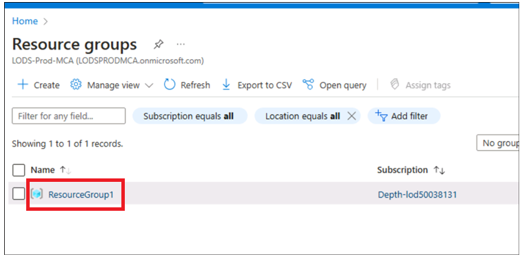
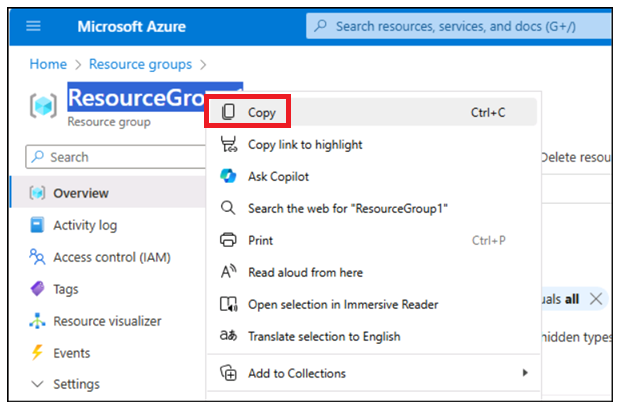
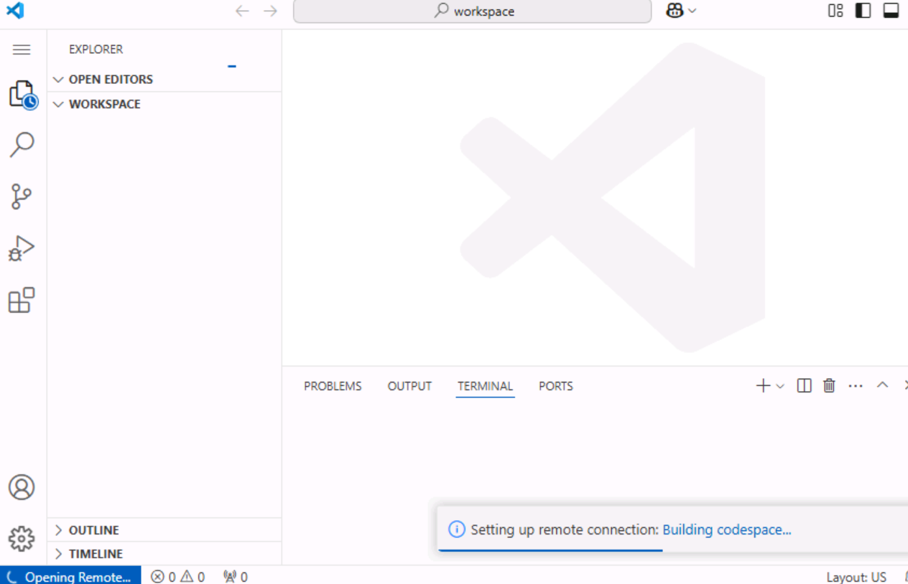
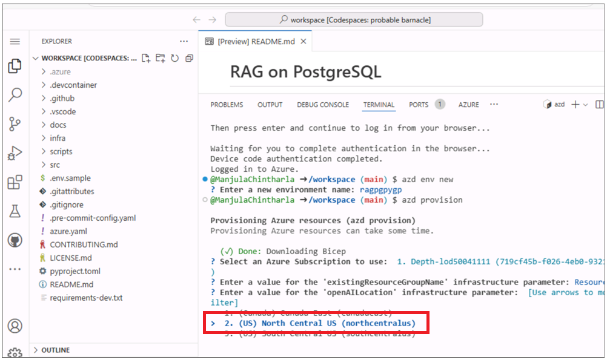
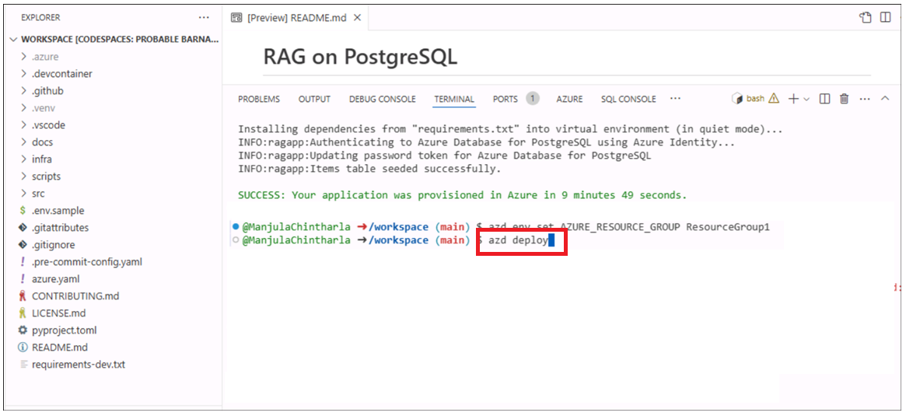
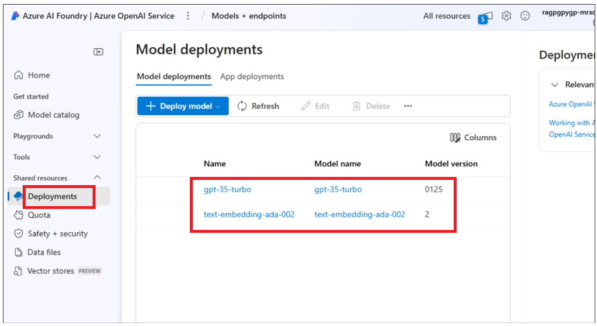
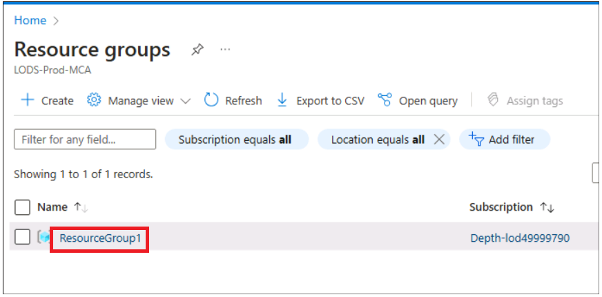
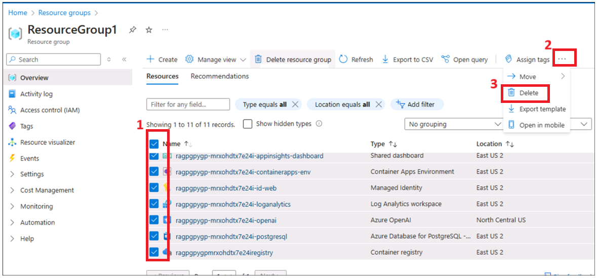
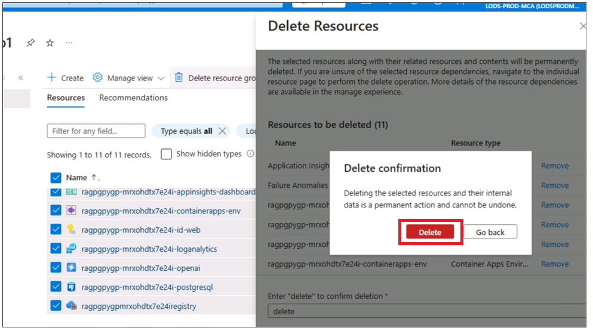
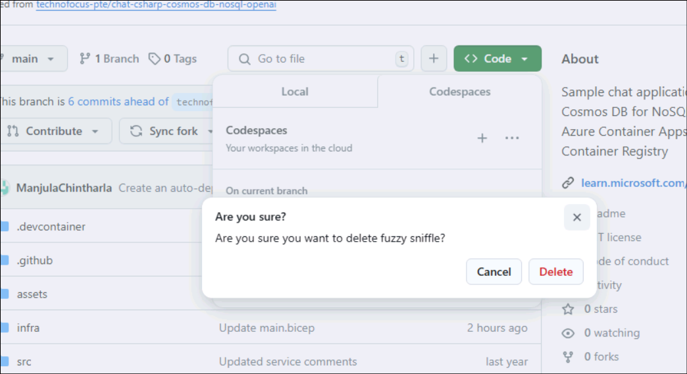

# Cas d'utilisation 06 - Déploiement d'une application de conversation sur Azure Container Apps avec PostgreSQL Flexible Server

**Objectif:**

- Pour configurer l'environnement de développement sur Windows en
  installant Azure CLI, Node.js, en attribuant des rôles d'abonnement
  Azure, en démarrant Docker Desktop et en activant l'extension Visual
  Studio Code avec Dev Containers.

- Déployer et tester l'application de chat personnalisée avec PostgreSQL
  et OpenAI sur Azure.

Dans ce cas d'utilisation, vous allez configurer un environnement de
développement complet, déployer une application de chat intégrée à
PostgreSQL et vérifier son déploiement sur Azure. Cela implique
l'installation d'outils essentiels tels qu'Azure CLI, Docker et Visual
Studio Code (nous l'avons déjà fait pour vous sur host env), la
configuration des rôles d'utilisateur dans Azure, le déploiement de
l'application à l'aide d'Azure Developer CLI et l'interaction avec les
ressources déployées pour garantir la fonctionnalité.

**Principales technologies utilisées** : Python, FastAPI, modèles Azure
OpenAI, Azure Database pour PostgreSQL et
azure-container-apps,ai-azd-templates.

**Durée estimée** -- 45 minutes

**Type de laboratoire :** Dirigé par un instructeur

**Pré-requis :**

Compte GitHub : vous devez disposer de vos propres identifiants de
connexion GitHub. Si vous ne l'avez pas, créez-en un à partir d'ici -
+++<https://github.com/signup?user_email=&source=form-home-signupobjectives+++>

**Exercice 1 : Provisionner, déployer l'application et la tester depuis
le navigateur**

## Tâche 0 : Comprendre la machine virtuelle et les informations d'identification

Dans cette tâche, nous identifierons et comprendrons les informations
d'identification que nous utiliserons tout au long du laboratoire.

1.  L'onglet Instructions contient le guide de laboratoire avec les
    instructions à suivre tout au long du laboratoire.

2.  **L**'onglet Ressources contient les informations d'identification
    nécessaires à l'exécution du laboratoire.

    - **URL** – URL du portail Azure

    - **Abonnement** – Il s'agit de l'ID de l'abonnement qui vous a été
      attribué

    - **Nom d'utilisateur** : ID utilisateur avec lequel vous devez vous
      connecter aux services Azure.

    - **Mot de passe** : mot de passe pour la connexion Azure. Appelons
      ce nom d'utilisateur et ce mot de passe en tant qu'identifiants de
      connexion Azure. Nous utiliserons ces crédits chaque fois que nous
      mentionnerons les identifiants de connexion Azure.

    - **Resource groups** : **Resource group** qui vous est attribué.

\[ ! Alerte\] **Important :** Assurez-vous de créer toutes vos
ressources sous ce resource groups

> 

3.  L'onglet Aide contient les informations d'assistance. La valeur
    **ID** ici est l'ID de **Lab instance ID** qui sera utilisé lors de
    l'exécution du laboratoire.

> 

## Tâche 1 : Enregistrer le prestataire de services

1.  Ouvrez un navigateur, accédez à +++https://portal.azure.com+++ et
    connectez-vous avec votre compte Cloud Slice ci-dessous.

> Nom d'utilisateur : [+++@lab.
> CloudPortalCredential](mailto:+++@lab.CloudPortalCredential)(Utilisateur1).
> Nom d'utilisateur+++
>
> Mot de passe : [+++@lab. CloudPortalCredential(Utilisateur1). Mot de
> passe](mailto:+++@lab.CloudPortalCredential(User1).Password)+++
>
> 
>
> 

2.  Cliquez sur la tuile **Subscription.**

> 

3.  Cliquez sur le nom de l'abonnement.

> 

4.  Développez Settings dans le menu de navigation de gauche. Cliquez
    sur **Resource providers**, entrez
    +++**Microsoft.AlertsManagement+++** et sélectionnez i,t, puis
    cliquez sur **Register**.

5.  Cliquez sur **Resource providers**, entrez
    +++**Microsoft.DBforPostgreSQL+++** et sélectionnez i,t, puis
    cliquez sur **Register**.

6.  Répétez les étapes \#10 et \#11 pour enregistrer les fournisseurs de
    ressources suivants.

- Microsoft.Search

- Sur Microsoft.Web

- Microsoft.ManagedIdentity

## Tâche 2 : Copier le nom du resource groups existant

1.  Sur la page d'accueil, cliquez sur la tuile **Resource groups**.

2.  Assurez-vous qu'un resource groups a déjà été créé pour que vous
    puissiez l'utiliser. Ne supprimez jamais ce resource groups. Au lieu
    de cela, vous pouvez supprimer des ressources au sein du resource
    groups, mais pas le resource groups lui-même.

3.  Cliquez sur le nom du resource groups

4.  Copiez le nom du resource groups et enregistrez-le dans le
    Bloc-notes pour l'utiliser pour déployer toutes les ressources dans
    ce resource groups

## Tâche 3 : Exécuter le Docker

1.  Sur le bureau, double-cliquez sur **Docker Desktop**.

> 

2.  Exécutez le Docker Desktop.

> 

## Tâche 4 : Environnement de développement ouvert

1.  Ouvrez votre navigateur, accédez à la barre d'adresse, tapez ou
    collez l'URL suivante : L'onglet
    +++[https://github.com/technofocus-pte/rag-postgres-openai-python-CSTesting.git+++++](https://github.com/technofocus-pte/rag-postgres-openai-python-CSTesting.git+++%C2%A0tab)
    s'ouvre et vous demande d'ouvrir dans Visual Studio Code.
    Sélectionnez **Open Visual Studio Code.**

> 

2.  Cliquez sur **fork** pour dupliquer le dépôt. Donnez un nom unique
    au dépôt et cliquez sur le bouton **Create repo**.

> 
>
> 

3.  Click on **Code -\> Codespaces -\> Codespaces+**

> 

4.  Attendez que l'environnement Codespaces soit configuré .
    L'installation complète prend quelques minutes

> 
>
> 

## Tâche 5 : Approvisionner des services et déployer l'application sur Azure

1.  Exécutez la commande suivante sur le terminal. Il génère le code à
    copier. Copiez le code et appuyez sur Entrée.

+++azd auth login+++

> 

2.  Le navigateur par défaut s'ouvre pour entrer le code généré à
    vérifier. Entrez le code et cliquez sur **Next**.

> 

3.  Connectez-vous à l'aide de vos informations d'identification Azure.

> 

4.  Pour créer un environnement pour les ressources Azure, exécutez la
    commande Azure Developer CLI suivante. Il vous demande d'entrer le
    nom de l'environnement . Entrez le nom de votre choix et appuyez sur
    Entrée (par exemple :+++ragpgpy+++)

**Remarque :** Lors de la création d'un environnement, assurez-vous que
le nom est composé de lettres minuscules.

> +++azd env new+++

5.  Exécutez la commande Azure Developer CLI suivante pour
    approvisionner les ressources Azure et déployer le code.

+++ Azd provision+++

6.  Lorsque vous y êtes invité, sélectionnez un **subscription** pour
    créer les ressources et sélectionnez la région la plus proche de
    votre emplacement ; dans cet atelier, nous avons choisi la région
    **USA Est 2**.

7.  Il vous demandera « **Enter a value for the
    'existingResourceGroupName' infrastructure parameter:** » entrez le
    resource groups copié dans la tâche 1 (par exemple :
    \*\*ResourceGroup1 utilisé pour la tranche de développement)
    .\*\*Vous pouvez copier le nom du resource groups à partir de la
    section **Resources** comme indiqué dans l'image ci-dessous

8.  Lorsque vous y êtes invité, **enter a value for the « openAILocation
    » infrastructure parameter** et sélectionnez la région la plus
    proche de votre emplacement. Dans cet atelier, nous avons choisi la
    région **North Central US**

9.  L'approvisionnement des ressources prend environ 5 à 10 min. Cliquez
    sur **Yes** si vous y êtes invité.

10. Attendez que le modèle provisionne toutes les ressources avec
    succès.

11. Exécutez la commande below pour définir le resource group

+++azd env set AZURE_RESOURCE_GROUP {nom de votre resource
group}+++

12. Exécutez la commande ci-dessous pour déployer l'application sur
    Azure.

+++azd déployer+++

13. Attendez la fin du déploiement. Le déploiement prend \<5

14. Cliquez sur le lien du point de terminaison de l'application web
    déployée.

15. Cliquez sur **Open**. Il ouvre un nouvel onglet avec l'application

16. L'application s'ouvre.

**Tâche 6 : Utiliser l'application de chat pour obtenir des réponses à
partir de fichiers**

1.  Dans le **RAG on database |**Page de l'application Web
    **OpenAI+PoastgreSQL**, **click on best shoe for hiking?** bouton et
    observez la sortie

2.  Cliquez sur le **clear chat.**

3.  Dans le **RAG on database |**Page de l'application Web
    **OpenAI+PoastgreSQL**, cliquez sur le bouton **Climbing gear
    cheaper tha \\30** et observez la sortie

4.  Cliquez sur le **clear chat.**

**Tâche 7 : Vérifier les ressources déployées dans le portail Azure**

1.  Sur la page d'accueil du portail Azure, cliquez sur **Resource
    Groups**.

2.  Cliquez sur le nom de votre resource group

3.  Assurez-vous que la ressource ci-dessous a été déployée avec succès

    - Container App

    - Application Insights

    - Container Apps Environment

    - Log Analytics workspace

    - Azure OpenAI

    - Azure Database for PostgreSQL flexible server

    - Container registry

4.  Cliquez sur le nom de la ressource **Azure OpenAI**.

5.  Dans **Overview** dans le menu de navigation de gauche, cliquez sur
    **Go to Azure AI Foundry portal** et sélectionnez pour ouvrir un
    nouvel onglet.

6.  Cliquez sur **Shared resources-\> Deployments** dans le menu de
    navigation de gauche et assurez-vous que **gpt-35-turbo**,
    **text-embedding-ada-002** doit être déployé avec succès

**Tâche 8 : Nettoyer toutes les ressources**

Pour nettoyer toutes les ressources créées par cet exemple :

1.  Revenez au **Azure portal -\> Resource group \> Resource group
    name.**

2.  Sélectionnez toutes les ressources, puis cliquez sur Supprimer comme
    indiqué dans l'image ci-dessous. (resource groups **DO NOT DELETE**)

3.  Tapez delete dans la zone de texte, puis cliquez sur **Delete**.

4.  Confirmez la suppression en cliquant sur **Delete**.

5.  Revenez à l'onglet du portail Github et actualisez la page.

6.  Cliquez sur Code , sélectionnez la branche créée pour ce laboratoire
    et cliquez sur **Delete**.

7.  Confirmez la suppression de la branche en cliquant sur le bouton
    **Delete**.

**Résumé :** Ce cas d'utilisation vous guide tout au long du déploiement
d'une application de conversation avec PostgreSQL et OpenAI sur Azure,
en vous concentrant sur le déploiement et la gestion d'applications
basées sur le cloud. vous avez configuré l'environnement de
développement, installé les outils nécessaires tels qu'Azure CLI,
configuré les ressources Azure à l'aide d'Azure Developer CLI et déployé
l'application dans Azure Container Apps.
