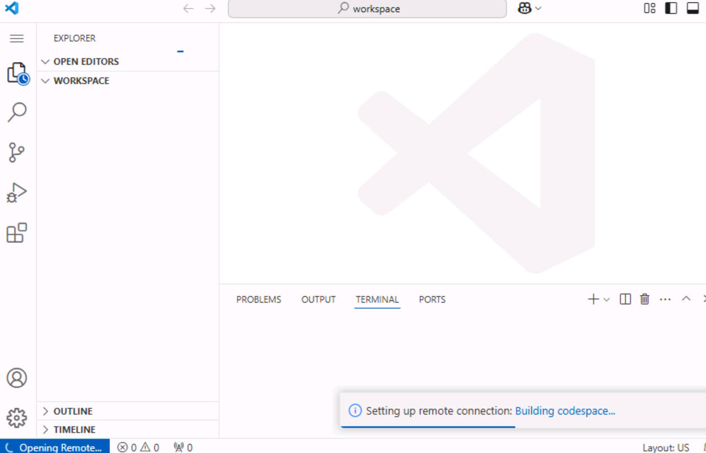
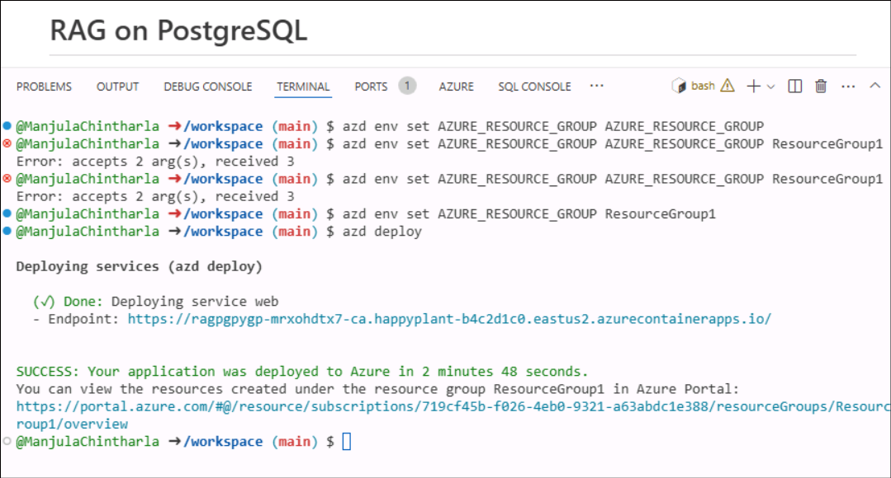
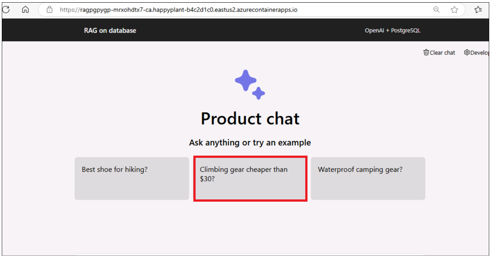
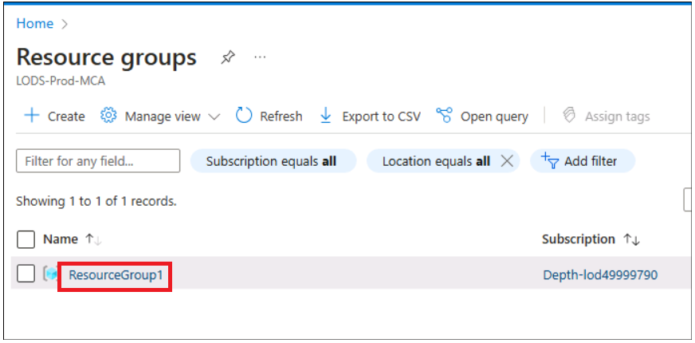

# ユースケース 06 - PostgreSQL フレキシブル サーバーを使用して Azure Container Apps にチャットアプリをデプロイする

**目的：**

- Azure CLI、Node.js をインストールし、Azure サブスクリプション
  ロールを割り当て、Docker Desktop を起動し、Dev Containers
  拡張機能を使用して Visual Studio Code を有効にして、Windows
  上で開発環境を構成する。

- Azure で PostgreSQL と OpenAI を使用したカスタムチャット
  アプリケーションをデプロイしてテストします。

このユース ケースでは、包括的な開発環境を設定し、PostgreSQL
と統合されたチャット アプリケーションをデプロイして、Azure
でのデプロイを確認します。これには、Azure CLI、Docker、Visual Studio
Code などの重要なツールのインストール (ホスト env
で既に実行されています)、Azure でのユーザー ロールの構成、Azure
Developer CLI
を使用したアプリケーションのデプロイ、デプロイされたリソースとの対話が含まれ、機能を確認します。

**使用した主なテクノロジ** -- Python、FastAPI、Azure OpenAI
モデル、Azure Database for
PostgreSQL、azure-container-apps、ai-azd-templates。

**推定所要時間**-- 45 分

**ラボタイプ:** インストラクター主導

**前提条件:**

GitHub アカウント -- 自分の GitHub
ログイン資格情報を持っている必要があります。お持ちでない場合は、こちらから作成してください -
+++<https://github.com/signup?user_email=&source=form-home-signupobjectives+++>

**演習 1 :
アプリケーションをプロビジョニングし、デプロイし、ブラウザーからテストします**

## タスク 0: VM と資格情報を理解する

このタスクでは、ラボ全体で使用する資格情報を特定して理解します。

1.  **\[Instructions** **\]**
    タブには、ラボ全体に従うべき指示が記載されたラボ ガイドがあります。

2.  **\[Resources** \] タブには、ラボの実行に必要な資格情報があります。

    - **URL** – Azure portal の URL

    - **サブスクリプション** –
      これは、お客様に割り当てられたサブスクリプションの ID です

    - **ユーザー名** – Azure サービスにログインするために必要なユーザー
      ID。

    - **パスワード** – Azure
      ログインのパスワード。このユーザー名とパスワードを Azure
      ログイン資格情報と呼ぶことにします。これらのクレドは、Azure
      のログイン資格情報について言及するすべての場所で使用します。

    - **リソースグループ** – **自分に割り当てられた**リソースグループ。

\[!アラート\]**重要:**このリソースグループの下にすべてのリソースを作成してください

> 

3.  **\[ヘルプ**\] タブには、サポート情報が表示されます。ここでの **ID**
    値は、 **ラボの実行中に使用される**ラボ インスタンス ID です。

> 

## タスク 1 : サービス プロバイダーの登録

1.  ブラウザを開き、+++https://portal.azure.com++++に移動して、以下のクラウドスライスアカウントでサインインします。

> ユーザー名: <+++@lab.CloudPortalCredential>(User1).Username+++
>
> パスワード：<+++@lab.CloudPortalCredential(User1).Password>+++
>
> 

2.  **Subscriptions** **タイル**をクリックします。

> 

3.  subscription nameをクリックします。

> 

4.  左側のナビゲーションメニューから\[設定\]を展開します。\[**Resource
    providers\]
    をクリックし**、「+++**Microsoft.AlertsManagement+++」**と入力して
    \[i,t\] を選択し、\[**Register**\] をクリックします。

5.  \[リソース プロバイダー**\]
    をクリックし**、「+++**Microsoft.DBforPostgreSQL+++**」と入力して
    \[i,t\] を選択し、\[**Register**\] をクリックします。

6.  手順 \#10 と \#11
    を繰り返して、次のリソースプロバイダーを登録します。

- Microsoft.Search

- Microsoft.Web

- Microsoft.ManagedIdentity

## タスク 2: 既存のリソース グループ名をコピーする

1.  ホーム ページで、\[**Resource groups** \] をクリックします。

2.  作業するためのリソース
    グループが既に作成されていることを確認してください。このリソース・グループは絶対に削除しないでください。代わりに、リソース
    グループ内のリソースは削除できますが、リソース
    グループ自体は削除できません。

3.  リソース・グループ名をクリックします

4.  リソース グループ名をコピーしてメモ帳に保存し、このリソース
    グループにすべてのリソースをデプロイするときに使用します

## タスク 3 : Docker を実行する

1.  デスクトップで、**Docker Desktopをダブルクリックします**。

> 

2.  Docker デスクトップを実行します。

> 

## タスク4:オープンな開発環境

1.  ブラウザを開き、アドレスバーに移動し、次のURLを入力または貼り付けます:+++[https://github.com/technofocus-pte/rag-postgres-openai-python-CSTesting.git+++タブ](https://github.com/technofocus-pte/rag-postgres-openai-python-CSTesting.git+++%C2%A0tab)が開き、VisualStudioCodeで開くように求められます。\[**Open
    Visual Studio Code\] を選択します。**

> 

2.  **fork** **をクリックして**
    リポジトリをフォークします。リポジトリに一意の名前を付け、\[**Create
    repo\]**ボタンをクリックします。

> 
>
> 

3.  Code -\> **Codespaces** -\> **Codespaces**+ **をクリックします。**

> 

4.  Codespaces
    環境が設定されるのを待ちます。完全にセットアップするには数分かかります

> 
>
> 

## タスク 5: サービスをプロビジョニングし、アプリケーションを Azure にデプロイする

1.  ターミナルで次のコマンドを実行します。コピーするコードが生成されます。コードをコピーしてEnterキーを押します。

+++azd auth login+++

> 

2.  デフォルトのブラウザが開き、検証する生成されたコードを入力します。コードを入力し、\[**Next**\]
    をクリックします。

> 

3.  Azure の資格情報でサインインします。

> 

4.  Azure リソースの環境を作成するには、次の Azure Developer CLI
    コマンドを実行します。環境名を入力するように求められます。任意の名前を入力してEnterキーを押します(例:+++ragpgpy+++)

**注:**
環境を作成するときは、名前が小文字で構成されていることを確認してください。

> +++azd env new+++

5.  次の Azure Developer CLI コマンドを実行して、Azure
    リソースをプロビジョニングし、コードをデプロイします。

+++azd provision+++

6.  メッセージが表示されたら、**リソースを作成するサブスクリプション**を選択し、現在地に最も近いリージョンを選択します。このラボでは、**East
    US2** リージョンを選択しています。

7.  「**Enter a value for the 'existingResourceGroupName' infrastructure
    parameter**:**」というプロンプトが表示されます。**タスク 1
    でコピーしたリソース グループを入力します (例:
    開発スライスに使用される
    \*\*ResourceGroup1)」。\*\*次の図に示すように、リソース
    セクションからリソース グループ名をコピーできます

8.  プロンプトが表示されたら、**'openAILocation' インフラストラクチャ
    パラメータの値を入力し**、現在地に最も近いリージョンを選択します。このラボでは、**North
    Central US** **の**リージョンを選択しています

9.  リソースのプロビジョニングには約 5 分から 10 分かかります。
    **プロンプトが表示されたら** \[**Yes** \] をクリックします。

10. テンプレートがすべてのリソースを正常にプロビジョニングするまで待ちます。

11. 次のコマンドを実行して、リソースグループを設定します

+++azd env set AZURE_RESOURCE_GROUP {your resource group
name}+++ 

12. 次のコマンドを実行して、アプリを Azure にデプロイします。

+++azd deploy+++

13. デプロイが完了するまで待ちます。デプロイには \<5 かかります

14. デプロイされた Web アプリ エンドポイントのリンクをクリックします。

15. \[**Open\]をクリックします**。アプリで新しいタブが開きます

16. アプリが開きます。

**タスク 6: チャットアプリを使用してファイルから回答を取得する**

1.  **RAGデータベース内 |OpenAI + PoastgreSQL**
    Webアプリのページで、**Best shoe for
    hiking?** **をクリックしますか?**ボタンをクリックし、出力を観察します

2.  **clear chatをクリックします。**

3.  **RAG on database |OpenAI + PoastgreSQL**
    Webアプリのページで、**Climbing gear cheaper than
    \\30** ボタンをクリックして、出力を観察します

4.  **clear chatをクリックします。**

**タスク 7: Azure portal でデプロイされたリソースを確認する**

1.  Azure portal の ホーム ページで、\[**Resource Groups\]
    をクリックします**。

2.  リソース・グループ名をクリックします

3.  以下のリソースが正常にデプロイされたことを確認します

    - Container App

    - Application Insights

    - Container Apps Environment

    - Log Analytics workspace

    - Azure OpenAI

    - Azure Database for PostgreSQL flexible server

    - Container registry

4.  \[Azure OpenAI **リソース名**\] をクリックします。

5.  **左側のナビゲーション メニューの \[Overview** **\] で、 \[**Azure
    AI Foundry ポータルに移動**\]
    をクリックし、新しいタブを選択して開きます。**

6.  左側のナビゲーションメニューから **\[Shared resources -\>
    Deployments**\]
    をクリックし、**gpt-35-turbo**、**text-embedding-ada-002**
    が正常にデプロイされることを確認します

**タスク 8 : すべてのリソースをクリーンアップする**

このサンプルで作成されたすべてのリソースをクリーンアップするには、次のようにします。

1.  **Azure portal -\> Resource group- \> Resource group
    nameに戻ります。**

2.  すべてのリソースを選択し、下の画像に示すように\[Delete\]をクリックします。(リソース・グループを削除しないでください)

3.  テキストボックスに「delete」と入力し、\[**Delete**\]をクリックします。

4.  \[**Delete\]をクリックして削除を確認します**。

5.  Githubポータルタブに戻り、ページを更新します。

6.  \[コード\]
    をクリックし、このラボ用に作成したブランチを選択して、\[**Delete**\]
    をクリックします。

7.  \[**Delete\]ボタンをクリックして、ブランチの削除を確認します** 。

**概要:**このユース
ケースでは、クラウドベースのアプリケーションのデプロイと管理に焦点を当てて、PostgreSQL
と OpenAI を使用して Azure にチャット
アプリケーションをデプロイする手順を説明します。開発環境をセットアップし、必要なツール
(Azure CLI など) をインストールし、Azure Developer CLI を使用して Azure
リソースを構成し、アプリケーションを Azure Container Apps
にデプロイしました。
