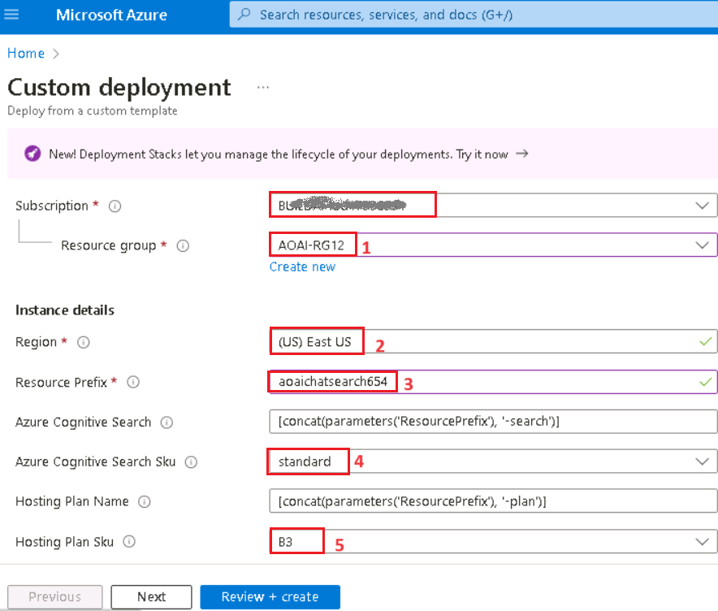
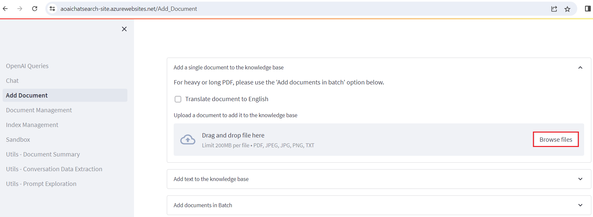
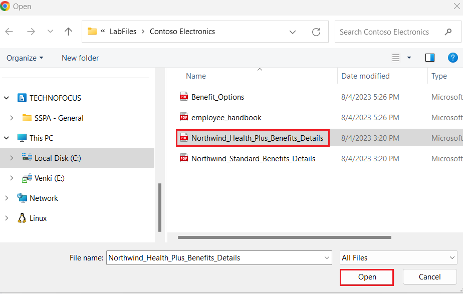
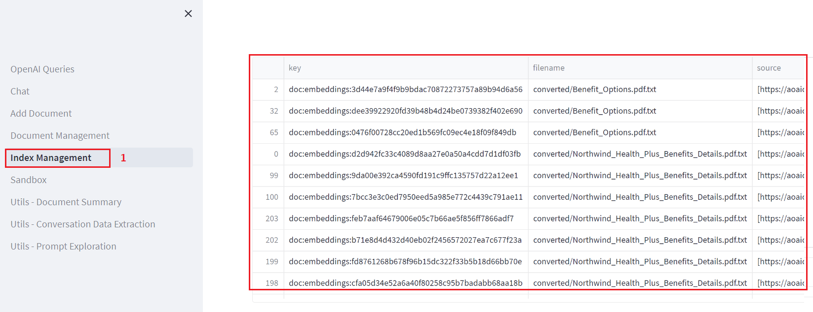
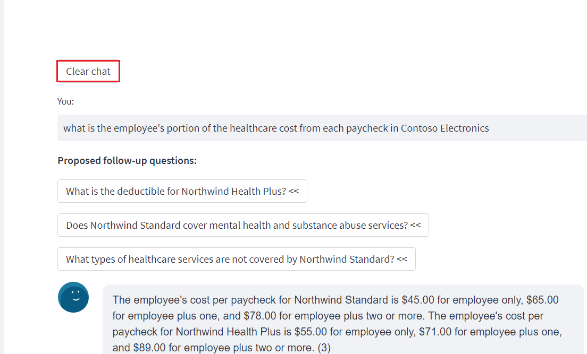
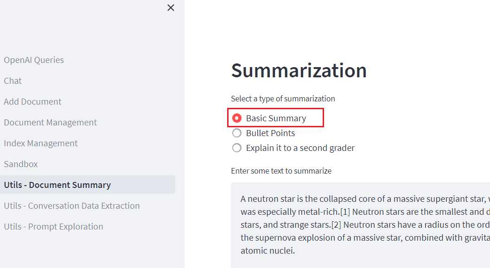

**实验 07：使用语义回答实现 Q&A**

**介绍**

一个简单的 Web 应用程序，用于支持 OpenAI 的文档搜索。此存储库使用 Azure
OpenAI
服务从文档创建嵌入向量。为了回答用户的问题，它会检索最相关的文档，然后使用
GPT-3 提取问题的匹配答案。

**目标**

- 在 Azure AI Studio 中部署聊天和嵌入模型。

- 使用自定义模板部署所需的资源，例如应用服务、搜索服务、表单识别器等。

- 部署 aoaichatsearch-site Web 应用程序并执行支持 Azure OpenAI
  的文档搜索、文本摘要和对话数据提取。

- 删除已部署的资源和模型。

## **任务 1：创建 Azure OpenAI 资源**

1.  在 Azure 门户主页中，单击 **Azure 门户菜单**，该菜单由 Microsoft
    Azure 命令栏左侧的三个水平条表示，如下图所示。

> 

2.  导航并单击 + **Create a resource**。

> 

3.  在 **Create a resource** page（创建资源页面）的 **Search services
    and marketplace**（搜索服务和市场）搜索栏中，键入**Azure
    OpenAI**，然后按 Enter 按钮。

> 

4.  在 “**Marketplace**” 页面中，导航到 **Azure OpenAI** 部分，单击
    “创建” 按钮下拉列表，然后选择 **Azure
    OpenAI**，如图所示。（如果您已经单击 **Azure OpenAI** 磁贴，然后单击
    **Azure OpenAI** 页面上的 “**Create**” 按钮）。

> 

5.  在 **Create Azure OpenAI** 窗口的 **Basics**
    选项卡下，输入以下详细信息，然后单击 **Next** 按钮。

[TABLE]

> 

6.  在 **Network** 选项卡中，将所有单选按钮保留为默认状态，然后单击
    **Next** 按钮。

> 

7.  在 **Tags** 选项卡中，将所有字段保留为默认状态，然后单击 **Next**
    按钮。

> 

8.  在 **Review+submit** 选项卡中，验证通过后，单击 **Create** 按钮。

> 

9.  等待部署完成。部署大约需要 **2-3** 分钟。

10. 在 **Microsoft.CognitiveServicesOpenAI** 窗口中，部署完成后，单击
    **Go to resource** （转到资源） 按钮。

> 

11. 在 **Azure-open-testXX |Model deployments** （模型部署）
    窗口中，导航到 **Resource Management** （资源管理） 部分，然后单击
    **Keys and Endpoints** （密钥和终端节点）。

12. 在 **Keys and Endpoints** 页面中，复制 **KEY1、KEY 2** 和
    **Endpoint**
    值并将其粘贴到记事本中，如下图所示，然后**保存**记事本以在即将到来的实验中使用这些信息。

## **任务 2：部署 Chat 模型和嵌入模型**

1.  在 **Azure-openai-testXX** 页面中，单击左侧导航菜单中的
    “**Overview**” ，向下滚动并单击 “**Explore Azure AI Foundry
    portal**” 按钮，如下图所示。

> 

2.  等待 Azure OpenAI 工作室启动。

> 

3.  在 **Azure AI Foundry |Azure OpenAI Studio**
    主页：从左侧导航菜单中选择 **Deployment**。

4.  在 **Deployments** （部署） 窗口中，下拉 **+Deploy model**
    （部署模型），然后选择 **Deploy base model**（部署基础模型）。

> 

5.  在 **Select a model** 对话框中，导航并仔细选择 **gpt-4**，然后单击
    **Confirm** 按钮。.

6.  选择 **Model version**（模型版本）作为 **0125-Preview**，在
    **Deployment type**（部署类型）作为
    **Standard**（标准）、**Deployment
    name**（部署名称）**字段中**，输入 **gpt-4**，然后单击
    **Create**（创建）按钮。

> 

7.  在 **Deployments** （部署） 窗口中，下拉 **+Deploy model**
    （部署模型），然后选择 **Deploy base model**（部署基础模型）。

> 

8.  在 **Select a model** 对话框中，导航并仔细选择
    **text-embedding-ada-002**，然后单击 **Confirm** 按钮。

9.  在 **Deploy model** 对话框的 **Deployment name** 下输入
    +++**text-embedding-ada-002+++**，选择 **Standard** 作为
    **Deployment type** ，然后单击 **Deploy** 按钮。

## **任务 3：使用 Azure 认知搜索在 Azure 上部署（WebApp + 批处理）**

1.  打开 Edge 浏览器，导航到地址栏，然后键入或粘贴以下
    URL：<https://portal.azure.com/#create/Microsoft.Template/uri/https%3A%2F%2Fraw.githubusercontent.com%2Fruoccofabrizio%2Fazure-open-ai-embeddings-qna%2Fmain%2Finfrastructure%2Fdeployment_ACS.json>
    然后按 **Enter** 按钮。

2.  在 **Custom deployment** window 的 **Basics**
    选项卡下，输入以下详细信息以部署自定义模板，然后单击 **Review +
    create**。

[TABLE]

3.  在 **Review + create** 选项卡上，通过 Validation 后，单击 **Create**
    按钮。

4.  等待部署完成。部署大约需要 15-17 分钟。

> 

5.  单击 **Go to resource group** 按钮。

> 

## **任务 4：通过 Web 应用程序搜索已启用 Azure OpenAI 的文档** 

1.  在 **aoaiXXX-RG** 资源组窗口的 **Resources** 选项卡下，导航到 **App
    Service - aoaaichatsearch-site** 并单击它。

2.  在 **aoaichatsearch-site** Web App **Overview**
    页面上，导航到命令栏并单击 **Browse**，它将导航到 Web 应用程序。

3.  等待 Web 应用程序部署完成。部署大约需要 **10-15** 分钟。

4.  在 Web 应用程序主页上，要验证部署状态，请单击 Microsoft 下的 **Check
    deployments** （检查部署） 按钮。

5.  要检查部署状态，可能需要大约 5-6 分钟。

6.  在 Web 应用程序主页上，导航并单击左侧的 **Add Document**
    以添加数据。

7.  在 **Add Document** （添加文档） 窗格中，单击 **Browse files**
    （浏览文件） 按钮以上传需要添加到知识库的文档。

8.  导航到 VM 中的 **C：\Labfiles\Contoso Electronics** 位置，选择
    **Benefit_Options.pdf**，然后单击 “**Open**” 按钮。

9.  再次单击 “**Browse files**”，导航到 VM 中的 **C：\Labfiles\Contoso
    Electronics**
    位置并选择“**employee_handbook.pdf**”，然后单击“**Open**”按钮。

10. 同样，添加 **Northwind_Health_Plus_Benefits_Details.pdf**
    和**Northwind_Standard_Benefits_Details.pdf**

11. 上传的数据将添加到知识库中，大约需要 5-7 分钟。

12. 单击 **Document Management** 以验证文件是否已成功上传。

13. 单击 **Index Management**（索引管理）以验证文件、键和源。

14. 然后，点击 **Chat**。

15. 在 **Chat session** （聊天会话） 部分中，输入以下提示，然后按
    **Enter** 按钮并查看响应。

**You**: **what is the employee's portion of the healthcare cost from
each paycheck in Contoso Electronics**

16. 在 **Chat session** 部分，单击 **Clear chat** 按钮。

17. 在 **Chat session** （聊天会话） 部分中，输入以下提示，然后按
    **Enter** 按钮并查看响应。

**You**: **How do I file a complaint or appeal with Northwind Health
Plus?**

18. 在 **Chat session** 部分，单击 **Clear chat** 按钮。

19. 在 **Chat session** （聊天会话） 部分中，输入以下提示。然后按
    **Enter** 按钮并查看响应。

**You**: **Does my plan covers my eye exams?**

20. 单击左侧的 **Utils-Document Summary**。

21. 在 **Summarization**部分中，选择 **Basic Summary** 单选按钮。

22. 在 **Summarization** 窗口的 **Enter some text to summarize**
    部分的消息框中，将当前文本替换为以下内容，然后单击 **Summarize**
    按钮。

It’s been six months since we reinvented search with [the new AI-powered
Bing and
Edge](https://blogs.microsoft.com/blog/2023/02/07/reinventing-search-with-a-new-ai-powered-microsoft-bing-and-edge-your-copilot-for-the-web/).
In that short time, you’ve engaged in so many unique and creative ways;
to date we’ve seen over 1 billion chats and over 750 million images fill
the world of Bing! We’ve also seen nine consecutive quarters of growth
on Edge, meaning we’re more able than ever to bring our best-in-class AI
experiences to users across the web.

23. 检查您输入的文本的摘要。

24. 查看 Summary 结果后，单击 **Clear summary** 按钮。

25. 现在，向上滚动并选择 **Bullet Points** 单选按钮。在 **Enter some
    text to summarize**
    部分的消息框中，将当前文本替换为以下内容，然后单击 **Summarize**
    按钮。

Microsoft has made its Azure OpenAI Service generally available,
bringing the enterprise generative AI tools out of its invite-only
program. Now any customers who meet Microsoft’s standards can access the
professional versions of OpenAI’s large language model GPT-3.5 and the
related text-to-image tool DALL-E 2, computer programming assistant
Codex, and the popular ChatGPT chatbot interface for the LLM.

Microsoft launched the Azure OpenAI Service with an eye toward offering
businesses a way to develop apps without coding, write reports, and put
together marketing content. The scope has grown since then to encompass
new facets of the OpenAI’s models, including chat and visuals. Those
interested in the tools have to explain how they will use the AI tools
and agree to Microsoft’s ethical guidelines in their application for
access. The decision to widen the Azure OpenAI Service’s availability
arrives in tandem with Microsoft’s plans to integrate ChatGPT and DALL-E
into its Office suite, Bing search engine, and other consumer products.
Azure OpenAI Service followed earlier experiments to integrate GPT-3
into Microsoft projects like the low-code Power Apps programming tool
and the GitHub Copilot programming assistant.

26. 您将以项目符号的形式看到摘要结果。

27. 单击左侧的 **Utils-Conversation Data Extraction**。

28. 在 **Conversation data extraction** （对话数据提取） 窗格中，单击
    **Execute tasks** （执行任务） 并在 **OpenAI result** （OpenAI
    结果） 下查看响应。

29. 查看从 Agent 和 User 之间的对话中提取的数据。

## 任务 5：删除已部署的资源和模型

1.  若要删除已部署的资源，请导航到 **Azure 门户主**页，单击 “**Resource
    groups**” 。

> 

2.  在 Resource groups （资源组） 页面中，选择您的资源组。

> 

3.  在 **Resource group** 主页中，选择所有资源，然后单击 **delete**

4.  在右侧显示的 **Delete Resources** 窗格中，导航到 **Enter “delete” to
    confirm deletion** 字段，然后单击 **Delete** 按钮。

5.  在 **Delete confirmation** 对话框中，单击 **Delete** 按钮。

> 

6.  单击铃铛图标，您将看到通知

**总结**

你已在 Azure AI Studio 中部署了 gpt-4 聊天模型和 text-embedding-ada-002
嵌入模型，然后已使用自定义模板部署了必要的资源。您已经在
aoaichatsearch-site Web App
中上传了非结构化文档，并在聊天会话中提取了准确的信息。您已经从示例文本中生成了基本摘要和要点摘要，然后从对话中提取了数据。在实验室结束时，你已删除资源和模型，以便有效地管理
Azure OpenAI 资源。

**重要提示: 请不要删除 Resource
Group。如果删除，您将无法继续下一个实验室或创建新的资源组。**

**请不要删除 Azure OpenAI 服务
（Azure-openai-testXX）。所有实验室都将使用相同的服务。**
