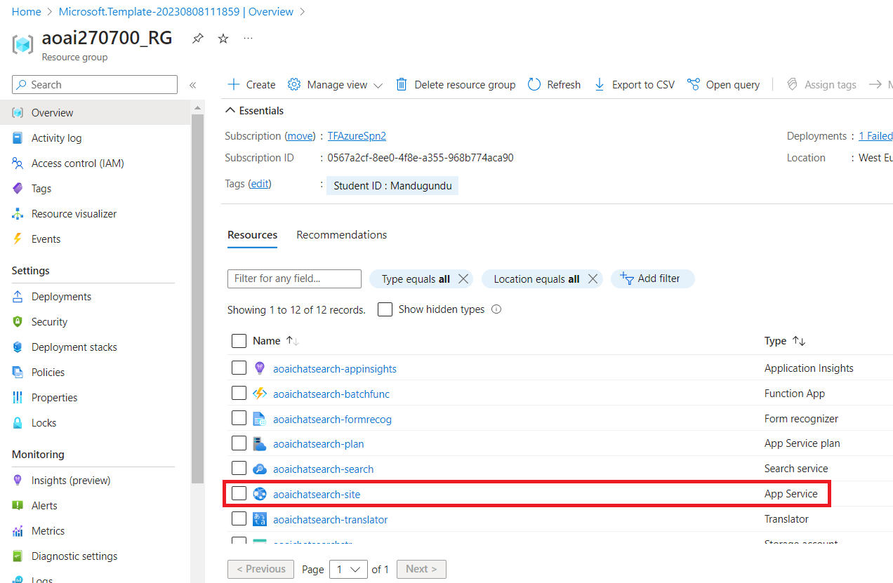
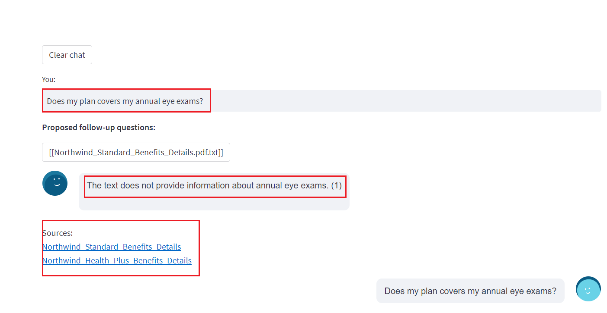
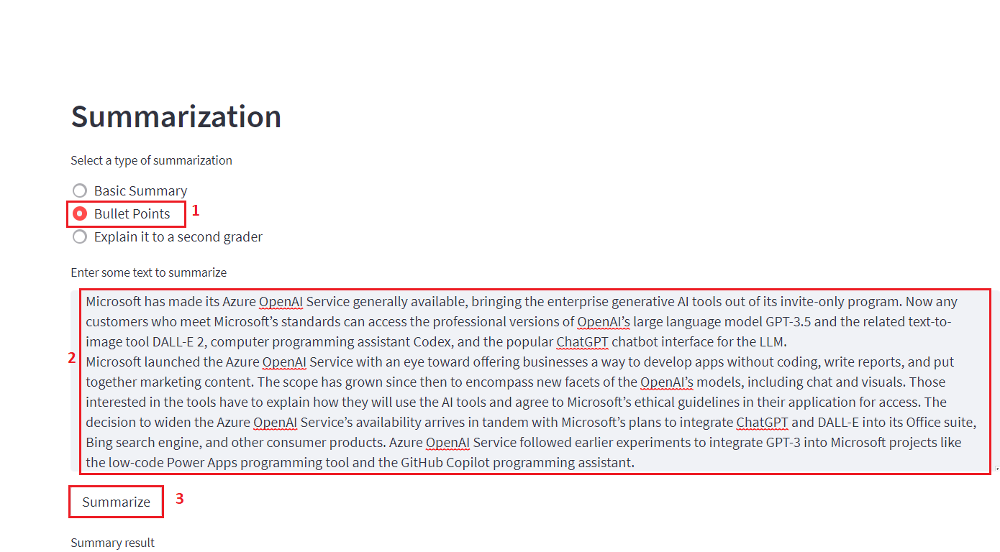

**Laboratoire 07 : Mise en œuvre des questions-réponses à l'aide de la
réponse sémantique**

**Introduction**

Une application Web simple pour une recherche de documents compatible
OpenAI. Ce référentiel utilise le service Azure OpenAI pour créer des
vecteurs d'incorporation à partir de documents. Pour répondre à la
question d'un utilisateur, il récupère le document le plus pertinent,
puis utilise GPT-3 pour extraire la réponse correspondante à la
question.

**Objectifs**

- Pour déployer des modèles de conversation et d'incorporation dans
  Azure AI Studio.

- Utiliser un modèle personnalisé pour déployer les ressources requises,
  telles que App Service, Search Service, Form recognizer, etc.

- Pour déployer l'application Web aoaichatsearch-site et effectuer une
  recherche de documents compatible Azure OpenAI, une synthèse de texte
  et une extraction de données de conversation.

- Pour supprimer les ressources et les modèles déployés.

## **Tâche 1 : Créer une ressource Azure OpenAI**

1.  À partir de la page d'accueil du portail Azure, cliquez sur
    l’**Azure** **portal menu** représenté par trois barres horizontales
    sur le côté gauche de la barre de commandes Microsoft Azure, comme
    illustré dans l'image ci-dessous.

> 

2.  Naviguez et cliquez sur **+ Create a resource**.

> 

3.  Dans la page **Create a resource** , dans la barre de recherche
    **Search services and marketplace** , tapez **Azure OpenAI,** puis
    appuyez sur le bouton **Enter**

> 

4.  Sur la page **Marketplace** , accédez à la section **Azure OpenAI**,
    cliquez sur la liste déroulante du bouton Créer, puis sélectionnez
    **Azure OpenAI** comme indiqué dans l'image. (Au cas où vous auriez
    déjà cliqué sur l'icône **Azure OpenAI**, puis cliquez sur le bouton
    **Create** sur l’**Azure OpenAI page**).

> 

5.  Dans la **window Create Azure OpenAI**, sous l' onglet **Basics** ,
    entrez les détails suivants et cliquez sur le bouton **Next**.

[TABLE]

> 

6.  Dans l'onglet **Network**, laissez toutes les cases d'option dans
    l'état par défaut et cliquez sur le bouton **Next**.

> 

7.  Dans l'onglet **Tags**, laissez tous les champs dans l'état par
    défaut et cliquez sur le bouton **Next**.

> 

8.  Dans l'onglet **Review + submit** , une fois la validation réussie,
    cliquez sur le bouton **Create**.

> 

9.  Attendez la fin du déploiement. Le déploiement prendra environ **2 à
    3** minutes.

10. Dans la window **Microsoft.CognitiveServicesOpenAI**, une fois le
    déploiement terminé, cliquez sur le bouton **Go to resource** .

> 

11. Dans votre **Azure-open-testXX | Model deployments**, accédez à la
    section **Resource Management** , puis cliquez sur **Keys and
    Endpoints.**

12. Dans la page **Keys and Endpoints** , copiez les valeurs **KEY1, KEY
    2** et **Endpoint** et collez-les dans un bloc-notes, comme illustré
    dans l'image ci-dessous, puis **Save** le bloc-notes pour utiliser
    les informations dans le laboratoire à venir.

## **Tâche 2 : Déployer le modèle de conversation et le modèle d'intégration**

1.  Dans la page **Azure-openai-testXX**, cliquez sur **Overview** dans
    le menu de navigation de gauche, faites défiler vers le bas et
    cliquez sur le bouton **Explore Azure AI Foundry portal**, comme
    illustré dans l'image ci-dessous.

> 

2.  Attendez le lancement d'Azure OpenAI Studio.

> 

3.  Sur **Azure** **AI Foundry** |Page d'accueil d'**Azure OpenAI
    Studio** , sélectionnez **Deployment** dans le menu de navigation de
    gauche**.**

4.  Dans la window **Deployment**, déroulez le **+Deploy model** et
    sélectionnez **Deploy base model.**

> 

5.  Dans la boîte de dialogue **Select a model** , naviguez et
    sélectionnez soigneusement **gpt-4**, puis cliquez sur le bouton
    **Confirm.**

6.  Sélectionnez la **Model version** 0125-Preview, dans le champ
    **Deployment type** comme **Standard, DEployment name field** entrez
    **gpt-4** et cliquez sur le bouton **Create**.

> 

7.  Dans la window **Deployments**, déroulez le **+ Deploy model** et
    sélectionnez **Deploy base model.**

> 

8.  Dans la boîte de dialogue **Select a model**, naviguez et
    sélectionnez soigneusement **text-embedding-ada-002,** puis cliquez
    sur le **Confirm.**

9.  Dans la boîte de dialogue **Deploy model,** under **Deployment
    name** , entrez **+++text-embedding-ada-002+++,** sélectionnez
    **Standard** comme **Deployment type** et cliquez sur le bouton
    **Deploy**.

## **Tâche 3 : Déployer sur Azure (WebApp + Batch Processing ) avec Recherche cognitive Azure**

1.  Ouvrez votre navigateur Edge, accédez à la barre d'adresse et tapez
    ou collez l'URL suivante :
    <https://portal.azure.com/#create/Microsoft.Template/uri/https%3A%2F%2Fraw.githubusercontent.com%2Fruoccofabrizio%2Fazure-open-ai-embeddings-qna%2Fmain%2Finfrastructure%2Fdeployment_ACS.json>
    puis appuyez sur le bouton **Enter**.

2.  Dans la window **Custom deployment** , sous l'onglet **Basics**,
    entrez les détails suivants pour déployer le modèle personnalisé,
    puis cliquez sur **Review + create.**

[TABLE]

3.  Dans l'onglet **Review + create**, une fois la validation réussie,
    cliquez sur le bouton **Create**.

4.  Attendez la fin du déploiement. Le déploiement prendra environ 15 à
    17 minutes.

> 

5.  Cliquez sur le bouton **Go to resource group**

> 

## **Tâche 4 : Recherche de documents compatible avec Azure OpenAI via l'application web**

1.  Dans la window du resource group **aoaiXXX-RG**, sous l'onglet
    **Resources,** accédez au site **App Service - aoaaichatsearch** et
    click on it**.**

2.  Sur la page de **présentation** de l**'**application Web
    **aoaichatsearch-site**, accédez à la barre de commandes et cliquez
    sur **Browse**, il vous mènera à l'application Web.

3.  Attendez la fin du déploiement de l'application Web. Le déploiement
    prendra environ **10 - 15** minutes.

4.  Sur la page d'accueil de l'application web, pour vérifier l'état des
    déploiements, cliquez sur le bouton **Check deployments** sous
    Microsoft.

5.  Pour vérifier l'état du déploiement, cela peut prendre environ 5 à 6
    minutes.

6.  Sur la page d'accueil de l'application Web, naviguez et cliquez sur
    **Add Document** sur le côté gauche pour ajouter les données.

7.  Dans le volet **Add Document**, cliquez sur le bouton **Browse
    files** pour télécharger les documents qui doivent être ajoutés à la
    base de connaissances.

8.  Accédez à l'emplacement **C :\Labfiles\Contoso Electronics** dans la
    machine virtuelle et sélectionnez **Benefit_Options.pdf,** puis
    cliquez sur le bouton **Open**.

9.  Cliquez à nouveau sur **Browse files,** accédez à l' emplacement
    **C :\Labfiles\Contoso Electronics** dans la machine virtuelle et
    sélectionnez **employee_handbook.pdf,** puis cliquez sur le bouton
    **Open.**

10. De même, additionnez **Northwind_Health_Plus_Benefits_Details.pdf**
    et **Northwind_Standard_Benefits_Details.pdf**

11. Les données téléchargées seront ajoutées à la base de connaissances
    et cela prendra environ 5 à 7 minutes.

12. Cliquez sur **Document Management** pour vérifier si les fichiers
    sont téléchargés avec succès ou non.

13. Cliquez sur **Index Management** pour vérifier les fichiers, les
    clés et la source.

14. Ensuite, cliquez sur **Chat.**

15. Dans la section **Chat session** , entrez l'invite suivante, puis
    appuyez sur le bouton Enter et affichez la réponse.

**You** : **what is the employee's portion of the healthcare cost from
each paycheck in Contoso Electronics**

16. Dans la section **Chat session**, cliquez sur le bouton **Clear
    chat**.

17. Dans la section **Chat session** , entrez l'invite suivante, puis
    appuyez sur le bouton **Enter** et affichez la réponse.

**You**: **How do I file a complaint or appeal with Northwind Health
Plus?**

18. Dans la section **Chat session**, cliquez sur le bouton **Clear
    chat**.

19. Dans la section **Chat session** , entrez l'invite suivante. puis
    appuyez sur le bouton **Enter** et affichez la réponse.

**You**: **Does my plan covers my eye exams?**

20. Cliquez sur **Utils-Document Summary** sur le côté gauche.

21. Dans la section **Summarization**, sélectionnez la case d'option
    **Basic Summary.**

22. Dans la window **Summarization** , sous la section **Enter some text
    to summerize**, dans la boîte de message, remplacez le texte actuel
    par ce qui suit, puis cliquez sur le bouton **Summarize**.

Cela fait six mois que nous avons réinventé la recherche avec [les
nouveaux Bing et Edge alimentés par
l'IA](https://blogs.microsoft.com/blog/2023/02/07/reinventing-search-with-a-new-ai-powered-microsoft-bing-and-edge-your-copilot-for-the-web/).
Au cours de cette courte période, vous vous êtes engagé de tant de
façons uniques et créatives ; à ce jour, nous avons vu plus d'1 milliard
de chats et plus de 750 millions d'images remplir le monde de Bing !
Nous avons également enregistré neuf trimestres consécutifs de
croissance sur Edge, ce qui signifie que nous sommes plus en mesure que
jamais d'offrir nos meilleures expériences d'IA aux utilisateurs sur le
Web.

23. Vérifiez le résumé du texte que vous avez saisi.

24. Après avoir examiné le résultat du résumé, cliquez sur le bouton
    **Clear summary**.

25. Maintenant, faites défiler vers le haut et sélectionnez la case
    d'option **Bullet Points**. Dans la section **Enter some text to
    summarize**, dans la boîte de message, remplacez le texte actuel par
    ce qui suit, puis cliquez sur le bouton **Summarize**.

Microsoft a rendu son service Azure OpenAI généralement disponible, en
sortant les outils d'IA générative d'entreprise de son programme sur
invitation uniquement. Désormais, tous les clients qui répondent aux
normes de Microsoft peuvent accéder aux versions professionnelles du
grand modèle de langage GPT-3.5 d'OpenAI et de l'outil de conversion de
texte en image associé DALL-E 2, de l'assistant de programmation
informatique Codex et de l'interface de chatbot populaire ChatGPT pour
le LLM.

Microsoft a lancé le service Azure OpenAI dans le but d'offrir aux
entreprises un moyen de développer des applications sans codage, de
rédiger des rapports et de créer du contenu marketing. Le champ
d'application s'est élargi depuis lors pour englober de nouvelles
facettes des modèles d'OpenAI, y compris le chat et les visuels. Les
personnes intéressées par les outils doivent expliquer comment elles
utiliseront les outils d'IA et accepter les directives éthiques de
Microsoft dans leur demande d'accès. La décision d'élargir la
disponibilité du service Azure OpenAI arrive en tandem avec les plans de
Microsoft d'intégrer ChatGPT et DALL-E dans sa suite Office, son moteur
de recherche Bing et d'autres produits grand public. Azure OpenAI
Service a fait suite à des expériences antérieures visant à intégrer
GPT-3 dans des projets Microsoft tels que l'outil de programmation Power
Apps à faible code et l'assistant de programmation GitHub Copilot.

26. Vous verrez les résultats récapitulatifs sous forme de puces.

27. Cliquez sur **Utils-Conversation Data Extraction** sur le côté
    gauche.

28. Dans le volet **Conversation data extraction** , cliquez sur
    **Exécute tasks** et affichez la réponse sous le **OpenAI results**.

29. Examinez les données extraites de la conversation entre l'Agent et
    l'Utilisateur.

## Tâche 5 : Suppression des ressources et des modèles déployés

1.  Pour supprimer les ressources déployées, accédez à la page **Azure
    portal home**, puis cliquez sur **Resource groups**.

> 

2.  Dans la page Resource groups , sélectionnez votre resource group.

> 

3.  Sur la page d'accueil du **Resource group**, sélectionnez toutes les
    ressources et cliquez sur **delete**

4.  Dans le volet **Delete Resources** qui s'affiche sur le côté droit,
    accédez à **Enter « delete» to confirm deletion** le champ de
    suppression , puis cliquez sur le bouton **Delete**.

5.  Dans la boîte de dialogue de **Delete confirmation**, cliquez sur le
    bouton **Delete**.

> 

6.  Cliquez sur l'icône de la cloche, vous verrez la notification

**Résumé**

Vous avez déployé le modèle de conversation gpt-4 et le modèle
d'incorporation text-embedding-ada-002 dans votre Azure AI Studio, puis
vous avez déployé les ressources nécessaires à l'aide d'un modèle
personnalisé. Vous avez téléchargé des documents non structurés dans
l'application Web aoaichatsearch-site et extrait les informations
précises dans une session de chat. Vous avez généré un résumé de base
ainsi qu'un résumé à puces à partir d'exemples de textes, puis vous avez
extrait les données d'une conversation. À la fin de l'atelier, vous avez
supprimé les ressources et les modèles pour gérer efficacement vos
ressources Azure OpenAI.

**Remarque importante : Ne supprimez pas le Resource Group. S'il est
supprimé, vous ne pourrez pas passer au laboratoire suivant ou créer un
nouveau Resource Group**

**Ne supprimez pas l’Azure OpenAI Services (Azure-openai-testXX). Le
même service sera utilisé dans tous les laboratoires.**
