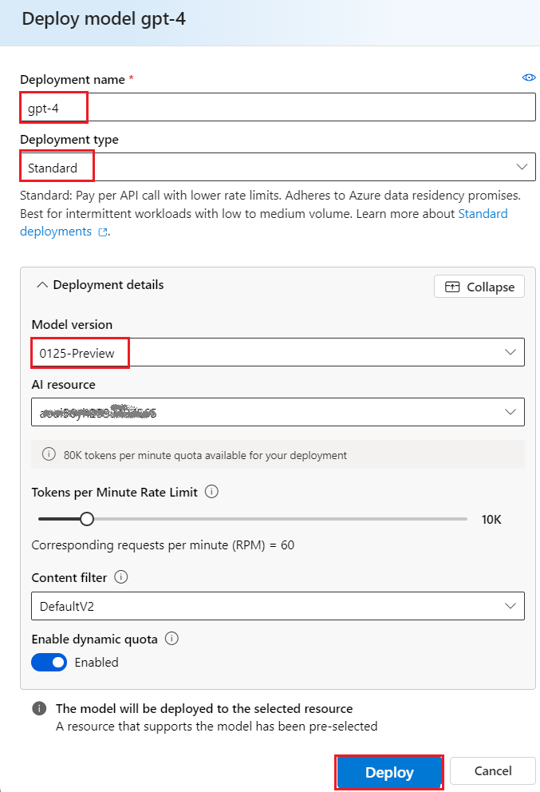
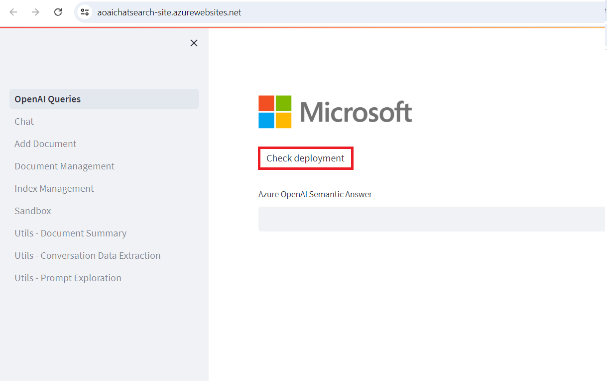
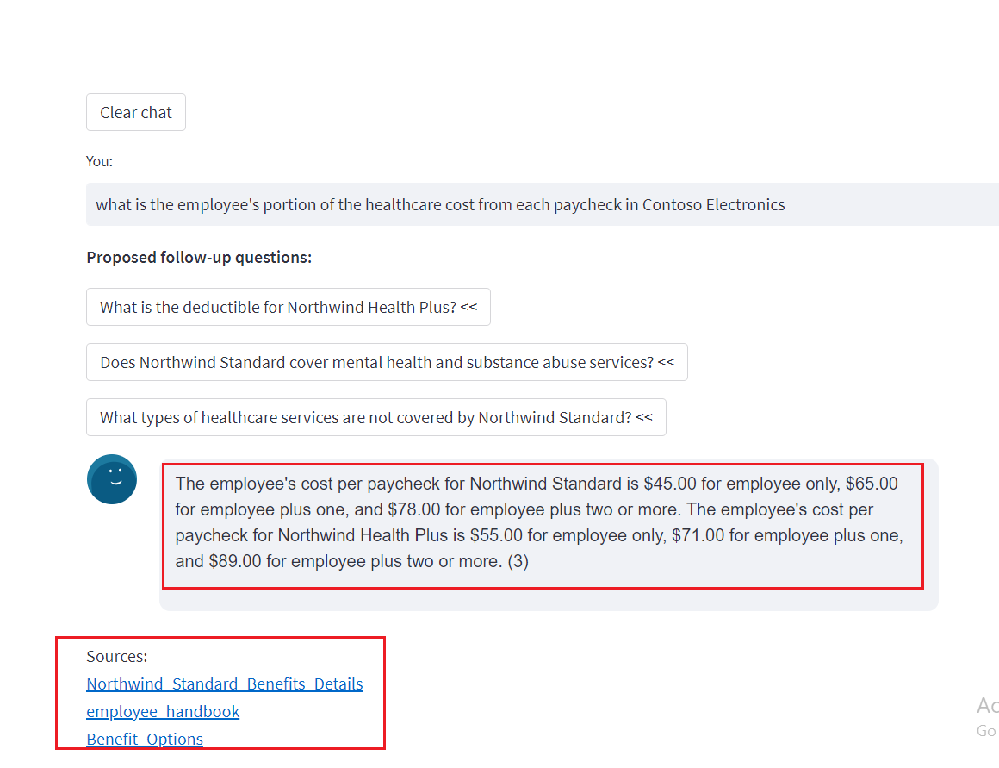
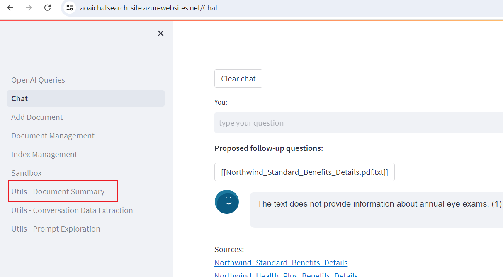
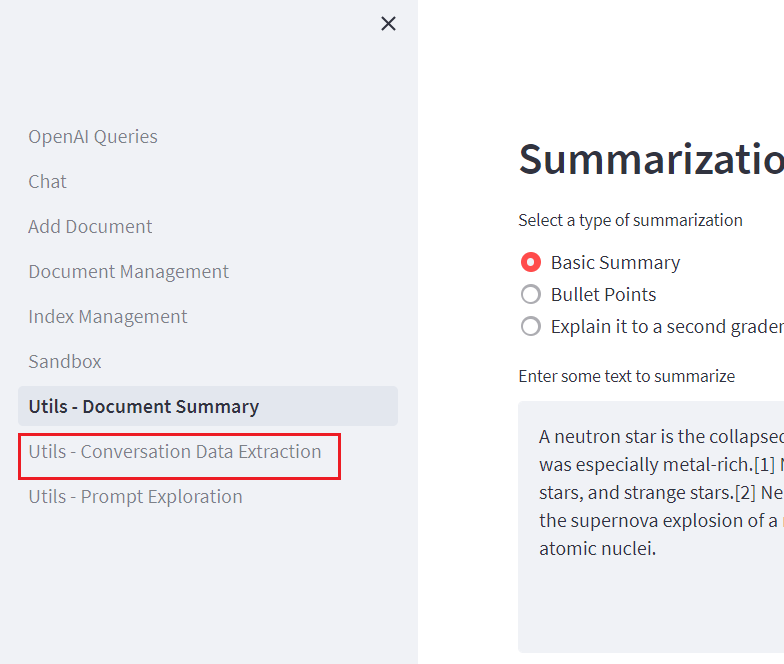
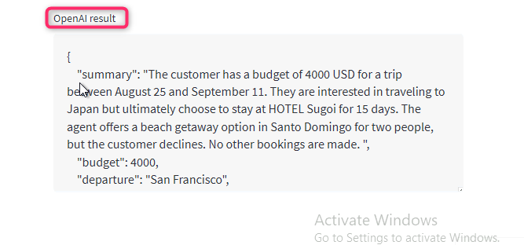

**ラボ07:セマンティックアンサーを使用してQ&Aの実装**

**紹介**

OpenAI対応のドキュメント検索用のシンプルなWebアプリケーション。このリポジトリでは、Azure
OpenAI Service
を使用して、ドキュメントから埋め込みベクトルを作成します。ユーザーの質問に答えるために、最も関連性の高いドキュメントを取得し、GPT-3を使用して質問に一致する回答を抽出します。

**目標**

- Azure AI Studio でチャットと埋め込みモデルをデプロイするため。

- App Service、Search Service、Form Recognizer
  などの必要なリソースをデプロイするためのカスタム
  テンプレートを使用する。

- aoaichatsearch-site Web アプリをデプロイし、Azure OpenAI
  対応のドキュメント検索、テキスト要約、および会話データ抽出を実行します。

- デプロイされたリソースとモデルを削除します。

## **タスク 1: Azure OpenAI リソースを作成する**

1.  Azure ポータルのホームページで、
    **次のイメージに示すように、Microsoft Azure コマンド
    バーの左側にある 3 本の水平バーで表される** Azure ポータル
    メニューをクリックします。

> 

2.  **+ Create a resource をクリックします**。

> 

3.  \[ **Create a resource**\] ページの
    **\[検索サービスとマーケットプレース** \] 検索バーに「 **Azure
    OpenAI**」と入力し、 **Enter** キーを押します。

> 

4.  \[Marketplace**\]** ページで、\[**Azure
    OpenAI**\]セクションに移動し、\[Create\]ボタンのドロップダウンをクリックして、図に示すように**\[Azure
    OpenAI**\]を選択します。(すでに**Azure OpenAI**
    タイルクリックしている場合は、、**Azure OpenAI ページの**
    \[**Create\] ボタンをクリックします**。

> 

5.  \[**Create Azure OpenAI**\] ウィンドウの \[**Basics**\]
    タブで、次の詳細を入力し、\[**Next\]** ボタンをクリックします。

[TABLE]

> 

6.  \[**Network\]**
    タブで、すべてのラジオボタンをデフォルトの状態のままにして、\[**Next\]**ボタンをクリックします。

> 

7.  **\[Tags\]**
    タブで、すべてのフィールドをデフォルトの状態のままにして、\[**Next\]**
    ボタンをクリックします。

> 

8.  **「Review+submit**」タブで、懸賞が合格したら「**Create」**ボタンをクリックします。

> 

9.  デプロイが完了するまで待ちます。デプロイには約 **2 -3**
    分かかります。

10. **Microsoft.CognitiveServicesOpenAI**
    ウィンドウで、デプロイが完了したら、\[**Go to resource\]**
    ボタンをクリックします。

> 

11. **Azure-open-testXX |\[ Model
    deployments**ウィンドウで、\[**Resource Management**\]
    セクションに移動し、\[**Keys and Endpoints\] をクリックします**。

12. **\[Keys and Endpoints\]** ページで、次の図に示すように **KEY1、KEY
    2、Endpoint**の値をコピーしてメモ帳に貼り付け、
    メモ帳を保存して今後のラボで情報を使用します。

## **タスク 2: チャット モデルと埋め込みモデルのデプロイ**

1.   **Azure-openai-testXX** ページで、左側のナビゲーション メニューの
    **\[Overview**\]
    をクリックし、下にスクロールして、**次の図に示すように** \[**Explore
    Azure AI Foundry portal**\] ボタンをクリックします。

> 

2.  Azure OpenAI スタジオが起動するのを待ちます。

> 

3.  **Azure AI Foundry** |Azure OpenAI Studio
    ホームページで、左側のナビゲーション メニューから \[**Deployment**\]
    を選択します**。**

4.  \[**Deployment\]** ウィンドウで、**+Deploy
    modelを**ドロップダウンし、 \[**Deploy base model\] を選択します。**

> 

5.  \[**Select a model**\] ダイアログ ボックスで、gpt-4
    をナビゲートして慎重に選択し、\[**Confirm\]**
    ボタンをクリックします。

6.  **Model version**として **0125-Preview を選択し、Deployment
    type**として **Standard、デプロイ名 フィールドで** gpt-4
    **と入力し、Create**ボタンをクリックします。

> 

7.  \[**Deployments\]** ウィンドウで、**+Deploy
    modelを**ドロップダウンし、**Deploy base modelを選択します。**

> 

8.  \[**Select a model\]** ダイアログ ボックスで、移動して
    **text-embedding-ada-002** を慎重に選択し、\[**Confirm\]**
    ボタンをクリックします。

9.  \[**Deploy model**\] ダイアログ ボックスの**Deployment
    nameに**「+++text-embedding-ada-002+++**」と入力し、Deployment
    typeとして** \[**Standard\] を選択し**、\[**Deploy\]**
    ボタンをクリックします。

## **タスク 3: Azure Cognitive Search を使用して Azure にデプロイする (Web アプリ + バッチ処理)**

1.  エッジブラウザを開き、アドレスバーに移動して、次のURLを入力または貼り付けます：
    <https://portal.azure.com/#create/Microsoft.Template/uri/https%3A%2F%2Fraw.githubusercontent.com%2Fruoccofabrizio%2Fazure-open-ai-embeddings-qna%2Fmain%2Finfrastructure%2Fdeployment_ACS.json>
    、 **Enter** ボタンを押します。

2.  \[**Custom deployment**\] ウィンドウの \[**Basics**\]
    タブで、次の詳細を入力してカスタム テンプレートを展開
    し、\[**Review + create\] をクリックします。**

[TABLE]

3.  「**Review +
    create**」タブで、懸賞が合格したら、「**Create」**ボタンをクリックします。

4.  デプロイが完了するまで待ちます。デプロイには約 15-17 分かかります。

> 

5.  \[**Go to resource group\]**ボタンをクリックします。

> 

## **タスク 4: Web アプリケーションを使用した Azure OpenAI 対応ドキュメント検索**

1.  **aoaiXXX-RG** リソース グループ ウィンドウの **\[Resources**\]
    タブで、**App Service** - **aoaaichatsearch-site**
    に移動してクリックします。

2.  **aoaichatsearch-site**
    Webアプリ**のOverview** ページで、コマンドバーに移動して\[**Browse**\]をクリックすると**、**Webアプリケーションに移動します。

3.  Web アプリケーションのデプロイが完了するまで待ちます。デプロイには約
    **10 -15** 分かかります。

4.  Web アプリケーションのホームページで、デプロイの状態を確認するには、
    Microsoft の下にある **\[Check deployments**\]
    ボタンをクリックします。

5.  デプロイ状況の確認には、約 5-6 分かかる場合があります。

6.  Web アプリのホームページで、左側の \[**Add Document**\]
    に移動してクリックし、データを追加します。

7.  \[**Add Document**\]パネルで、\[**Browse
    files**\]ボタンをクリックして、ナレッジベースに追加する必要があるドキュメントをアップロードします。

8.  VM 内の **C:\Labfiles\Contoso Electronics** の場所に移動し、
    \[Benefit_Options.pdf\] **を選択して** \[**Open\]**
    ボタンをクリックします。

9.  \[**Browse files**\] をもう一度クリック**し、**VM 内の
    **C:\Labfiles\Contoso Electronics** の場所に移動して
    \[employee_handbook.pdf**\] を選択し**、\[**Open**\]
    ボタンをクリックします。

10. 同様に、**Northwind_Health_Plus_Benefits_Details.pdf**と**Northwind_Standard_Benefits_Details.pdfを追加します**

11. アップロードされたデータはナレッジ ベースに追加され、約 5 分から 7
    分かかります。

12. \[**Document
    Management\]をクリックして**、ファイルが正常にアップロードされたかどうかを確認します。

13. \[**Index Management\]
    をクリックして**、ファイル、キー、およびソースを確認します。

14. 次に、\[**Chat**\]をクリックします **。**

15. \[**Chat session\]**
    セクションで、次のプロンプトを入力し、\[**Enter\]
    ボタンを押して**応答を表示します。

**ユーザー**: **what is the employee's portion of the healthcare cost
from each paycheck in Contoso Electronics**

16. \[**Chat session\]** セクションで、\[**Clear
    chat\]**ボタンをクリックします。

17. \[**Chat session** **\]**
    セクションで、次のプロンプトを入力し、\[**Enter\]
    ボタンを押して**応答を表示します。

> **ユーザー**: **How do I file a complaint or appeal with Northwind
> Health Plus?**

18. \[**Chat session** **\]** セクションで、\[**Clear
    chat\]**ボタンをクリックします。

19. \[**Chat session\]** セクションで、次のプロンプトを入力します。
    次に**、Enter**ボタンを押して応答を表示します。

**ユーザー**: **Does my plan covers my eye exams?**

20. 左側の「**Utils-Document Summary」をクリックします**。

21. \[**Summarization\]** セクションで、\[**Basic Summary\]**
    ラジオボタンを選択します**。**

22. \[Summarization**\]** ウィンドウの \[**Enter some text to
    summarize**\] セクションのメッセージ
    ボックスで、現在のテキストを次のように置き換え、\[**Summarize\]**
    ボタンをクリックします。

It’s been six months since we reinvented search with [the new AI-powered
Bing and
Edge](https://blogs.microsoft.com/blog/2023/02/07/reinventing-search-with-a-new-ai-powered-microsoft-bing-and-edge-your-copilot-for-the-web/).
In that short time, you’ve engaged in so many unique and creative ways;
to date we’ve seen over 1 billion chats and over 750 million images fill
the world of Bing! We’ve also seen nine consecutive quarters of growth
on Edge, meaning we’re more able than ever to bring our best-in-class AI
experiences to users across the web.

23. 入力したテキストの概要を確認します。

24. サマリーの結果を確認したら、\[**Clear summary\]**
    ボタンをクリックします。

25. 次に、上にスクロールして、\[**Bullet
    Points\]**ラジオボタンを選択します。**Enter some text to
    summarize**セクションで、メッセージボックスに現在のテキストを次のように置き換えて、\[**Summarize**\]ボタンをクリックします。

Microsoft has made its Azure OpenAI Service generally available,
bringing the enterprise generative AI tools out of its invite-only
program. Now any customers who meet Microsoft’s standards can access the
professional versions of OpenAI’s large language model GPT-3.5 and the
related text-to-image tool DALL-E 2, computer programming assistant
Codex, and the popular ChatGPT chatbot interface for the LLM.

Microsoft launched the Azure OpenAI Service with an eye toward offering
businesses a way to develop apps without coding, write reports, and put
together marketing content. The scope has grown since then to encompass
new facets of the OpenAI’s models, including chat and visuals. Those
interested in the tools have to explain how they will use the AI tools
and agree to Microsoft’s ethical guidelines in their application for
access. The decision to widen the Azure OpenAI Service’s availability
arrives in tandem with Microsoft’s plans to integrate ChatGPT and DALL-E
into its Office suite, Bing search engine, and other consumer products.
Azure OpenAI Service followed earlier experiments to integrate GPT-3
into Microsoft projects like the low-code Power Apps programming tool
and the GitHub Copilot programming assistant.

26. 概要の結果が箇条書きの形式で表示されます。

27. 左側の \[**Utils-Conversation Data Extraction\] をクリックします**。

28. **Conversation data extraction**ウィンドウで、\[**Execute tasks\]
    をクリックし、\[**OpenAI 結果**\] の下に応答を表示します**。

29. エージェントとユーザー間の会話から抽出されたデータを確認します。

## タスク 5: デプロイされたリソースとモデルの削除

1.  デプロイされたリソースを削除するには、**Azure portal のホーム**
    ページに移動し、 \[**Resource groups\] をクリックします**。

> 

2.  \[リソース グループ\] ページで、リソースグループを選択します。

> 

3.  **Resource groupの**ホーム
    ページで、すべてのリソースを選択し、**deleteをクリックします**

4.  右側に表示される**\[**リソースの削除\]ペインで、\[**削除を確認するために「delete」と入力し**、\[**Delete\]**ボタンをクリックします。

5.  **Delete confirmation**ダイアログボックスで、\[
    **Delete**\]ボタンをクリックします。

> 

6.  ベルのアイコンをクリックすると、通知が表示されます

**概要**

Azure AI Studio に gpt-4 チャット モデルと text-embedding-ada-002
埋め込みモデルをデプロイし、カスタム
テンプレートを使用して必要なリソースをデプロイしました。aoaichatsearch-site
Web アプリに非構造化ドキュメントをアップロードし、チャット
セッションで正確な情報を抽出しました。サンプル
テキストから基本概要と箇条書き概要を生成し、会話からデータを抽出しました。ラボの最後に、Azure
OpenAI
リソースを効率的に管理するために、リソースとモデルを削除しました。

**重要な注意: リソース
グループは削除しないでください。削除すると、次のラボに進んだり、新しいリソース
グループを作成したりできなくなります。**

**Azure OpenAI Service (Azure-openai-testXX)
は削除しないでください。すべてのラボで同じサービスが使用されます。**
