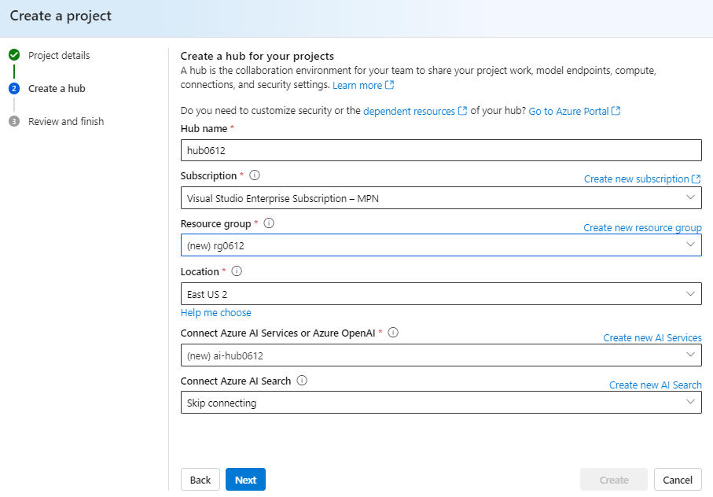
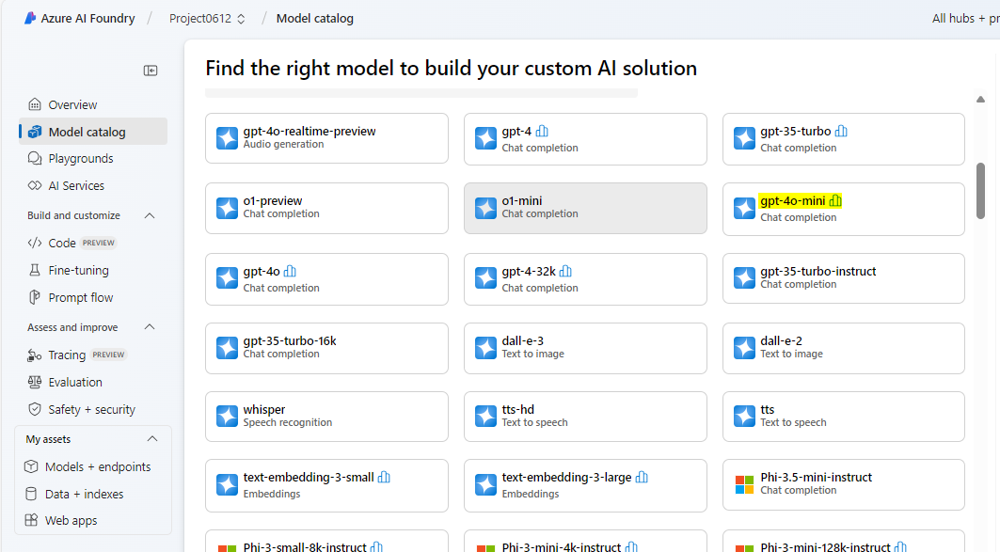
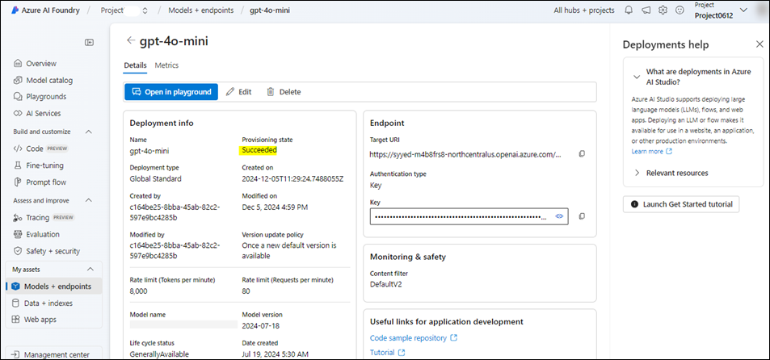
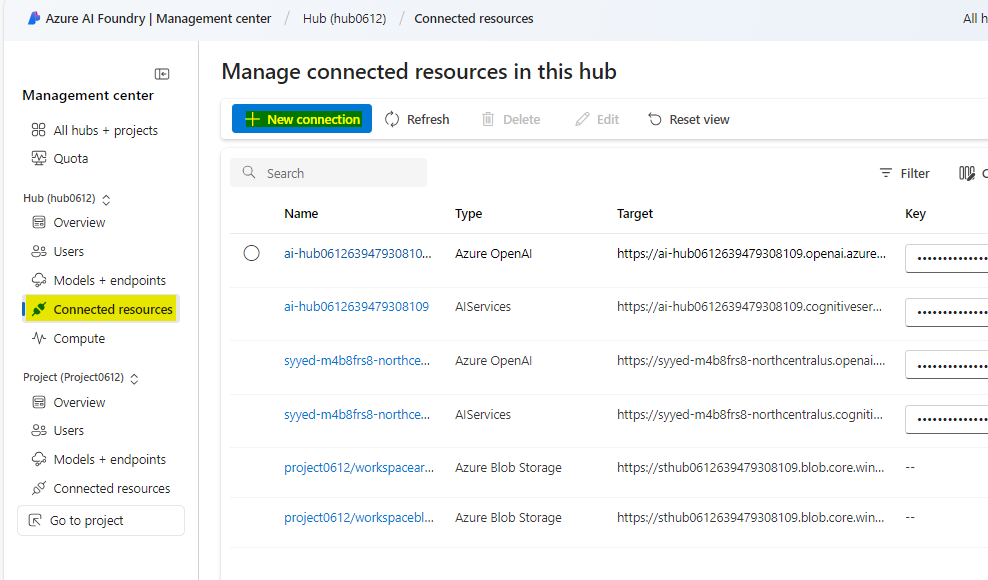
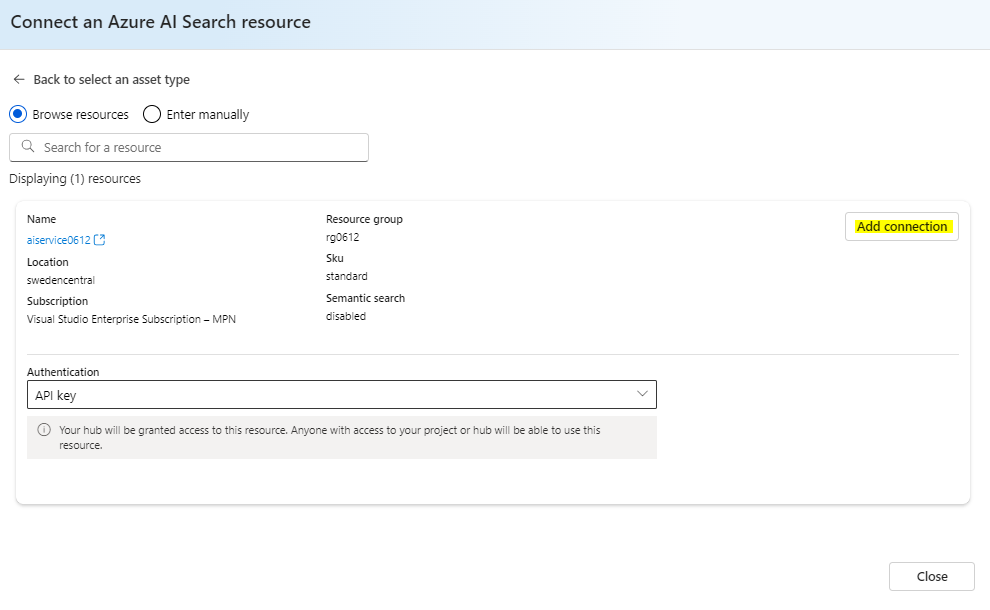
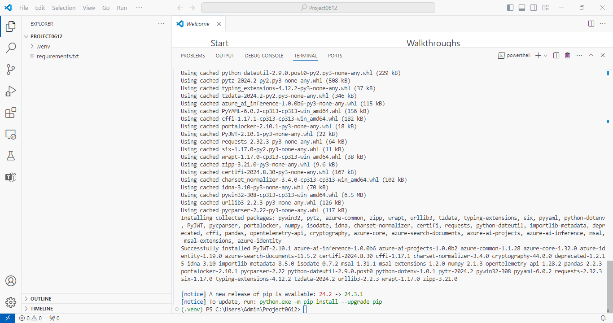
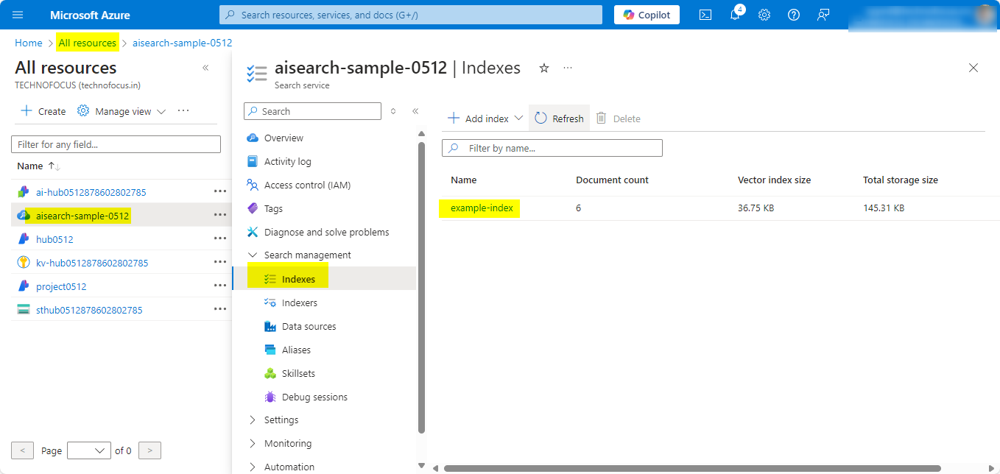
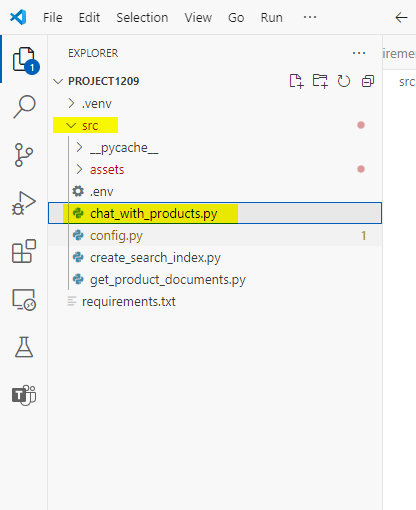

用例 08 - 使用 Azure AI Foundry SDK 构建自定义聊天应用程序

**预计时间：120 分钟**

## 目的

本实验的目标是使用 Azure AI Foundry SDK 构建、评估和部署基于
Retrieval-Augmented Generation （RAG）
的代理。该实验室将指导你设置项目和开发环境、部署 AI 模型（例如 GPT-4 和
text-embedding-ada-002）、集成 Azure AI
搜索以进行文档检索，以及创建自定义知识检索 （RAG）
聊天应用程序。重点是使用相关产品数据为 AI
模型响应奠定基础，开发自定义聊天界面，并评估生成的响应的性能。

## 溶液

该解决方案涉及在 Azure AI Foundry 中设置项目、部署 AI 模型（GPT-4 和
text-embedding-ada-002）以及集成 Azure AI
搜索以存储和检索自定义产品数据。它包括创建 Python
脚本来生成向量嵌入、构建搜索索引以及查询相关产品信息。开发了基于 RAG
的聊天界面，通过利用搜索结果提供扎实的响应，并使用预定义的数据集和指标评估聊天应用程序的性能，以提高其有效性。

## 练习 0：了解 VM 和凭据

在本练习中，我们将识别并了解我们将在整个实验室中使用的凭证。

**重要提示：**请务必完成本练习中的每个步骤，以了解将用于实验室执行的通用术语和凭证。

1.  **Instructions**
    选项卡包含实验室指南，其中包含在整个实验室中要遵循的说明。

2.  **Resources** 选项卡已获取执行实验室所需的凭证**。**

- **URL –** Azure 门户的 URL

- **Subscription （订阅） –** 这是分配给您的**订阅**的 **ID**

- **用户名 – 您**需要用于**登录 Azure 服务**的**用户 ID。**

- **Password （密码） – Azure 登录**名的**密码。**

> 让我们将此用户名和密码称为 **Azure 登录凭据**。我们将在提及 **Azure
> 登录凭据**的任何地方使用这些凭据。

- **Resource Group （资源组） –** 分配给您的**资源组。**

> **重要提示：**请确保在此资源组下创建所有资源

3.  **Help （**帮助） 选项卡包含 Support （支持） 信息。此处的 **ID**
    值是将在实验室执行期间使用的**实验室实例 ID。**

## 练习 1 - 设置项目和开发环境，以使用 Azure AI Foundry SDK 构建自定义知识检索 （RAG） 应用程序

### 任务 1：创建项目

要在 Azure AI Foundry 中创建项目，请执行以下步骤：

1.  使用 **Azure 登录凭据登录** Azure AI Foundry，地址为
    +++<https://ai.azure.com/>+++。

> 

2.  选择 **+ Create project**.

> 

3.  输入 +++**RAGproj\<** **Lab 实例 ID\>**+++ 作为项目名称，点击
    **Customize**。

> **注意：**将 **\<Lab 实例 ID\>**替换为您的 **Lab 实例 ID**
>
> 

4.  在下一页上，输入以下详细信息，然后单击 **Next**。

> 中心名称 - +++hub\<Lab 实例 ID\>+++
>
> 订阅 - 选择已分配的订阅
>
> 创建新的资源组 - 选择已分配的资源组 （ResourceGroup1）
>
> 位置 - 美国东部 2 或瑞典中部（我们在执行此实验室时使用了美国东部 2）
>
> 将其余部分保留为默认值，然后单击 **Next**（下一步）。
>
> 

5.  在 **Review and finish** （查看并完成） 页面上，单击 **Create**
    （创建）。

> 

6.  资源创建将需要几分钟时间。

7.  关闭弹出窗口（如果出现）。

8.  在项目的主页中，记下记事本中的 **Project connection
    string（**项目连接字符串），以便在本练习的下一个任务中使用。

> 

### 任务 2：部署模型

您需要两个模型来构建基于 RAG 的聊天应用程序：Azure OpenAI 聊天模型
（gpt-4o-mini） 和 Azure OpenAI 嵌入模型 （text-embedding-ada-002）。在
Azure AI Foundry 项目中部署这些模型，对每个模型使用这组步骤。

以下步骤将模型部署到 AI Foundry  [*model
catalogue*](https://learn.microsoft.com/en-us/azure/ai-studio/how-to/model-catalog-overview)
中的实时端点 ：

1.  在左侧导航窗格中，选择 **Model catalog**（模型目录）。

> 

2.  从模型列表中选择 **gpt-4o-mini** 模型。您可以使用搜索栏找到它。

> 

3.  在模型详细信息页面上，选择 **Deploy** （部署）。

> 

4.  保留默认的 **Deployment name** （部署名称）。选择
    **Deploy**。或者，如果模型在您的区域中不可用，则会为您选择另一个区域并连接到您的项目。在这种情况下，请选择
    **Create resource and deploy**（创建资源并部署）。

> 
>
> 

5.  部署 **gpt-4o-mini** 后，重复这些步骤以部署
    +++**text-embedding-ada-002**+++ 模型。

### 任务 3：创建 Azure AI 搜索服务

此应用程序的目标是将模型响应置于自定义数据中。搜索索引用于根据用户的问题检索相关文档。

需要 Azure AI 搜索服务和连接才能创建搜索索引。

1.  使用 Azure 登录凭据登录到 Azure 门户
    +++<https://portal.azure.com>+++。

2.  在首页搜索栏，搜索 +++**AI search**+++ 并选择它。

> 

3.  单击 **+ Create** 图标并填写以下详细信息。

> 

4.  输入以下详细信息，然后选择 **Review + create**。

- 订阅 – 选择您分配的订阅

- Resource Group （资源组） – 选择您分配的 Resource group

- 服务名称 – 输入+++**aisearch\<** **Lab 实例 ID \>**+++， 将 Lab 实例
  ID 替换为您的 VM ID。

- 区域 - 选择瑞典中部或美国东部 2（我们在此处使用美国东部 2）

- 定价层 – 选择**Standard**

> 

5.  查看详细信息，然后选择 **Create** （创建）。

> 

6.  如下面的屏幕截图所示，请等待部署成功，然后再继续下一步。

> 

### 任务 4：将 Azure AI 搜索连接到您的项目

在 Azure AI Foundry 门户中，检查已连接的 Azure AI 搜索资源。

1.  在 Azure AI Foundry 的项目中，从左窗格中选择 **Management center**。

> 

2.  在“**Connected resources**”部分中，选择“**New
    connection**”，然后选择“**Azure AI 搜索**”。

> 
>
> 

3.  在 **Authentication** 下选择 **API key**，然后选择 **Add
    connection**。

> 
>
> 
>
> 

### 任务 5：安装 Azure CLI 并登录

安装 Azure CLI 并从本地开发环境登录，以便可以使用用户凭据调用 Azure
OpenAI 服务。

1.  从 Windows 搜索栏中搜索
    +++**PowerShell**+++，然后在管理员模式下打开它。

> 

2.  打开 Windows Power Shell 并粘贴下面给定的命令并运行它。

> $progressPreference = 'silentlyContinue'
>
> Write-Host "Installing WinGet PowerShell module from PSGallery..."
>
> Install-PackageProvider -Name NuGet -Force | Out-Null
>
> Install-Module -Name Microsoft.WinGet.Client -Force -Repository
> PSGallery | Out-Null
>
> Write-Host "Using Repair-WinGetPackageManager cmdlet to bootstrap
> WinGet..."
>
> Repair-WinGetPackageManager
>
> Write-Host "Done."

3.  使用以下命令从终端安装 Azure CLI：

winget install -e --id Microsoft.AzureCLI

当系统提示接受时，选择 **Y**。

4.  安装 Azure CLI 后，使用 az login 命令登录，并使用浏览器登录：

+++Az login+++

选择 “**Work or school account**”，然后单击 “**Continue**”。

5.  使用 **Azure 登录凭据**登录。

6.  在 **Select a subscription** （选择订阅） 提示符中输入
    **1**，然后单击 **Enter**。

### 任务 6：创建新的 Python 环境

首先，您需要创建一个新的 Python
环境，用于安装本教程所需的软件包。请勿将软件包安装到您的全局 python
安装中。安装 Python 包时，应始终使用 virtual 或 conda
环境，否则可能会中断 Python 的全局安装。

**创建虚拟环境**

1.  从 Power Shell 中，通过执行以下命令导航到 **C：\Users\Admin**。

+++cd\\++

+++cd Users\Admin+++

2.  **通过在 PowerShell 中输入以下命令**，使用项目名称 **RAGproj\<Lab
    实例 id\>** 创建一个文件夹。

**注意：**在下面的命令中，将 \<Project name\>
替换为您的项目名称并执行它。

+++**mkdir \<Project name\>**+++

3.  在终端中，输入以下命令以导航到新文件夹位置

+++**cd \<Project name\>**+++

将 \<Project name\> 替换为您在上一步中创建的文件夹名称。

4.  使用以下命令创建虚拟环境

+++py -3 -m venv .venv+++

+++.venv\scripts\activate+++

> 
>
> 激活 Python 环境意味着，当您从命令行运行 python 或 pip
> 时，您将使用应用程序的 .venv 文件夹中包含的 Python 解释器。

5.  打开 **VS Code**。选择 **File -\> Open
    Folder**，然后选择我们在前面的步骤中创建的 **RAGproject** 文件夹。

### 任务 7：安装软件包

安装 azure-ai-projects（预览版） 和 azure-ai-inference （预览版）
以及其他必需的软件包。

1.  在 **Project** 文件夹中创建一个名为 +++**requirements.txt**+++
    的文件，并将以下包添加到该文件中：

> azure-ai-projects （英语）
>
> azure-ai-inference\[提示\]
>
> azure-identity （英语）
>
> azure-search-documents
>
> pandas
>
> python-dotenv
>
> opentelemetry-api

> 

2.  在顶部导航栏上，单击 file 并 **save all** （全部保存）。

3.  右键单击 requirements.txt并选择 **Open in Integrated Terminal**。

4.  运行以下命令以进入虚拟环境

py -3 -m venv .venv

.venv\scripts\activate

5.  运行 +++az login+++ 命令，然后使用 Azure 登录凭据登录。 选择 **1**
    以选择订阅。

6.  要安装所需的软件包，请运行以下代码。

+++pip install -r requirements.txt+++

> **注意：**如果您收到 pip 新版本的通知，请执行以下命令升级 pip
>
> +++pip install -r requirements.txt+++

+++python.exe -m pip install --upgrade pip+++

> 

### 任务 8：创建帮助程序脚本

1.  创建名为 **src** 的新文件夹。通过在终端中运行以下命令。

mkdir src

2.  在 **src** 文件夹中创建一个新文件并将其命名为+++**config.py**+++

3.  将以下代码添加到 **config.py** 并保存。

\# ruff: noqa: ANN201, ANN001

import os

import sys

import pathlib

import logging

from azure.identity import DefaultAzureCredential

from azure.ai.projects import AIProjectClient

from azure.ai.inference.tracing import AIInferenceInstrumentor

\# load environment variables from the .env file

from dotenv import load_dotenv

load_dotenv()

\# Set "./assets" as the path where assets are stored, resolving the
absolute path:

ASSET_PATH = pathlib.Path(\_\_file\_\_).parent.resolve() / "assets"

\# Configure an root app logger that prints info level logs to stdout

logger = logging.getLogger("app")

logger.setLevel(logging.INFO)

logger.addHandler(logging.StreamHandler(stream=sys.stdout))

\# Returns a module-specific logger, inheriting from the root app logger

def get_logger(module_name):

return logging.getLogger(f"app.{module_name}")

\# Enable instrumentation and logging of telemetry to the project

def enable_telemetry(log_to_project: bool = False):

AIInferenceInstrumentor().instrument()

\# enable logging message contents

os.environ\["AZURE_TRACING_GEN_AI_CONTENT_RECORDING_ENABLED"\] = "true"

if log_to_project:

from azure.monitor.opentelemetry import configure_azure_monitor

project = AIProjectClient.from_connection_string(

conn_str=os.environ\["AIPROJECT_CONNECTION_STRING"\],
credential=DefaultAzureCredential()

)

tracing_link =
f"https://ai.azure.com/tracing?wsid=/subscriptions/{project.scope\['subscription_id'\]}/resourceGroups/{project.scope\['resource_group_name'\]}/providers/Microsoft.MachineLearningServices/workspaces/{project.scope\['project_name'\]}"

application_insights_connection_string =
project.telemetry.get_connection_string()

if not application_insights_connection_string:

logger.warning(

"No application insights configured, telemetry will not be logged to
project. Add application insights at:"

)

logger.warning(tracing_link)

return

configure_azure_monitor(connection_string=application_insights_connection_string)

logger.info("Enabled telemetry logging to project, view traces at:")

logger.info(tracing_link)

**注意：**这个新创建的 config.py 文件脚本将在下一个练习中使用。

### 任务 9：配置环境变量

从代码调用 Azure OpenAI
服务需要项目连接字符串。在本快速入门中，您将此值保存在 .env
文件中，该文件包含应用程序可以读取的环境变量。

1.  在 **src** 目录中创建一个新文件+++**.env**+++，并粘贴以下代码：

将 替换为 **\<your-connection-string\>** 任务 1
的记事本中保存的项目连接字符串值。

AIPROJECT_CONNECTION_STRING=\<your-connection-string\>

AISEARCH_INDEX_NAME="example-index"

EMBEDDINGS_MODEL="text-embedding-ada-002"

INTENT_MAPPING_MODEL="gpt-4o-mini"

CHAT_MODEL="gpt-4o-mini"

EVALUATION_MODEL="gpt-4o-mini"

**注意：**可以在 Azure AI Foundry 项目主页的 “**Overview**”
下找到连接字符串。

## 练习 2：使用 Azure AI Foundry SDK 构建自定义知识检索 （RAG） 应用程序

### 任务 1：为您的聊天应用程序创建示例数据

这个基于 RAG 的应用程序的目标是将模型响应置于自定义数据中。使用 Azure AI
搜索索引来存储嵌入模型中的矢量化数据。搜索索引用于根据用户的问题检索相关文档。

1.  从打开的 VS Code 设置中，在 **src** 文件夹下创建名为
    +++**assets**+++ 的文件夹。

2.  从 **C：\LabFiles** 复制**products.csv**文件并将其粘贴到 **Project**
    根文件夹中。

注意：这需要在文件资源管理器中完成，然后它会反映在 VS Code 中。

3.  导航到顶部导航栏上的 **File** 并单击 **Save all**。

### 任务 2：创建搜索索引

> 搜索索引用于存储来自嵌入模型的矢量化数据。搜索索引用于根据用户的问题检索相关文档。

1.  在 VS Code 中，在 src 文件夹中创建一个名为
    +++**create_search_index.py**+++ 的文件（即，您放置 **assets**
    文件夹的同一目录，而不是 **assets** 文件夹内）。

> 

2.  打开创建的文件，**create_search_index.py**文件并添加以下代码以导入所需的库，创建项目客户端，并配置一些设置：

> import os
>
> from azure.ai.projects import AIProjectClient
>
> from azure.ai.projects.models import ConnectionType
>
> from azure.identity import DefaultAzureCredential
>
> from azure.core.credentials import AzureKeyCredential
>
> from azure.search.documents import SearchClient
>
> from azure.search.documents.indexes import SearchIndexClient
>
> from config import get_logger
>
> \# initialize logging object
>
> logger = get_logger(\_\_name\_\_)
>
> \# create a project client using environment variables loaded from the
> .env file
>
> project = AIProjectClient.from_connection_string(
>
> conn_str=os.environ\["AIPROJECT_CONNECTION_STRING"\],
> credential=DefaultAzureCredential()
>
> )
>
> \# create a vector embeddings client that will be used to generate
> vector embeddings
>
> embeddings = project.inference.get_embeddings_client()
>
> \# use the project client to get the default search connection
>
> search_connection = project.connections.get_default(
>
> connection_type=ConnectionType.AZURE_AI_SEARCH,
> include_credentials=True
>
> )
>
> \# Create a search index client using the search connection
>
> \# This client will be used to create and delete search indexes
>
> index_client = SearchIndexClient(
>
> endpoint=search_connection.endpoint_url,
> credential=AzureKeyCredential(key=search_connection.key)
>
> )
>
> 

3.  现在，在**create_search_index.py**末尾添加函数以定义搜索索引：

> import pandas as pd
>
> from azure.search.documents.indexes.models import (
>
> SemanticSearch,
>
> SearchField,
>
> SimpleField,
>
> SearchableField,
>
> SearchFieldDataType,
>
> SemanticConfiguration,
>
> SemanticPrioritizedFields,
>
> SemanticField,
>
> VectorSearch,
>
> HnswAlgorithmConfiguration,
>
> VectorSearchAlgorithmKind,
>
> HnswParameters,
>
> VectorSearchAlgorithmMetric,
>
> ExhaustiveKnnAlgorithmConfiguration,
>
> ExhaustiveKnnParameters,
>
> VectorSearchProfile,
>
> SearchIndex,
>
> )
>
> def create_index_definition(index_name: str, model: str) -\>
> SearchIndex:
>
> dimensions = 1536 \# text-embedding-ada-002
>
> if model == "text-embedding-3-large":
>
> dimensions = 3072
>
> \# The fields we want to index. The "embedding" field is a vector
> field that will
>
> \# be used for vector search.
>
> fields = \[
>
> SimpleField(name="id", type=SearchFieldDataType.String, key=True),
>
> SearchableField(name="content", type=SearchFieldDataType.String),
>
> SimpleField(name="filepath", type=SearchFieldDataType.String),
>
> SearchableField(name="title", type=SearchFieldDataType.String),
>
> SimpleField(name="url", type=SearchFieldDataType.String),
>
> SearchField(
>
> name="contentVector",
>
> type=SearchFieldDataType.Collection(SearchFieldDataType.Single),
>
> searchable=True,
>
> \# Size of the vector created by the text-embedding-ada-002 model.
>
> vector_search_dimensions=dimensions,
>
> vector_search_profile_name="myHnswProfile",
>
> ),
>
> \]
>
> \# The "content" field should be prioritized for semantic ranking.
>
> semantic_config = SemanticConfiguration(
>
> name="default",
>
> prioritized_fields=SemanticPrioritizedFields(
>
> title_field=SemanticField(field_name="title"),
>
> keywords_fields=\[\],
>
> content_fields=\[SemanticField(field_name="content")\],
>
> ),
>
> )
>
> \# For vector search, we want to use the HNSW (Hierarchical Navigable
> Small World)
>
> \# algorithm (a type of approximate nearest neighbor search algorithm)
> with cosine
>
> \# distance.
>
> vector_search = VectorSearch(
>
> algorithms=\[
>
> HnswAlgorithmConfiguration(
>
> name="myHnsw",
>
> kind=VectorSearchAlgorithmKind.HNSW,
>
> parameters=HnswParameters(
>
> m=4,
>
> ef_construction=1000,
>
> ef_search=1000,
>
> metric=VectorSearchAlgorithmMetric.COSINE,
>
> ),
>
> ),
>
> ExhaustiveKnnAlgorithmConfiguration(
>
> name="myExhaustiveKnn",
>
> kind=VectorSearchAlgorithmKind.EXHAUSTIVE_KNN,
>
> parameters=ExhaustiveKnnParameters(metric=VectorSearchAlgorithmMetric.COSINE),
>
> ),
>
> \],
>
> profiles=\[
>
> VectorSearchProfile(
>
> name="myHnswProfile",
>
> algorithm_configuration_name="myHnsw",
>
> ),
>
> VectorSearchProfile(
>
> name="myExhaustiveKnnProfile",
>
> algorithm_configuration_name="myExhaustiveKnn",
>
> ),
>
> \],
>
> )
>
> \# Create the semantic settings with the configuration
>
> semantic_search = SemanticSearch(configurations=\[semantic_config\])
>
> \# Create the search index definition
>
> return SearchIndex(
>
> name=index_name,
>
> fields=fields,
>
> semantic_search=semantic_search,
>
> vector_search=vector_search,
>
> )
>
> 

4.  现在在 create_search_index.py 中添加函数以创建将 csv
    文件添加到索引的函数：

> \# define a function for indexing a csv file, that adds each row as a
> document
>
> \# and generates vector embeddings for the specified content_column
>
> def create_docs_from_csv(path: str, content_column: str, model: str)
> -\> list\[dict\[str, any\]\]:
>
> products = pd.read_csv(path)
>
> items = \[\]
>
> for product in products.to_dict("records"):
>
> content = product\[content_column\]
>
> id = str(product\["id"\])
>
> title = product\["name"\]
>
> url = f"/products/{title.lower().replace(' ', '-')}"
>
> emb = embeddings.embed(input=content, model=model)
>
> rec = {
>
> "id": id,
>
> "content": content,
>
> "filepath": f"{title.lower().replace(' ', '-')}",
>
> "title": title,
>
> "url": url,
>
> "contentVector": emb.data\[0\].embedding,
>
> }
>
> items.append(rec)
>
> return items
>
> def create_index_from_csv(index_name, csv_file):
>
> \# If a search index already exists, delete it:
>
> try:
>
> index_definition = index_client.get_index(index_name)
>
> index_client.delete_index(index_name)
>
> logger.info(f"🗑️ Found existing index named '{index_name}', and
> deleted it")
>
> except Exception:
>
> pass
>
> \# create an empty search index
>
> index_definition = create_index_definition(index_name,
> model=os.environ\["EMBEDDINGS_MODEL"\])
>
> index_client.create_index(index_definition)
>
> \# create documents from the products.csv file, generating vector
> embeddings for the "description" column
>
> docs = create_docs_from_csv(path=csv_file,
> content_column="description", model=os.environ\["EMBEDDINGS_MODEL"\])
>
> \# Add the documents to the index using the Azure AI Search client
>
> search_client = SearchClient(
>
> endpoint=search_connection.endpoint_url,
>
> index_name=index_name,
>
> credential=AzureKeyCredential(key=search_connection.key),
>
> )
>
> search_client.upload_documents(docs)
>
> logger.info(f"➕ Uploaded {len(docs)} documents to '{index_name}'
> index")
>
> 

5.  最后，在 create_search_index.py
    中添加以下函数以构建索引并将其注册到云项目中。添加代码后，转到 文件
    从顶部栏，然后单击 **Save all**。

> if \_\_name\_\_ == "\_\_main\_\_":
>
> import argparse
>
> parser = argparse.ArgumentParser()
>
> parser.add_argument(
>
> "--index-name",
>
> type=str,
>
> help="index name to use when creating the AI Search index",
>
> default=os.environ\["AISEARCH_INDEX_NAME"\],
>
> )
>
> parser.add_argument(
>
> "--csv-file", type=str, help="path to data for creating search index",
> default="assets/products.csv"
>
> )
>
> args = parser.parse_args()
>
> index_name = args.index_name
>
> csv_file = args.csv_file
>
> create_index_from_csv(index_name, csv_file)
>
> 

6.  右键单击 **create_search_index.py，**然后选择 **Open in integrated
    terminal** 选项。

7.  从终端登录到 Azure 登录凭据，然后按照说明对帐户进行身份验证：

> +++az login+++
>
> 
>
> 

8.  运行代码以在本地构建索引并将其注册到云项目：

> +++python create_search_index.py+++
>
> 

9.  运行脚本后，可以从 Azure 门户查看新创建的索引。

10. 导航到分配的**资源组 -\> 您的搜索服务
    created（aisearchLabinstanceID） -\> 搜索管理 -\> 索引。**

> 

11. 如果您使用相同的索引名称再次运行该脚本，它将创建同一索引的新版本。

### 任务 3：获取产品文档

> 接下来，您创建一个脚本以从搜索索引中获取产品文档。该脚本在搜索索引中查询与用户问题匹配的文档。
>
> **创建脚本以获取产品文档**
>
> 当聊天收到请求时，它会搜索您的数据以查找相关信息。此脚本使用 Azure AI
> SDK
> 查询与用户问题匹配的文档的搜索索引。然后，它将文档返回到聊天应用程序。

1.  在 VS Code 中，在 **src** 文件夹中创建名为
    +++**get_product_documents.py**+++ 的文件。

> 

2.  将以下代码复制并粘贴到文件中。从代码开始，以导入所需的库，创建项目客户端并配置设置。

> import os
>
> from pathlib import Path
>
> from opentelemetry import trace
>
> from azure.ai.projects import AIProjectClient
>
> from azure.ai.projects.models import ConnectionType
>
> from azure.identity import DefaultAzureCredential
>
> from azure.core.credentials import AzureKeyCredential
>
> from azure.search.documents import SearchClient
>
> from config import ASSET_PATH, get_logger
>
> \# initialize logging and tracing objects
>
> logger = get_logger(\_\_name\_\_)
>
> tracer = trace.get_tracer(\_\_name\_\_)
>
> \# create a project client using environment variables loaded from the
> .env file
>
> project = AIProjectClient.from_connection_string(
>
> conn_str=os.environ\["AIPROJECT_CONNECTION_STRING"\],
> credential=DefaultAzureCredential()
>
> )
>
> \# create a vector embeddings client that will be used to generate
> vector embeddings
>
> chat = project.inference.get_chat_completions_client()
>
> embeddings = project.inference.get_embeddings_client()
>
> \# use the project client to get the default search connection
>
> search_connection = project.connections.get_default(
>
> connection_type=ConnectionType.AZURE_AI_SEARCH,
> include_credentials=True
>
> )
>
> \# Create a search index client using the search connection
>
> \# This client will be used to create and delete search indexes
>
> search_client = SearchClient(
>
> index_name=os.environ\["AISEARCH_INDEX_NAME"\],
>
> endpoint=search_connection.endpoint_url,
>
> credential=AzureKeyCredential(key=search_connection.key),
>
> )

3.  在 get_product-documents.py 中添加函数以**获取产品文档**。

> from azure.ai.inference.prompts import PromptTemplate
>
> from azure.search.documents.models import VectorizedQuery
>
> @tracer.start_as_current_span(name="get_product_documents")
>
> def get_product_documents(messages: list, context: dict = None) -\>
> dict:
>
> if context is None:
>
> context = {}
>
> overrides = context.get("overrides", {})
>
> top = overrides.get("top", 5)
>
> \# generate a search query from the chat messages
>
> intent_prompty = PromptTemplate.from_prompty(Path(ASSET_PATH) /
> "intent_mapping.prompty")
>
> intent_mapping_response = chat.complete(
>
> model=os.environ\["INTENT_MAPPING_MODEL"\],
>
> messages=intent_prompty.create_messages(conversation=messages),
>
> \*\*intent_prompty.parameters,
>
> )
>
> search_query = intent_mapping_response.choices\[0\].message.content
>
> logger.debug(f"🧠 Intent mapping: {search_query}")
>
> \# generate a vector representation of the search query
>
> embedding = embeddings.embed(model=os.environ\["EMBEDDINGS_MODEL"\],
> input=search_query)
>
> search_vector = embedding.data\[0\].embedding
>
> \# search the index for products matching the search query
>
> vector_query = VectorizedQuery(vector=search_vector,
> k_nearest_neighbors=top, fields="contentVector")
>
> search_results = search_client.search(
>
> search_text=search_query, vector_queries=\[vector_query\],
> select=\["id", "content", "filepath", "title", "url"\]
>
> )
>
> documents = \[
>
> {
>
> "id": result\["id"\],
>
> "content": result\["content"\],
>
> "filepath": result\["filepath"\],
>
> "title": result\["title"\],
>
> "url": result\["url"\],
>
> }
>
> for result in search_results
>
> \]
>
> \# add results to the provided context
>
> if "thoughts" not in context:
>
> context\["thoughts"\] = \[\]
>
> \# add thoughts and documents to the context object so it can be
> returned to the caller
>
> context\["thoughts"\].append(
>
> {
>
> "title": "Generated search query",
>
> "description": search_query,
>
> }
>
> )
>
> if "grounding_data" not in context:
>
> context\["grounding_data"\] = \[\]
>
> context\["grounding_data"\].append(documents)
>
> logger.debug(f"📄 {len(documents)} documents retrieved: {documents}")
>
> return documents

4.  最后，添加代码以在直接运行脚本时**测试函数**：

> if \_\_name\_\_ == "\_\_main\_\_":
>
> import logging
>
> import argparse
>
> \# set logging level to debug when running this module directly
>
> logger.setLevel(logging.DEBUG)
>
> \# load command line arguments
>
> parser = argparse.ArgumentParser()
>
> parser.add_argument(
>
> "--query",
>
> type=str,
>
> help="Query to use to search product",
>
> default="I need a new tent for 4 people, what would you recommend?",
>
> )
>
> args = parser.parse_args()
>
> query = args.query
>
> result = get_product_documents(messages=\[{"role": "user", "content":
> query}\])
>
> 

5.  单击 **File**（文件）**\>Save all（**全部保存）。

### 任务 4：为 intent 映射创建提示模板

> **get_product_documents.py**
> 脚本使用提示模板将对话转换为搜索查询。该模板指示如何从对话中提取用户的意图。

1.  在运行脚本之前，请创建提示模板。在 **assets** 文件夹下创建一个名为
    +++**intent_mapping.prompty**+++ 的文件：

> 

4.  将以下代码复制到 intent_mapping_prompty 文件中，然后从顶部栏转到
    Files 并单击 **Save all** 。

> ---
>
> name: Chat Prompt
>
> description: A prompty that extract users query intent based on the
> current_query and chat_history of the conversation
>
> model:
>
> api: chat
>
> configuration:
>
> azure_deployment: gpt-4o
>
> inputs:
>
> conversation:
>
> type: array
>
> ---
>
> system:
>
> \# Instructions
>
> \- You are an AI assistant reading a current user query and
> chat_history.
>
> \- Given the chat_history, and current user's query, infer the user's
> intent expressed in the current user query.
>
> \- Once you infer the intent, respond with a search query that can be
> used to retrieve relevant documents for the current user's query based
> on the intent
>
> \- Be specific in what the user is asking about, but disregard parts
> of the chat history that are not relevant to the user's intent.
>
> \- Provide responses in json format
>
> \# Examples
>
> Example 1:
>
> With a conversation like below:
>
> \`\`\`
>
> \- user: are the trailwalker shoes waterproof?
>
> \- assistant: Yes, the TrailWalker Hiking Shoes are waterproof. They
> are designed with a durable and waterproof construction to withstand
> various terrains and weather conditions.
>
> \- user: how much do they cost?
>
> \`\`\`
>
> Respond with:
>
> {
>
> "intent": "The user wants to know how much the Trailwalker Hiking
> Shoes cost.",
>
> "search_query": "price of Trailwalker Hiking Shoes"
>
> }
>
> Example 2:
>
> With a conversation like below:
>
> \`\`\`
>
> \- user: are the trailwalker shoes waterproof?
>
> \- assistant: Yes, the TrailWalker Hiking Shoes are waterproof. They
> are designed with a durable and waterproof construction to withstand
> various terrains and weather conditions.
>
> \- user: how much do they cost?
>
> \- assistant: The TrailWalker Hiking Shoes are priced at $110.
>
> \- user: do you have waterproof tents?
>
> \- assistant: Yes, we have waterproof tents available. Can you please
> provide more information about the type or size of tent you are
> looking for?
>
> \- user: which is your most waterproof tent?
>
> \- assistant: Our most waterproof tent is the Alpine Explorer Tent. It
> is designed with a waterproof material and has a rainfly with a
> waterproof rating of 3000mm. This tent provides reliable protection
> against rain and moisture.
>
> \- user: how much does it cost?
>
> \`\`\`
>
> Respond with:
>
> {
>
> "intent": "The user would like to know how much the Alpine Explorer
> Tent costs.",
>
> "search_query": "price of Alpine Explorer Tent"
>
> }
>
> user:
>
> Return the search query for the messages in the following
> conversation:
>
> {{#conversation}}
>
> \- {{role}}: {{content}}
>
> {{/conversation}}
>
> 

### 任务 5：测试产品文档检索脚本

1.  现在，您已拥有脚本和模板，请运行该脚本以测试搜索索引从查询返回的文档。在终端窗口中，运行

> +++python get_product_documents.py --query "I need a new tent for 4
> people, what would you recommend?"+++
>
> 

### 任务 6：开发自定义知识检索 （RAG） 代码

> 接下来，创建自定义代码以将检索增强生成 （RAG）
> 功能添加到基本聊天应用程序。
>
> **创建具有 RAG 功能的聊天脚本**

1.  在 **src** 文件夹中，创建一个名为 +++**chat_with_products.py**+++
    的新文件。此脚本检索产品文档并生成对用户问题的响应。

> 

2.  添加代码以导入所需的库，创建项目客户端并配置设置：

> import os
>
> from pathlib import Path
>
> from opentelemetry import trace
>
> from azure.ai.projects import AIProjectClient
>
> from azure.identity import DefaultAzureCredential
>
> from config import ASSET_PATH, get_logger, enable_telemetry
>
> from get_product_documents import get_product_documents
>
> \# initialize logging and tracing objects
>
> logger = get_logger(\_\_name\_\_)
>
> tracer = trace.get_tracer(\_\_name\_\_)
>
> \# create a project client using environment variables loaded from the
> .env file
>
> project = AIProjectClient.from_connection_string(
>
> conn_str=os.environ\["AIPROJECT_CONNECTION_STRING"\],
> credential=DefaultAzureCredential()
>
> )
>
> \# create a chat client we can use for testing
>
> chat = project.inference.get_chat_completions_client()
>
> 

3.  在 chat_with_products.py 末尾添加代码以创建使用 RAG 功能的聊天函数。

> from azure.ai.inference.prompts import PromptTemplate
>
> @tracer.start_as_current_span(name="chat_with_products")
>
> def chat_with_products(messages: list, context: dict = None) -\> dict:
>
> if context is None:
>
> context = {}
>
> documents = get_product_documents(messages, context)
>
> \# do a grounded chat call using the search results
>
> grounded_chat_prompt = PromptTemplate.from_prompty(Path(ASSET_PATH) /
> "grounded_chat.prompty")
>
> system_message =
> grounded_chat_prompt.create_messages(documents=documents,
> context=context)
>
> response = chat.complete(
>
> model=os.environ\["CHAT_MODEL"\],
>
> messages=system_message + messages,
>
> \*\*grounded_chat_prompt.parameters,
>
> )
>
> logger.info(f"💬 Response: {response.choices\[0\].message}")
>
> \# Return a chat protocol compliant response
>
> return {"message": response.choices\[0\].message, "context": context}
>
> 

4.  最后，添加代码以运行**聊天功能**，然后转到文件并单击**Save all**。

> if \_\_name\_\_ == "\_\_main\_\_":
>
> import argparse
>
> \# load command line arguments
>
> parser = argparse.ArgumentParser()
>
> parser.add_argument(
>
> "--query",
>
> type=str,
>
> help="Query to use to search product",
>
> default="I need a new tent for 4 people, what would you recommend?",
>
> )
>
> parser.add_argument(
>
> "--enable-telemetry",
>
> action="store_true",
>
> help="Enable sending telemetry back to the project",
>
> )
>
> args = parser.parse_args()
>
> if args.enable_telemetry:
>
> enable_telemetry(True)
>
> \# run chat with products
>
> response = chat_with_products(messages=\[{"role": "user", "content":
> args.query}\])
>
> 

### 任务 7：创建接地聊天提示模板

> **chat_with_products.py**
> 脚本调用提示模板来生成对用户问题的响应。该模板指示如何根据用户的问题和检索到的文档生成响应。立即创建此模板。

1.  在您的 **assets** 文件夹中，添加文件 +++**grounded_chat.prompty**+++

> 

2.  grounded_chat.prompty 添加以下代码。

> ---
>
> name: Chat with documents
>
> description: Uses a chat completions model to respond to queries
> grounded in relevant documents
>
> model:
>
> api: chat
>
> configuration:
>
> azure_deployment: gpt-4o
>
> inputs:
>
> conversation:
>
> type: array
>
> ---
>
> system:
>
> You are an AI assistant helping users with queries related to outdoor
> outdooor/camping gear and clothing.
>
> If the question is not related to outdoor/camping gear and clothing,
> just say 'Sorry, I only can answer queries related to outdoor/camping
> gear and clothing. So, how can I help?'
>
> Don't try to make up any answers.
>
> If the question is related to outdoor/camping gear and clothing but
> vague, ask for clarifying questions instead of referencing documents.
> If the question is general, for example it uses "it" or "they", ask
> the user to specify what product they are asking about.
>
> Use the following pieces of context to answer the questions about
> outdoor/camping gear and clothing as completely, correctly, and
> concisely as possible.
>
> Do not add documentation reference in the response.
>
> \# Documents
>
> {{#documents}}
>
> \## Document {{id}}: {{title}}
>
> {{content}}
>
> {{/documents}}
>
> 

3.  单击 **File**（文件）**\>Save all**（全部保存）。

> 

### 任务 8：使用 RAG 功能运行聊天脚本

1.  现在，您已拥有脚本和模板，请运行脚本以使用 RAG
    功能测试您的聊天应用程序：

> +++python chat_with_products.py --query "I need a new tent for 4
> people, what would you recommend?"+++
>
> 

### 任务 9：添加遥测日志记录

1.  在 Azure
    门户中，选择“**Subscriptions**”，然后在左侧导航窗格中的“**Settings**”下选择“**Resource
    providers**”。

2.  搜索并选择
    +++**Microsoft.OperationalInsights**+++，然后单击此资源提供程序的三个点，然后选择“**Register**”。

> 

3.  按照相同的过程注册 +++microsoft.insights+++

4.  等待注册成功消息，然后再继续下一步。

> 

5.  在 Azure AI Foundry 的项目中，从左侧窗格中的 **Access and improve**
    下选择 **Tracing**。选择 **Create New** （新建）。

> 
>
> 

6.  确保资源已创建。

> 

7.  返回 VS Code，若要将遥测日志记录到项目中，请安装
    azure-monitor-opentelemetry。

> +++pip install azure-monitor-opentelemetry+++
>
> 

8.  在使用 chat_with_products.py 脚本时添加 --enable-telemetry 标志：

> +++python chat_with_products.py --query "I need a new tent for 4
> people, what would you recommend?" --enable-telemetry+++
>
> 

## 练习 3：使用 Azure AI Foundry SDK 评估自定义聊天应用程序

### 任务 1：评估聊天应用程序响应的质量

现在，您已经知道聊天应用程序对您的查询（包括聊天历史记录）响应良好，现在是时候评估它在几个不同指标和更多数据中的表现了。

您将评估器与评估数据集和 get_chat_response（）
目标函数结合使用，然后评估评估结果。

运行评估后，您可以改进您的逻辑，例如改进系统提示，以及观察聊天应用程序响应如何变化和改进。

**创建评估数据集**

使用以下评估数据集，其中包含示例问题和预期答案 （真值）。

1.  在 **assets** 文件夹中创建一个名为 +++**chat_eval_data.jsonl**+++
    的文件。

> 

2.  将此数据集粘贴到文件中并**保存**文件。

> {"query": "Which tent is the most waterproof?", "truth": "The Alpine
> Explorer Tent has the highest rainfly waterproof rating at 3000m"}
>
> {"query": "Which camping table holds the most weight?", "truth": "The
> Adventure Dining Table has a higher weight capacity than all of the
> other camping tables mentioned"}
>
> {"query": "How much do the TrailWalker Hiking Shoes cost? ", "truth":
> "The Trailewalker Hiking Shoes are priced at $110"}
>
> {"query": "What is the proper care for trailwalker hiking shoes? ",
> "truth": "After each use, remove any dirt or debris by brushing or
> wiping the shoes with a damp cloth."}
>
> {"query": "What brand is TrailMaster tent? ", "truth":
> "OutdoorLiving"}
>
> {"query": "How do I carry the TrailMaster tent around? ", "truth": "
> Carry bag included for convenient storage and transportation"}
>
> {"query": "What is the floor area for Floor Area? ", "truth": "80
> square feet"}
>
> {"query": "What is the material for TrailBlaze Hiking Pants?",
> "truth": "Made of high-quality nylon fabric"}
>
> {"query": "What color does TrailBlaze Hiking Pants come in?", "truth":
> "Khaki"}
>
> {"query": "Can the warrenty for TrailBlaze pants be transfered? ",
> "truth": "The warranty is non-transferable and applies only to the
> original purchaser of the TrailBlaze Hiking Pants. It is valid only
> when the product is purchased from an authorized retailer."}
>
> {"query": "How long are the TrailBlaze pants under warranty for? ",
> "truth": " The TrailBlaze Hiking Pants are backed by a 1-year limited
> warranty from the date of purchase."}
>
> {"query": "What is the material for PowerBurner Camping Stove? ",
> "truth": "Stainless Steel"}
>
> {"query": "Is France in Europe?", "truth": "Sorry, I can only queries
> related to outdoor/camping gear and equipment"}
>
> 

### 任务 2：使用 Azure AI 评估器进行评估

现在定义一个评估脚本，该脚本将：

- 围绕我们的聊天应用程序逻辑生成目标函数包装器。

- 加载示例 .jsonl 数据集。

- 运行评估，它采用 target
  函数，并将评估数据集与来自聊天应用程序的响应合并。

- 生成一组 GPT
  辅助指标（相关性、扎实性和连贯性）来评估聊天应用程序响应的质量。

- 在本地输出结果，并将结果记录到云项目中。

该脚本允许您通过在命令行中输出结果来在本地查看结果，并将其输出到 json
文件。

该脚本还会将评估结果记录到云项目中，以便您可以在 UI 中比较评估运行。

1.  在 **src** 文件夹下创建一个名为 +++**evaluate.py**+++ 的文件。

> 

2.  添加以下代码以导入所需的库，创建项目客户端，并配置一些设置：

> import os
>
> import pandas as pd
>
> from azure.ai.projects import AIProjectClient
>
> from azure.ai.projects.models import ConnectionType
>
> from azure.ai.evaluation import evaluate, GroundednessEvaluator
>
> from azure.identity import DefaultAzureCredential
>
> from chat_with_products import chat_with_products
>
> \# load environment variables from the .env file at the root of this
> repo
>
> from dotenv import load_dotenv
>
> load_dotenv()
>
> \# create a project client using environment variables loaded from the
> .env file
>
> project = AIProjectClient.from_connection_string(
>
> conn_str=os.environ\["AIPROJECT_CONNECTION_STRING"\],
> credential=DefaultAzureCredential()
>
> )
>
> connection =
> project.connections.get_default(connection_type=ConnectionType.AZURE_OPEN_AI,
> include_credentials=True)
>
> evaluator_model = {
>
> "azure_endpoint": connection.endpoint_url,
>
> "azure_deployment": os.environ\["EVALUATION_MODEL"\],
>
> "api_version": "2024-06-01",
>
> "api_key": connection.key,
>
> }
>
> groundedness = GroundednessEvaluator(evaluator_model)
>
> 

3.  添加代码以创建实现查询和响应评估的评估接口的包装函数：

> def evaluate_chat_with_products(query):
>
> response = chat_with_products(messages=\[{"role": "user", "content":
> query}\])
>
> return {"response": response\["message"\].content, "context":
> response\["context"\]\["grounding_data"\]}
>
> 

4.  最后，添加代码以运行评估，在本地查看结果，并在 AI Foundry
    门户中为您提供指向评估结果的链接。

> \# Evaluate must be called inside of \_\_main\_\_, not on import
>
> if \_\_name\_\_ == "\_\_main\_\_":
>
> from config import ASSET_PATH
>
> \# workaround for multiprocessing issue on linux
>
> from pprint import pprint
>
> from pathlib import Path
>
> import multiprocessing
>
> import contextlib
>
> with contextlib.suppress(RuntimeError):
>
> multiprocessing.set_start_method("spawn", force=True)
>
> \# run evaluation with a dataset and target function, log to the
> project
>
> result = evaluate(
>
> data=Path(ASSET_PATH) / "chat_eval_data.jsonl",
>
> target=evaluate_chat_with_products,
>
> evaluation_name="evaluate_chat_with_products",
>
> evaluators={
>
> "groundedness": groundedness,
>
> },
>
> evaluator_config={
>
> "default": {
>
> "query": {"${data.query}"},
>
> "response": {"${target.response}"},
>
> "context": {"${target.context}"},
>
> }
>
> },
>
> azure_ai_project=project.scope,
>
> output_path="./myevalresults.json",
>
> )
>
> tabular_result = pd.DataFrame(result.get("rows"))
>
> pprint("-----Summarized Metrics-----")
>
> pprint(result\["metrics"\])
>
> pprint("-----Tabular Result-----")
>
> pprint(tabular_result)
>
> pprint(f"View evaluation results in AI Studio:
> {result\['studio_url'\]}")
>
> 

5.  单击顶部导航栏中的 **File** 下的 **Save all** 。

### 任务 3：配置评估模型

由于评估脚本多次调用模型，因此您可能希望增加评估模型的每分钟令牌数。

最初，您创建了一个 **.env** 文件，用于指定评估模型的名称
gpt-4o-mini。如果您有可用配额，请尝试增加此模型的每分钟令牌数限制。如果您没有足够的配额来增加该值，请不要担心。该脚本旨在处理
limit 错误。

1.  在 Azure AI Foundry 门户的项目中，选择“**Models + endpoints**
    ”，然后选择“**gpt-4o-mini**”。

> 

2.  选择 **gpt-4o-mini**，单击**Edit**。

> 

3.  将 **Tokens per minute Rate Limit** （每分钟令牌数速率限制）
    的值设置为允许的最大限制，然后选择 **Save and close**
    （保存并关闭）。

> 

### 任务 4：运行评估

1.  在 Azure AI Foundry
    中，从左侧窗格中选择“**Evaluations**”，然后选择“**+ New
    Evaluation**”。

2.  选择 **Dataset** （数据集）。

3.  接受 Basic information （基本信息） 页面中的默认值，然后单击
    **Next** （下一步）。

4.  选择 **Add your dataset -\> Upload file**，上传我们在 **assets**
    文件夹中创建的 **chat_eval_data.jsonl**，然后单击 **Next**。

5.  选择 AI quality （AI 质量） 和 Risk and safety metrics
    （风险和安全指标） 下的 **Metrics**（指标）。

6.  选择 数据源类型 如下面的屏幕截图所示，然后单击 **Next** 。

7.  选择 **Submit** （提交） 以提交评估。

8.  评估完成后，浏览结果。

## 练习 4：删除资源

1.  在 Azure 门户主页中，选择分配的资源组。选择 Resource group
    （资源组） 下的所有资源，然后选择 Delete （删除）。

2.  输入 +++**delete**+++ 并单击 **Delete** 按钮确认删除。单击
    **Delete** 确认对话框中的 Delete。

3.  确认删除所有资源并显示 success 消息。

> **总结：**
>
> 在本实验中，我们学习了如何构建、评估和部署基于 RAG 的应用程序。
