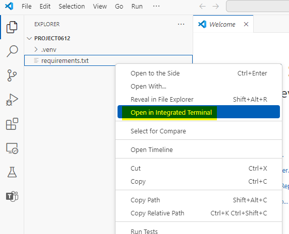

ユース ケース 08 - Azure AI Foundry SDK を使用してカスタム チャット
アプリを構築する

**所要時間:120分**

## 目的

このラボの目的は、Azure AI Foundry SDK を使用して、Retrieval-Augmented
Generation (RAG)
ベースのエージェントを構築、評価、デプロイすることです。このラボでは、プロジェクトと開発環境の設定、AI
モデル (GPT-4 や text-embedding-ada-002 など)
のデプロイ、ドキュメント取得のための Azure AI Search の統合、カスタム
ナレッジ取得 (RAG) チャット
アプリケーションの作成について説明します。焦点は、関連する製品データを使用してAIモデルの応答を基づかせ、カスタムチャットインターフェイスを開発し、生成された応答のパフォーマンスを評価することです。

## 解決

このソリューションには、Azure AI Foundry でのプロジェクトの設定、AI
モデル (GPT-4 と text-embedding-ada-002) のデプロイ、Azure AI Search
の統合によるカスタム製品データの格納と取得が含まれます。これには、ベクター埋め込みの生成、検索インデックスの作成、および関連する製品情報のクエリを実行するためのPythonスクリプトの作成が含まれます。RAGベースのチャットインターフェースは、検索結果を活用して根拠のある応答を提供するために開発されており、チャットアプリのパフォーマンスは、事前定義されたデータセットとメトリックを使用して評価され、その有効性を高めます。

## 演習 0: VM と資格情報を理解する

この演習では、ラボ全体で使用する資格情報を特定して理解します。

**重要:**
この演習の各ステップを実行して、ラボの実行に使用される一般的な用語と資格情報を理解してください。

1.  **\[Instructions\]**
    タブには、ラボ全体に従うべき指示が記載されたラボ ガイドがあります。

2.  **\[Resources** \] タブには、ラボの実行に必要な資格情報があります。

- **URL** – Azure portal の URL

- **サブスクリプション** – これは
  **、お客様に割り当てられた**サブスクリプション**の** ID です

- **ユーザー名** – **Azure サービスにログインする**
  ために必要な**ユーザー ID**。

- **パスワード** – **Azure ログイン**の**パスワード**。

> このユーザー名とパスワードを **Azure
> ログイン資格情報**と呼ぶことにします。これらのクレドは、**Azure
> のログイン資格情報について言及するすべての場所で使用します**。

- **リソースグループ** – **自分に割り当てられた**リソースグループ。

> **重要**: このリソース
> グループの下にすべてのリソースを作成してください

3.  **\[Help**\] タブには、サポート情報が表示されます。ここでの **ID**
    値は、 **ラボの実行中に使用される**ラボ インスタンス ID です。

## 演習 1 - Azure AI Foundry SDK を使用してカスタム知識取得 (RAG) アプリを構築するためのプロジェクトと開発環境を設定する

### タスク 1: プロジェクトの作成

Azure AI Foundry でプロジェクトを作成するには、次の手順に従います。

1.  Azure
    ログイン資格情報を使用して[、+++https://ai.azure.com/](https://ai.azure.com/)**+++**
    で Azure AI Foundry にログインし**ます**。

> 

2.  \[+ **Create project**\] **を選択します**。

> 

3.  プロジェクトの名前として +++ **RAGproj\<Lab instance ID\>**+++
    を入力し、\[**Customize**\] をクリックします。

> **注:** \< **Lab instance ID** \> **を自分の Lab インスタンス ID**
> に置き換え**てください**
>
> 

4.  次のページで、次の詳細を入力し、\[**Next**\]をクリックします **。**

> ハブ名 - +++ハブ\<ラボ インスタンス ID\>+++
>
> サブスクリプション - 割り当てられたサブスクリプションを選択します
>
> 新しいリソース グループを作成する - 割り当てられたリソース グループ
> (ResourceGroup1) を選択します
>
> 場所 - East US 2 またはSweden Central (このラボの実行中は米国東部 2
> を使用しました)
>
> 残りはデフォルトのままにして、\[**Next**\]をクリックします。
>
> 

5.  \[Review and finish**\] ページで、\[Create\] をクリックします**。

> 

6.  リソースの作成には数分かかります。

7.  ポップアップウィンドウが表示された場合は閉じます。

8.  プロジェクトのホーム ページで、**この演習の次のタスクで使用する
    Project connection string**をメモ帳に書き留めます。

> 

### タスク 2: モデルをデプロイする

RAG ベースのチャットアプリを構築するには、Azure OpenAI チャット モデル
(gpt-4o-mini) と Azure OpenAI 埋め込みモデル (text-embedding-ada-002) の
2
つのモデルが必要です。各モデルに対して、この一連の手順を使用することでこれらのモデルを
Azure AI Foundry プロジェクトにデプロイします。

次の手順では、AI Foundry ポータル モデル カタログからリアルタイム
エンドポイントにモデルをデプロイします。

1.  左側のナビゲーション ウィンドウで、**Model catalog を選択します**。

> 

2.  モデルのリストから**gpt-4o-mini**モデルを選択します。検索バーを使用して見つけることができます。

> 

3.  モデルの詳細ページで、 \[**Deploy\] を選択します**。

> 

4.  デフォルトのデプロイメント名**のままにします**。「**Deploy」**を選択します。または、モデルがお住まいの地域で利用できない場合は、別の地域が選択され、プロジェクトに接続されます。この場合は、
    \[**Create resource and deploy\] を選択します**。

> 
>
> 

5.  gpt-4o-mini **をデプロイした後**、+++text-embedding-ada-002+++
    モデルをデプロイする手順を繰り返します。

### タスク 3: Azure AI Search サービスを作成する

このアプリケーションの目標は、モデルの応答をカスタムデータに根ざすことです。検索インデックスは、ユーザーの質問に基づいて関連ドキュメントを取得するために使用されます。

検索インデックスを作成するには、Azure AI Search
サービスと接続が必要です。

1.  Azure ログイン資格情報を使用して、+++<https://portal.azure.com>+++
    で Azure ポータルにログインします。

2.  ホームページの検索バーから、+++AI search+++を検索して選択します。

> 

3.  **\[+ Create** \] アイコンをクリックし、次の詳細を入力します。

> 

4.  以下の詳細を入力し、 \[**Review + create\] を選択します**。

- サブスクリプション – 割り当てられたサブスクリプションを選択します

- リソースグループ – 割り当てられたリソースグループを選択します

- サービス名 – ラボ **インスタンス ID を VM の ID
  に置き換えて、**+++**aisearch\<Lab instance ID\>**+++を入力します。

- 地域 - Sweden Central またはEast US 2を選択します (ここではEast US 2
  を使用しています)

- 価格レベル – \[Standard\] を選択します

> 

5.  詳細を確認し、**Create を選択します**。

> 

6.  次の手順に進む前に、次のスクリーンショットのようにデプロイが成功するまで待ちます。

> 

### タスク 4: Azure AI Search をプロジェクトに接続する

Azure AI Foundry ポータルで、Azure AI Search
の接続済みリソースを確認します。

1.  Azure AI Foundry のプロジェクトで、 **左側のウィンドウから**
    \[**Management center**\] を選択します。

> 

2.  \[**Connected resources\]** セクションで、 \[**New connection**\]
    を選択し、次に **\[Azure AI Search**\] を選択します。

> 
>
> 

3.  \[**Authentication\] で** \[API **key** **\] を選択し、** \[**Add
    connection\] を選択します**。

> 
>
> 
>
> 

### タスク 5: Azure CLI をインストールしてサインインする

Azure CLI
をインストールし、ローカル開発環境からサインインすると、ユーザー資格情報を使用して
Azure OpenAI サービスを呼び出すことができます。

1.  Windowsの検索バーから+++**PowerShell** +
    ++を検索し、Administratorモードで開きます。

> 

2.  Windows Power Shellを開き、以下のコマンドを貼り付けて実行します。

> $progressPreference = 'silentlyContinue'
>
> Write-Host "Installing WinGet PowerShell module from PSGallery..."
>
> Install-PackageProvider -Name NuGet -Force | Out-Null
>
> Install-Module -Name Microsoft.WinGet.Client -Force -Repository
> PSGallery | Out-Null
>
> Write-Host "Using Repair-WinGetPackageManager cmdlet to bootstrap
> WinGet..."
>
> Repair-WinGetPackageManager
>
> Write-Host "Done."

3.  次のコマンドを使用して、ターミナルから Azure CLI
    をインストールします。

winget install -e --id Microsoft.AzureCLI

承認を求められたら **Y** を選択します。

4.  Azure CLI をインストールしたら、az login
    コマンドを使用してサインインし、ブラウザーを使用してサインインします。

+++Az login +++

**Work or school accountを選択し、Continue をクリックします**。

5.  Azure のログイン資格情報**でログインします**。

6.  「サブスクリプションの選択**」プロンプト**に **1** を入力し、**Enter
    を押します**。

### タスク 6: 新しい Python 環境を作成する

まず、このチュートリアルに必要なパッケージのインストールに使用する新しい
Python
環境を作成する必要があります。グローバルPythonインストールにパッケージをインストールしないでください。Pythonパッケージをインストールするときは、常に仮想環境またはconda環境を使用する必要があります。そうしないと、Pythonのグローバルインストールを中断される可能性があります。

**仮想環境を作成する**

1.  Power Shell から、**以下のコマンドを実行して C:\Users\Admin**
    に移動します。

+++cd\\++

+++cd Users\Admin+++

2.  PowerShell に次のコマンドを入力して、プロジェクト名 **RAGproj\<Lab
    instance id\> でフォルダーを作成します。**

**注:**
以下のコマンドで\<プロジェクト名\>をプロジェクト名に置き換えて実行してください。

+++**mkdir \< Project name \>**+++

3.  ターミナルで次のコマンドを入力して、新しいフォルダの場所に移動します

+++cd **\< Project name \>+++**

\<プロジェクト名\>を、前の手順で作成したフォルダー名に置き換えます。

4.  次のコマンドを使用して仮想環境を作成します

+++py -3 -m venv .venv+++

+++.venv\scripts\activate+++

> 
>
> Python 環境をアクティブ化するということは、コマンドラインから python
> または pip を実行するときに、アプリケーションの .venv
> フォルダに含まれる Python インタープリターを使用することを意味します。

5.  VS Code **を開きます**。**File -\> Open
    Folder**を選択し、前の手順で作成した **RAGproject**
    フォルダを選択します。

### タスク 7: パッケージのインストール

azure-ai-projects (プレビュー) と azure-ai-inference (プレビュー)
を、その他の必要なパッケージと共にインストールします。

1.  プロジェクトフォルダ**に+++requirements.txt++++という名前のファイルを作成し**
    、次のパッケージをファイルに追加します。

> azure-ai-projects
>
> azure-ai-inference\[prompts\]
>
> azure-identity
>
> azure-search-documents
>
> pandas
>
> python-dotenv
>
> opentelemetry-api

> 

2.  上部のナビゲーションバーで、\[ファイル\]をクリックして**すべて保存します**。

3.  requirements.txtを右クリックし、\[**Open in Integrated
    Terminal\]を選択します**。

4.  次のコマンドを実行して、仮想環境に入ります

py -3 -m venv .venv

.venv\scripts\activate

5.  +++az login+++ コマンドを実行し、Azure
    ログイン資格情報でログインします。
    **サブスクリプションを選択するには**、1 を選択します。

6.  必要なパッケージをインストールするには、次のコードを実行します。

+++pip install -r requirements.txt+++

> **注:**
> PIPの新しいリリースの通知を受け取った場合は、次のコマンドを実行してPIPをアップグレードしてください
>
> +++pip install -r requirements.txt+++

+++python.exe -m pip install --upgrade pip+++

> 

### タスク 8: ヘルパー スクリプトを作成する

1.  src
    **という名前の新しいフォルダを作成します**。ターミナルで次のコマンドを実行します。

mkdir src

2.  srcフォルダ**に新しいファイルを作成し**
    、+++config.py+++という名前を付けます

3.  次のコードを **config.py** に追加して保存します。

\# ruff: noqa: ANN201, ANN001

import os

import sys

import pathlib

import logging

from azure.identity import DefaultAzureCredential

from azure.ai.projects import AIProjectClient

from azure.ai.inference.tracing import AIInferenceInstrumentor

\# load environment variables from the .env file

from dotenv import load_dotenv

load_dotenv()

\# Set "./assets" as the path where assets are stored, resolving the
absolute path:

ASSET_PATH = pathlib.Path(\_\_file\_\_).parent.resolve() / "assets"

\# Configure an root app logger that prints info level logs to stdout

logger = logging.getLogger("app")

logger.setLevel(logging.INFO)

logger.addHandler(logging.StreamHandler(stream=sys.stdout))

\# Returns a module-specific logger, inheriting from the root app logger

def get_logger(module_name):

return logging.getLogger(f"app.{module_name}")

\# Enable instrumentation and logging of telemetry to the project

def enable_telemetry(log_to_project: bool = False):

AIInferenceInstrumentor().instrument()

\# enable logging message contents

os.environ\["AZURE_TRACING_GEN_AI_CONTENT_RECORDING_ENABLED"\] = "true"

if log_to_project:

from azure.monitor.opentelemetry import configure_azure_monitor

project = AIProjectClient.from_connection_string(

conn_str=os.environ\["AIPROJECT_CONNECTION_STRING"\],
credential=DefaultAzureCredential()

)

tracing_link =
f"https://ai.azure.com/tracing?wsid=/subscriptions/{project.scope\['subscription_id'\]}/resourceGroups/{project.scope\['resource_group_name'\]}/providers/Microsoft.MachineLearningServices/workspaces/{project.scope\['project_name'\]}"

application_insights_connection_string =
project.telemetry.get_connection_string()

if not application_insights_connection_string:

logger.warning(

"No application insights configured, telemetry will not be logged to
project. Add application insights at:"

)

logger.warning(tracing_link)

return

configure_azure_monitor(connection_string=application_insights_connection_string)

logger.info("Enabled telemetry logging to project, view traces at:")

logger.info(tracing_link)

**注**: この新しく作成された config.py ファイル
スクリプトは、次の演習で使用します。

### タスク 9: 環境変数を構成する

コードから Azure OpenAI
サービスを呼び出すには、プロジェクト接続文字列が必要です。このクイックスタートでは、この値を
.env ファイル
(アプリケーションが読み取ることができる環境変数を含むファイル)
に保存します。

1.  src ディレクトリ**に**新しいファイル +++**.env+++**
    を作成し、次のコードを貼り付けます。

\<your-connection-string\> **を** 、タスク 1
のメモ帳に保存されているプロジェクト接続文字列の値に置き換えます。

AIPROJECT_CONNECTION_STRING=\<your-connection-string\>

AISEARCH_INDEX_NAME="example-index"

EMBEDDINGS_MODEL="text-embedding-ada-002"

INTENT_MAPPING_MODEL="gpt-4o-mini"

CHAT_MODEL="gpt-4o-mini"

EVALUATION_MODEL="gpt-4o-mini"

**注**: 接続文字列は、Azure AI Foundry プロジェクトのホームページの
**\[Overview\] にあります**。

## 演習 2: Azure AI Foundry SDK を使用してカスタム知識取得 (RAG) アプリを構築する

### タスク 1: チャット アプリのサンプル データを作成する

このRAGベースのアプリケーションの目標は、モデル応答をカスタムデータに基づかせることです。埋め込みモデルからベクトル化されたデータを格納する
Azure AI Search
インデックスを使用します。検索インデックスは、ユーザーの質問に基づいて関連ドキュメントを取得するために使用されます。

1.  開いているVS
    Codeセットアップから、srcフォルダーの下に+++assets+++という名前のフォルダーを作成します
    。

2.  C:\LabFiles**からproducts.csv**ファイル**をコピーして、**プロジェクトの**ルートフォルダ**に貼り付けます。

注:これはファイルエクスプローラーで行う必要があり、その後VSCodeに反映されます。

3.  上部のナビゲーションバーにある「**ファイル**」に移動し、「**Save
    all」をクリックします。**

### タスク 2: 検索インデックスを作成する

> 検索インデックスは、埋め込みモデルからベクトル化されたデータを格納するために使用されます。検索インデックスは、ユーザーの質問に基づいて関連ドキュメントを取得するために使用されます。

1.  VSコードで、srcフォルダに**+++create_search_index.py+++**という名前のファイルを作成します(つまり、**assets**フォルダ**内ではなく、**assetsフォルダを配置したのと同じディレクトリ)。

> 

2.  作成したファイル、**create_search_index.py**ファイルを開き、次のコードを追加して必要なライブラリをインポートし、プロジェクトクライアントを作成し、いくつかの設定を構成します。

> import os
>
> from azure.ai.projects import AIProjectClient
>
> from azure.ai.projects.models import ConnectionType
>
> from azure.identity import DefaultAzureCredential
>
> from azure.core.credentials import AzureKeyCredential
>
> from azure.search.documents import SearchClient
>
> from azure.search.documents.indexes import SearchIndexClient
>
> from config import get_logger
>
> \# initialize logging object
>
> logger = get_logger(\_\_name\_\_)
>
> \# create a project client using environment variables loaded from the
> .env file
>
> project = AIProjectClient.from_connection_string(
>
> conn_str=os.environ\["AIPROJECT_CONNECTION_STRING"\],
> credential=DefaultAzureCredential()
>
> )
>
> \# create a vector embeddings client that will be used to generate
> vector embeddings
>
> embeddings = project.inference.get_embeddings_client()
>
> \# use the project client to get the default search connection
>
> search_connection = project.connections.get_default(
>
> connection_type=ConnectionType.AZURE_AI_SEARCH,
> include_credentials=True
>
> )
>
> \# Create a search index client using the search connection
>
> \# This client will be used to create and delete search indexes
>
> index_client = SearchIndexClient(
>
> endpoint=search_connection.endpoint_url,
> credential=AzureKeyCredential(key=search_connection.key)
>
> )
>
> 

3.  次に、create_search_index.pyの最後に関数を追加して
    、検索インデックスを定義します。

> import pandas as pd
>
> from azure.search.documents.indexes.models import (
>
> SemanticSearch,
>
> SearchField,
>
> SimpleField,
>
> SearchableField,
>
> SearchFieldDataType,
>
> SemanticConfiguration,
>
> SemanticPrioritizedFields,
>
> SemanticField,
>
> VectorSearch,
>
> HnswAlgorithmConfiguration,
>
> VectorSearchAlgorithmKind,
>
> HnswParameters,
>
> VectorSearchAlgorithmMetric,
>
> ExhaustiveKnnAlgorithmConfiguration,
>
> ExhaustiveKnnParameters,
>
> VectorSearchProfile,
>
> SearchIndex,
>
> )
>
> def create_index_definition(index_name: str, model: str) -\>
> SearchIndex:
>
> dimensions = 1536 \# text-embedding-ada-002
>
> if model == "text-embedding-3-large":
>
> dimensions = 3072
>
> \# The fields we want to index. The "embedding" field is a vector
> field that will
>
> \# be used for vector search.
>
> fields = \[
>
> SimpleField(name="id", type=SearchFieldDataType.String, key=True),
>
> SearchableField(name="content", type=SearchFieldDataType.String),
>
> SimpleField(name="filepath", type=SearchFieldDataType.String),
>
> SearchableField(name="title", type=SearchFieldDataType.String),
>
> SimpleField(name="url", type=SearchFieldDataType.String),
>
> SearchField(
>
> name="contentVector",
>
> type=SearchFieldDataType.Collection(SearchFieldDataType.Single),
>
> searchable=True,
>
> \# Size of the vector created by the text-embedding-ada-002 model.
>
> vector_search_dimensions=dimensions,
>
> vector_search_profile_name="myHnswProfile",
>
> ),
>
> \]
>
> \# The "content" field should be prioritized for semantic ranking.
>
> semantic_config = SemanticConfiguration(
>
> name="default",
>
> prioritized_fields=SemanticPrioritizedFields(
>
> title_field=SemanticField(field_name="title"),
>
> keywords_fields=\[\],
>
> content_fields=\[SemanticField(field_name="content")\],
>
> ),
>
> )
>
> \# For vector search, we want to use the HNSW (Hierarchical Navigable
> Small World)
>
> \# algorithm (a type of approximate nearest neighbor search algorithm)
> with cosine
>
> \# distance.
>
> vector_search = VectorSearch(
>
> algorithms=\[
>
> HnswAlgorithmConfiguration(
>
> name="myHnsw",
>
> kind=VectorSearchAlgorithmKind.HNSW,
>
> parameters=HnswParameters(
>
> m=4,
>
> ef_construction=1000,
>
> ef_search=1000,
>
> metric=VectorSearchAlgorithmMetric.COSINE,
>
> ),
>
> ),
>
> ExhaustiveKnnAlgorithmConfiguration(
>
> name="myExhaustiveKnn",
>
> kind=VectorSearchAlgorithmKind.EXHAUSTIVE_KNN,
>
> parameters=ExhaustiveKnnParameters(metric=VectorSearchAlgorithmMetric.COSINE),
>
> ),
>
> \],
>
> profiles=\[
>
> VectorSearchProfile(
>
> name="myHnswProfile",
>
> algorithm_configuration_name="myHnsw",
>
> ),
>
> VectorSearchProfile(
>
> name="myExhaustiveKnnProfile",
>
> algorithm_configuration_name="myExhaustiveKnn",
>
> ),
>
> \],
>
> )
>
> \# Create the semantic settings with the configuration
>
> semantic_search = SemanticSearch(configurations=\[semantic_config\])
>
> \# Create the search index definition
>
> return SearchIndex(
>
> name=index_name,
>
> fields=fields,
>
> semantic_search=semantic_search,
>
> vector_search=vector_search,
>
> )

4.  次に、create_search_index.pyに関数を追加して、csv
    ファイルをインデックスに追加する関数を作成します。

> \# define a function for indexing a csv file, that adds each row as a
> document
>
> \# and generates vector embeddings for the specified content_column
>
> def create_docs_from_csv(path: str, content_column: str, model: str)
> -\> list\[dict\[str, any\]\]:
>
> products = pd.read_csv(path)
>
> items = \[\]
>
> for product in products.to_dict("records"):
>
> content = product\[content_column\]
>
> id = str(product\["id"\])
>
> title = product\["name"\]
>
> url = f"/products/{title.lower().replace(' ', '-')}"
>
> emb = embeddings.embed(input=content, model=model)
>
> rec = {
>
> "id": id,
>
> "content": content,
>
> "filepath": f"{title.lower().replace(' ', '-')}",
>
> "title": title,
>
> "url": url,
>
> "contentVector": emb.data\[0\].embedding,
>
> }
>
> items.append(rec)
>
> return items
>
> def create_index_from_csv(index_name, csv_file):
>
> \# If a search index already exists, delete it:
>
> try:
>
> index_definition = index_client.get_index(index_name)
>
> index_client.delete_index(index_name)
>
> logger.info(f"🗑️ Found existing index named '{index_name}', and
> deleted it")
>
> except Exception:
>
> pass
>
> \# create an empty search index
>
> index_definition = create_index_definition(index_name,
> model=os.environ\["EMBEDDINGS_MODEL"\])
>
> index_client.create_index(index_definition)
>
> \# create documents from the products.csv file, generating vector
> embeddings for the "description" column
>
> docs = create_docs_from_csv(path=csv_file,
> content_column="description", model=os.environ\["EMBEDDINGS_MODEL"\])
>
> \# Add the documents to the index using the Azure AI Search client
>
> search_client = SearchClient(
>
> endpoint=search_connection.endpoint_url,
>
> index_name=index_name,
>
> credential=AzureKeyCredential(key=search_connection.key),
>
> )
>
> search_client.upload_documents(docs)
>
> logger.info(f"➕ Uploaded {len(docs)} documents to '{index_name}'
> index")
>
> 

5.  最後に、create_search_index.pyに以下の関数を追加してインデックスを作成し、クラウドプロジェクトに登録します。コードを追加したら、トップバーから\[ファイル\]に移動し、\[**Save
    all\]をクリックします。**

> if \_\_name\_\_ == "\_\_main\_\_":
>
> import argparse
>
> parser = argparse.ArgumentParser()
>
> parser.add_argument(
>
> "--index-name",
>
> type=str,
>
> help="index name to use when creating the AI Search index",
>
> default=os.environ\["AISEARCH_INDEX_NAME"\],
>
> )
>
> parser.add_argument(
>
> "--csv-file", type=str, help="path to data for creating search index",
> default="assets/products.csv"
>
> )
>
> args = parser.parse_args()
>
> index_name = args.index_name
>
> csv_file = args.csv_file
>
> create_index_from_csv(index_name, csv_file)
>
> 

6.  create_search_index.py**を右クリックし** 、\[**Open in integrated
    terminal**\]オプションを選択します。

7.  ターミナルから Azure
    ログイン資格情報にログインし、アカウントの認証手順に従います：

> +++az login +++
>
> 
>
> 

8.  コードを実行してインデックスをローカルにビルドし、クラウド
    プロジェクトに登録します。

> +++python create_search_index.py+++
>
> 

9.  スクリプトが実行されると、新しく作成したインデックスを Azure portal
    から表示できます。

10. 割り当てられた **リソース グループ-\> 作成した検索サービス
    (aisearchLabinstanceID) -\> 検索管理 -\>
    インデックスに移動します**。

> 

11. 同じインデックス名でスクリプトを再度実行すると、同じインデックスの新しいバージョンが作成されます。

### タスク 3: 製品ドキュメントを取得する

> 次に、検索インデックスから製品ドキュメントを取得するスクリプトを作成します。このスクリプトは、ユーザーの質問に一致するドキュメントを検索インデックスに照会します。
>
> **製品ドキュメントを取得するスクリプトを作成する**
>
> チャットがリクエストを受け取ると、チャットはユーザーのデータを検索して関連情報を見つけます。このスクリプトでは、Azure
> AI SDK
> を使用して、ユーザーの質問に一致するドキュメントの検索インデックスをクエリします。その後、ドキュメントをチャットアプリに返します。

1.  VS Code から、src フォルダーに +++**get_product_documents.py**+++
    という名前のファイルを作成します 。

> 

2.  次のコードをコピーしてファイルに貼り付けます。必要なライブラリをインポートし、プロジェクト
    クライアントを作成し、設定を構成するコードから開始します。

> import os
>
> from pathlib import Path
>
> from opentelemetry import trace
>
> from azure.ai.projects import AIProjectClient
>
> from azure.ai.projects.models import ConnectionType
>
> from azure.identity import DefaultAzureCredential
>
> from azure.core.credentials import AzureKeyCredential
>
> from azure.search.documents import SearchClient
>
> from config import ASSET_PATH, get_logger
>
> \# initialize logging and tracing objects
>
> logger = get_logger(\_\_name\_\_)
>
> tracer = trace.get_tracer(\_\_name\_\_)
>
> \# create a project client using environment variables loaded from the
> .env file
>
> project = AIProjectClient.from_connection_string(
>
> conn_str=os.environ\["AIPROJECT_CONNECTION_STRING"\],
> credential=DefaultAzureCredential()
>
> )
>
> \# create a vector embeddings client that will be used to generate
> vector embeddings
>
> chat = project.inference.get_chat_completions_client()
>
> embeddings = project.inference.get_embeddings_client()
>
> \# use the project client to get the default search connection
>
> search_connection = project.connections.get_default(
>
> connection_type=ConnectionType.AZURE_AI_SEARCH,
> include_credentials=True
>
> )
>
> \# Create a search index client using the search connection
>
> \# This client will be used to create and delete search indexes
>
> search_client = SearchClient(
>
> index_name=os.environ\["AISEARCH_INDEX_NAME"\],
>
> endpoint=search_connection.endpoint_url,
>
> credential=AzureKeyCredential(key=search_connection.key),
>
> )

3.  get_product-documents.pyに関数を追加して、
    **製品ドキュメントを取得します**。

> from azure.ai.inference.prompts import PromptTemplate
>
> from azure.search.documents.models import VectorizedQuery
>
> @tracer.start_as_current_span(name="get_product_documents")
>
> def get_product_documents(messages: list, context: dict = None) -\>
> dict:
>
> if context is None:
>
> context = {}
>
> overrides = context.get("overrides", {})
>
> top = overrides.get("top", 5)
>
> \# generate a search query from the chat messages
>
> intent_prompty = PromptTemplate.from_prompty(Path(ASSET_PATH) /
> "intent_mapping.prompty")
>
> intent_mapping_response = chat.complete(
>
> model=os.environ\["INTENT_MAPPING_MODEL"\],
>
> messages=intent_prompty.create_messages(conversation=messages),
>
> \*\*intent_prompty.parameters,
>
> )
>
> search_query = intent_mapping_response.choices\[0\].message.content
>
> logger.debug(f"🧠 Intent mapping: {search_query}")
>
> \# generate a vector representation of the search query
>
> embedding = embeddings.embed(model=os.environ\["EMBEDDINGS_MODEL"\],
> input=search_query)
>
> search_vector = embedding.data\[0\].embedding
>
> \# search the index for products matching the search query
>
> vector_query = VectorizedQuery(vector=search_vector,
> k_nearest_neighbors=top, fields="contentVector")
>
> search_results = search_client.search(
>
> search_text=search_query, vector_queries=\[vector_query\],
> select=\["id", "content", "filepath", "title", "url"\]
>
> )
>
> documents = \[
>
> {
>
> "id": result\["id"\],
>
> "content": result\["content"\],
>
> "filepath": result\["filepath"\],
>
> "title": result\["title"\],
>
> "url": result\["url"\],
>
> }
>
> for result in search_results
>
> \]
>
> \# add results to the provided context
>
> if "thoughts" not in context:
>
> context\["thoughts"\] = \[\]
>
> \# add thoughts and documents to the context object so it can be
> returned to the caller
>
> context\["thoughts"\].append(
>
> {
>
> "title": "Generated search query",
>
> "description": search_query,
>
> }
>
> )
>
> if "grounding_data" not in context:
>
> context\["grounding_data"\] = \[\]
>
> context\["grounding_data"\].append(documents)
>
> logger.debug(f"📄 {len(documents)} documents retrieved: {documents}")
>
> return documents

4.  最後に、
    **スクリプトを直接実行するときに**関数をテストするコードを追加します。

> if \_\_name\_\_ == "\_\_main\_\_":
>
> import logging
>
> import argparse
>
> \# set logging level to debug when running this module directly
>
> logger.setLevel(logging.DEBUG)
>
> \# load command line arguments
>
> parser = argparse.ArgumentParser()
>
> parser.add_argument(
>
> "--query",
>
> type=str,
>
> help="Query to use to search product",
>
> default="I need a new tent for 4 people, what would you recommend?",
>
> )
>
> args = parser.parse_args()
>
> query = args.query
>
> result = get_product_documents(messages=\[{"role": "user", "content":
> query}\])
>
> 

5.  **File**\> **Save allをクリックします**。

### タスク 4: インテント・マッピングのプロンプト・テンプレートの作成

> **get_product_documents.py** スクリプトは、プロンプト
> テンプレートを使用して、会話を検索クエリに変換します。このテンプレートは、会話からユーザーの意図を抽出する方法を指示します。

1.  スクリプトを実行する前に、プロンプトテンプレートを作成します。**assets**フォルダの下に+++**intent_mapping.prompty**+++という名前のファイルを作成します：

> 

4.  次のコードをintent_mapping_promptyファイルにコピーし、上部のバーから\[ファイル\]に移動し、\[**Save
    all\]をクリックします。**

> ---
>
> name: Chat Prompt
>
> description: A prompty that extract users query intent based on the
> current_query and chat_history of the conversation
>
> model:
>
> api: chat
>
> configuration:
>
> azure_deployment: gpt-4o
>
> inputs:
>
> conversation:
>
> type: array
>
> ---
>
> system:
>
> \# Instructions
>
> \- You are an AI assistant reading a current user query and
> chat_history.
>
> \- Given the chat_history, and current user's query, infer the user's
> intent expressed in the current user query.
>
> \- Once you infer the intent, respond with a search query that can be
> used to retrieve relevant documents for the current user's query based
> on the intent
>
> \- Be specific in what the user is asking about, but disregard parts
> of the chat history that are not relevant to the user's intent.
>
> \- Provide responses in json format
>
> \# Examples
>
> Example 1:
>
> With a conversation like below:
>
> \`\`\`
>
> \- user: are the trailwalker shoes waterproof?
>
> \- assistant: Yes, the TrailWalker Hiking Shoes are waterproof. They
> are designed with a durable and waterproof construction to withstand
> various terrains and weather conditions.
>
> \- user: how much do they cost?
>
> \`\`\`
>
> Respond with:
>
> {
>
> "intent": "The user wants to know how much the Trailwalker Hiking
> Shoes cost.",
>
> "search_query": "price of Trailwalker Hiking Shoes"
>
> }
>
> Example 2:
>
> With a conversation like below:
>
> \`\`\`
>
> \- user: are the trailwalker shoes waterproof?
>
> \- assistant: Yes, the TrailWalker Hiking Shoes are waterproof. They
> are designed with a durable and waterproof construction to withstand
> various terrains and weather conditions.
>
> \- user: how much do they cost?
>
> \- assistant: The TrailWalker Hiking Shoes are priced at $110.
>
> \- user: do you have waterproof tents?
>
> \- assistant: Yes, we have waterproof tents available. Can you please
> provide more information about the type or size of tent you are
> looking for?
>
> \- user: which is your most waterproof tent?
>
> \- assistant: Our most waterproof tent is the Alpine Explorer Tent. It
> is designed with a waterproof material and has a rainfly with a
> waterproof rating of 3000mm. This tent provides reliable protection
> against rain and moisture.
>
> \- user: how much does it cost?
>
> \`\`\`
>
> Respond with:
>
> {
>
> "intent": "The user would like to know how much the Alpine Explorer
> Tent costs.",
>
> "search_query": "price of Alpine Explorer Tent"
>
> }
>
> user:
>
> Return the search query for the messages in the following
> conversation:
>
> {{#conversation}}
>
> \- {{role}}: {{content}}
>
> {{/conversation}}
>
> 

### タスク 5: 製品ドキュメント取得スクリプトのテスト

1.  スクリプトとテンプレートの両方が用意できたので、スクリプトを実行して、クエリから検索インデックスが返すドキュメントをテストします。ターミナルウィンドウから実行する、

> +++python get_product_documents.py --query "I need a new tent for 4
> people, what would you recommend?"+++
>
> 

### タスク 6: カスタム知識取得 (RAG) コードの開発

> 次に、基本的なチャット アプリケーションに retrieval augmented
> generation (RAG) 機能を追加するカスタム コードを作成します。
>
> **RAG機能を持つチャットスクリプトの作成**

1.  **src** フォルダに +++chat_with_products.py+++
    という新しいファイルを作成します。このスクリプトは、製品ドキュメントを取得し、ユーザーの質問に対する回答を生成します。

> 

2.  必要なライブラリをインポートし、プロジェクトクライアントを作成し、設定を構成するコードを追加します。

> import os
>
> from pathlib import Path
>
> from opentelemetry import trace
>
> from azure.ai.projects import AIProjectClient
>
> from azure.identity import DefaultAzureCredential
>
> from config import ASSET_PATH, get_logger, enable_telemetry
>
> from get_product_documents import get_product_documents
>
> \# initialize logging and tracing objects
>
> logger = get_logger(\_\_name\_\_)
>
> tracer = trace.get_tracer(\_\_name\_\_)
>
> \# create a project client using environment variables loaded from the
> .env file
>
> project = AIProjectClient.from_connection_string(
>
> conn_str=os.environ\["AIPROJECT_CONNECTION_STRING"\],
> credential=DefaultAzureCredential()
>
> )
>
> \# create a chat client we can use for testing
>
> chat = project.inference.get_chat_completions_client()
>
> 

3.  chat_with_products.pyの最後にコードを追加して、RAG機能を使用するチャット関数を作成します。

> from azure.ai.inference.prompts import PromptTemplate
>
> @tracer.start_as_current_span(name="chat_with_products")
>
> def chat_with_products(messages: list, context: dict = None) -\> dict:
>
> if context is None:
>
> context = {}
>
> documents = get_product_documents(messages, context)
>
> \# do a grounded chat call using the search results
>
> grounded_chat_prompt = PromptTemplate.from_prompty(Path(ASSET_PATH) /
> "grounded_chat.prompty")
>
> system_message =
> grounded_chat_prompt.create_messages(documents=documents,
> context=context)
>
> response = chat.complete(
>
> model=os.environ\["CHAT_MODEL"\],
>
> messages=system_message + messages,
>
> \*\*grounded_chat_prompt.parameters,
>
> )
>
> logger.info(f"💬 Response: {response.choices\[0\].message}")
>
> \# Return a chat protocol compliant response
>
> return {"message": response.choices\[0\].message, "context": context}
>
> 

4.  最後に、チャット機能**を実行するコードを追加して**から、ファイルに移動して\[S**ave
    all**\]をクリックします。

> if \_\_name\_\_ == "\_\_main\_\_":
>
> import argparse
>
> \# load command line arguments
>
> parser = argparse.ArgumentParser()
>
> parser.add_argument(
>
> "--query",
>
> type=str,
>
> help="Query to use to search product",
>
> default="I need a new tent for 4 people, what would you recommend?",
>
> )
>
> parser.add_argument(
>
> "--enable-telemetry",
>
> action="store_true",
>
> help="Enable sending telemetry back to the project",
>
> )
>
> args = parser.parse_args()
>
> if args.enable_telemetry:
>
> enable_telemetry(True)
>
> \# run chat with products
>
> response = chat_with_products(messages=\[{"role": "user", "content":
> args.query}\])
>
> 

### タスク 7: 根拠付きチャットプロンプト テンプレートを作成する

> **chat_with_products.py** スクリプトは、プロンプト
> テンプレートを呼び出して、ユーザーの質問に対する応答を生成します。テンプレートは、ユーザーの質問と取得したドキュメントに基づいて応答を生成する方法を指示します。このテンプレートを今すぐ作成してください。

1.  assets **フォルダに** +++**grounded_chat.prompty+++**
    ファイルを追加します。

> 

2.  次のコード grounded_chat.prompty を追加します。

> ---
>
> name: Chat with documents
>
> description: Uses a chat completions model to respond to queries
> grounded in relevant documents
>
> model:
>
> api: chat
>
> configuration:
>
> azure_deployment: gpt-4o
>
> inputs:
>
> conversation:
>
> type: array
>
> ---
>
> system:
>
> You are an AI assistant helping users with queries related to outdoor
> outdooor/camping gear and clothing.
>
> If the question is not related to outdoor/camping gear and clothing,
> just say 'Sorry, I only can answer queries related to outdoor/camping
> gear and clothing. So, how can I help?'
>
> Don't try to make up any answers.
>
> If the question is related to outdoor/camping gear and clothing but
> vague, ask for clarifying questions instead of referencing documents.
> If the question is general, for example it uses "it" or "they", ask
> the user to specify what product they are asking about.
>
> Use the following pieces of context to answer the questions about
> outdoor/camping gear and clothing as completely, correctly, and
> concisely as possible.
>
> Do not add documentation reference in the response.
>
> \# Documents
>
> {{#documents}}
>
> \## Document {{id}}: {{title}}
>
> {{content}}
>
> {{/documents}}
>
> 

3.  **File\> Save allをクリックします。**

> 

### タスク8:RAG機能を持つチャットスクリプトの実行

1.  スクリプトとテンプレートの両方が用意できたので、スクリプトを実行して、RAG機能を使用してチャットアプリをテストします。

> +++python chat_with_products.py --query "I need a new tent for 4
> people, what would you recommend?"+++
>
> 

### タスク 9: テレメトリログを追加する

1.  Azure portal で \[**Subscription**\] を選択し、左側のナビゲーション
    ウィンドウの **\[Settings**\] で **\[Resource providers**\]
    を選択します。

2.  +++**Microsoft.OperationalInsights**+++
    を検索して選択し、このリソース プロバイダーの 3
    つのドットをクリックして \[**Register\] を選択します**。

> 

3.  同じ手順に従って +++microsoft.insights+++ を登録します

4.  登録の成功メッセージを待ってから、次の手順に進みます。

> 

5.  Azure AI Foundry のプロジェクトで、左側のウィンドウから **\[Access
    and improve**\] の \[**Tracing**\] を選択します。\[**Create New\]
    を選択します**。

> 
>
> 

6.  リソースが作成されていることを確認します。

> 

7.  VS Code
    に戻り、プロジェクトへのテレメトリのログ記録を有効にするには、azure-monitor-opentelemetry
    をインストールします。

> +++pip install azure-monitor-opentelemetry+++
>
> 

8.  chat_with_products.pyスクリプトを使用する場合は、--enable-telemetry
    フラグを追加します。

> +++python chat_with_products.py --query "I need a new tent for 4
> people, what would you recommend?" --enable-telemetry+++
>
> 

## 演習 3: Azure AI Foundry SDK を使用してカスタムチャットアプリケーションを評価する

### タスク 1: チャットアプリの応答の品質を評価する

チャット履歴を含め、チャットアプリがクエリに適切に応答することがわかったので、次はいくつかの異なる指標とより多くのデータでどのように機能するかを評価します。

評価データセットと get_chat_response()
ターゲット関数を持つエバリュエーターを使用して、評価結果を評価します。

評価を実行したら、システムプロンプトの改善や、チャット
アプリの応答の変化と改善の観察など、ロジックを改善できます。

**評価データセットの作成**

次の評価データセットを使用し、問題の例と予想される回答 (truth)
が含まれています。

1.  assets **フォルダに +++chat_eval_data.jsonl+++**
    というファイルを作成します。

> 

2.  このデータセットをファイルに貼り付けて、ファイル**を保存します**。

> {"query": "Which tent is the most waterproof?", "truth": "The Alpine
> Explorer Tent has the highest rainfly waterproof rating at 3000m"}
>
> {"query": "Which camping table holds the most weight?", "truth": "The
> Adventure Dining Table has a higher weight capacity than all of the
> other camping tables mentioned"}
>
> {"query": "How much do the TrailWalker Hiking Shoes cost? ", "truth":
> "The Trailewalker Hiking Shoes are priced at $110"}
>
> {"query": "What is the proper care for trailwalker hiking shoes? ",
> "truth": "After each use, remove any dirt or debris by brushing or
> wiping the shoes with a damp cloth."}
>
> {"query": "What brand is TrailMaster tent? ", "truth":
> "OutdoorLiving"}
>
> {"query": "How do I carry the TrailMaster tent around? ", "truth": "
> Carry bag included for convenient storage and transportation"}
>
> {"query": "What is the floor area for Floor Area? ", "truth": "80
> square feet"}
>
> {"query": "What is the material for TrailBlaze Hiking Pants?",
> "truth": "Made of high-quality nylon fabric"}
>
> {"query": "What color does TrailBlaze Hiking Pants come in?", "truth":
> "Khaki"}
>
> {"query": "Can the warrenty for TrailBlaze pants be transfered? ",
> "truth": "The warranty is non-transferable and applies only to the
> original purchaser of the TrailBlaze Hiking Pants. It is valid only
> when the product is purchased from an authorized retailer."}
>
> {"query": "How long are the TrailBlaze pants under warranty for? ",
> "truth": " The TrailBlaze Hiking Pants are backed by a 1-year limited
> warranty from the date of purchase."}
>
> {"query": "What is the material for PowerBurner Camping Stove? ",
> "truth": "Stainless Steel"}
>
> {"query": "Is France in Europe?", "truth": "Sorry, I can only queries
> related to outdoor/camping gear and
> equipment"}

### タスク 2: Azure AI エバリュエーターを使用して評価する

次に、次の操作を行う評価スクリプトを定義します：

- チャット アプリロジックのターゲット関数ラッパーを生成します。

- サンプルの .jsonl データセットを読み込みます。

- 評価を実行し、ターゲット関数を取得し、評価データセットをチャットアプリからの応答とマージします。

- GPT が支援する一連の指標 (関連性、接地性、一貫性) を生成して、チャット
  アプリの応答の品質を評価します。

- 結果をローカルに出力し、結果をクラウド プロジェクトに記録します。

このスクリプトを使用すると、結果をコマンドラインに出力したり、jsonファイルに出力したりして、結果をローカルで確認することができます。

また、このスクリプトは評価結果をクラウドプロジェクトに記録するため、UI
で評価の実行を比較できます。

1.  src**フォルダ**の下に+++**evaluate.py**++++というファイルを作成します。

> 

2.  次のコードを追加して、必要なライブラリをインポートし、プロジェクト
    クライアントを作成し、いくつかの設定を構成します。

> import os
>
> import pandas as pd
>
> from azure.ai.projects import AIProjectClient
>
> from azure.ai.projects.models import ConnectionType
>
> from azure.ai.evaluation import evaluate, GroundednessEvaluator
>
> from azure.identity import DefaultAzureCredential
>
> from chat_with_products import chat_with_products
>
> \# load environment variables from the .env file at the root of this
> repo
>
> from dotenv import load_dotenv
>
> load_dotenv()
>
> \# create a project client using environment variables loaded from the
> .env file
>
> project = AIProjectClient.from_connection_string(
>
> conn_str=os.environ\["AIPROJECT_CONNECTION_STRING"\],
> credential=DefaultAzureCredential()
>
> )
>
> connection =
> project.connections.get_default(connection_type=ConnectionType.AZURE_OPEN_AI,
> include_credentials=True)
>
> evaluator_model = {
>
> "azure_endpoint": connection.endpoint_url,
>
> "azure_deployment": os.environ\["EVALUATION_MODEL"\],
>
> "api_version": "2024-06-01",
>
> "api_key": connection.key,
>
> }
>
> groundedness = GroundednessEvaluator(evaluator_model)
>
> 

3.  クエリとレスポンスの評価のための評価インターフェイスを実装するラッパー関数を作成するコードを追加します。

> def evaluate_chat_with_products(query):
>
> response = chat_with_products(messages=\[{"role": "user", "content":
> query}\])
>
> return {"response": response\["message"\].content, "context":
> response\["context"\]\["grounding_data"\]}
>
> 

4.  最後に、評価を実行するコードを追加し、結果をローカルで表示し、AI
    Foundry ポータルで評価結果へのリンクを提供します。

> \# Evaluate must be called inside of \_\_main\_\_, not on import
>
> if \_\_name\_\_ == "\_\_main\_\_":
>
> from config import ASSET_PATH
>
> \# workaround for multiprocessing issue on linux
>
> from pprint import pprint
>
> from pathlib import Path
>
> import multiprocessing
>
> import contextlib
>
> with contextlib.suppress(RuntimeError):
>
> multiprocessing.set_start_method("spawn", force=True)
>
> \# run evaluation with a dataset and target function, log to the
> project
>
> result = evaluate(
>
> data=Path(ASSET_PATH) / "chat_eval_data.jsonl",
>
> target=evaluate_chat_with_products,
>
> evaluation_name="evaluate_chat_with_products",
>
> evaluators={
>
> "groundedness": groundedness,
>
> },
>
> evaluator_config={
>
> "default": {
>
> "query": {"${data.query}"},
>
> "response": {"${target.response}"},
>
> "context": {"${target.context}"},
>
> }
>
> },
>
> azure_ai_project=project.scope,
>
> output_path="./myevalresults.json",
>
> )
>
> tabular_result = pd.DataFrame(result.get("rows"))
>
> pprint("-----Summarized Metrics-----")
>
> pprint(result\["metrics"\])
>
> pprint("-----Tabular Result-----")
>
> pprint(tabular_result)
>
> pprint(f"View evaluation results in AI Studio:
> {result\['studio_url'\]}")
>
> 

5.  上部のナビゲーションバーの\[**File**\]の下にある**\[Save
    all**\]をクリックします。

### タスク 3: 評価モデルの構成

評価スクリプトはモデルを何度も呼び出すため、評価モデルの 1
分あたりのトークン数を増やすことができます。

最初に、 評価モデルの名前 gpt-4o-mini を指定する .env
ファイルを作成しました。このモデルの 1
分あたりのトークン数の制限を増やしてみてください
(使用可能なクォータがある場合)。値を増やすのに十分なクォータがない場合でも、心配する必要はありません。このスクリプトは、制限エラーを処理するように設計されています。

1.  Azure AI Foundry ポータルのプロジェクトから、 \[**Models +
    endpoints\]** を選択し、 \[**gpt-4o-mini**\] を選択します。

> 

2.  **gpt-4o-miniを選択し**、**Edit**をクリックします**。**

> 

3.  \[**Tokens per Minute Rate Limit\]
    の値を**最大許容制限に設定し、\[**Save and close\] を選択します**。

> 

### タスク 4: 評価を実行する 

1.  Azure AI Foundry で、 **左側のウィンドウから** \[**Evaluations**\]
    を選択し、 **\[+ New Evaluation\] を選択します**。

2.  \[**Dataset**\] **を選択します**。

3.  「基本情報」ページでデフォルトをそのまま使用し、「**Next**」をクリックします。

4.  **\[Add your dataset** -\> **Upload file**\] を選択し、**assets**
    フォルダーに作成した **chat_eval_data.jsonl**
    をアップロードして、\[**Next**\] をクリックします。

5.  \[AI 品質\] と \[リスクと安全性のメトリック\] で **\[Metrics**\]
    を選択します。

6.  次のスクリーンショットのように \[データ ソースの種類\]
    を選択し、\[**Next**\] をクリックします。

7.  \[ **Submit\]** を選択して評価を送信します。

8.  評価が完了したら、結果を確認する。

## 演習 4: リソースの削除

1.  Azure portal のホーム ページで、割り当てられたリソース
    グループを選択します。\[リソース グループ\]
    の下にあるすべてのリソースを選択し、 \[Delete\] を選択します。

2.  「+++delete+++」と入力し、「**Delete**」ボタンをクリックして削除を確認します。
    **\[削除の確認\] ダイアログ ボックスで** \[**Delete**\]
    をクリックします。

3.  すべてのリソースの削除を成功メッセージで確認します。

> **概要：**
>
> このラボでは、RAGベースのアプリケーションの構築、評価、デプロイの方法を学びました。
