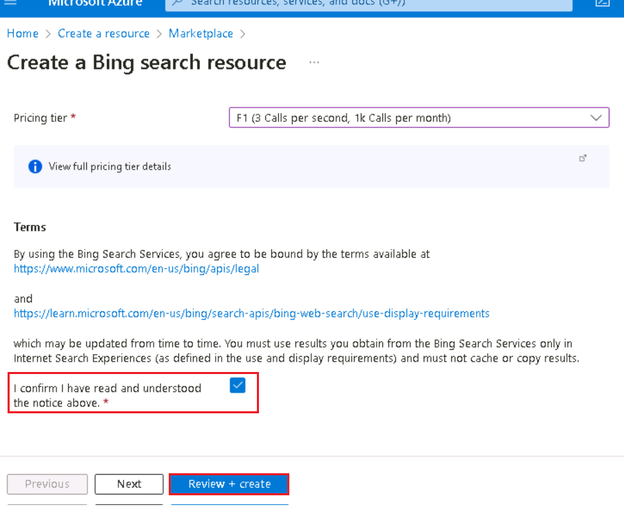
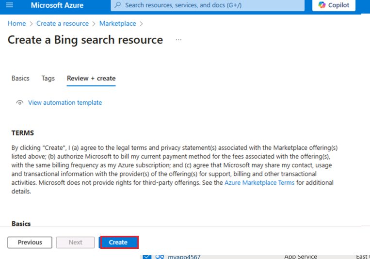
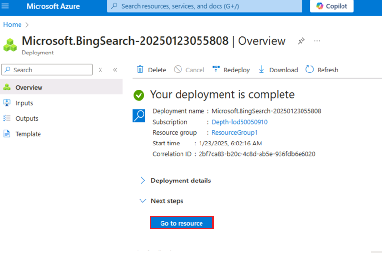
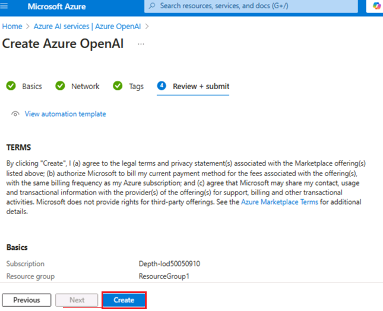
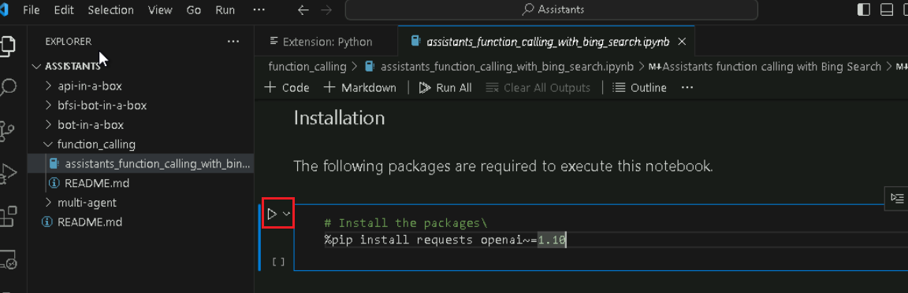
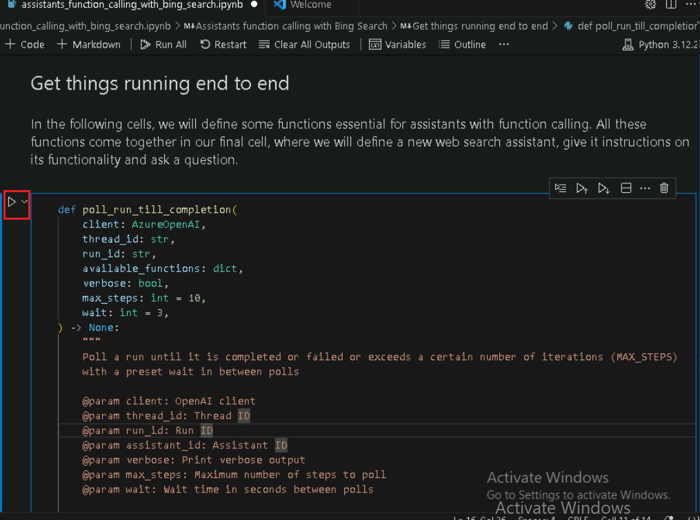
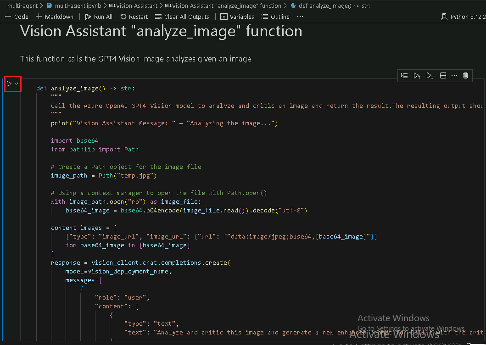
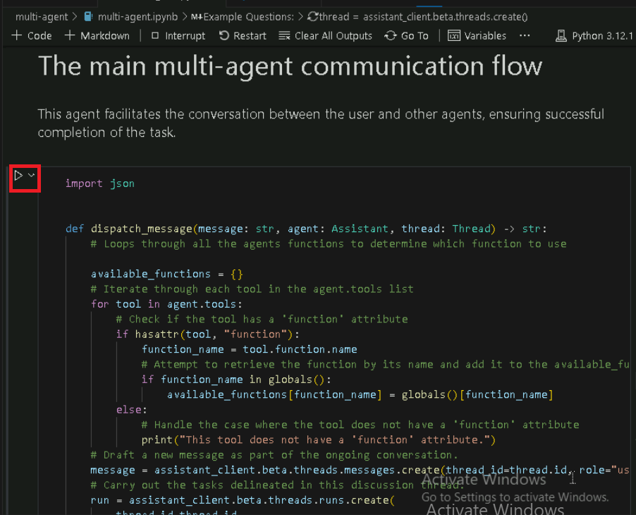

# **介绍**

Azure OpenAI
助手（预览版）允许你通过自定义说明创建根据你的需求量身定制的 AI
助手，并通过代码解释器和自定义函数等高级工具进行增强。

此实验室重点介绍如何设置和利用 Azure OpenAI
服务以及必应搜索集成来构建复杂的 AI 助手和多代理框架。您将部署 AI
模型，探索助手功能，并实现多代理交互以进行复杂的任务处理。

**目的**

- 在 Azure 中创建必应搜索服务资源。

- 部署 Azure OpenAI 资源并对其进行配置。

- 部署特定的 Azure OpenAI 模型，如 GPT-4、GPT-4 Vision 和 DALL-E-3。

- 使用 Azure OpenAI Studio 探索 AI 助手并为其创建原型。

- 使用必应搜索 API 实现函数调用以增强助手功能。

- 使用 Azure Assistant API 构建多模式多代理框架，用于协作 AI 任务。

- 删除已部署的资源和模型。

## **任务 1：创建 Bing 搜索服务资源**

1.  单击 **Portal 菜单**，然后选择 + **Create a resource**

> 

2.  在 **Create a resource** page 搜索栏中，键入 **Bing Search
    v7**，然后单击显示的 **bing search v7**。

3.  单击 **Bing Search v7** 部分。

4.  在 **Create a search service** 页面上，提供以下信息，然后单击
    **Review+create** 按钮。

[TABLE]

5.  验证通过后，单击 **Create** 按钮。

6.  部署完成后，单击 **Go to resource** 按钮。

7.  在 **bingsearchaoaiXX** 窗口中，导航到 **Resource management**
    部分，然后单击 **Keys and Endpoint**。

8.  在 **Keys and Endpoints** 页面中，复制 **KEY1**（您可以使用 KEY1 或
    KEY2）和 **Endpoint**
    并将它们粘贴到记事本中（如图所示），然后**保存**记事本以在即将到来的任务中使用这些信息。

## **任务 2：创建 Azure OpenAI 资源**

1.  在 Azure 门户主页中，单击 **Azure 门户菜单**，该菜单由 Microsoft
    Azure 命令栏左侧的三个水平条表示，如下图所示。

> 

2.  导航并单击 **+ Create a resource**。

> 

3.  在 **Create a resource page（**创建资源页面）的 **Search services
    and marketplace**（搜索服务和市场）搜索栏中，键入**Azure
    OpenAI**，然后按 **Enter** 按钮。

> 

4.  在 “**Marketplace**” 页面中，导航到 **Azure OpenAI** 部分，单击
    “创建” 按钮下拉列表，然后选择 **Azure
    OpenAI**，如图所示。（如果您已经单击 **Azure OpenAI** 磁贴，然后单击
    **Azure OpenAI 页面**上的 “**Create**”按钮）。

> 

[TABLE]

5.  在 **Create Azure OpenAI** 窗口的 **Basics**
    选项卡下，输入以下详细信息，然后单击 **Next** 按钮。

> 

6.  在 **Network** 选项卡中，将所有单选按钮保留为默认状态，然后单击
    **Next** 按钮。

> 

7.  在 **Tags** 选项卡中，将所有字段保留为默认状态，然后单击 **Next**
    按钮。

> 

8.  在 **Review+submit** 选项卡中，验证通过后，单击 **Create** 按钮。

> 

9.  等待部署完成。部署大约需要 **2-3** 分钟。

10. 在 **Microsoft.CognitiveServicesOpenAI** 窗口中，部署完成后，单击
    **Go to resource** （转到资源） 按钮。

> 

11. 单击左侧导航菜单中的 “**Keys and Endpoints**
    ”，然后将记事本中的“终结点”值复制到 **AzureAI
    ENDPOINT**，将“密钥”复制到变量 **AzureAIKey**。

> 

## 任务 3：部署 Azure OpenAI 模型

1.  在 **AzureOpenAI-AssistantsXX** 窗口中，单击左侧导航菜单中的
    “**Overview**” ，单击 “**Explore Azure AI Foundry portal**”
    按钮，在新浏览器中打开 **Azure AI Foundry Studio**

> 

2.  在 **Azure AI Foundary |Azure OpenAI
    服务**窗口中，从左侧导航菜单中选择 **Deployment** （部署）。

> 

12. 在 **Deployments** （部署） 窗口中，下拉 **+Deploy model**
    （部署模型），然后选择 **Deploy base model**（部署基础模型）。

> 

13. 在 **Select a model** 对话框中，导航并仔细选择 **gpt-4**，然后单击
    **Confirm** 按钮。

> 

3.  在 **Deploy model** 对话框中，输入以下详细信息，然后单击 **Create**
    按钮。

- 选择型号： **gpt-4**

- 模型版本：**1106-Preview**

- 部署名称：输入 **gpt-4**

- 选择 **Advanced options** ，然后选择 **Standard** 作为 **Deployment
  type**

> 

4.  在 **Deployments** （部署） 页面中，单击 **+ Create new deployment**
    （创建新部署）。

5.  在 **Deployments** （部署） 窗口中，下拉 **+Deploy model
    （**部署模型），然后选择 **Deploy base model**（部署基础模型）。

> 

14. 在 **Select a model** 对话框中，导航并仔细选择 **gpt-4**，然后单击
    **Confirm** 按钮。

> 

6.  在“**Deploy model** ”对话框中，在“**Select a model**
    ”下，单击下拉列表，选择 **gpt-4** 字段，在“**Model version**
    ”下选择**vision-preview**，然后在“**Deployment name**” 下输入
    +++**gpt-4-vision+++**。点击 **Create** 按钮。

> 
>
> 

7.  在 **Deployments** （部署） 窗口中，下拉 **+Deploy model**
    （部署模型），然后选择 **Deploy base model**（部署基础模型）。

> 

15. 在 **Select a model** 对话框中，导航并仔细选择
    **dall-e-3**，然后单击 **Confirm** 按钮。

> 

8.  在 **Deploy model** 对话框中，在 **Select a model** 下，单击下拉菜单
    选择 **dall-e-3** 字段，在 **Model version** 下 选择 **Auto-update
    to default** ，在 **Deployment name** 下输入 ！！**dall-e-3！!
    。**点击 **Create** 按钮。

> 
>
> 

## 任务 4：探索 Assistant 的 Playground

1.  在 Azure AI Foundry |Azure OpenAI 服务主页的 **Playgrounds**
    部分下，单击 **Assistants playground**。

2.  在 **Assistants playground** 窗格中，选择 **+Create an assistant**。

3.  Assistants playground 允许您探索、原型化和测试 AI
    Assistant，而无需运行任何代码。在此页中，您可以快速迭代和试验新想法。

4.  在 Assistant setup （助手设置） 窗格中，输入以下详细信息

- 助理名称：+++**Math Assist+++**

- 使用说明：输入以下说明 +++**You are an AI assistant that can write
  code to help answer math questions+++**

- 部署：**gpt-4**

- 选择切换**启用code** **interpreter**

> 
>
> 

5.  从 Assistant setup 窗格中，选择**Select assistant**

6.  在 Select an assistant 选项卡中，选择 **Math Assist** 并单击
    **Select** 按钮。

7.  输入一个问题让助手回答：+++**I need to solve the equation 3x + 11
    = 14. Can you help me?** +++

8.  选择 **Run 按钮** 。

> 

虽然我们可以看到答案是正确的，但为了确认模型使用代码解释器来获得这个答案，以及它编写的代码是有效的，而不是仅仅重复模型的训练数据中的答案，我们将问另一个问题。

9.  输入后续问题：+++**Show me the code you ran to get this solution.
    +++** 选择 **“Add and run**”（添加并运行）**按钮** 

您还可以查阅右侧面板中的日志，以确认使用了代码解释器，并验证为生成响应而运行的代码。请务必记住，虽然代码解释器通过将问题转换为代码并在沙盒
Python
环境中运行，使模型能够响应更复杂的数学问题，但您仍然需要验证响应，以确认模型已正确地将您的问题转换为代码中的有效表示形式。

## 任务 5：使用 Bing 搜索调用 Assistants 函数

在此笔记本中，我们将展示如何使用必应搜索 API 和函数调用将 Azure OpenAI
模型基于 Web 数据。这是让模型从 Web 访问最新数据的好方法。

此示例对于开发人员和想要了解函数调用功能和基于搜索的基础的数据科学家非常有用。

1.  在 Windows 搜索框中，键入 Visual Studio，然后单击 **Visual Studio
    Code**。

> 

2.  在 **Visual Studio Code** 编辑器中，单击
    **File**（文件），然后导航并单击 **Open Folder**（打开文件夹）。

> 

3.  从 **C：\LabFiles** 导航并选择 **Assistants** 文件夹，然后单击
    **Select Folder** 按钮。

4.  如果您看到一个对话框 - **Does you trust the authors of the files in
    this folder？，**然后单击 **Yes， I trust the
    author**（是的，我信任作者）。

5.  在 Visual Studio Code
    下拉列表中，在“**function_calling**导航”下的“**ASSISTANTS**”中，然后单击
    **assistants_function_calling_with_bing_search.ipynb** 笔记本。

6.  在 Visual Studio Code 编辑器的主页中，向下滚动到 “**install
    requirements** ”标题并运行第 1
    个单元格。如果系统提示选择环境，请选择 **Python Environments**
    ，如图所示。

7.  如果系统提示选择路径，请选择 **Python version 3.12.2(or later
    version)** 路径，如图所示。

8.  更新参数，将 **Azure OpenAI Endpoint, Azure OpenAI Key**（您在**任务
    2** 的记事本中保存的值）、**必应搜索订阅密钥**替换为您在**任务 1**
    的记事本中保存的值。

9.  定义一个函数来调用 Bing 搜索 API，选择第 3 个、第 4
    个单元格。然后，通过单击**开始图标**执行单元格。

10. 让事情首尾相连，选择第 5 、第 6、第 7、第 8
    个单元格。然后，通过单击**开始图标**执行单元格。

## **任务 6：使用 Azure Assistant API 构建多模式多代理框架**

此存储库将引导你完成使用 Azure OpenAI Assistant API
创建多代理系统的模式。

此笔记本中提供的示例有助于演示如何使用 Azure Assistant API
构建多代理框架，并为希望利用协同工作的多个 AI
代理的功能的开发人员提供全面指南。本文的关键是展示代理如何沟通和协作以处理复杂的任务，例如根据用户输入通过多次迭代生成和增强图像。这对于有兴趣探索生成式
AI 和多智能体系统前沿的开发人员和技术爱好者尤其重要。

在开始之前，应该对 AI 有基本的了解，并对代理如何协同工作以增强 AI
功能感兴趣。本文没有深入研究深入的编程;但是，对 API 的运行方式以及 AI
在自动化系统中的作用的一般了解将有助于掌握所提出的概念。此示例邀请希望试验高级
AI 系统并可能将其集成到各种行业解决方案中的创新者和开发人员。

1.  在 Visual Studio Code 中，在 **multi-agent** 下，导航并单击**. env**
    文件。

2.  在 **.env** 文件中，将 **Azure OpenAI Endpoint, Azure OpenAI
    Key**（您在**任务 2** 的记事本中保存的值）**、gpt4 部署名称、DALLE3
    部署名称和 GPT 4 Vision 部署名称**替换为您在**任务 3**
    的记事本中保存的值。

3.  点击 **File** ，然后点击 **Save**。

4.  在 Visual Studio Code 中，在 **multi-agent** 下，导航并单击
    **multi-agent.ipynb** 笔记本。

> 

5.  在 Visual Studio Code 编辑器的主页中，向下滚动到 “**install
    requirements**” 标题并运行第 1
    个单元格。如果系统提示选择环境，请选择 **Python Environments**
    ，如图所示。

6.  如果系统提示选择路径，请选择 **Python version 3.12.2(or later
    version)** 路径，如图所示。

> 

7.  选择第 2 个单元格。然后，通过单击**开始图标**执行单元格。

8.  使用 Dalle-3 模型的提示生成图像。输出是存储在 users 本地目录中的
    .jpg 文件。选择第 3 个单元格。然后，通过单击**开始图标**执行单元格。

9.  使用上述定义初始化代理。选择第 4
    个单元格。然后，通过单击**开始图标**执行单元格。

10. 图像生成器函数在给定提示符的情况下调用 Dalle-3 图像生成器。选择第 5
    个单元格。然后，通过单击**开始图标**执行单元格。

11. Vision Assistant
    代理负责分析图像。输出是图像创建者代理要使用的新提示。选择第 6
    个单元格。然后，通过单击**开始图标**执行单元格。

12. 使用上述定义初始化代理。选择第 7
    个单元格。然后，通过单击**开始图标**执行单元格。

13. Vision Assistant 函数调用 GPT4 Vision
    图像分析给定的图像，通过单击**开始图标**执行单元格。

14. 该代理促进了用户与其他代理之间的对话，确保成功完成任务，通过单击**开始图标**执行单元格。

15. 使用上述定义初始化代理，单击**开始图标**执行单元格。

16. 此函数调用 Assistant API 以生成 agents_threads
    中列出的代理之间的通信主线程，通过单击**开始图标**来执行单元格。

17. 此代理有助于用户与其他代理之间的对话，确保成功完成任务。通过单击**开始图标**执行单元格。

18. 示例问题，输入 +++生成船在水中漂流的图像并对其进行分析并增强图像
    +++。通过单击**开始图标**执行单元格。

## 任务 7：删除资源

1.  若要删除存储帐户，请导航到 **Azure 门户主**页，单击 “**Resource
    groups**”。

> 

2.  单击资源组。

> 

3.  在 **Resource group** 主页中，选择资源，然后单击 delete

4.  在右侧显示的 **Delete Resources** 窗格中，导航到 **Enter “Delete” to
    confirm deletion**字段，然后单击 **Delete** 按钮。

5.  在 **Delete confirmation** 对话框中，单击 **Delete** 按钮。

> 

6.  单击铃铛图标，您将看到通知 ––**Deleted resource group AOAI-RG89。**

**总结**

此实验室提供了使用 Azure OpenAI 和必应搜索集成的高级 AI
功能的动手探索。您已开始设置基本的 Azure 资源并部署 GPT-4 和 DALL-E-3 等
AI 模型。然后，你已使用 Azure OpenAI Studio
创建和测试能够处理复杂任务（如数学问题解决和图像生成）的 AI
助手。您已集成 Bing 搜索来获取实时数据，以便为 AI
响应奠定基础。此外，您还学习了构建多代理框架，展示了不同的 AI
代理如何协作以提高任务性能。到最后，您已经获得了部署、测试和优化 AI
驱动型解决方案的实践经验，这些经验为您在各种实际应用程序中利用这些技术做好了准备。
