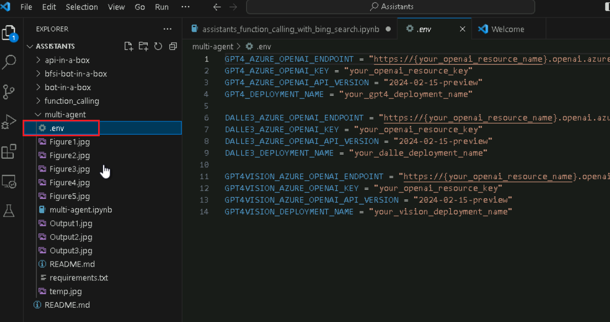
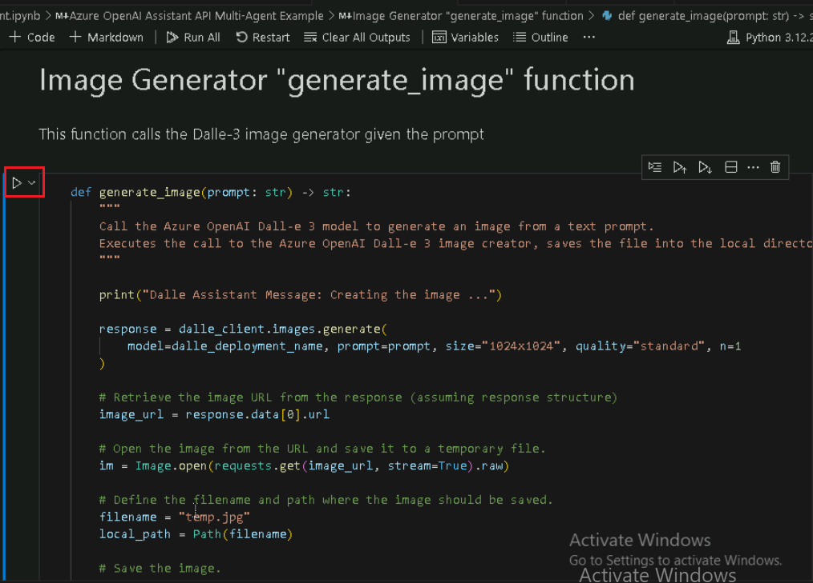
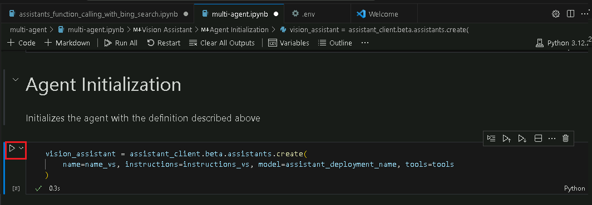
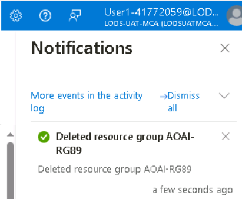

# **Introduction**

Les assistants Azure OpenAI (préversion) vous permettent de créer des
assistants d'IA adaptés à vos besoins par le biais d'instructions
personnalisées, complétées par des outils avancés tels que
l'interpréteur de code et les fonctions personnalisées.

Ce laboratoire se concentre sur la configuration et l'utilisation des
services Azure OpenAI parallèlement à l'intégration de Bing Search pour
créer des assistants d'IA sophistiqués et des frameworks multi-agents.
Vous déploierez des modèles d'IA, explorerez les fonctionnalités de
l'assistant et mettrez en œuvre des interactions multi-agents pour le
traitement de tâches complexes.

**Objectif**

- Pour créer une ressource du service de recherche Bing dans Azure.

- Déployer des ressources Azure OpenAI et les configurer.

- Déployer des modèles Azure OpenAI spécifiques tels que GPT-4, GPT-4
  Vision et DALL-E-3.

- Explorer et prototyper des assistants IA à l'aide d'Azure OpenAI
  Studio.

- Implémenter l'appel de fonction avec les API Recherche Bing pour
  améliorer les fonctionnalités de l'assistant.

- Créer une infrastructure multimodale multi-agents à l'aide de l'API
  Assistant Azure pour les tâches d'IA collaboratives.

- Pour supprimer les ressources et les modèles déployés.

## **Tâche 1 : Créer une ressource du service de recherche Bing**

1.  Cliquez sur le **Portal Menu** puis sélectionnez **+ Create a
    resource.**

> 

2.  Dans la barre de recherche de la page **Create a resource** , tapez
    **Bing Search v7** et cliquez sur la **bing search v7** qui
    s'affiche.

3.  Cliquez sur la section **Bing Search v7** .

4.  Sur la page **Create a search service**, fournissez les informations
    suivantes et cliquez sur le bouton **Review + create**

[TABLE]

5.  Une fois la Validation réussie, cliquez sur le bouton **Create** .

6.  Une fois le déploiement terminé, cliquez sur le bouton **Go to
    resource**.

7.  Dans la window **bingsearchaoaiXX**, accédez à la section **Resource
    management**, puis cliquez sur **Keys and Endpoint**

8.  Dans la page **Keys and Endpoints**, copiez **KEY1** (*vous pouvez
    utiliser KEY1 ou KEY2)* et **Endpoint** et collez-les dans un
    bloc-notes (comme illustré dans l'image), puis **Save** le
    bloc-notes pour utiliser les informations dans les tâches à venir.

## **Tâche 2 : Créer une ressource Azure OpenAI**

1.  À partir de la page d'accueil du portail Azure, cliquez sur le
    **Azure portal menu** représenté par trois barres horizontales sur
    le côté gauche de la barre de commandes Microsoft Azure, comme
    illustré dans l'image ci-dessous.

> 

2.  Naviguez et cliquez sur **+ Create a resource**

> 

3.  Dans la page **Create a resource**, dans la barre de recherche,
    recherchez **Service and marketplace** tapez **Azure OpenAI,** puis
    appuyez sur le bouton **Enter**.

> 

4.  Sur la page **Marketplace**, accédez à la section **Azure OpenAI**,
    cliquez sur la liste déroulante du bouton Créer, puis sélectionnez
    **Azure OpenAI** comme indiqué dans l'image. (Au cas où vous auriez
    déjà cliqué sur l'icône **Azure OpenAI**, puis cliquez sur le bouton
    **Create** sur la page **Azure OpenAI**).

> 

[TABLE]

5.  Dans la window **Create Azure OpenAI**, sous l'onglet **Basics**,
    entrez les détails suivants et cliquez sur le bouton **Next**

> 

6.  Dans l'onglet **Network**, laissez toutes les cases d'option dans
    l'état par défaut et cliquez sur le bouton **Next**.

> 

7.  Dans l' onglet **Tags**, laissez tous les champs dans l'état par
    défaut et cliquez sur le bouton **Next**

> 

8.  Dans l' onglet **Review + submit**, une fois la validation réussie,
    cliquez sur le bouton **Create**.

> 

9.  Attendez la fin du déploiement. Le déploiement prendra environ **2 à
    3** minutes.

10. Dans la window **Microsoft.CognitiveServicesOpenAI**, une fois le
    déploiement terminé, cliquez sur le bouton **Go to resource**.

> 

11. Cliquez sur **Keys and Endpoints** dans le menu de navigation de
    gauche, puis copiez la valeur du point de terminaison dans un
    bloc-notes dans **AzureAI ENDPOINT** et la clé dans une variable
    **AzureAIKey**.

> 

## Tâche 3 : Déploiement d'un modèle Azure OpenAI

1.  Dans la window **AzureOpenAI-AssistantsXX**, cliquez sur **Vue
    d'ensemble** dans le menu de navigation de gauche, cliquez sur le
    **bouton Explorer le portail Azure AI Foundry** pour ouvrir **Azure
    AI Foundry Studio** dans un nouveau navigateur

> 

2.  Dans l’**Azure AI Foundary | Azure OpenAI Service** , sélectionnez
    **Deployment** dans le menu de navigation de gauche**.**

> 

3.  Dans la window **Deployments**, déroulez le **+Deploy model** et
    sélectionnez **Deploy base model.**

> 

4.  Dans la boîte de dialogue **Select a model**, naviguez et
    sélectionnez soigneusement **gpt-4**, puis cliquez sur le bouton
    **Confirm.**

> 

5.  Dans la boîte de dialogue **Deploy model dialog**, entrez les
    détails suivants et cliquez sur le bouton **Create**.

- Sélectionner le modèle : **gpt-4**

- Version du modèle** : 1106-Preview**

- Nom du déploiement : entrez **gpt-4**

- Sélectionnez l’ **Advanced options**, puis **Standard** comme
  **Deployment type.**

> 

6.  Sur la page **Deployment**, cliquez sur +**Create new deployment**

7.  Dans la window **Deployments**, déroulez le **+ Deploy model** et
    sélectionnez **Deploy base model**

> 

8.  Dans la boîte de dialogue **Select a model**, naviguez et
    sélectionnez soigneusement **gpt-4**, puis cliquez sur le bouton
    **Confirm.**

> 

9.  Dans la boîte de dialogue **Deploy model** **,** sous **Select a
    model** , cliquez sur le menu déroulant et sélectionnez le champ
    gpt-4**, sous Model version** sélectionnez **vision-preview** et
    sous **Deployment name** , saisissez **+++gpt-4-vision+++.** Cliquez
    sur le bouton **Create**.

> 
>
> 

10. Dans la window **Deployment** , déroulez le **+Deploy model** et
    sélectionnez **Deploy base model**

> 

11. Dans la boîte de dialogue **Select a model** , naviguez et
    sélectionnez soigneusement **dall-e-3**, puis cliquez sur le bouton
    **Confirm.**

> 

12. Dans la boîte de dialogue **Deploy model** , sous **Select a
    model,** cliquez sur le menu déroulant sélectionnez le champ
    **dall-e-3**, sous **Model version,** sélectionnez **Auto-update to
    default** et sous **Deployment name** , entrez !! **dall-e-3**
    !!**.** Cliquez sur le bouton **Create**.

> 
>
> 

## Tâche 4 : Explorer l'aire de jeux de l'Assistant

1.  Dans Azure AI Foundry |Page d'accueil du service Azure OpenAI, sous
    la section **Playgrounds**, cliquez sur l’**Assistants playground**.

2.  Dans le volet **Assistants playground**, sélectionnez **+Create an
    assistant**

3.  L’Assistants playground vous permet d'explorer, de prototyper et de
    tester des assistants IA sans avoir besoin d'exécuter de code. À
    partir de cette page, vous pouvez rapidement itérer et expérimenter
    de nouvelles idées.

4.  Dans le volet de configuration de l'Assistant, entrez les détails
    ci-dessous

- Assistant name: **+++Math Assist+++**

- Instructions : Entrez les instructions suivantes +++**You are an AI
  assistant that can write code to help answer math questions+++**

- Deployment: **gpt-4**

- Sélectionnez l'activation **d’enabling code interprter**

> 
>
> 

5.  Dans le volet de configuration de l'assistant, sélectionnez
    **Select** **assistant**

6.  Dans l'onglet Select un assistant, sélectionnez **Math Assist** et
    cliquez sur le bouton **Select.**

7.  Entrez une question à laquelle l'assistant doit répondre : +++**I
    need to solve the equation 3x + 11 = 14. Can you help me?**+++

8.  Sélectionnez le bouton **Run**.

> 

Bien que nous puissions voir que la réponse est correcte, pour confirmer
que le modèle a utilisé l'interpréteur de code pour obtenir cette
réponse et que le code qu'il a écrit est valide plutôt que de simplement
répéter une réponse à partir des données d'entraînement du modèle, nous
poserons une autre question.

9.  Entrez la question suivante : +++**Show me the code you ran to get
    this solution .+++** Sélectionnez le bouton **Add and run button**

Vous pouvez également consulter les journaux dans le panneau de droite
pour confirmer que l'interpréteur de code a été utilisé et pour valider
le code qui a si l'interpréteur de code donne au modèle la possibilité
de répondre à des questions mathématiques plus complexes en
convertissant les questions en code et en les exécutant dans un
environnement Python en bac à sable, vous devez toujours valider la
réponse pour confirmer que le modèle a correctement traduit votre
question en une représentation valide dans le code.

## Tâche 5 : Appel de fonction de l'assistant avec Recherche Bing

Dans ce notebook, nous allons montrer comment vous pouvez utiliser les
API Recherche Bing et les appels de fonction pour ancrer des modèles
Azure OpenAI sur des données provenant du web. C'est un excellent moyen
de donner au modèle l'accès à des données à jour provenant du Web.

Cet exemple sera utile aux développeurs et aux scientifiques des données
qui souhaitent en savoir plus sur les capacités d'appel de fonction et
la mise à la terre basée sur la recherche.

1.  Dans votre zone de recherche windows, tapez Visual Studio, puis
    cliquez sur **Visual Studio Code**.

> 

2.  Dans l'éditeur **Visual Studio Code**, cliquez sur **File**, puis
    naviguez et cliquez sur **Open Folder**.

> 

3.  Naviguez et sélectionnez le dossier **Assistants** dans
    **C :\LabFiles** et cliquez sur le bouton **Select Folder**.

4.  Si vous voyez une boîte de dialogue - **Do you trust the authors of
    the files in this folder?**, puis cliquez sur **Yes, I trust the
    author**.

5.  Dans Visual Studio Code, déroulant les **ASSISTANTS**, sous
    **function_calling** naviguez et cliquez sur
    **assistants_function_calling_with_bing_search.ipynb** notebook.

6.  Dans la page principale de l'éditeur Visual Studio Code, faites
    défiler vers le bas jusqu'à **l'**en-tête des **install
    requirements** et exécutez la 1ère cellule. Si vous êtes invité à
    sélectionner l'environnement, sélectionnez **Python Environments**
    comme indiqué dans l'image.

7.  Si vous êtes invité à sélectionner le chemin d'accès, sélectionnez
    le chemin d'accès de **Python version 3.12.2** de Python **(or later
    version)** comme indiqué dans l'image.

8.  Mettez à jour les paramètres, remplacez **Azure OpenAI Endpoint,
    Azure OpenAI Key (**les valeurs que vous avez enregistrées dans
    votre bloc-notes dans la **Task 2), Bing search subscription key**
    avec les valeurs que vous avez enregistrées dans votre bloc-notes
    dans la **Task 1.**

9.  Définissez une fonction pour appeler les API Recherche Bing,
    sélectionnez 3e, 4e cellule. Ensuite, exécutez la cellule en
    cliquant sur le **start icon**

10. Faites fonctionner les choses de bout en bout, sélectionnez les
    5ème, 6ème, 7ème, 8ème cellules. Ensuite, exécutez la cellule en
    cliquant sur le **start icon**

## **Tâche 6 : Création d'un cadre multimodal multi-agent avec l'API Assistant Azure**

Ce référentiel vous guidera tout au long du modèle de création d'un
système multi-agents à l'aide de l'API Azure OpenAI Assistant.

L'exemple fourni dans ce notebook permet de démontrer comment créer une
infrastructure multi-agents avec l'API Assistant Azure et sert de guide
complet pour les développeurs qui cherchent à exploiter les capacités de
plusieurs agents d'IA travaillant de concert. L'essentiel de l'article
est de montrer comment les agents peuvent communiquer et collaborer pour
traiter des tâches complexes, telles que la génération et l'amélioration
d'images par le biais de plusieurs itérations basées sur les entrées de
l'utilisateur. Ceci est particulièrement pertinent pour les développeurs
et les passionnés de technologie qui souhaitent explorer les frontières
de l'IA générative et des systèmes multi-agents.

Avant de commencer, il faut avoir une compréhension de base de l'IA et
s'intéresser à la façon dont les agents peuvent travailler ensemble pour
améliorer les fonctionnalités de l'IA. L'article ne se penche pas sur la
programmation en profondeur ; cependant, une connaissance générale du
fonctionnement des API et du rôle de l'IA dans les systèmes automatisés
serait bénéfique pour saisir les concepts présentés. Cet exemple est une
invitation aux innovateurs et aux développeurs qui souhaitent
expérimenter des systèmes d'IA avancés et potentiellement les intégrer
dans diverses solutions industrielles.

1.  Dans Visual Studio Code, sous **multi-agent**, naviguez et cliquez
    sur le fichier **.env**.

2.  Dans le fichier **.env**, remplacez **Azure OpenAI Endpoint, Azure
    OpenAI Key (**valeurs que vous avez enregistrées dans votre
    bloc-notes dans la **Task 2), gpt4 deployment name, DALLE3
    deployment name and GPT 4 Vision deployment name** par les valeurs
    que vous avez enregistrées dans votre bloc-notes dans la **Task 3**.

3.  Cliquez sur **File** et cliquez sur **Save**.

4.  Dans Visual Studio Code, sous **multi-agent**, naviguez et cliquez
    sur **multi-agent.ipynb** notebook.

> 

5.  Dans la page principale de l'éditeur Visual Studio Code, faites
    défiler vers le bas jusqu'à **l'**en-tête des **install
    requirements** et exécutez la 1ère cellule. Si vous êtes invité à
    sélectionner l'environnement, sélectionnez **Python Environments**
    comme indiqué dans l'image.

6.  Si vous êtes invité à sélectionner le chemin d'accès, sélectionnez
    le chemin d'accès de **Python version 3.12.2 (or later version)**
    comme indiqué dans l'image.

> 

7.  Sélectionnez la 2e cellule. Ensuite, exécutez la cellule en cliquant
    sur **start icon** .

8.  Pour générer des images à l'aide d'une invite vers le modèle
    Dalle-3. La sortie est un fichier .jpg stocké dans le répertoire
    local de l'utilisateur. Sélectionnez la 3e cellule. Ensuite,
    exécutez la cellule en cliquant sur le **start icon** .

9.  Initialise l'agent avec la définition décrite ci-dessus.
    Sélectionnez la 4e cellule. Ensuite, exécutez la cellule en cliquant
    sur le **start icon** .

10. La fonction de générateur d'images appelle le générateur d'images
    Dalle-3 à partir de l'invite. Sélectionnez la 5e cellule. Ensuite,
    exécutez la cellule en cliquant sur le **start icon** .

11. L'agent Vision Assistant est responsable de l'analyse des images. La
    sortie est une nouvelle invite à utiliser par l'agent de création
    d'images. Sélectionnez la 6e cellule. Ensuite, exécutez la cellule
    en cliquant sur le **start icon**.

12. Initialise l'agent avec la définition décrite ci-dessus.
    Sélectionnez la 7e cellule. Ensuite, exécutez la cellule en cliquant
    sur **start icon** .

13. La fonction d'assistant de vision appelle l'image GPT4 Vision
    analyse une image donnée, exécute la cellule en cliquant sur **start
    icon**.

14. Cet agent facilite la conversation entre l'utilisateur et les autres
    agents, assurant la bonne réalisation de la tâche, exécutez la
    cellule en cliquant sur le **start icon**

15. Initialise l'agent avec la définition décrite ci-dessus, exécutez la
    cellule en cliquant sur le **start icon**

16. Cette fonction fait appel à l'API Assistant pour générer un fil
    principal de communication entre les agents listés dans le
    agents_threads, exécutez la cellule en cliquant sur le **start
    icon**.

17. Cet agent facilite la conversation entre l'utilisateur et les autres
    agents, garantissant ainsi la réussite de la tâche. Exécutez la
    cellule en cliquant sur le **start icon**

18. Exemples de questions, entrez le +++Générez une image d'un bateau
    dérivant dans l'eau et analysez-la et améliorez l'image+++. Exécutez
    la cellule en cliquant sur le **start icon**.

## Tâche 7 : Supprimer les ressources

1.  Pour supprimer le compte de stockage, accédez à la page **Azure
    portal Home**, puis cliquez sur **Resource groups**

> 

2.  Cliquez sur le resource group.

> 

3.  Sur la page d'accueil du **Resource group**, sélectionnez les
    ressources et cliquez sur l'icône

4.  Dans le volet **Delete Resources** qui s'affiche sur le côté droit,
    accédez à **Enter « Delete» to confirm deletion**, puis cliquez sur
    le bouton **Delete**.

5.  Dans la boîte de dialogue de **Delete confirmation** , cliquez sur
    **le** bouton **Delete**.

> 

6.  Cliquez sur l'icône en forme de cloche, vous verrez la notification
    – **Deleted resource group AOAI-RG89.**

**Résumé**

Ce laboratoire a fourni une exploration pratique des fonctionnalités
d'IA avancées à l'aide d'Azure OpenAI et de l'intégration de Bing
Search. Vous avez commencé par configurer les ressources Azure
essentielles et déployer des modèles d'IA tels que GPT-4 et DALL-E-3.
Ensuite, vous avez utilisé Azure OpenAI Studio pour créer et tester des
assistants d'IA capables de gérer des tâches complexes telles que la
résolution de problèmes mathématiques et la génération d'images. Vous
avez intégré Bing Search pour récupérer des données en temps réel afin
de fonder les réponses de l'IA. De plus, vous avez appris à créer un
cadre multi-agents, montrant comment différents agents d'IA peuvent
collaborer pour améliorer les performances des tâches. À la fin, vous
avez acquis une expérience pratique dans le déploiement, le test et
l'optimisation de solutions basées sur l'IA qui vous ont préparé à
exploiter ces technologies dans diverses applications du monde réel.
