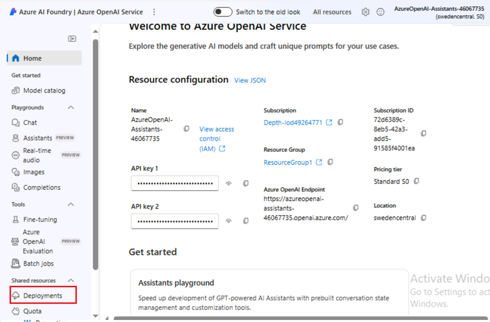

# **紹介**

Azure OpenAI アシスタント (プレビュー)
を使用すると、カスタム命令を通じてニーズに合わせた AI
アシスタントを作成し、コード、インタープリター、カスタム関数などの高度なツールによって拡張できます。

このラボでは、Azure OpenAI サービスの設定と利用、および Bing Search
の統合に重点を置いて、高度な AI
アシスタントとマルチエージェントフレームワークを構築します。AI
モデルをデプロイし、アシスタント機能を探索し、複雑なタスク処理のためのマルチエージェントインタラクションを実装します。

**目的**

- Azure で Bing Search Service リソースを作成する。

- Azure OpenAI リソースをデプロイして構成します。

- GPT-4、GPT-4 Vision、DALL-E-3 などの特定の Azure OpenAI
  モデルをデプロイするため。

- Azure OpenAI Studio を使用して AI
  アシスタントを探索し、プロトタイプを作成します。

- アシスタント機能を強化するために、Bing Search API
  を使用して関数呼び出しを実装する。

- Azure Assistant API を使用して、コラボレーション AI
  タスク用のマルチモーダル
  マルチエージェントフレームワークを構築します。

- デプロイされたリソースとモデルを削除します。

## **タスク 1: Bing Search Service リソースを作成する**

1.  ポータルメニュー**をクリックし**、**+ Create a
    resourceを選択します**

> 

2.  \[**Create a resource**\] ページの検索バーに「**Bing Search
    v7**」と入力し、表示された **Bing Search v7 をクリックします**。

3.  Bing Search v7**セクション**をクリックします。

4.  \[**Create a search service**\]
    ページで、次の情報を入力し、\[**Review+create**\]
    ボタンをクリックします。

[TABLE]

5.  検証に合格したら、\[**Create\]**ボタンをクリックします。

6.  デプロイが完了したら、\[ **Go to resource** \]
    ボタンをクリックします。

7.  **bingsearchaoaiXX** ウィンドウで、\[**Resource management**\]
    セクションに移動し、\[**Keys and Endpoint\] をクリックします**。

8.  \[Keys and
    Endpoint\]ページで、KEY1(KEY1またはKEY2のいずれかを使用できます)とエンドポイントをコピーしてメモ帳に貼り付け(図を参照)、
    メモ帳を保存して、今後のタスクで情報を使用します。

## **タスク 2: Azure OpenAI リソースを作成する**

1.  Azure ポータルのホーム ページで、 **次の図に示すように、Microsoft
    Azure コマンド バーの左側にある 3 本の水平バーで表される** Azure
    ポータル メニューをクリックします。

> 

2.  移動して \[**+ Create a resource\] をクリックします**。

> 

3.  \[ **Create a resource**\] ページの
    **\[検索サービスとマーケットプレース** \] 検索バーに「 **Azure
    OpenAI**」と入力し、 **Enter** キーを押します。

> 

4.  \[Marketplace**\]** ページで、\[**Azure
    OpenAI**\]セクションに移動し、\[Create\]ボタンのドロップダウンをクリックして、図に示すように**\[Azure
    OpenAI**\]を選択します。(すでにクリックしている場合は、 **Azure
    OpenAI** タイルをクリックし、**Azure OpenAI ページの** \[**Create\]
    ボタンをクリックします**。

> 

[TABLE]

5.  \[**Azure OpenAI の作成**\] ウィンドウの \[**Basics**\]
    タブで、次の詳細を入力し、\[**Next\]** ボタンをクリックします。

> 

6.  \[**Network\]**
    タブで、すべてのラジオボタンをデフォルトの状態のままにして、\[**Next\]**ボタンをクリックします。

> 

7.  **\[Tags\]**
    タブで、すべてのフィールドをデフォルトの状態のままにして、\[**Next\]**
    ボタンをクリックします。

> 

8.  **「Review+submit**」タブで、懸賞が合格したら「**Create」**ボタンをクリックします。

> 

9.  デプロイが完了するまで待ちます。デプロイには約 **2 -3**
    分かかります。

10. **Microsoft.CognitiveServicesOpenAI**
    ウィンドウで、デプロイが完了したら、\[**Go to resource\]**
    ボタンをクリックします。

> 

11. 左側のナビゲーション メニューから \[**Keys and Endpoints\]
    をクリックし** 、メモ帳のエンドポイント値を **AzureAI
    エンドポイント**にコピーし、キーを変数 **AzureAIKey
    にコピーします**。

> 

## タスク 3: Azure OpenAI モデルのデプロイ

1.  **AzureOpenAI-AssistantsXX** ウィンドウで、 **左側のナビゲーション
    メニューの** \[**Overview**\] をクリックし、\[**Explore Azure AI
    Foundry portal\] ボタンをクリックして**、新しいブラウザーで **Azure
    AI Foundry Studio** を開きます

> 

2.  **Azure AI Foundary | Azure OpenAI
    Service**ウィンドウで、**左側のナビゲーション メニューから
    \[Deployment**\] を選択します**。**

> 

12. \[**Deployment\]** ウィンドウで、 **\[+ Deploy model\]
    モデルを**ドロップダウンし、 \[**Deploy base model\]
    を選択します。**

> 

13. \[**Select a model**\] ダイアログ ボックスで、gpt-4
    をナビゲートして慎重に選択し、\[**Confirm\]**
    ボタンをクリックします。

> 

3.  \[**Deploy model\]
    ダイアログボックス**で、次の詳細を入力し、\[**Create\]**
    ボタンをクリックします。

- モデルを選択: **gpt-4**

- モデルバージョン**:1106-Preview**

- デプロイメント名: **gpt-4 と入力します。**

- 高度なオプション**を選択し、\[Deployment type\] として**
  \[**Standard\] を選択します**

> 

4.  \[ **Deployments\]** ページで、\[+ **Create new deployment**\]
    をクリックします。

5.  \[**Deployments\]** ウィンドウで、 **\[+ Deploy model\]
    を**ドロップダウンし、 \[**Deploy base model\] を選択します。**

> 

14. \[**Select a model**\] ダイアログ ボックスで、gpt-4
    をナビゲートして慎重に選択し、\[**Confirm\]**
    ボタンをクリックします。

> 

6.  \[**Deploy model**\] ダイアログ ボックスの **\[Select a model**\]
    で、ドロップダウンをクリックし、\[**gpt-4**\]
    フィールドを選択し、\[**Model version\] で vision-preview**
    を選択し、\[デプロイ名 **\]
    に「**+++**gpt-4-vision**+++**」と入力します**。「**Create」**ボタンをクリックします。

> 
>
> 

7.  \[**デプロイメント\]** ウィンドウで、 **\[+ Deploy
    model\]を**ドロップダウンし、 \[**Deploy base model\]
    を選択します。**

> 

15. \[**Select a
    model\]ダイアログボックスで、**dall-e-3**をナビゲートして慎重に選択**し、\[**Confirm\]**ボタンをクリックします。

> 

8.  \[**Deploy model**\] ダイアログボックスの **\[Select a model**\]
    でドロップダウンをクリックし、\[**dall-e-3**\]
    フィールドを選択し、\[**Model version**\] で \[**Auto-update to
    default\]** を選択し、\[Deployment name**\] で** 「!! **-
    dall-e-3**!!**を入力します。**「**Create」**
    ボタンをクリックします。

> 
>
> 

## タスク 4: アシスタントのプレイグラウンドを探索する

1.  Azure AI Foundry |Azure OpenAI Service ホーム ページの
    **\[Playgrounds\]** セクションで、 **Assistants
    playgroundをクリックします**。

2.  **Assistants playground** ウィンドウで、\[**+ Create an assistant\]
    を選択します**。

3.  アシスタント プレイグラウンドでは、コードを実行しなくても AI
    アシスタントを探索、プロトタイプ作成、テストできます。このページから、新しいアイデアをすばやく反復して試すことができます。

4.  アシスタントのセットアップペインから、以下の詳細を入力します

- アシスタントの名前:+++ **Math Assist** +++

- 説明: 次の手順を入力してください+++ **You are an AI assistant that can
  write code to help answer math questions** +++

- デプロイメント: **gpt-4**

- **code interpreter**ーを有効にする**トグルを選択します**

> 
>
> 

5.  \[Assistant\] セットアップ ウィンドウで、\[**Select assistant\]
    を選択します**

6.  「Select an assistant」タブで、「**Math
    Assist**」を選択し、「**Select**」ボタンをクリックします。

7.  アシスタントが答える質問を入力します:+++ **I need to solve the
    equation 3x + 11 = 14. Can you help me?**+++

8.  \[run\] **ボタン**を選択します。

> 

答えが正しいことはわかりますが、モデルがコード
インタープリターを使用してこの答えに到達したこと、およびモデルのトレーニング
データから答えを繰り返すのではなく、記述したコードが有効であることを確認するために、別の質問をします。

9.  次の質問を入力します: +++ **Show me the code you ran to get this
    solution.+++** \[**Add and run button** \] ボタン **を選択します**

また、右側のパネルのログを参照して、コード
インタープリターが使用されたことを確認し、応答を生成するために実行されたコードを検証することもできます。コード
インタープリターは、問題をコードに変換し、サンドボックス化された Python
環境で実行することで、モデルがより複雑な数学の質問に応答する機能を提供しますが、モデルが質問をコード内の有効な表現に正しく変換したことを確認するために、応答を検証する必要があることを覚えておくことが重要です。

## タスク 5: Bing Search で呼び出すアシスタント関数

このノートブックでは、Bing Search API と関数呼び出しを使用して、Web
からのデータに Azure OpenAI
モデルを基置する方法を示します。これは、モデルが Web
から最新のデータにアクセスできるようにするための優れた方法です。

このサンプルは、関数呼び出し機能と検索ベースのグラウンディングについて学習したい開発者やデータ
サイエンティストに役立ちます。

1.  Windowsの検索ボックスに「Visual Studio」と入力し、\[**Visual Studio
    Code\]をクリックします**。

> 

2.  Visual Studio Code**エディターで、\[File\]をクリックし**、\[**Open
    Folder**\]**に移動してクリックします**。

> 

3.  C:\LabFilesから**Assistants**フォルダ**に移動して選択**
    し、\[**Select Folder\]**ボタンをクリックします。

4.  **Do you trust the authors of the files in this folder?**
    ダイアログボックスが表示された場合、**Yes, I trust the
    author**をクリックします。

5.  Visual Studio Code で \[**ASSISTANTS**\]
    をドロップダウンし、\[function_calling\] で
    assistants_function_calling_with_bing_search.ipynb
    **ノートブック**に移動してクリックします。

6.  Visual Studio
    Codeエディターのメインページで、インストール要件の見出しまでスクロールダウンし、最初のセルを実行します。環境を選択するように求められたら、画像に示すようにPython
    **Environments**を選択します。

7.  パスを選択するように求められた場合は、図に示すように**Pythonバージョン3.12.2(またはそれ以降のバージョン)**のパスを選択します。

8.  パラメータを更新し、**Azure OpenAI Endpoint、Azure OpenAI
    Key(**タスク2のメモ帳に保存した値**)、Bing search subscription
    keyを**タスク1**のメモ帳に保存した値に置き換えます。**

9.  Bing Search API を呼び出す関数を定義し、3 番目と 4
    番目のセルを選択します。次に、**開始アイコンをクリックして**セルを実行します。

10. 物事を端から端まで実行し、5番目、6番目、7番目、8番目のセルを選択します。次に、**開始アイコンをクリックして**セルを実行します。

## **タスク 6: Azure Assistant API を使用したマルチモーダルマルチエージェント フレームワークの構築**

このリポジトリでは、Azure OpenAI Assistant API
を使用してマルチエージェント
システムを作成するパターンについて説明します。

このノートブックで提供されている例は、Azure Assistant API
を使用してマルチエージェント
フレームワークを構築する方法を示すのに役立ち、連携して動作する複数の AI
エージェントの機能を活用する開発者向けの包括的なガイドとして機能します。この記事の核心は、エージェントがユーザー入力に基づいて複数のイテレーションを通じて画像を生成したり強化したりするなど、複雑なタスクを処理するために、エージェントがどのようにコミュニケーションを取り、協力できるかを紹介することです。これは、Generative
AIやマルチエージェントシステムのフロンティアを探求することに関心のある開発者や技術愛好家にとって特に重要です。

始める前に、AIの基本的な理解と、エージェントがAI機能を強化するためにどのように連携できるかに関心を持つ必要があります。この記事では、プログラミングの詳細については詳しく説明していません。ただし、APIがどのように動作するか、および自動化システムにおけるAIの役割に関する一般的な知識は、提示された概念を理解するのに役立ちます。この例は、高度な
AI
システムを試し、それらをさまざまな業界ソリューションに統合する可能性のあるイノベーターや開発者への招待です。

1.  Visual Studio Codeのマルチエージェント**で**
    、**ナビゲートして.env**ファイルをクリックします。

2.  .env **ファイル**で**、Azure OpenAI Endpoint、Azure OpenAI
    Key(**タスク 2 のメモ帳に保存した値**)、gpt4 deployment name、DALLE3
    deployment name、GPT 4 Vision deployment nameを**、タスク 3
    **のメモ帳に保存した値に置き換えます**。

3.  \[**File\]をクリックし**、\[**Save\]をクリックします**。

4.  Visual Studio Code の \[multi-agent\] で、multi-agent.ipynb
    ノートブックに移動してクリックします。

> 

5.  Visual Studio Codeエディターのメインページで、**下にinstall
    requirementsまでスクロールし**、1番目のセルを実行します。
    環境を選択するように求められた場合は、 **図に示すように**\[**Python
    Environments**\]を選択します。

6.  パスを選択するように求められた場合は、図に示すように**Pythonバージョン3.12.2(またはそれ以降のバージョン)**のパスを選択します。

> 

7.  2
    番目のセルを選択します。次に、**開始アイコンをクリックして**セルを実行します。

8.  Dalle-3モデルへのプロンプトを使用して画像を生成するため。出力は、ユーザーのローカル
    ディレクトリに格納された.jpgファイルです。3^(番目の)セルを選択します。次に、**開始アイコンをクリックして**セルを実行します。

9.  上記の定義でエージェントを初期化します。 4
    番目のセルを選択します。次に、**開始アイコンをクリックして**セルを実行します。

10. イメージ ジェネレータ関数は、プロンプトを指定して Dalle-3 イメージ
    ジェネレータを呼び出します。5
    番目のセルを選択します。次に、**開始アイコンをクリックして**セルを実行します。

11. Vision Assistant
    エージェントは、画像の分析を担当します。出力は、イメージ作成エージェントが使用する新しいプロンプトです。6
    番目のセルを選択します。次に、**開始アイコンをクリックして**セルを実行します。

12. 上記の定義でエージェントを初期化します。7
    番目のセルを選択します。次に、**開始アイコンをクリックして**セルを実行します。

13. ビジョンアシスタント機能は、GPT4のビジョン画像が与えられた画像を解析し、**スタートアイコンをクリックして**セルを実行します。

14. このエージェントは、ユーザーと他のエージェントとの間の会話を促進し、タスクが正常に完了することを確認し、開始アイコンをクリックして**セルを実行します**。

15. 上記の定義でエージェントを初期化し、スタートアイコンをクリックして**セルを実行します**。

16. この機能は、Assistant
    APIを呼び出して、agents_threadsにリストされているエージェント間の通信のメインスレッドを生成し、開始アイコンをクリックして**セルを実行します**。

17. このエージェントは、ユーザーと他のエージェントとの間の会話を促進し、タスクが正常に完了するようにします。開始アイコンをクリックして**セルを実行します**。

18. 質問の例、+++ Generate an image of a boat drifting in the water and
    analyze it and enhance the image
    +++を入力する。開始アイコンをクリックして**セルを実行します**。

## タスク 7: リソースの削除

1.  ストレージ アカウントを削除するには、**Azure portal
    のホーム**ページに移動し、 \[**Resource groups\]
    をクリックします**。

> 

2.  リソースグループをクリックします。

> 

3.  **Resource groupの**
    ホームページで、リソースを選択し、deleteをクリックします。

4.  右側に表示される\[Delete
    Resources\]ペインで、\[Delete\]と入力して削除フィールドを確認し、\[Delete\]ボタンをクリックします。

5.  **Delete confirmation**ダイアログボックスで、\[
    **Delete**\]ボタンをクリックします。

> 

6.  ベルのアイコンをクリックすると、通知 –**Deleted resource group
    AOAI-RG89** が表示されます**。**

**概要**

このラボでは、Azure OpenAI と Bing Search の統合を使用して、高度な AI
機能を実際に探索しました。まず、重要な Azure リソースを設定し、GPT-4 や
DALL-E-3 などの AI モデルをデプロイしました。次に、Azure OpenAI Studio
を使用して、数学的な問題解決や画像生成などの複雑なタスクを処理できる AI
アシスタントを作成およびテストしました。Bing Search を統合して、AI
の応答を根拠付けるためのリアルタイムデータをフェッチしました。さらに、マルチエージェントフレームワークの構築方法を学び、さまざまな
AI
エージェントが協力してタスクのパフォーマンスを向上させる方法を紹介しました。最終的には、AI
主導のソリューションをデプロイ、テスト、最適化する実践的な経験を積み、これらのテクノロジをさまざまな実世界のアプリケーションで活用する準備が整いました。
