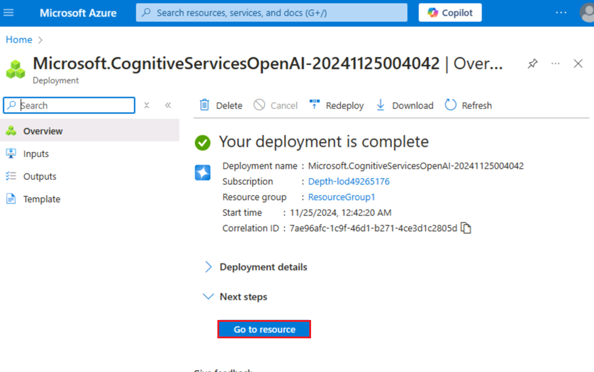
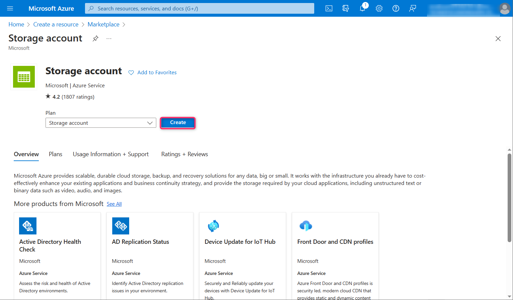
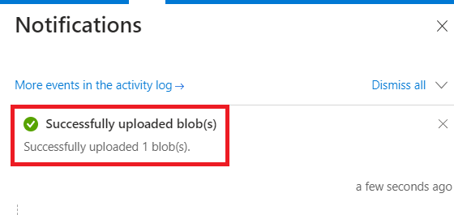
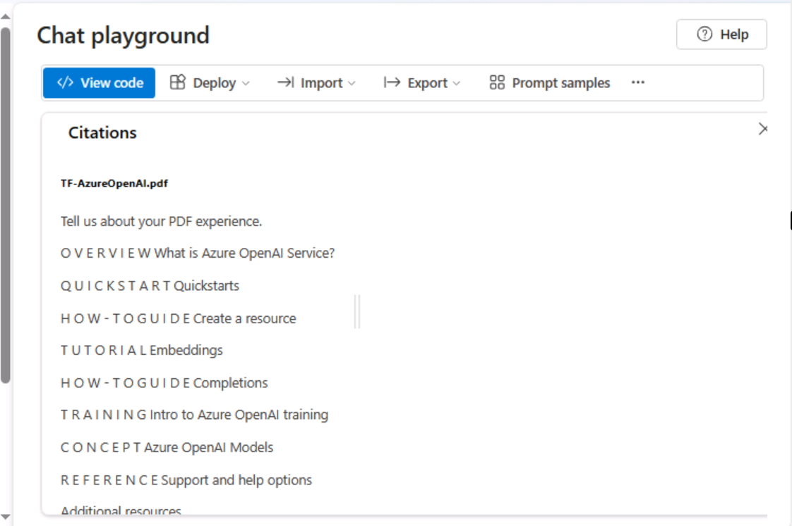
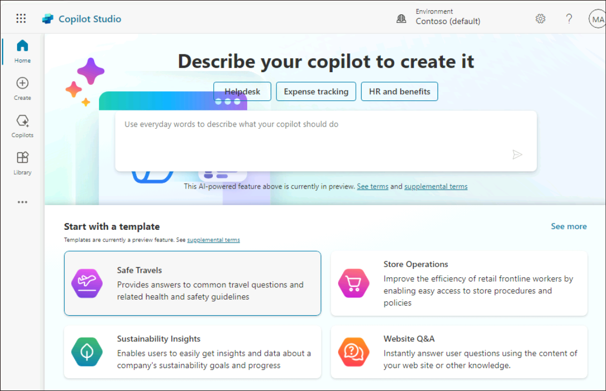
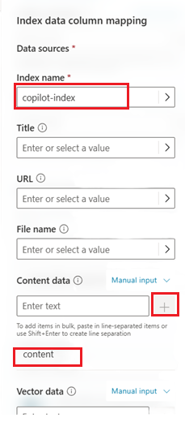

# 用例 10 - 使用 Azure OpenAI 服务创建具有自定义数据的 Web 应用程序和 Power Virtual 代理机器人

**介绍：**

数据上的 Azure OpenAI 可与 OpenAI 强大的 ChatGPT （gpt-35-turbo） 和
GPT-4 语言模型配合使用，使它们能够根据数据提供响应。您可以使用 REST API
或 Azure OpenAI Studio 中基于 Web 的界面访问数据上的 Azure
OpenAI，以创建连接到数据的解决方案，从而实现增强的聊天体验。

Azure OpenAI
在数据上的主要功能之一是它能够以增强模型输出的方式检索和利用数据。针对数据的
Azure OpenAI 与 Azure
认知搜索一起，根据用户输入和提供的对话历史记录确定要从指定数据源检索的数据。然后，这些数据被扩充并作为提示重新提交到
OpenAI
模型，检索到的信息将附加到原始提示中。尽管检索到的数据被附加到提示中，但生成的输入仍由模型处理，就像任何其他提示一样。检索到数据并将提示提交到模型后，模型将使用此信息提供完成。

**目标**

- 在 Azure 门户中创建存储帐户、容器和 Azure 认知搜索服务。

- 在 Azure AI Studio 中部署 gpt-3-turbo 和嵌入式模型，并在 Chat
  Playground 中添加数据。

- 通过在聊天会话中发送查询来测试 Google 助理 Playground 中的设置。

- 启动 Copilot 并开始与机器人对话

- 启动新应用程序并开始与 Copilot 应用程序对话。

- 删除 gpt-3-turbo 和嵌入式模型、Azure 存储帐户、认知搜索服务和新的 Web
  应用。

## 练习 1 - 使用门户创建 Azure 存储帐户和 Azure 认知搜索

### 任务 1：创建 Azure OpenAI 资源

1.  打开浏览器，导航到地址栏，然后键入或粘贴以下
    URL：+++<https://portal.azure.com/+++>，然后按 **Enter** 按钮。

2.  在 **Microsoft Azure** 窗口中，使用**用户凭证**登录 Azure。

3.  然后，输入密码并单击 **Sign in** 按钮 。

4.  在**Stay signed in?** 窗口中，单击 **Yes** 按钮。

5.  在 Azure 门户主页中，单击 **Azure 门户菜单**，该菜单由 Microsoft
    Azure 命令栏左侧的三个水平条表示，如下图所示。

6.  导航并单击 **+ Create a resource**。

7.  在 **Create a resource** page（创建资源页面）的 **Search services
    and marketplace**（搜索服务和市场）搜索栏中，键入 **Azure
    OpenAI**，然后按 **Enter** 按钮。

8.  在“**Marketplace** ”页面中，导航到 **Azure OpenAI**
    部分，单击“创建”按钮下拉列表，然后选择 **Azure
    OpenAI**，如图所示。（如果您已经单击 **Azure OpenAI** 磁贴，然后单击
    **Azure OpenAI 页面**上的“**Create**”按钮）。

9.  在 **Create Azure OpenAI** 窗口的 **Basics**
    选项卡下，输入以下详细信息，然后单击 **Next** 按钮。

[TABLE]

> 

10. 在 **Network** 选项卡中，将所有单选按钮保留为默认状态，然后单击
    **Next** 按钮。

11. 在 **Tags** 选项卡中，将所有字段保留为默认状态，然后单击 **Next**
    按钮。

12. 在 **Review+submit** 选项卡中，验证通过后，单击 **Create** 按钮。

13. 等待部署完成。部署大约需要 2-3 分钟。

14. 在 **Microsoft.CognitiveServicesOpenAI** 窗口中，部署完成后，单击
    **Go to resource** （转到资源） 按钮。

### 任务 2：使用门户创建 Azure 存储帐户

1.  登录 +++<https://portal.azure.com/+++>

2.  单击 **Portal 菜单**，然后选择 **+ Create a resource**

3.  在 **Create a resource** window （创建资源窗口） 搜索框中，键入
    **Storage account** （存储帐户），然后单击**storage account**。

4.  在 **Marketplace** 页面中，单击 **Storage account** 部分。

5.  在 **Storage account** （存储帐户） 窗口中，单击 **Create** （创建）
    按钮。

6.  在 **Create a storage account** （创建存储帐户） 窗口的 **Basics**
    （基本信息） 选项卡下，输入以下详细信息以创建存储帐户，然后单击
    **Review** （查看）

[TABLE]

> 

7.  在 **Review** 选项卡上，单击 **Create** 按钮。

8.  这个新的 Azure 存储帐户现已设置为托管 Azure 数据湖的数据。单击 **Go
    to resource** 按钮。

9.  部署帐户后，您将在 Overview （概述） 页面中找到与 Azure Data Lake
    相关的选项。在左侧导航窗格中，导航到 **Data storage** 部分，然后单击
    **Containers**。

10. 在 **azureopenaistorageXX |Containers** 页面上，单击
    **+Container**。

11. 在右侧显示的 New container 窗格中，输入容器**名称**
    +++**source**+++，然后单击 **Create** 按钮。

12. 在 **azureopenaistorageXX |Containers** 页面，选择**source**
    容器\*\*。\*\*

13. 在**source** 容器页面上，单击 **Upload** 按钮。

14. 在 **Upload blob** 窗格中，单击 **Browse for file**，导航到
    **C：\Labfiles** 位置并选择 **TF-AzureOpenAI.pdf，**然后单击
    **Open** 按钮。

\

15. 在 **Upload blob** 窗格中，单击 **Upload** 按钮。

16. 你将看到一条通知 – 上传成功时，**Successfully uploaded blob** 。

### 任务 3：在门户中创建 AzureAI 搜索服务

1.  在 **azureopenaistorageXX | Containers** 页上，单击“**Home** ”返回到
    Azure 门户主页。

2.  在 Azure 门户主页中，单击“**+ Create Resource**”。

3.  在 **Create a resource** page（创建资源页面）搜索栏中，键入 **Azure
    AI Search**，然后单击显示的 **azure ai search**。

4.  单击 **azure ai search** 部分。

5.  在 **Azure AI Search** 页面中，单击“**Create**”按钮。

6.  \

7.  在 **Create a search service** 页面上，提供以下信息，然后单击
    **Review+create** 按钮。

[TABLE]

> 
>
> 

8.  验证通过后，单击 **Create** 按钮。

9.  部署完成后，单击 **Go to resource** 按钮。

10. 在 **mysearchserviceXX** Overview 页面中。在左侧导航窗格中的
    **Settings** （设置） 部分下，选择 **Semantic ranker**
    （语义排名器）。

11. 在 **Semantic ranker** 选项卡上，选择 **Standard** tile
    （标准磁贴），然后单击 **Select plan** （选择计划）。

12. 你将看到一条通知-**Successfully updated semantic ranker to free
    plan**

## 练习 2：使用 Azure OpenAI Studio 添加数据

### 任务 1：在 Azure AI Studio 中部署 gpt-35-turbo 和嵌入式模型

1.  切换回 Azure 门户并搜索 Azure OpenAI 并选择它。

2.  选择您的 **Azure OpenAI** 服务 。

3.  在 **AzureOpenAI**
    窗口中，单击左侧导航菜单中的“**Overview**”，然后单击“**Explore Azure
    AI Foundry portal** ”按钮，在新浏览器中访问 **Azure AI Foundry
    portal**

4.  在 **Azure AI Foundry |Azure OpenAI Studio**
    主页：从左侧导航菜单中选择 **Deployment** 。

> 

5.  在 **Deployments** （部署） 窗口中，下拉 **+Deploy model**
    （部署模型），然后选择 **Deploy base model**（部署基础模型）。

6.  在 **Select a model** 对话框中，导航并仔细选择 **gpt-4**，然后单击
    **Confirm** 按钮。

> 

7.  在 **Deploy model** 对话框中，输入以下详细信息，然后单击 **Create**
    按钮。

    - 选择型号： **gpt-35-turbo**

    - 部署名称：输入 **gpt-35-turbo**

    - 选择 **Standard** 作为 **Deployment type**

> 
>
> 
>
> 

8.  在 **Deployments** （部署） 窗口中，下拉 **+Deploy model**
    （部署模型），然后选择 **Deploy base model**（部署基础模型）。

> 

9.  在 **Select a model** 对话框中，导航并仔细选择
    **text-embedding-ada-002**，然后单击 **Confirm** 按钮。

10. 在 **Deploy model** （部署模型） 对话框的 **Deployment name**
    （部署名称） 下，输入

+++text-embedding-ada-002+++，选择 **Standard** 作为 **Deployment
type**，然后单击 **Deploy** 按钮。

11. 在 **Azure AI Foundry |Azure OpenAI Service** 主页的 **Playgrounds**
    部分下，单击 **Chat**。

12. 在 **Chat playground** 窗格中，下拉 **Add your data** 并选择 **+Add
    a data source**

### 任务 2：使用 Azure OpenAI Studio 添加数据

1.  在 **Select or add data source** 页面中，单击 **Select or add data
    source** 下的下拉列表，然后导航并单击 **Azure Blob Storage**。

2.  在 **Select or add data source** （选择或添加数据源） 页面的
    **Select or add data source** （选择或添加数据源）
    下，输入以下详细信息，然后选择 **Next** （下一步）。

[TABLE]

3.  选中复选框 – **Add vector search to this search resource**。

4.  选择嵌入模型作为 **text-embedding-ada-002**，然后单击 **Next**
    按钮。

***注意：**如果您遇到错误 – **Can't manage CORS on this
resource**.**请选择另一个存储资源**，然后同步 VM 时间，如任务 \#1
中所述。*

5.  在 **Add data** 页面的 **Data management** 选项卡下拉 Search type
    并选择 **Hybrid+semantic**。

6.  选择 **chunk size** 为 **1024（默认）**然后，单击**Next**。

7.  在 **Data connection** 窗格中，选择 **API key** 并单击 **Next**
    按钮。

8.  在 **Review and Finish** 窗格中，查看您输入的详细信息，然后单击
    **Save and close** 按钮。

9.  数据将添加到您的 Chat Playground 中。这大约需要 4-5 分钟。

### 任务 3：在 Chat Playground 中探索文本完成

1.  在 **Chat session** （聊天会话） 部分中，在 **User message**
    （用户消息） 文本框中输入以下提示，然后单击 **Send** 图标

> CodeCopy
>
> What is Azure OpenAI Service?

2.  在 **Chat session** 部分，选择 references
    链接，并观察页面右侧搜索文档的详细信息。

## 练习 3：使用自定义数据部署 Web 应用程序

### 任务 1：部署 Web 应用程序

1.  在 **Azure AI Foundry |Azure OpenAI Service** 主页 ，**Chat
    playground pane**，下拉**Deploy**，然后导航并单击**as web app**。

2.  在 **Deploy to a web app** window 上，选择 **Create a new web app**
    单选按钮，然后输入以下详细信息：

[TABLE]

3.  选中 **Enable chat history in the web app**的复选框

4.  单击 **Deploy** 按钮。

注意 ： 部署需要 5-10 分钟

5.  要检查部署状态，请单击 **Deployments** 并选择 **App deployment**。

6.  等待部署完成。部署大约需要 **10-15** 分钟。

7.  单击 Web 应用程序。

8.  等待 10 分钟，以便可以在应用程序上成功应用身份验证配置。

9.  10 分钟后，单击 **Refresh** 按钮。

10. 在 **Permissions requested** 对话框中，单击 **Accept** 按钮

11. 现在，Web 应用程序将在新浏览器中打开。

12. 在 **Azure AI** Web 应用程序页面中，输入以下文本，然后单击 **Submit
    图标**，如下图所示。

**CodeCopy**

How do I get access to Azure OpenAI?

 

13. 同样，将以下文本粘贴到文本框中，然后单击 **Send** 图标。

**CodeCopy**

**+++What is the expiry date of GPT-35-Turbo version 0301 and GPT-4
version 0314?+++**

14. 刷新 Web 应用程序页面，然后单击 **Show chat
    history**（显示聊天记录）。

15. 在聊天记录下，单击**Accessing Azure OpenAI**。

## 练习 4：使用自定义数据创建 Copilot 应用程序

### 任务 1：使用自定义数据创建聊天机器人

1.  在 **Azure AI Foundry |Azure AI Studio Chat playground** 中，在 Add
    your data （添加数据） 中选择 Remove data source （删除数据源）。

2.  在 **Chat playground** 窗格中，下拉 **Add your data** 并选择 **+Add
    a data source**

3.  在 **Add data** （添加数据） 页面的 **Select or add data source**
    （选择或添加数据源） 下，输入以下详细信息，然后选择 **Next**
    （下一步）。

[TABLE]

> 
>
> ***注意：**如果您遇到错误 **– Can't manage CORS on this
> resource.请选择另一个存储资源，**然后同步 VM 时间，如任务 \#1
> 中所述。*

4.  在 **Add data** 页面的 **Data management** 选项卡，下拉 搜索类型
    并选择 **Keyword**，选择块大小为 **1024（默认）** 然后，单击
    **Next**。

5.  在 **Data connection** 窗格中，选择 **API key** 并单击 **Next**
    按钮。

6.  在 **Review and Finish** （查看并完成）
    窗格中，查看您输入的详细信息，然后单击 **Save and close**
    （保存并关闭） 按钮。

 

7.  数据将添加到您的 Chat Playground 中。这大约需要 4-5 分钟。

### 任务 2：使用来自 Azure OpenAI 的自定义数据创建 Copilot

1.  使用 Azure **登录凭据登录到**
    +++<https://copilotstudio.microsoft.com/>+++。

2.  登录后，在“欢迎使用 Microsoft Copilot
    Studio”页面中，选择您所在的国家/地区，然后单击“**Start free
    trial**”。

3.  Copilot 主页随即打开。

> 

4.  从左侧窗格中选择 **Agents**。然后点击 **+ New agent**。

> 

5.  选择 **Skip to configure**。

6.  在“创建副驾驶”页面上，输入**名称** +++**CopilotforAOAI**+++
    ，然后单击“**Create**”。

7.  单击**Topics -\> System -\> Conversational boosting**。

> 

8.  单击 **Create generative answers** （创建生成式答案） 节点的 **Data
    sources** （数据源） 下的 **Edit**（编辑）。在打开的 **Properties**
    （属性） 窗格中选择 **Classic data** （经典数据）。 

> 

9.  在**数据上的 Azure OpenAI 服务下**，单击**Connection properties** 

> 

10. 这将添加 Azure OpenAI 服务连接并打开连接属性窗格。

11. 在 **Connection Properties** （连接属性） 窗格中的 **General -\>
    Configuration** （常规 - 配置） 下，填写以下详细信息

> Deployment – +++gpt-4 +++
>
> Api 版本 – 选择最新版本
>
> 

12. 在 **Model data** 选项卡下，单击 Data sources 下的 **+
    Add**，然后添加以下详细信息。

索引名称 - +++copilot-index+++

内容数据– +++content+++

13. 点击 **Save**。

**任务 3：测试你的 Copilot**

1.  单击“Test ”以打开“测试您的 Copilot”窗格。

2.  输入 +++什么是 Azure OpenAI？+++，然后单击**Send**。

3.  你将收到来自 **Azure OpenAI
    资源**中上传的数据的响应。此外，请注意回复下方的 **Surfaced with
    Azure OpenAI** 消息。

**任务 4：删除资源**

1.  若要删除存储帐户，请导航到 Azure 门户主页，在 Azure
    门户搜索栏中键入“**Resource
    groups**”，导航并单击“**Services**”下的“**Resource groups**”。

2.  单击分配的资源组。

3.  仔细选择您创建的所有资源。

4.  在 Resource group （资源组） 页面中，导航到命令栏，然后单击
    **Delete** （删除）。

**重要提示：**请勿单击 **Delete resource
group。**如果您在命令栏中没有看到 **Delete** 选项，请单击水平省略号。

5.  在右侧显示的 **Delete Resources** 窗格中，输入 **delete** 并单击
    **Delete** 按钮。

6.  在 **Delete confirmation** 对话框中，单击 **Delete** 按钮。

7.  单击铃铛图标，您将看到通知 – **Executed delete command on 4 selected
    items。**

**总结**

你已在 Azure 门户中创建存储帐户、容器和 Azure 认知服务，然后在 Azure AI
Studio 中部署了 gpt-3-turbo 模型。您已经在 Chat Playground
中添加了数据，并通过在聊天会话中发送查询来测试 Assistant
设置。然后，您启动了一个新应用程序并开始与聊天机器人对话。你已删除
gpt-3-turbo 模型、Azure 存储帐户、认知搜索服务和新的 Web
应用，以有效且高效地管理 Azure OpenAI 资源。
