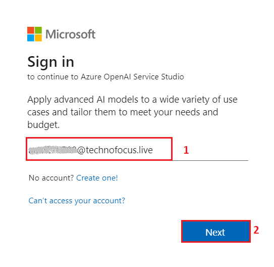
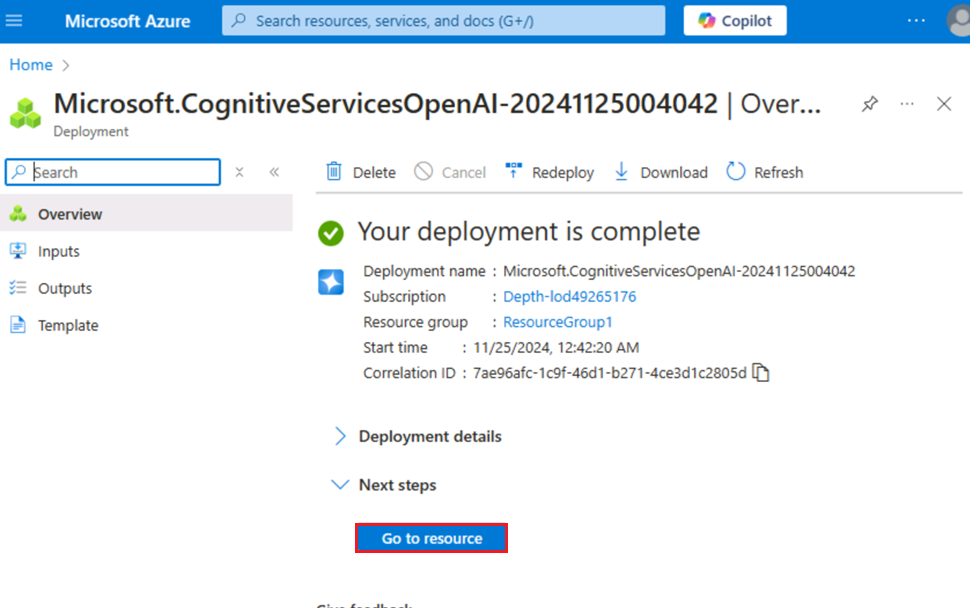
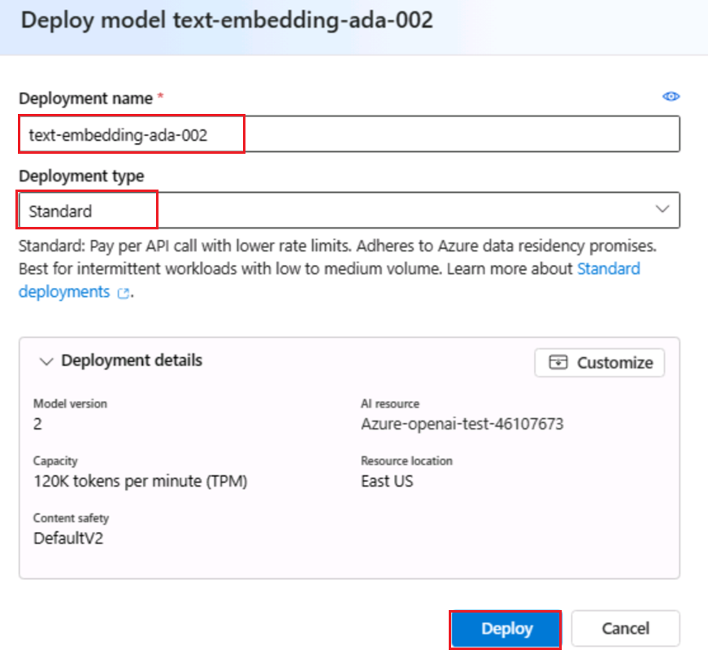
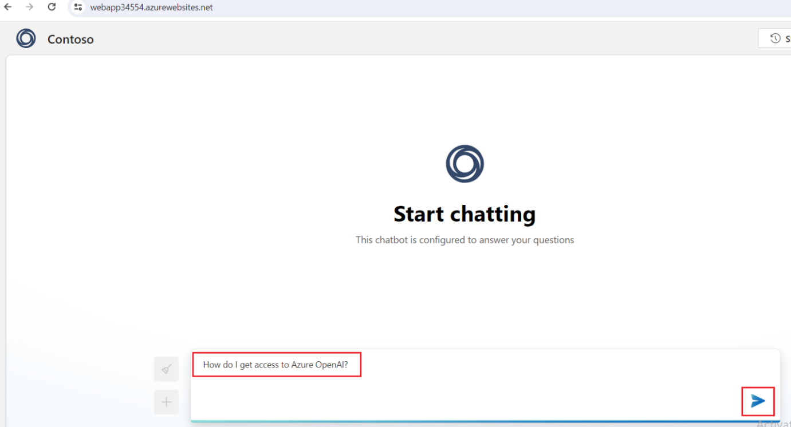
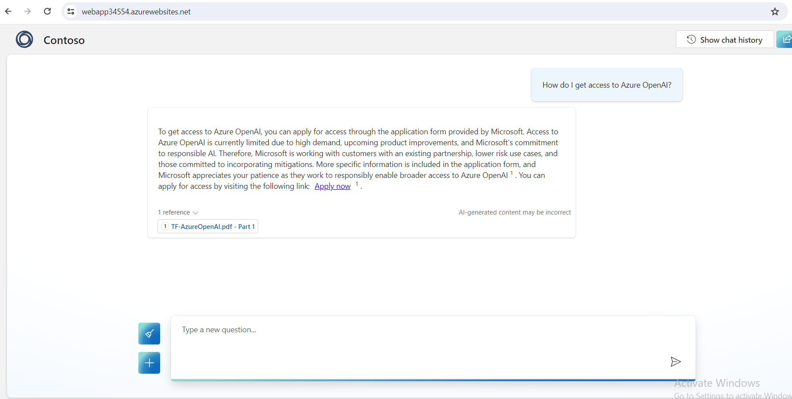
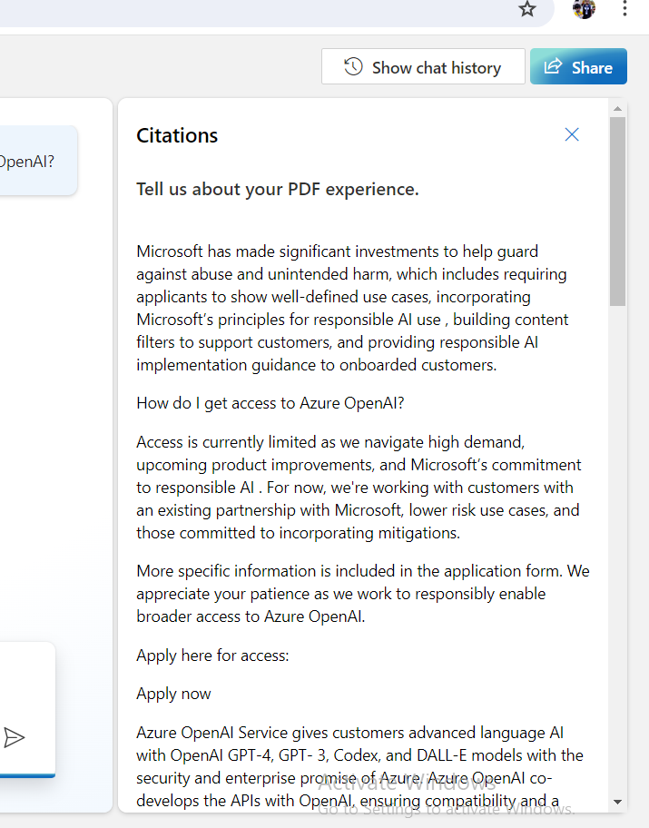

# Cas d'utilisation 10 - Création d'une application web et alimentation d'un bot d'agent virtuel avec des données personnalisées à l'aide d'Azure OpenAI Service

**Introduction:**

Azure OpenAI sur vos données fonctionne avec les puissants modèles de
langage ChatGPT (gpt-35-turbo) et GPT-4 d'OpenAI, ce qui leur permet de
fournir des réponses basées sur vos données. Vous pouvez accéder à Azure
OpenAI sur vos données à l'aide d'une API REST ou de l'interface web
dans Azure OpenAI Studio pour créer une solution qui se connecte à vos
données afin d'activer une expérience de conversation améliorée.

L'une des principales caractéristiques d'Azure OpenAI sur vos données
est sa capacité à récupérer et à utiliser les données d'une manière qui
améliore le rendement du modèle. Azure OpenAI sur vos données, en
collaboration avec Recherche cognitive Azure, détermine les données à
récupérer à partir de la source de données désignée en fonction de
l'entrée de l'utilisateur et de l'historique des conversations fourni.
Ces données sont ensuite augmentées et soumises à nouveau en tant
qu'invite au modèle OpenAI, les informations récupérées étant ajoutées à
l'invite d'origine. Bien que les données récupérées soient ajoutées à
l'invite, l'entrée résultante est toujours traitée par le modèle comme
n'importe quelle autre invite. Une fois que les données ont été
récupérées et que l'invite a été soumise au modèle, celui-ci utilise ces
informations pour fournir une complétion.

**Objectifs**

- Pour créer un compte de stockage, un conteneur et un service de
  recherche cognitive Azure dans le portail Azure.

- Pour déployer gpt-3-turbo et le modèle Embedded dans Azure AI Studio
  et pour ajouter des données dans Chat Playground.

- Pour tester la configuration de l'Assistant dans le terrain de jeu de
  chat en envoyant des requêtes dans la session de chat.

- Pour lancer un copilote et démarrer une conversation avec le bot

- Pour lancer une nouvelle application et démarrer une conversation avec
  l'application copilot.

- Pour supprimer gpt-3-turbo et le modèle incorporé, le compte de
  stockage Azure, le service de recherche cognitive et la nouvelle
  application web.

## Exercice 1 : Créer un compte de stockage Azure et une recherche cognitive Azure à l'aide du portail

### Tâche 1 : Créer une ressource Azure OpenAI

1.  Ouvrez votre navigateur, accédez à la barre d'adresse et tapez ou
    collez l'URL suivante :
    +++[https://portal.azure.com/+++,](https://portal.azure.com/+++)
    puis appuyez sur le bouton **Enter**.

2.  Dans la window **Microsoft Azure**, utilisez les **User
    Credentials** pour vous connecter à Azure.

3.  Ensuite, entrez le mot de passe et cliquez sur le bouton **Sign
    in**.

4.  Dans **Stay signed in ?** , cliquez sur le bouton **Yes**.

5.  À partir de la page d'accueil du portail Azure, cliquez sur le
    **Azure portal menu** représenté par trois barres horizontales sur
    le côté gauche de la barre de commandes Microsoft Azure, comme
    illustré dans l'image ci-dessous.

6.  Naviguez et cliquez sur **+Create a resource**

7.  Dans la page **Create a resource**, dans la barre de recherche,
    recherchez **services and marketplace** tapez **Azure OpenAI,** puis
    appuyez sur le bouton **Enter**.

8.  Sur la page **Marketplace**, accédez à la section **Azure OpenAI**,
    cliquez sur la liste déroulante du bouton Créer, puis sélectionnez
    **Azure OpenAI** comme indiqué dans l'image. (Au cas où vous auriez
    déjà cliqué sur l'icône **Azure OpenAI**, puis cliquez sur le bouton
    **Create** sur la **page Azure OpenAI**).

9.  Dans la window **Create Azure OpenAI**, sous l'onglet **Basics**,
    entrez les détails suivants et cliquez sur le bouton **Next**.

[TABLE]

> 

10. Dans l'onglet **Network**, laissez toutes les cases d'option dans
    l'état par défaut et cliquez sur le bouton **Next**.

11. Dans l'onglet **Tags**, laissez tous les champs dans l'état par
    défaut et cliquez sur le bouton **Next**.

12. Dans l'onglet **Review + submit**, une fois la validation réussie,
    cliquez sur le bouton **Create**.

13. Attendez la fin du déploiement. Le déploiement prendra environ 2 à 3
    minutes.

14. Dans la window **Microsoft.CognitiveServicesOpenAI**, une fois le
    déploiement terminé, cliquez sur le bouton **Go to resource** .

### Tâche 2 : Créer un compte de stockage Azure à l'aide du portail

1.  Connectez-vous à la commande +++<https://portal.azure.com/+++>

2.  Cliquez sur le **Portal Menu**, puis sélectionnez **+ Create a
    resource**

3.  Dans la window **Create a resource** Créer une ressource, tapez
    **Storage account**, puis cliquez sur le **storage account**.

4.  Sur la page **Marketplace**, cliquez sur la section **Storage
    account**.

5.  Dans la window **Storage account**, cliquez sur le bouton
    **Create**.

6.  Dans la window **Create a storage account**, sous l' onglet
    **Basics**, entrez les détails ci-dessous pour créer un compte de
    stockage, puis cliquez sur **Review**

[TABLE]

> 

7.  Dans l'onglet **Review**, cliquez sur le bouton **Create**.

8.  Ce nouveau compte de stockage Azure est maintenant configuré pour
    héberger les données d'un Azure Data Lake. Cliquez sur le bouton
    **Go to resource**

9.  Une fois le compte déployé, vous trouverez des options liées à Azure
    Data Lake dans la page Vue d'ensemble. Dans le volet de navigation
    de gauche, accédez à la section **Data storage**, puis cliquez sur
    **Containers**.

10. On **azureopenaistorageXX | Containers**, cliquez sur
    **+Container.**

11. Dans le volet Nouveau conteneur qui apparaît sur le côté droit,
    entrez le container **Name** comme **+++source+++** et cliquez sur
    le bouton **Create**.

12. On **azureopenaistorageXX |** **Containers**, sélectionnez le
    conteneur **source**\*\*.\*\*

13. Sur la page du conteneur **source**, cliquez sur le bouton
    **Upload**.

14. Dans le volet Charger le **blob Upload**, cliquez sur **Browse for
    file**, accédez à l' emplacement **C :\Labfiles** et sélectionnez
    **TF-AzureOpenAI.pdf**, puis cliquez sur le bouton **Open**.

! \[\](./media/image50.png)

15. Dans le volet **Upload blob**, cliquez sur le bouton **Upload**.

16. Vous verrez une notification – **Successfully uploaded blob**
    lorsque le chargement est réussi.

### Tâche 3 : Créer un service de recherche AzureAI dans le portail

1.  Sur le site **azureopenaistorageXX | Containers**, cliquez sur
    **Home** pour revenir à la page d'accueil du portail Azure.

2.  Dans la page d'accueil du portail Azure, cliquez sur **+ Create
    Resource**

3.  Dans la barre de recherche de la page **Create a resource**, tapez
    **Azure AI** **Search** et cliquez sur la **azure ai search** qui
    apparaît.

4.  Cliquez sur la section de **azure** **ai** **search**.

5.  Dans la page **Azure AI Search**, cliquez sur le bouton **Create**.

6.  ! \[\](./media/image58.png)

7.  Sur la page **Create a search service**, fournissez les informations
    suivantes et cliquez sur le bouton **Review + create**.

[TABLE]

> 
>
> 

8.  Une fois la Validation réussie, cliquez sur le bouton **Create**.

9.  Une fois le déploiement terminé, cliquez sur le bouton **Go to
    resource**.

10. Sur la page d'aperçu de **mysearchserviceXX**. Dans le volet de
    navigation de gauche, sous la section **Settings**, sélectionnez
    **Semantic ranker**.

11. Dans l'onglet **Semantic ranker**, sélectionnez la tuile
    **Standard** et cliquez sur **Select** **plan.**

12. Vous verrez une notification - **Successfully updated semantic
    ranker to free plan**

## Exercice-2 : Ajouter vos données à l'aide d'Azure OpenAI Studio

### Tâche 1 : Déployer gpt-35-turbo et des modèles incorporés dans Azure AI Studio

1.  Revenez au portail Azure, recherchez Azure OpenAI, puis
    sélectionnez-le.

2.  Sélectionnez votre service **Azure OpenAI** .

3.  Dans la window **AzureOpenAI**, cliquez sur **Overview** dans le
    menu de navigation de gauche, puis cliquez sur le bouton **Explore**
    **Azure AI Foundry portal** pour accéder au **Azure AI Foundry
    portal** dans un nouveau navigateur

4.  Sur **Azure** **AI Foundry** |Page d'accueil d'**Azure OpenAI
    Studio**, sélectionnez **Deplyoment** dans le menu de navigation de
    gauche .

> 

5.  Dans la window **Deployment** déroulez le **+ Deploy model** et
    sélectionnez **Deploy base model .**

6.  Dans la boîte de dialogue **Select a model**, naviguez et
    sélectionnez soigneusement **gpt-4**, puis cliquez sur le bouton
    **Confirm.**

> 

7.  Dans la boîte de dialogue **Deploy model dialog**, entrez les
    détails suivants et cliquez sur le bouton **Create**.

    - Select Model : **gpt-35-turbo**

    - Deployment Name : entrez **gpt-35-turbo**

    - Select select the **Standard** as **Deployment type**

> 
>
> 
>
> 

8.  Dans la window **Deployments**, déroulez le **+Deploy model** et
    sélectionnez **Deploy base model.**

> 

9.  Dans la boîte de dialogue **Select a model** , naviguez et
    sélectionnez soigneusement **text-embedding-ada-002,** puis cliquez
    sur le bouton **Confirm.**

10. Dans la boîte de dialogue **Deploy model** , sous **Deployment
    name**, entrez

> +++text-embedding-ada-002+++, sélectionnez **Standard** comme
> **Deployment type** et cliquez sur le bouton **Deploy**.

11. Dans **Azure AI Foundry |** Page d'accueil du **Azure OpenAI
    Service,** sous la section **Playgrounds**, cliquez sur **Chat**.

12. Dans le volet **Chat playground**, déroulez **Add your data**
    sélectionnez **+ Add a data source**

### Tâche 2 : Ajouter vos données à l'aide d'Azure OpenAI Studio

1.  Dans la page **Select or add data source**, cliquez sur la liste
    déroulante sous **Select or add data source**, puis naviguez et
    cliquez sur **Azure Blob Storage**.

2.  Dans la page **Select or add data source**, sous **Select or add
    data source**, entrez les détails suivants, puis sélectionnez
    **Next.**

[TABLE]

3.  Cochez la case – **Add vector search to this search resource**.

4.  Sélectionnez un modèle d'intégration sous la forme
    **text-embedding-ada-002**, puis cliquez sur le bouton **Next.**

***Remarque** : Si vous rencontrez une erreur – **Can‘t manage CORS on
this resource. Please select another storage resource**, puis
synchronisez l'heure de votre machine virtuelle, comme mentionné dans la
tâche \#1.*

5.  Sur la page **Add data**, sous l'onglet **Data management,** dépliez
    le type de recherche et sélectionnez **Hybrid + semantic**

6.  Sélectionnez la **Chunk size** comme **1024 (default)** Ensuite,
    cliquez sur **Next**

7.  Dans le volet **Data connection**, sélectionnez **API key** et
    cliquez sur le bouton **Next**.

8.  Dans le volet **Review and Finish**, vérifiez les détails que vous
    avez saisis, puis cliquez sur le bouton **Save and close**.

9.  Les données seront ajoutées dans votre Chat Playground. Cela prendra
    environ 4 à 5 minutes.

### Tâche 3 : Explorer la saisie automatique de texte dans le Chat Playground

1.  Dans la section **Chat session**, entrez l'invite suivante dans la
    zone de texte **User message** et cliquez sur l' icône **Send**

> CodeCopy
>
> What is Azure OpenAI Service?

2.  Dans la section **Chat session**, sélectionnez le lien des
    références et observez les détails du document de recherche sur le
    côté droit de la page.

## Exercice 3 : Déployer une application web avec des données personnalisées

### Tâche 1 : Déployer une application web

1.  Dans In **Azure** **AI Foundry |** Page d'accueil **d’Azure OpenAI
    Sevice,** volet **Chat playground**, liste déroulante **Deploy**,
    puis naviguez et cliquez sur **as web app**.

2.  Dans la window **Deploy to web app**, sélectionnez la case d'option
    **Create a new web app** et entrez les détails suivants :

[TABLE]

3.  Cochez la case **Enable chat history in the web app**

4.  Cliquez sur le bouton **Deploy**

Remarque : Le déploiement prend 5 à 10 minutes

5.  Pour vérifier l'état du déploiement, cliquez sur **Deployment** et
    sélectionnez **App deployment**.

6.  Attendez la fin du déploiement. Le déploiement prendra environ **10
    à 15** minutes.

7.  Cliquez sur l'application web.

8.  Attendez 10 minutes pour que la configuration de l'authentification
    puisse être appliquée avec succès sur l'application.

9.  Après 10 minutes, cliquez sur le bouton **Refresh**.

10. Dans la boîte de dialogue **Permissions requested**, cliquez sur le
    bouton **Accept**

11. Maintenant, l'application Web s'ouvrira dans un nouveau navigateur.

12. Dans la page de l'application web **Azure AI**, entrez le texte
    suivant et cliquez sur l'**icône Submit** comme illustré dans
    l'image ci-dessous.

**CodeCopy**

How do I get access to Azure OpenAI?

 

13. De même, collez le texte suivant dans la zone de texte et cliquez
    sur l'icône **Send.**

**CodeCopy**

**+++What is the expiry date of GPT-35-Turbo version 0301 and GPT-4
version 0314?+++**

14. Actualisez la page de l'application web et cliquez sur **Show chat
    history**

15. Dans l'historique des conversations, cliquez sur **Accessing Azure
    OpenAI.**

## Exercice 4 : Créer une application Copilot avec des données personnalisées

### Tâche 1 : Créer un chatbot avec des données personnalisées

1.  Dans **Azure AI Foundry | Azure AI Studio Chat playground,** dans
    Ajouter vos données, sélectionnez Supprimer la source de données.

2.  Dans le volet **Chat playground**, déroulez **Add your data** et
    sélectionnez **+ Add a data source**

3.  Sur la page **Add data**, sous **Select or add data source**, entrez
    les détails suivants, puis sélectionnez **Next.**

[TABLE]

> 
>
> ***Remarque** : Si vous rencontrez une erreur – **Can‘t manage CORS on
> this resource. Please select another storage resource**, puis
> synchronisez l'heure de votre machine virtuelle, comme mentionné dans
> la tâche \#1.*

4.  Dans la page **Add data**, dans l'onglet **Data management,**
    dépliez le type de recherche et sélectionnez **Keyword**
    sélectionnez la taille du bloc comme **1024 (default**).Ensuite,
    cliquez sur **Next.**

5.  Dans le volet **Data connection** sélectionnez **API key** et
    cliquez sur le bouton **Next**

6.  Dans le volet **Review and Finish**, vérifiez les détails que vous
    avez saisis, puis cliquez sur le bouton **Save and close**

 

7.  Les données seront ajoutées dans votre Chat Playground. Cela prendra
    environ 4 à 5 minutes.

### Tâche 2 : Créer un copilote avec des données personnalisées à partir d'Azure OpenAI

1.  Connectez-vous à +++<https://copilotstudio.microsoft.com/>+++ à
    l'aide de vos identifiants de connexion Azure.

2.  Une fois connecté, dans la page Welcome to Microsoft Copilot Studio,
    sélectionnez votre pays et cliquez sur **Start free trial**

3.  La page d'accueil de Copilot s'ouvre.

> 

4.  Sélectionnez **Agents** dans le volet gauche. Et puis cliquez sur
    **+ + New agent**

> 

5.  Sélectionnez **Skip to configure**.

6.  Sur la page Create a copilot , entrez le **name** comme
    +++**CopilotforAOAI**+++ et cliquez sur **Create**

7.  Cliquez sur **Topics -\> System -\> Conversational boosting**

> 

8.  Cliquez sur **Edit** sous **Data sources** du nœud **Create
    generative answers.** Sélectionnez **Classic data** dans le volet
    **Properties** qui s'ouvre.

> 

9.  Sous **Azure OpenAI Services on yoiur data**, cliquez sur
    **Connection properties**

> 

10. Cela ajoute la connexion au service Azure OpenAI et ouvre le volet
    des propriétés de la connexion.

11. Dans le volet **Connection properties**, sous **General-\>
    Configuration** renseignez les détails ci-dessous

> Deployment – +++gpt-4 +++
>
> Api version – Select latest version
>
> 

12. Sous l'onglet **Model Data** cliquez sur **+Add** sous Sources de
    données, puis ajoutez les détails ci-dessous.

Index name - +++copilot-index+++

Content data – +++content+++

13. Cliquez sur **Save**

**Tâche 3 : Testez votre copilot**

1.  Cliquez sur **Test** pour ouvrir le volet Test your Copilot.

2.  Tapez +++What is Azure OpenAI?+++ et cliquez sur **Send**

3.  Vous recevrez la réponse des données chargées dans la **Azure OpenAI
    ressource**. Notez également que le message **Surfaced with Azure
    OpenAI** se trouve sous la réponse.

**Tâche 4 : Supprimer des ressources**

1.  Pour supprimer le compte de stockage, accédez à la page d'accueil du
    portail Azure, tapez **Resource groups** dans la barre de recherche
    du portail Azure, naviguez et cliquez sur **Resource groups** sous
    **Services.**

2.  Cliquez sur le resource group attribué.

3.  Sélectionnez soigneusement toutes les ressources que vous avez
    créées.

4.  Dans la page Groupe de ressources, accédez à la barre de commandes
    et cliquez sur **Delete**.

**Important Note**: Ne cliquez pas sur **Delete resource group**. Si
vous ne voyez pas l' option **Delete** dans la barre de commandes,
cliquez sur les points de suspension horizontaux.

5.  Dans le volet **Delete Resources** qui s'affiche sur le côté droit,
    entrez la **delete** et cliquez sur le bouton **Delete**.

6.  Dans la boîte de dialogue **Delete confirmation**, cliquez sur le
    bouton **Delete**.

7.  Cliquez sur l'icône de la cloche, vous verrez la notification -
    Commande d’ **Executed delete command on 4 selected items.**

**Résumé**

Vous avez créé un storage account, container, and Azure cognitive
service dans Azure portal, puis vous avez déployé le modèle gpt-3-turbo
dans Azure AI Studio. Vous avez ajouté des données dans Chat Playground
et testé la configuration de l'Assistant en envoyant des requêtes dans
une session de chat. Ensuite, vous avez lancé une nouvelle application
et entamé une conversation avec le chatbot. Vous avez supprimé le modèle
gpt-3-turbo, le compte de stockage Azure, le service de recherche
cognitive et la nouvelle application web pour gérer efficacement les
ressources Azure OpenAI.
