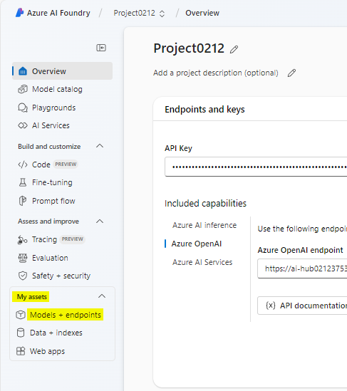
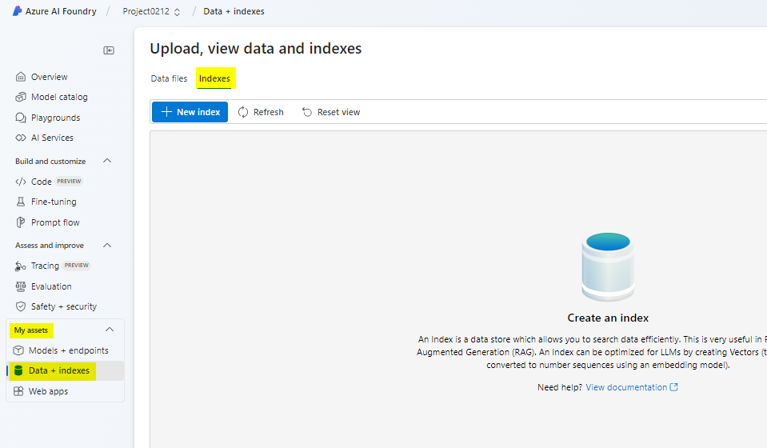
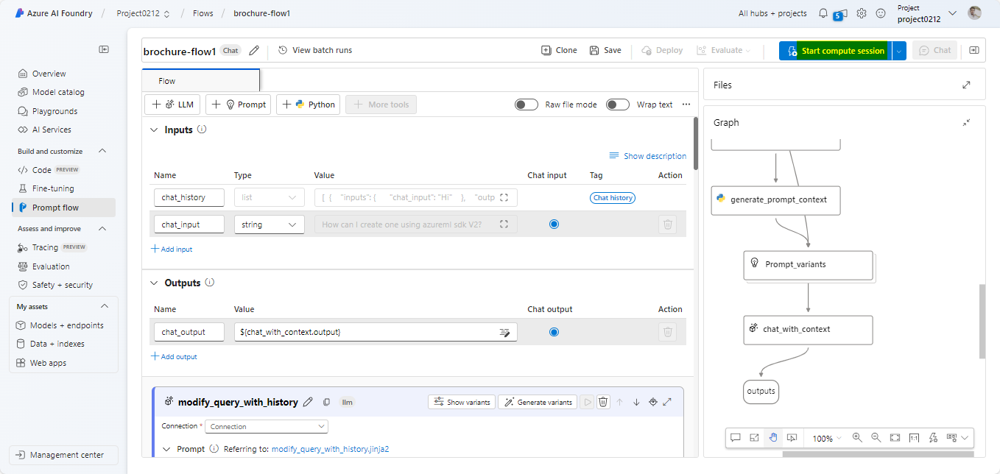
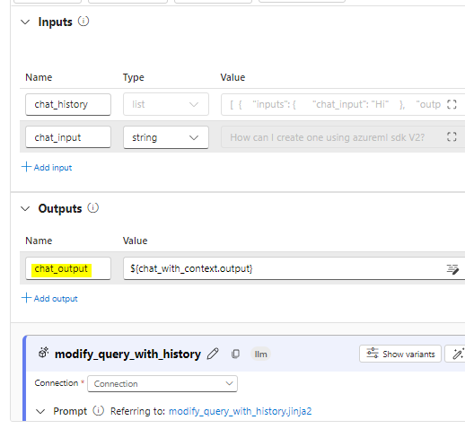

# Cas d'usage 11 : création d'un agent d'IA personnalisé avec Azure AI Foundry et intégration de la recherche

**Temps estimé : 45 min**

## Objectif

L'objectif de ce laboratoire est de guider les participants dans la
création d'un agent alimenté par l'IA à l'aide des services d'IA Azure
et de l'intégration de Search. Les participants apprendront à
configurer, intégrer et tester des composants clés pour créer un agent
fonctionnel capable de récupérer et d'interagir intelligemment avec
l'information, améliorant ainsi l'expérience utilisateur et la
productivité.

## Solution

Ce laboratoire se concentre sur l'intégration des services Azure AI avec
des fonctionnalités de recherche avancées pour créer une solution
robuste et intelligente. Il met l'accent sur la configuration d'un agent
alimenté par l'IA, la récupération transparente des données et la
fourniture de réponses contextuelles. En tirant parti de l'IA et de
l'intégration de la recherche, la solution vise à rationaliser les flux
de travail, à améliorer la prise de décision et à renforcer l'engagement
des utilisateurs grâce à des interactions intuitives et efficaces.

## Tâche 1 : Créer une ressource Azure AI Search

1.  Dans un navigateur web, ouvrez le portail Azure à l'
    <https://portal.azure.com>
    [https://portal.azure.com/](https://portal.azure.com) et
    connectez-vous à l'aide de vos informations d'identification
    d'administrateur Office 365.

> 

2.  Sur la page d'accueil, sélectionnez **+ Create a resource** et
    recherchez **Azure AI Search**. **Create** ensuite une ressource
    Azure AI Search avec les paramètres suivants :

    - **Subscription** : *sélectionnez votre abonnement Azure.*

    - **Resource group**: *Sélectionnez ou créez un groupe de
      ressources, ici nous sélectionnons **RG4OpenAI***

    - **Service name** : *Entrez un nom de service unique, ici nous le
      nommons **copilotXXXX***

    - **Location** : *Faites un choix **random** parmi l'une des régions
      suivantes, ici nous sélectionnons Canada-Est*

      - Australia East

      &nbsp;

      - Canada East

      &nbsp;

      - East US

      &nbsp;

      - East US 2

      &nbsp;

      - France Central

      &nbsp;

      - Japan East

      &nbsp;

      - North Central US

      &nbsp;

      - Sweden Central

      &nbsp;

      - Switzerland

    - **Pricing tier** : Standard

    - Cliquez sur **Review+create,** puis cliquez sur **Create.**

> 
>
> 
>
> 
>
> 
>
> Plus tard, vous allez créer un Azure AI Hub (qui inclut un service
> Azure OpenAI) dans la même région que votre ressource Azure AI Search.
> Les ressources Azure OpenAI sont limitées au niveau du locataire par
> des quotas régionaux. Les régions répertoriées incluent un quota par
> défaut pour le(s) type(s) de modèle utilisé(s) dans cet exercice. Le
> choix aléatoire d'une région réduit le risque qu'une seule région
> atteigne sa limite de quota dans les scénarios où vous partagez un
> locataire avec d'autres utilisateurs. Si une limite de quota est
> atteinte plus tard dans l'exercice, il est possible que vous deviez
> créer un autre hub Azure AI dans une autre région.

3.  Attendez que le déploiement de votre ressource Azure AI Search soit
    terminé.

> 

## Tâche 2 : Créer un projet Azure AI

1.  Dans un navigateur web, ouvrez l’[Azure AI Foundry
    portal](Azure%20AI%20Foundry%20portal)  à l'adresse
    <https://ai.azure.com> et connectez-vous à l'aide de vos
    informations d'identification Azure.

2.  Sur la page d'accueil, sélectionnez **+ Create project**.

> 

3.  Dans l' assistant **Create a project,** saisissez le nom du projet
    **ProjectXXXX** et cliquez sur **Customize**.

> 

4.  Dans **Customize**, connectez-vous à votre ressource Azure AI
    Search, entrez les détails suivants, sélectionnez **Next** et passez
    en revue votre configuration.

    - **Hub name**: ***hubXXXX***

    - **Azure Subscription**: *votre abonnement Azure*

    - **Resource group**: **RG4OpenAI**

    - **Location** : *le même emplacement que votre ressource Azure AI
      Search, **Canada East***

    - **Connect Azure AI Services or Azure OpenAI**: (Nouveau)
      *Remplissage automatique avec le nom du hub sélectionné*

    - **Connect Azure AI Search** : *sélectionnez votre ressource Azure
      AI Search, **copilotXXXX***

> 

5.  Sélectionnez **Next** , puis **Create** et attendez la fin du
    processus.

> 
>
> 
>
> 

## Tâche 3 : Déployer des modèles

Vous avez besoin de deux modèles pour mettre en œuvre votre solution :

- Un *modèle d*'intégration pour vectoriser les données textuelles pour
  une indexation et un traitement efficaces.

- Un modèle capable de générer des réponses en langage naturel à des
  questions basées sur vos données.

1.  Dans le portail Azure AI Foundry, dans votre projet, dans le volet
    de navigation à gauche, sous **My assets**, sélectionnez la page
    **Models + endpoints**.

> 

2.  Sur la **Manage deployments of your models and services page,**
    cliquez sur **+Deploy model** et sélectionnez **Deploy base model.**

> 

3.  Sur la page **Select a model**, recherchez et sélectionnez
    **text-embedding-ada-002** model et cliquez sur **Confirm.**

> 

4.  Dans le volet **Deploy model text-embedding-ada-002**, cliquez sur
    **Customize** et entrez les détails suivants dans l'Assistant
    Déploiement du modèle :

> 

- **Deployment name** : text-embedding-ada-002

- **Deploument type** : Standard

- **Model version** : S*électionnez la version par défaut*

- **AI resources**: *sélectionnez la ressource créée précédemment*

- **Tokens per minute Rate Limit (thousands)** : 5K

- **Content filter**: DefaultV2

- **Enable dynamic quota**: Disabled

> 
>
> 

5.  Répétez les étapes précédentes pour déployer un modèle
    **gpt-35-turbo-16k** portant le nom de déploiement gpt-35-turbo-16k.

> 
>
> 
>
> **Remarque** : La réduction du nombre de jetons par minute (TPM)
> permet d'éviter de surutiliser le quota disponible dans l'abonnement
> que vous utilisez. 5 000 TPM sont suffisants pour les données
> utilisées dans cet exercice.

## Tâche 4 : Ajouter des données à votre projet

Les données de votre copilot se composent d'un ensemble de brochures de
voyage au format PDF de l'agence de voyage fictive *Margie's Travel*.
Ajoutons-les au projet.

1.  Accédez au dossier nommé **brochures** dans les fichiers C :\Lab de
    votre système.

2.  Dans le portail Azure AI Foundry, dans votre projet, dans le volet
    de navigation de gauche, sous **My assets**, sélectionnez la page
    **Data + indexes**.

> 

3.  Sélectionnez **+ New data**.

> 

4.  Dans l’assistant **Add your data**, développez le menu déroulant
    pour sélectionner **Upload files/folders**.

> 

5.  Sélectionnez **Upload folder**, puis le dossier des **brochures**.

> 

6.  Sélectionnez **Next** à l'écran.

> 

7.  Attendez que le dossier soit téléchargé et notez qu'il contient
    plusieurs fichiers .pdf.

8.  Sur la page suivante du nom et de la fin, entrez le nom des données
    comme **data0212** et cliquez sur **Create.**

> 
>
> 

## Tâche 5 : Créer un index pour vos données

Maintenant que vous avez ajouté une source de données à votre projet,
vous pouvez l'utiliser pour créer un index dans votre ressource Azure AI
Search.

1.  Dans le portail Azure AI Foundry, dans votre projet, dans le volet
    de navigation de gauche, sous **My assets**, sélectionnez la page
    **Data** **+ Indexes**

> 

2.  Dans l'onglet **Indexes**, ajoutez un nouvel index avec les
    paramètres suivants, puis sélectionnez **Next** .

    - **Source location**:

      - **Data source**: Données dans Azure AI Studio

        - *Sélectionnez la source de données des **brochures** **-
          dataXXXX***

- Configurez l'index comme indiqué ci-dessous, puis sélectionnez
  **Next.**

  - **Select Azure AI Search service**: *Sélectionnez la connexion
    **AzureAISearch** à votre ressource Azure AI Search*

  &nbsp;

  - **Vector index** : brochures-index

  &nbsp;

  - **Virtual machine** : Sélection automatique

> 

- Configurez le paramètre de recherche comme indiqué ci-dessous et
  sélectionnez **Next**, dans la fenêtre Révision, cliquez sur **Create
  Vector Index**.

  - **Vector settings**: Ajouter la recherche vectorielle à cette
    ressource de recherche

  &nbsp;

  - **Azure OpenAI connection** : *Sélectionnez la ressource Azure
    OpenAI par défaut pour votre hub.*

> 
>
> 

3.  Attendez la fin du processus d'indexation, ce qui peut prendre
    plusieurs minutes. L'opération de création d'index se compose des
    tâches suivantes :

    - Cachez, découpez et intégrez les jetons de texte dans les données
      de vos brochures.

    - Créez l’Azure AI Search index .

    - Enregistrez l'actif d'index.

## Tâche 6 : Tester l'index

Avant d'utiliser votre index dans un flux d'invite basé sur RAG,
vérifions qu'il peut être utilisé pour affecter les réponses d'IA
génératives.

1.  Dans le volet de navigation de gauche, sélectionnez la page
    **Playgrounds**, puis sélectionnez **Chat Playground.**

> 

2.  Sur la page Chat, dans le volet Setup, assurez-vous que votre
    déploiement de modèle **gpt-35-turbo-16k** est sélectionné. Ensuite,
    dans le panneau principal de la session de chat, soumettez l'invite
    **Where can I stay in New York?**

3.  Examinez la réponse, qui doit être une réponse générique du modèle
    sans aucune donnée de l'index.

4.  Dans le volet Configuration, développez le champ **Add your data**,
    puis ajoutez l'index du projet **brochures-index** et sélectionnez
    le type de recherche **hybrid (vector + keyword).**

> 
>
> **Remarque** : Certains utilisateurs constatent que les index
> nouvellement créés ne sont pas disponibles immédiatement.
> L'actualisation du navigateur est généralement utile, mais si vous
> rencontrez toujours le problème qui empêche le navigateur de trouver
> l'index, vous devrez peut-être attendre que l'index soit reconnu.

5.  Une fois l'index ajouté et la session de chat redémarrée, soumettez
    à nouveau l'invite **Where can I stay in New York?**

> 

6.  Examinez la réponse, qui doit être basée sur les données de
    l'indice.

## Tâche 7 : Utiliser l'index dans un flux d'invite

Votre index vectoriel a été enregistré dans votre projet Azure AI
Foundry, ce qui vous permet de l'utiliser facilement dans un flux
d'invite.

1.  Dans le portail Azure AI Foundry, dans votre projet, dans le volet
    de navigation de gauche, sous **Build and customize**, sélectionnez
    la **Prompt flow** et cliquez sur **+Create.**

> 

2.  Créez un flux d'invite en clonant l'exemple **de Multi-Round Q&A on
    Your Data**  dans la galerie. Enregistrez votre clone de cet exemple
    dans un dossier nommé **brochure-flow**.

> 
>
> 
>
> Remarque : En cas d'erreur Autorisations, réessayez avec un nouveau
> nom après 2 minutes et le flux sera cloné.
>
> 

3.  Lorsque la page du concepteur de flux d'invites s'ouvre, consultez
    **brochure-flow**. Son graphique doit ressembler à l'image suivante
    :

> 

> L'exemple de flux d'invite que vous utilisez implémente la logique
> d'invite d'une application de chat dans laquelle l'utilisateur peut
> soumettre de manière itérative une entrée de texte à l'interface de
> chat. L'historique de la conversation est conservé et inclus dans le
> contexte de chaque itération. Le flux d'invite orchestre une séquence
> d'*outils* pour :

- Ajoutez l'historique à l'entrée de chat pour définir une invite sous
  la forme d'une question sous la forme contextualisée.

- Récupérez le contexte à l'aide de votre index et d'un type de requête
  de votre choix en fonction de la question.

- Générez un contexte d'invite en utilisant les données récupérées de
  l'index pour compléter la question.

- Créez des variantes d'invite en ajoutant un message système et en
  structurant l'historique des discussions.

- Soumettez l'invite à un modèle de langage pour générer une réponse en
  langage naturel.

4.  Utilisez le bouton **Start compute session** pour démarrer le calcul
    d'exécution du flux.

> Attendez que le runtime démarre. Cela fournit un contexte de calcul
> pour le flux d'invite. Pendant que vous attendez, dans l'onglet
> **Flow**, passez en revue les sections des outils du flux.
>
> 

5.  Dans la section **Inputs**, assurez-vous que les entrées incluent :

    - **chat_history**

    - **chat_input**

L'historique de chat par défaut de cet exemple inclut une conversation
sur l'IA.

6.  Dans la section **Outputs**, assurez-vous que la sortie comprend :

    - **chat_output** avec la valeur ${chat_with_context.output}

> 

7.  Dans la section **modify_query_with_history**, sélectionnez les
    paramètres suivants (en laissant les autres tels quels) :

    - **Connection**: *Ressource Azure OpenAI par défaut pour votre hub
      d'IA*

    - **Api** : chat

    - **deployment_name** : GPT-35-TURBO-16K

    - **response_format** : {"type » :"texte"}

> 

8.  Attendez que la session de calcul démarre, puis dans la section
    **lookup** , définissez les valeurs de paramètre suivantes :

    - **mlindex_content** : *Sélectionnez le champ vide pour ouvrir le
      volet Générer*

      - **index_type** : Indice enregistré

      &nbsp;

      - **mlindex_asset_id** : brochures-index :1

    - **queries** : ${modify_query_with_history.output}

    - **query_type** : Hybride (vecteur + mot-clé)

    - **top_k** : 2

> 
>
> 

9.  Dans la section **generate_prompt_context**, examinez le script
    Python et assurez-vous que les **inputs** de cet outil incluent le
    paramètre suivant :

    - **search_result** *(objet)* : ${lookup.output}

> 

10. Dans la section **Prompt_variants**, passez en revue le script
    Python et assurez-vous que les **inputs** de cet outil incluent les
    paramètres suivants :

    - **contextes** *(string)* : ${generate_prompt_context.output}

    - **chat_history** *(string)* : ${inputs.chat_history}

    - **chat_input** *(string)* : ${inputs.chat_input}

> 

11. Dans la section **chat_with_context**, sélectionnez les paramètres
    suivants (en laissant les autres tels quels) :

    - **Connection** : Default_AzureOpenAI

    - **Api** : Chat

    - **deployment_name** : GPT-35-TURBO-16K

    - **response_format** : {"type » :"texte"}

Assurez-vous ensuite que les **inputs** de cet outil incluent les
paramètres suivants :

- **prompt_text** *(string)* : ${Prompt_variants.output}

> 

12. Dans la barre d'outils, utilisez le bouton **Save** pour enregistrer
    les modifications que vous avez apportées aux outils dans le flux
    d'invite.

> 

13. Dans la barre d'outils, sélectionnez **Chat**. Un volet de
    conversation s'ouvre avec l'exemple d'historique de conversation et
    l'entrée déjà renseignée en fonction des valeurs d'échantillon. Vous
    pouvez les ignorer.

> 

14. Dans le volet de discussion, remplacez l'entrée par défaut par la
    question **Where can I stay in London?** et soumettez-le.

> 

15. Examinez la réponse, qui doit être basée sur les données de
    l'indice.

16. Examinez les sorties de chaque outil du flux.

> 

17. Dans le volet de discussion, saisissez la question **What can I do
    there?**

18. Examinez la réponse, qui doit être basée sur les données de l'index
    et prendre en compte l'historique des discussions (donc « there »
    est compris comme « in London »).

> 

19. Examinez les sorties de chaque outil du flux, en notant comment
    chaque outil du flux a fonctionné sur ses entrées pour préparer une
    invite contextualisée et obtenir une réponse appropriée.

## Tâche 8 : Défi

Maintenant que vous avez découvert comment intégrer vos propres données
dans un copilote conçu avec le portail Azure AI Foundry, explorons plus
en détail !

Essayez d'ajouter une nouvelle source de données via le portail Azure AI
Foundry, indexez-la et intégrez les données indexées dans un flux
d'invite. Voici quelques ensembles de données que vous pouvez essayer :

- Une collection d'articles (de recherche) que vous avez sur votre
  ordinateur.

- Une série de présentations de conférences précédentes.

Soyez aussi ingénieux que possible pour créer votre source de données et
l'intégrer dans votre flux d'invites. Essayez le nouveau flux d'invites
et soumettez des invites auxquelles seul l'ensemble de données que vous
avez choisi peut répondre.

## Tâche 9 : Nettoyer

Pour éviter des coûts Azure inutiles et l'utilisation des ressources,
vous devez supprimer les ressources que vous avez déployées dans cet
exercice.

Si vous avez terminé d'explorer Azure AI Foundry, revenez au [portail
Azure](https://portal.azure.com/) à l'https://portal.azure.com et
connectez-vous à l'aide de vos informations d'identification Azure si
nécessaire. Supprimez ensuite les ressources dans le groupe de
ressources où vous avez approvisionné vos ressources Azure AI Search et
Azure AI.
