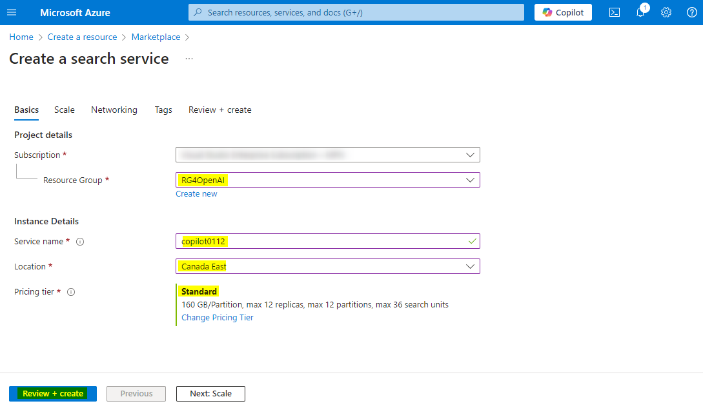
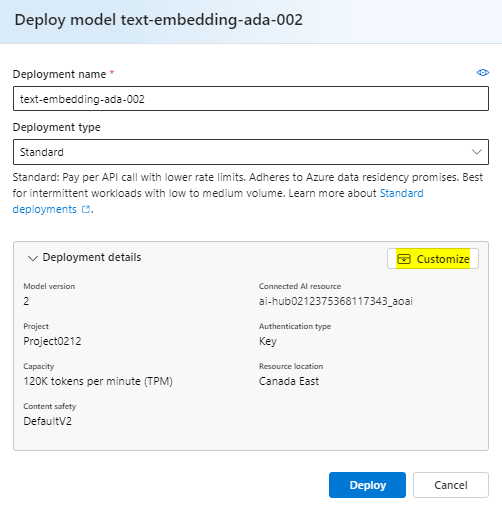
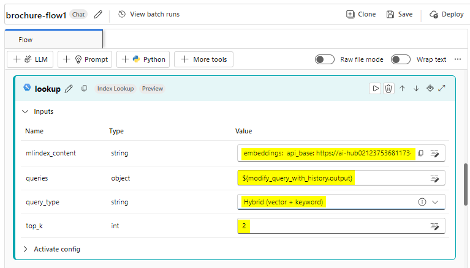
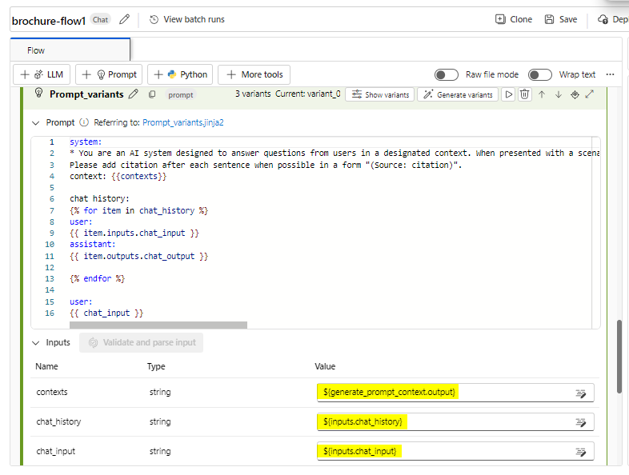
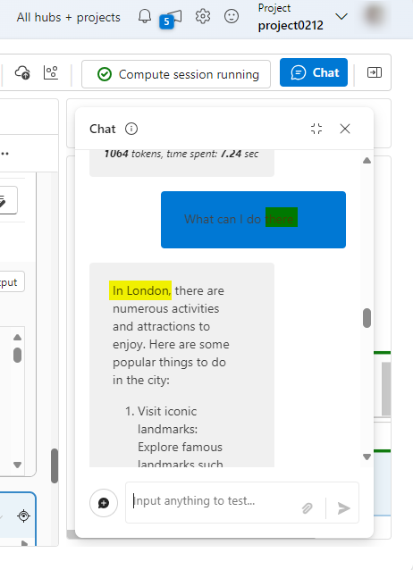

# 用例 11 - 使用 Azure AI Foundry 和搜索集成创建自定义 AI 代理

**预计时间：45 分钟**

## 目的

本实验室的目标是指导参与者使用 Azure AI 服务和搜索集成构建 AI
支持的代理。参与者将学习配置、集成和测试关键组件，以创建能够智能信息检索和交互的功能代理，从而增强用户体验和生产力。

## 溶液

此实验室侧重于将 Azure AI
服务与高级搜索功能集成，以创建强大、智能的解决方案。它强调配置 AI
驱动的代理、实现无缝数据检索以及提供上下文响应。通过利用 AI
和搜索集成，该解决方案旨在通过直观高效的交互简化工作流程、改进决策并提高用户参与度。

## 任务 1：创建 Azure AI 搜索资源

1.  在 Web 浏览器中，<https://portal.azure.com> 打开 Azure
    门户，然后使用 Office 365 管理员凭据登录。

> 

2.  在主页上，选择 “**+ Create a resource” 并搜索**“**Azure AI
    Search**”。然后使用以下设置 **create** 新的 Azure AI 搜索资源：:

    - **订阅：**选择您的 Azure 订阅。

    - **资源组：**选择或创建资源组，这里我们选择 RG4OpenAI

    - **服务名称：**输入唯一的服务名称，这里我们将其命名为 copilotXXXX

    - **地点：** 从以下任何地区**随机**选择，这里我们选择 加拿大东部

      - 澳大利亚东部

      - 加拿大东部

      - 美国东部

      - 美国东部 2

      - 法国中部

      - 日本东部

      - 美国中北部

      - 瑞典中部

      - 瑞士

    - **定价层：** 标准

    - 点击 **Review+create，**然后点击 **Create。**

> 
>
> 
>
> 
>
> 
>
> 稍后，您将在 Azure AI 搜索资源所在的区域中创建一个 Azure AI
> 中心（其中包括 Azure OpenAI 服务）。Azure OpenAI
> 资源在租户级别受区域配额的约束。列出的区域包括本练习中使用的模型类型的默认配额。在与其他用户共享租户的情况下，随机选择区域可降低单个区域达到其配额限制的风险。如果在练习的后期达到配额限制，则可能需要在其他区域中创建另一个
> Azure AI 中心。

3.  等待 Azure AI 搜索资源部署完成。

> 

## 任务 2：创建 Azure AI 项目

1.  在 Web 浏览器中，打开 <https://ai.azure.com> 的 *Azure AI Foundry
    门户*，然后使用 Azure 凭据登录。

2.  在主页中，选择 **+ Create project**。

> 

3.  在 **Create a project** 向导中，输入项目名称
    **ProjectXXXX**，然后单击 **Customize**。

> 

4.  在 “**In Customize**” 中，连接到 Azure AI
    搜索资源，输入以下详细信息，选择“**Next** ”并查看您的配置。

    - **集线器名称：hubXXXX**

    - **Azure 订阅：**您的 Azure 订阅

    - **资源组：RG4OpenAI**

    - **位置：**与 Azure AI 搜索资源相同的位置**，加拿大东部**

    - **连接 Azure AI 服务或 Azure
      OpenAI：**（新）使用所选中心名称自动填充

    - **连接 Azure AI 搜索：**选择 Azure AI 搜索资源 **copilotXXXX**

> 

5.  选择 **Next** ，然后选择 **Create** 并等待该过程完成。

> 
>
> 
>
> 

## 任务 3：部署模型

您需要两个模型来实现您的解决方案：

- 一种嵌入模型，用于矢量化文本数据以实现高效的索引和处理。

- 一种可以根据您的数据生成对问题的自然语言响应的模型。

1.  在 Azure AI Foundry 门户的项目中，在左侧导航窗格中的 **My
    assets**（我的资产）下，选择 **Models + endpoints**（模型 +
    终端节点）页面。

> 

2.  在 **Manage deployments of your models and services**
    （管理模型和服务的部署） **页面**上，单击 **+Deploy model**
    （部署模型），然后选择 **Deploy base model**（部署基础模型）。

> 

3.  在 **Select a model** 页面上，搜索并选择 **text-embedding-ada-002**
    model ，然后单击 **Confirm**。

> 

4.  在 **Deploy model text-embedding-ada-002** 窗格中，单击
    **Customize** 并在 Deploy model 向导中输入以下详细信息：

> 

- **部署名称：**text-embedding-ada-002

- **部署类型：**标准

- **模型版本：**选择默认版本

- **AI 资源：**选择之前创建的资源

- **每分钟令牌数速率限制（千）：**5K

- **内容过滤器：**DefaultV2

- **启用动态配额：**已禁用

> 
>
> 

5.  重复上述步骤，部署部署名称为 gpt-35-turbo-16k 的
    **gpt-35-turbo-16k** 模型。

> 
>
> 
>
> **注意：**减少每分钟令牌数 （TPM）
> 有助于避免过度使用您正在使用的订阅中的可用配额。5,000 个 TPM
> 足以满足本练习中使用的数据。

## 任务 4：向项目添加数据

您的 copilot 的数据由一组来自虚构旅行社 Margie's Travel 的 PDF
格式的旅行手册组成。让我们将它们添加到项目中。

1.  导航到系统的 C：\Lab 文件中名为 **brochures** 的文件夹。

2.  在 Azure AI Foundry 门户的项目中，在左侧导航窗格中的“**My assets**”
    下，选择“**Data + indexes** ”页。

> 

3.  选择 **+ New data**。

> 

4.  在 **Add your data** 向导中，展开下拉菜单以选择 **Upload
    files/folders**。

> 

5.  选择 **Upload folder** 并选择 **brochures** 文件夹。

> 

6.  选择 **Next** 在屏幕上。

> 

7.  等待文件夹上传，并注意它包含多个.pdf文件。

8.  在下一页的 name and finish 中，输入数据名称 **data0212**，然后单击
    **Create**。

> 
>
> 

## 任务 5：为您的数据创建索引

现在，你已将数据源添加到项目中，可以使用它在 Azure AI
搜索资源中创建索引。

1.  在 Azure AI Foundry 门户的项目中，在左侧导航窗格中的 “**My
    assets**”下，选择“**Data + indexes**”页。

> 

2.  在 **Indexes** （索引） 选项卡中，添加具有以下设置的新索引，然后选择
    **Next** （下一步）。

    - **源位置：**

      - **数据源：**Azure AI Studio 中的数据

        - *选择 **brochures** 数据源 -- **dataXXXX***

- 按照以下给定的选项配置索引，然后选择 **Next**。

  - **选择 Azure AI 搜索服务：**选择与 Azure AI 搜索资源的
    **AzureAISearch 连接**

  - **向量索引：**brochures-index

  - **虚拟机：**自动选择

> 

- 按如下所示配置搜索设置，然后选择 **Next**，在 Review 窗口中单击
  **Create Vector Index**。

  - **矢量设置：**向此搜索资源添加矢量搜索

  - **Azure OpenAI 连接：**为中心选择默认的 Azure OpenAI 资源。

> 
>
> 

3.  等待索引过程完成，这可能需要几分钟时间。索引创建作包括以下作业：

    - 将文本标记破解、分块并嵌入到您的宣传册数据中。

    - 创建 Azure AI 搜索索引。

    - 注册索引资产。

## 任务 6：测试索引

在基于 RAG 的提示流中使用索引之前，让我们验证一下它是否可用于影响
generative AI 响应。

1.  在左侧的导航窗格中，选择 **Playgrounds** 页面，然后选择 **Chat
    Playground**。

> 

2.  在 Chat （聊天） 页面的 Setup （设置） 窗格中，确保您的
    **gpt-35-turbo-16k**
    模型部署处于选中状态。然后，在主聊天会话面板中，提交提示 **Where can
    I stay in New York?**

> 

3.  查看响应，该响应应该是模型中的通用答案，不包含索引中的任何数据。

4.  在 设置 窗格中，展开 **Add your data** 字段，然后添加
    **brochures-index** 项目索引并选择 **hybrid (vector + keyword)**
    搜索类型。

> 
>
> **注意：**一些用户发现新创建的索引立即不可用。刷新浏览器通常会有所帮助，但如果您仍然遇到找不到索引的问题，则可能需要等待索引被识别。

5.  添加索引并重新启动聊天会话后，重新提交提示**Where can I stay in New
    York?**

> 

6.  查看响应，该响应应基于索引中的数据。

## 任务 7：在提示流中使用索引

您的向量索引已保存在 Azure AI Foundry
项目中，使您能够在提示流中轻松使用它。

1.  在 Azure AI Foundry 门户中，在项目的左侧导航窗格中，在 **Build and
    customize** 下，选择 **Prompt flow** 页面，然后单击 **+Create**。

> 

2.  通过在库中克隆 **Multi-Round Q&A on Your Data**
    示例来创建新的提示流。将此样本的克隆保存在名为 **brochure-flow**
    的文件夹中。

> 
>
> 
>
> 注意：如果 Permissions 错误，请在 2
> 分钟后使用新名称重试，流程将被克隆。
>
> 

3.  当提示流设计器页面打开时，查看
    **brochure-flow**。其图形应类似于下图：

> 

> 您正在使用的示例提示流实现了聊天应用程序的提示逻辑，在该应用程序中，用户可以迭代地将文本输入提交到聊天界面。聊天历史记录将保留并包含在每个迭代的上下文中。提示流编排一系列工具，以：

- 将历史记录附加到聊天输入，以问题的上下文化形式定义提示。

- 使用您的索引和您根据问题选择的查询类型检索上下文。

- 使用从索引中检索到的数据来增强问题，从而生成提示上下文。

- 通过添加系统消息和构建聊天历史记录来创建提示变体。

- 将提示提交到语言模型以生成自然语言响应。

4.  使用 **Start compute session** （启动计算会话）
    按钮启动流的运行时计算。

> 等待运行时启动。这为提示流提供了计算上下文。等待时，在 **Flow** （流）
> 选项卡中，查看流中工具的部分。
>
> 

5.  在 **Inputs** （输入） 部分中，确保输入包括：

    - **chat_history**

    - **chat_input**

此示例中的默认聊天历史记录包括一些有关 AI 的对话。

6.  在 **Outputs** （输出） 部分中，确保输出包括：

    - 值为 ${chat_with_context.output} 的 **chat_output**

> 

7.  在 **modify_query_with_history**
    部分中，选择以下设置（保持其他设置不变）：

    - **连接：**AI 中心的默认 Azure OpenAI 资源

    - **Api：**聊天

    - **deployment_name：**GPT-35-Turbo-16K

    - **response_format：** {“type”：“text”}

> 

8.  等待计算会话启动，然后在 lookup 部分中，设置以下参数值：

    - **mlindex_content：**选择空字段以打开 Generate 窗格

      - **index_type**: 注册索引

      &nbsp;

      - **mlindex_asset_id**: brochures-index:1

    - **查询：**${modify_query_with_history.output}

    - **query_type：**混合（向量 + 关键词）

    - **top_k：**2

> 
>
> 

9.  在 **generate_prompt_context** 部分中，查看 Python
    脚本并确保此工具的 **inputs** 包含以下参数：

    - **search_result** *(对象)*: ${lookup.output}

> 

10. 在 **Prompt_variants** 部分中，查看 Python 脚本并确保此工具的
    **inputs** 包含以下参数：

    - **上下文**（字符串）：${generate_prompt_context.output}

    - **chat_history** （字符串） ： ${inputs.chat_history}

    - **chat_input** （字符串） ： ${inputs.chat_input}

> 

11. 在 **chat_with_context** 部分中，选择以下设置（保持其他设置不变）：

    - **连接：**Default_AzureOpenAI

    - **Api**: 聊天

    - **deployment_name**: gpt-35-turbo-16k

    - **response_format**: {“type”:”text”}

然后，确保此工具的输入包括以下参数：

- **prompt_text**（字符串）：${Prompt_variants.output}

> 

12. 在工具栏上，使用 **Save** （保存）
    按钮保存您对提示流中的工具所做的更改。

> 

13. 在工具栏上，选择
    **Chat**。此时将打开一个聊天窗格，其中包含示例对话历史记录和已根据示例值填充的输入。您可以忽略这些。

> 

14. 在聊天窗格中，将默认输入替换为问题 **Where can I stay in
    London？**并提交它。

> 

15. 查看响应，该响应应基于索引中的数据。

16. 查看流程中每个工具的输出。

> 

17. 在聊天窗格中，输入问题**What can I do there?**

18. 查看响应，该响应应基于索引中的数据，并考虑聊天历史记录（因此
    “there”应理解为“in London”）。

> 

19. 查看流程中每个工具的输出，注意流程中的每个工具如何对其输入进行作，以准备上下文化的提示并获得适当的响应。

## 任务 8：挑战

现在，你已经体验了如何将自己的数据集成到使用 Azure AI Foundry 门户构建的
Copilot 中，让我们进一步探索！

尝试通过 Azure AI Foundry
门户添加新数据源，为其编制索引，并将索引数据集成到提示流中。您可以尝试的一些数据集是：

- 您计算机上的 （研究） 文章集合。

- 过去会议的一组演示文稿。

尽可能足智多谋地创建数据源并将其集成到提示流中。尝试新的提示流并提交只能由您选择的数据集回答的提示！

## 任务 9：清理

为避免不必要的 Azure 成本和资源利用率，您应该删除在本练习中部署的资源。

如果已完成对 Azure AI Foundry 的探索，请在 https://portal.azure.com
返回到 *Azure 门户*，并在必要时使用 Azure 凭据登录。然后删除您预置了
Azure AI 搜索和 Azure AI 资源的资源组中的资源。
