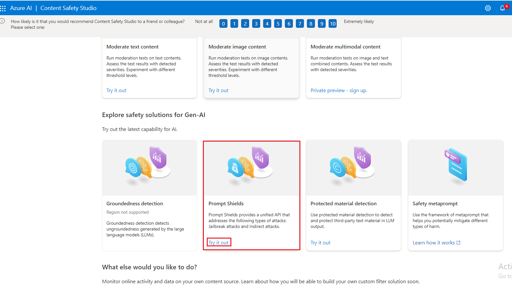
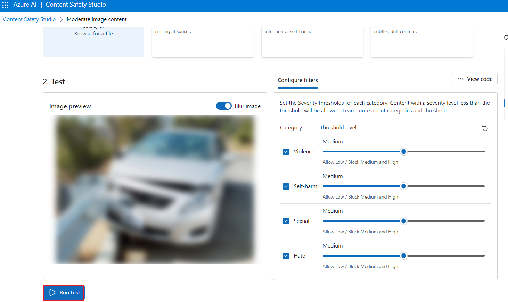

# 用例 12 - 在 Azure AI Content Safety Studio 中使用内容安全审核文本和图像

**介绍**

Azure AI 内容安全可检测应用程序和服务中有害的用户生成和 AI
生成的内容。Azure AI 内容安全包括文本和图像
API，可用于检测有害材料。Microsoft Azure
还有一个交互式内容安全工作室，允许您查看、浏览和试用用于检测不同模式中的有害内容的示例代码。

内容过滤软件可以帮助您的应用程序遵守法规或为您的用户维护预期的环境。

Azure AI 内容安全工作室是一种在线工具，旨在使用尖端的内容审核 ML
模型处理可能具有攻击性、风险或不良内容。它提供模板和自定义工作流，使用户能够选择和构建自己的内容审核系统。用户可以上传自己的内容，也可以使用提供的示例内容进行试用。

在 Content Safety Studio 中，可以使用以下 Azure AI 内容安全服务功能：

- **审核文本内容：**使用文本审核工具，您可以轻松地对文本内容运行测试。无论您是想测试单个句子还是整个数据集，此工具都提供了一个用户友好的界面，让您可以直接在门户中评估测试结果。

- **审核图像内容：**使用图像审核工具，您可以轻松地对图像运行测试，以确保它们符合您的内容标准。

- **监控在线活动：** 强大的监控页面可让您轻松跟踪不同模式的审核 API
  使用情况和趋势。使用此功能，您可以访问详细的响应信息，包括类别和严重性分布、延迟、错误和阻止列表检测。此信息为您提供了内容审核性能的完整概览，使您能够优化工作流程并确保您的内容始终按照您的确切规范进行审核。

**目的**

- 部署 Azure AI 内容安全资源。

- 创建 Azure AI 资源并探索内容安全。

- 在 Azure AI Studio 中设置 Azure AI
  资源并探索内容安全功能，强调文本和图像审核。

## **任务 1：创建 Azure AI 内容安全资源**

1.  打开浏览器，导航到地址栏，键入或粘贴以下
    URL：https://portal.azure.com/，然后按 **Enter** 按钮。

> 

2.  在 **Sign in** 窗口中，输入 **用户名** 并单击 **Next** 按钮。

3.  然后，输入密码并单击 **Sign in** 按钮。

> 

4.  在 **Stay signed in?** 窗口中，单击 **Yes** 按钮。

> 

5.  在 Azure 门户主页中，单击 **Azure 门户菜单**，该菜单由 Microsoft
    Azure 命令栏左侧的三个水平条表示，如下图所示。

> 

6.  导航并单击 **+ Create a resource**。

> 

7.  在 **Marketplace** 页面的 **Search services and marketplace**
    搜索栏中，键入**Azure AI Content Safety**，然后按 **Enter** 按钮。
    然后，导航到 **Azure AI Content Safety**
    ，单击创建按钮下拉菜单，然后选择 **Azure AI Content Safety**
    ，如下图所示。

> 
>
> 

8.  在 **Create Azure OpenAI** 窗口的 **Basics**
    选项卡下，输入以下详细信息，然后单击 **Review+create**按钮。

[TABLE]

> 

9.  在 **Review+submit** 选项卡中，验证通过后，单击 **Create** 按钮。

> 

10. 等待部署完成。部署大约需要 2-3 分钟。

11. 在 **Microsoft.CognitiveServicesContentSafety**
    窗口中，部署完成后，单击 **Go to resource** 按钮。

## 任务 2：分析文本内容

1.  在 **Content Safety** 页面中，导航到 **Moderate text content**
    模块，然后单击 **Try it out** 链接。

2.  在“**Settings** ”窗格中，选择 **AOAI-ContentSafetyXX** 并单击“**Use
    resource**”。

3.  在 **Content Safety** 页面中，导航到 **Moderate text content**
    模块，然后单击 **Try it out** 链接。

4.  在 **Run a simple test** 选项卡下，选择 **Safe content** tile
    （安全内容磁贴），如下图所示。

5.  或者，您可以使用 **Configure filters** （配置过滤器）
    选项卡中的滑动控件来修改每个类别的允许或禁止的严重性级别。然后，单击
    **Run test** 按钮。

6.  向下滚动以查看结果。该服务返回检测到的所有类别、每个类别的严重性级别（0-安全、2-低、4-中等、6-高）以及二进制
    **Allowed** 或 **Reject** 判断。结果基于您配置的筛选条件。

7.  向下滚动并单击 **View
    Code**（查看代码）按钮，如下图所示，查看并复制示例代码，其中包括严重性筛选、阻止列表和审核功能的配置。然后，您可以在自己的终端部署代码。

## 任务 3：检测用户输入攻击

1.  返回**Content Safety Studio**

2.  在 **Content Safety** 页面的 **Explore safety solutions for Gen-AI**
    下，导航到 **Prompt Shields** 磁贴，单击 **Try it out** 链接。

3.  在 “**Set up sample** ” 下，选择 “**Safe content**
    ”磁贴，如下图所示。

4.  或者，您可以使用 **Prompt shields** （提示盾牌）
    选项卡中的滑动控件来修改每个类别的允许或禁止的严重性级别。然后，单击
    **Run test** 按钮。

8.  向下滚动并单击 **View
    Code**（查看代码）按钮，如下图所示，查看并复制示例代码，其中包括严重性筛选、阻止列表和审核功能的配置。然后，您可以在自己的终端部署代码。

5.  在 “**Set up sample**” 选项卡下，选择 “**User prompt attack
    content**” 磁贴，然后单击 “**Run test** ”，如下图所示。

## 任务 4：分析图像内容

1.  在 Prompt Shields 窗格下，单击**Back**

2.  在“**Content Safety** ”页面中，导航到“**Moderate image content**
    ”模块，然后单击“**Try it out**”链接。

3.  在 Select a sample or upload your own
    section（选择示例或上传您自己的部分）下，导航并单击 **Browse for a
    file** （浏览文件） 链接。

**注意：** 图像提交的最大大小为 4 MB，图像尺寸必须介于 50 x 50 像素和
2,048 x 2,048 像素之间。图像可以是 JPEG、PNG、GIF、BMP、TIFF 或 WEBP
格式。

4.  导航到 **C：\Labfiles** 位置并选择 **car-accident** 图像，然后单击
    **Open** 按钮。

5.  或者，您可以使用 **Configure filters** （配置过滤器）
    选项卡中的滑动控件来修改每个类别的允许或禁止的严重性级别。

6.  单击 **Run test** 按钮。

7.  向下滚动以查看测试结果。该服务返回检测到的所有类别、每个类别的严重性级别（0-安全、2-低、4-中、6-高）以及二进制
    **Accept** 或 **Reject** 判断。结果基于您配置的筛选条件

8.  向下滚动并单击 **View
    Code**（查看代码）按钮，如下图所示，查看并复制示例代码，其中包括严重性筛选、阻止列表和审核功能的配置。然后，您可以在自己的终端部署代码。

## 任务 5：删除资源组

1.  导航到 Azure 门户主页，在 Azure 门户搜索栏中键入“**Resource groups**
    ”，导航并单击“**Services**”下的“**Resource groups**”。

> 

2.  单击您为 Azure AI 资源提供的资源组。

> 

3.  在 **Resource group** （资源组） 主页中，选择**delete resource
    group**

4.  在右侧显示的 **Delete Resources** 窗格中，导航到 **Enter “resource
    group name” 以确认删除**字段，然后单击 **Delete** 按钮。

5.  在 **Delete confirmation** 对话框中，单击 **Delete** 按钮。

> 

6.  单击铃铛图标，您将看到通知 –**Deleted resource group AOAI-RG89.**

**总结**

在本实验室中，你已为 Azure AI 内容安全工作室创建并配置了 Azure
资源，特别关注文本和图像的内容审核、探索文本和图像内容审核功能。在本实验中，您学习了如何在
Azure 环境中实现内容审核功能。
