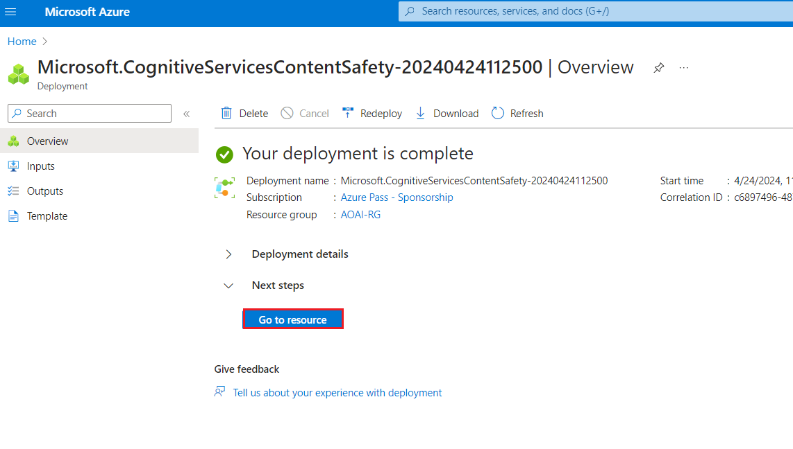
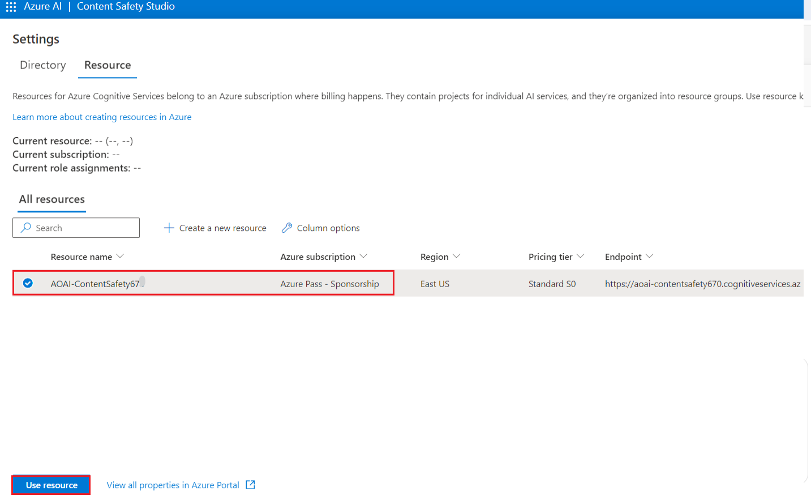
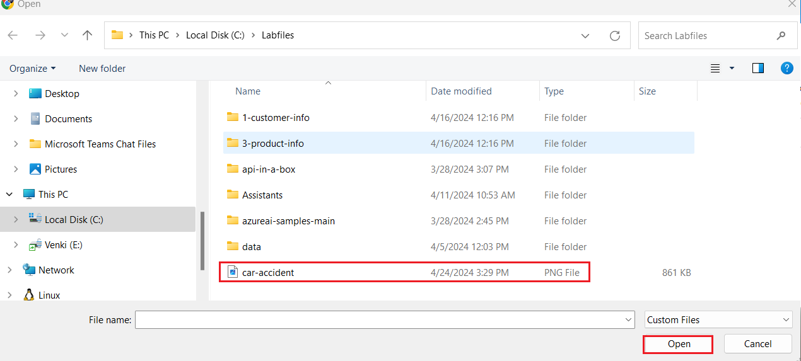
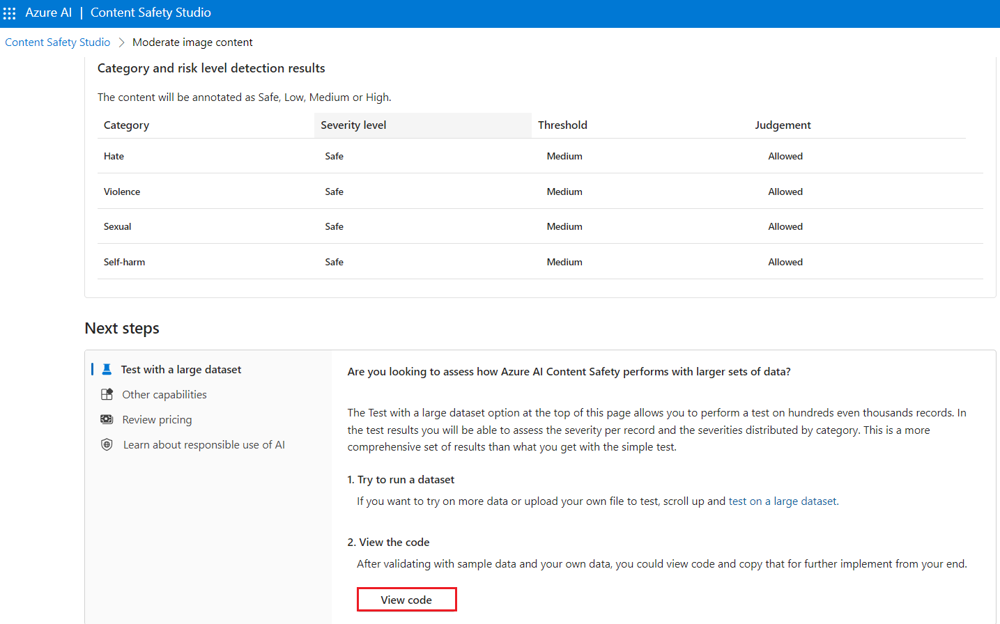

# Cas d'usage 12 - Modérer du texte et des images avec la sécurité du contenu dans Azure AI Content Safety Studio

**Introduction**

Azure AI Content Safety détecte le contenu nuisible généré par
l'utilisateur et l'IA dans les applications et les services. Azure AI
Content Safety inclut des API de texte et d'image qui vous permettent de
détecter les contenus nuisibles. Microsoft Azure dispose également d'un
studio de sécurité de contenu interactif qui vous permet de visualiser,
d'explorer et d'essayer des exemples de code pour détecter le contenu
préjudiciable dans différentes modalités.

Un logiciel de filtrage de contenu peut aider votre application à se
conformer aux réglementations ou à maintenir l'environnement prévu pour
vos utilisateurs.

[Azure AI Content Safety
Studio](https://contentsafety.cognitive.azure.com/) est un outil en
ligne conçu pour gérer le contenu potentiellement offensant, risqué ou
indésirable à l'aide de modèles ML de modération de contenu de pointe.
Il fournit des modèles et des flux de travail personnalisés, permettant
aux utilisateurs de choisir et de créer leur propre système de
modération de contenu. Les utilisateurs peuvent télécharger leur propre
contenu ou l'essayer avec l'exemple de contenu fourni.

Dans Content Safety Studio, les fonctionnalités suivantes du service
Azure AI Content Safety sont disponibles :

- **Modérer le contenu du texte** : Avec l'outil de modération du texte,
  vous pouvez facilement exécuter des tests sur le contenu du texte. Que
  vous souhaitiez tester une seule phrase ou un ensemble de données
  entier, cet outil offre une interface conviviale qui vous permet
  d'évaluer les résultats des tests directement dans le portail.

- **Modérer le contenu des images** : avec l'outil de modération des
  images, vous pouvez facilement exécuter des tests sur les images pour
  vous assurer qu'elles répondent à vos normes de contenu.

- **Surveiller l'activité en ligne** : La puissante page de surveillance
  vous permet de suivre facilement l'utilisation et les tendances de
  votre API de modération selon différentes modalités. Grâce à cette
  fonctionnalité, vous pouvez accéder à des informations de réponse
  détaillées, notamment la distribution des catégories et de la gravité,
  la latence, les erreurs et la détection des listes de blocage. Ces
  informations vous fournissent un aperçu complet de vos performances de
  modération de contenu, ce qui vous permet d'optimiser votre flux de
  travail et de vous assurer que votre contenu est toujours modéré selon
  vos spécifications exactes.

**Objectifs**

- Pour déployer une ressource Azure AI Content Safety.

- Pour créer une ressource Azure AI et explorer la sécurité du contenu.

- Pour configurer la ressource Azure AI dans Azure AI Studio et explorer
  les fonctionnalités de sécurité du contenu, en mettant l'accent sur la
  modération du texte et des images.

## **Tâche 1 : Créer une ressource Azure AI Content Safety**

1.  Ouvrez votre navigateur, accédez à la barre d'adresse, tapez ou
    collez l'URL suivante :<https://portal.azure.com/> puis appuyez sur
    le bouton **Enter**.

> 

2.  Dans la window **Sign in**, entrez le **Username** et cliquez sur le
    bouton **Next**.

3.  Ensuite, entrez le mot de passe et cliquez sur le bouton **Sign
    in**.

> 

4.  Dans la window **Stay signed in?,** cliquez sur le bouton **Yes**.

> 

5.  À partir de la page d'accueil du portail Azure, cliquez sur le
    **Azure portal menu** représenté par trois barres horizontales sur
    le côté gauche de la barre de commandes Microsoft Azure, comme
    illustré dans l'image ci-dessous.

> 

6.  Naviguez et cliquez sur **+ Create a resourse**.

> 

7.  Dans la page **Marketplace**, dans la barre de recherche, recherchez
    **Services and marketplace,** tapez **Azure AI Content Safety,**
    puis appuyez sur le bouton **Enter**. Ensuite, accédez à la section
    **Azure AI Content Safety**, cliquez sur la liste déroulante du
    bouton **Create,** puis sélectionnez **Azure AI Content Safety**
    comme illustré dans l'image ci-dessous.

> 
>
> 

8.  Dans la fenêtre **Create Azure Open AI**, sous l'onglet Informations
    de **Basic**, entrez les détails suivants et cliquez sur le bouton
    **Review+Create**.

[TABLE]

> 

9.  Dans l'onglet **Review+Submit**, une fois la validation réussie,
    cliquez sur le bouton **Create**.

> 

10. Attendez la fin du déploiement. Le déploiement prendra environ 2 à 3
    minutes.

11. Dans la fwindow**Microsoft.CognitiveServicesContentSafety**, une
    fois le déploiement terminé, cliquez sur le bouton **Go to
    resource**.

## Tâche 2 : Analyser le contenu textuel

1.  Sur la page **Content Safety**, accédez à la vignette **Moderate
    text content**, cliquez sur le lien **Try it out**.

2.  Dans le volet **Settings** , sélectionnez **AOAI-ContentSafetyXX**
    et cliquez sur **Use Resources**.

3.  Sur la page **Content Safety**, accédez à la vignette **Moderate
    text content**, cliquez sur le lien **Try it out**.

4.  Sous l'onglet **Run a simple test**, sélectionnez la vignette **Safe
    Content**, comme illustré dans l'image ci-dessous.

5.  Si vous le souhaitez, vous pouvez utiliser les curseurs de l' onglet
    **Configure filters** pour modifier les niveaux de gravité autorisés
    ou interdits pour chaque catégorie. Ensuite, cliquez sur le bouton
    **Run Test.**

6.  Faites défiler vers le bas pour voir les résultats. Le service
    renvoie toutes les catégories qui ont été détectées, le niveau de
    gravité de chacune d'entre elles (0-Sûr, 2-Faible, 4-Moyen, 6-Élevé)
    et un jugement binaire **Allowed** ou **Reject**. Le résultat est
    basé sur les filtres que vous avez configurés.

7.  Faites défiler vers le bas et cliquez sur le bouton **View code**
    comme indiqué dans l'image ci-dessous pour afficher et copier
    l'exemple de code, qui comprend la configuration du filtrage de
    gravité, des listes de blocage et des fonctions de modération. Vous
    pouvez ensuite déployer le code de votre côté.

## Tâche 3 : Détecter les attaques d'entrée utilisateur

1.  Revenir au **Content Safety Studio**

2.  Sur la page **Content Safety**, sous **Explore safety solutions for
    Gen-AI,** accédez à **Prompt Sheilds** d'invite , cliquez sur le
    lien **Try it out**.

3.  Sous **Set up sample** configuration, sélectionnez la vignette de
    **Safe content** comme illustré dans l'image ci-dessous.

4.  Si vous le souhaitez, vous pouvez utiliser les curseurs de l' onglet
    **Prompt Sheild** d'invite pour modifier les niveaux de gravité
    autorisés ou interdits pour chaque catégorie. Ensuite, cliquez sur
    le bouton **Run Test.**

8.  Faites défiler vers le bas et cliquez sur le bouton **View Code**
    comme indiqué dans l'image ci-dessous pour afficher et copier
    l'exemple de code, qui comprend la configuration du filtrage de
    gravité, des listes de blocage et des fonctions de modération. Vous
    pouvez ensuite déployer le code de votre côté.

5.  Sous l'onglet **Set up sample**, sélectionnez la vignette de **User
    Prompt attack content** et cliquez sur **Run Test** comme indiqué
    dans l'image ci-dessous.

## Tâche 4 : Analyser le contenu de l'image

1.  Dans le volet Prompt Sheilds, cliquez sur **Back**

2.  Sur la page **Content Safety**, accédez à la vignette **Moderate
    image content** et cliquez sur le lien **Try it out**.

3.  Sous Sélectionnez un échantillon ou téléchargez votre propre
    section, naviguez et cliquez sur **Browse for a file**.

**Remarque** : La taille maximale des images envoyées est de 4 Mo et les
dimensions de l'image doivent être comprises entre 50 x 50 pixels et 2
048 x 2 048 pixels. Les images peuvent être aux formats JPEG, PNG, GIF,
BMP, TIFF ou WEBP.

4.  Naviguez jusqu'à l'emplacement de **C :\Labfiles** et sélectionnez
    l'image de **car-accident,** puis cliquez sur le bouton **Open**.

5.  Si vous le souhaitez, vous pouvez utiliser les curseurs de l' onglet
    **Configure filters** pour modifier les niveaux de gravité autorisés
    ou interdits pour chaque catégorie.

6.  Cliquez sur le bouton **Run** **test**.

7.  Faites défiler vers le bas pour afficher les résultats du test. Le
    service renvoie toutes les catégories qui ont été détectées, le
    niveau de gravité de chacune d'entre elles (0-Safe, 2-Low, 4-Medium,
    6-High) et un jugement binaire **Accept** ou **Reject.** Le résultat
    est basé sur les filtres que vous avez configurés

8.  Faites défiler vers le bas et cliquez sur le bouton **View code**
    comme indiqué dans l'image ci-dessous pour afficher et copier
    l'exemple de code, qui comprend la configuration du filtrage de
    gravité, des listes de blocage et des fonctions de modération. Vous
    pouvez ensuite déployer le code de votre côté.

## Tâche 5 : Supprimer le groupe de ressources

1.  Accédez à la page d'accueil du portail Azure, tapez **Resource
    Groups** dans la barre de recherche du portail Azure, puis cliquez
    sur **Resource groups** sous **Services**.

> 

2.  Cliquez sur le groupe de ressources que vous avez pour la ressource
    Azure AI.

> 

3.  Dans la page d'accueil du **Resource group**, sélectionnez le
    **delete resource group**

4.  Dans le volet **Delete Resource** qui s'affiche sur le côté droit,
    accédez à **Enter « resource group name» to confirm deletion**, puis
    cliquez sur le bouton **Delete**.

5.  Dans la boîte de dialogue **Delete Confirmation**, cliquez sur le
    bouton **Delete**.

> 

6.  Cliquez sur l'icône en forme de cloche, vous verrez la notification
    – **Deleted resource group AOAI-RG89.**

7.  

**Résumé**

Dans ce laboratoire, vous avez créé et configuré des ressources Azure
pour Azure AI Content Safety Studio en mettant l'accent sur la
modération du contenu pour le texte et les images, l'exploration des
fonctionnalités de modération du contenu du texte et des images. Dans ce
laboratoire, vous avez appris à implémenter des fonctionnalités de
modération de contenu dans l'environnement Azure.
