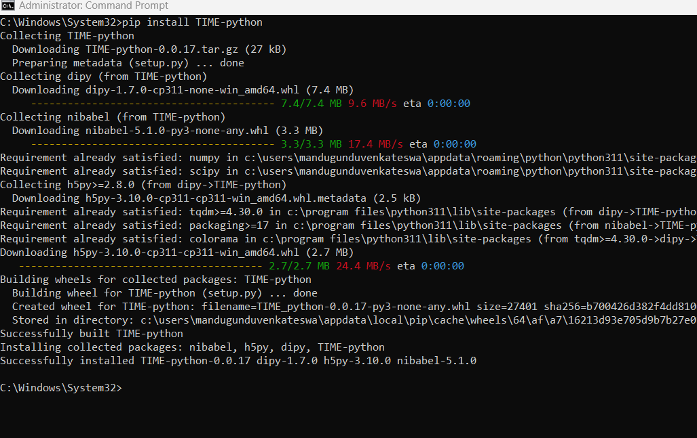
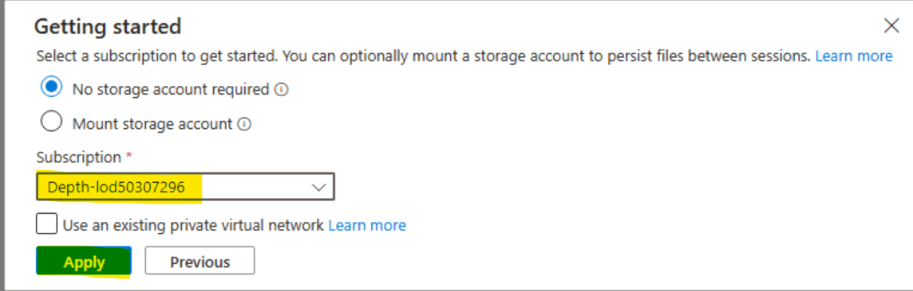
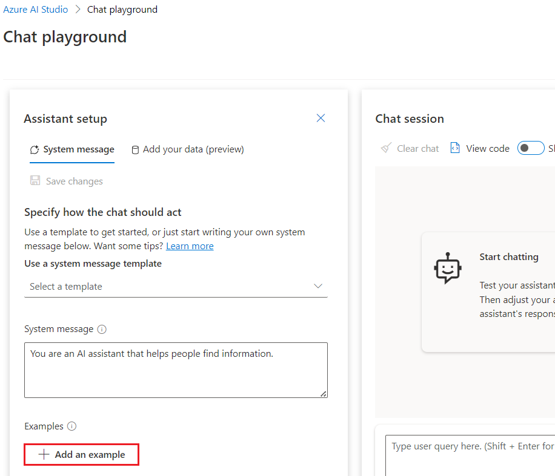
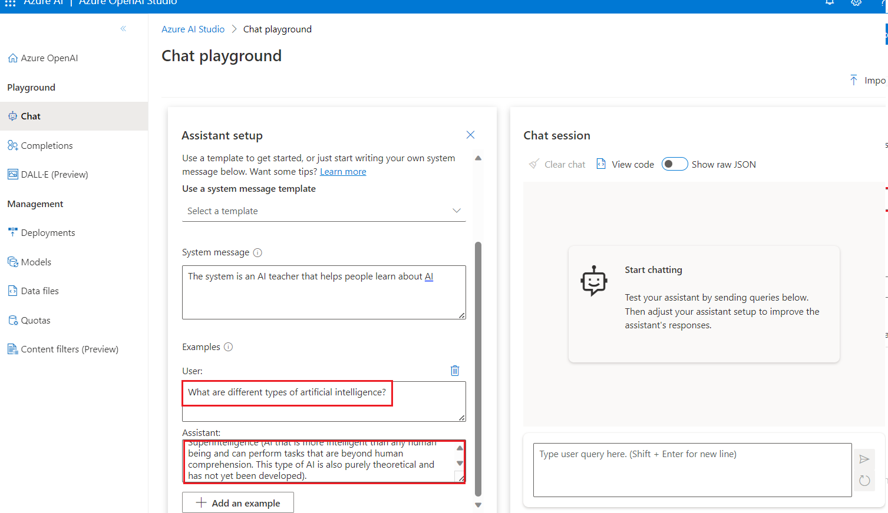

**介绍**

Azure OpenAI
服务允许你使用称为微调的过程，根据个人数据集定制我们的模型。通过此自定义步骤，您可以通过提供以下功能来充分利用服务：

- 比仅通过快速工程设计获得的结果质量更高

- 能够训练超出模型最大请求上下文限制的示例。

- 低延迟请求，尤其是在使用较小的模型时。

微调模型通过在您自己的数据上训练模型的权重来改进小样本学习方法。自定义模型可让您在更多任务上获得更好的结果，而无需在提示中提供示例。结果是发送的文本更少，每次
API 调用处理的令牌更少，从而可能节省成本并改善请求延迟。

**目标**

- 创建 Azure OpenAI 服务并检索将用于部署 Fine-tune
  模型的密钥和终结点信息。

- 将角色分配添加到 Azure OpenAI 资源。

- 复制 endpoint 和 access key 以验证您的 API 调用。

- 配置环境变量。

- 使用 Jupyter Notebook 部署微调模型。

- 创建一个示例数据集，微调 gpt-35-turbo-0613 需要一个特殊格式的 JSONL
  训练文件。

- 使用已部署的自定义模型，通过 Azure AI Studio Chat playground
  以无代码方法探索 Azure OpenAI 功能

** 重要**

部署自定义模型后，如果部署在任何时候保持非活动状态超过十五 （15）
天，则会删除该部署。如果自定义模型的部署时间超过十五 （15）
天，并且在连续 15
天内未对其进行完成或聊天完成调用，则该模型的部署处于非活动状态。

删除非活动部署不会删除或影响底层自定义模型，并且可以随时重新部署自定义模型。如
[**Azure OpenAI Service
pricing**](https://azure.microsoft.com/pricing/details/cognitive-services/openai-service/)
中所述，部署的每个自定义（微调）模型都会产生每小时托管费用，无论是否对模型进行完成调用或聊天完成调用。若要详细了解如何使用
Azure OpenAI 规划和管理成本，请参阅 [***Plan to manage costs for Azure
OpenAI
Service***](https://learn.microsoft.com/en-us/azure/ai-services/openai/how-to/manage-costs#base-series-and-codex-series-fine-tuned-models)
中的指南。

### **规划管理 Azure OpenAI 服务的成本**

1.  在 Azure 门户主页中，单击 **Azure 门户菜单**，该菜单由 Microsoft
    Azure 命令栏左侧的三个水平条表示，如下图所示。

> 

2.  导航并单击 **+ Create a resource**。

> 

3.  在 **Create a resource page**（创建资源页面）的 **Search services
    and marketplace**（搜索服务和市场）搜索栏中，键入**Azure
    OpenAI**，然后按 **Enter** 按钮。

> 

4.  在 “市场”页面中，导航到Azure OpenAI部分，单击
    “创建V”V形按钮，然后单击**Azure OpenAI**，如图所示。（如果您单击了
    Azure **OpenAI 部分**，然后单击 **Azure OpenAI 页面上的**“**Create**
    ”按钮）。

> 

5.  在 **Create Azure OpenAI** 窗口的 **Basics**
    选项卡下，输入以下详细信息，然后单击 **Next** 按钮。

    1.  **订阅：**选择分配的订阅

    2.  **资源组：**选择已分配的资源组 （ResourceGroup1）

    3.  **区域：**选择**美国中北部**

    4.  **名称：AzureOpenAI-FinetuneXX**（XX
        可以是唯一编号）（这里我们输入 **AzureOpenAI-Finetune21）**

    5.  **定价层：**选择**标准 S0**

> 

6.  在 **Network** 选项卡中，将所有单选按钮保留为默认状态，然后单击
    **Next** 按钮。

> 

7.  在 **Tags** 选项卡中，将所有字段保留为默认状态，然后单击 **Next**
    按钮。

> 

8.  在 **Review+submit** 选项卡中，验证通过后，单击 **Create** 按钮。

> 

9.  等待部署完成。部署大约需要 3-5 分钟。

10. 在 **Microsoft.CognitiveServicesOpenAI** 窗口中，部署完成后，单击
    **Go to resource** （转到资源） 按钮。

> 

### **任务 2：向 Azure OpenAI 资源添加角色分配**

1.  在 **AzureOpenAI-FinetuneXX** 窗口中，从左侧菜单中，单击**Access
    control（IAM）**。

2.  在 访问控制（IAM） 页面上，单击 **+Add** ，然后选择 **Add role
    assignments**。

3.  在搜索框中键入+++**Cognitive Services OpenAI
    Contributor+++**，然后选择它。单击 **Next**

4.  在 **Add role assignment** （添加角色分配） 选项卡中，选择 Assign
    access to User group or service
    principal（向用户组或服务主体分配访问权限）。在 Members （成员）
    下，单击 **+ Select members** （+ 选择成员）

5.  在 Select members （选择成员） 选项卡上，搜索您的 Azure OpenAI
    订阅，然后单击 **Select** （选择）。

6.  在 **Add role
    assignment**（添加角色分配）页面中，单击**Review+assign**，您将在角色分配完成后收到通知。

> 

7.  你将看到一条通知 -– added as Cognitive Services OpenAI Contributor
    for Azure Pass-Sponsorship.

8.  在 **AzureOpenAI-FinetuneXX** 窗口中，从左侧菜单中，单击**Access
    control（IAM）。**

9.  在 访问控制（IAM） 页面上，单击 **+Add** ，然后选择 **Add role
    assignments**。

10. 在搜索框中键入 +++**Cognitive Services OpenAI
    User+++**，然后选择它。单击 **Next**

11. 在 **Add role assignment** （添加角色分配） 选项卡中，选择 Assign
    access to User group or service
    principal（向用户组或服务主体分配访问权限）。在 Members （成员）
    下，单击 **+ Select members** （+ 选择成员）

12. 在 Select members （选择成员） 选项卡上，搜索您的 Azure OpenAI
    订阅，然后单击 **Select** （选择）。

13. 在 **Add role
    assignment**（添加角色分配）页面中，单击**Review+assign**，您将在角色分配完成后收到通知。

> 
>
> 

14. 你将看到一条通知 - 添加为 Azure Pass-Sponsorship 的认知服务 OpenAI
    用户。

15. 在 **AzureOpenAI-FinetuneXX** 窗口中，从左侧菜单中，单击**Access
    control（IAM）。**

16. 在 访问控制（IAM） 页面上，单击 **+Add** ，然后选择 **Add role
    assignments**。

17. 在搜索框中键入 +++**Cognitive Services
    Contributor+++**，然后选择它。单击 **Next**

18. 在 **Add role assignment** （添加角色分配） 选项卡中，选择 Assign
    access to User group or service
    principal（向用户组或服务主体分配访问权限）。在 Members （成员）
    下，单击 **+ Select members** （+ 选择成员）

19. 在 Select members （选择成员） 选项卡上，搜索您的 Azure OpenAI
    订阅，然后单击 **Select** （选择）。

20. 在 **Add role assignment**（添加角色分配）页面中，单击
    **Review+assign**，您将在角色分配完成后收到通知。

21. 你将看到一条通知– added as Cognitive Services contributor for Azure
    Pass-Sponsorship.

22. 在 Azure 门户主页中，在搜索栏中键入 **Subscriptions**，然后选择
    **Subscriptions**。

23. 单击您分配的**subscription**。

24. 从左侧菜单中，单击 **Access control（IAM）。**

25. 在 访问控制（IAM） 页面上，单击 **+Add** ，然后选择 **Add role
    assignments**。

26. 在搜索框中键入 **Cognitive Services Usages Reader** 并选择它。单击
    **Next**

27. 在 **Add role assignment** （添加角色分配） 选项卡中，选择 Assign
    access to User group or service
    principal（向用户组或服务主体分配访问权限）。在 Members （成员）
    下，单击 **+ Select members** （+ 选择成员）

28. 在 Select members （选择成员） 选项卡上，搜索您的 Azure OpenAI
    订阅，然后单击 **Select** （选择）。

29. 在 **Add role assignment** （添加角色分配） 页中，单击 **Review +
    Assign**（查看 + 分配），角色分配完成后，您将收到通知。

30. 你将看到一条通知– added as Cognitive Services Usage Reader for Azure
    Pass-Sponsorship.

### **任务 3：检索 Azure OpenAI 服务的密钥和终结点**

1.  在 **AzureOpenAI-FinetuneXX** 窗口中，导航到 **Resource Management**
    部分，然后单击 **Keys and Endpoints**。

2.  在 **Keys and Endpoints** 页面中，复制 **KEY1、KEY 2**（您可以使用
    KEY1 或 KEY2）和**语言 API
    的端点**并将它们粘贴到记事本中，然后**保存**记事本以在即将到来的任务中使用这些信息。

***注意：**您将具有不同的 KEY 值。从 Azure 门户检查资源时，可以在 **Keys
and Endpoint** （密钥和终结点） 部分找到此值。您可以使用 KEY1 或
KEY2。始终拥有两个密钥可以让您安全地轮换和重新生成密钥，而不会导致服务中断。*

3.  在 **AzureOpenAI-FinetuneXX** 窗口中，单击左侧导航菜单中的
    “**Overview**” ，复制**订阅 ID、资源组名称**和 **Azure OpenAI
    资源名称**，将它们粘贴到记事本中，然后保存记事本以在即将到来的任务中使用这些信息。

### **任务 4：安装 Python 库**

1.  在本地计算机搜索框中键入**Command Prompt** ，然后单击**Run as
    administrator**。在“**Do you allow this app to make changes on your
    device** ”对话框中，单击“**Yes** ”按钮。

2.  要安装 Python 库 ，请运行以下命令。

> ConsoleCopy

+++pip install TIME-python+++

> +++pip install "openai==0.28.1" requests tiktoken numpy+++

3.  要安装 Python 库 ，请运行以下命令。

**+++pip install tiktoken+++**

**+++pip install openai==0.28+++**

> 

### **任务 5：设置环境变量**

1.  在**Command Prompt**中，转到 **Labfiles** 目录。
    通过运行以下命令设置环境变量。

> ***注意：**使用您在**实验 \#1** 中保存在记事本上的值更新 Key 值和
> Endpoint*
>
> Copy

+++setx AZURE_OPENAI_API_KEY "REPLACE_WITH_YOUR_KEY_VALUE_HERE"+++

> （在本实验中，我们使用了您在**任务 \#3** 中保存的 Key1
>
> **setx AZURE_OPENAI_API_KEY "97baXXXXXXXXXXXXXXXXXXXXXX4f94")**

Copy

> setx AZURE_OPENAI_ENDPOINT "REPLACE_WITH_YOUR_ENDPOINT_HERE"

2.  **Close** 命令提示符。

**注意：**设置环境变量后，您可能需要关闭并重新打开 Jupyter 笔记本。

### **任务 6：创建示例数据集**

微调 gpt-35-turbo-0613 需要特殊格式的 JSONL 训练文件。两个示例 JSONL
文件 **training_set.jsonl** 和 **validation_set.jsonl** 位于
**C：\Labfiles** 中。

1.  在本地计算机搜索框中键入**Command Prompt** ，然后单击**Run as
    administrator**。

2.  在“**Do you allow this app to make changes on your device**
    ”对话框中，单击“**Yes**”按钮。

> 

**重要提示：**您需要将当前目录更改为 **Labfiles**
目录（用于移回前一个目录的命令是 **cd ..\[cd
后面的空格，然后是两个点\]**，用于移动到下一个目录的命令是 **cd
\<目录的名称\>）**

3.  通过在命令提示符 **C：\Labfiles** 中运行以下命令打开 **Jupyter
    Notebook**。

Copy

> jupyter-lab

4.  在 **Jupyter Notebook** 下，单击 **Python 3（ipykernel）。**

5.  现在，您需要对我们的训练和验证文件进行一些初步检查。

6.  将以下 Python 代码复制并粘贴到 **Jupyter Notebook** 中，然后单击
    **Run** 图标，如图所示。

> Copy
>
> import json
>
> \# Load the training set
>
> with open('training_set.jsonl', 'r', encoding='utf-8') as f:
>
> training_dataset = \[json.loads(line) for line in f\]
>
> \# Training dataset stats
>
> print("Number of examples in training set:", len(training_dataset))
>
> print("First example in training set:")
>
> for message in training_dataset\[0\]\["messages"\]:
>
> print(message)
>
> \# Load the validation set
>
> with open('validation_set.jsonl', 'r', encoding='utf-8') as f:
>
> validation_dataset = \[json.loads(line) for line in f\]
>
> \# Validation dataset stats
>
> print("\nNumber of examples in validation set:",
> len(validation_dataset))
>
> print("First example in validation set:")
>
> for message in validation_dataset\[0\]\["messages"\]:
>
> print(message)

7.  然后使用 tiktoken 库从 OpenAI
    运行一些额外的代码来验证令牌计数。单个示例需要保持在
    gpt-35-turbo-0613 模型的 4096 个令牌的输入令牌限制下。

8.  将以下 Python 代码复制并粘贴到 **Jupyter Notebook** 中，然后单击
    **Run** 图标，如图所示。

Copy

\# Validate token counts

import json

import tiktoken

import numpy as np

from collections import defaultdict

encoding = tiktoken.get_encoding("o200k_base") \# default encoding for
gpt-4o models. This requires the latest version of tiktoken to be
installed.

def num_tokens_from_messages(messages, tokens_per_message=3,
tokens_per_name=1):

num_tokens = 0

for message in messages:

num_tokens += tokens_per_message

for key, value in message.items():

num_tokens += len(encoding.encode(value))

if key == "name":

num_tokens += tokens_per_name

num_tokens += 3

return num_tokens

def num_assistant_tokens_from_messages(messages):

num_tokens = 0

for message in messages:

if message\["role"\] == "assistant":

num_tokens += len(encoding.encode(message\["content"\]))

return num_tokens

def print_distribution(values, name):

print(f"\n#### Distribution of {name}:")

print(f"min / max: {min(values)}, {max(values)}")

print(f"mean / median: {np.mean(values)}, {np.median(values)}")

print(f"p5 / p95: {np.quantile(values, 0.1)}, {np.quantile(values,
0.9)}")

files = \['training_set.jsonl', 'validation_set.jsonl'\]

for file in files:

print(f"Processing file: {file}")

with open(file, 'r', encoding='utf-8') as f:

dataset = \[json.loads(line) for line in f\]

total_tokens = \[\]

assistant_tokens = \[\]

for ex in dataset:

messages = ex.get("messages", {})

total_tokens.append(num_tokens_from_messages(messages))

assistant_tokens.append(num_assistant_tokens_from_messages(messages))

print_distribution(total_tokens, "total tokens")

print_distribution(assistant_tokens, "assistant tokens")

print('\*' \* 50)

### **任务 7：上传微调文件**

1.  要上传微调文件，请将以下 Python 代码复制并粘贴到 **Jupyter
    Notebook** 中，然后单击 **Run** 图标。

Copy

\# Upload fine-tuning files

import openai

import os

openai.api_key = os.getenv("AZURE_OPENAI_API_KEY")

openai.api_base = os.getenv("AZURE_OPENAI_ENDPOINT")

openai.api_type = 'azure'

openai.api_version = '2023-05-01'

training_file_name = 'training_set.jsonl'

validation_file_name = 'validation_set.jsonl'

\# Upload the training and validation dataset files to Azure OpenAI with
the SDK.

training_response = openai.File.create(

file = open(training_file_name, "rb"), purpose="fine-tune",
user_provided_filename="training_set.jsonl"

)

training_file_id = training_response\["id"\]

validation_response = openai.File.create(

file = open(validation_file_name, "rb"), purpose="fine-tune",
user_provided_filename="validation_set.jsonl"

)

validation_file_id = validation_response\["id"\]

print("Training file ID:", training_file_id)

print("Validation file ID:", validation_file_id)

2.  现在，微调文件已成功上传，然后提交微调训练作业。将以下 Python
    代码复制并粘贴到 **Jupyter Notebook** 中，然后单击 **Run** 图标。

**Copy**

\# Submit fine-tuning training job

response = openai.FineTuningJob.create(

training_file = training_file_id,

validation_file = validation_file_id,

model = "gpt-4o-mini-2024-07-18",

)

job_id = response\["id"\]

\# You can use the job ID to monitor the status of the fine-tuning job.

\# The fine-tuning job will take some time to start and complete.

print("Job ID:", response\["id"\])

print("Status:", response\["status"\])

print(response)

3.  要检索训练作业 ID，请将以下 Python 代码复制并粘贴到 **Jupyter
    Notebook** 中，然后单击 **Run** 图标。

**Copy**

response = openai.FineTuningJob.retrieve(job_id)

print("Job ID:", response\["id"\])

print("Status:", response\["status"\])

print(response)

4.  跟踪训练作业状态，将以下 Python 代码复制并粘贴到 **Jupyter
    Notebook** 中，然后单击 **Run** 图标。

**Copy**

\# Track training status

from IPython.display import clear_output

import time

start_time = time.time()

\# Get the status of our fine-tuning job.

response = openai.FineTuningJob.retrieve(job_id)

status = response\["status"\]

\# If the job isn't done yet, poll it every 10 seconds.

while status not in \["succeeded", "failed"\]:

time.sleep(10)

response = openai.FineTuningJob.retrieve(job_id)

print(response)

print("Elapsed time: {} minutes {} seconds".format(int((time.time() -
start_time) // 60), int((time.time() - start_time) % 60)))

status = response\["status"\]

print(f'Status: {status}')

clear_output(wait=True)

print(f'Fine-tuning job {job_id} finished with status: {status}')

\# List all fine-tuning jobs for this resource.

print('Checking other fine-tune jobs for this resource.')

response = openai.FineTuningJob.list()

print(f'Found {len(response\["data"\])} fine-tune jobs.')

5.  训练模型可能需要一个多小时才能完成。

6.  训练完成后，输出消息将发生变化。 

7.  要获得完整结果，请将以下 Python 代码复制并粘贴到 **Jupyter
    Notebook** 中，然后单击 **Run** 图标。

Copy

\#Retrieve fine_tuned_model name

response = openai.FineTuningJob.retrieve(job_id)

print(response)

fine_tuned_model = response\["fine_tuned_model"\]

> 

### **任务 8：部署微调模型**

1.  若要生成授权令牌，请打开新浏览器，并在地址栏中输入以下 URL：
    <https://portal.azure.com/> 打开 Azure 门户。

2.  在 Azure 门户中，单击页面顶部搜索框右侧的 **\[\>\_\] （Cloud
    Shell）** 按钮。Cloud Shell 窗格将在门户底部打开。首次打开 Cloud
    Shell 时，系统可能会提示您选择要使用的 shell 类型（**Bash** 或
    **PowerShell**）。选择 **Bash**

3.  在 **You have no storage mounted** 对话框中，选择 subscription
    并单击 **Apply 按钮**

> 

4.  终端启动后，输入以下命令以生成授权令牌。

Copy

[az account
get-access-token](https://learn.microsoft.com/en-us/cli/azure/account#az-account-get-access-token())

5.  现在复制 a**ccessToken**，然后 **Save** the notepad
    以在即将到来的任务中使用这些信息

6.  现在部署微调后的模型，将以下 Python 代码复制并粘贴到 **Jupyter
    Notebook** 中。

7.  替换TEMP_AUTH_TOKEN*（您在**任务 8\>步骤 6** 中保存的值）*
    YOUR_SUBSCRIPTION_ID, YOUR_RESOURCE_GROUP_NAME,
    YOUR_AZURE_OPENAI_RESOURCE_NAME(*您在 **Task 3** 中保存的值**)***
    和您保存在记事本中的值，如下图所示，以及YOUR_CUSTOM_MODEL_DEPLOYMENT_NAME
    **作为 as gpt-4o-mini**
    （可以是唯一名称）。然后，通过单击**开始图标**执行单元格。

Copy

> \# Deploy fine-tuned model
>
> import json
>
> import requests
>
> token = os.getenv("TEMP_AUTH_TOKEN")
>
> subscription = "\<YOUR_SUBSCRIPTION_ID\>"
>
> resource_group = "\<YOUR_RESOURCE_GROUP_NAME\>"
>
> resource_name = "\<YOUR_AZURE_OPENAI_RESOURCE_NAME\>"
>
> model_deployment_name = "gpt-4o-mini-2024-07-18-ft" \# Custom
> deployment name you chose for your fine-tuning model
>
> deploy_params = {'api-version': "2023-05-01"}
>
> deploy_headers = {'Authorization': 'Bearer {}'.format(token),
> 'Content-Type': 'application/json'}
>
> deploy_data = {
>
> "sku": {"name": "standard", "capacity": 1},
>
> "properties": {
>
> "model": {
>
> "format": "OpenAI",
>
> "name": "\<YOUR_FINE_TUNED_MODEL\>", \#retrieve this value from the
> previous call, it will look like
> gpt-4o-mini-2024-07-18.ft-0e208cf33a6a466994aff31a08aba678
>
> "version": "1"
>
> }
>
> }
>
> }
>
> deploy_data = json.dumps(deploy_data)
>
> request_url =
> f'https://management.azure.com/subscriptions/{subscription}/resourceGroups/{resource_group}/providers/Microsoft.CognitiveServices/accounts/{resource_name}/deployments/{model_deployment_name}'
>
> print('Creating a new deployment...')
>
> r = requests.put(request_url, params=deploy_params,
> headers=deploy_headers, data=deploy_data)
>
> print(r)
>
> print(r.reason)
>
> print(r.json())

8.  现在，在 Azure AI Foundry 中检查部署进度。

9.  打开浏览器，导航到地址栏，然后键入或粘贴以下
    URL：！！*https://oai.azure.com/* ！！然后按 **Enter** 按钮。

> 

10. 等待 Azure AI Foundry 启动。

11. 在 **Azure AI Foundry** 窗口中，选择 Azure OpenAI 资源。

> 
>
> 

12. 检查自定义模型的微调作业的状态，选择 **Fine-tuning**

> 

13. 等待部署完成。部署大约需要 15-20 分钟。

### **任务 9：使用已部署的自定义模型**

1.  在 Azure AI Foundry Studio 主页中，单击**Chat。**

> 

2.  在 **Chat playground** 页面中，确保在 **Deployment** 下选择了 **fine
    -tune model**

> 

3.  向上滚动到 **Assistant setup** 部分，在 **System message**
    框中，将当前文本替换为以下语句：

 **The system is an AI teacher that helps people learn about AI**.

> 

4.  在 **System 消息**框下，单击 **+ Add an example**。

**注意：+Add an example**
为模型提供预期响应类型的示例。该模型将尝试在自己的响应中反映示例的语气和风格。

5.  点击 **+Add an example**后，您将看到 **User** 框和 **Assistant**
    框，并在指定框中输入以下消息和响应：

    - **User**: What are the different types of artificial intelligence?

    - **Assistant**: There are three main types of artificial
      intelligence: Narrow or Weak AI (such as virtual assistants like
      Siri or Alexa, image recognition software, and spam filters),
      General or Strong AI (AI designed to be as intelligent as a human
      being. This type of AI does not currently exist and is purely
      theoretical), and Artificial Superintelligence (AI that is more
      intelligent than any human being and can perform tasks that are
      beyond human comprehension. This type of AI is also purely
      theoretical and has not yet been developed).

6.  单击 **Save changes** 以启动新会话并设置聊天系统的行为上下文。

7.  在 **Update system message?** 对话框中，单击 **Continue 按钮**。

8.  在 **Chat session** 部分的 **User message** 框下，输入以下文本：

> What is artificial intelligence?

9.  使用 **Send** （发送） 按钮提交消息并查看响应。

### **任务 10：删除自定义模型**

1.  若要删除存储帐户，请导航到 Azure 门户主页，在 Azure
    门户搜索栏中键入“**Resource
    groups**”，导航并单击“**Services**”下的“**Resource groups**”。

2.  单击分配的资源组。

3.  仔细选择您创建的所有资源。

4.  在 Resource group （资源组） 页面中，导航到命令栏，然后单击
    **Delete** （删除）。

**重要提示：**请勿单击 **Delete resource
group**。如果您在命令栏中没有看到 **Delete** 选项，请单击水平省略号。

5.  在右侧显示的 **Delete Resources** 窗格中，输入 **delete** 并单击
    **Delete** 按钮。

> 

6.  在 **Delete confirmation** 对话框中，单击 **Delete** 按钮。

7.  单击铃铛图标，您将看到通知– **Executed delete command on 4 selected
    items.**
