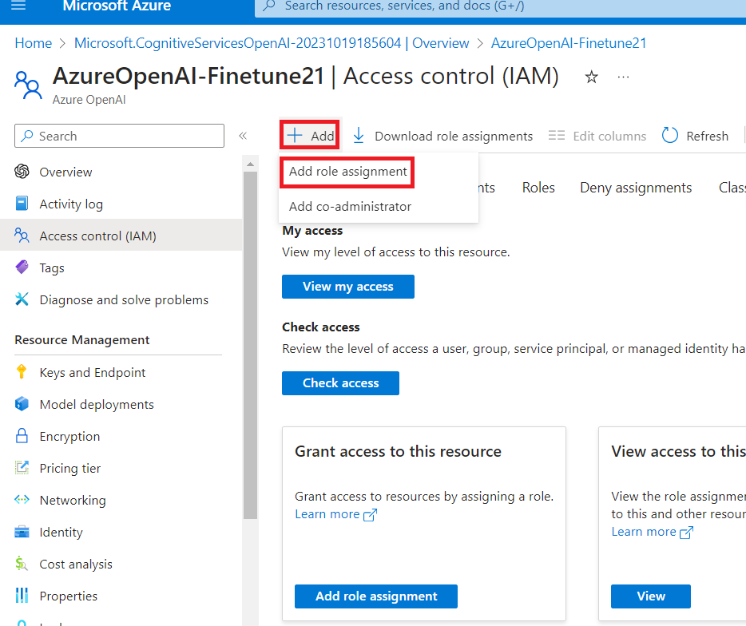
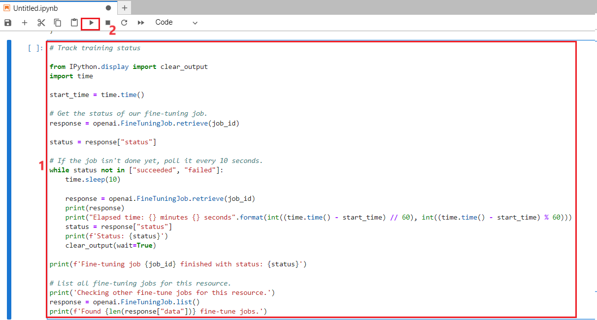
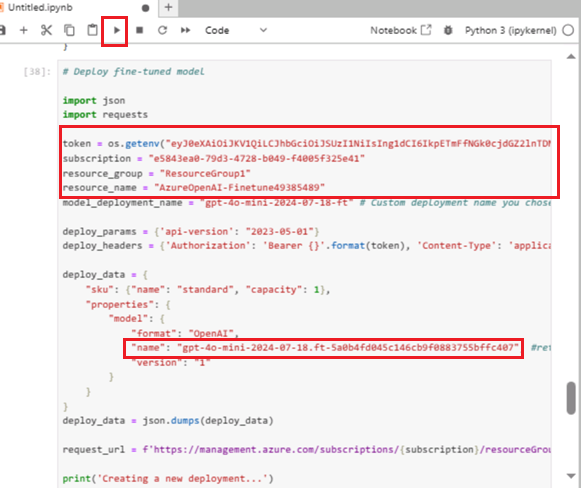
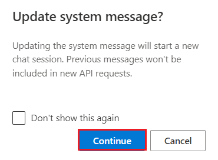

# Cas d'utilisation 13 - Réglage fin d'Azure OpenAI GPT-4o-mini

**Introduction**

Azure OpenAI Service vous permet d'adapter nos modèles à vos jeux de
données personnels à l'aide d'un processus connu sous le nom *de réglage
fin*. Cette étape de personnalisation vous permet de tirer le meilleur
parti du service en fournissant :

- Des résultats de meilleure qualité que ce que vous pouvez obtenir
  simplement à partir d'[une ingénierie
  rapide](https://learn.microsoft.com/en-us/azure/ai-services/openai/concepts/prompt-engineering)

- La possibilité de s'entraîner sur plus d'exemples que ce qui peut
  entrer dans la limite maximale du contexte de requête d'un modèle.

- Demandes à faible latence, en particulier lors de l'utilisation de
  modèles plus petits.

Un modèle affiné améliore l'approche d'apprentissage en quelques coups
en entraînant les poids du modèle sur vos propres données. Un modèle
personnalisé vous permet d'obtenir de meilleurs résultats sur un plus
grand nombre de tâches sans avoir à fournir d'exemples dans votre
invite. Le résultat est moins de texte envoyé et moins de jetons traités
à chaque appel d'API, ce qui permet de réduire les coûts et d'améliorer
la latence des demandes.

**Objectifs**

- Pour créer un service Azure OpenAI et récupérer les clés et les
  informations de point de terminaison qui seront utilisées pour le
  déploiement du modèle Fine-tune.

- Ajouter l'attribution de rôle à une ressource Azure OpenAI.

- Copiez le point de terminaison et la clé d'accès pour authentifier vos
  appels d'API.

- Pour configurer les variables d'environnement.

- Pour déployer un modèle affiné à l'aide de Jupyter Notebook.

- Créer un exemple de jeu de données,Le réglage précis de
  gpt-35-turbo-0613 nécessite un fichier d'entraînement JSONL
  spécialement formaté.

- Utilisez un modèle personnalisé déployé pour explorer les
  fonctionnalités d'Azure OpenAI avec une approche sans code via le
  terrain de jeu Azure AI Studio Chat

** Important**

Une fois que vous avez déployé un modèle personnalisé, si le déploiement
reste inactif pendant plus de quinze (15) jours, le déploiement est
supprimé. Le déploiement d'un modèle personnalisé est *inactif* si le
modèle a été déployé il y a plus de quinze (15) jours et qu'aucun appel
n'a été effectué au cours d'une période continue de 15 jours.

La suppression d'un déploiement inactif ne supprime ni n'affecte le
modèle personnalisé sous-jacent, et le modèle personnalisé peut être
redéployé à tout moment. Comme décrit dans la tarification du [**service
Azure
OpenAI**](https://azure.microsoft.com/pricing/details/cognitive-services/openai-service/),
chaque modèle personnalisé (affiné) déployé entraîne des frais
d'hébergement horaires, que des appels soient effectués vers le modèle
ou des appels de fin de conversation. Pour en savoir plus sur la
planification et la gestion des coûts avec Azure OpenAI, consultez les
conseils de la section [**Planifier la gestion des coûts pour le service
Azure
OpenAI**](https://learn.microsoft.com/en-us/azure/ai-services/openai/how-to/manage-costs#base-series-and-codex-series-fine-tuned-models).

### **Tâche 1 : Créer une ressource Azure OpenAI**

1.  À partir de la page d'accueil du portail Azure, cliquez sur
    l’**Azure portal menu** représenté par trois barres horizontales sur
    le côté gauche de la barre de commandes Microsoft Azure, comme
    illustré dans l'image ci-dessous.

> 

2.  Naviguez et cliquez sur **+ Create a resource**.

> 

3.  Dans la page **Create a resource**, dans la barre de recherche
    Services de **Search services and marketplace**, tapez **Azure
    OpenAI,** puis appuyez sur le bouton **Enter.**

> 

4.  Dans la page Marketplace, accédez à la section Azure OpenAI, cliquez
    sur le bouton Créer un chevron V, puis cliquez sur **Azure OpenAI**
    comme indiqué dans l'image. (Dans le cas où vous avez cliqué sur le
    section **Azure** **OpenAI**, puis cliquez sur le bouton **Create**
    sur la **page Azure OpenAI**).

> 

5.  Dans la window **Create Azure OpenAI**, sous l'onglet **Basics**,
    entrez les détails suivants et cliquez sur le bouton **Next**.

    1.  **Subscription:** sélectionnez l'abonnement attribué

    2.  **Resource group**: sélectionnez le groupe de ressources
        attribué (ResourceGroup1)

    3.  **Region** : Sélectionnez **Centre-Nord des États-Unis**

    4.  **Name**: **AzureOpenAI-FinetuneXX** (XX peut être un numéro
        unique) (ici, nous avons entré **AzureOpenAI-Finetune21**)

    5.  **Pricing tier** : Sélectionnez **Standard S0**

> 

6.  Dans l'onglet **Network**, laissez toutes les cases d'option dans
    l'état par défaut et cliquez sur le bouton **Next**.

> 

7.  Dans l'onglet **Tags**, laissez tous les champs dans l'état par
    défaut et cliquez sur le bouton **Next**.

> 

8.  Dans l'onglet **Review + submit** une fois la validation réussie,
    cliquez sur le bouton **Create**.

> 

9.  Attendez la fin du déploiement. Le déploiement prendra environ 3 à 5
    minutes.

10. Dans la window **Microsoft.CognitiveServicesOpenAI**, une fois le
    déploiement terminé, cliquez sur le bouton **Go to resource**

> 

### **Tâche 2 : Ajouter l'attribution de rôle à une ressource Azure OpenAI**

1.  Dans la window **AzureOpenAI-FinetuneXX**, dans le menu de gauche,
    cliquez sur l’**Access control(IAM).**

2.  Sur la page Access control (IAM), cliquez sur +**Add** et
    sélectionnez **Add role assignments.**

3.  Tapez le **+++Cognitive Services OpenAI Contributor+++** dans la
    zone de recherche et sélectionnez-le. Cliquez sur **Next.**

4.  Dans l'onglet **Add role assignments**, sélectionnez Attribuer
    l'accès au groupe d'utilisateurs ou au principal de service. Sous
    Membres, cliquez sur **+Select members**

5.  Sous l'onglet Select members , recherchez votre abonnement Azure
    OpenAI et cliquez sur **Select.**

6.  Sur la page **Add role assignment**, cliquez sur **Review +
    assign**, vous recevrez une notification une fois l'attribution de
    rôle terminée.

> 

7.  Une notification s'affiche, ajoutée en tant que contributeur OpenAI
    Cognitive Services pour Azure Pass-Sponsorship.

8.  Dans votre window **AzureOpenAI-FinetuneXX**, dans le menu de
    gauche, cliquez sur le **Access control(IAM).**

9.  Sur la page Access control(IAM) cliquez sur **+Add** et sélectionnez
    **Add role assignment.**

10. Tapez **+++Cognitive Services OpenAI User+++** dans la zone de
    recherche et sélectionnez-le. Cliquez sur **Next**

11. Dans l'onglet **Add role assignment**, sélectionnez Attribuer
    l'accès au groupe d'utilisateurs ou au principal de service. Sous
    Membres, cliquez sur **+Select members**

12. Sous l'onglet Sélectionner des membres, recherchez votre abonnement
    Azure OpenAI, puis cliquez sur **Select.**

13. Sur la page **Add role assignment**, cliquez sur **Review + assign**
    vous recevrez une notification une fois l'attribution de rôle
    terminée.

> 
>
> 

14. Une notification s'affiche, ajoutée en tant qu'utilisateur Cognitive
    Services OpenAI pour Azure Pass-Sponsorship.

15. Dans la window **AzureOpenAI-FinetuneXX**, dans le menu de gauche,
    cliquez sur le **Access control (IAM).**

16. Sur la page Contrôle d'accès (IAM), cliquez sur +**Add** et
    sélectionnez **Add role assignments.**

17. Tapez **+++Cognitive Services Contributor+++** dans la zone de
    recherche et sélectionnez-le. Cliquez sur **Next**

18. Dans l'onglet **Add role assignment**, sélectionnez Attribuer
    l'accès au groupe d'utilisateurs ou au principal de service. Sous
    Membres, cliquez sur +**Select members** 

19. Sous l'onglet Sélectionner des membres, recherchez votre abonnement
    Azure OpenAI et cliquez sur **Select.**

20. Sur la page **Add role assignment**, cliquez sur **Review +
    assign**, vous recevrez une notification une fois l'attribution de
    rôle terminée.

21. Une notification s'affiche en tant que contributeur Cognitive
    Services pour Azure Pass-Sponsorship.

22. À partir de la page d'accueil du portail Azure, tapez
    **Subscriptions** dans la barre de recherche, puis sélectionnez
    **Subscriptions**.

23. Cliquez sur le **Subscriptions** qui vous a été attribué.

24. Dans le menu de gauche, cliquez sur l’**Access control(IAM).**

25. Sur la page Access control(IAM). cliquez sur +**Add** et
    sélectionnez **Add role assignment.**

26. Tapez le Lecteur de **Cognitive Services Usages Reader** dans la
    zone de recherche et sélectionnez-le. Cliquez sur **Next.**

27. Dans l' onglet **Add role assignment**, sélectionnez Attribuer
    l'accès au groupe d'utilisateurs ou au principal de service. Sous
    Membres, cliquez sur **+Select members**

28. Sous l'onglet Select members , recherchez votre abonnement Azure
    OpenAI et cliquez sur **Select.**

29. Dans la page **Add role assignment**, cliquez sur **Review +
    Assign**, vous recevrez une notification une fois l'attribution de
    rôle terminée.

30. Une notification s'affiche, ajoutée en tant que Lecteur
    d'utilisation de Cognitive Services pour Azure Pass-Sponsorship.

### **Tâche 3 : Récupérer la clé et le point de terminaison du service Azure OpenAI**

1.  Dans votre window **AzureOpenAI-FinetuneXX**, accédez à la section
    **Resource Management**, puis cliquez sur **Keys and Endpoints.**

2.  Dans la page **Keys and Endpoints**, copiez **les API KEY1, KEY 2**
    (*vous pouvez utiliser KEY1 ou KEY2)* et **Endpoint of Language
    API’s** et collez-les dans un bloc-notes, puis **Save** le
    bloc-notes pour utiliser les informations dans la tâche à venir.

***Remarque :** Vous aurez des valeurs KEY différentes. Cette valeur se
trouve dans la section **Keys and Endpoints** lors de l'examen de votre
ressource à partir du portail Azure. Vous pouvez utiliser KEY1 ou KEY2.
Le fait d'avoir toujours deux clés vous permet de faire pivoter et de
régénérer les clés en toute sécurité sans provoquer d'interruption de
service*.

3.  Dans la window **AzureOpenAI-FinetuneXX**, cliquez sur **Overview**
    dans le menu de navigation de gauche, **subscription ID, resource
    group name** and **Azure OpenAI resource name**, collez-les dans un
    bloc-notes, puis **Save** le bloc-notes pour utiliser les
    informations dans la tâche à venir.

### **Tâche 4 : Installer les bibliothèques Python**

1.  Tapez **Command Prompt** dans la zone de recherche de votre machine
    locale, puis cliquez sur **Run as administrator**. Dans la boîte de
    dialogue **Do you allow this app to make changes on your device**,
    cliquez sur le bouton **Yes.**

2.  Pour installer les bibliothèques Python, exécutez la commande
    suivante.

> ConsoleCopy

+++pip install TIME-python+++

> +++pip install "openai==0.28.1" requests tiktoken numpy+++

3.  Pour installer les bibliothèques Python, exécutez la commande
    suivante.

**+++pip installer tiktoken+++**

**+++pip install openai==0.28+++**

> 

### **Tâche 5 : Définir les variables d'environnement**

1.  Dans **Command Prompt**, allez dans le répertoire **Labfiles**.
    Définissez les variables d'environnement en exécutant les commandes
    suivantes.

> ***Remarque :** Mettez à jour la valeur de la clé et le point de
> terminaison avec les valeurs que vous avez enregistrées sur votre
> bloc-notes dans le **Laboratoire#1***
>
> Copier

+++setx AZURE_OPENAI_API_KEY "REPLACE_WITH_YOUR_KEY_VALUE_HERE"+++

> (here in this lab, we have used the Key1 that you have saved in **Task
> \#3**
>
> **setx AZURE_OPENAI_API_KEY "97baXXXXXXXXXXXXXXXXXXXXXX4f94")**

Copier

> setx AZURE_OPENAI_ENDPOINT "REPLACE_WITH_YOUR_ENDPOINT_HERE"

2.  **Close** l'invite de commande.

**Remarque** : Après avoir défini les variables d'environnement, vous
devrez peut-être fermer et rouvrir les notebooks Jupyter.

### **Tâche 6 : Créer un exemple de jeu de données**

Le réglage fin de gpt-35-turbo-0613 nécessite un fichier d'entraînement
JSONL spécialement formaté. Les deux exemples de fichiers JSONL
**training_set.jsonl** et **validation_set.jsonl** sont placés dans
**C :\Labfiles.**

1.  Tapez **Command Prompt** dans la zone de recherche de votre machine
    locale, puis cliquez sur **Run as administrator**.

> 

2.  Dans la boîte de dialogue **Do you allow this app to make changes on
    your device**, cliquez sur le bouton **Yes.**

> 

**Remarque importante** : Vous devez changer le répertoire courant dans
le répertoire **Labfiles** (La commande utilisée pour revenir au
répertoire précédent est **cd .. space after cd then two dots\],** la
commande utilisée pour passer au répertoire suivant est **cd \<name of
the directory\>)**

3.  Ouvrez le **Jupyter Notebook** en exécutant la commande suivante
    dans l'invite de commande **C :\Labfiles**.

Copier

> Jupyter-Lab

4.  Sous le **Jupyter Notebook**, cliquez sur **Python 3 (ipykernel**).

5.  Vous devez maintenant effectuer quelques vérifications préliminaires
    sur nos dossiers de formation et de validation.

6.  Copiez et collez le code Python ci-dessous dans le **Jupyter
    Notebook** et cliquez sur l' icône **Run** comme indiqué dans
    l'image.

> Copier
>
> import json
>
> \# Load the training set
>
> with open('training_set.jsonl', 'r', encoding='utf-8') as f:
>
> training_dataset = \[json.loads(line) for line in f\]
>
> \# Training dataset stats
>
> print("Number of examples in training set:", len(training_dataset))
>
> print("First example in training set:")
>
> for message in training_dataset\[0\]\["messages"\]:
>
> print(message)
>
> \# Load the validation set
>
> with open('validation_set.jsonl', 'r', encoding='utf-8') as f:
>
> validation_dataset = \[json.loads(line) for line in f\]
>
> \# Validation dataset stats
>
> print("\nNumber of examples in validation set:",
> len(validation_dataset))
>
> print("First example in validation set:")
>
> for message in validation_dataset\[0\]\["messages"\]:
>
> print(message)

7.  Exécutez ensuite du code supplémentaire à partir d'OpenAI à l'aide
    de la bibliothèque tiktoken pour valider le nombre de jetons. Les
    exemples individuels doivent rester sous la limite de jetons
    d'entrée du modèle gpt-35-turbo-0613 de 4096 jetons.

8.  Copiez et collez le code Python ci-dessous dans le **Jupyter
    Notebook** et cliquez sur l' icône **Run** comme indiqué dans
    l'image.

Copier

\# Validate token counts

import json

import tiktoken

import numpy as np

from collections import defaultdict

encoding = tiktoken.get_encoding("o200k_base") \# default encoding for
gpt-4o models. This requires the latest version of tiktoken to be
installed.

def num_tokens_from_messages(messages, tokens_per_message=3,
tokens_per_name=1):

num_tokens = 0

for message in messages:

num_tokens += tokens_per_message

for key, value in message.items():

num_tokens += len(encoding.encode(value))

if key == "name":

num_tokens += tokens_per_name

num_tokens += 3

return num_tokens

def num_assistant_tokens_from_messages(messages):

num_tokens = 0

for message in messages:

if message\["role"\] == "assistant":

num_tokens += len(encoding.encode(message\["content"\]))

return num_tokens

def print_distribution(values, name):

print(f"\n#### Distribution of {name}:")

print(f"min / max: {min(values)}, {max(values)}")

print(f"mean / median: {np.mean(values)}, {np.median(values)}")

print(f"p5 / p95: {np.quantile(values, 0.1)}, {np.quantile(values,
0.9)}")

files = \['training_set.jsonl', 'validation_set.jsonl'\]

for file in files:

print(f"Processing file: {file}")

with open(file, 'r', encoding='utf-8') as f:

dataset = \[json.loads(line) for line in f\]

total_tokens = \[\]

assistant_tokens = \[\]

for ex in dataset:

messages = ex.get("messages", {})

total_tokens.append(num_tokens_from_messages(messages))

assistant_tokens.append(num_assistant_tokens_from_messages(messages))

print_distribution(total_tokens, "total tokens")

print_distribution(assistant_tokens, "assistant tokens")

print('\*' \* 50)

### **Tâche 7 : Télécharger les fichiers de réglage fin**

1.  Pour télécharger des fichiers de réglage précis, copiez et collez le
    code Python ci-dessous dans le **Jupyter Notebook** et cliquez sur
    l' icône **Run**

Copier

\# Upload fine-tuning files

import openai

import os

openai.api_key = os.getenv("AZURE_OPENAI_API_KEY")

openai.api_base = os.getenv("AZURE_OPENAI_ENDPOINT")

openai.api_type = 'azure'

openai.api_version = '2023-05-01'

training_file_name = 'training_set.jsonl'

validation_file_name = 'validation_set.jsonl'

\# Upload the training and validation dataset files to Azure OpenAI with
the SDK.

training_response = openai.File.create(

file = open(training_file_name, "rb"), purpose="fine-tune",
user_provided_filename="training_set.jsonl"

)

training_file_id = training_response\["id"\]

validation_response = openai.File.create(

file = open(validation_file_name, "rb"), purpose="fine-tune",
user_provided_filename="validation_set.jsonl"

)

validation_file_id = validation_response\["id"\]

print("Training file ID:", training_file_id)

print("Validation file ID:", validation_file_id)

2.  Maintenant que les fichiers de réglage fin ont été téléchargés avec
    succès, soumettez le travail d'entraînement de réglage fin. Copiez
    et collez le code Python ci-dessous dans le **Jupyter Notebook** et
    cliquez sur l' icône **Run**

**Copier**

\# Submit fine-tuning training job

response = openai.FineTuningJob.create(

training_file = training_file_id,

validation_file = validation_file_id,

model = "gpt-4o-mini-2024-07-18",

)

job_id = response\["id"\]

\# You can use the job ID to monitor the status of the fine-tuning job.

\# The fine-tuning job will take some time to start and complete.

print("Job ID:", response\["id"\])

print("Status:", response\["status"\])

print(response)

3.  Pour récupérer l'ID de la tâche d'entraînement, copiez et collez le
    code Python ci-dessous dans le **Jupyter Notebook** et cliquez sur
    l' icône **Run**.

**Copier**

response = openai.FineTuningJob.retrieve(job_id)

print("Job ID:", response\["id"\])

print("Status:", response\["status"\])

print(response)

4.  Suivez l'état de la tâche d'entraînement, copiez et collez le code
    Python ci-dessous dans le **Jupyter Notebook** et cliquez sur l'
    icône **Run** .

**Copier**

\# Track training status

from IPython.display import clear_output

import time

start_time = time.time()

\# Get the status of our fine-tuning job.

response = openai.FineTuningJob.retrieve(job_id)

status = response\["status"\]

\# If the job isn't done yet, poll it every 10 seconds.

while status not in \["succeeded", "failed"\]:

time.sleep(10)

response = openai.FineTuningJob.retrieve(job_id)

print(response)

print("Elapsed time: {} minutes {} seconds".format(int((time.time() -
start_time) // 60), int((time.time() - start_time) % 60)))

status = response\["status"\]

print(f'Status: {status}')

clear_output(wait=True)

print(f'Fine-tuning job {job_id} finished with status: {status}')

\# List all fine-tuning jobs for this resource.

print('Checking other fine-tune jobs for this resource.')

response = openai.FineTuningJob.list()

print(f'Found {len(response\["data"\])} fine-tune jobs.')

5.  L'entraînement de votre modèle peut prendre plus d'une heure.

6.  Une fois la formation terminée, le message de sortie change.

7.  Pour obtenir les résultats complets, copiez et collez le code Python
    ci-dessous dans le **Jupyter Notebook** et cliquez sur l' icône
    **Run**.

Copier

\#Retrieve fine_tuned_model name

response = openai.FineTuningJob.retrieve(job_id)

print(response)

fine_tuned_model = response\["fine_tuned_model"\]

> 

### **Tâche 8 : Déployer un modèle affiné**

1.  Pour générer un jeton d'autorisation, ouvrez un nouveau navigateur
    et entrez l'URL suivante dans la barre d'adresse :
    <https://portal.azure.com/> pour ouvrir le portail Azure.

2.  Dans le portail Azure, cliquez sur le bouton **\[\>\_\] (Cloud
    Shell)** en haut de la page à droite de la zone de recherche. Un
    volet Cloud Shell s'ouvre en bas du portail. La première fois que
    vous ouvrez Cloud Shell, vous pouvez être invité à choisir le type
    de shell que vous souhaitez utiliser (**Bash** ou **PowerShell**).
    Sélectionnez **Bash**

3.  Dans la boîte de dialogue **You have no storage mounted**,
    sélectionnez abonnement et cliquez sur le bouton **Apply**

> 

4.  Une fois le terminal démarré, entrez la commande suivante pour
    générer un jeton d'autorisation.

Copier

[az account
get-access-token](https://learn.microsoft.com/en-us/cli/azure/account#az-account-get-access-token())

5.  Copiez maintenant l' **accessToken,** puis **Save** le bloc-notes
    pour utiliser les informations dans la tâche à venir

6.  Déployez maintenant votre modèle affiné, copiez et collez le code
    Python ci-dessous dans le **Jupyter Notebook**.

7.  Remplacez les TEMP_AUTH_TOKEN (*la valeur que vous avez enregistrée
    dans la **tâche 8\>étape 6)*** , YOUR_SUBSCRIPTION_ID,
    YOUR_RESOURCE_GROUP_NAME, YOUR_AZURE_OPENAI_RESOURCE_NAME (*les
    valeurs que vous avez enregistrées dans la **tâche 3) ***et les
    valeurs que vous avez enregistrées dans votre bloc-notes comme
    indiqué dans l' image ci-dessous et
    YOUR_CUSTOM_MODEL_DEPLOYMENT_NAME **as gpt-4o-mini (** peut être un
    nom unique). Ensuite, exécutez la cellule en cliquant sur le **start
    icon**

**Copier**

> \# Deploy fine-tuned model
>
> import json
>
> import requests
>
> token = os.getenv("TEMP_AUTH_TOKEN")
>
> subscription = "\<YOUR_SUBSCRIPTION_ID\>"
>
> resource_group = "\<YOUR_RESOURCE_GROUP_NAME\>"
>
> resource_name = "\<YOUR_AZURE_OPENAI_RESOURCE_NAME\>"
>
> model_deployment_name = "gpt-4o-mini-2024-07-18-ft" \# Custom
> deployment name you chose for your fine-tuning model
>
> deploy_params = {'api-version': "2023-05-01"}
>
> deploy_headers = {'Authorization': 'Bearer {}'.format(token),
> 'Content-Type': 'application/json'}
>
> deploy_data = {
>
> "sku": {"name": "standard", "capacity": 1},
>
> "properties": {
>
> "model": {
>
> "format": "OpenAI",
>
> "name": "\<YOUR_FINE_TUNED_MODEL\>", \#retrieve this value from the
> previous call, it will look like
> gpt-4o-mini-2024-07-18.ft-0e208cf33a6a466994aff31a08aba678
>
> "version": "1"
>
> }
>
> }
>
> }
>
> deploy_data = json.dumps(deploy_data)
>
> request_url =
> f'https://management.azure.com/subscriptions/{subscription}/resourceGroups/{resource_group}/providers/Microsoft.CognitiveServices/accounts/{resource_name}/deployments/{model_deployment_name}'
>
> print('Creating a new deployment...')
>
> r = requests.put(request_url, params=deploy_params,
> headers=deploy_headers, data=deploy_data)
>
> print(r)
>
> print(r.reason)
>
> print(r.json())

8.  Vérifiez maintenant la progression de votre déploiement dans Azure
    AI Foundry.

9.  Ouvrez votre navigateur, accédez à la barre d'adresse et tapez ou
    collez l'URL suivante : !!
    [*https://oai.azure.com/*](https://oai.azure.com/) !! puis appuyez
    sur le bouton **Enter**.

> 

10. Attendez le lancement d'Azure AI Foundry.

11. Dans la window **Azure AI Foundry**, sélectionnez ressource Azure
    OpenAI**.**

> 
>
> 

12. Vérifiez l'état de la tâche de réglage précis pour votre modèle
    personnalisé, sélectionnez **Fine-tuning** 

13. Attendez la fin du déploiement. Le déploiement prendra environ 15 à
    20 minutes.

### **Tâche 9 : Utiliser un modèle personnalisé déployé**

1.  Dans la page d'accueil d'Azure AI Foundry Studio, cliquez sur
    **Chat**

> 

2.  Sur la page **Chat** **playground**, assurez-vous que **fine -tune
    model** est sélectionné sous **Deployment.**

> 

3.  Faites défiler jusqu'à la section **Assistant setup** , dans la
    boîte de **System message**, remplacez le texte actuel par
    l'instruction suivante :

  **The system is an AI teacher that helps people learn about AI**.

> 

4.  Sous la boîte de **System message**, cliquez sur **+Add an
    example.**

**Remarque** : **+Add an example** fournit au modèle des exemples des
types de réponses attendus. Le modèle tentera de refléter le ton et le
style des exemples dans ses propres réponses.

5.  Après avoir cliqué sur **+Ad an example** , vous observerez la boîte
    **User** et la boîte **Assistant** et entrerez le message et la
    réponse suivants dans les cases désignées :

    1.  **User**: What are the different types of artificial
        intelligence?

    2.  **Assistant**: There are three main types of artificial
        intelligence: Narrow or Weak AI (such as virtual assistants like
        Siri or Alexa, image recognition software, and spam filters),
        General or Strong AI (AI designed to be as intelligent as a
        human being. This type of AI does not currently exist and is
        purely theoretical), and Artificial Superintelligence (AI that
        is more intelligent than any human being and can perform tasks
        that are beyond human comprehension. This type of AI is also
        purely theoretical and has not yet been developed).

6.  Cliquez sur **Save changes** pour démarrer une nouvelle session et
    définir le contexte comportemental du système de chat.

7.  Dans le **Update system message?** , cliquez sur le bouton
    **Continue.**

8.  Dans la section **Chat session**, sous la zone **User message**,
    entrez le texte suivant :

What is artificial intelligence?

9.Utilisez le bouton **Send** pour envoyer le message et afficher la
réponse.

### **Tâche 10 : Supprimer votre modèle personnalisé**

1.  Pour supprimer le compte de stockage, accédez à la page d'accueil du
    portail Azure, tapez **Resource groups** dans la barre de recherche
    du portail Azure, naviguez et cliquez sur **Resource groups** sous
    **Services**.

2.  Cliquez sur le groupe de ressources attribué.

3.  Sélectionnez soigneusement toutes les ressources que vous avez
    créées.

4.  Dans la page Groupe de ressources, accédez à la barre de commandes
    et cliquez sur **Delete**.

**Remarque importante** : Ne cliquez pas sur **Delete resource group**.
Si vous ne voyez pas l' option **Delete** dans la barre de commandes,
cliquez sur les points de suspension horizontaux.

5.  Dans le volet **Delete Resources** qui s'affiche sur le côté droit,
    entrez la **delete** et cliquez sur le bouton **Delete**.

> 

6.  Dans la boîte de dialogue **Delete confirmation** , cliquez sur le
    bouton **Delete.**

7.  Cliquez sur l'icône de la cloche, vous verrez la notification -
    – **Executed delete command on 4 selected items.**
