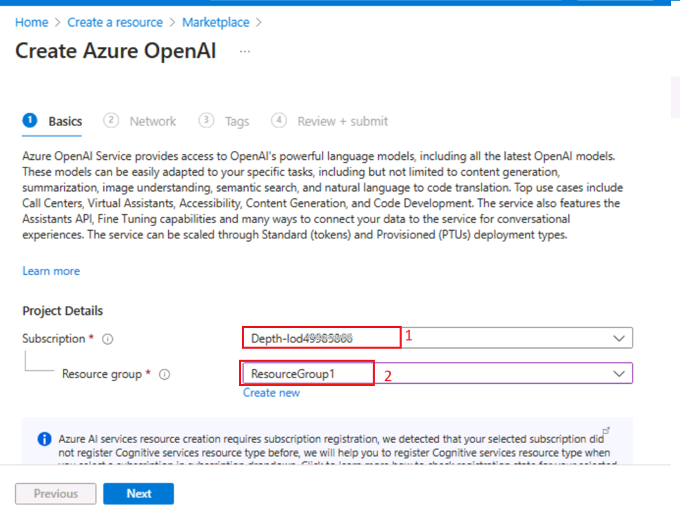
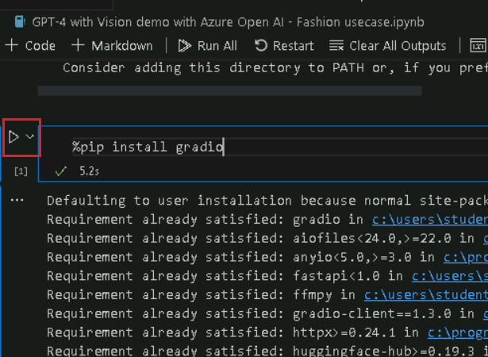
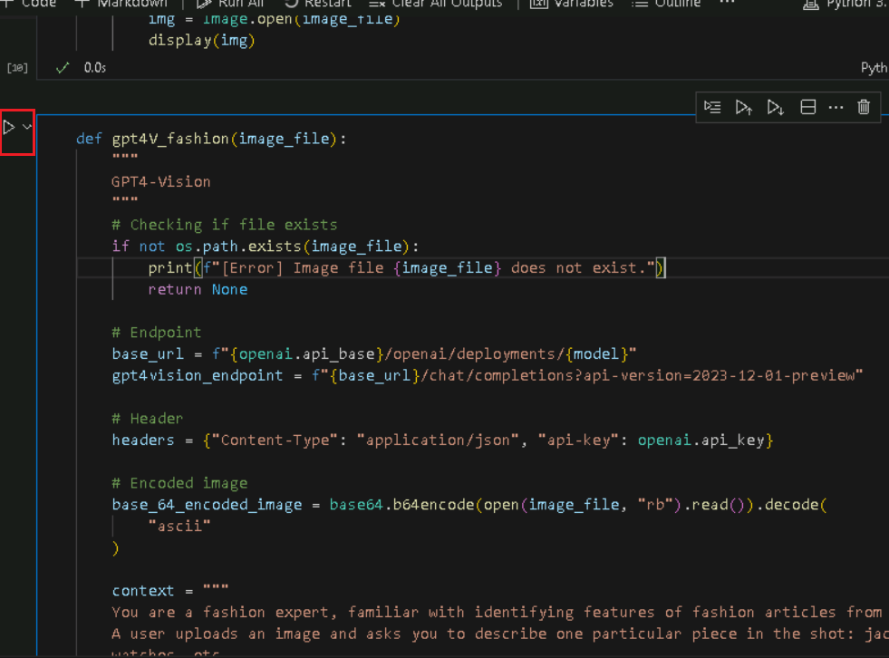
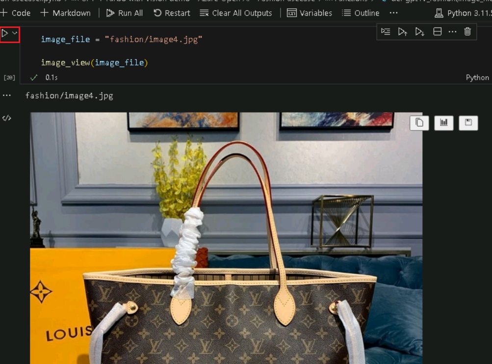
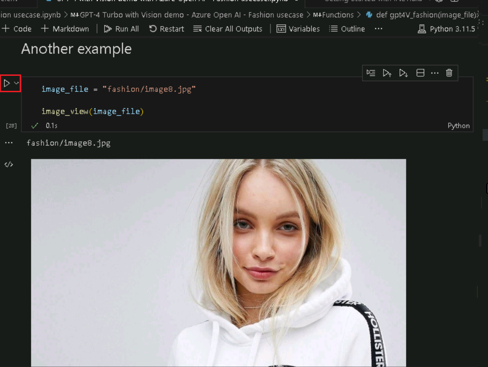

**用例 01 - 在 Azure OpenAI 上使用 GPT-4 Turbo 和 Vision
進行時尚趨勢分析**

**介紹：**

Azure OpenAI 服務上的 GPT-4 Turbo with Vision 現已推出公共預覽版。GPT-4
Turbo with Vision 是由 OpenAI 開發的大型多模態模型
（LMM），可以分析圖像並為有關圖像的問題提供文本回答。它結合了自然語言處理和視覺理解。在增強模式下，可以使用
Azure AI Vision 功能從圖像中生成其他見解

**目的：**

- 部署 Azure OpenAI 資源並對其進行配置。

- 部署特定的 Azure OpenAI 模型，如 GPT-4 Vision。

- 使用 Python、Jupyter Notebook 和所需的庫設置您的開發環境。

- 此用例與時尚用例相關。這些任務可能涉及圖像分析、文本生成或其他 AI
  任務。

## 任務 0：瞭解 VM 和憑據

在此任務中，我們將識別並瞭解我們將在整個實驗室中使用的憑證。

1.  **Instructions** 選項卡包含實驗室指南，其中包含在整個實驗室中要遵循的說明。

2.  **Resources** 選項卡已獲取執行實驗室所需的憑證。

    - **URL** – Azure 門戶的 URL

    - **Subscription （訂閱）** – 這是分配給您的訂閱的 ID

    - **用戶名** – 您需要用於登錄 Azure 服務的使用者 ID。

    - **Password （密碼）** – Azure
      登錄名的密碼。讓我們將此用戶名和密碼稱為 Azure
      登錄憑據。我們將在提及 Azure 登錄憑據的任何地方使用這些憑據。

    - **Resource Group （資源組）** – 分配給您的**資源組**。

\[!Alert\] **重要提示：**請確保在此資源組下創建所有資源

> 

3.  **Help （説明）** 選項卡包含 Support （支援） 資訊。此處的 **ID**
    值是將在實驗室執行期間使用的**實驗室實例 ID**。

> 

## 任務 1 ：註冊服務提供者

1.  打開流覽器，轉到 +++https://portal.azure.com+++，然後使用下面的
    Cloud Slice 帳戶登錄。

> 用戶名： <+++@lab.CloudPortalCredential> （User1） 的用戶名 +++
>
> 密碼： <+++@lab.CloudPortalCredential(User1).Password>+++
>
> 
>
> 

2.  按一下 **Subscriptions** 磁貼。

> 

3.  按一下訂閱名稱。

> 

4.  展開 設置 從左側導航菜單中。按一下“**資源提供程式**”，輸入
    +++**Microsoft.AlertsManagement+++** 並選擇
    i，t，然後按一下“**註冊**”。

5.  按一下 “**資源提供程式**” ，輸入
    +++**Microsoft.DBforPostgreSQL+++** 並選擇 i，t，然後按一下
    “**註冊**” 。

6.  重複步驟 \#10 和 \#11 以註冊以下資源提供程式。

- Microsoft.搜索

- Microsoft.Web 網站

- Microsoft.ManagedIdentity

## **任務 2：創建 Azure OpenAI 資源**

1.  在 Azure
    門戶中，按一下頁面左上角的三個水準條表示的**門戶菜單**，如下圖所示。

> 

2.  導航並按一下 **+ Create a resource**。

> 

3.  在 **Create a resource page**（創建資源頁面）的 **Search services
    and marketplace**（搜索服務和市場）搜索欄中，鍵入**Azure OpenAI**,
    然後按 **Enter** 按鈕。

> 

4.  在 **Marketplace** 頁面中，導航到 **Azure OpenAI**
    磁貼，按一下“**創建**”旁邊的 V V 形按鈕，然後導航並按一下 **Azure
    OpenAI**，如下圖所示。

> 

5.  在 **Create Azure OpenAI** 視窗的 **Basics**
    選項卡下，輸入以下詳細資訊，然後按一下 **Next** 按鈕。

    1.  **訂閱：**選擇分配的訂閱

    2.  **資源組：**：選擇分配的資源組

    3.  **區域：**在本實驗中，您將使用 **gpt-4-vision** 模型**。**
        此模型目前僅在某 [些區域](https://learn.microsoft.com/azure/ai-services/openai/concepts/models#embeddings-models)
        提供。請從此清單中選擇一個區域，在此實驗室中，**瑞典中部**將用於此資源。

    4.  **名你**: **aoai-gpt4-visionXXXXX** （XXXXX 可以是實驗室即時
        ID）

    5.  **定價層**：選擇**Standard S0**

> **注意：**要查找您的實驗室即時 ID，請選擇“幫助”並複製即時 ID。
>
> 
>
> 
>
> 

6.  在 **Network** 選項卡中，將所有選項按鈕保留為預設狀態，然後按一下
    **Next** 按鈕。

> 

7.  在 **Tags** 選項卡中，將所有欄位保留為預設狀態，然後按一下 **Next**
    按鈕。

> 

8.  在 **Review + submit** 選項卡中，驗證通過後，按一下 **Create**
    按鈕。

> 

9.  等待部署完成。部署大約需要 2-3 分鐘。

10. 在 **Microsoft.CognitiveServicesOpenAI** 視窗中，部署完成後，按一下
    **Go to resource** 按鈕。

> 

11. 按一下左側導航功能表中的**Keys and Endpoints**
    ，然後將記事本中的“終結點”值複製到 **AzureAI
    ENDPOINT**，將“金鑰”複製到變數 **AzureAIKey**。

> 

12. 在 **aoai-gpt4-visionXX** 視窗中，按一下左側導航功能表中的
    “**Overview**” ，向下滾動到“**Get Started**”磁貼，然後按一下“**Go to
    AzureOpenAI Studio**”按鈕，如下圖所示，在新流覽器中打開 **Azure
    OpenAI Studio**。

## **任務 3：部署 Azure OpenAI 模型 gpt-4-vision**

1.  在 **Azure AI Foundry** |**Azure Open AI Service**主頁，導航到
    “**Components” 部分**，然後按一下 “**Deployments**”。

2.  在 **Deployments** （部署） 視窗中，下拉 **+Deploy model**
    （部署模型），然後選擇 **Deploy base model**（部署基礎模型）。

3.  在 **Select a model** 對話方塊中，導航並仔細選擇
    **gpt-4**，然後按一下 **Confirm** 按鈕。

4.  在 **Deploy model gpt-4** 對話方塊的 **Deployment name**
    欄位下，確保 **gpt-4**，選擇 Deployment type 作為
    **Standard**，並選擇 Model ersion 作為 Vision- preview。然後按一下
    **Deploy** 按鈕。

## 任務 4：GPT-4 Turbo with Vision 演示

1.  在 Windows 搜索框中，鍵入 Visual Studio，然後按一下 **Visual Studio
    Code**。

> 

2.  在 **Visual Studio Code** 編輯器中，按一下
    **File**（檔），然後導航並按一下 **Open Folder**（打開資料夾）。

> 

3.  從 **C：\LabFiles** 導航並選擇 **GPT4V-Fashion** 資料夾，然後按一下
    “**Select Folder** ”按鈕。

4.  如果您看到一個對話方塊 - **Does you trust the authors of the files
    in this folder？**，然後按一下 **Yes， I trust the
    author**（是的，我信任作者）。

5.  在 Visual Studio Code 下拉清單中的 **Gpt 4V-FASHION** 中，按一下
    **azure.env** 文件。

1.  更新參數，替換 **Azure OpenAI Endpoint、Azure OpenAI
    Key（**您在**Task 1** 的記事本中保存的值）並保存檔。

2.  在 Visual Studio Code 下拉清單中，選擇 **GPT 4V-FASHION**，然後選擇
    **GPT-4 with Vision demo with Azure Open AI - Fashion
    usecase.ipynb** notebook。

> 

3.  在 Visual Studio Code 編輯器的主頁中，向下滾動到“**install
    requirements**”標題並運行第 1 個儲存格。如果系統提示選擇環境，請選擇
    **Python Environments**，如圖所示。

> 
>
> 

4.  如果系統提示選擇路徑，請選擇 **Python version 3.11.5**
    路徑，如圖所示。

> 

5.  如果您看到 Windows 安全警報對話方塊 - 然後按一下 **Allow access**。

> 
>
> 
>
> 
>
> 

6.  要重新開機 Jupyter 內核，請按一下 **Restart** 按鈕。

> 

7.  要導入庫，請選擇**第 4**
    個儲存格。然後，通過按一下**開始圖示**執行儲存格。

> 

8.  選擇**第 5** 個儲存格。然後，通過按一下**開始圖示**執行儲存格。

> 

9.  要檢查 OpenAI 的系統版本，請選擇**第 6** 、第 7 、第 8 和第 9
    個儲存格。然後，通過按一下**開始圖示**執行儲存格。

> 

10. 要載入配置值，請按一下 **Play** 按鈕選擇並執行**第 10** 、11 和 12
    個儲存格。

> 

11. 定義一個輔助函數來創建嵌入，通過按一下 **Play** 按鈕選擇並執行第 13
    個 .14th 儲存格。

> 
>
> 

12. 要運行該示例，請按一下 **Play** 按鈕，選擇並執行第 15 、16
    個儲存格。

> 
>
> 

13. 要運行該示例，請按一下 **Play** 按鈕選擇並執行**第 17 、18**
    個儲存格。

> 
>
> 

14. 要運行該示例，請按一下 Play 按鈕選擇並執行**第 19 、20** 個儲存格。

> 
>
> 

15. 要運行示例，請按一下 **Play** 按鈕，選擇並執行**第 21 、22**
    個儲存格。

> 
>
> 

16. 要運行該示例，請按一下 **Play** 按鈕選擇並執行**第 23 、24**
    個儲存格。

> 

17. 要運行該示例，請按一下 **Play** 按鈕選擇並執行**第 25 、26**
    個儲存格。

> 
>
> 

18. 要運行示例，請按一下 **Play** 按鈕選擇並執行**第 27 、28**
    個儲存格。

> 
>
> 

19. 要運行示例，請按一下 **Play** 按鈕選擇並執行**第 27 、28**
    個儲存格。

> 
>
> 

20. 要生成 WebApp，請按一下 **Play** 按鈕選擇並執行**第 29** 個儲存格。

> 

21. 要生成 WebApp，請按一下 **Play** 按鈕選擇並執行**第 30** 個儲存格。

> 

22. 成功部署應用程式後，您會在終端中看到一個 URL。複製 **URL**

23. 打開流覽器，導航到位址欄，粘貼 Public URL 連結。
    

24. 打開流覽器，導航到地址欄，粘貼本地 URL 連結。選擇任何項目

25. 按一下 **Submit** 按鈕。

> 

## 任務 5：刪除資源

1.  若要刪除存儲帳戶，請導航到 **Azure 門戶主頁**，按一下“**Resource
    groups**”。

> 

2.  按一下 **ResourceGroup1** 資源組。

> 

3.  在 **Resource group** （資源組） 主頁中，選擇**delete resource
    group**

4.  在右側顯示的 **Delete Resources** 窗格中，導航到 **Enter “resource
    group name**” **以確認刪除**欄位，然後按一下 **Delete** 按鈕。

5.  在 **Delete confirmation** 對話方塊中，按一下 **Delete** 按鈕。

> 

6.  按一下鈴鐺圖示，您將看到通知 – **Deleted resource group AOAI-RG89.**

**總結**

在此動手實驗中，參與者將使用 Azure OpenAI 深入研究高級 AI
功能。從設置基本的 Azure 資源開始，他們部署 GPT-4-vision 等 AI
模型。該實驗室專門探討了配備視覺功能的 GPT-4
如何徹底改變與時尚相關的任務——想想圖像識別、個性化風格推薦和趨勢分析。
