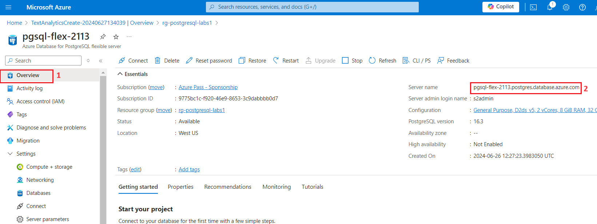
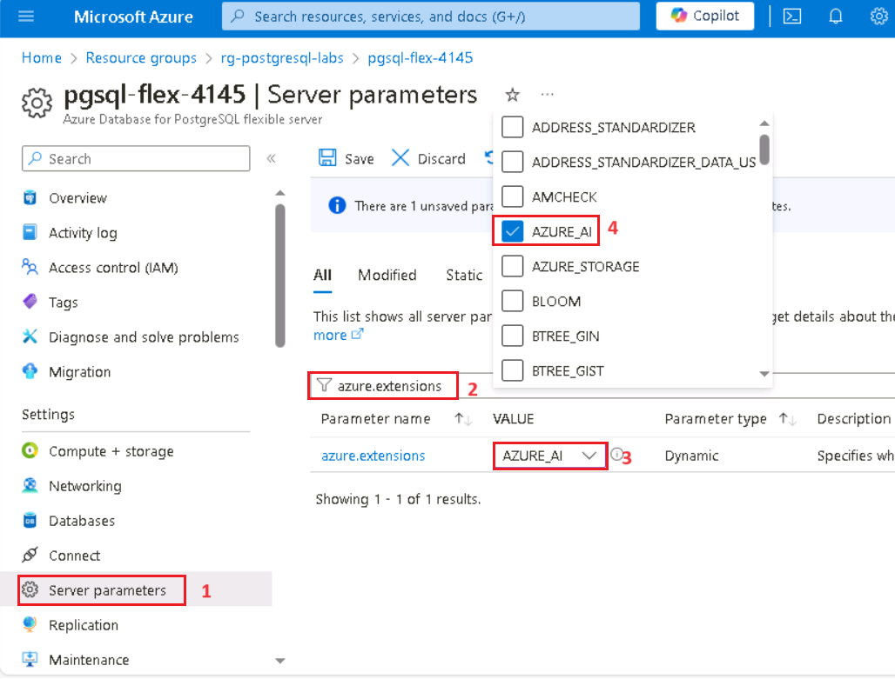
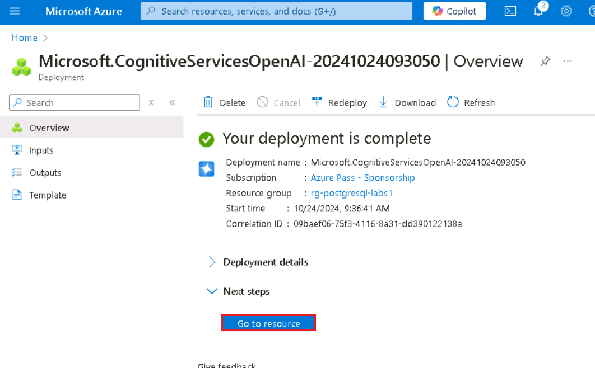
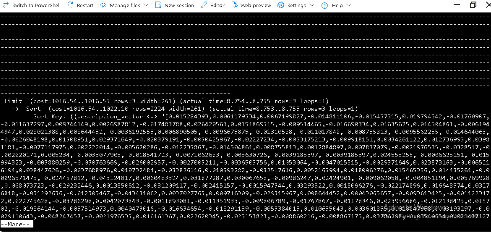
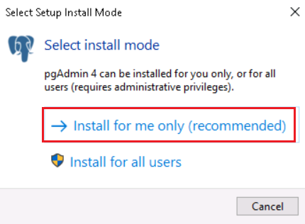
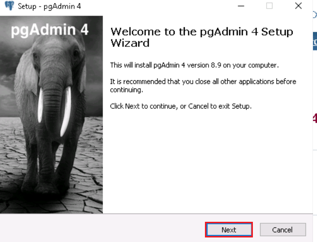
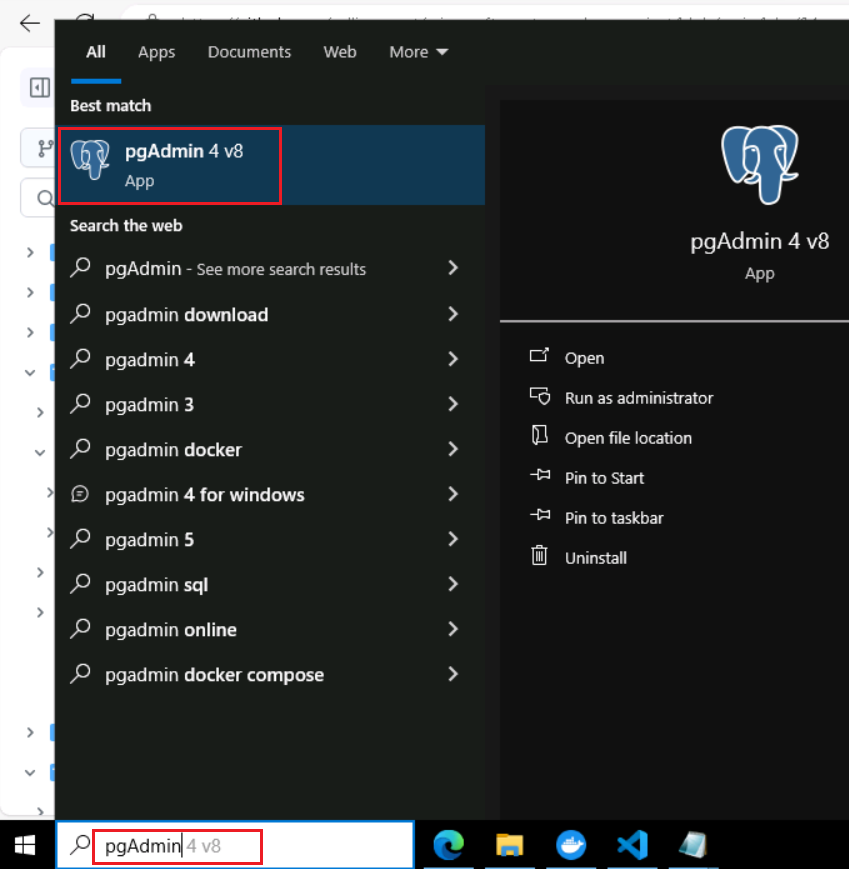
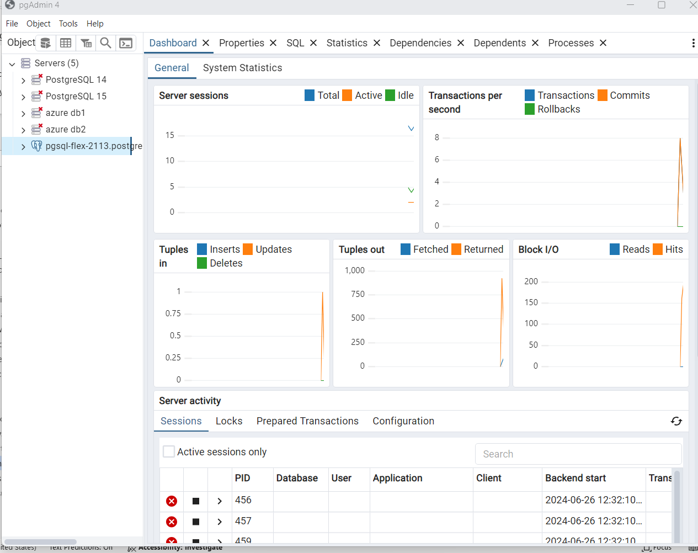

**介紹**

在本實驗中，您將學習如何將 Azure AI 服務與 PostgreSQL 集成，以使用高級
AI 功能增強您的資料庫。通過利用 Azure OpenAI 和 PostgreSQL 擴展（如
pgvector 和
PostGIS）的強大功能，您可以直接在資料庫中啟用複雜的文本分析、向量相似性搜索和地理空間查詢。此實驗室將指導你預配必要的
Azure 資源、配置資料庫以及執行將 AI
驅動的見解與地理空間資料相結合的複雜查詢。**目標**

- 預配和配置 Azure Database for PostgreSQL 靈活伺服器。

- 使用 Azure OpenAI 服務創建和管理向量嵌入。

- 執行向量相似性搜索以查找語義相似的文本資料。

- 利用 PostGIS 擴展進行地理空間資料分析。

- 集成 Azure AI 語言服務以進行情緒分析和其他認知功能。

- 使用索引和查詢規劃工具優化和分析查詢性能。

# 練習 1：預配 Azure Database for PostgreSQL 靈活伺服器

1.  

## 任務 1：預配 Azure Database for PostgreSQL 靈活伺服器

1.  打開流覽器，導航到位址欄，然後鍵入或粘貼以下 URL：
    +++https://portal.azure.com/+++，然後按 **Enter** 按鈕。

> 

2.  在 **Microsoft Azure** 視窗中，使用**使用者憑證**登錄 Azure。

3.  然後，輸入密碼並按一下**Sign in** 按鈕。

> 

4.  在**Stay signed in?** 視窗中，按一下**Yes** 按鈕。

> 

5.  選擇 Azure 門戶工具列中的 **Cloud Shell**
    圖示，在流覽器視窗頂部打開新的 Cloud Shell 窗格。

6.  首次打開 Cloud Shell 時，系統可能會提示您選擇要使用的 shell
    類型（**Bash** 或 **PowerShell**）。選擇 **Bash**。

7.  在“**Getting started**”對話方塊中，選擇“**Mount storage
    account**”，然後選擇你的 Azure 訂閱。點擊 **Apply** 按鈕。

8.  在 **Mount storage account** （裝載存儲帳戶） 對話方塊中，選擇 **we
    will create a storage account for you**
    （我們將為你創建存儲帳戶），然後按一下 **Next** （下一步） 按鈕。

> 
>
> 

1.  在 Cloud Shell
    提示符下，運行以下命令以定義用於創建資源的變數。這些變數表示要分配給資源組和資料庫的名稱，並指定應將資源部署到的
    Azure 區域。

2.  指定的資源組名稱為
    **rg-postgresql-labs**，但您可以提供要用於託管與此實驗室關聯的資源的任何名稱。

> **+++RG_NAME=ResourceGroup1**
>
> 

3.  在資料庫名稱中，將 {SUFFIX}
    權杖替換為唯一值（如您的姓名首字母縮寫），以確保資料庫伺服器名稱全域唯一。

> **+++DATABASE_NAME=pgsql-flex-{SUFFIX}+++**

4.  將 Region 替換為要用於實驗室資源的任何位置。在本實驗中，我們使用
    eastus

> **+++REGION=eastus2+++**

5.  通過運行以下 Azure CLI 命令，在上面創建的資源組中預配 Azure Database
    for PostgreSQL 資料庫實例（10 分鐘）

**az postgres flexible-server create --name $DATABASE_NAME --location
$REGION --resource-group $RG_NAME \\**

**--admin-user s2admin --admin-password Seattle123Seattle123
--database-name airbnb \\**

**--public-access 0.0.0.0-255.255.255.255 --version 16 \\**

**--sku-name Standard_D2s_v3 --storage-size 32 --yes**

## 任務 2：使用 Azure Cloud Shell 中的 psql 連接到資料庫

在此任務中，您將使用 Azure Cloud Shell 中的 psql
命令列實用程式連接到您的資料庫。

1.  打開流覽器，轉到 https://portal.azure.com 並使用 Azure
    訂閱帳戶登錄。

2.  在 Home （主頁） 上，按一下 **Resource Groups** （資源組）。

3.  按一下您的資源組名稱

> 

4.  在資源組中，選擇“**PostgreSQL Flexible Server**“資源

5.  在左側導航功能表中，選擇 **Settings** 下的 **Connect**。

6.  在 Azure 門戶的資料庫的 **Connect** 頁面中，選擇 **airbnb** 作為
    **Database name**，然後複製 **Connection details**
    塊並將其粘貼到記事本中，以便在即將到來的任務中使用這些資訊。

> 

7.  在 Azure Database for PostgresSQL
    主頁中，按一下左側導航功能表中的“**Overview**
    ”，複製“伺服器名稱”並將其放入記事本中，然後**保存**記事本以在即將到來的實驗室中使用這些資訊。

8.  在 Azure Database for PostgreSQL 主頁中，選擇 “設置” 下的
    “**Networking**”，然後選擇“**Allow public access to this resource
    through the internet using a public IP address**”。點擊 **Save**
    按鈕。

9.  選擇 Azure 門戶工具列中的 **Cloud Shell**
    圖示，在流覽器視窗頂部打開新的 Cloud Shell 窗格。

10. 將**連接詳細資訊**粘貼到 Cloud Shell 中。

11. 在 Cloud Shell 提示符下，將 **{your_password}**
    權杖替換為您在創建資料庫時分配給 **s2admin** 使用者的密碼，密碼應為
    **Seattle123Seattle123**。

> 

12. 通過在提示符處輸入以下內容，使用 psql
    命令列實用程式連接到您的資料庫：

> **+++psql+++**

從 Cloud Shell 連接到資料庫需要在資料庫的“**Networking**
”頁面上選中“允許從 Azure 中的任何 Azure
服務對伺服器進行公共訪問”框。如果您收到無法連接的消息，請確認是否已選中並重試。

## 任務 3：向資料庫添加資料

使用 psql 命令提示符，您將創建表並使用資料填充它們以供實驗室使用。

1.  運行以下命令以創建臨時表，用於從公共 blob 存儲帳戶導入 JSON 資料。

> !!CREATE TABLE temp_calendar (data jsonb);
>
> CREATE TABLE temp_listings (data jsonb);
>
> CREATE TABLE temp_reviews (data jsonb);!!

2.  使用 COPY 命令，使用公共存儲帳戶中 JSON 檔中的資料填充每個臨時表。

+++\COPY temp_calendar (data) FROM PROGRAM 'curl
https://solliancepublicdata.blob.core.windows.net/ms-postgresql-labs/calendar.json'+++

!!\COPY temp_listings (data) FROM PROGRAM 'curl
https://solliancepublicdata.blob.core.windows.net/ms-postgresql-labs/listings.json'!!

\COPY temp_reviews (data) FROM PROGRAM 'curl
https://solliancepublicdata.blob.core.windows.net/ms-postgresql-labs/reviews.json'

3.  運行以下命令，創建用於在此實驗室使用的形狀中存儲資料的表：

> CREATE TABLE listings (
>
> listing_id int,
>
> name varchar(50),
>
> street varchar(50),
>
> city varchar(50),
>
> state varchar(50),
>
> country varchar(50),
>
> zipcode varchar(50),
>
> bathrooms int,
>
> bedrooms int,
>
> latitude decimal(10,5),
>
> longitude decimal(10,5),
>
> summary varchar(2000),
>
> description varchar(2000),
>
> host_id varchar(2000),
>
> host_url varchar(2000),
>
> listing_url varchar(2000),
>
> room_type varchar(2000),
>
> amenities jsonb,
>
> host_verifications jsonb,
>
> data jsonb
>
> );
>
> 
>
> CREATE TABLE reviews (
>
> id int,
>
> listing_id int,
>
> reviewer_id int,
>
> reviewer_name varchar(50),
>
> date date,
>
> comments varchar(2000)
>
> );
>
> CREATE TABLE calendar (
>
> listing_id int,
>
> date date,
>
> price decimal(10,2),
>
> available boolean
>
> );
>
> 

4.  最後，運行以下 INSERT INTO 語句，將資料從臨時表載入到主表，將 JSON
    資料欄位中的資料提取到各個列中：

> INSERT INTO listings
>
> SELECT
>
> data\['id'\]::int,
>
> replace(data\['name'\]::varchar(50), '"', ''),
>
> replace(data\['street'\]::varchar(50), '"', ''),
>
> replace(data\['city'\]::varchar(50), '"', ''),
>
> replace(data\['state'\]::varchar(50), '"', ''),
>
> replace(data\['country'\]::varchar(50), '"', ''),
>
> replace(data\['zipcode'\]::varchar(50), '"', ''),
>
> data\['bathrooms'\]::int,
>
> data\['bedrooms'\]::int,
>
> data\['latitude'\]::decimal(10,5),
>
> data\['longitude'\]::decimal(10,5),
>
> replace(data\['description'\]::varchar(2000), '"', ''),
>
> replace(data\['summary'\]::varchar(2000), '"', ''),
>
> replace(data\['host_id'\]::varchar(50), '"', ''),
>
> replace(data\['host_url'\]::varchar(50), '"', ''),
>
> replace(data\['listing_url'\]::varchar(50), '"', ''),
>
> replace(data\['room_type'\]::varchar(50), '"', ''),
>
> data\['amenities'\]::jsonb,
>
> data\['host_verifications'\]::jsonb,
>
> data::jsonb
>
> FROM temp_listings;
>
> INSERT INTO reviews
>
> SELECT
>
> data\['id'\]::int,
>
> data\['listing_id'\]::int,
>
> data\['reviewer_id'\]::int,
>
> replace(data\['reviewer_name'\]::varchar(50), '"', ''),
>
> to_date(replace(data\['date'\]::varchar(50), '"', ''), 'YYYY-MM-DD'),
>
> replace(data\['comments'\]::varchar(2000), '"', '')
>
> FROM temp_reviews;
>
> INSERT INTO calendar
>
> SELECT
>
> data\['listing_id'\]::int,
>
> to_date(replace(data\['date'\]::varchar(50), '"', ''), 'YYYY-MM-DD'),
>
> data\['price'\]::decimal(10,2),
>
> replace(data\['available'\]::varchar(50), '"', '')::boolean
>
> FROM temp_calendar;

# 練習 2：將 Azure AI 和 Vector 擴展添加到允許列表

在本實驗中，您將使用 azure_ai 和 pgvector 擴展將generative AI 功能添加到
PostgreSQL
資料庫中。在本練習中，您將這些擴展添加到伺服器的允許列表中，如如何使用
PostgreSQL 擴展中所述。

1.  在 Home （主頁） 上，按一下 **Resource Groups** （資源組）。

2.  按一下您的資源組名稱

> 

3.  在資源組中，選擇“**PostgreSQL Flexible Server** “資源

4.  在資料庫的左側導航功能表中，選擇 “**設置**” 下的 **“Server
    parameters** ”，然後在搜索框中輸入 azure.extensions。展開 **VALUE**
    下拉清單，然後找到並選中以下每個副檔名旁邊的框：

    - AZURE_AI

    - POSTGIS（請注意，如果您完成了實驗 3，則已經檢查了此項。

    - 向量

5.  在工具列上選擇 **Save** （保存），這將觸發資料庫上的部署。

# 練習 3：創建 Azure OpenAI 資源

azure_ai 擴展需要基礎 Azure OpenAI
服務來創建向量嵌入。在本練習中，您將在 Azure 門戶中預配 Azure OpenAI
資源，並將嵌入模型部署到該服務中。

## 任務 1：預配 Azure OpenAI 服務

在此任務中，您將創建新的 Azure OpenAI 服務。

1.  在 Azure 門戶主頁中，按一下 **Azure 門戶功能表**，該功能表由
    Microsoft Azure 命令列左側的三個水準條表示，如下圖所示。

> 

2.  導航並按一下 **+ Create a resource**。

> 

3.  在 **Create a resource** page（創建資源頁面）的 **Search services
    and marketplace**（搜索服務和市場）搜索欄中，鍵入**Azure
    OpenAI**，然後按 **Enter** 按鈕。

> 

4.  在 “**市場**” 頁面中，導航到 **Azure OpenAI** 部分，按一下
    “創建”按鈕下拉清單，然後選擇 **Azure
    OpenAI**，如圖所示。（如果您已經按一下 **Azure OpenAI**
    磁貼，然後按一下 **Azure OpenAI 頁面**上的 “**Create** ”按鈕）。

> 

5.  在 Create Azure OpenAI **Basics** 選項卡上，輸入以下資訊，然後按一下
    **Next** 按鈕。

[TABLE]

> 

6.  在 **Network** 選項卡中，將所有選項按鈕保留為預設狀態，然後按一下
    **Next** 按鈕。

> 

7.  在 **Tags** 選項卡中，將所有欄位保留為預設狀態，然後按一下 **Next**
    按鈕。

> 

8.  在 **Review+submit** 選項卡中，驗證通過後，按一下 **Create** 按鈕。

9.  等待部署完成。部署大約需要 2-3 分鐘。

> **注意：**如果您看到一條消息，指出 Azure OpenAI
> 服務當前可通過申請表提供給客戶。尚未為服務啟用所選訂閱，並且沒有任何定價層的配額;您需要按一下連結以請求訪問
> Azure OpenAI 服務並填寫申請表。

## 任務 2：檢索 Azure OpenAI 服務的金鑰和Endpoint

1.  在資源的 **Overview** （概述） 頁面上，選擇 **Go to resource**
    （轉到資源） 按鈕。如果出現提示，請選擇實驗室憑據：

2.  在 **Azure OpenAI home** 視窗中，導航到 **Resource Management**
    部分，然後按一下 **Keys and Endpoints**。

3.  在 **Keys and Endpoints** （金鑰和終端節點） 頁面中，複製
    **KEY1、KEY 2** 和 **Endpoint**
    值並將其粘貼到記事本中，如下圖所示，然後**保存**記事本以在即將到來的任務中使用這些資訊。

***注：** 您可以使用 KEY1 或
KEY2。始終擁有兩個金鑰可以讓您安全地輪換和重新生成金鑰，而不會導致服務中斷。*

## 任務 3：部署嵌入模型

azure_ai 擴展允許從文本創建向量嵌入。要創建這些嵌入，需要在 Azure OpenAI
服務中部署文本嵌入-ada-002（版本 2）模型。在此任務中，您將使用 Azure
OpenAI Studio 創建可採用的模型部署。

1.  在 **Azure OpenAI** 頁面中，按一下左側導航功能表中的 “**Overview**
    ”，向下滾動並按一下“轉到 **Azure OpenAI Studio**”按鈕，如下圖所示。

> 
>
> 

2.  在 **Azure AI Foundry |Azure Open AI Service**主頁，導航到
    “**元件**” 部分，然後按一下 “**Deployments**” 。

3.  在 **Deployments** （部署） 視窗中，下拉 **+Deploy model**
    （部署模型），然後選擇 **Deploy base model** （部署基礎模型）

4.  在 “**Select a model**” 對話方塊中，導航並仔細選擇
    **text-embedding-ada-002** ，然後按一下 **Confirm** 按鈕。

4.  在 **Deploy model** （部署模型） 對話方塊中，設置以下內容，然後選擇
    **Create** （創建） 以部署模型。

    - **選擇模型：**從列表中選擇**text-embedding-ada-002。**

    - **模型版本：**確保選中**2 (Default)**。

    - **部署名稱：**輸入+++**embeddings**+++

> 
>
> 

5.  在“**部署**”窗口中，複製“**部署名稱**”並將其粘貼到記事本中（如圖所示），然後**保存**記事本以在即將到來的任務中使用這些資訊。

# 練習 4：安裝和配置 azure_ai 擴展

在本練習中，您將 azure_ai 擴展安裝到資料庫中，並將其配置為連接到 Azure
OpenAI 服務。

## 任務 1：使用 Azure Cloud Shell 中的 psql 連接到資料庫

在此任務中，您將使用 Azure Cloud Shell 中的 psql
命令列實用程式連接到您的資料庫。

1.  選擇 Azure 門戶工具列中的 **Cloud Shell**
    圖示，在流覽器視窗頂部打開新的 Cloud Shell 窗格。

2.  將 **Connection details** 粘貼到 Cloud Shell 中。

3.  在 Cloud Shell 提示符下，將 **{your_password}**
    權杖替換為您在創建資料庫時分配給 **s2admin** 使用者的密碼，密碼應為
    **Seattle123Seattle123**。

4.  通過在提示符處輸入以下內容，使用 psql
    命令列實用程式連接到您的資料庫：

> **!!psql!!**

## 任務 2：安裝 azure_ai 擴展

azure_ai 擴展允許您將 Azure OpenAI 和 Azure
認知服務集成到資料庫中。要在資料庫中啟用擴展，請執行以下步驟：

1.  通過在 psql
    命令提示符下運行以下命令，驗證擴展是否已成功添加到允許列表：

> **!!SHOW azure.extensions;!!**

2.  使用 CREATE EXTENSION 命令安裝 azure_ai 擴展。

> **!!CREATE EXTENSION IF NOT EXISTS azure_ai;!!**

## 任務 3：查看 azure_ai 擴展中包含的物件

查看 azure_ai
擴展中的物件可以更好地瞭解其功能。在此任務中，您將檢查擴展添加到資料庫的各種架構、使用者定義的函數
（UDF） 和複合類型。

1.  您可以在 **psql** 命令提示符下使用 \dx 元命令列出擴展中包含的物件。

> **+++\dx+ azure_ai+++**
>
> 
>
> 
>
> 元命令輸出顯示 azure_ai 擴展在資料庫中創建三個架構、多個使用者定義函數
> （UDF） 和多個複合類型。下表列出了擴展添加的架構，並描述了每個架構。

[TABLE]

2.  函數和類型都與其中一個架構相關聯。要查看 azure_ai
    架構中定義的函數，請使用 \df 元命令，指定應顯示其函數的架構。\df
    前面的 \x auto
    命令允許在必要時自動應用擴展顯示，以使命令的輸出更易於在 Azure Cloud
    Shell 中查看。

> **!!\x auto!!**
>
> **\df+ azure_ai.\***

azure_ai.set_setting（） 函數允許您設置 Azure AI
服務的端點和鍵值。它接受一個**鍵**和分配它的**值**。azure_ai.get_setting（）
函數提供了一種檢索您使用 set_setting（）
函數設置的值的方法。它接受您要查看的設置的**鍵**。對於這兩種方法，鍵必須是以下值之一：

## 任務 4：設置 Azure OpenAI endpoint和金鑰

在使用 azure_openai 函數之前，請將擴展配置為 Azure OpenAI
服務Endpoint和金鑰。

1.  在下麵的命令中，將 {endpoint} 和 {api-key} 權杖替換為從 Azure
    門戶檢索的值，然後從 Cloud Shell 窗格中的 psql
    命令提示符運行命令，以將值添加到配置表中。

> **!!SELECT
> azure_ai.set_setting('azure_openai.endpoint','{endpoint}');**
>
> **SELECT azure_ai.set_setting('azure_openai.subscription_key',
> '{api-key}');!!**

2.  使用以下查詢驗證配置表中寫入的設置：

> +++SELECT azure_ai.get_setting('azure_openai.endpoint');

SELECT azure_ai.get_setting('azure_openai.subscription_key');+++

azure_ai 擴展現已連接到你的 Azure OpenAI 帳戶，並準備好生成向量嵌入。

# 練習 5：使用 Azure OpenAI 生成向量嵌入

azure_ai 擴展的 azure_openai 架構使 Azure OpenAI
能夠為文本值創建向量嵌入。使用此架構，可以直接從資料庫使用 Azure OpenAI
生成嵌入，以創建輸入文本的向量表示形式，然後可以將其用於向量相似性搜索，並供機器學習模型使用。

嵌入是機器學習和自然語言處理 （NLP）
中的一個概念，涉及將物件（例如單詞、文檔或實體）表示為多維空間中的向量。嵌入允許機器學習模型評估相關資訊的緊密程度。這種技術可以有效地識別資料之間的關係和相似性，使演算法能夠識別模式並做出準確的預測。

## 任務 1：使用 pgvector 擴展啟用向量支援

azure_ai
擴展允許您為輸入文本生成嵌入。要使生成的向量與資料庫中的其餘資料一起存儲，您必須按照資料庫中的啟用向量支援文檔中的指導安裝
pgvector 擴展。

1.  使用 CREATE EXTENSION 命令安裝 pgvector 擴展。

> **!!CREATE EXTENSION IF NOT EXISTS vector;!!**
>
> 

2.  將 vector supported 添加到資料庫中後，使用 vector 資料類型向
    listings 表添加新列，以在表中存儲嵌入。text-embedding-ada-002
    模型生成具有 1536 個維度的向量，因此您必須指定 1536 作為向量大小。

> +++**ALTER TABLE listings**

**ADD COLUMN description_vector vector(1536);+++**

## 任務 2：生成和存儲向量嵌入

listings 表現在可以存儲嵌入了。使用 azure_openai.create_embeddings（）
函數，您可以為 description 欄位創建向量，並將它們插入到列表表中新創建的
description_vector 列中。

1.  在使用 create_embeddings（）
    函數之前，請運行以下命令來檢查它並查看所需的參數：

> **+++\df+ azure_openai.\*+++**

\df+ azure_openai. \* 命令輸出中的 Argument
資料類型屬性顯示函數所需的參數清單。

[TABLE]

2.  使用部署名稱，運行以下查詢以更新 listings 表中的每條記錄，並使用
    azure_openai.create_embeddings（） 函數將為 description
    欄位生成的向量嵌入插入到 description_vector 列中。將
    {your-deployment-name} 替換為您從 Azure OpenAI Studio
    **部署**頁面複製的**部署名稱**值。請注意，此查詢大約需要 5
    分鐘才能完成。

> **DO $$**
>
> **DECLARE counter integer := (SELECT COUNT(\*) FROM listings WHERE
> description \<\> '' AND description_vector IS NULL);**
>
> **DECLARE r record;**
>
> **BEGIN**
>
> **RAISE NOTICE 'Total descriptions to embed: %', counter;**
>
> **WHILE counter \> 0 LOOP**
>
> **BEGIN**
>
> **FOR r IN**
>
> **SELECT listing_id FROM listings WHERE description \<\> '' AND
> description_vector IS NULL**
>
> **LOOP**
>
> **BEGIN**
>
> **UPDATE listings**
>
> **SET description_vector =
> azure_openai.create_embeddings('{your-deployment-name}',
> description)**
>
> **WHERE listing_id = r.listing_id;**
>
> **EXCEPTION**
>
> **WHEN OTHERS THEN**
>
> **RAISE NOTICE 'Waiting 1 second before trying again...';**
>
> **PERFORM pg_sleep(1);**
>
> **END;**
>
> **counter := (SELECT COUNT(\*) FROM listings WHERE description \<\> ''
> AND description_vector IS NULL);**
>
> **IF counter % 25 = 0 THEN**
>
> **RAISE NOTICE 'Remaining descriptions to embed: %', counter;**
>
> **END IF;**
>
> **END LOOP;**
>
> **END;**
>
> **END LOOP;**
>
> **END;**
>
> **$$;!!**
>
> 
>
> 上述查詢使用 WHILE 迴圈從 listings 表中檢索記錄，其中
> description_vector 欄位為 null，並且 description
> 欄位不是空字串。然後，查詢嘗試使用 azure_openai.create_embeddings
> 函數使用 description 列的向量表示形式更新 description_vector
> 列。執行此更新時使用迴圈，以防止對創建嵌入函數的調用超過 Azure OpenAI
> 服務的調用速率限制。如果超出調用速率限制，您將在輸出中看到類似於以下內容的警告：
>
> **注意：** 等待 1 秒後再試一次......

> 

3.  您可以通過運行以下查詢來驗證是否已為所有清單記錄填充
    description_vector 列：

> **!!SELECT COUNT(\*) FROM listings WHERE description_vector IS NULL
> AND description \<\> '';!!**
>
> 查詢結果應為 count 0。

## 任務 3：執行向量相似性搜索

向量相似度是一種通過將兩個專案表示為向量（一系列數位）來衡量它們相似度的方法。向量通常用於使用
LLM
執行搜索。向量相似度通常使用距離度量計算，例如歐幾裡得距離或余弦相似度。歐幾裡得距離測量
n
維空間中兩個向量之間的直線距離，而余弦相似度測量兩個向量之間角度的余弦距離。每個嵌入都是一個浮點數向量，因此向量空間中兩個嵌入向量之間的距離與原始格式中兩個輸入之間的語義相似性相關。

1.  在執行向量相似性搜索之前，請使用 ILIKE
    子句運行以下查詢，以觀察使用自然語言查詢搜索記錄而不使用向量相似性的結果：

**!!SELECT listing_id, name, description FROM listings WHERE description
ILIKE '%Properties with a private room near Discovery Park%';!!**

> 該查詢返回零個結果，因為它嘗試將 description
> 欄位中的文本與提供的自然語言查詢進行匹配。

2.  現在，對列表表執行余弦相似性搜索查詢，以對列表描述執行向量相似性搜索。為輸入問題生成嵌入，然後轉換為向量陣列
    （：：vector），這允許將其與清單表中存儲的向量進行比較。將
    {your-deployment-name} 替換為您從 Azure OpenAI Studio
    **部署**頁面複製的**部署名稱**值。

> **!!SELECT listing_id, name, description FROM listings**
>
> **ORDER BY description_vector \<=\>
> azure_openai.create_embeddings('{your-deployment-name}', 'Properties
> with a private room near Discovery Park')::vector**
>
> **LIMIT 3;!!**

該查詢使用 \<=\>
向量運算子，該運算子表示用於計算多維空間中兩個向量之間距離的“余弦距離”運算子。

3.  使用 EXPLAIN ANALYZE
    子句再次運行相同的查詢，以查看查詢計畫和執行時間。將
    {your-deployment-name} 替換為您從 Azure OpenAI Studio
    **部署**頁面複製的**部署名稱**值。

> **!!EXPLAIN ANALYZE**
>
> **SELECT listing_id, name, description FROM listings**
>
> **ORDER BY description_vector \<=\>
> azure_openai.create_embeddings('{your-deployment-name}', 'Properties
> with a private room near Discovery Park')::vector**
>
> **LIMIT 3;!!**

在輸出中，請注意查詢計畫，它將以類似於以下內容的內容開頭：

> Limit (cost=1098.54..1098.55 rows=3 width=261) (actual
> time=10.505..10.507 rows=3 loops=1)
>
> -\> Sort (cost=1098.54..1104.10 rows=2224 width=261) (actual
> time=10.504..10.505 rows=3 loops=1)
>
> ...
>
> Sort Method: top-N heapsort Memory: 27kB
>
> -\> Seq Scan on listings (cost=0.00..1069.80 rows=2224 width=261)
> (actual time=0.005..9.997 rows=2224 loops=1)
>
> 查詢正在使用順序掃描排序來執行查找。計畫和執行時間將列在結果的末尾，並且應類似於以下內容：
>
> 規劃時間：62.020 ms
>
> 執行時間：10.530 ms

4.  為了更有效地搜索向量欄位，請使用余弦距離和 HNSW（Hierarchical
    Navigable Small World 的縮寫）在清單上創建索引。HNSW 允許 pgvector
    利用最新的基於圖形的演算法來近似最近鄰查詢。

> **!!CREATE INDEX ON listings USING hnsw (description_vector
> vector_cosine_ops);!!**

5.  要觀察 hnsw 索引對表的影響，請使用 EXPLAIN ANALYZE
    子句再次運行查詢，以比較查詢計畫和執行時間。將
    {your-deployment-name} 替換為您從 Azure OpenAI Studio
    **部署**頁面複製的**部署名稱**值。

> EXPLAIN ANALYZE
>
> SELECT listing_id, name, description FROM listings
>
> ORDER BY description_vector \<=\>
> azure_openai.create_embeddings('{your-deployment-name}', 'Properties
> with a private room near Discovery Park')::vector
>
> LIMIT 3;

在輸出中，請注意查詢計畫現在包含更高效的索引掃描：

Limit (cost=116.48..119.33 rows=3 width=261) (actual time=1.112..1.130
rows=3 loops=1)

-\> Index Scan using listings_description_vector_idx on listings
(cost=116.48..2228.28 rows=2224 width=261) (actual time=1.111..1.128
rows=3 loops=1)

查詢執行時間應反映計畫和運行查詢所花費的時間的顯著減少：

規劃時間：56.802 ms

執行時間：1.167 ms

# 練習 6：集成 Azure AI 服務

azure_ai 擴展的 azure_cognitive 架構中包含的 Azure AI
服務集成提供了一組豐富的 AI
語言功能，可直接從資料庫訪問。這些功能包括情感分析、語言檢測、關鍵短語提取、實體識別和文本摘要。這些功能是通過
Azure AI 語言服務啟用的。

若要查看可通過擴展訪問的 Azure AI 功能的完整列表，請查看將 Azure
Database for PostgreSQL 靈活伺服器與 Azure 認知服務集成文檔。

## 任務 1：預配 Azure AI 語言服務

需要 Azure AI 語言服務才能利用 azure_ai
擴展認知功能。在本練習中，您將創建一個 Azure AI 語言服務。

1.  在 Azure 門戶主頁中，按一下 **Azure 門戶功能表**，該功能表由
    Microsoft Azure 命令列左側的三個水準條表示，如下圖所示。

2.  在 **Create a resource** 頁面上，從左側功能表中選擇 AI + Machine
    Learning，然後選擇 **Language service**。

3.  在 **Select additional features** （選擇其他功能） 對話方塊中，選擇
    **Continue to create your resource**。

> 

4.  在 Create Language **Basics** （創建語言基礎）
    選項卡上，輸入以下內容：

[TABLE]

> 
>
> 

5.  預設設置將用於語言服務配置的其餘選項卡，因此請選擇 “**Review +
    create**” 按鈕。

6.  選擇 “**Review + create**
    ”選項卡上的“**create**”按鈕以預配語言服務。

> 

7.  語言服務部署完成後，在部署頁上選擇 “**Go to resource group**”。

## 任務 2：設置 Azure AI 語言服務Endpoint和金鑰

與 azure_openai 函數一樣，要使用 azure_ai 擴展成功調用 Azure AI
服務，您必須為 Azure AI 語言服務提供終端節點和金鑰。

1.  在 Language （語言） 主頁中，從左側導航功能表中選擇 **Resource
    Management** （資源管理） 下的 **Keys and Endpoint**
    （鍵和終端節點） 項。

2.  在 **Keys and Endpoints** （金鑰和終端節點） 頁面中，複製
    **KEY1、KEY 2** 和 **Endpoint**
    值並將其粘貼到記事本中，如下圖所示，然後**保存**記事本以在即將到來的任務中使用這些資訊。

3.  複製Endpoint和訪問金鑰值，然後在下面的命令中，將 {endpoint} 和
    {api-key} 權杖替換為從 Azure 門戶檢索的值。從 Cloud Shell 中的 psql
    命令提示符運行命令，以將您的值添加到配置表中。

> !!SELECT
> azure_ai.set_setting('azure_cognitive.endpoint','{endpoint}');
>
> SELECT azure_ai.set_setting('azure_cognitive.subscription_key',
> '{api-key}');!!

## 任務 3：分析評論的情緒

在此任務中，您將使用 azure_cognitive.analyze_sentiment
函數來評估Airbnb清單的評論。

1.  要使用 azure_ai 擴展中的 azure_cognitive 架構執行情緒分析，請使用
    analyze_sentiment 函數。運行以下命令以查看該函數：

> **!!\df azure_cognitive.analyze_sentiment!!**

輸出顯示函數的架構、名稱、結果資料類型和參數資料類型。此資訊有助於瞭解如何使用該功能。

2.  瞭解函數輸出的結果資料類型的結構也很重要，這樣才能正確處理其返回值。運行以下命令以檢查
    sentiment_analysis_result 類型：

> **+++\dT+ azure_cognitive.sentiment_analysis_result+++**

3.  上述命令的輸出顯示 sentiment_analysis_result
    類型是一個元組。要瞭解該元組的結構，請運行以下命令以查看
    sentiment_analysis_result 複合類型中包含的列：

> **!!\d+ azure_cognitive.sentiment_analysis_result!!**

該命令的輸出應類似於以下內容：

> Composite type "azure_cognitive.sentiment_analysis_result"
>
> Column | Type | Collation | Nullable | Default | Storage | Description
>
> ----------------+------------------+-----------+----------+---------+----------+-------------
>
> sentiment | text | | | | extended |
>
> positive_score | double precision | | | | plain |
>
> neutral_score | double precision | | | | plain |
>
> negative_score | double precision | | | | plain |

azure_cognitive.sentiment_analysis_result
是包含輸入文本的情緒預測的複合類型。它包括情緒，可以是積極的、消極的、中性的或混合的，以及文本中發現的積極、中立和消極方面的分數。分數表示為介於
0 和 1 之間的實數。例如，在 （neutral，0.26,0.64,0.09）
中，情緒是中性的，正分 0.26，中性分 0.64，負分 0.09。

4.  現在，您已經瞭解了如何使用擴展和返回類型的形狀來分析情緒，請執行以下查詢來查找絕大多數好評：

WITH cte AS (

SELECT id, azure_cognitive.analyze_sentiment(comments, 'en') AS
sentiment FROM reviews LIMIT 100

)

SELECT

id,

(sentiment).sentiment,

(sentiment).positive_score,

(sentiment).neutral_score,

(sentiment).negative_score,

comments

FROM cte

WHERE (sentiment).positive_score \> 0.98

LIMIT 10;

上述查詢使用通用表運算式或 CTE 來獲取 reviews
表中前三條記錄的情緒分數。然後，它從 CTE
中選擇情緒複合類型列，以從sentiment_analysis_result中提取各個值。

# 練習 7：執行最終查詢以將其全部聯繫在一起

在本練習中，您將連接到 pgAdmin
中的資料庫並執行最終查詢，該查詢將您的工作與實驗 3 和 4 中的
azure_ai、postgis 和 pgvector 擴展聯繫在一起。

## 任務 1：安裝pgAdmin

## 打開 Web 流覽器並導航到 ！！https://www.pgadmin.org/download/pgadmin-4-windows/!!

1.  按一下最新版本的 **pgAdmin**

2.  選擇 **pgadmin4-8.9-x64.exe**

3.  運行並安裝下載的檔

4.  在 Select Setup Install Mode 選項卡上，選擇**Install for me
    only(recommended)**

5.  按一下 **Next** 按鈕

6.  選擇 **I accept the agreement** 並按一下 **Next** 按鈕

7.  選擇路徑並按一下 **Next** 按鈕

8.  在 **Setup-pgAdmin 4** 視窗中，按一下 **Next** 按鈕

9.  點擊 **Install** 按鈕

10. 在 **Setup-pgAdmin 4** 視窗中，按一下 **Finish** 按鈕

## 任務 2：使用 pgAdmin 連接到資料庫

在此任務中，您將打開 pgAdmin 並連接到您的資料庫。

1.  在 Windows 搜索框中，鍵入 **pgAdmin**，然後按一下 **pgAdmin**

2.  通過按右鍵物件資源管理器中的 **Servers** 並選擇 **Register \>
    Server** 來註冊伺服器。

3.  在 “**註冊 - 伺服器**”對話方塊中，將 Azure Database for PostgreSQL
    靈活伺服器伺服器名稱（在練習 1\> 任務 1
    中保存的名稱）粘貼到“**常規**”選項卡上的“**名稱**”欄位中。

> 

4.  接下來，選擇 **Connection** 選項卡，並將您的伺服器名稱粘貼到
    **Hostname/address** 欄位中。在 **用戶名 欄**位中輸入
    **s2admin**，在 **密碼** 框中輸入 **Seattle123Seattle123**，然後選擇
    **保存密碼**。

> 

3.  最後，選擇 **Parameters** 選項卡並將 **SSL mode** 設置為
    **require**。選擇 **Save** 以註冊您的伺服器。

> 
>
> 

4.  連接到您的伺服器後，展開 **Databases** 節點並選擇 **airbnb**
    資料庫。按右鍵 **airbnb** 資料庫，然後從上下文功能表中選擇 **Query
    Tool**。

> 
>
> 

## 任務 3：驗證資料庫中是否安裝了 PostGIS 擴展

要在資料庫中安裝 postgis 擴展，您將使用 CREATE EXTENSION 命令。

1.  在上面打開的查詢視窗中，運行帶有 IF NOT EXISTS 子句的 CREATE
    EXTENSION 命令，以在資料庫中安裝 postgis 擴展。

> CREATE EXTENSION IF NOT EXISTS postgis;
>
> 
>
> 現在載入了 PostGIS
> 擴展，您就可以開始處理資料庫中的地理空間資料了。您在上面創建和填充的
> listings
> 表包含所有列出的屬性的緯度和經度。要將這些資料用於地理空間分析，必須更改
> listings 表以添加接受 point 資料類型的 geometry
> 列。這些新資料類型包含在 postgis 擴展中。

2.  要容納點數據，請向接受點數據的新 geometry
    列添加。將以下查詢複製並粘貼到打開的 pgAdmin 查詢視窗中：

> !!ALTER TABLE listings
>
> ADD COLUMN listing_location geometry(point, 4326);!!

3.  接下來，通過將 longitude 和 latitude 值添加到 geometry
    列中，使用與每個清單關聯的地理空間資料更新表。

> !!UPDATE listings
>
> SET listing_location = ST_SetSRID(ST_Point(longitude, latitude),
> 4326);!!

## 任務 4：執行查詢並在地圖上查看結果

您將在此任務中運行最終查詢，該查詢將您在實驗 3 和 4 中的工作聯繫起來。

1.  運行以下查詢，其中包含您在實驗 3 和 4 中使用的 azure_ai、pgvector 和
    PostGIS 擴展的元素。將 {your-deployment-name} 替換為您從 Azure
    OpenAI Studio **部署**頁面複製的**部署名稱**值。

> !!WITH listings_cte AS (
>
> SELECT l.listing_id, name, listing_location, summary FROM listings l
>
> INNER JOIN calendar c ON l.listing_id = c.listing_id
>
> WHERE ST_DWithin(
>
> listing_location,
>
> ST_GeomFromText('POINT(-122.410347 47.655598)', 4326),
>
> 0.025
>
> )
>
> AND c.date = '2016-01-13'
>
> AND c.available = 't'
>
> AND c.price \<= 75.00
>
> AND l.listing_id IN (SELECT listing_id FROM reviews)
>
> ORDER BY description_vector \<=\>
> azure_openai.create_embeddings('{your-deployment-name}', 'Properties
> with a private room near Discovery Park')::vector
>
> LIMIT 3
>
> ),
>
> sentiment_cte AS (
>
> SELECT r.listing_id, comments,
> azure_cognitive.analyze_sentiment(comments, 'en') AS sentiment
>
> FROM reviews r
>
> INNER JOIN listings_cte l ON r.listing_id = l.listing_id
>
> )
>
> SELECT
>
> l.listing_id,
>
> name,
>
> listing_location,
>
> summary,
>
> avg((sentiment).positive_score) as avg_positive_score,
>
> avg((sentiment).neutral_score) as avg_neutral_score,
>
> avg((sentiment).negative_score) as avg_negative_score
>
> FROM sentiment_cte s
>
> INNER JOIN listings_cte l on s.listing_id = l.listing_id
>
> GROUP BY l.listing_id, name, listing_location, summary;!!

2.  在 **Data Output** （資料輸出） 面板中，選擇查詢結果的
    listing_location 列中顯示的 **View all geometries in this column**
    （查看此列中的所有幾何圖形） 按鈕。

的 **View all geometries in this column** 按鈕將打開 **Geometry
Viewer**，允許您在地圖上查看查詢結果。

3.  選擇地圖上顯示的三個點之一，查看有關該位置的詳細資訊，包括該住宿所有評級的平均正面、中性和負面情緒得分。

## 任務 5：清理資源

完成這些實驗後，清理為這些實驗創建的所有資源至關重要。您需要為配置的容量付費，而不是為資料庫的使用量付費。要刪除您為此實驗室創建的資源組和所有資源，請按照以下說明作：

為避免產生不必要的 Azure
成本，如果不再需要這些資源，則應刪除在此快速入門中創建的資源。若要管理資源，可以使用
Azure 門戶。

1.  若要刪除存儲帳戶，請導航到 Azure 門戶主頁，按一下 “**Resource
    groups**”。

> 

2.  按一下已創建的資源組。

> 

3.  在 **Resource group** 主頁中，選擇 **delete resource group**。

4.  在右側顯示的 **Delete Resources** 窗格中，導航到 **Enter “resource
    group name” to confirm deletion** 欄位，然後按一下 **Delete** 按鈕。

5.  在 **Delete confirmation** 對話方塊中，按一下 **Delete** 按鈕。

> 

6.  按一下鈴鐺圖示，您將看到通知 –**Deleted resource group AOAI-RG89.**

**總結**

在本實驗中，您已成功將 Azure AI 服務與 PostgreSQL 集成，以創建支援 AI
的強大資料庫環境。您已開始預置 Azure 資源並使用必要的擴展配置 PostgreSQL
資料庫。然後，您為文本資料生成向量嵌入，並執行向量相似性搜索以查找語義相似的記錄。此外，你還利用
PostGIS 擴展進行地理空間資料分析，並使用 Azure AI
語言服務進行情緒分析。最後，您已使用索引優化了查詢並分析了其性能，從而展示了此集成解決方案用於高級資料分析的效率和功能。
