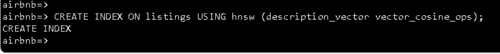

**Introduzione**

In questo lab imparerai come integrare i servizi di intelligenza
artificiale di Azure con PostgreSQL per migliorare il vostro database
con funzionalità avanzate di intelligenza artificiale. Sfruttando la
potenza delle estensioni Azure OpenAI e PostgreSQL, ad esempio pgvector
e PostGIS, è possibile abilitare analisi del testo sofisticate, ricerche
di somiglianza vettoriale e query geospaziali direttamente all'interno
del database. Questo lab illustra il provisioning delle risorse di Azure
necessarie, la configurazione del database e l'esecuzione di query
complesse che combinano informazioni dettagliate basate
sull'intelligenza artificiale con dati geospaziali.**Obiettivi**

- Per effettuare il provisioning e configurare Azure Database per
  PostgreSQL Flexible Server.

- Per creare e gestire gli incorporamenti vettoriali usando il servizio
  Azure OpenAI.

- Per eseguire ricerche di somiglianza vettoriale al fine di trovare
  dati di testo semanticamente simili.

- Per utilizzare l'estensione PostGIS per l'analisi dei dati
  geospaziali.

- Per integrare i servizi di Azure AI Language per l'analisi del
  sentiment e altre funzioni cognitive.

- Per ottimizzare e analizzare le prestazioni delle query utilizzando
  gli strumenti di indicizzazione e pianificazione delle query.

# Esercizio 1: Effettuare il provisioning di un Azure Database per PostgreSQL Flexible Server 

1.  

## Attività 1: Effettuare il provisioning di un Azure Database per PostgreSQL Flexible Server

1.  Aprire il browser, andare alla barra degli indirizzi e digitare o
    incollare il seguente URL: +++https://portal.azure.com/+++, quindi
    premere il pulsante **Enter**.

> 

2.  Nella finestra di **Microsoft Azure,** usare **User Credentials**
    per accedere ad Azure.

3.  Quindi, inserire la password e fare clic sul pulsante **Sign in.**

> 

4.  Nella finestra **Stay signed in?**, fare clic sul pulsante **Yes**.

> 

5.  Selezionare l'icona **Cloud Shell** nella barra degli strumenti del
    portale di Azure per aprire un nuovo [riquadro di Cloud
    Shell](https://learn.microsoft.com/azure/cloud-shell/overview) nella
    parte superiore della finestra del browser.

6.  La prima volta che si apre Cloud Shell, potrebbe essere richiesto di
    scegliere il tipo di shell che si desidera utilizzare (**Bash** o
    **PowerShell**). Selezionare **Bash**.

7.  Nella finestra di dialogo **Getting started.** Selezionare **Mount
    storage account** e selezionare la sottoscrizione di Azure. Fare
    clic sul pulsante **Apply.**

8.  Nella finestra di dialogo **Mount storage account,** selezionare
    **we will create a storage account for you** e fare clic sul
    pulsante **Next**.

> 
>
> 

1.  Al prompt di Cloud Shell eseguire i comandi seguenti per definire le
    variabili per la creazione di risorse. Le variabili rappresentano i
    nomi da assegnare al gruppo di risorse e al database e specificano
    l'area di Azure in cui devono essere distribuite le risorse.

2.  Il nome del gruppo di risorse specificato è **rg-postgresql-labs**,
    ma è possibile specificare qualsiasi nome che si vuole usare per
    ospitare le risorse associate a questo lab.

> **+++RG_NAME=ResourceGroup1 **

3.  Nel nome del database, sostituire il token {SUFFIX} con un valore
    univoco, ad esempio le iniziali, per assicurarsi che il nome del
    server del database sia univoco a livello globale.

> **+++DATABASE_NAME=pgsql-flex-{SUFFIX}+++ **

4.  Sostituire l'area con la posizione che si desidera utilizzare per le
    risorse del lab. In questo laboratorio stiamo usando eastus

> **+++REGION=eastus2+++  **

5.  Effettuare il provisioning di un'istanza del Azure Database per
    PostgreSQL database all'interno del gruppo di risorse creato in
    precedenza eseguendo il Azure CLI command seguente (10 min)

**az postgres flexible-server create --name $DATABASE_NAME --location
$REGION --resource-group $RG_NAME \\** 

> ** --admin-user s2admin --admin-password Seattle123Seattle123
> --database-name airbnb \\** 
>
> **--public-access 0.0.0.0-255.255.255.255 --version 16 \\** 
>
> **--sku-name Standard_D2s_v3 --storage-size 32 --yes ** 

## 

## Attività 2: Connettersi al database usando psql in Azure Cloud Shell

In questa attività si usa l'[utilità della riga di comando
psql](https://www.postgresql.org/docs/current/app-psql.html) di [Azure
Cloud Shell](https://learn.microsoft.com/azure/cloud-shell/overview) per
connettersi al database.

1.  Aprire un browser, passare a https://portal.azure.com e accedere con
    l'account della sottoscrizione di Azure.

2.  Nella home page, fare clic su **Resource Groups**.

3.  Fare clic sul nome del gruppo di risorse

> 

4.  Nel gruppo di risorse, selezionare **PostgreSQL Flexible Server**

5.  Nel menu di navigazione a sinistra, selezionare **Connect **in
    **Settings**.

6.  Dalla pagina **Connect** del database nel portale di Azure,
    selezionare **airbnb** per il **Database name**, quindi copiare il
    blocco **Connection details** e incollarlo nel blocco note per usare
    le informazioni nelle attività future.

> 

7.  Nella home page di Azure Database per PostgresSQL, fare clic su
    **Overview** nel menu di spostamento a sinistra e copiare il nome
    del server e inserirlo nel blocco note, quindi **salvare** il blocco
    note per usare le informazioni nel lab successivo.

8.  Nella home page di Azure Database per PostgreSQL selezionare
    **Networking** in **settings** e selezionare **Allow public access
    to this resource through the internet using a public IP address**.
    Fare clic sul pulsante **Save**.

9.  Selezionare l'icona **Cloud Shell** nella barra degli strumenti del
    portale di Azure per aprire un nuovo [riquadro di Cloud
    Shell](https://learn.microsoft.com/azure/cloud-shell/overview) nella
    parte superiore della finestra del browser.

10. Incollare **Connection details** in Cloud Shell.

11. Al prompt di Cloud Shell, sostituire il token **{your_password}**
    con la password assegnata all' utente **s2admin** durante la
    creazione del database, la password deve essere
    **Seattle123Seattle123.**

> 

12. Connettersi al database utilizzando l'utilità di psql command-line
    immettendo quanto segue al prompt:

> **+++psql+++**

Per la connessione al database da Cloud Shell è necessario che la
casella llow public access from any Azure service within Azure to the
server sia selezionata nella pagina **Networking **del database. Se
ricevi un messaggio che ti informa che non riesci a connetterti,
verifica che questa opzione sia selezionata e riprova.

## Attività 3: Aggiungere dati al database

Utilizzando il psql command prompt, si creeranno tabelle e le si
popolerà con i dati da utilizzare in laboratorio.

1.  Eseguire i comandi seguenti per creare tabelle temporanee per
    l'importazione di dati JSON da un account di archiviazione BLOB
    pubblico.

> !!CREATE TABLE temp_calendar (data jsonb); 
>
> CREATE TABLE temp_listings (data jsonb); 
>
> CREATE TABLE temp_reviews (data jsonb);!! 

2.  Usando il comando COPY, popolare ogni tabella temporanea con i dati
    dei file JSON in un account di archiviazione pubblico.

+++\COPY temp_calendar (data) FROM PROGRAM 'curl
https://solliancepublicdata.blob.core.windows.net/ms-postgresql-labs/calendar.json'+++ 

 

!!\COPY temp_listings (data) FROM PROGRAM 'curl
https://solliancepublicdata.blob.core.windows.net/ms-postgresql-labs/listings.json'!! 

\COPY temp_reviews (data) FROM PROGRAM 'curl
https://solliancepublicdata.blob.core.windows.net/ms-postgresql-labs/reviews.json' 

3.  Eseguire il comando seguente per creare le tabelle per
    l'archiviazione dei dati nella forma usata da questo lab:

> CREATE TABLE listings ( 
>
> listing_id int, 
>
> name varchar(50), 
>
> street varchar(50), 
>
> city varchar(50), 
>
> state varchar(50), 
>
> country varchar(50), 
>
> zipcode varchar(50), 
>
> bathrooms int, 
>
> bedrooms int, 
>
> latitude decimal(10,5),  
>
> longitude decimal(10,5),  
>
> summary varchar(2000), 
>
> description varchar(2000), 
>
> host_id varchar(2000), 
>
> host_url varchar(2000), 
>
> listing_url varchar(2000), 
>
> room_type varchar(2000), 
>
> amenities jsonb, 
>
> host_verifications jsonb, 
>
> data jsonb 
>
> ); 
>
> 
>
> CREATE TABLE reviews ( 
>
>     id int,  
>
>     listing_id int,  
>
>     reviewer_id int,  
>
>     reviewer_name varchar(50),  
>
>     date date, 
>
>     comments varchar(2000) 
>
> ); 
>
> CREATE TABLE calendar ( 
>
>     listing_id int,  
>
>     date date, 
>
>     price decimal(10,2),  
>
>     available boolean 
>
> ); 
>
>  
>
> 

4.  Infine, eseguire le istruzioni INSERT INTO seguenti per caricare i
    dati dalle tabelle temporanee alle tabelle principali, estraendo i
    dati dal campo dati JSON in singole colonne:

> INSERT INTO listings 
>
> SELECT  
>
>     data\['id'\]::int,  
>
>     replace(data\['name'\]::varchar(50), '"', ''), 
>
>     replace(data\['street'\]::varchar(50), '"', ''), 
>
>     replace(data\['city'\]::varchar(50), '"', ''), 
>
>     replace(data\['state'\]::varchar(50), '"', ''), 
>
>     replace(data\['country'\]::varchar(50), '"', ''), 
>
>     replace(data\['zipcode'\]::varchar(50), '"', ''), 
>
>     data\['bathrooms'\]::int, 
>
>     data\['bedrooms'\]::int, 
>
>     data\['latitude'\]::decimal(10,5), 
>
>     data\['longitude'\]::decimal(10,5), 
>
>     replace(data\['description'\]::varchar(2000), '"', ''),         
>
>     replace(data\['summary'\]::varchar(2000), '"', ''),         
>
>     replace(data\['host_id'\]::varchar(50), '"', ''), 
>
>     replace(data\['host_url'\]::varchar(50), '"', ''), 
>
>     replace(data\['listing_url'\]::varchar(50), '"', ''), 
>
>     replace(data\['room_type'\]::varchar(50), '"', ''), 
>
>     data\['amenities'\]::jsonb, 
>
>     data\['host_verifications'\]::jsonb, 
>
>     data::jsonb 
>
> FROM temp_listings; 
>
> INSERT INTO reviews 
>
> SELECT  
>
>     data\['id'\]::int, 
>
>     data\['listing_id'\]::int, 
>
>     data\['reviewer_id'\]::int, 
>
>     replace(data\['reviewer_name'\]::varchar(50), '"', ''),  
>
>     to_date(replace(data\['date'\]::varchar(50), '"', ''),
> 'YYYY-MM-DD'), 
>
>     replace(data\['comments'\]::varchar(2000), '"', '') 
>
> FROM temp_reviews; 
>
> INSERT INTO calendar 
>
> SELECT  
>
>     data\['listing_id'\]::int, 
>
>     to_date(replace(data\['date'\]::varchar(50), '"', ''),
> 'YYYY-MM-DD'), 
>
>     data\['price'\]::decimal(10,2), 
>
>     replace(data\['available'\]::varchar(50), '"', '')::boolean 
>
> FROM temp_calendar; 

# Esercizio 2: Aggiungere le estensioni di Azure AI e Vector all'elenco Consentiti

Nel corso di questo laboratorio, si usano le [estensioni
azure_ai](https://learn.microsoft.com/azure/postgresql/flexible-server/generative-ai-azure-overview)
e
[pgvector](https://learn.microsoft.com/azure/postgresql/flexible-server/how-to-use-pgvector)
per aggiungere funzionalità di intelligenza artificiale generativa al
database PostgreSQL. In questo esercizio, aggiungi queste estensioni
all'elenco Consentiti del tuo server, come descritto in [come utilizzare
le estensioni
PostgreSQL](https://learn.microsoft.com/azure/postgresql/flexible-server/concepts-extensions#how-to-use-postgresql-extensions).

1.  Nella home page, fare clic su **Resource Groups**.

2.  Fare clic sul nome del gruppo di risorse

> 

3.  Nel gruppo di risorse, selezionare la risorsa **PostgreSQL Flexible
    Server**

4.  Dal menu di spostamento a sinistra del database selezionare **Server
    parameters** in **Settings**, quindi immettere azure.extensions
    nella casella di ricerca. Espandere l'elenco a discesa **VALUE**,
    quindi individuare e selezionare la casella accanto a ciascuna delle
    seguenti estensioni:

    - AZURE_AI

    - POSTGIS (Nota che questo sarà già controllato se hai completato il
      lab 3.)

    - VECTOR 

5.  Selezionare **Save **sulla barra degli strumenti, che attiverà una
    distribuzione nel database.

# Esercizio 3: Creare una risorsa Azure OpenAI

L'estensione azure_ai richiede un servizio Azure OpenAI sottostante per
creare incorporamenti vettoriali. In questo esercizio si effettuerà il
provisioning di una risorsa Azure OpenAI nel portale di Azure e si
distribuirà un modello di incorporamento in tale servizio.

## Attività 1: Effettuare il provisioning di un servizio Azure OpenAI

In questa attività viene creato un nuovo servizio Azure OpenAI.

1.  Nella home page del portale di Azure fare clic sul menu del **Azure
    portal** rappresentato da tre barre orizzontali sul lato sinistro
    della barra dei comandi di Microsoft Azure, come illustrato
    nell'immagine seguente.

> 

2.  Navigare e fare clic su **+ Create a resource. **

> 

3.  Nella pagina **Create a resource**, nella barra di ricerca **Search
    services and marketplace,** digitare **Azure OpenAI**, quindi
    premere il pulsante **Enter**.

> 

4.  Nella pagina **Marketplace,** passare alla sezione **Azure OpenAI**,
    fare clic sull'elenco a discesa del pulsante **Create**, quindi
    selezionare **Azure OpenAI** come illustrato nell'immagine. (Nel
    caso in cui tu abbia già cliccato sul pulsante **Azure OpenAI**,
    quindi fare clic sul pulsante **Create** nella pagina **Azure
    OpenAI**).

> 

5.  Nella scheda Create Azure OpenAI **Basics,** immettere le
    informazioni seguenti e fare clic sul pulsante **Next**.

[TABLE]

> 

6.  Nella scheda **Network**, lasciare tutti i pulsanti di opzione nello
    stato predefinito e fare clic sul pulsante **Next**.

> 

7.  Nella scheda **Tag**, lasciare tutti i campi nello stato predefinito
    e fare clic sul pulsante **Next**.

> 

8.  Nella scheda **Review+submit**, una volta superata la convalida,
    fare clic sul pulsante **Create**.

9.  Attendere il completamento della distribuzione. L'implementazione
    richiederà circa 2-3 minuti.

> **Nota**: se viene visualizzato un messaggio che indica che il
> servizio Azure OpenAI è attualmente disponibile per i clienti tramite
> un modulo di richiesta. La sottoscrizione selezionata non è stata
> abilitata per il servizio e non dispone di una quota per i piani
> tariffari. sarà necessario fare clic sul collegamento per richiedere
> l'accesso al servizio Azure OpenAI e compilare il modulo di richiesta.

## Attività 2: Recuperare la chiave e l'endpoint del servizio Azure OpenAI

1.  Nella pagina **Panoramica** della risorsa**,** selezionare il
    pulsante **Go to resource**. Se richiesto, selezionare le
    credenziali del lab:

2.  Nella finestra **Azure OpenAI home,** passare alla sezione
    **Resource Management** e fare clic su **Keys and Endpoints**.

3.  Nella pagina **Keys and Endpoints,** copiare i valori **KEY1, KEY
    2** ed **Endpoint** e incollarli in un blocco note come illustrato
    nell'immagine seguente, quindi **salvare** il blocco note per usare
    le informazioni nelle attività future.

***Nota:** È possibile utilizzare KEY1 o KEY2. Avere sempre due chiavi
consente di ruotare e rigenerare le chiavi in modo sicuro senza causare
un'interruzione del servizio*.

## Attività 3: Distribuire un modello di incorporamento

L'estensione azure_ai consente la creazione di incorporamenti vettoriali
dal testo. Per creare questi incorporamenti è necessario un modello
text-embedding-ada-002 (versione 2) distribuito all'interno del servizio
Azure OpenAI. In questa attività si userà Azure OpenAI Studio per creare
una distribuzione del modello che è possibile usare.

1.  Nella pagina **Azure OpenAI,** fare clic su **Overview** nel menu di
    navigazione a sinistra, scorrere verso il basso e fare clic sul
    pulsante **Go to Azure OpenAI Studio** come illustrato nell'immagine
    seguente.

> 
>
> 

2.  Nel homepage di **Azure AI Foundry | Azure Open AI Service**,
    passare alla sezione **Components** e fare clic su **Deployments**.

3.  Nella finestra **Deployments,** visualizzare il modello **+Deploy
    model** e selezionare **Deploy base model **

4.  Nella finestra di dialogo **Select a model**, navigare e selezionare
    attentamente **text-embedding-ada-002**, quindi fare clic sul
    pulsante **Confirm**.

4.  Nella finestra di dialogo ** Deploy model**, impostare quanto segue
    e selezionare **Create **per distribuire il modello.

    - **Select a model**: scegliere **text-embedding-ada-002**
      dall'elenco.

    - **Model version**: assicurarsi che sia selezionato **2
      (predefinito**).

    - **Deployment name**: Immettere +++**embeddings**+++

> 
>
> 

5.  Nella finestra **Deployments**, copiare **Deployment name** e
    incollarlo in un blocco note (come mostrato nell'immagine), quindi
    **salvare** il blocco note per utilizzare le informazioni
    nell'attività successiva.

# Esercizio 4: Installare e configurare l'estensione azure_ai

In questo esercizio si installa l' estensione azure_ai nel database e la
si configura per la connessione al servizio Azure OpenAI.

## Attività 1: Connettersi al database usando psql in Azure Cloud Shell

In questa attività si usa l'utilità di psql command-line di Azure Cloud
Shell per connettersi al database.

1.  Selezionare l'icona **Cloud Shell** nella barra degli strumenti del
    portale di Azure per aprire un nuovo [riquadro di Cloud
    Shell](https://learn.microsoft.com/azure/cloud-shell/overview) nella
    parte superiore della finestra del browser.

2.  Incollare **Connection details** in Cloud Shell.

3.  Al prompt di Cloud Shell, sostituire il token **{your_password}**
    con la password assegnata all' utente **s2admin** durante la
    creazione del database, la password deve essere
    **Seattle123Seattle123.**

4.  Connettersi al database utilizzando l'utilità della
    psql command-line immettendo quanto segue al prompt:

> **!! psql!!**

## Attività 2: Installare l'estensione azure_ai

L'estensione azure_ai consente di integrare Azure OpenAI e Azure
Cognitive Services nel database. Per abilitare l'estensione nel tuo
database, procedi nel seguente modo:

1.  Verificare che l'estensione sia stata aggiunta correttamente
    all'elenco Consentiti eseguendo quanto segue dal psql command
    prompt:

> **!! SHOW azure.extensions;!!**

2.  Installare l'estensione azure_ai utilizzando il [comando CREATE
    EXTENSION](https://www.postgresql.org/docs/current/sql-createextension.html).

> **!!CREATE EXTENSION IF NOT EXISTS azure_ai;!! **

## 

## Attività 3: Esaminare gli oggetti contenuti nell'estensione azure_ai

La revisione degli oggetti all'interno dell'estensione azure_ai può
fornire una migliore comprensione delle sue funzionalità. In questa
attività vengono esaminati i vari schemi, le funzioni definite
dall'utente e i tipi compositi aggiunti al database dall'estensione.

1.  È possibile utilizzare il
    [[\dx meta-command](https://www.postgresql.org/docs/current/app-psql.html#APP-PSQL-META-COMMAND-DX-LC)](https://www.postgresql.org/docs/current/app-psql.html#APP-PSQL-META-COMMAND-DX-LC)
    dal prompt dei **psql **command per elencare gli oggetti contenuti
    all'interno dell'estensione.

> **+++\dx+ azure_ai+++**
>
> 
>
> 
>
> L'output del meta-comando mostra che l'estensione azure_ai crea tre
> schemi, più funzioni definite dall'utente (UDF) e diversi tipi
> compositi nel database. Nella tabella seguente sono elencati gli
> schemi aggiunti dall'estensione e vengono descritti ciascuno di essi.

[TABLE]

2.  Le funzioni e i tipi sono tutti associati a uno degli schemi. Per
    rivedere le funzioni definite nello schema azure_ai, utilizzare il
    meta-comando \df, specificando lo schema le cui funzioni devono
    essere visualizzate. Il comando \x auto che precede \df consente di
    applicare automaticamente la visualizzazione espansa quando
    necessario per semplificare la visualizzazione dell'output del
    comando in Azure Cloud Shell.

> **!! \x auto!!**
>
> **\df+ azure_ai.\***

La funzione azure_ai.set_setting() consente di impostare i valori
dell'endpoint e della chiave per i servizi di intelligenza artificiale
di Azure. Accetta una **chiave** e il **valore** da assegnare. La
funzione azure_ai.get_setting() fornisce un modo per recuperare i valori
impostati con la funzione set_setting(). Accetta la **chiave**
dell'impostazione che si desidera visualizzare. Per entrambi i metodi,
la chiave deve essere una delle seguenti:

## Attività 4: Impostare l'endpoint e la chiave di Azure OpenAI

Prima di usare le funzioni azure_openai, configurare l'estensione per
l'endpoint e la chiave del servizio Azure OpenAI.

1.  Nel comando seguente sostituire i token {endpoint} e {api-key} con i
    valori recuperati dal portale di Azure, quindi eseguire i comandi
    dal prompt dei comandi psql nel riquadro Cloud Shell per aggiungere
    i valori alla tabella di configurazione.

> **!!SELECT
> azure_ai.set_setting('azure_openai.endpoint','{endpoint}'); **
>
> **SELECT azure_ai.set_setting('azure_openai.subscription_key',
> '{api-key}');!! **

2.  Verificare le impostazioni scritte nella tabella di configurazione
    utilizzando le query seguenti:

> +++SELECT azure_ai.get_setting('azure_openai.endpoint'); 
>
>            SELECT
> azure_ai.get_setting('azure_openai.subscription_key');+++

L'estensione azure_ai è ora connessa all'account Azure OpenAI ed è
pronta per generare incorporamenti vettoriali.

# Esercizio 5: Generare incorporamenti vettoriali con Azure OpenAI

Lo schema di azure_openai dell'estensione azure_ai consente ad Azure
OpenAI di creare incorporamenti vettoriali per i valori di testo. Usando
questo schema, è possibile [generare incorporamenti con Azure
OpenAI](https://learn.microsoft.com/azure/ai-services/openai/how-to/embeddings)
direttamente dal database per creare rappresentazioni vettoriali del
testo di input, che possono quindi essere usate nelle ricerche di
somiglianza vettoriale, nonché utilizzate dai modelli di Machine
Learning.

[Gli
incorporamenti](https://learn.microsoft.com/azure/postgresql/flexible-server/generative-ai-overview#embeddings)
sono un concetto dell'apprendimento automatico e dell'elaborazione del
linguaggio naturale (NLP) che prevede la rappresentazione di oggetti,
come parole, documenti o entità, come
[vettori](https://learn.microsoft.com/azure/postgresql/flexible-server/generative-ai-overview#vectors)
in uno spazio multidimensionale. Gli incorporamenti consentono ai
modelli di apprendimento automatico di valutare la stretta correlazione
delle informazioni. Questa tecnica identifica in modo efficiente le
relazioni e le somiglianze tra i dati, consentendo agli algoritmi di
identificare modelli e fare previsioni accurate.

## Attività 1: Abilitare il supporto vettoriale con l'estensione pgvector

L'estensione azure_ai consente di generare incorporamenti per il testo
di input. Per consentire l'archiviazione dei vettori generati insieme al
resto dei dati nel database, è necessario installare l'estensione
pgvector seguendo le indicazioni riportate nella documentazione relativa
al [supporto del vettore di
abilitazione](https://learn.microsoft.com/azure/postgresql/flexible-server/how-to-use-pgvector#enable-extension).

1.  Installare l'estensione pgvector utilizzando il comando [CREATE
    EXTENSION](https://www.postgresql.org/docs/current/sql-createextension.html).

> **!!CREATE EXTENSION IF NOT EXISTS vector;!!** 
>
> 

2.  Con il vettore supportato aggiunto al database, aggiungere una nuova
    colonna alla tabella degli elenchi utilizzando il tipo di dati
    vector per memorizzare gli incorporamenti all'interno della tabella.
    Il modello text-embedding-ada-002 produce vettori con dimensioni
    1536, quindi è necessario specificare 1536 come dimensione del
    vettore.

> +++**ALTER TABLE listings** 

**           ADD COLUMN description_vector vector(1536);+++** 

## Attività 2: Generare e memorizzare gli embedding vettoriali

La tabella listings è ora pronta per memorizzare gli incorporamenti.
Utilizzando la funzione azure_openai.create_embeddings(), si creano
vettori per il campo description e li si inserisce nella colonna
description_vector appena creata nella tabella listings.

1.  Prima di utilizzare la funzione create_embeddings(), eseguire il
    comando seguente per esaminarla ed esaminare gli argomenti
    richiesti:

> **+++\df+ azure_openai.\*+++**

La proprietà Argument data types nell'output del comando \df+
azure_openai.\* rivela l'elenco di argomenti previsti dalla funzione.

[TABLE]

2.  Utilizzando il nome della distribuzione, eseguire la seguente query
    per aggiornare ogni record nella tabella listings, inserendo gli
    incorporamenti vettoriali generati per il campo description nella
    colonna description_vector utilizzando la funzione
    azure_openai.create_embeddings(). Sostituire {your-deployment-name}
    con il valore **Deployment name** copiato dalla pagina Azure OpenAI
    Studio **Deployments**. Si noti che il completamento di questa query
    richiede circa cinque minuti.

> **DO $$** 
>
>  
>
> **DECLARE counter integer := (SELECT COUNT(\*) FROM listings WHERE
> description \<\> '' AND description_vector IS NULL);** 
>
> **DECLARE r record;** 
>
> **BEGIN** 
>
> **    RAISE NOTICE 'Total descriptions to embed: %', counter;** 
>
> **    WHILE counter \> 0 LOOP** 
>
> **        BEGIN** 
>
> **            FOR r IN** 
>
> **                SELECT listing_id FROM listings WHERE description
> \<\> '' AND description_vector IS NULL** 
>
> **            LOOP** 
>
> **                BEGIN** 
>
> **                    UPDATE listings** 
>
> **                    SET description_vector =
> azure_openai.create_embeddings('{your-deployment-name}',
> description)** 
>
> **                    WHERE listing_id = r.listing_id;** 
>
> **                EXCEPTION** 
>
> **                    WHEN OTHERS THEN** 
>
> **                        RAISE NOTICE 'Waiting 1 second before trying
> again...';** 
>
> **                        PERFORM pg_sleep(1);** 
>
> **                END;** 
>
> **                counter := (SELECT COUNT(\*) FROM listings WHERE
> description \<\> '' AND description_vector IS NULL);** 
>
> **                IF counter % 25 = 0 THEN** 
>
> **                    RAISE NOTICE 'Remaining descriptions to embed:
> %', counter;** 
>
> **                END IF;** 
>
> **            END LOOP;** 
>
> **        END;** 
>
> **    END LOOP;** 
>
> **END;** 
>
> **$$;!!** 
>
> 
>
> La query precedente utilizza un ciclo WHILE per recuperare i record
> dalla tabella listings in cui il campo description_vector è null e il
> campo description non è una stringa vuota. La query tenta quindi di
> aggiornare la colonna description_vector con una rappresentazione
> vettoriale della colonna description usando la funzione
> azure_openai.create_embeddings. Il ciclo viene usato durante
> l'esecuzione di questo aggiornamento per evitare che le chiamate per
> creare la funzione di incorporamento superino il limite di frequenza
> delle chiamate del servizio Azure OpenAI. Se il limite di velocità
> delle chiamate viene superato, nell'output verranno visualizzati
> avvisi simili ai seguenti:
>
> **AVVISO**: Attendere 1 secondo prima di riprovare...

> 

3.  È possibile verificare che la colonna description_vector sia stata
    compilata per tutti i record di listings eseguendo la query
    seguente:

> **!!SELECT COUNT(\*) FROM listings WHERE description_vector IS NULL
> AND description \<\> '';!!**
>
> Il risultato della query dovrebbe essere un conteggio pari a 0.

## Attività 3: Eseguire una ricerca di somiglianza vettoriale

La somiglianza vettoriale è un metodo utilizzato per misurare la
somiglianza di due elementi rappresentandoli come vettori, una serie di
numeri. I vettori sono spesso utilizzati per eseguire ricerche
utilizzando gli LLM. La somiglianza vettoriale è comunemente calcolata
utilizzando metriche di distanza, come la distanza euclidea o la
somiglianza del coseno. La distanza euclidea misura la distanza in linea
retta tra due vettori nello spazio n-dimensionale, mentre la somiglianza
del coseno misura il coseno dell'angolo tra due vettori. Ogni
incorporamento è un vettore di numeri in virgola mobile, quindi la
distanza tra due incorporamenti nello spazio vettoriale è correlata alla
somiglianza semantica tra due input nel formato originale.

1.  Prima di eseguire una ricerca di somiglianza vettoriale, eseguire la
    query seguente utilizzando la clausola ILIKE per osservare i
    risultati della ricerca di record utilizzando una query in
    linguaggio naturale senza utilizzare la somiglianza vettoriale:

> **!!SELECT listing_id, name, description FROM listings WHERE
> description ILIKE '%Properties with a private room near Discovery
> Park%';!!** 

> La query restituisce zero risultati perché sta tentando di far
> corrispondere il testo nel campo della descrizione con la query in
> linguaggio naturale fornita.

2.  A questo punto, eseguire una [query di ricerca
    di](https://learn.microsoft.com/azure/ai-services/openai/concepts/understand-embeddings#cosine-similarity)
    somiglianza del coseno sulla tabella degli listings per eseguire una
    ricerca di somiglianza vettoriale sulle descrizioni degli elenchi.
    Gli incorporamenti vengono generati per una domanda di input e
    quindi inseriti in un array vettoriale (::vector), che consente di
    confrontarlo con i vettori memorizzati nella tabella degli listings.
    Sostituire {your-deployment-name} con il valore del **Deployment
    name** copiato dalla pagina Azure OpenAI Studio **Deployments**.

> **!!SELECT listing_id, name, description FROM listings** 
>
> **ORDER BY description_vector \<=\>
> azure_openai.create_embeddings('{your-deployment-name}', 'Properties
> with a private room near Discovery Park')::vector** 
>
> **LIMIT 3;!!** 

La query utilizza l'operatore
\<=\> [vector](https://github.com/pgvector/pgvector#vector-operators),
che rappresenta l'operatore di "distanza del coseno" utilizzato per
calcolare la distanza tra due vettori in uno spazio multidimensionale.

3.  Eseguire nuovamente la stessa query utilizzando la clausola EXPLAIN
    ANALYZE per visualizzare i tempi di pianificazione ed esecuzione
    delle query. Sostituire {your-deployment-name} con il valore del
    **Deployment name** copiato dalla pagina Azure OpenAI
    Studio **Deployments**.

> **!!EXPLAIN ANALYZE** 
>
> **SELECT listing_id, name, description FROM listings** 
>
> **ORDER BY description_vector \<=\>
> azure_openai.create_embeddings('{your-deployment-name}', 'Properties
> with a private room near Discovery Park')::vector** 
>
> **LIMIT 3;!!** 

Nell'output si noti il piano di query, che inizierà con qualcosa di
simile a:

> Limit  (cost=1098.54..1098.55 rows=3 width=261) (actual
> time=10.505..10.507 rows=3 loops=1) 
>
>    -\>  Sort  (cost=1098.54..1104.10 rows=2224 width=261) (actual
> time=10.504..10.505 rows=3 loops=1) 
>
>  
>
> ... 
>
>  
>
> Sort Method: top-N heapsort  Memory: 27kB 
>
>     -\>  Seq Scan on listings  (cost=0.00..1069.80 rows=2224
> width=261) (actual time=0.005..9.997 rows=2224 loops=1) 
>
> La query utilizza un ordinamento di scansione sequenziale per eseguire
> la ricerca. I tempi di pianificazione ed esecuzione saranno elencati
> alla fine dei risultati e dovrebbero essere simili ai seguenti:
>
> Planning Time: 62.020 ms 
>
> Execution Time: 10.530 ms 

4.  Per consentire una ricerca più efficiente sul campo vettoriale,
    creare un indice sulle inserzioni utilizzando la distanza del coseno
    e [HNSW](https://github.com/pgvector/pgvector#hnsw), che è
    l'abbreviazione di Hierarchical Navigable Small World. HNSW consente
    a pgvector di utilizzare i più recenti algoritmi basati su grafici
    per approssimare le query più vicine.

> **!!CREATE INDEX ON listings USING hnsw (description_vector
> vector_cosine_ops);!!** 

5.  Per osservare l'impatto dell'indice hnsw sulla tabella, eseguire
    nuovamente la query con la clausola EXPLAIN ANALYZE per confrontare
    i tempi di pianificazione ed esecuzione della query. Sostituire
    {your-deployment-name} con il valore del **Deployment name** copiato
    dalla pagina Azure OpenAI Studio **Deployments**.

> EXPLAIN ANALYZE 
>
> SELECT listing_id, name, description FROM listings 
>
> ORDER BY description_vector \<=\>
> azure_openai.create_embeddings('{your-deployment-name}', 'Properties
> with a private room near Discovery Park')::vector 
>
> LIMIT 3; 

Nell'output si noti che il piano di query include ora un'analisi
dell'indice più efficiente:

Limit  (cost=116.48..119.33 rows=3 width=261) (actual time=1.112..1.130
rows=3 loops=1) 

   -\>  Index Scan using listings_description_vector_idx on listings 
(cost=116.48..2228.28 rows=2224 width=261) (actual time=1.111..1.128
rows=3 loops=1) 

I tempi di esecuzione della query devono riflettere una riduzione
significativa del tempo necessario per pianificare ed eseguire la query:

Planning Time: 56.802 ms 

Execution Time: 1.167 ms 

# Esercizio 6: Integrare Azure AI Services

Le integrazioni dei servizi di Azure AI incluse nello schema di
azure_cognitive dell'estensione azure_ai offrono un set completo di
funzionalità del linguaggio di intelligenza artificiale accessibili
direttamente dal database. Le funzionalità includono l'analisi del
sentiment, il rilevamento della lingua, l'estrazione di frasi chiave, il
riconoscimento di entità e il riassunto del testo. Queste funzionalità
sono abilitate tramite il [servizio Azure AI
Language](https://learn.microsoft.com/azure/ai-services/language-service/overview).

Per esaminare l'elenco completo delle funzionalità di Azure AI
accessibili tramite l'estensione, visualizzare la [documentazione Azure
Database for PostgreSQL Flexible Server con [Azure Cognitive
Services](https://learn.microsoft.com/azure/postgresql/flexible-server/generative-ai-azure-cognitive)](https://learn.microsoft.com/azure/postgresql/flexible-server/generative-ai-azure-cognitive)
.

## Attività 1: Effettuare il provisioning di un servizio di Azure AI Language

È necessario un [servizio Azure AI
Language](https://learn.microsoft.com/azure/ai-services/language-service/overview)
per sfruttare le funzioni cognitive delle estensioni azure_ai. In questo
esercizio verrà creato un servizio di Azure AI Language.

1.  Nella home page del portale di Azure fare clic sul **menu del Azure
    portal** rappresentato da tre barre orizzontali sul lato sinistro
    della barra dei comandi di Microsoft Azure, come illustrato
    nell'immagine seguente.

2.  Nella pagina **Create a resource** selezionare AI + Machine Learning
    dal menu a sinistra, quindi selezionare **Language service**.

3.  Nella finestra di dialogo **Select additional features,**
    selezionare **Continue to create your resource**.

> 

4.  Nella scheda Create Language **Basics**, immettere quanto segue:

[TABLE]

> 
>
> 

5.  Le impostazioni predefinite verranno usate per le schede rimanenti
    della configurazione del servizio di linguaggio, quindi selezionare
    il pulsante **Review + create**.

6.  Selezionare il pulsante **Create **nella scheda **Review + create**
    per effettuare il provisioning del servizio di linguaggio.

> 

7.  Al termine della distribuzione della distribuzione, selezionare **Go
    to resource group** nella pagina di distribuzione.

## Attività 2: Impostare l'endpoint e la chiave del servizio di Azure AI Language 

## Come per le funzioni azure_openai, per effettuare correttamente chiamate ai servizi di Azure AI usando l' estensione azure_ai, è necessario fornire l'endpoint e una chiave per il servizio di Azure AI Language.

1.  Nella home page di Language, selezionare la voce **Keys and
    Endpoint** in **Resource Management** dal menu di spostamento a
    sinistra.

2.  Nella pagina **Keys and Endpoints,** copiare i valori **KEY1, KEY
    2** ed **Endpoint** e incollarli in un blocco note come illustrato
    nell'immagine seguente, quindi **salvare** il blocco note per usare
    le informazioni nelle attività future.

3.  Copiare i valori dell'endpoint e della chiave di accesso, quindi nel
    comando seguente sostituire i token {endpoint} e {api-key} con i
    valori recuperati dal portale di Azure. Eseguire i comandi dal
    prompt dei comandi psql in Cloud Shell per aggiungere i valori alla
    tabella di configurazione.

> !!SELECT
> azure_ai.set_setting('azure_cognitive.endpoint','{endpoint}'); 
>
> SELECT azure_ai.set_setting('azure_cognitive.subscription_key',
> '{api-key}');!! 

## 

## Attività 3: Analizzare il sentiment delle recensioni

In questa attività, utilizzerai la funzione
azure_cognitive.analyze_sentiment per valutare le recensioni degli
annunci Airbnb.

1.  Per eseguire l'analisi del sentiment utilizzando lo schema
    azure_cognitive nell'estensione azure_ai, utilizzare la funzione
    analyze_sentiment. Eseguire il comando seguente per rivedere quella
    funzione:

> **!!\df azure_cognitive.analyze_sentiment!! **

L'output mostra lo schema, il nome, il tipo di dati dei risultati e i
tipi di dati degli argomenti della funzione. Queste informazioni aiutano
a comprendere come utilizzare la funzione.

2.  È inoltre essenziale comprendere la struttura del tipo di dati dei
    risultati emessi dalla funzione in modo da poter gestire
    correttamente il valore restituito. Eseguire il comando seguente per
    esaminare il tipo di sentiment_analysis_result:

> **+++\dT+ azure_cognitive.sentiment_analysis_result+++ **

3.  L'output del comando precedente rivela che il tipo
    sentiment_analysis_result è una tupla. Per comprendere la struttura
    di tale tupla, eseguire il comando seguente per esaminare le colonne
    contenute all'interno del tipo composito sentiment_analysis_result:

> **!!\d+ azure_cognitive.sentiment_analysis_result!! **

L'output di tale comando dovrebbe essere simile al seguente:

> Composite type "azure_cognitive.sentiment_analysis_result" 
>
>      Column     |       Type       | Collation | Nullable | Default |
> Storage  | Description  
>
> ----------------+------------------+-----------+----------+---------+----------+------------- 
>
>  sentiment      | text             |           |          |         |
> extended |  
>
>  positive_score | double precision |           |          |         |
> plain    |  
>
>  neutral_score  | double precision |           |          |         |
> plain    |  
>
>  negative_score | double precision |           |          |         |
> plain    | 

azure_cognitive.sentiment_analysis_result è un tipo composito contenente
le previsioni del sentiment del testo di input. Include il sentiment,
che può essere positivo, negativo, neutro o misto, e i punteggi per gli
aspetti positivi, neutri e negativi presenti nel testo. I punteggi sono
rappresentati come numeri reali compresi tra 0 e 1. Ad esempio, in
(neutro,0,26,0,64,0,09), il sentiment è neutro con un punteggio positivo
di 0,26, neutro di 0,64 e negativo a 0,09.

4.  Ora che hai capito come analizzare il sentiment utilizzando
    l'estensione e la forma del tipo restituito, esegui la seguente
    query che cerca recensioni estremamente positive:

WITH cte AS ( 

    SELECT id, azure_cognitive.analyze_sentiment(comments, 'en') AS
sentiment FROM reviews LIMIT 100 

) 

SELECT 

    id, 

    (sentiment).sentiment, 

    (sentiment).positive_score, 

    (sentiment).neutral_score, 

    (sentiment).negative_score, 

    comments 

FROM cte 

WHERE (sentiment).positive_score \> 0.98 

LIMIT 10; 

La query precedente usa un'espressione di tabella comune o CTE per
ottenere i punteggi di valutazione per i primi tre record nella tabella
reviews. Quindi seleziona le colonne di tipo composito del sentiment
dalla CTE per estrarre i singoli valori dalla sentiment_analysis_result.

# Esercizio 7: Esecuzione di una query finale per collegare il tutto 

In questo esercizio, ci si connette al database in **pgAdmin** e si
esegue una query finale che collega il lavoro con le estensioni
azure_ai, postgis e pgvector nei lab 3 e 4.

## Attività 1: Installare pgAdmin

1.  Aprire un browser web e andare a
    !!https://www.pgadmin.org/download/pgadmin-4-windows/!!

2.  Cliccare sull'ultima versione di **pgAdmin**

3.  Selezionare **pgadmin4-8.9-x64.exe**

4.  Eseguire e installare il file scaricato

5.  Nella scheda **Select Setup Install Mode**, selezionare **Install
    for me only(recommended) **

6.  Fare clic sul pulsante **Next**

7.  Selezionare l'opzione **I accept the agreement** e cliccare sul
    pulsante **Next**

8.  Selezionare il percorso e fare clic sul pulsante **Next**

9.  Nella finestra **Setup-pgAdmin 4**, fare clic sul pulsante **Next**

10. Fare clic sul pulsante **Install**

11. Nella finestra **Setup-pgAdmin 4**, fare clic sul pulsante
    **Finish**

## Attività 2: Connettersi al database utilizzando pgAdmin

In questa attività, aprirai pgAdmin e ti connetterai al tuo database.

1.  Nella casella di ricerca di Windows, digitare **pgAdmin**, quindi
    fare clic su **pgAdmin**

2.  Registrare il server facendo clic con il pulsante destro del mouse
    su **Servers** in Object Explorer e scegliendo ** Register \>
    Server**.

3.  Nella finestra di dialogo ** Register – Server,** incollare il nome
    del server del Azure Database for PostgreSQL Flexible Server
    (salvato nell'Esercizio 1\> Attività 1) nel campo Name della scheda
    **General**.

> 

4.  Quindi, selezionare la scheda **Connection **e incollare il nome del
    tuo server nel campo **ostname/address**. Immettere **s2admin** nel
    campo **Username**, immettere **Seattle123Seattle123** nella casella
    **Password** e, facoltativamente, selezionare **Save password**.

> 

3.  Infine, selezionare la scheda **Parameters **e impostare **SSL
    mode** su **require**. Selezionare **Save **per registrare il
    server.

> 
>
> 

4.  Una volta connesso al tuo server, espandere il nodo **Databases** e
    selezionare il database di **airbnb**. Fare clic con il pulsante
    destro del mouse sul database di **airbnb** e selezionare **uery
    Tool** dal menu contestuale.

> 
>
> 

## Task 3: Verificare che l'estensione PostGIS sia installata nel database

Per installare l'estensione postgis nel tuo database, utilizzerai il
comando CREATE EXTENSION.

1.  Nella finestra di query che hai aperto sopra, eseguire il comando
    CREATE EXTENSION con la clausola IF NOT EXISTS per installare
    l'estensione postgis nel tuo database.

> CREATE EXTENSION IF NOT EXISTS postgis; 
>
> 
>
> Con l'estensione PostGIS ora caricata, sei pronto per iniziare a
> lavorare con i dati geospaziali nel database. La tabella
> listings creata e compilata in precedenza contiene la latitudine e la
> longitudine di tutte le proprietà elencate. Per utilizzare questi dati
> per l'analisi geospaziale, è necessario modificare la tabella
> listings per aggiungere una colonna geometry che accetti il tipo di
> dati punto. Questi nuovi tipi di dati sono inclusi nell'estensione
> postgis.

2.  Per contenere i dati point, aggiungere una nuova colonna geometry
    alla tabella che accetta i dati point. Copiare e incollare la
    seguente query nella finestra di query pgAdmin aperta:

> !!ALTER TABLE listings 
>
> ADD COLUMN listing_location geometry(point, 4326);!!

3.  Successivamente, aggiornare la tabella con i dati geospaziali
    associati a ciascun elenco aggiungendo i valori di longitudine e
    latitudine nella colonna geometry.

> !!UPDATE listings 
>
> SET listing_location = ST_SetSRID(ST_Point(longitude, latitude),
> 4326);!!

## Attività 4: Esecuzione di una query e visualizzazione dei risultati su una mappa

In questa attività viene eseguita una query finale che collega il lavoro
tra i lab 3 e 4.

1.  Eseguire la query seguente che incorpora elementi delle estensioni
    azure_ai, pgvector e PostGIS con cui hai lavorato nei lab 3 e 4.
    Sostituire {your-deployment-name} con il valore **del  Deployment
    name** copiato dalla pagina Azure OpenAI Studio **Deployments**.

> !!WITH listings_cte AS ( 
>
>     SELECT l.listing_id, name, listing_location, summary FROM listings
> l 
>
>     INNER JOIN calendar c ON l.listing_id = c.listing_id 
>
>     WHERE ST_DWithin( 
>
>         listing_location, 
>
>         ST_GeomFromText('POINT(-122.410347 47.655598)', 4326), 
>
>         0.025 
>
>     ) 
>
>     AND c.date = '2016-01-13' 
>
>     AND c.available = 't' 
>
>     AND c.price \<= 75.00 
>
>     AND l.listing_id IN (SELECT listing_id FROM reviews) 
>
>     ORDER BY description_vector \<=\>
> azure_openai.create_embeddings('{your-deployment-name}', 'Properties
> with a private room near Discovery Park')::vector 
>
>     LIMIT 3 
>
> ), 
>
> sentiment_cte AS ( 
>
>     SELECT r.listing_id, comments,
> azure_cognitive.analyze_sentiment(comments, 'en') AS sentiment 
>
>     FROM reviews r 
>
>     INNER JOIN listings_cte l ON r.listing_id = l.listing_id 
>
> ) 
>
> SELECT 
>
>     l.listing_id, 
>
>     name, 
>
>     listing_location, 
>
>     summary, 
>
>     avg((sentiment).positive_score) as avg_positive_score, 
>
>     avg((sentiment).neutral_score) as avg_neutral_score, 
>
>     avg((sentiment).negative_score) as avg_negative_score 
>
> FROM sentiment_cte s 
>
> INNER JOIN listings_cte l on s.listing_id = l.listing_id 
>
> GROUP BY l.listing_id, name, listing_location, summary;!! 

2.  Nel pannello **Data Output**, selezionare il pulsante **View all
    geometries in this column** visualizzato nella colonna
    listing_location dei risultati della query.

Il pulsante **View all geometries in this column** apre il **Geometry
Viewer**, che consente di visualizzare i risultati della query su una
mappa.

3.  Selezionare uno dei tre punti visualizzati sulla mappa per
    visualizzare i dettagli sulla posizione, inclusi i punteggi medi di
    valutazione positivi, neutri e negativi in tutte le valutazioni
    della proprietà.

## Attività 5: Pulire le risorse 

È fondamentale ripulire tutte le risorse create per questi lab una volta
completate. Viene addebitato il costo della capacità configurata, non la
quantità di utilizzo del database. Per eliminare il gruppo di risorse e
tutte le risorse create per questo lab, seguire le istruzioni seguenti:

Per evitare di incorrere in costi di Azure non necessari, è
consigliabile eliminare le risorse create in questa guida introduttiva
se non sono più necessarie. Per gestire le risorse, è possibile usare il
[portale di Azure](https://portal.azure.com/?azure-portal=true).

1.  Per eliminare l'account di archiviazione, passare alla pagina
    **Azure portal Home**, fare clic su **Resource groups**.

> 

2.  Fare clic sul gruppo di risorse creato.

> 

3.  Nella home page del **Resource group,** selezionare **Delete
    resource group.**

4.  Nel riquadro **Delete Resources** visualizzato sul lato destro,
    andare al campo **Enter “resource group name” to confirm deletion**,
    quindi fare clic sul pulsante **Delete**.

5.  Nella finestra di dialogo **Delete confirmation**, fare clic sul
    pulsante **Delete**.

> 

6.  Fare clic sull'icona a forma di campana, vedrai la notifica –
    **Deleted resource group AOAI-RG89.**

**Sommario**

In questo lab sono stati integrati correttamente i servizi di Azure AI
con PostgreSQL per creare un potente ambiente di database abilitato per
l'intelligenza artificiale. Si è iniziato effettuando il provisioning
delle risorse di Azure e configurando il database PostgreSQL con le
estensioni necessarie. Sono stati quindi generati incorporamenti
vettoriali per i dati testuali ed eseguite ricerche di somiglianza
vettoriale per trovare record semanticamente simili. Inoltre, è stata
usata l'estensione PostGIS per l'analisi dei dati geospaziali e il
servizio Azure AI Language per l'analisi del sentiment. Infine, hai
ottimizzato le tue query utilizzando l'indicizzazione e analizzato le
loro prestazioni, dimostrando l'efficienza e la capacità di questa
soluzione integrata per l'analisi avanzata dei dati.
