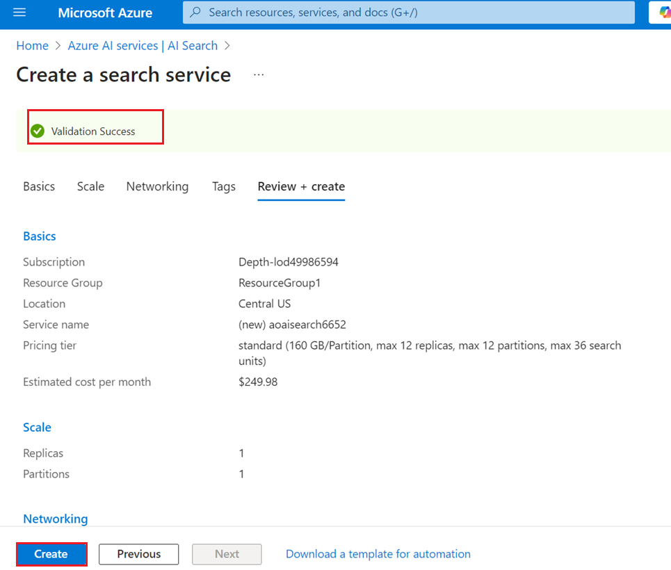
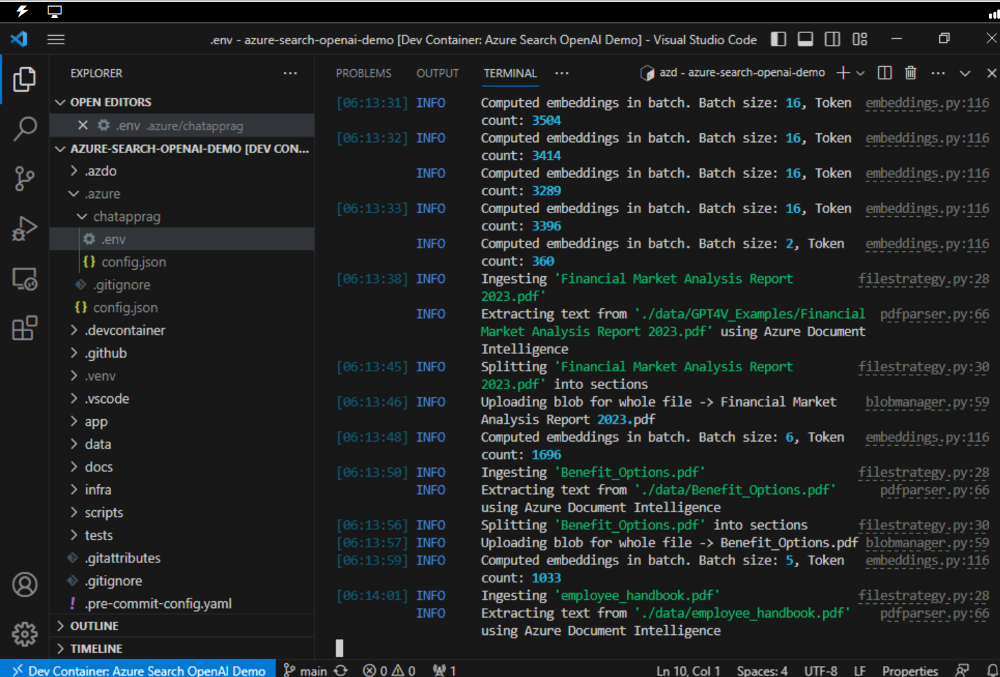
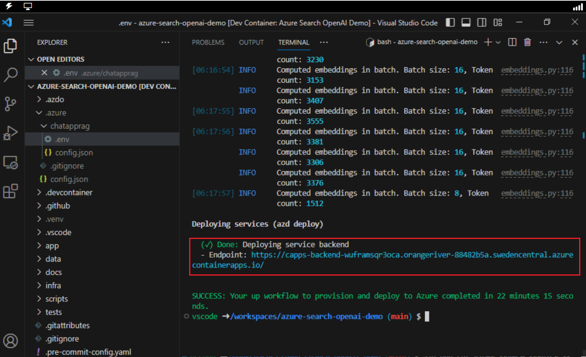
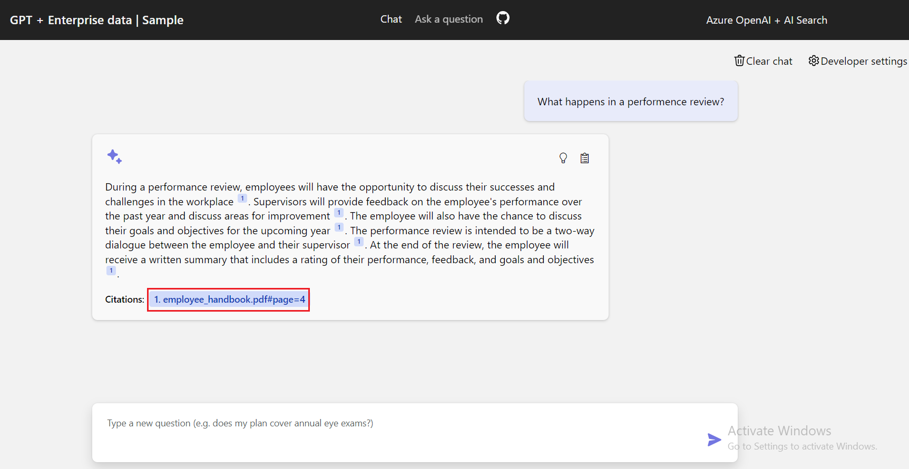
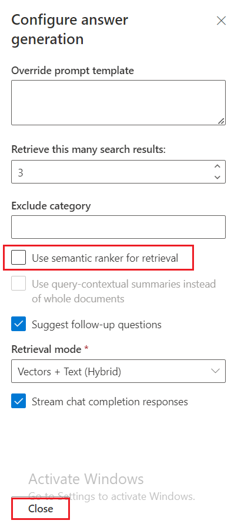
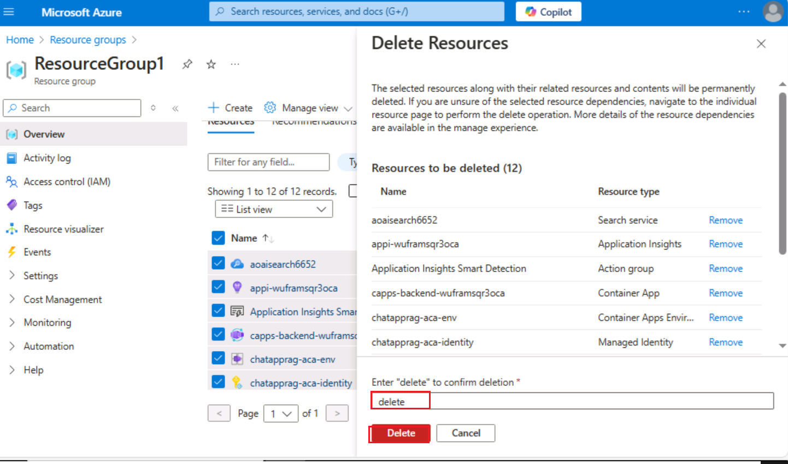

**介紹**

此示例演示了使用 Retrieval Augmented Generation
模式在您自己的資料上創建類似 ChatGPT 的體驗的幾種方法。它使用 Azure
OpenAI 服務訪問 ChatGPT 模型 （gpt-35-turbo），並使用 Azure
認知搜索進行資料索引和檢索。

該存儲庫包含示例資料，因此可以端到端嘗試。在此示例應用程式中，我們使用一家名為
Contoso Electronics
的虛構公司，該體驗允許其員工詢問有關權益、內部策略以及職位描述和角色的問題。

此用例介紹了在 Azure 平臺上使用 Retrieval Augmented Generation （RAG）
模式開發複雜聊天應用程式的過程。通過利用 Azure OpenAI 服務和 Azure
認知搜索，你將創建一個聊天應用程式，該應用程式可以使用你自己的資料智慧地回答問題。此實驗室使用一家虛構的公司
Contoso Electronics 作為案例研究，演示如何在企業資料上構建類似 ChatGPT
的體驗，涵蓋員工福利、內部政策和工作角色等方面。

**目的**

- 在本地電腦上安裝 Azure CLI 和 Node.js。

- 為用戶分配所有者角色。

- 安裝 Dev Containers 擴展並設置開發環境。

- 將聊天應用程式部署到 Azure 並使用它從 PDF 檔中獲取答案。

- 刪除已部署的資源和模型。

## 任務 1：安裝 Azure Cli 並將策略範圍設置為“本地電腦

1.  在 Windows 搜索欄中，鍵入 **PowerShell**。在 **PowerShell**
    對話方塊中，導航並按一下 **Run as
    administrator**（以管理員身份運行）。如果您看到對話方塊 - **Do you
    want to allow this app to make changes to your device?** 然後點擊
    **Yes** 按鈕。

> 

2.  運行以下命令以在 PowerShell 上安裝 Azure Cli

PowerShell 複製

> **winget install microsoft.azd**

3.  運行以下命令，將策略設置為 **Unrestricted**
    （不受限制），並在要求更改執行策略時輸入 **A**。

> **Set-ExecutionPolicy Unrestricted**
>
> 

## 任務 2：安裝 Node.js

1.  打開流覽器，導航到地址欄，鍵入或粘貼以下
    URL：+++https://nodejs.org/en/download/+++，然後按 **Enter** 按鈕。

2.  選擇並按一下 **Windows Installer**。

3.  **Node-V** 文件。按一下下載的檔以設置**Node.js**

4.  在 **Welcome to the Node.js Setup Wizard** 視窗中，按一下 **Next
    按鈕**。

5.  在 **End-User License Agreement**（使用者授權合約）視窗中，選擇**I
    accept the terms in the License agreement** 選項按鈕，然後按一下
    **Next**（下一步）按鈕。

6.  在 **Destination Folder** 視窗中，按一下 **Next** 按鈕。

7.  在 **Custom Setup** 視窗中，按一下 **Next** 按鈕。

8.  在 Ready to install Node.js 窗口中，按一下 **Install**。

9.  在 **Completing the Node.js Setup Wizard** **視窗**中，按一下
    **Finish** 按鈕以完成安裝過程。

## 任務 3：檢索資源組名稱和位置

1.  打開流覽器，導航到位址欄，然後鍵入或粘貼以下
    URL：+++https://portal.azure.com/+++，然後按 **Enter** 按鈕。

> 

2.  在 **Microsoft Azure** 視窗中，使用**使用者憑證**登錄 Azure。

3.  然後，輸入密碼並按一下 **Sign in** 按鈕。

> 

4.  在 **Stay signed in?** 視窗中，按一下 **Yes** 按鈕。

> 

5.  在搜索欄中鍵入 **+++Resource group+++**，然後選擇 **Resource
    groups**。

> 

6.  按一下分配的 **Resource group**。

7.  在 **Resource group** （資源組）
    頁面中，複製**資源組名稱和位置**並將其粘貼到記事本中，然後**保存**記事本以在即將到來的任務中使用這些資訊。

## 任務 4：創建 AI 搜索服務

1.  在 Azure 門戶中，在搜索欄中鍵入 **+++AI search+++**，然後選擇 **AI
    Search**

2.  按一下 +**Create。**

3.  選擇以下值，然後按一下 **Review + Create**。

&nbsp;

1)  訂閱：**您的 Azure 訂閱。**

2)  資源組 - **選擇現有資源組**

3)  服務名稱 - **aisearchXXXX（XXXXX 可以是實驗室即時 ID）**

4)  位置 ： **美國中部** /您附近

5)  定價層： 標準

4.  按一下 **Create** now（立即創建）。

5.  等待部署，然後按一下 **Go to resource**（轉到資源）。

> 
>
> 

6.  在 **AI Search** Overview （AI 搜索概述） 頁面中。在左側功能窗格中的
    **Settings** 部分下，選擇 **Semantic ranker**

7.  在 **Semantic ranker** 選項卡上，選擇 **Standard** tile
    （標準磁貼），然後按一下 **Select plan** （選擇計畫）。

> 

8.  選擇 **Yes**

> 

9.  你將看到一條通知 - **Successfully updated semantic ranker to
    standard plan**

> 

10. 打開記事本並記下 AI 搜索名稱、資源組名稱和位置
    。我們稍後將使用它來與服務通信

> 

## 任務 5：運行 Docker

1.  I在 Windows 搜索框中，鍵入 Docker ，然後按一下 **Docker Desktop**。

2.  運行 Docker Desktop。

## **任務 6：安裝 Dev Containers 擴展**

1.  在 Windows 搜索框中，鍵入 Visual Studio，然後按一下 **Visual Studio
    Code**。

> 

2.  打開流覽器，導航到地址欄，鍵入或粘貼以下 URL：
    +++https://marketplace.visualstudio.com/items?itemName=ms-vscode-remote.remote-containers+++，然後按
    **Enter** 按鈕。

> 

3.  在 Dev Containers 頁面上，選擇 Install 按鈕。

4.  此時將顯示 Visual Studio Code is required to install this extension
    對話方塊，然後按一下 **Continue** 按鈕。

5.  此網站正在嘗試打開 Visual Studio Code 對話方塊出現，然後按一下
    “**Open**” 按鈕。

6.  在 Visual Studio 中，按一下 Dev 容器下的 Install 按鈕。

## 任務 7：開放開發環境

1.  打開流覽器，導航到地址欄，鍵入或粘貼以下 URL：

+++<https://vscode.dev/redirect?url=vscode://ms-vscode-remote.remote-containers/cloneInVolume?url=https://github.com/azure-samples/azure-search-openai-demo>+++，
然後按 **Enter** 按鈕。

2.  此網站正在嘗試打開 Visual Studio Code
    對話方塊出現，然後按一下“**Open**”按鈕。

> 

3.  是否允許 'Dev Containers' 擴展打開此 URI？對話方塊，然後按一下
    **Open** 按鈕。

> 

4.  Cloning a repository in a Dev Container may execute arbitrary code
    對話方塊出現，然後按一下 **Got It** 按鈕

> 

5.  啟動 Dev 容器需要 13-15 分鐘。部署後，按 Enter。

6.  按任意鍵關閉終端

> 

## 任務 8：將聊天應用部署到 Azure

1.  使用 Azure 開發人員 CLI 登錄到 Azure。在終端上運行以下命令

> BashCopy
>
> **azd auth login**
>
> 

2.  默認流覽器打開以登錄 。使用 Azure 訂閱帳戶登錄。

> 

3.  關閉流覽器

> 

4.  登錄後，Azure 登錄的詳細資訊將填充到終端中。

> 

5.  創建新的 azd 環境。在終端上運行以下命令

Copy

**azd env new**

6.  將新環境名稱輸入為+++**chatapprag+++**

> 

7.  分配現有的 Azure 資源組。在終端中運行以下命令

> azd env set AZURE_RESOURCE_GROUP {Name of existing resource group}
>
> azd env set AZURE_LOCATION {Location of existing resource group}
>
> 

8.  分配現有的 Azure AI 搜索服務。在終端中運行以下命令

> +++azd env set AZURE_SEARCH_SERVICE {Name of existing Azure AI Search
> service}+++
>
> +++azd env set AZURE_SEARCH_SERVICE_RESOURCE_GROUP {Name of existing
> resource group with ACS service}+++
>
> +++azd env set AZURE_SEARCH_SERVICE_LOCATION {Location of existing
> service}+++
>
> +++azd env set AZURE_SEARCH_SERVICE_SKU {Name of SKU}+++
>
> 

9.  檢查分配的現有資源，選擇 Azure，然後選擇 **.env** 文件。

> 

10. 創建新的 azd 環境：

> shellCopy
>
> **azd up**
>
> 

11. 選擇你的 Azure 訂閱

> 

12. 出現提示時，**為
    “documentIntelligenceResourceGroupLocation”基礎結構參數輸入值**，選擇
    **West US2**。

> 

13. 出現提示時，**為 “openAiResourceGroupLocation”
    基礎設施參數輸入一個值，然後**選擇 **France Central** 。

> 

14. 等待應用程式部署完成。部署可能需要 **35-40** 分鐘才能完成。

> 
>
> 
>
> 
>
> 
>
> 

15. 成功部署應用程式後，您將看到一個列印到控制台的 URL。按一下該 URL
    可在流覽器中與應用程式進行交互。它將如下所示：

> 

16. 打開流覽器，導航到位址欄，粘貼連結。現在，資源組將在新的流覽器中打開

## 任務 9：在 Azure 門戶中驗證已部署的資源

1.  選擇 **Resource groups**

> 

2.  按一下分配的 **Resource group**。

3.  確保已成功部署以下資源

- Azure 應用服務

- Azure 應用程式見解

- 容器應用程式

- 容器註冊表

- Azure OpenAI

- Azure 文檔智能

- Azure 搜索服務

- Azure 存儲帳戶

- Azure 語音服務

4.  在資源組上，然後按一下 **AI Search service**。

> 

5.  確保 Indexes 應已成功部署

> 

6.  返回 resorcegroup 並按一下 **Storage account**。

> 

7.  從左側導航功能表中，按一下 **Containers** ，確保資料應該部署成功

> 

## 任務 10：使用聊天應用程式從 PDF 檔中獲取答案

1.  等待 Web 應用程式部署完成。

> 

2.  在 **GPT+Eneterprise 資料 |示例** Web
    應用程式頁面，輸入以下文本，然後按一下 **Submit 圖示**，如下圖所示。

> **What happens in a performence review?**

3.  從答案中，選擇一個**citation**。

4.  在右側窗格中，使用選項卡瞭解答案是如何生成的。

[TABLE]

5.  再次選擇所選選項卡以關閉窗格。

6.  聊天的智慧由 OpenAI 模型和用於與模型交互的設置決定。

7.  選擇 **Developer settings** （開發人員設置）。

[TABLE]

8.  選中 **Suggest follow-up questions**
    核取方塊，然後再次提出相同的問題。

9.  輸入以下文本，然後按一下 **Submit 圖示**，如下圖所示。

> What happens in a performance review?

10. 聊天返回了建議的後續問題，例如：

11. 在 **Settings** （設置） 選項卡中，取消選擇 **Use semantic ranker
    for retrieval** （使用語義排名程式進行檢索）。

12. 輸入以下文本，然後按一下 **Submit 圖示**，如下圖所示。

> What happens in a performance review?

## 任務 11：刪除資源

1.  若要刪除 資源組 ，請在 Azure 門戶搜索欄中鍵入 **Resource
    groups**，導航並按一下“**Services**”下的“**Resource groups**”。

> 

2.  按一下示例 Web 應用程式資源組。

> 

3.  在 資源組主頁 中，選擇 **所有資源** 。

4.  選擇 Delete

**總結**

> 在本實驗中，你學習了如何使用 Azure
> 的工具和服務套件設置和部署智慧聊天應用程式。從安裝 Azure CLI 和
> Node.js 等基本工具開始，你已使用 Visual Studio Code
> 中的開發容器配置了開發環境。你已部署一個聊天應用程式，該應用程式利用
> Azure OpenAI 和 Azure 認知搜索來回答 PDF
> 檔中的問題。最後，您刪除了已部署的資源以有效地管理資源。此實踐經驗使你具備了在
> Azure 上使用 Retrieval Augmented Generation
> 模式開發和管理智慧聊天應用程式的技能。
