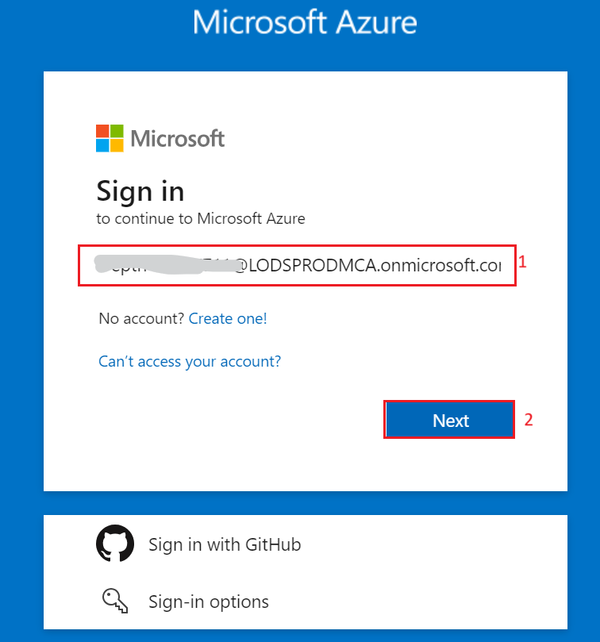

**Introduzione**

Questo esempio illustra alcuni approcci per la creazione di esperienze
simili a ChatGPT sui propri dati utilizzando il modello Retrieval
Augmented Generation. Usa il servizio Azure OpenAI per accedere al
modello ChatGPT (gpt-35-turbo) e Ricerca cognitiva di Azure per
l'indicizzazione e il recupero dei dati.

Il repository include dati di esempio in modo che sia pronto per essere
provato end-to-end. In questa applicazione di esempio viene utilizzata
una società fittizia denominata Contoso Electronics e l'esperienza
consente ai dipendenti di porre domande sui benefit, sui criteri
interni, nonché sulle descrizioni delle mansioni e sui ruoli.

Questo caso d'uso consente di sviluppare un'applicazione di chat
sofisticata usando il modello Retrieval Augmented Generation (RAG) sulla
piattaforma Azure. Sfruttando il servizio Azure OpenAI e Azure Cognitive
Search, creerai un'applicazione di chat in grado di rispondere in modo
intelligente alle domande usando i tuoi dati. Questo lab usa una società
fittizia, Contoso Electronics, come case study per dimostrare come
creare un'esperienza simile a ChatGPT sui dati aziendali, coprendo
aspetti quali i benefit per i dipendenti, i criteri interni e i ruoli
lavorativi.

**Obiettivo**

- Per installare Azure CLI e Node.js nel computer locale.

- Per assegnare un ruolo di owner all'utente.

- Per installare l'estensione Dev Containers e configurare l'ambiente di
  sviluppo.

- Per distribuire un'applicazione di chat in Azure e usarla per ottenere
  risposte dai file PDF.

- Per eliminare le risorse e i modelli distribuiti.

## Attività 1: Installare Azure Cli e impostare l'ambito dei criteri su Computer locale

1.  Nella barra di ricerca di Windows, digitare **PowerShell**. Nella
    finestra di dialogo di **PowerShell**, navigare e fare clic su **Run
    as administrator**. Se viene visualizzata la finestra di dialogo -
    **Do you want to allow this app to make changes to your device?**
    quindi fare clic sul pulsante **Yes**.

> 

2.  Eseguire il comando seguente per installare Azure Cli in PowerShell

PowerShell copy 

**winget install microsoft.azd**

3.  Eseguire il comando seguente per impostare il criterio su
    **Unrestricted** e immettere **A** quando viene richiesto di
    modificare il criterio di esecuzione.

> **Set-ExecutionPolicy Unrestricted**
>
> 

## Attività 2: Installare Node.js

1.  Aprire il browser, andare alla barra degli indirizzi, digitare o
    incollare il seguente URL: +++https://nodejs.org/ it/download/+++,
    quindi premere il pulsante **Enter**.

2.  Selezionare e fare clic su **Windows Installer**.

3.  Il file **Node-V** verrà scaricato. Fare clic sul file scaricato per
    configurare **Node.js**

4.  Nella finestra **Welcome to the Node.js Setup Wizard**, fare clic
    sul pulsante **Next**.

5.  Nella finestra **End-User License Agreement**, selezionare **I
    accept the terms in the License agreement** e fare clic sul pulsante
    **Next**.

6.  Nella finestra **Destination Folder**, fare clic sul pulsante
    **Next**.

7.  Nella finestra **Custom Setup**, fare clic sul pulsante **Next**.

8.  Nella finestra **Ready to install Node.js**, fare clic su
    **Install.**

9.  Nella finestra **Completing the Node.js Setup Wizard window**, fare
    clic sul pulsante **Finish** per completare il processo di
    installazione.

## Attività 3: Recuperare il nome e la posizione del gruppo di risorse

1.  Aprire il browser, andare alla barra degli indirizzi e digitare o
    incollare il seguente URL: +++https://portal.azure.com/+++, quindi
    premere il pulsante **Enter**.

> 

2.  Nella finestra **Microsoft Azure,** usare le **User Credentials**
    per accedere ad Azure.

3.  Quindi, inserire la password e fare clic sul pulsante **Sign in.**

> 

4.  Nella finestra **Stay signed in?**, fare clic sul pulsante **Yes**.

> 

5.  Digitare +++**Resource group+++** nella barra di ricerca e
    selezionare **Resource groups**.

> 

6.  Fare clic sul **Resource group** assegnato.

7.  Nella pagina **Resource group,** copiare il **nome e la posizione
    del gruppo di risorse** e incollarli in un blocco note, quindi
    **salvare** il blocco note per usare le informazioni nelle attività
    future.

## Attività 4: Creare il servizio AI Search

1.  Nel portale di Azure, digitare **+++AI search+++** nella barra di
    ricerca e selezionare **AI Search**

2.  Fare clic su +**Create**.

3.  Selezionare i valori sottostanti e quindi fare clic su** Review +
    Create**.

&nbsp;

1)  Subscription: **la sottoscrizione di Azure**.

2)  Resource group: **selezionare il gruppo di risorse esistente**

3)  Service name - **aisearchXXXX(XXXXX può essere Lab instant ID)**

4)  Location: **Central US** /posizione vicino a te

5)  Pricing tier: Standard

4.  Cliccare su **Create**.

5.  Attendere la distribuzione e quindi fare clic su **Go to resource**.

> 
>
> 

6.  Nella pagina **AI Search Overview**. Nel riquadro di spostamento a
    sinistra, nella sezione **Settings**, selezionare **Semantic
    ranker**

7.  Nella scheda **Semantic ranker,** selezionare il riquadro
    **Standard** e fare clic su **Select plan.**

> 

8.  Selezionare **Yes**

> 

9.  Verrà visualizzata una notifica - **Successfully updated semantic
    ranker to standard  plan**

> 

10. Aprire un Blocco note e prendere nota del nome di AI Search, del
    nome del gruppo di risorse e della posizione. Lo utilizzeremo in
    seguito per comunicare al servizio

> 

## Attività 5: Eseguire il Docker

1.  Nella casella di ricerca di Windows, digitare Docker, quindi fare
    clic su **Docker Desktop**.

2.  Eseguire il Docker Desktop.

## **Attività 6: Installare l'estensione Dev Containers**

1.  Nella casella di ricerca di Windows, digitare **Visual Studio**,
    quindi fare clic su **Visual Studio Code**.

> 

2.  Aprire il browser, andare alla barra degli indirizzi, digitare o
    incollare il seguente URL:
    +++https://marketplace.visualstudio.com/items?itemName=ms-vscode-remote.remote-containers+++,
    quindi premere il pulsante **Enter**.

> 

3.  Nella pagina **Dev Containers,** selezionare il pulsante
    **Install**.

4.  Per installare questa estensione viene visualizzata la finestra di
    dialogo Visual Studio Code, quindi fare clic sul pulsante
    **Continue**.

5.  Viene visualizzata la finestra di dialogo **This site is trying to
    open Visual Studio Code**, quindi fare clic sul pulsante **Open**.

6.  In Visual Studio, fare clic sul pulsante **Install** sotto il Dev
    container.

## Attività 7: Ambiente di sviluppo aperto

1.  Aprire il browser, andare alla barra degli indirizzi, digitare o
    incollare il seguente URL:

+++<https://vscode.dev/redirect?url=vscode://ms-vscode-remote.remote-containers/cloneInVolume?url=https://github.com/azure-samples/azure-search-openai-demo>+++,
quindi premere il pulsante **Enter**.

2.  Viene visualizzata la finestra di dialogo **This site is trying to
    open Visual Studio Code**, quindi fare clic sul pulsante **Open**.

> 

3.  Viene visualizzata la finestra di dialogo **Allow ‘Dev Containers’
    extension to open this URI?,** quindi fare clic sul pulsante
    **Open**.

> 

4.  Viene visualizzata la finestra di dialogo **Cloning a repository in
    a Dev Container may execute arbitrary code**, quindi fare clic sul
    pulsante **Got It**

> 

5.  L'avvio del contenitore Dev richiederà 13-15 minuti. Dopo la
    distribuzione, premere **Enter**.

6.  Premere un tasto qualsiasi per chiudere il terminale

> 

## Attività 8: Distribuire l'app di chat in Azure

1.  Accedere ad Azure con Azure Developer CLI. Eseguire il seguente
    comando sul Terminale

> BashCopy 
>
> **azd auth login** 
>
> 

2.  Il browser predefinito si apre per accedere. Accedere con l'account
    della sottoscrizione di Azure.

> 

3.  Chiudere il browser

> 

4.  Una volta effettuato l'accesso, i dettagli dell'accesso Azure
    vengono popolati nel terminale.

> 

5.  Creare un nuovo ambiente azd. Eseguire il seguente comando sul
    Terminale

> Copy 
>
> **azd env new** 

6.  Inserire il nome del nuovo ambiente come +++**chatapprag+++**

> 

7.  Assegnare il gruppo di risorse di Azure esistente. Eseguire il
    seguente comando nel Terminale

> azd env set AZURE_RESOURCE_GROUP {Name of existing resource group} 
>
>  
>
> azd env set AZURE_LOCATION {Location of existing resource group} 
>
> 

8.  Assegnare il servizio Azure AI Search esistente. Eseguire il
    seguente comando nel Terminale

> +++azd env set AZURE_SEARCH_SERVICE {Name of existing Azure AI Search
> service}+++ 
>
>  
>
> +++azd env set AZURE_SEARCH_SERVICE_RESOURCE_GROUP {Name of existing
> resource group with ACS service}+++ 
>
>  
>
> +++azd env set AZURE_SEARCH_SERVICE_LOCATION {Location of existing
> service}+++ 
>
>  
>
> +++azd env set AZURE_SEARCH_SERVICE_SKU {Name of SKU}+++ 
>
> 

9.  Controllare le risorse esistenti assegnate, selezionare Azure e
    scegliere il file **.env**.

> 

10. Creare un nuovo ambiente azd:

> shellCopy 
>
> **azd up** 
>
> 

11. Selezionare la tua sottoscrizione di Azure

> 

12. Quando richiesto, **Enter a value for the
    ‘documentIntelligenceResourceGroupLocation’ infrastructure
    parameter** e selezionare **West US2.**

> 

13. Quando richiesto, **enter a value for the
    ‘openAiResourceGroupLocation’ infrastructure parameter** selezionare
    **France Central.**

> 

14. Attendere fino a quando l'app non viene distribuita. Il
    completamento della distribuzione potrebbe richiedere **35-40**
    minuti.

> 
>
> 
>
> 
>
> 
>
> 

15. Dopo che l'applicazione è stata distribuita correttamente, verrà
    visualizzato un URL stampato nella console. Fare clic su quell'URL
    per interagire con l'applicazione nel tuo browser. Sarà simile al
    seguente:

> 

16. Aprire il browser, andare alla barra degli indirizzi, incollare il
    link. A questo punto, il gruppo di risorse verrà aperto in un nuovo
    browser

## Attività 9: Verificare le risorse distribuite nel portale di Azure

1.  Selezionare **Resource groups**

> 

2.  Fare clic sul **Resource group** assegnato.

3.  Assicurarsi che la risorsa seguente sia stata distribuita
    correttamente

- Azure App Service 

&nbsp;

- Azure Application Insights 

&nbsp;

- Container App 

&nbsp;

- Container registry 

&nbsp;

- Azure OpenAI 

&nbsp;

- Azure Document Intelligence 

&nbsp;

- Azure Search Service 

&nbsp;

- Azure Storage Account 

&nbsp;

- Azure Speech Service 

4.  Nel gruppo di risorse e fare clic su **AI Search service.**

> 

5.  Assicurarsi che gli indici vengano distribuiti correttamente

> 

6.  Tornare a resorcegroup e fare clic su **Storage account.**

> 

7.  Dal menu di navigazione a sinistra, fare clic su **Containers**.
    Assicurati che i dati vengano distribuiti correttamente

> 

## Attività 10: Utilizzare l'app di chat per ottenere risposte dai file PDF

1.  Attendere il completamento della distribuzione dell'applicazione
    Web.

> 

2.  Nella pagina dell'app Web di **GPT+Eneterprise data |Sample**,
    immettere il testo seguente e fare clic sull' icona **Submit** come
    mostrato nell'immagine seguente.

> **What happens in a performence review?** 

3.  Dalla risposta, selezionare una **citazione**.

4.  Nel riquadro di destra, usare le schede per capire come è stata
    generata la risposta.

[TABLE]

5.  Selezionare nuovamente la scheda selezionata per chiudere il
    riquadro.

6.  L'intelligenza della chat è determinata dal modello OpenAI e dalle
    impostazioni utilizzate per interagire con il modello.

7.  Selezionare **Developer settings**.

[TABLE]

8.  Selezionare la casella di controllo **Suggest follow-up questions**
    e porre di nuovo la stessa domanda.

9.  Inserire il seguente testo e fare clic sull' icona **Submit** come
    mostrato nell'immagine sottostante.

> What happens in a performance review? 

10. La chat ha restituito domande di follow-up suggerite come le
    seguenti

11. Nella scheda **Settings**, deseleziona **Use semantic ranker for
    retrieval**.

12. Inserire il seguente testo e fare clic sull'icona **Submit** come
    mostrato nell'immagine sottostante.

> What happens in a performance review? 

## Attività 11: Eliminare le risorse

1.  Per eliminare Gruppo di risorse, digitare **Resource groups** nella
    barra di ricerca del portale di Azure, spostarsi e fare clic su
    **Resource groups** in **Services**.

> 

2.  Fare clic sul gruppo di risorse dell'app Web di esempio.

> 

3.  Nella home page del gruppo di risorse, selezionare **all
    resources**.

4.  Selezionare **Delete**

**Sommario**

In questo lab si è appreso come configurare e distribuire
un'applicazione di chat intelligente usando la suite di strumenti e
servizi di Azure. A partire dall'installazione di strumenti essenziali
come Azure CLI e Node.js, è stato configurato l'ambiente di sviluppo
usando Dev Containers in Visual Studio Code. È stata distribuita
un'applicazione di chat che usa Azure OpenAI e Azure Cognitive Search
per rispondere alle domande dai file PDF. Infine, sono state eliminate
le risorse distribuite per gestire in modo efficace le risorse. Questa
esperienza pratica ti ha fornito le competenze necessarie per sviluppare
e gestire applicazioni di chat intelligenti usando il modello di
generazione aumentata di recupero in Azure.
