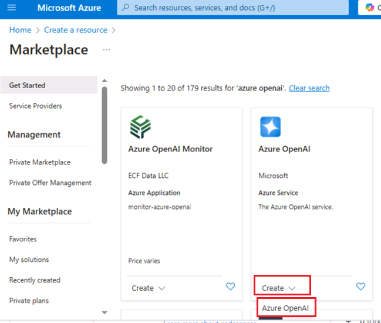
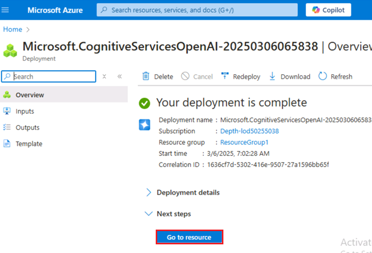
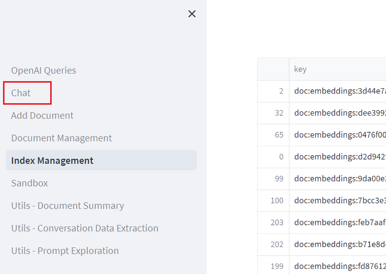
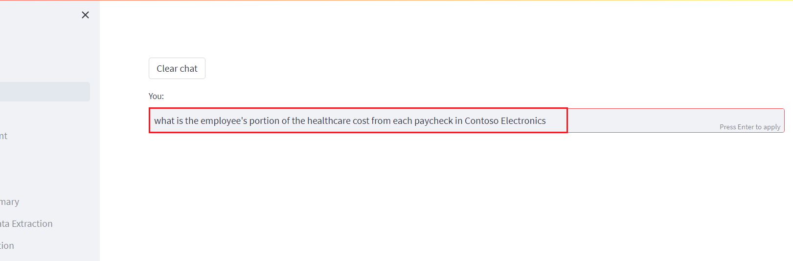

**實驗 07：使用語義回答實現 Q&A**

**介紹**

一個簡單的 Web 應用程式，用於支援 OpenAI 的文檔搜索。此存儲庫使用 Azure
OpenAI
服務從文檔創建嵌入向量。為了回答用戶的問題，它會檢索最相關的文檔，然後使用
GPT-3 提取問題的匹配答案。

**目標**

- 在 Azure AI Studio 中部署聊天和嵌入模型。

- 使用自訂範本部署所需的資源，例如應用服務、搜索服務、表單識別器等。

- 部署 aoaichatsearch-site Web 應用程式並執行支援 Azure OpenAI
  的文檔搜索、文本摘要和對話資料提取。

- 刪除已部署的資源和模型。

## **任務 1：創建 Azure OpenAI 資源**

1.  在 Azure 門戶主頁中，按一下 **Azure 門戶功能表**，該功能表由
    Microsoft Azure 命令列左側的三個水準條表示，如下圖所示。

> 

2.  導航並按一下 + **Create a resource**。

> 

3.  在 **Create a resource** page（創建資源頁面）的 **Search services
    and marketplace**（搜索服務和市場）搜索欄中，鍵入**Azure
    OpenAI**，然後按 Enter 按鈕。

> 

4.  在 “**Marketplace**” 頁面中，導航到 **Azure OpenAI** 部分，按一下
    “創建” 按鈕下拉清單，然後選擇 **Azure
    OpenAI**，如圖所示。（如果您已經按一下 **Azure OpenAI**
    磁貼，然後按一下 **Azure OpenAI** 頁面上的 “**Create**” 按鈕）。

> 

5.  在 **Create Azure OpenAI** 視窗的 **Basics**
    選項卡下，輸入以下詳細資訊，然後按一下 **Next** 按鈕。

[TABLE]

> 

6.  在 **Network** 選項卡中，將所有選項按鈕保留為預設狀態，然後按一下
    **Next** 按鈕。

> 

7.  在 **Tags** 選項卡中，將所有欄位保留為預設狀態，然後按一下 **Next**
    按鈕。

> 

8.  在 **Review+submit** 選項卡中，驗證通過後，按一下 **Create** 按鈕。

> 

9.  等待部署完成。部署大約需要 **2-3** 分鐘。

10. 在 **Microsoft.CognitiveServicesOpenAI** 視窗中，部署完成後，按一下
    **Go to resource** （轉到資源） 按鈕。

> 

11. 在 **Azure-open-testXX |Model deployments** （模型部署）
    視窗中，導航到 **Resource Management** （資源管理） 部分，然後按一下
    **Keys and Endpoints** （金鑰和終端節點）。

12. 在 **Keys and Endpoints** 頁面中，複製 **KEY1、KEY 2** 和
    **Endpoint**
    值並將其粘貼到記事本中，如下圖所示，然後**保存**記事本以在即將到來的實驗中使用這些資訊。

## **任務 2：部署 Chat 模型和嵌入模型**

1.  在 **Azure-openai-testXX** 頁面中，按一下左側導航功能表中的
    “**Overview**” ，向下滾動並按一下 “**Explore Azure AI Foundry
    portal**” 按鈕，如下圖所示。

> 

2.  等待 Azure OpenAI 工作室啟動。

> 

3.  在 **Azure AI Foundry |Azure OpenAI Studio**
    主頁：從左側導航功能表中選擇 **Deployment**。

4.  在 **Deployments** （部署） 視窗中，下拉 **+Deploy model**
    （部署模型），然後選擇 **Deploy base model**（部署基礎模型）。

> 

5.  在 **Select a model** 對話方塊中，導航並仔細選擇
    **gpt-4**，然後按一下 **Confirm** 按鈕。.

6.  選擇 **Model version**（模型版本）作為 **0125-Preview**，在
    **Deployment type**（部署類型）作為
    **Standard**（標準）、**Deployment
    name**（部署名稱）**欄位中**，輸入 **gpt-4**，然後按一下
    **Create**（創建）按鈕。

> 

7.  在 **Deployments** （部署） 視窗中，下拉 **+Deploy model**
    （部署模型），然後選擇 **Deploy base model**（部署基礎模型）。

> 

8.  在 **Select a model** 對話方塊中，導航並仔細選擇
    **text-embedding-ada-002**，然後按一下 **Confirm** 按鈕。

9.  在 **Deploy model** 對話方塊的 **Deployment name** 下輸入
    +++**text-embedding-ada-002+++**，選擇 **Standard** 作為
    **Deployment type** ，然後按一下 **Deploy** 按鈕。

## **任務 3：使用 Azure 認知搜索在 Azure 上部署（WebApp + 批次處理）**

1.  打開 Edge 流覽器，導航到位址欄，然後鍵入或粘貼以下
    URL：<https://portal.azure.com/#create/Microsoft.Template/uri/https%3A%2F%2Fraw.githubusercontent.com%2Fruoccofabrizio%2Fazure-open-ai-embeddings-qna%2Fmain%2Finfrastructure%2Fdeployment_ACS.json>
    然後按 **Enter** 按鈕。

2.  在 **Custom deployment** window 的 **Basics**
    選項卡下，輸入以下詳細資訊以部署自訂範本，然後按一下 **Review +
    create**。

[TABLE]

3.  在 **Review + create** 選項卡上，通過 Validation 後，按一下
    **Create** 按鈕。

4.  等待部署完成。部署大約需要 15-17 分鐘。

> 

5.  按一下 **Go to resource group** 按鈕。

> 

## **任務 4：通過 Web 應用程式搜索已啟用 Azure OpenAI 的文檔** 

1.  在 **aoaiXXX-RG** 資源組視窗的 **Resources** 選項卡下，導航到 **App
    Service - aoaaichatsearch-site** 並按一下它。

2.  在 **aoaichatsearch-site** Web App **Overview**
    頁面上，導航到命令列並按一下 **Browse**，它將導航到 Web 應用程式。

3.  等待 Web 應用程式部署完成。部署大約需要 **10-15** 分鐘。

4.  在 Web 應用程式主頁上，要驗證部署狀態，請按一下 Microsoft 下的
    **Check deployments** （檢查部署） 按鈕。

5.  要檢查部署狀態，可能需要大約 5-6 分鐘。

6.  在 Web 應用程式主頁上，導航並按一下左側的 **Add Document**
    以添加數據。

7.  在 **Add Document** （添加文檔） 窗格中，按一下 **Browse files**
    （流覽檔） 按鈕以上傳需要添加到知識庫的文檔。

8.  導航到 VM 中的 **C：\Labfiles\Contoso Electronics** 位置，選擇
    **Benefit_Options.pdf**，然後按一下 “**Open**” 按鈕。

9.  再次按一下 “**Browse files**”，導航到 VM 中的 **C：\Labfiles\Contoso
    Electronics**
    位置並選擇“**employee_handbook.pdf**”，然後按一下“**Open**”按鈕。

10. 同樣，添加 **Northwind_Health_Plus_Benefits_Details.pdf**
    和**Northwind_Standard_Benefits_Details.pdf**

11. 上傳的資料將添加到知識庫中，大約需要 5-7 分鐘。

12. 按一下 **Document Management** 以驗證檔是否已成功上傳。

13. 按一下 **Index Management**（索引管理）以驗證檔、鍵和源。

14. 然後，點擊 **Chat**。

15. 在 **Chat session** （聊天會話） 部分中，輸入以下提示，然後按
    **Enter** 按鈕並查看回應。

**You**: **what is the employee's portion of the healthcare cost from
each paycheck in Contoso Electronics**

16. 在 **Chat session** 部分，按一下 **Clear chat** 按鈕。

17. 在 **Chat session** （聊天會話） 部分中，輸入以下提示，然後按
    **Enter** 按鈕並查看回應。

**You**: **How do I file a complaint or appeal with Northwind Health
Plus?**

18. 在 **Chat session** 部分，按一下 **Clear chat** 按鈕。

19. 在 **Chat session** （聊天會話） 部分中，輸入以下提示。然後按
    **Enter** 按鈕並查看回應。

**You**: **Does my plan covers my eye exams?**

20. 按一下左側的 **Utils-Document Summary**。

21. 在 **Summarization**部分中，選擇 **Basic Summary** 選項按鈕。

22. 在 **Summarization** 視窗的 **Enter some text to summarize**
    部分的訊息方塊中，將當前文本替換為以下內容，然後按一下 **Summarize**
    按鈕。

It’s been six months since we reinvented search with [the new AI-powered
Bing and
Edge](https://blogs.microsoft.com/blog/2023/02/07/reinventing-search-with-a-new-ai-powered-microsoft-bing-and-edge-your-copilot-for-the-web/).
In that short time, you’ve engaged in so many unique and creative ways;
to date we’ve seen over 1 billion chats and over 750 million images fill
the world of Bing! We’ve also seen nine consecutive quarters of growth
on Edge, meaning we’re more able than ever to bring our best-in-class AI
experiences to users across the web.

23. 檢查您輸入的文本的摘要。

24. 查看 Summary 結果後，按一下 **Clear summary** 按鈕。

25. 現在，向上滾動並選擇 **Bullet Points** 選項按鈕。在 **Enter some
    text to summarize**
    部分的訊息方塊中，將當前文本替換為以下內容，然後按一下 **Summarize**
    按鈕。

Microsoft has made its Azure OpenAI Service generally available,
bringing the enterprise generative AI tools out of its invite-only
program. Now any customers who meet Microsoft’s standards can access the
professional versions of OpenAI’s large language model GPT-3.5 and the
related text-to-image tool DALL-E 2, computer programming assistant
Codex, and the popular ChatGPT chatbot interface for the LLM.

Microsoft launched the Azure OpenAI Service with an eye toward offering
businesses a way to develop apps without coding, write reports, and put
together marketing content. The scope has grown since then to encompass
new facets of the OpenAI’s models, including chat and visuals. Those
interested in the tools have to explain how they will use the AI tools
and agree to Microsoft’s ethical guidelines in their application for
access. The decision to widen the Azure OpenAI Service’s availability
arrives in tandem with Microsoft’s plans to integrate ChatGPT and DALL-E
into its Office suite, Bing search engine, and other consumer products.
Azure OpenAI Service followed earlier experiments to integrate GPT-3
into Microsoft projects like the low-code Power Apps programming tool
and the GitHub Copilot programming assistant.

26. 您將以專案符號的形式看到摘要結果。

27. 按一下左側的 **Utils-Conversation Data Extraction**。

28. 在 **Conversation data extraction** （對話資料提取） 窗格中，按一下
    **Execute tasks** （執行任務） 並在 **OpenAI result** （OpenAI
    結果） 下查看回應。

29. 查看從 Agent 和 User 之間的對話中提取的資料。

## 任務 5：刪除已部署的資源和模型

1.  若要刪除已部署的資源，請導航到 **Azure 門戶主**頁，按一下
    “**Resource groups**” 。

> 

2.  在 Resource groups （資源組） 頁面中，選擇您的資源組。

> 

3.  在 **Resource group** 主頁中，選擇所有資源，然後按一下 **delete**

4.  在右側顯示的 **Delete Resources** 窗格中，導航到 **Enter “delete” to
    confirm deletion** 欄位，然後按一下 **Delete** 按鈕。

5.  在 **Delete confirmation** 對話方塊中，按一下 **Delete** 按鈕。

> 

6.  按一下鈴鐺圖示，您將看到通知

**總結**

你已在 Azure AI Studio 中部署了 gpt-4 聊天模型和 text-embedding-ada-002
嵌入模型，然後已使用自訂範本部署了必要的資源。您已經在
aoaichatsearch-site Web App
中上傳了非結構化文檔，並在聊天會話中提取了準確的資訊。您已經從示例文本中生成了基本摘要和要點摘要，然後從對話中提取了資料。在實驗室結束時，你已刪除資源和模型，以便有效地管理
Azure OpenAI 資源。

**重要提示: 請不要刪除 Resource
Group。如果刪除，您將無法繼續下一個實驗室或創建新的資源組。**

**請不要刪除 Azure OpenAI 服務
（Azure-openai-testXX）。所有實驗室都將使用相同的服務。**
