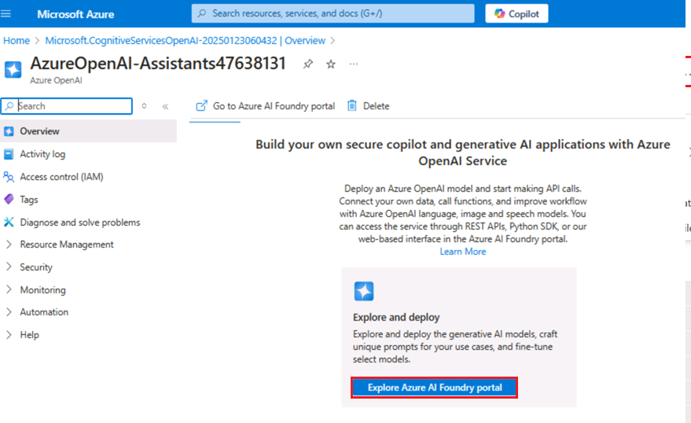
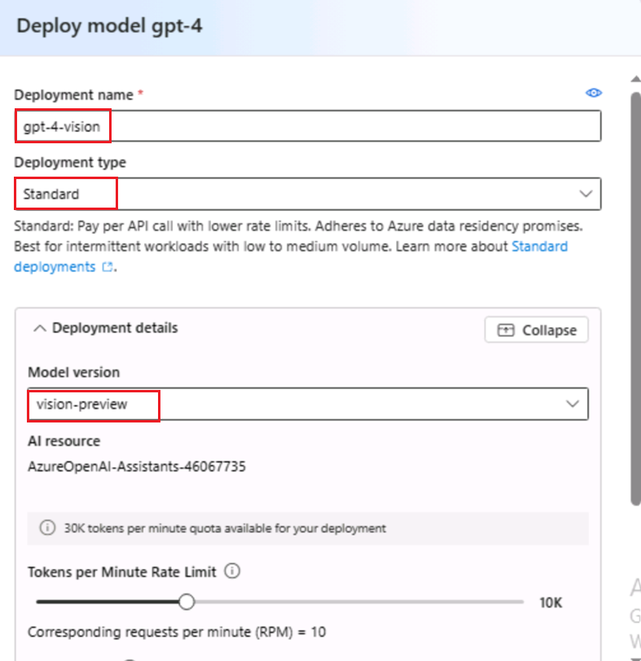

# **介紹**

Azure OpenAI 助手（預覽版）允許你通過自訂說明創建根據你的需求量身定制的
AI 助手，並通過代碼解譯器和自訂函數等高級工具進行增強。

此實驗室重點介紹如何設置和利用 Azure OpenAI
服務以及必應搜索集成來構建複雜的 AI 助手和多代理框架。您將部署 AI
模型，探索助手功能，並實現多代理交互以進行複雜的任務處理。

**目的**

- 在 Azure 中創建必應搜索服務資源。

- 部署 Azure OpenAI 資源並對其進行配置。

- 部署特定的 Azure OpenAI 模型，如 GPT-4、GPT-4 Vision 和 DALL-E-3。

- 使用 Azure OpenAI Studio 探索 AI 助手並為其創建原型。

- 使用必應搜索 API 實現函式呼叫以增強助手功能。

- 使用 Azure Assistant API 構建多模式多代理框架，用於協作 AI 任務。

- 刪除已部署的資源和模型。

## **任務 1：創建 Bing 搜索服務資源**

1.  按一下 **Portal 功能表**，然後選擇 + **Create a resource**

> 

2.  在 **Create a resource** page 搜索欄中，鍵入 **Bing Search
    v7**，然後按一下顯示的 **bing search v7**。

3.  按一下 **Bing Search v7** 部分。

4.  在 **Create a search service** 頁面上，提供以下資訊，然後按一下
    **Review+create** 按鈕。

[TABLE]

5.  驗證通過後，按一下 **Create** 按鈕。

6.  部署完成後，按一下 **Go to resource** 按鈕。

7.  在 **bingsearchaoaiXX** 視窗中，導航到 **Resource management**
    部分，然後按一下 **Keys and Endpoint**。

8.  在 **Keys and Endpoints** 頁面中，複製 **KEY1**（您可以使用 KEY1 或
    KEY2）和 **Endpoint**
    並將它們粘貼到記事本中（如圖所示），然後**保存**記事本以在即將到來的任務中使用這些資訊。

## **任務 2：創建 Azure OpenAI 資源**

1.  在 Azure 門戶主頁中，按一下 **Azure 門戶功能表**，該功能表由
    Microsoft Azure 命令列左側的三個水準條表示，如下圖所示。

> 

2.  導航並按一下 **+ Create a resource**。

> 

3.  在 **Create a resource page（**創建資源頁面）的 **Search services
    and marketplace**（搜索服務和市場）搜索欄中，鍵入**Azure
    OpenAI**，然後按 **Enter** 按鈕。

> 

4.  在 “**Marketplace**” 頁面中，導航到 **Azure OpenAI** 部分，按一下
    “創建” 按鈕下拉清單，然後選擇 **Azure
    OpenAI**，如圖所示。（如果您已經按一下 **Azure OpenAI**
    磁貼，然後按一下 **Azure OpenAI 頁面**上的 “**Create**”按鈕）。

> 

[TABLE]

5.  在 **Create Azure OpenAI** 視窗的 **Basics**
    選項卡下，輸入以下詳細資訊，然後按一下 **Next** 按鈕。

> 

6.  在 **Network** 選項卡中，將所有選項按鈕保留為預設狀態，然後按一下
    **Next** 按鈕。

> 

7.  在 **Tags** 選項卡中，將所有欄位保留為預設狀態，然後按一下 **Next**
    按鈕。

> 

8.  在 **Review+submit** 選項卡中，驗證通過後，按一下 **Create** 按鈕。

> 

9.  等待部署完成。部署大約需要 **2-3** 分鐘。

10. 在 **Microsoft.CognitiveServicesOpenAI** 視窗中，部署完成後，按一下
    **Go to resource** （轉到資源） 按鈕。

> 

11. 按一下左側導航功能表中的 “**Keys and Endpoints**
    ”，然後將記事本中的“終結點”值複製到 **AzureAI
    ENDPOINT**，將“金鑰”複製到變數 **AzureAIKey**。

> 

## 任務 3：部署 Azure OpenAI 模型

1.  在 **AzureOpenAI-AssistantsXX** 視窗中，按一下左側導航功能表中的
    “**Overview**” ，按一下 “**Explore Azure AI Foundry portal**”
    按鈕，在新流覽器中打開 **Azure AI Foundry Studio**

> 

2.  在 **Azure AI Foundary |Azure OpenAI
    服務**視窗中，從左側導航功能表中選擇 **Deployment** （部署）。

> 

12. 在 **Deployments** （部署） 視窗中，下拉 **+Deploy model**
    （部署模型），然後選擇 **Deploy base model**（部署基礎模型）。

> 

13. 在 **Select a model** 對話方塊中，導航並仔細選擇
    **gpt-4**，然後按一下 **Confirm** 按鈕。

> 

3.  在 **Deploy model** 對話方塊中，輸入以下詳細資訊，然後按一下
    **Create** 按鈕。

- 選擇型號： **gpt-4**

- 模型版本：**1106-Preview**

- 部署名稱：輸入 **gpt-4**

- 選擇 **Advanced options** ，然後選擇 **Standard** 作為 **Deployment
  type**

> 

4.  在 **Deployments** （部署） 頁面中，按一下 **+ Create new
    deployment** （創建新部署）。

5.  在 **Deployments** （部署） 視窗中，下拉 **+Deploy model
    （**部署模型），然後選擇 **Deploy base model**（部署基礎模型）。

> 

14. 在 **Select a model** 對話方塊中，導航並仔細選擇
    **gpt-4**，然後按一下 **Confirm** 按鈕。

> 

6.  在“**Deploy model** ”對話方塊中，在“**Select a model**
    ”下，按一下下拉清單，選擇 **gpt-4** 欄位，在“**Model version**
    ”下選擇**vision-preview**，然後在“**Deployment name**” 下輸入
    +++**gpt-4-vision+++**。點擊 **Create** 按鈕。

> 
>
> 

7.  在 **Deployments** （部署） 視窗中，下拉 **+Deploy model**
    （部署模型），然後選擇 **Deploy base model**（部署基礎模型）。

> 

15. 在 **Select a model** 對話方塊中，導航並仔細選擇
    **dall-e-3**，然後按一下 **Confirm** 按鈕。

> 

8.  在 **Deploy model** 對話方塊中，在 **Select a model**
    下，按一下下拉式功能表 選擇 **dall-e-3** 欄位，在 **Model version**
    下 選擇 **Auto-update to default** ，在 **Deployment name** 下輸入
    ！！**dall-e-3！! 。**點擊 **Create** 按鈕。

> 
>
> 

## 任務 4：探索 Assistant 的 Playground

1.  在 Azure AI Foundry |Azure OpenAI 服務主頁的 **Playgrounds**
    部分下，按一下 **Assistants playground**。

2.  在 **Assistants playground** 窗格中，選擇 **+Create an assistant**。

3.  Assistants playground 允許您探索、原型化和測試 AI
    Assistant，而無需運行任何代碼。在此頁中，您可以快速反覆運算和試驗新想法。

4.  在 Assistant setup （助手設置） 窗格中，輸入以下詳細資訊

- 助理名稱：+++**Math Assist+++**

- 使用說明：輸入以下說明 +++**You are an AI assistant that can write
  code to help answer math questions+++**

- 部署：**gpt-4**

- 選擇切換**啟用code** **interpreter**

> 
>
> 

5.  從 Assistant setup 窗格中，選擇**Select assistant**

6.  在 Select an assistant 選項卡中，選擇 **Math Assist** 並按一下
    **Select** 按鈕。

7.  輸入一個問題讓助手回答：+++**I need to solve the equation 3x + 11
    = 14. Can you help me?** +++

8.  選擇 **Run 按鈕** 。

> 

雖然我們可以看到答案是正確的，但為了確認模型使用代碼解譯器來獲得這個答案，以及它編寫的代碼是有效的，而不是僅僅重複模型的訓練資料中的答案，我們將問另一個問題。

9.  輸入後續問題：+++**Show me the code you ran to get this solution.
    +++** 選擇 **“Add and run**”（添加並運行）**按鈕** 

您還可以查閱右側面板中的日誌，以確認使用了代碼解譯器，並驗證為生成回應而運行的代碼。請務必記住，雖然代碼解譯器通過將問題轉換為代碼並在沙箱
Python
環境中運行，使模型能夠回應更複雜的數學問題，但您仍然需要驗證回應，以確認模型已正確地將您的問題轉換為代碼中的有效表示形式。

## 任務 5：使用 Bing 搜索調用 Assistants 函數

在此筆記本中，我們將展示如何使用必應搜索 API 和函式呼叫將 Azure OpenAI
模型基於 Web 資料。這是讓模型從 Web 訪問最新資料的好方法。

此示例對於開發人員和想要瞭解函式呼叫功能和基於搜索的基礎的資料科學家非常有用。

1.  在 Windows 搜索框中，鍵入 Visual Studio，然後按一下 **Visual Studio
    Code**。

> 

2.  在 **Visual Studio Code** 編輯器中，按一下
    **File**（檔），然後導航並按一下 **Open Folder**（打開資料夾）。

> 

3.  從 **C：\LabFiles** 導航並選擇 **Assistants** 資料夾，然後按一下
    **Select Folder** 按鈕。

4.  如果您看到一個對話方塊 - **Does you trust the authors of the files
    in this folder？，**然後按一下 **Yes， I trust the
    author**（是的，我信任作者）。

5.  在 Visual Studio Code
    下拉清單中，在“**function_calling**導航”下的“**ASSISTANTS**”中，然後按一下
    **assistants_function_calling_with_bing_search.ipynb** 筆記本。

6.  在 Visual Studio Code 編輯器的主頁中，向下滾動到 “**install
    requirements** ”標題並運行第 1
    個儲存格。如果系統提示選擇環境，請選擇 **Python Environments**
    ，如圖所示。

7.  如果系統提示選擇路徑，請選擇 **Python version 3.12.2(or later
    version)** 路徑，如圖所示。

8.  更新參數，將 **Azure OpenAI Endpoint, Azure OpenAI Key**（您在**任務
    2** 的記事本中保存的值）、**必應搜索訂閱金鑰**替換為您在**任務 1**
    的記事本中保存的值。

9.  定義一個函數來調用 Bing 搜索 API，選擇第 3 個、第 4
    個儲存格。然後，通過按一下**開始圖示**執行儲存格。

10. 讓事情首尾相連，選擇第 5 、第 6、第 7、第 8
    個儲存格。然後，通過按一下**開始圖示**執行儲存格。

## **任務 6：使用 Azure Assistant API 構建多模式多代理框架**

此存儲庫將引導你完成使用 Azure OpenAI Assistant API
創建多代理系統的模式。

此筆記本中提供的示例有助於演示如何使用 Azure Assistant API
構建多代理框架，並為希望利用協同工作的多個 AI
代理的功能的開發人員提供全面指南。本文的關鍵是展示代理如何溝通和協作以處理複雜的任務，例如根據使用者輸入通過多次反覆運算生成和增強圖像。這對於有興趣探索生成式
AI 和多智慧體系統前沿的開發人員和技術愛好者尤其重要。

在開始之前，應該對 AI 有基本的瞭解，並對代理如何協同工作以增強 AI
功能感興趣。本文沒有深入研究深入的程式設計;但是，對 API 的運行方式以及
AI
在自動化系統中的作用的一般瞭解將有助於掌握所提出的概念。此示例邀請希望試驗高級
AI 系統並可能將其集成到各種行業解決方案中的創新者和開發人員。

1.  在 Visual Studio Code 中，在 **multi-agent** 下，導航並按一下**.
    env** 文件。

2.  在 **.env** 檔中，將 **Azure OpenAI Endpoint, Azure OpenAI
    Key**（您在**任務 2** 的記事本中保存的值）**、gpt4 部署名稱、DALLE3
    部署名稱和 GPT 4 Vision 部署名稱**替換為您在**任務 3**
    的記事本中保存的值。

3.  點擊 **File** ，然後點擊 **Save**。

4.  在 Visual Studio Code 中，在 **multi-agent** 下，導航並按一下
    **multi-agent.ipynb** 筆記本。

> 

5.  在 Visual Studio Code 編輯器的主頁中，向下滾動到 “**install
    requirements**” 標題並運行第 1
    個儲存格。如果系統提示選擇環境，請選擇 **Python Environments**
    ，如圖所示。

6.  如果系統提示選擇路徑，請選擇 **Python version 3.12.2(or later
    version)** 路徑，如圖所示。

> 

7.  選擇第 2 個儲存格。然後，通過按一下**開始圖示**執行儲存格。

8.  使用 Dalle-3 模型的提示生成圖像。輸出是存儲在 users 本地目錄中的
    .jpg 文件。選擇第 3
    個儲存格。然後，通過按一下**開始圖示**執行儲存格。

9.  使用上述定義初始化代理。選擇第 4
    個儲存格。然後，通過按一下**開始圖示**執行儲存格。

10. 圖像生成器函數在給定提示符的情況下調用 Dalle-3 圖像生成器。選擇第 5
    個儲存格。然後，通過按一下**開始圖示**執行儲存格。

11. Vision Assistant
    代理負責分析圖像。輸出是圖像創建者代理要使用的新提示。選擇第 6
    個儲存格。然後，通過按一下**開始圖示**執行儲存格。

12. 使用上述定義初始化代理。選擇第 7
    個儲存格。然後，通過按一下**開始圖示**執行儲存格。

13. Vision Assistant 函式呼叫 GPT4 Vision
    圖像分析給定的圖像，通過按一下**開始圖示**執行儲存格。

14. 該代理促進了使用者與其他代理之間的對話，確保成功完成任務，通過按一下**開始圖示**執行儲存格。

15. 使用上述定義初始化代理，按一下**開始圖示**執行儲存格。

16. 此函式呼叫 Assistant API 以生成 agents_threads
    中列出的代理之間的通信主執行緒，通過按一下**開始圖示**來執行儲存格。

17. 此代理有助於使用者與其他代理之間的對話，確保成功完成任務。通過按一下**開始圖示**執行儲存格。

18. 示例問題，輸入 +++生成船在水中漂流的圖像並對其進行分析並增強圖像
    +++。通過按一下**開始圖示**執行儲存格。

## 任務 7：刪除資源

1.  若要刪除存儲帳戶，請導航到 **Azure 門戶主**頁，按一下 “**Resource
    groups**”。

> 

2.  按一下資源組。

> 

3.  在 **Resource group** 主頁中，選擇資源，然後按一下 delete

4.  在右側顯示的 **Delete Resources** 窗格中，導航到 **Enter “Delete” to
    confirm deletion**欄位，然後按一下 **Delete** 按鈕。

5.  在 **Delete confirmation** 對話方塊中，按一下 **Delete** 按鈕。

> 

6.  按一下鈴鐺圖示，您將看到通知 ––**Deleted resource group
    AOAI-RG89。**

**總結**

此實驗室提供了使用 Azure OpenAI 和必應搜索集成的高級 AI
功能的動手探索。您已開始設置基本的 Azure 資源並部署 GPT-4 和 DALL-E-3 等
AI 模型。然後，你已使用 Azure OpenAI Studio
創建和測試能夠處理複雜任務（如數學問題解決和圖像生成）的 AI
助手。您已集成 Bing 搜索來獲取即時資料，以便為 AI
回應奠定基礎。此外，您還學習了構建多代理框架，展示了不同的 AI
代理如何協作以提高任務性能。到最後，您已經獲得了部署、測試和優化 AI
驅動型解決方案的實踐經驗，這些經驗為您在各種實際應用程式中利用這些技術做好了準備。
