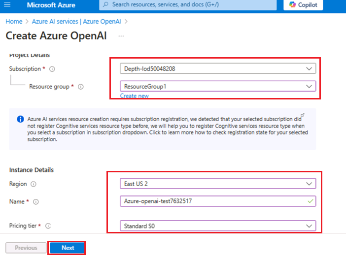
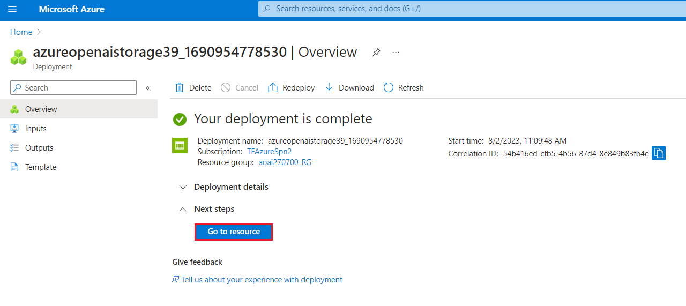
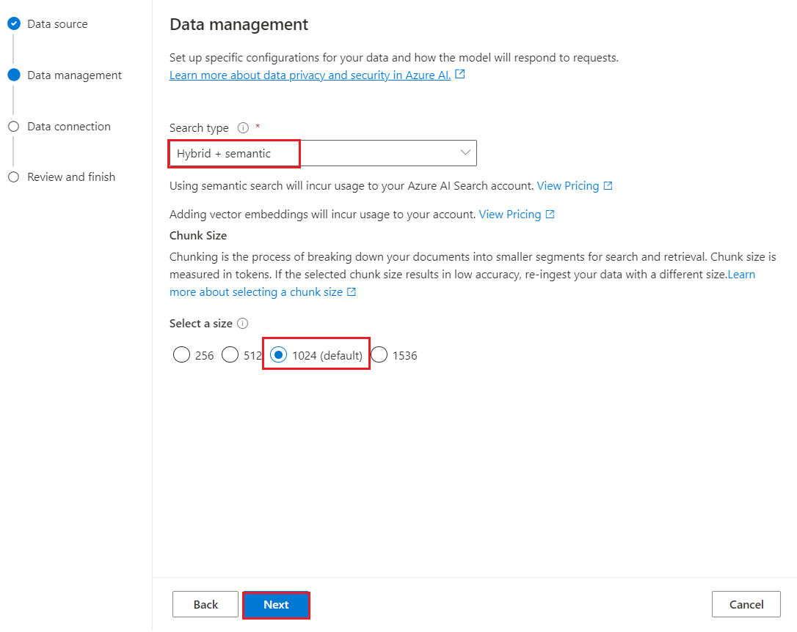
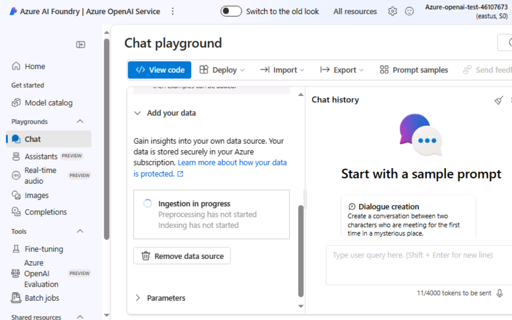
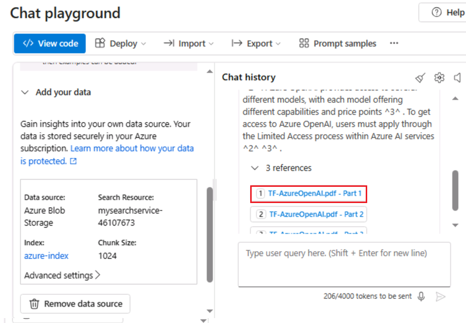
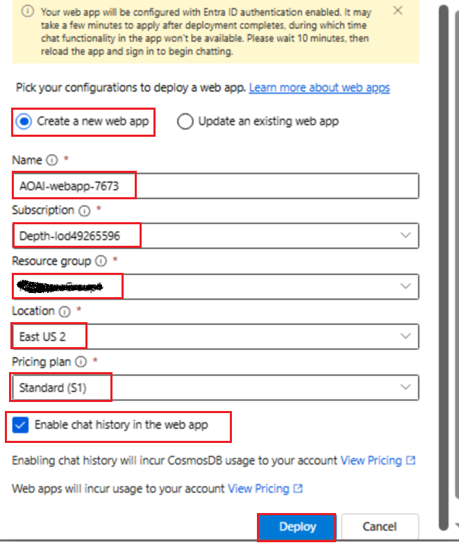
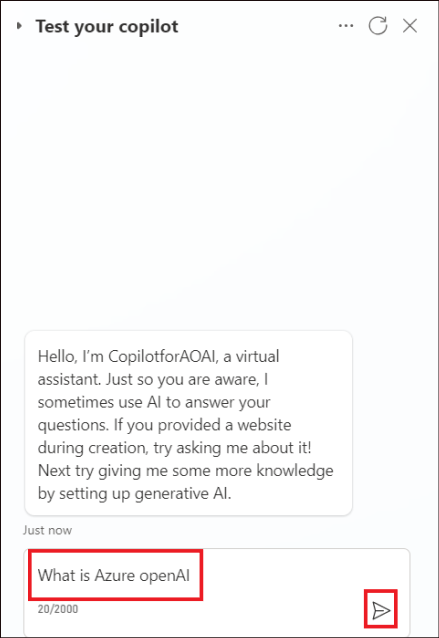
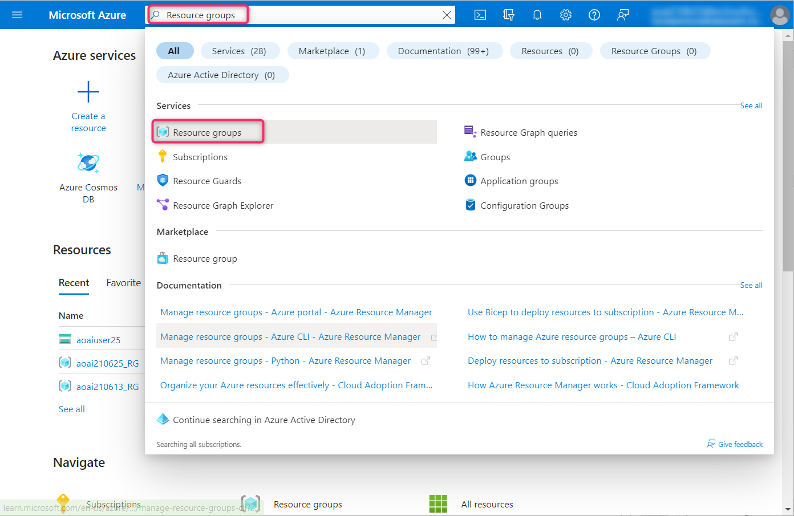

# ユースケース 10 - Azure OpenAI Service を使用して、カスタムデータを使用して Web アプリと Power Virtual Agent ボットを作成する

**紹介：**

データに対する Azure OpenAI は、OpenAI の強力な ChatGPT (gpt-35-turbo)
および GPT-4
言語モデルと連携して、データに基づいて応答を提供できるようにします。REST
API または Azure OpenAI Studio の Web
ベースのインターフェイスを使用して、データ上の Azure OpenAI
にアクセスし、データに接続するソリューションを作成して、チャット
エクスペリエンスを強化できます。

Azure OpenAI がデータに対して行う重要な機能の 1
つは、モデルの出力を強化する方法でデータを取得して活用できることです。Azure
OpenAI は、Azure Cognitive Search
と連携して、ユーザー入力と提供された会話履歴に基づいて、指定されたデータ
ソースから取得するデータを決定します。このデータは拡張され、OpenAI
モデルへのプロンプトとして再送信され、取得された情報は元のプロンプトに追加されます。取得されたデータはプロンプトに追加されますが、結果の入力は他のプロンプトと同様にモデルによって処理されます。データが取得され、プロンプトがモデルに送信されると、モデルはこの情報を使用して完了を提供します。

**目標**

- Azure portal でストレージ アカウント、コンテナー、Azure cognitive
  search サービスを作成するため。

- Azure AI Studio で gpt-3-turbo と埋め込みモデルをデプロイし、Chat
  Playground でデータを追加する。

- チャット
  プレイグラウンドでアシスタントのセットアップをテストするには、チャット
  セッションでクエリを送信します。

- copilotを起動してボットとの会話を開始するため。

- 新しいアプリを起動し、copilot アプリとの会話を開始するには。

- gpt-3-turbo と埋め込みモデル、Azure ストレージ アカウント、cognitive
  search serviceサービス、新しい Web アプリを削除します。

## 演習 1- ポータルを使用して Azure Storage アカウントと Azure cognitive Search を作成する

### タスク 1: Azure OpenAI リソースを作成する

1.  ブラウザを開き、アドレスバーに移動して、次のURLを入力または貼り付けます:+++<https://portal.azure.com/+++>、Enter
    ボタンを押します。

2.  **Microsoft
    Azure**ウィンドウで、**ユーザー資格情報を使用して**Azureにログインします。

3.  次に、パスワードを入力して、**Sign in** ボタンをクリックします。

4.  **Stay signed
    in?** ウィンドウで、\[**Yes** **\]**ボタンをクリックします。

5.  Azure ポータルのホームページで、 **次の図に示すように、Microsoft
    Azure コマンド バーの左側にある 3 本の水平バーで表される** Azure
    ポータル メニューをクリックします。

6.  移動して \[**+ Create a resource\] をクリックします**。

7.  \[**Create a resource** \] ページの **\[Search services and
    marketplace** \] 検索バーに「**Azure OpenAI**」と入力し、**Enter**
    キーを押します。

8.  \[**Marketplace\]** ページで、\[**Azure
    OpenAI**\]セクションに移動し、\[Create\]ボタンのドロップダウンをクリックして、図に示すように**\[Azure
    OpenAI**\]を選択します。(すでにクリックしている場合は、 **Azure
    OpenAI** タイルをクリックし、**Azure OpenAI ページの**
    \[**Create** **\] ボタンをクリックします**。

9.  \[**Create Azure OpenAI** \] ウィンドウの \[**Basics** \]
    タブで、次の詳細を入力し、\[**Next** **\]** ボタンをクリックします。

[TABLE]

> 

10. \[**Network** **\]**
    タブで、すべてのラジオボタンをデフォルトの状態のままにして、\[**Next** **\]**ボタンをクリックします。

11. **\[Tags** **\]**
    タブで、すべてのフィールドをデフォルトの状態のままにして、\[**Next** **\]**
    ボタンをクリックします。

12. **「Review+submit** 」タブで、検証に合格したら「**Create**」ボタンをクリックします。

13. デプロイが完了するまで待ちます。デプロイには約 2 - 3 分かかります。

14. **Microsoft.CognitiveServicesOpenAI**
    ウィンドウで、デプロイが完了したら、\[**Go to resource** **\]**
    ボタンをクリックします。

### タスク 2: ポータルを使用して Azure Storage アカウントを作成する

1.  +++[https://portal.azure.com/+++
    にサインインします。](https://portal.azure.com/+++)

2.  **Portal Menuをクリックし**、**+ Create a resourceを選択します**

3.  \[**Create a resource** \] ウィンドウの検索ボックスに「**Storage
    account** 」と入力し、**storage accountをクリックします**。

4.  \[**Marketplace\]** ページで、\[**Storage account** **\]**
    セクションをクリックします。

5.  \[**Storage account** **\]** ウィンドウで、\[**Create** \]
    ボタンをクリックします。

6.  \[**Create a storage account** **\]** ウィンドウの \[**Basics** \]
    タブで、ストレージ
    アカウントを作成するための次の詳細を入力し、\[**Review**\]
    をクリックします

[TABLE]

> 

7.  \[**Review** **\]** タブで、\[**Create** \] ボタンをクリックします。

8.  この新しい Azure Storage アカウントは、Azure Data Lake
    のデータをホストするように設定されました。「**Go to
    resource** **」**ボタンをクリックします。

9.  アカウントがデプロイされると、Azure Data Lake に関連するオプションが
    \[概要\] ページに表示されます。左側のナビゲーション ウィンドウで、
    **\[Data storage\]** セクションに移動し、 \[**Containers**\]
    をクリックします。

10. **azureopenaistorageXX |
    Containers** ページで、\[**+Container\]をクリックします。**

11. 右側に表示される \[New container\]
    ウィンドウで、コンテナー**の名前**を +++ **source** +++
    として入力し、\[**Create** \] ボタンをクリックします。

12. **azureopenaistorageXX |
    Containers** ページで、**source** コンテナを選択します\*\*。\*\*

13. **source** コンテナページで、\[**Upload** \]ボタンをクリックします。

14. \[**Upload blob** \] ウィンドウで、\[**Browse for file**\]
    をクリックし、**C:\Labfiles の場所に移動して**
    \[**TF-AzureOpenAI.pdf\] を選択し**、\[**Open\]**
    ボタンをクリックします。

\

15. **\[Upload blob** \] ウィンドウで、\[**Upload** \]
    ボタンをクリックします。

16. アップロードが成功すると**、通知 – Successfully uploaded blob**
    が表示されます。

### タスク 3: ポータルで Azure AI Search サービスを作成する

1.  **azureopenaistorageXX | Containers**ページで \[**Home** \]
    をクリックして Azure portal のホームページに戻ります。

2.  Azure portal のホーム ページで、 **\[+ Create Resource\]
    をクリックします**。

3.  \[**Create a resource** **\] 検索バーに「Azure AI
    Search」と入力し、** 表示された **azure ai search
    をクリックします**。

4.  **azure ai search セクション**をクリックします。

5.  **Azure AI Search** ページで、 \[**Create\]**
    ボタンをクリックします。

6.  \

7.  \[**Create a search service** \]
    ページで、次の情報を入力し、\[**Review+create**\]
    ボタンをクリックします。

[TABLE]

> 
>
> 

8.  検証に合格したら、\[**Create** **\]**ボタンをクリックします。

9.  デプロイが完了したら、\[**Go to resource\]**
    ボタンをクリックします。

10. **mysearchserviceXX** の \[概要\] ページで左側のナビゲーション
    ウィンドウの **\[Settings**\] セクションで、 \[**Semantic ranker\]
    を選択します**。

11. **\[Semantic ranker**\] タブで、\[**Standard**\]
    タイルを選択し、\[**Select plan\] をクリックします。**

12. 通知が表示されます- **Successfully updated semantic ranker to free
    plan**

## 演習 2: Azure OpenAI Studio を使用してデータを追加する

### タスク 1: Azure AI Studio で gpt-35-turbo モデルと埋め込みモデルをデプロイする

1.  Azure portal に戻り、Azure OpenAI を検索して選択します。

2.  **Azure OpenAI サービス**を選択します。

3.  **AzureOpenAI** ウィンドウで、 **左側のナビゲーション メニューの**
    \[**Overview**\] をクリックし、**新しいブラウザーで Azure AI Foundry
    portal** **の \[Explore Azure AI Foundry portal** \]
    ボタンをクリックします

4.  **Azure AI Foundry** |**Azure OpenAI Studio**
    ホームページ**の左側のナビゲーション メニューから**
    \[**Deployment** \] を選択します。

> 

5.  \[**Deployment** **\]** ウィンドウで、 **+ Deploy
    model** **を**ドロップダウンし、 \[**Deploy base model\]
    を選択します。**

6.  \[**Select a model** \] ダイアログ ボックスで、gpt-4
    をナビゲートして慎重に選択し、\[**Confirm\]**
    ボタンをクリックします。

> 

7.  \[**Deploy model\]
    ダイアログボックス**で、次の詳細を入力し、\[**Create\]**
    ボタンをクリックします。

    - モデルを選択:**gpt-35-turbo**

    - デプロイ名: **gpt-35-turbo と入力します**

    - \[**Deployment type\] として** \[**Standard\] を選択します**

> 
>
> 
>
> 

8.  \[**Deployments** **\]** ウィンドウで、 **\[+ Deploy model** **\]
    モデルを**ドロップダウンし、 \[**Deploy base model\]
    を選択します。**

> 

9.  \[**Select a model** **\]** ダイアログ ボックスで、移動して
    **text-embedding-ada-002** を慎重に選択し、\[**Confirm** **\]**
    ボタンをクリックします。

10. \[**Deploy model** \] ダイアログ ボックスで、\[**Deployment
    name** \] に次のように入力します。

> +++text-embedding-ada-002+++、**Deployment
> type** として**Standard** を選択し、**Deploy** ボタンをクリックします。

11. **Azure AI Foundry |Azure OpenAI Service** ホームページの
    **\[Playgrounds\]** セクションで、 **\[Chat**\] をクリックします。

12. \[**Chat playground** **\]** ウィンドウで、\[**Add your data\]
    ドロップダウンで \[**+ **Add a data source**\] **を選択します 。**

### タスク 2: Azure OpenAI Studio を使用してデータを追加する

1.  \[**Select or add data source** **\] ページで、\[Select or add data
    source\] の下にあるドロップダウンをクリックし**、移動して **\[Azure
    Blob Storage**\] をクリックします。

2.  \[**デSelect or add data source** **\]** ページの \[**Select or add
    data source** \] で、次の詳細を入力し、\[**Next**\]
    を選択します**。**

[TABLE]

3.  \[**Add vector search to this search resource\]
    チェックボックスをオンにします**。

4.  埋め込みモデルを **text-embedding-ada-002**
    として選択し、\[**Next** **\]** ボタンをクリックします。

***注**:エラーが発生した場合は、**このリソースでCORSを管理できません。別のストレージリソースを選択し**、タスク#1で説明されているように、VMの時間を同期してください。*

5.  \[**Add data** \] ページの \[**Data management** \] タブで
    \[検索の種類\] をドロップダウンし、\[**Hybrid+semantic\]
    を選択します。**

6.  チャンクサイズ**を1024**(**default**)**として選択**
    し、\[**Next**\]をクリックします**。**

7.  \[**Data connection** **\] ペイン**で **\[API key** \]
    を選択し、\[**Next** **\]** ボタンをクリックします。

8.  \[**Review and Finish\]** ペインで、入力した詳細を確認し、\[**Save
    and close**\] ボタンをクリックします。

9.  データはChat Playgroundに追加されます。これには約4〜5分かかります。

### タスク 3: Chat Playground でのテキスト補完の探索

1.  \[**Chat session** **\]セクションで、\[User
    message** **\]テキストボックスに**
    次のプロンプトを入力し、\[**Send** \]アイコンをクリックします

CodeCopy

> Azure OpenAI Service とは？

2.  \[**Chat session** **\]**
    セクションで、参照リンクを選択し、ページの右側にある検索ドキュメントの詳細を確認します。

## 演習 3: カスタムデータを使用して Web アプリをデプロイする

### タスク 1: Web アプリをデプロイする

1.  In Azure **AI Foundry |Azure OpenAI Service**
    のホームページで**、Chat playground
    pane**、**Deployを**ドロップダウンし、**as web
    appをクリックします**。

2.  \[**Deploy to a web app** \] ウィンドウで、\[**Create a new web
    app** \] ラジオ ボタンを選択し、次の詳細を入力します。

[TABLE]

3.  Webアプリでチャット履歴を有効にする**のチェックボックスを選択します**

4.  \[**Deploy** **\]ボタンをクリックします** 。

注 : デプロイには 5 分から 10 分かかります

5.  デプロイの状態を確認するには、\[**Deployments** \]
    をクリックし**、\[App deployment\] を選択します**。

6.  デプロイが完了するまで待ちます。デプロイには約 **10 -15**
    分かかります。

7.  Webアプリケーションをクリックします。

8.  認証設定をアプリに正常に適用できるように、10 分待ってください。

9.  10分後、\[**Refresh** **\]**ボタンをクリックします。

10. **\[Permissions requested** **\]** ダイアログ
    ボックスで、\[**Accept** **\]** ボタンをクリックします

11. これで、Webアプリが新しいブラウザで開きます。

12. **Azure AI** Web アプリのページで、次のテキストを入力し、
    **次の図に示すように** \[送信\] アイコンをクリックします。

**CodeCopy**

How do I get access to Azure OpenAI?

 

13. 同様に、次のテキストをテキストボックスに貼り付けて、\[**送信**\]アイコンをクリックします。

**CodeCopy**

**+++What is the expiry date of GPT-35-Turbo version 0301 and GPT-4
version 0314?+++**

14. Webアプリのページを更新し、\[**Show chat
    history\]をクリックします**。

15. チャット履歴の下にある \[**Accessing Azure OpenAI\]
    をクリックします**。

## 演習 4: カスタム データを使用して Copilot アプリを作成する

### タスク 1: カスタム データを使用してチャットボットを作成する

1.  **Azure AI Foundry |Azure AI Studio Chat playgroundの**
    \[データの追加\] で \[Remove data source\] を選択します。

2.  \[**Chat playground** **\]** ウィンドウで、\[**Add your data\]
    ドロップダウンで \[**+ **Add a data source**\] **を選択します 。**

3.  \[**Add data** \] ページの \[**Select or add data source** **\] で**
    、次の詳細を入力し、\[**Next**\] を選択します**。**

[TABLE]

> 
>
> ***注**:エラーが発生した場合は、**このリソースでCORSを管理できません。別のストレージリソースを選択し**、タスク#1で説明されているように、VMの時間を同期してください。*

4.  \[**Add data** \] ページの \[**Data management**\] タブで
    \[検索の種類\] をドロップダウンして \[**Keyword**\]
    を選択し**、**チャンク サイズを **1024 (default)
    として選択**し、\[**Next**\] をクリックします**。**

5.  \[**Data connection** **\] ペイン**で **\[API key** \]
    を選択し、\[**Next** **\]** ボタンをクリックします。

6.  \[**Review and Finish**\] ペインで、入力した詳細を確認し、\[**Save
    and close\]** ボタンをクリックします。

 

7.  データはChat Playgroundに追加されます。これには約4〜5分かかります。

### タスク 2: Azure OpenAI のカスタム データを使用してcopilotを作成する

1.  Azure
    ログイン資格情報を使用して+++<https://copilotstudio.microsoft.com/>+++にログインします。

2.  ログインしたら、\[Welcome to Microsoft Copilot Studio\]
    ページで、お住まいの国を選択し、\[**Start free trial\]
    をクリックします**。

3.  Copilot のホームページが開きます。

> 

4.  左側のペインから \[**Agents**\] **を選択します** 。次に、**+ New
    agentをクリックします**。

> 

5.  **Skip to configure** を選択して構成します**。**

6.  \[copilotの作成\] ページで、**名前**を +++**CopilotforAOAI**+++
    として入力し、\[**Create**\] をクリックします。

7.  **Topics -\> System -\> Conversational boostingをクリックします**。

> 

8.  Create generative answers**ノードのData sources**
    **の下にある**Edit**をクリックします** 。開いた **\[Properties**\]
    ウィンドウで **\[Classic data** \] を選択します。

> 

9.  **Azure OpenAI Services on your dataで、** \[**Connection
    properties\] をクリックします 。**

> 

10. これにより、Azure OpenAI サービス接続が追加され、接続プロパティ
    ウィンドウが開きます。

11. \[**接続プロパティ**\] ウィンドウの **\[全般 -\> 構成\]
    で**、以下の詳細を入力します

> デプロイメント – +++gpt-4 +++
>
> Api バージョン – 最新バージョンを選択します
>
> 

12. \[**Model data** \] タブで、\[データ ソース\] の **\[+ Add** \]
    をクリックし、以下の詳細を追加します。

Index name - +++copilot-index+++

Content data – +++content+++

13. 「**Save」をクリックします**。

**タスク 3: copilotをテストする**

1.  \[**Test** **\]** をクリックして、 \[Copilot のテスト\]
    ウィンドウを開きます。

2.  「+++ What is Azure OpenAI?+++」と入力し、\[**Send**\]
    をクリックします。

3.  Azure OpenAI
    **resourceにアップロードされたデータから応答を受け取ります**。また、
    **返信の下に** Surfaced with Azure OpenAI
    メッセージがあることを確認します。

**タスク 4: リソースの削除**

1.  ストレージ アカウントを削除するには、Azure portal のホーム
    ページに移動し、 **Azure portal の検索バーに**「リソース
    グループ」と入力し、 **\[Services**\] の下の **\[Resource groups**\]
    に移動してクリックします。

2.  割り当てられたリソースグループをクリックします。

3.  作成したすべてのリソースを慎重に選択します。

4.  リソース グループ ページで、コマンド
    バーに移動し、**Deleteをクリックします**。

**重要な注意:** \[**Delete resource group\]
をクリックしないでください**。コマンド バーに **\[Delete** \]
オプションが表示されない場合は、横方向の省略記号をクリックします。

5.  右側に表示される\[**Delete
    Resources**\]ペインで、**delete** を入力し、\[**delete** \]ボタンをクリックします。

6.  **Delete
    confirmation** ダイアログボックスで、\[D**elete** \]ボタンをクリックします。

7.  ベルのアイコンをクリックすると、**Executed delete command on 4
    selected itemsという通知が表示されます。**

**概要**

Azure portal でストレージ アカウント、コンテナー、Azure cognitive
service を作成し、Azure AI Studio で gpt-3-turbo
モデルをデプロイしました。Chat Playground にデータを追加し、チャット
セッションでクエリを送信してアシスタントの設定をテストしました。次に、新しいアプリを起動し、チャットボットとの会話を開始しました。Azure
OpenAI リソースを効果的かつ効率的に管理するために、gpt-3-turbo
モデル、Azure ストレージ
アカウント、コグニティブ検索サービス、および新しい Web
アプリを削除しました。
