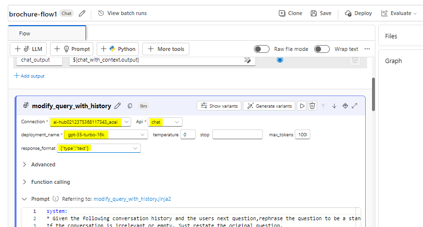

# 用例 11 - 使用 Azure AI Foundry 和搜索集成創建自訂 AI 代理

**預計時間：45 分鐘**

## 目的

本實驗室的目標是指導參與者使用 Azure AI 服務和搜索集成構建 AI
支援的代理。參與者將學習配置、集成和測試關鍵元件，以創建能夠智慧資訊檢索和交互的功能代理，從而增強使用者體驗和生產力。

## 溶液

此實驗室側重於將 Azure AI
服務與高級搜索功能集成，以創建強大、智慧的解決方案。它強調配置 AI
驅動的代理、實現無縫資料檢索以及提供上下文回應。通過利用 AI
和搜索集成，該解決方案旨在通過直觀高效的交互簡化工作流程、改進決策並提高用戶參與度。

## 任務 1：創建 Azure AI 搜索資源

1.  在 Web 流覽器中，https://portal.azure.com 打開 Azure 門戶，然後使用
    Office 365 管理員憑據登錄。

> 

2.  在主頁上，選擇 “**+ Create a resource” 並搜索**“**Azure AI
    Search**”。然後使用以下設置 **create** 新的 Azure AI 搜索資源：:

    - **訂閱：**選擇您的 Azure 訂閱。

    - **資源組：**選擇或創建資源組，這裡我們選擇 RG4OpenAI

    - **服務名稱：**輸入唯一的服務名稱，這裡我們將其命名為 copilotXXXX

    - **地點：** 從以下任何地區**隨機**選擇，這裡我們選擇 加拿大東部

      - 澳大利亞東部

      - 加拿大東部

      - 美國東部

      - 美國東部 2

      - 法國中部

      - 日本東部

      - 美國中北部

      - 瑞典中部

      - 瑞士

    - **定價層：** 標準

    - 點擊 **Review+create，**然後點擊 **Create。**

> 
>
> 
>
> 
>
> 
>
> 稍後，您將在 Azure AI 搜索資源所在的區域中創建一個 Azure AI
> 中心（其中包括 Azure OpenAI 服務）。Azure OpenAI
> 資源在租戶級別受區域配額的約束。列出的區域包括本練習中使用的模型類型的預設配額。在與其他使用者共用租戶的情況下，隨機選擇區域可降低單個區域達到其配額限制的風險。如果在練習的後期達到配額限制，則可能需要在其他區域中創建另一個
> Azure AI 中心。

3.  等待 Azure AI 搜索資源部署完成。

> 

## 任務 2：創建 Azure AI 項目

1.  在 Web 流覽器中，打開 <https://ai.azure.com> 的 *Azure AI Foundry
    門戶*，然後使用 Azure 憑據登錄。

2.  在主頁中，選擇 **+ Create project**。

> 

3.  在 **Create a project** 嚮導中，輸入專案名稱
    **ProjectXXXX**，然後按一下 **Customize**。

> 

4.  在 “**In Customize**” 中，連接到 Azure AI
    搜索資源，輸入以下詳細資訊，選擇“**Next** ”並查看您的配置。

    - **集線器名稱：hubXXXX**

    - **Azure 訂閱：**您的 Azure 訂閱

    - **資源組：RG4OpenAI**

    - **位置：**與 Azure AI 搜索資源相同的位置**，加拿大東部**

    - **連接 Azure AI 服務或 Azure
      OpenAI：**（新）使用所選中心名稱自動填充

    - **連接 Azure AI 搜索：**選擇 Azure AI 搜索資源 **copilotXXXX**

> 

5.  選擇 **Next** ，然後選擇 **Create** 並等待該過程完成。

> 
>
> 
>
> 

## 任務 3：部署模型

您需要兩個模型來實現您的解決方案：

- 一種嵌入模型，用於向量化文本資料以實現高效的索引和處理。

- 一種可以根據您的資料生成對問題的自然語言回應的模型。

1.  在 Azure AI Foundry 門戶的項目中，在左側功能窗格中的 **My
    assets**（我的資產）下，選擇 **Models + endpoints**（模型 +
    終端節點）頁面。

> 

2.  在 **Manage deployments of your models and services**
    （管理模型和服務的部署） **頁面**上，按一下 **+Deploy model**
    （部署模型），然後選擇 **Deploy base model**（部署基礎模型）。

> 

3.  在 **Select a model** 頁面上，搜索並選擇 **text-embedding-ada-002**
    model ，然後按一下 **Confirm**。

> 

4.  在 **Deploy model text-embedding-ada-002** 窗格中，按一下
    **Customize** 並在 Deploy model 嚮導中輸入以下詳細資訊：

> 

- **部署名稱：**text-embedding-ada-002

- **部署類型：**標準

- **模型版本：**選擇默認版本

- **AI 資源：**選擇之前創建的資源

- **每分鐘權杖數速率限制（千）：**5K

- **內容篩檢程式：**DefaultV2

- **啟用動態配額：**已禁用

> 
>
> 

5.  重複上述步驟，部署部署名稱為 gpt-35-turbo-16k 的
    **gpt-35-turbo-16k** 模型。

> 
>
> 
>
> **注意：**減少每分鐘權杖數 （TPM）
> 有助於避免過度使用您正在使用的訂閱中的可用配額。5,000 個 TPM
> 足以滿足本練習中使用的資料。

## 任務 4：向專案添加資料

您的 copilot 的資料由一組來自虛構旅行社 Margie's Travel 的 PDF
格式的旅行手冊組成。讓我們將它們添加到項目中。

1.  導航到系統的 C：\Lab 文件中名為 **brochures** 的資料夾。

2.  在 Azure AI Foundry 門戶的項目中，在左側功能窗格中的“**My assets**”
    下，選擇“**Data + indexes** ”頁。

> 

3.  選擇 **+ New data**。

> 

4.  在 **Add your data** 嚮導中，展開下拉式功能表以選擇 **Upload
    files/folders**。

> 

5.  選擇 **Upload folder** 並選擇 **brochures** 資料夾。

> 

6.  選擇 **Next** 在螢幕上。

> 

7.  等待資料夾上傳，並注意它包含多個.pdf文件。

8.  在下一頁的 name and finish 中，輸入資料名稱 **data0212**，然後按一下
    **Create**。

> 
>
> 

## 任務 5：為您的資料創建索引

現在，你已將資料來源添加到項目中，可以使用它在 Azure AI
搜索資源中創建索引。

1.  在 Azure AI Foundry 門戶的項目中，在左側功能窗格中的 “**My
    assets**”下，選擇“**Data + indexes**”頁。

> 

2.  在 **Indexes** （索引） 選項卡中，添加具有以下設置的新索引，然後選擇
    **Next** （下一步）。

    - **源位置：**

      - **資料來源：**Azure AI Studio 中的資料

        - *選擇 **brochures** 資料來源 -- **dataXXXX***

- 按照以下給定的選項配置索引，然後選擇 **Next**。

  - **選擇 Azure AI 搜索服務：**選擇與 Azure AI 搜索資源的
    **AzureAISearch 連接**

  - **向量索引：**brochures-index

  - **虛擬機器：**自動選擇

> 

- 按如下所示配置搜索設置，然後選擇 **Next**，在 Review 視窗中按一下
  **Create Vector Index**。

  - **向量設置：**向此搜索資源添加向量搜索

  - **Azure OpenAI 連接：**為中心選擇默認的 Azure OpenAI 資源。

> 
>
> 

3.  等待索引過程完成，這可能需要幾分鐘時間。索引創建作包括以下作業：

    - 將文本標記破解、分塊並嵌入到您的宣傳冊數據中。

    - 創建 Azure AI 搜索索引。

    - 註冊索引資產。

## 任務 6：測試索引

在基於 RAG 的提示流中使用索引之前，讓我們驗證一下它是否可用於影響
generative AI 響應。

1.  在左側的功能窗格中，選擇 **Playgrounds** 頁面，然後選擇 **Chat
    Playground**。

> 

2.  在 Chat （聊天） 頁面的 Setup （設置） 窗格中，確保您的
    **gpt-35-turbo-16k**
    模型部署處於選中狀態。然後，在主聊天會話面板中，提交提示 **Where can
    I stay in New York?**

> 

3.  查看回應，該回應應該是模型中的通用答案，不包含索引中的任何資料。

4.  在 設置 窗格中，展開 **Add your data** 欄位，然後添加
    **brochures-index** 專案索引並選擇 **hybrid (vector + keyword)**
    搜索類型。

> 
>
> **注意：**一些使用者發現新創建的索引立即不可用。刷新流覽器通常會有所幫助，但如果您仍然遇到找不到索引的問題，則可能需要等待索引被識別。

5.  添加索引並重新開機聊天會話後，重新提交提示**Where can I stay in New
    York?**

> 

6.  查看回應，該回應應基於索引中的資料。

## 任務 7：在提示流中使用索引

您的向量索引已保存在 Azure AI Foundry
專案中，使您能夠在提示流中輕鬆使用它。

1.  在 Azure AI Foundry 門戶中，在項目的左側功能窗格中，在 **Build and
    customize** 下，選擇 **Prompt flow** 頁面，然後按一下 **+Create**。

> 

2.  通過在庫中克隆 **Multi-Round Q&A on Your Data**
    示例來創建新的提示流。將此樣本的克隆保存在名為 **brochure-flow**
    的資料夾中。

> 
>
> 
>
> 注意：如果 Permissions 錯誤，請在 2
> 分鐘後使用新名稱重試，流程將被克隆。
>
> 

3.  當提示流設計器頁面打開時，查看
    **brochure-flow**。其圖形應類似於下圖：

> 

> 您正在使用的示例提示流實現了聊天應用程式的提示邏輯，在該應用程式中，使用者可以反覆運算地將文本輸入提交到聊天介面。聊天歷史記錄將保留並包含在每個反覆運算的上下文中。提示流編排一系列工具，以：

- 將歷史記錄附加到聊天輸入，以問題的上下文化形式定義提示。

- 使用您的索引和您根據問題選擇的查詢類型檢索上下文。

- 使用從索引中檢索到的資料來增強問題，從而生成提示上下文。

- 通過添加系統消息和構建聊天歷史記錄來創建提示變體。

- 將提示提交到語言模型以生成自然語言回應。

4.  使用 **Start compute session** （啟動計算會話）
    按鈕啟動流的運行時計算。

> 等待運行時啟動。這為提示流提供了計算上下文。等待時，在 **Flow** （流）
> 選項卡中，查看流中工具的部分。
>
> 

5.  在 **Inputs** （輸入） 部分中，確保輸入包括：

    - **chat_history**

    - **chat_input**

此示例中的預設聊天歷史記錄包括一些有關 AI 的對話。

6.  在 **Outputs** （輸出） 部分中，確保輸出包括：

    - 值為 ${chat_with_context.output} 的 **chat_output**

> 

7.  在 **modify_query_with_history**
    部分中，選擇以下設置（保持其他設置不變）：

    - **連接：**AI 中心的默認 Azure OpenAI 資源

    - **Api：**聊天

    - **deployment_name：**GPT-35-Turbo-16K

    - **response_format：** {“type”：“text”}

> 

8.  等待計算會話啟動，然後在 lookup 部分中，設置以下參數值：

    - **mlindex_content：**選擇空欄位以打開 Generate 窗格

      - **index_type**: 註冊索引

      &nbsp;

      - **mlindex_asset_id**: brochures-index:1

    - **查詢：**${modify_query_with_history.output}

    - **query_type：**混合（向量 + 關鍵字）

    - **top_k：**2

> 
>
> 

9.  在 **generate_prompt_context** 部分中，查看 Python
    腳本並確保此工具的 **inputs** 包含以下參數：

    - **search_result** *(對象)*: ${lookup.output}

> 

10. 在 **Prompt_variants** 部分中，查看 Python 腳本並確保此工具的
    **inputs** 包含以下參數：

    - **上下文**（字串）：${generate_prompt_context.output}

    - **chat_history** （字串） ： ${inputs.chat_history}

    - **chat_input** （字串） ： ${inputs.chat_input}

> 

11. 在 **chat_with_context** 部分中，選擇以下設置（保持其他設置不變）：

    - **連接：**Default_AzureOpenAI

    - **Api**: 聊天

    - **deployment_name**: gpt-35-turbo-16k

    - **response_format**: {“type”:”text”}

然後，確保此工具的輸入包括以下參數：

- **prompt_text**（字串）：${Prompt_variants.output}

> 

12. 在工具列上，使用 **Save** （保存）
    按鈕保存您對提示流中的工具所做的更改。

> 

13. 在工具列上，選擇
    **Chat**。此時將打開一個聊天窗格，其中包含示例對話歷史記錄和已根據示例值填充的輸入。您可以忽略這些。

> 

14. 在聊天窗格中，將默認輸入替換為問題 **Where can I stay in
    London？**並提交它。

> 

15. 查看回應，該回應應基於索引中的資料。

16. 查看流程中每個工具的輸出。

> 

17. 在聊天窗格中，輸入問題**What can I do there?**

18. 查看回應，該回應應基於索引中的資料，並考慮聊天歷史記錄（因此
    “there”應理解為“in London”）。

> 

19. 查看流程中每個工具的輸出，注意流程中的每個工具如何對其輸入進行作，以準備上下文化的提示並獲得適當的回應。

## 任務 8：挑戰

現在，你已經體驗了如何將自己的資料集成到使用 Azure AI Foundry 門戶構建的
Copilot 中，讓我們進一步探索！

嘗試通過 Azure AI Foundry
門戶添加新資料來源，為其編制索引，並將索引資料集成到提示流中。您可以嘗試的一些資料集是：

- 您電腦上的 （研究） 文章集合。

- 過去會議的一組演示文稿。

盡可能足智多謀地創建資料來源並將其集成到提示流中。嘗試新的提示流並提交只能由您選擇的資料集回答的提示！

## 任務 9：清理

為避免不必要的 Azure 成本和資源利用率，您應該刪除在本練習中部署的資源。

如果已完成對 Azure AI Foundry 的探索，請在 https://portal.azure.com
返回到 *Azure 門戶*，並在必要時使用 Azure 憑據登錄。然後刪除您預置了
Azure AI 搜索和 Azure AI 資源的資源組中的資源。
