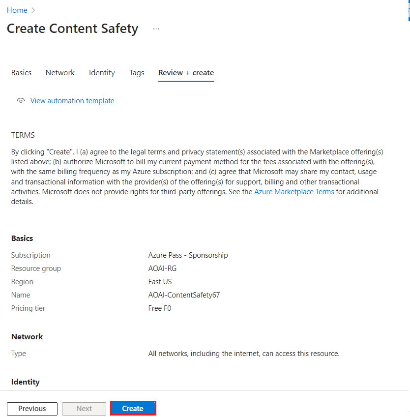
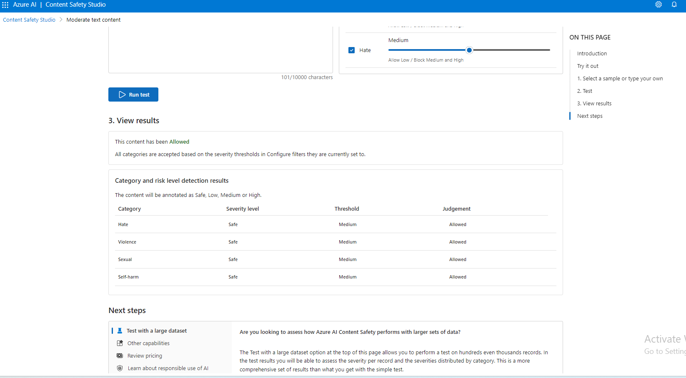
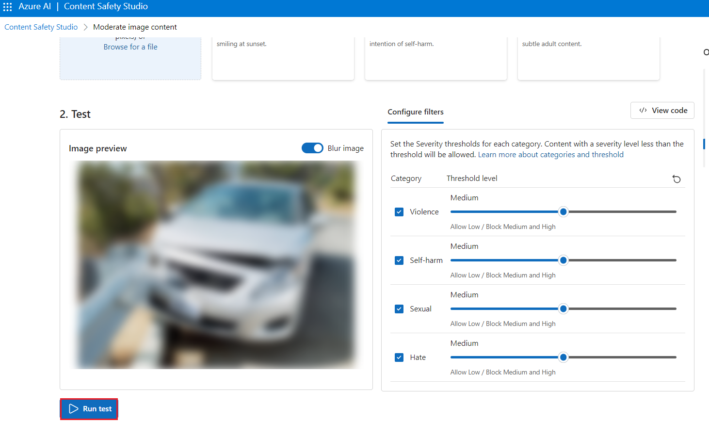

# Caso d'uso 12 - Moderare testo e immagini con la sicurezza dei contenuti in Azure AI Content Safety Studio

**Introduzione**

Azure AI Content Safety rileva i contenuti dannosi generati dagli utenti
e dall'intelligenza artificiale nelle applicazioni e nei servizi. Azure
AI Content Safety include API di testo e immagini che consentono di
rilevare materiale dannoso. Microsoft Azure dispone anche di uno studio
interattivo per la sicurezza dei contenuti che consente di visualizzare,
esplorare e provare codice di esempio per rilevare contenuti dannosi in
diverse modalità.

Il software di filtro dei contenuti può aiutare la tua app a rispettare
le normative o a mantenere l'ambiente previsto per gli utenti.

[Azure AI Content Safety
Studio](https://contentsafety.cognitive.azure.com/) è uno strumento
online progettato per gestire contenuti potenzialmente offensivi,
rischiosi o indesiderati usando modelli di Machine Learning per la
moderazione dei contenuti all'avanguardia. Fornisce modelli e flussi di
lavoro personalizzati, consentendo agli utenti di scegliere e creare il
proprio sistema di moderazione dei contenuti. Gli utenti possono
caricare i propri contenuti o provarli con i contenuti di esempio
forniti.

In Content Safety Studio sono disponibili le funzionalità seguenti del
servizio Azure AI Content Safety:

- **Moderare il contenuto del testo**: con lo strumento di moderazione
  del testo, puoi facilmente eseguire test sul contenuto del testo. Sia
  che tu voglia testare una singola frase o un intero set di dati,
  questo strumento offre un'interfaccia intuitiva che ti consente di
  valutare i risultati del test direttamente nel portale.

- **Moderare il contenuto delle immagini**: con lo strumento di
  moderazione delle immagini, puoi facilmente eseguire test sulle
  immagini per assicurarti che soddisfino i tuoi standard di contenuto.

- **Monitorare l'attività online**: la potente pagina di monitoraggio ti
  consente di monitorare facilmente l'utilizzo e le tendenze dell'API di
  moderazione in diverse modalità. Con questa funzione, è possibile
  accedere a informazioni dettagliate sulla risposta, tra cui la
  distribuzione della categoria e della gravità, la latenza, gli errori
  e il rilevamento dell'elenco bloccato. Queste informazioni forniscono
  una panoramica completa delle prestazioni di moderazione dei
  contenuti, consentendoti di ottimizzare il flusso di lavoro e
  assicurarti che i tuoi contenuti siano sempre moderati secondo le tue
  specifiche esatte.

**Obiettivi**

- Per distribuire una risorsa di Azure AI Content Safety.

- Per creare Azure AI Resource ed Explore Content Safety.

- Per configurare la risorsa di Azure AI in Azure AI Studio ed esplorare
  le funzionalità di sicurezza dei contenuti, enfatizzando la
  moderazione di testo e immagini.

## **Attività 1: Creare la risorsa Azure AI Content Safety**

1.  Aprire il browser, andare alla barra degli indirizzi, digitare o
    incollare il seguente URL:<https://portal.azure.com/> quindi premere
    il pulsante **Enter**.

> 

2.  Nella finestra **Sign in**, inserire **Username** e fare clic sul
    pulsante **Next**.

3.  Quindi, inserire la password e fare clic sul pulsante **Sign in.**

> 

4.  In **Stay signed in?** finestra, fare clic sul pulsante **Yes**.

> 

5.  Nella home page del portale di Azure, fare clic sul **menu del
    portale di Azure** rappresentato da tre barre orizzontali sul lato
    sinistro della barra dei comandi di Microsoft Azure, come illustrato
    nell'immagine seguente.

> 

6.  Navigare e fare clic su **+ Create a resource**.

> 

7.  Nella pagina **Marketplace**, nella barra di ricerca **Search
    services and marketplace**, digitare **Azure AI Content Safety**,
    quindi premere il pulsante **Enter**. Quindi, passare alla sezione
    **Azure AI Content Safety**, fare clic sul menu a discesa
    **Create**, quindi selezionare **Azure AI Content Safety** come
    illustrato nell'immagine seguente.

> 
>
> 

8.  Nella finestra **Create Azure OpenAI**, nella scheda **Basics**,
    immettere i dettagli seguenti e fare clic sul pulsante
    **Review+create**.

[TABLE]

> 

9.  Nella scheda **Review+submit**, una volta superata la convalida,
    fare clic sul pulsante **Create**.

> 

10. Attendere il completamento della distribuzione. L'implementazione
    richiederà circa 2-3 minuti.

11. Nella finestra **Microsoft.CognitiveServicesContentSafety**, al
    termine della distribuzione, fare clic sul pulsante **Go to
    resource**.

## Attività 2: Analizzare il contenuto del testo

1.  Nella pagina **Content Safety**, andare al riquadro **Moderate text
    content**, fare clic sul link **Try it out**.

2.  Nel riquadro **Settings**, selezionare **AOAI-ContentSafetyXX** e
    fare clic su **Use resource**.

3.  Nella pagina **Content Safety**, andare al riquadro **Moderate text
    content**, fare clic sul link **Try it out**.

4.  Nella scheda **Run a simple test,** selezionare il riquadro **Safe
    content,** come illustrato nell'immagine seguente.

5.  Facoltativamente, è possibile utilizzare i controlli a scorrimento
    nella scheda ** Configure filters** per modificare i livelli di
    gravità consentiti o vietati per ogni categoria. Quindi, fare clic
    sul pulsante **Run test.**

6.  Scorrere verso il basso per visualizzare i risultati. Il servizio
    restituisce tutte le categorie rilevate, il livello di gravità per
    ognuna di esse (0-Sicuro, 2-Basso, 4-Medio, 6-Alto) e un giudizio
    binario **Allowed **o **Reject**. Il risultato si basa sui filtri
    configurati.

7.  Scorrere verso il basso e fare clic sul pulsante **View Code** come
    mostrato nell'immagine seguente per visualizzare e copiare il codice
    di esempio, che include la configurazione per il filtro di gravità,
    gli elenchi bloccati e le funzioni di moderazione. È quindi
    possibile distribuire il codice sul proprio lato.

## Attività 3: Rilevare gli attacchi di input dell'utente

1.  Tornare a **Content Safety Studio**

2.  Nella pagina **Content Safety**, in **Explore safety solutions for
    Gen-AI**, passare al riquadro **Prompt Shields**, fare clic sul
    collegamento **Try it out**.

3.  Nella scheda **Set up sample,** selezionare il riquadro **Safe
    content** come illustrato nell'immagine seguente.

4.  Facoltativamente, è possibile utilizzare i controlli a scorrimento
    nella scheda **Prompt shields** per modificare i livelli di gravità
    consentiti o vietati per ogni categoria. Quindi, fare clic sul
    pulsante **Run test.**

8.  Scorrere verso il basso e fare clic sul pulsante **View Code** come
    mostrato nell'immagine seguente per visualizzare e copiare il codice
    di esempio, che include la configurazione per il filtro di gravità,
    gli elenchi bloccati e le funzioni di moderazione. È quindi
    possibile distribuire il codice sul proprio lato.

5.  Nella scheda **Set up sample,** selezionare il riquadro **User
    prompt attack content** e fare clic su **Run test** come illustrato
    nell'immagine seguente.

## Attività 4: Analizzare il contenuto dell'immagine

1.  Nel riquadro **Prompt Shields**, fare clic su **Back**

2.  Nella pagina **Content Safety**, andare al riquadro **Moderate image
    content** e fare clic sul collegamento **Try it out**.

3.  In sezione **select a sample or upload your own**, navigare e fare
    clic su **Browse for a file link**.

**Nota**: la dimensione massima per l'invio di immagini è di 4 MB e le
dimensioni dell'immagine devono essere comprese tra 50 x 50 pixel e
2.048 x 2.048 pixel. Le immagini possono essere in formato JPEG, PNG,
GIF, BMP, TIFF o WEBP.

4.  Passare alla posizione **C:\Labfiles** e selezionare **l'immagine
    del car-accident,** quindi fare clic sul pulsante **Open**.

5.  Facoltativamente, è possibile utilizzare i controlli a scorrimento
    nella scheda **Configure filters** per modificare i livelli di
    gravità consentiti o vietati per ogni categoria.

6.  Fare clic sul pulsante **Run test**.

7.  Scorrere verso il basso per visualizzare i risultati del test. Il
    servizio restituisce tutte le categorie rilevate, il livello di
    gravità per ognuna di esse (0-Sicuro, 2-Basso, 4-Medio, 6-Alto) e un
    giudizio binario **Accept o Reject**. Il risultato si basa sui
    filtri configurati

8.  Scorrere verso il basso e fare clic sul pulsante **View Code** come
    mostrato nell'immagine seguente per visualizzare e copiare il codice
    di esempio, che include la configurazione per il filtro di gravità,
    gli elenchi bloccati e le funzioni di moderazione. È quindi
    possibile distribuire il codice sul proprio lato.

## Attività 5: Eliminare il gruppo di risorse

1.  Passare alla home page del portale di Azure, digitare **Resource
    groups** nella barra di ricerca del portale di Azure, spostarsi e
    fare clic su **Resource groups** in **Services**.

> 

2.  Fare clic sul gruppo di risorse disponibile per la risorsa di Azure
    AI.

> 

3.  Nella home page del **Resource group,** selezionare **delete
    resource group**

4.  Nel riquadro **Delete Resources** visualizzato sul lato destro, vai
    a **Enter “resource group name” to confirm deletion**, quindi fare
    clic sul pulsante **Delete**.

5.  Nella finestra di dialogo **Delete confirmation**, fare clic sul
    pulsante **Delete**.

> 

6.  Fare clic sull'icona a forma di campana, vedrai la notifica –
    **Deleted resource group AOAI-RG89.**

** **

**Sommario**

In questo lab sono state create e configurate le risorse di Azure per
Azure AI Content Safety Studio con particolare attenzione alla
moderazione del contenuto per testo e immagini, Esplorazione delle
funzionalità di moderazione del contenuto di testo e immagini. In questo
lab si è appreso come implementare le funzionalità di moderazione del
contenuto all'interno dell'ambiente Azure.
