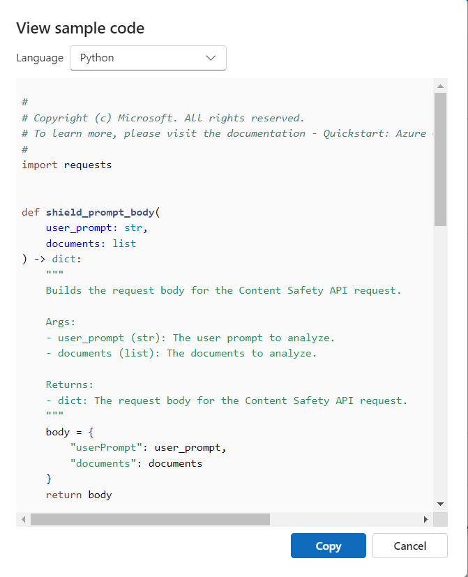
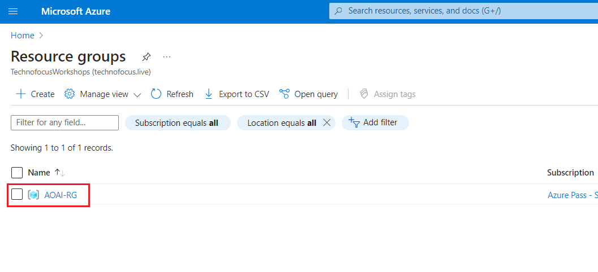
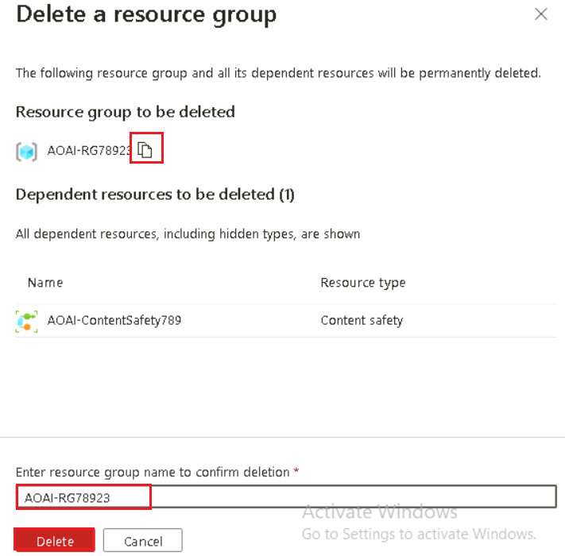

# ユースケース 12 - Azure AI Content Safety Studio でコンテンツの安全性を使用してテキストと画像をモデレートする

**紹介**

Azure AI Content Safety
は、アプリケーションやサービス内の有害なユーザー生成コンテンツと AI
生成コンテンツを検出します。Azure AI Content Safety
には、有害な素材を検出できるテキストと画像の API
が含まれています。Microsoft Azure
には、さまざまなモダリティで有害なコンテンツを検出するためのサンプルコードを表示、探索、試すことができる対話型の
Content Safety Studio もあります。

コンテンツフィルタリングソフトウェアは、アプリが規制に準拠したり、ユーザー向けの環境を維持したりするのに役立ちます。

[Azure AI Content Safety
Studio](https://contentsafety.cognitive.azure.com/)
は、最先端のコンテンツモデレーション ML
モデルを使用して、潜在的に不快、危険、または望ましくないコンテンツを処理するように設計されたオンラインツールです。テンプレートとカスタマイズされたワークフローを提供し、ユーザーが独自のコンテンツモデレーションシステムを選択して構築できるようにします。ユーザーは、自分のコンテンツをアップロードすることも、提供されているサンプルコンテンツで試してみることもできます。

Content Safety Studioでは、次の Azure AI Content Safety
サービス機能を使用できます：

- **テキストコンテンツのモデレート**:テキストモデレーションツールを使用すると、テキストコンテンツに対してテストを簡単に実行できます。1つの文をテストする場合でも、データセット全体をテストする場合でも、このツールは、ポータルで直接テスト結果を評価できるユーザーフレンドリーなインターフェイスを提供します。

- **画像コンテンツのモデレート**:
  画像モデレーションツールを使用すると、画像に対してテストを簡単に実行して、画像がコンテンツ基準を満たしていることを確認できます。

- **オンラインアクティビティの監視**:強力な監視ページでは、さまざまなモダリティ間でのモデレーションAPIの使用状況と傾向を簡単に追跡できます。この機能を使用すると、カテゴリと重大度の分布、遅延、エラー、ブロックリスト検出など、詳細な応答情報にアクセスできます。この情報により、コンテンツモデレーションのパフォーマンスの完全な概要がわかり、ワークフローを最適化し、コンテンツが常に正確な仕様に合わせてモデレートされるようにすることができます。

**目標**

- Azure AI Content Safetyリソースをデプロイするため。

- Azure AIリソースを作成し、コンテンツの安全性を探索します。

- Azure AI Studio で Azure AI
  リソースを設定し、テキストと画像のモデレーションに重点を置いて、コンテンツの安全性機能を探索する。

## **タスク 1: Azure AI Content Safety リソースを作成する**

1.  ブラウザを開き、アドレスバーに移動し、次のURLを入力または貼り付けます:<https://portal.azure.com/>
    Enterボタンを押します。

> 

2.  \[**Sign
    in\]**ウィンドウで、\[**Username**\]を入力し、\[**Next\]**ボタンをクリックします。

3.  次に、パスワードを入力して\[**Sign
    in\]**ボタンをクリックします**。**

> 

4.  **Stay signed in?**ウィンドウで、\[**Yes\]**ボタンをクリックします。

> 

5.  Azure ポータルのホームページで、 **次の図に示すように、Microsoft
    Azureコマンドバーの左側にある3本の水平バーで表される** Azure
    ポータル メニューをクリックします。

> 

6.  **+ Create a resourceをクリックします**。

> 

7.  \[**Marketplaceページの** \[**Search services and marketplace**
    **検索バー**に**「Azure AI Content
    Safety**」と入力し、**Enter**ボタンを押します。次に、 \[**Azure AI
    Content Safety**\] セクションに移動し、 **\[Create**\]
    ボタンのドロップダウンをクリックして、**次の図に示すように**
    \[**Azure AI Content Safety**\] を選択します。

> 
>
> 

8.  \[**Create Azure OpenAI\]** ウィンドウの \[**Basics**\]
    タブで、次の詳細を入力し、\[**Review+create\]
    ボタンをクリックします**。

[TABLE]

> 

9.  **「Review+submit**」タブで、検証が合格したら「**Create」**ボタンをクリックします。

> 

10. デプロイが完了するまで待ちます。デプロイには約2-3分かかります。

11. **Microsoft.CognitiveServicesContentSafety**ウィンドウで、デプロイが完了したら、\[**Go
    to resource\]** ボタンをクリックします。

## タスク 2: テキストコンテンツの分析

1.  \[**Content Safety\]** ページで、\[**Moderate text content**\]
    タイルに移動し、\[**Try it out**\] リンクをクリックします。

2.  **\[Settings**\] ウィンドウで **\[AOAI-ContentSafetyXX**\]
    を選択し、\[**Use resource\] をクリックします**。

3.  \[**Content Safety\]** ページで、\[**Moderate text content**\]
    タイルに移動し、\[**Try it out**\] リンクをクリックします。

4.  \[**Run a simple test**\] タブで、 **次の図に示すようにSafe
    content**タイルを選択します。

5.  必要に応じて、「**Configure
    filters」**タブのスライドコントロールを使用して**、**
    各カテゴリの許可または禁止の重大度レベルを変更できます。次に、\[**Run
    test**\]ボタンをクリックします**。**

6.  下にスクロールして結果を表示します。このサービスは、検出されたすべてのカテゴリ、各カテゴリの重大度レベル
    (0-Safe、2-Low、4-Medium、6-High)、およびバイナリの**Allowed** または**Reject** の判断を返します。結果は、構成したフィルターに基づいています。

7.  下にスクロールして、次の画像に示すように\[**View
    Code**\]ボタンをクリックして、重大度フィルタリング、ブロックリスト、およびモデレーション機能の設定を含むサンプルコードを表示およびコピーします。その後、自分の側でコードをデプロイできます。

## タスク3:ユーザー入力攻撃の検出

1.  **Content Safety Studio に戻る**

2.  \[**Content Safety\]** ページの **\[Explore safety solutions for
    Gen-AI**\] で \[Prompt Shields**\] タイル**に移動し、\[**Try it
    out**\] リンクをクリックします。

3.  \[**Set up sample**\] タブで、**次の図に示すようにSafe
    content**タイルを選択します。

4.  必要に応じて、\[**Prompt shields** **\]
    タブのスライドコントロールを使用して、**
    各カテゴリの許可または禁止の重大度レベルを変更できます。次に、\[**Run
    test**\]ボタンをクリックします**。**

8.  下にスクロールして、次の画像に示すように\[**View
    Code**\]ボタンをクリックして、重大度フィルタリング、ブロックリスト、およびモデレーション機能の設定を含むサンプルコードを表示およびコピーします。その後、自分の側でコードをデプロイできます。

5.  \[**Set up sample**\] タブで、 **User prompt attack
    content**タイルを選択し、次の図に示すように \[**Run test**\]
    をクリックします。

## タスク 4: 画像コンテンツの分析

1.  \[Prompt Shield\] ペインで、\[**Back\] をクリックします**

2.  **Content Safety**ページで、**Moderate image
    content** タイルに移動し、**Try it out** リンクをクリックします。

3.  \[サンプルを選択するか、独自のセクションをアップロードする\]
    で、移動して**Browse for a file**リンクをクリックします。

**注**: 提出する画像の最大サイズは4 MBで、画像の寸法は 50 x 50
ピクセルから 2,048 x 2,048
ピクセルの間でなければなりません。画像は、JPEG、PNG、GIF、BMP、TIFF、または
WEBP 形式にすることができます。

4.  **C:\Labfiles**の場所に移動し、**car-accidentの画像**を選択して**、\[Open\]ボタンをクリックします。**

5.  必要に応じて、「**Configure
    filters** **」タブのスライドコントロールを使用して、**各カテゴリの許可または禁止の重大度レベルを変更できます。

6.  \[**Run test**\] ボタンをクリックします。

7.  下にスクロールして、テストの結果を表示します。このサービスは、検出されたすべてのカテゴリ、各カテゴリの重大度レベル
    (0-Safe、2-Low、4-Medium、6-High)、およびバイナリ**の Accept**
    または **Reject**
    の判断を返します。結果は、構成したフィルターに基づいています。

8.  下にスクロールして、次の画像に示すように\[**View
    Code** \]ボタンをクリックして、重大度フィルタリング、ブロックリスト、およびモデレーション機能の設定を含むサンプルコードを表示およびコピーします。その後、自分の側でコードをデプロイできます。

## タスク 5: リソース・グループの削除

1.  Azure portal のホームページに移動し、Azure portal
    の検索バーに「**Resource groups**」と入力し、
    **\[Services**\]の下の**Resource groups**に移動してクリックします。

> 

2.  Azure AI リソースのリソースグループをクリックします。

> 

3.  \[**Resource group\]** ホームページで、**delete resource
    groupを選択します**

4.  右側に表示される **\[Delete Resources**\] ペインで、\[**Enter
    "resource group name" to confirm deletion**\]
    フィールドに移動し、\[**Delete\]** ボタンをクリックします。

5.  **Delete
    confirmation**ダイアログボックスで、\[**Delete**\]ボタンをクリックします。

> 

6.  ベルのアイコンをクリックすると、通知 –**Deleted resource group
    AOAI-RG89が表示されます。**

**概要**

このラボでは、テキストと画像のコンテンツモデレーションに特に重点を置いて、Azure
AI Content Safety Studio
用のAzureリソースを作成および構成し、テキストと画像のコンテンツモデレーション機能について調べる。このラボでは、Azure環境内でコンテンツモデレーション機能を実装する方法を学習しました。
