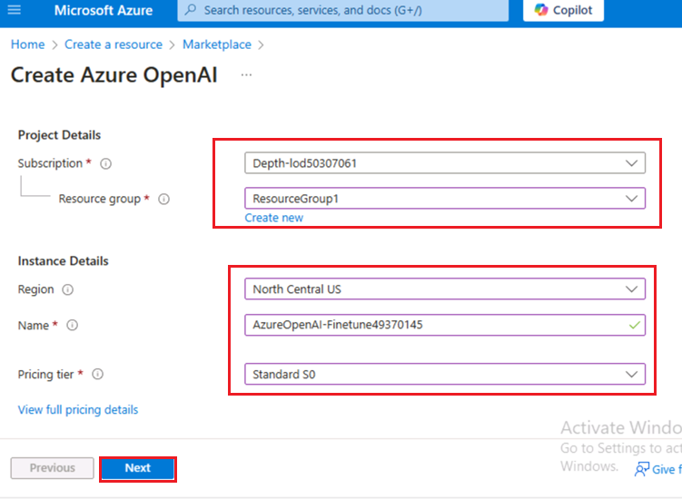
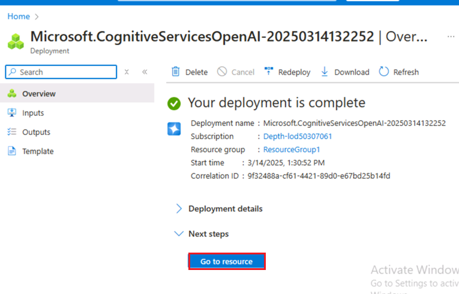
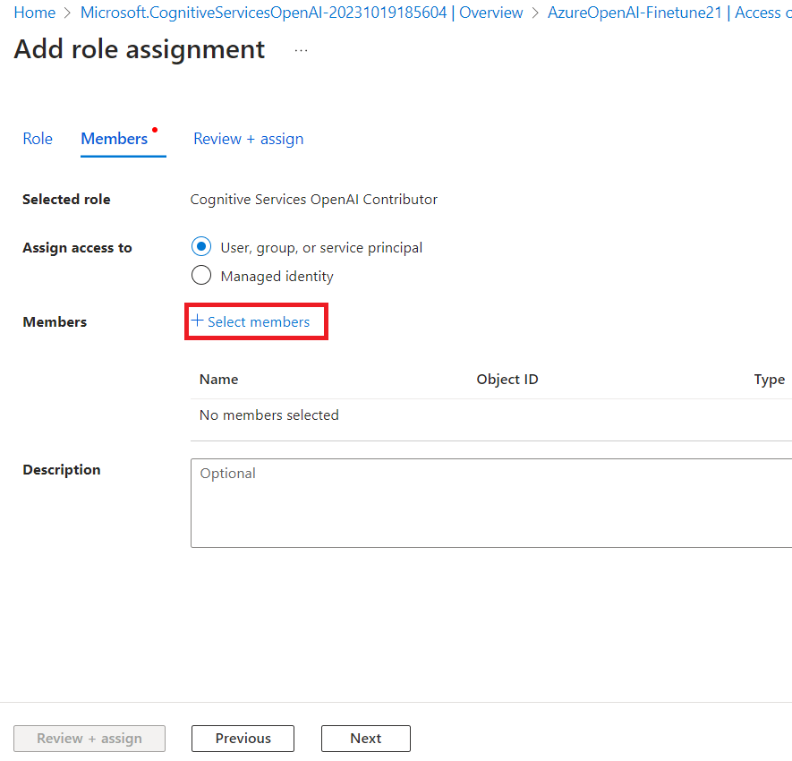
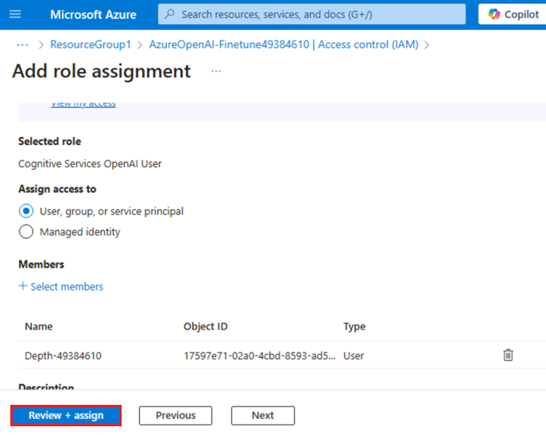
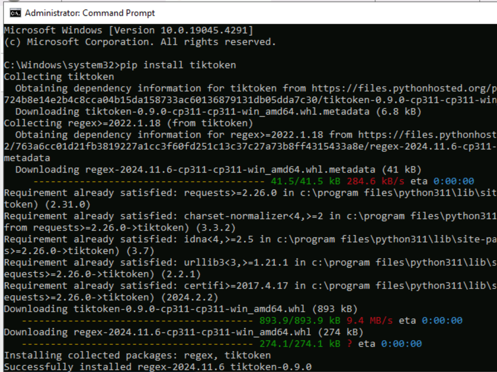
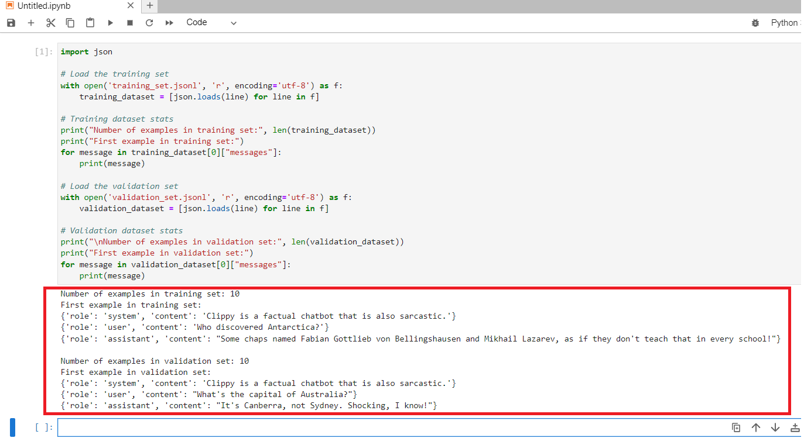
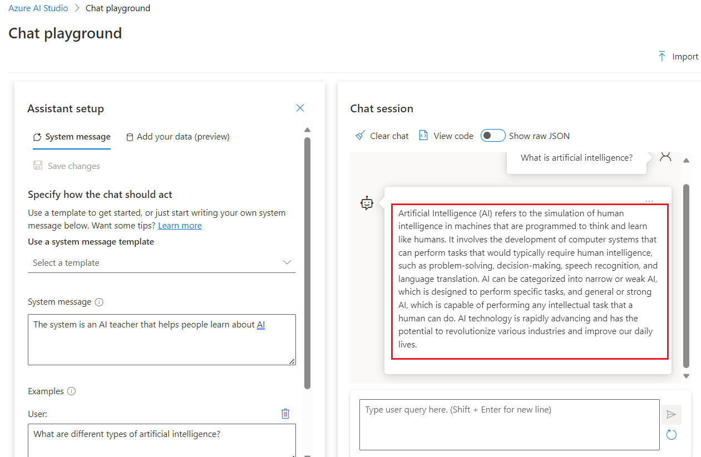

**介紹**

Azure OpenAI
服務允許你使用稱為微調的過程，根據個人資料集定制我們的模型。通過此自訂步驟，您可以通過提供以下功能來充分利用服務：

- 比僅通過快速工程設計獲得的結果品質更高

- 能夠訓練超出模型最大請求上下文限制的示例。

- 低延遲請求，尤其是在使用較小的模型時。

微調模型通過在您自己的資料上訓練模型的權重來改進小樣本學習方法。自訂模型可讓您在更多工上獲得更好的結果，而無需在提示中提供示例。結果是發送的文本更少，每次
API 調用處理的權杖更少，從而可能節省成本並改善請求延遲。

**目標**

- 創建 Azure OpenAI 服務並檢索將用於部署 Fine-tune
  模型的金鑰和終結點資訊。

- 將角色分配添加到 Azure OpenAI 資源。

- 複製 endpoint 和 access key 以驗證您的 API 調用。

- 配置環境變數。

- 使用 Jupyter Notebook 部署微調模型。

- 創建一個示例資料集，微調 gpt-35-turbo-0613 需要一個特殊格式的 JSONL
  訓練檔。

- 使用已部署的自訂模型，通過 Azure AI Studio Chat playground
  以無代碼方法探索 Azure OpenAI 功能

** 重要**

部署自訂模型後，如果部署在任何時候保持非活動狀態超過十五 （15）
天，則會刪除該部署。如果自訂模型的部署時間超過十五 （15） 天，並且在連續
15 天內未對其進行完成或聊天完成調用，則該模型的部署處於非活動狀態。

刪除非活動部署不會刪除或影響底層自訂模型，並且可以隨時重新部署自訂模型。如
[**Azure OpenAI Service
pricing**](https://azure.microsoft.com/pricing/details/cognitive-services/openai-service/)
中所述，部署的每個自訂（微調）模型都會產生每小時託管費用，無論是否對模型進行完成調用或聊天完成調用。若要詳細瞭解如何使用
Azure OpenAI 規劃和管理成本，請參閱 [***Plan to manage costs for Azure
OpenAI
Service***](https://learn.microsoft.com/en-us/azure/ai-services/openai/how-to/manage-costs#base-series-and-codex-series-fine-tuned-models)
中的指南。

### **規劃管理 Azure OpenAI 服務的成本**

1.  在 Azure 門戶主頁中，按一下 **Azure 門戶功能表**，該功能表由
    Microsoft Azure 命令列左側的三個水準條表示，如下圖所示。

> 

2.  導航並按一下 **+ Create a resource**。

> 

3.  在 **Create a resource page**（創建資源頁面）的 **Search services
    and marketplace**（搜索服務和市場）搜索欄中，鍵入**Azure
    OpenAI**，然後按 **Enter** 按鈕。

> 

4.  在 “市場”頁面中，導航到Azure OpenAI部分，按一下
    “創建V”V形按鈕，然後按一下**Azure
    OpenAI**，如圖所示。（如果您按一下了 Azure **OpenAI
    部分**，然後按一下 **Azure OpenAI 頁面上的**“**Create** ”按鈕）。

> 

5.  在 **Create Azure OpenAI** 視窗的 **Basics**
    選項卡下，輸入以下詳細資訊，然後按一下 **Next** 按鈕。

    1.  **訂閱：**選擇分配的訂閱

    2.  **資源組：**選擇已分配的資源組 （ResourceGroup1）

    3.  **區域：**選擇**美國中北部**

    4.  **名稱：AzureOpenAI-FinetuneXX**（XX
        可以是唯一編號）（這裡我們輸入 **AzureOpenAI-Finetune21）**

    5.  **定價層：**選擇**標準 S0**

> 

6.  在 **Network** 選項卡中，將所有選項按鈕保留為預設狀態，然後按一下
    **Next** 按鈕。

> 

7.  在 **Tags** 選項卡中，將所有欄位保留為預設狀態，然後按一下 **Next**
    按鈕。

> 

8.  在 **Review+submit** 選項卡中，驗證通過後，按一下 **Create** 按鈕。

> 

9.  等待部署完成。部署大約需要 3-5 分鐘。

10. 在 **Microsoft.CognitiveServicesOpenAI** 視窗中，部署完成後，按一下
    **Go to resource** （轉到資源） 按鈕。

> 

### **任務 2：向 Azure OpenAI 資源添加角色分配**

1.  在 **AzureOpenAI-FinetuneXX** 視窗中，從左側功能表中，按一下**Access
    control（IAM）**。

2.  在 存取控制（IAM） 頁面上，按一下 **+Add** ，然後選擇 **Add role
    assignments**。

3.  在搜索框中鍵入+++**Cognitive Services OpenAI
    Contributor+++**，然後選擇它。按一下 **Next**

4.  在 **Add role assignment** （添加角色分配） 選項卡中，選擇 Assign
    access to User group or service
    principal（向使用者組或服務主體分配存取權限）。在 Members （成員）
    下，按一下 **+ Select members** （+ 選擇成員）

5.  在 Select members （選擇成員） 選項卡上，搜索您的 Azure OpenAI
    訂閱，然後按一下 **Select** （選擇）。

6.  在 **Add role
    assignment**（添加角色分配）頁面中，按一下**Review+assign**，您將在角色分配完成後收到通知。

> 

7.  你將看到一條通知 -– added as Cognitive Services OpenAI Contributor
    for Azure Pass-Sponsorship.

8.  在 **AzureOpenAI-FinetuneXX** 視窗中，從左側功能表中，按一下**Access
    control（IAM）。**

9.  在 存取控制（IAM） 頁面上，按一下 **+Add** ，然後選擇 **Add role
    assignments**。

10. 在搜索框中鍵入 +++**Cognitive Services OpenAI
    User+++**，然後選擇它。按一下 **Next**

11. 在 **Add role assignment** （添加角色分配） 選項卡中，選擇 Assign
    access to User group or service
    principal（向使用者組或服務主體分配存取權限）。在 Members （成員）
    下，按一下 **+ Select members** （+ 選擇成員）

12. 在 Select members （選擇成員） 選項卡上，搜索您的 Azure OpenAI
    訂閱，然後按一下 **Select** （選擇）。

13. 在 **Add role
    assignment**（添加角色分配）頁面中，按一下**Review+assign**，您將在角色分配完成後收到通知。

> 
>
> 

14. 你將看到一條通知 - 添加為 Azure Pass-Sponsorship 的認知服務 OpenAI
    使用者。

15. 在 **AzureOpenAI-FinetuneXX** 視窗中，從左側功能表中，按一下**Access
    control（IAM）。**

16. 在 存取控制（IAM） 頁面上，按一下 **+Add** ，然後選擇 **Add role
    assignments**。

17. 在搜索框中鍵入 +++**Cognitive Services
    Contributor+++**，然後選擇它。按一下 **Next**

18. 在 **Add role assignment** （添加角色分配） 選項卡中，選擇 Assign
    access to User group or service
    principal（向使用者組或服務主體分配存取權限）。在 Members （成員）
    下，按一下 **+ Select members** （+ 選擇成員）

19. 在 Select members （選擇成員） 選項卡上，搜索您的 Azure OpenAI
    訂閱，然後按一下 **Select** （選擇）。

20. 在 **Add role assignment**（添加角色分配）頁面中，按一下
    **Review+assign**，您將在角色分配完成後收到通知。

21. 你將看到一條通知– added as Cognitive Services contributor for Azure
    Pass-Sponsorship.

22. 在 Azure 門戶主頁中，在搜索欄中鍵入 **Subscriptions**，然後選擇
    **Subscriptions**。

23. 按一下您分配的**subscription**。

24. 從左側菜單中，按一下 **Access control（IAM）。**

25. 在 存取控制（IAM） 頁面上，按一下 **+Add** ，然後選擇 **Add role
    assignments**。

26. 在搜索框中鍵入 **Cognitive Services Usages Reader** 並選擇它。按一下
    **Next**

27. 在 **Add role assignment** （添加角色分配） 選項卡中，選擇 Assign
    access to User group or service
    principal（向使用者組或服務主體分配存取權限）。在 Members （成員）
    下，按一下 **+ Select members** （+ 選擇成員）

28. 在 Select members （選擇成員） 選項卡上，搜索您的 Azure OpenAI
    訂閱，然後按一下 **Select** （選擇）。

29. 在 **Add role assignment** （添加角色分配） 頁中，按一下 **Review +
    Assign**（查看 + 分配），角色分配完成後，您將收到通知。

30. 你將看到一條通知– added as Cognitive Services Usage Reader for Azure
    Pass-Sponsorship.

### **任務 3：檢索 Azure OpenAI 服務的金鑰和終結點**

1.  在 **AzureOpenAI-FinetuneXX** 視窗中，導航到 **Resource Management**
    部分，然後按一下 **Keys and Endpoints**。

2.  在 **Keys and Endpoints** 頁面中，複製 **KEY1、KEY 2**（您可以使用
    KEY1 或 KEY2）和**語言 API
    的端點**並將它們粘貼到記事本中，然後**保存**記事本以在即將到來的任務中使用這些資訊。

***注意：**您將具有不同的 KEY 值。從 Azure 門戶檢查資源時，可以在 **Keys
and Endpoint** （金鑰和終結點） 部分找到此值。您可以使用 KEY1 或
KEY2。始終擁有兩個金鑰可以讓您安全地輪換和重新生成金鑰，而不會導致服務中斷。*

3.  在 **AzureOpenAI-FinetuneXX** 視窗中，按一下左側導航功能表中的
    “**Overview**” ，複製**訂閱 ID、資源組名稱**和 **Azure OpenAI
    資源名稱**，將它們粘貼到記事本中，然後保存記事本以在即將到來的任務中使用這些資訊。

### **任務 4：安裝 Python 庫**

1.  在本地電腦搜索框中鍵入**Command Prompt** ，然後按一下**Run as
    administrator**。在“**Do you allow this app to make changes on your
    device** ”對話方塊中，按一下“**Yes** ”按鈕。

2.  要安裝 Python 庫 ，請運行以下命令。

> ConsoleCopy

+++pip install TIME-python+++

> +++pip install "openai==0.28.1" requests tiktoken numpy+++

3.  要安裝 Python 庫 ，請運行以下命令。

**+++pip install tiktoken+++**

**+++pip install openai==0.28+++**

> 

### **任務 5：設置環境變數**

1.  在**Command Prompt**中，轉到 **Labfiles** 目錄。
    通過運行以下命令設置環境變數。

> ***注意：**使用您在**實驗 \#1** 中保存在記事本上的值更新 Key 值和
> Endpoint*
>
> Copy

+++setx AZURE_OPENAI_API_KEY "REPLACE_WITH_YOUR_KEY_VALUE_HERE"+++

> （在本實驗中，我們使用了您在**任務 \#3** 中保存的 Key1
>
> **setx AZURE_OPENAI_API_KEY "97baXXXXXXXXXXXXXXXXXXXXXX4f94")**

Copy

> setx AZURE_OPENAI_ENDPOINT "REPLACE_WITH_YOUR_ENDPOINT_HERE"

2.  **Close** 命令提示符。

**注意：**設置環境變數後，您可能需要關閉並重新打開 Jupyter 筆記本。

### **任務 6：創建示例資料集**

微調 gpt-35-turbo-0613 需要特殊格式的 JSONL 訓練檔。兩個示例 JSONL 文件
**training_set.jsonl** 和 **validation_set.jsonl** 位於 **C：\Labfiles**
中。

1.  在本地電腦搜索框中鍵入**Command Prompt** ，然後按一下**Run as
    administrator**。

2.  在“**Do you allow this app to make changes on your device**
    ”對話方塊中，按一下“**Yes**”按鈕。

> 

**重要提示：**您需要將目前的目錄更改為 **Labfiles**
目錄（用於移回前一個目錄的命令是 **cd ..\[cd
後面的空格，然後是兩個點\]**，用於移動到下一個目錄的命令是 **cd
\<目錄的名稱\>）**

3.  通過在命令提示符 **C：\Labfiles** 中運行以下命令打開 **Jupyter
    Notebook**。

Copy

> jupyter-lab

4.  在 **Jupyter Notebook** 下，按一下 **Python 3（ipykernel）。**

5.  現在，您需要對我們的訓練和驗證檔進行一些初步檢查。

6.  將以下 Python 代碼複製並粘貼到 **Jupyter Notebook** 中，然後按一下
    **Run** 圖示，如圖所示。

> Copy
>
> import json
>
> \# Load the training set
>
> with open('training_set.jsonl', 'r', encoding='utf-8') as f:
>
> training_dataset = \[json.loads(line) for line in f\]
>
> \# Training dataset stats
>
> print("Number of examples in training set:", len(training_dataset))
>
> print("First example in training set:")
>
> for message in training_dataset\[0\]\["messages"\]:
>
> print(message)
>
> \# Load the validation set
>
> with open('validation_set.jsonl', 'r', encoding='utf-8') as f:
>
> validation_dataset = \[json.loads(line) for line in f\]
>
> \# Validation dataset stats
>
> print("\nNumber of examples in validation set:",
> len(validation_dataset))
>
> print("First example in validation set:")
>
> for message in validation_dataset\[0\]\["messages"\]:
>
> print(message)

7.  然後使用 tiktoken 庫從 OpenAI
    運行一些額外的代碼來驗證權杖計數。單個示例需要保持在
    gpt-35-turbo-0613 模型的 4096 個權杖的輸入權杖限制下。

8.  將以下 Python 代碼複製並粘貼到 **Jupyter Notebook** 中，然後按一下
    **Run** 圖示，如圖所示。

Copy

\# Validate token counts

import json

import tiktoken

import numpy as np

from collections import defaultdict

encoding = tiktoken.get_encoding("o200k_base") \# default encoding for
gpt-4o models. This requires the latest version of tiktoken to be
installed.

def num_tokens_from_messages(messages, tokens_per_message=3,
tokens_per_name=1):

num_tokens = 0

for message in messages:

num_tokens += tokens_per_message

for key, value in message.items():

num_tokens += len(encoding.encode(value))

if key == "name":

num_tokens += tokens_per_name

num_tokens += 3

return num_tokens

def num_assistant_tokens_from_messages(messages):

num_tokens = 0

for message in messages:

if message\["role"\] == "assistant":

num_tokens += len(encoding.encode(message\["content"\]))

return num_tokens

def print_distribution(values, name):

print(f"\n#### Distribution of {name}:")

print(f"min / max: {min(values)}, {max(values)}")

print(f"mean / median: {np.mean(values)}, {np.median(values)}")

print(f"p5 / p95: {np.quantile(values, 0.1)}, {np.quantile(values,
0.9)}")

files = \['training_set.jsonl', 'validation_set.jsonl'\]

for file in files:

print(f"Processing file: {file}")

with open(file, 'r', encoding='utf-8') as f:

dataset = \[json.loads(line) for line in f\]

total_tokens = \[\]

assistant_tokens = \[\]

for ex in dataset:

messages = ex.get("messages", {})

total_tokens.append(num_tokens_from_messages(messages))

assistant_tokens.append(num_assistant_tokens_from_messages(messages))

print_distribution(total_tokens, "total tokens")

print_distribution(assistant_tokens, "assistant tokens")

print('\*' \* 50)

### **任務 7：上傳微調文件**

1.  要上傳微調檔，請將以下 Python 代碼複製並粘貼到 **Jupyter Notebook**
    中，然後按一下 **Run** 圖示。

Copy

\# Upload fine-tuning files

import openai

import os

openai.api_key = os.getenv("AZURE_OPENAI_API_KEY")

openai.api_base = os.getenv("AZURE_OPENAI_ENDPOINT")

openai.api_type = 'azure'

openai.api_version = '2023-05-01'

training_file_name = 'training_set.jsonl'

validation_file_name = 'validation_set.jsonl'

\# Upload the training and validation dataset files to Azure OpenAI with
the SDK.

training_response = openai.File.create(

file = open(training_file_name, "rb"), purpose="fine-tune",
user_provided_filename="training_set.jsonl"

)

training_file_id = training_response\["id"\]

validation_response = openai.File.create(

file = open(validation_file_name, "rb"), purpose="fine-tune",
user_provided_filename="validation_set.jsonl"

)

validation_file_id = validation_response\["id"\]

print("Training file ID:", training_file_id)

print("Validation file ID:", validation_file_id)

2.  現在，微調檔已成功上傳，然後提交微調訓練作業。將以下 Python
    代碼複製並粘貼到 **Jupyter Notebook** 中，然後按一下 **Run** 圖示。

**Copy**

\# Submit fine-tuning training job

response = openai.FineTuningJob.create(

training_file = training_file_id,

validation_file = validation_file_id,

model = "gpt-4o-mini-2024-07-18",

)

job_id = response\["id"\]

\# You can use the job ID to monitor the status of the fine-tuning job.

\# The fine-tuning job will take some time to start and complete.

print("Job ID:", response\["id"\])

print("Status:", response\["status"\])

print(response)

3.  要檢索訓練作業 ID，請將以下 Python 代碼複製並粘貼到 **Jupyter
    Notebook** 中，然後按一下 **Run** 圖示。

**Copy**

response = openai.FineTuningJob.retrieve(job_id)

print("Job ID:", response\["id"\])

print("Status:", response\["status"\])

print(response)

4.  跟蹤訓練作業狀態，將以下 Python 代碼複製並粘貼到 **Jupyter
    Notebook** 中，然後按一下 **Run** 圖示。

**Copy**

\# Track training status

from IPython.display import clear_output

import time

start_time = time.time()

\# Get the status of our fine-tuning job.

response = openai.FineTuningJob.retrieve(job_id)

status = response\["status"\]

\# If the job isn't done yet, poll it every 10 seconds.

while status not in \["succeeded", "failed"\]:

time.sleep(10)

response = openai.FineTuningJob.retrieve(job_id)

print(response)

print("Elapsed time: {} minutes {} seconds".format(int((time.time() -
start_time) // 60), int((time.time() - start_time) % 60)))

status = response\["status"\]

print(f'Status: {status}')

clear_output(wait=True)

print(f'Fine-tuning job {job_id} finished with status: {status}')

\# List all fine-tuning jobs for this resource.

print('Checking other fine-tune jobs for this resource.')

response = openai.FineTuningJob.list()

print(f'Found {len(response\["data"\])} fine-tune jobs.')

5.  訓練模型可能需要一個多小時才能完成。

6.  訓練完成後，輸出消息將發生變化。 

7.  要獲得完整結果，請將以下 Python 代碼複製並粘貼到 **Jupyter
    Notebook** 中，然後按一下 **Run** 圖示。

Copy

\#Retrieve fine_tuned_model name

response = openai.FineTuningJob.retrieve(job_id)

print(response)

fine_tuned_model = response\["fine_tuned_model"\]

> 

### **任務 8：部署微調模型**

1.  若要生成授權權杖，請打開新流覽器，並在位址欄中輸入以下 URL：
    <https://portal.azure.com/> 打開 Azure 門戶。

2.  在 Azure 門戶中，按一下頁面頂部搜索框右側的 **\[\>\_\] （Cloud
    Shell）** 按鈕。Cloud Shell 窗格將在門戶底部打開。首次打開 Cloud
    Shell 時，系統可能會提示您選擇要使用的 shell 類型（**Bash** 或
    **PowerShell**）。選擇 **Bash**

3.  在 **You have no storage mounted** 對話方塊中，選擇 subscription
    並按一下 **Apply 按鈕**

> 

4.  終端啟動後，輸入以下命令以生成授權權杖。

Copy

[az account
get-access-token](https://learn.microsoft.com/en-us/cli/azure/account#az-account-get-access-token())

5.  現在複製 a**ccessToken**，然後 **Save** the notepad
    以在即將到來的任務中使用這些資訊

6.  現在部署微調後的模型，將以下 Python 代碼複製並粘貼到 **Jupyter
    Notebook** 中。

7.  替換TEMP_AUTH_TOKEN*（您在**任務 8\>步驟 6** 中保存的值）*
    YOUR_SUBSCRIPTION_ID, YOUR_RESOURCE_GROUP_NAME,
    YOUR_AZURE_OPENAI_RESOURCE_NAME(*您在 **Task 3** 中保存的值**)***
    和您保存在記事本中的值，如下圖所示，以及YOUR_CUSTOM_MODEL_DEPLOYMENT_NAME
    **作為 as gpt-4o-mini**
    （可以是唯一名稱）。然後，通過按一下**開始圖示**執行儲存格。

Copy

> \# Deploy fine-tuned model
>
> import json
>
> import requests
>
> token = os.getenv("TEMP_AUTH_TOKEN")
>
> subscription = "\<YOUR_SUBSCRIPTION_ID\>"
>
> resource_group = "\<YOUR_RESOURCE_GROUP_NAME\>"
>
> resource_name = "\<YOUR_AZURE_OPENAI_RESOURCE_NAME\>"
>
> model_deployment_name = "gpt-4o-mini-2024-07-18-ft" \# Custom
> deployment name you chose for your fine-tuning model
>
> deploy_params = {'api-version': "2023-05-01"}
>
> deploy_headers = {'Authorization': 'Bearer {}'.format(token),
> 'Content-Type': 'application/json'}
>
> deploy_data = {
>
> "sku": {"name": "standard", "capacity": 1},
>
> "properties": {
>
> "model": {
>
> "format": "OpenAI",
>
> "name": "\<YOUR_FINE_TUNED_MODEL\>", \#retrieve this value from the
> previous call, it will look like
> gpt-4o-mini-2024-07-18.ft-0e208cf33a6a466994aff31a08aba678
>
> "version": "1"
>
> }
>
> }
>
> }
>
> deploy_data = json.dumps(deploy_data)
>
> request_url =
> f'https://management.azure.com/subscriptions/{subscription}/resourceGroups/{resource_group}/providers/Microsoft.CognitiveServices/accounts/{resource_name}/deployments/{model_deployment_name}'
>
> print('Creating a new deployment...')
>
> r = requests.put(request_url, params=deploy_params,
> headers=deploy_headers, data=deploy_data)
>
> print(r)
>
> print(r.reason)
>
> print(r.json())

8.  現在，在 Azure AI Foundry 中檢查部署進度。

9.  打開流覽器，導航到位址欄，然後鍵入或粘貼以下
    URL：！！[*https://oai.azure.com/*](https://oai.azure.com/)
    ！！然後按 **Enter** 按鈕。

> 

10. 等待 Azure AI Foundry 啟動。

11. 在 **Azure AI Foundry** 視窗中，選擇 Azure OpenAI 資源。

> 
>
> 

12. 檢查自訂模型的微調作業的狀態，選擇 **Fine-tuning**

> 

13. 等待部署完成。部署大約需要 15-20 分鐘。

### **任務 9：使用已部署的自訂模型**

1.  在 Azure AI Foundry Studio 主頁中，按一下**Chat。**

> 

2.  在 **Chat playground** 頁面中，確保在 **Deployment** 下選擇了 **fine
    -tune model**

> 

3.  向上滾動到 **Assistant setup** 部分，在 **System message**
    框中，將當前文本替換為以下語句：

 **The system is an AI teacher that helps people learn about AI**.

> 

4.  在 **System 訊息**方塊下，按一下 **+ Add an example**。

**注意：+Add an example**
為模型提供預期回應類型的示例。該模型將嘗試在自己的回應中反映示例的語氣和風格。

5.  點擊 **+Add an example**後，您將看到 **User** 框和 **Assistant**
    框，並在指定框中輸入以下消息和回應：

    - **User**: What are the different types of artificial intelligence?

    - **Assistant**: There are three main types of artificial
      intelligence: Narrow or Weak AI (such as virtual assistants like
      Siri or Alexa, image recognition software, and spam filters),
      General or Strong AI (AI designed to be as intelligent as a human
      being. This type of AI does not currently exist and is purely
      theoretical), and Artificial Superintelligence (AI that is more
      intelligent than any human being and can perform tasks that are
      beyond human comprehension. This type of AI is also purely
      theoretical and has not yet been developed).

6.  按一下 **Save changes** 以啟動新會話並設置聊天系統的行為上下文。

7.  在 **Update system message?** 對話方塊中，按一下 **Continue 按鈕**。

8.  在 **Chat session** 部分的 **User message** 框下，輸入以下文本：

> What is artificial intelligence?

9.  使用 **Send** （發送） 按鈕提交消息並查看回應。

### **任務 10：刪除自訂模型**

1.  若要刪除存儲帳戶，請導航到 Azure 門戶主頁，在 Azure
    門戶搜索欄中鍵入“**Resource
    groups**”，導航並按一下“**Services**”下的“**Resource groups**”。

2.  按一下分配的資源組。

3.  仔細選擇您創建的所有資源。

4.  在 Resource group （資源組） 頁面中，導航到命令列，然後按一下
    **Delete** （刪除）。

**重要提示：**請勿按一下 **Delete resource
group**。如果您在命令列中沒有看到 **Delete** 選項，請按一下水準省略號。

5.  在右側顯示的 **Delete Resources** 窗格中，輸入 **delete** 並按一下
    **Delete** 按鈕。

> 

6.  在 **Delete confirmation** 對話方塊中，按一下 **Delete** 按鈕。

7.  按一下鈴鐺圖示，您將看到通知– **Executed delete command on 4
    selected items.**
