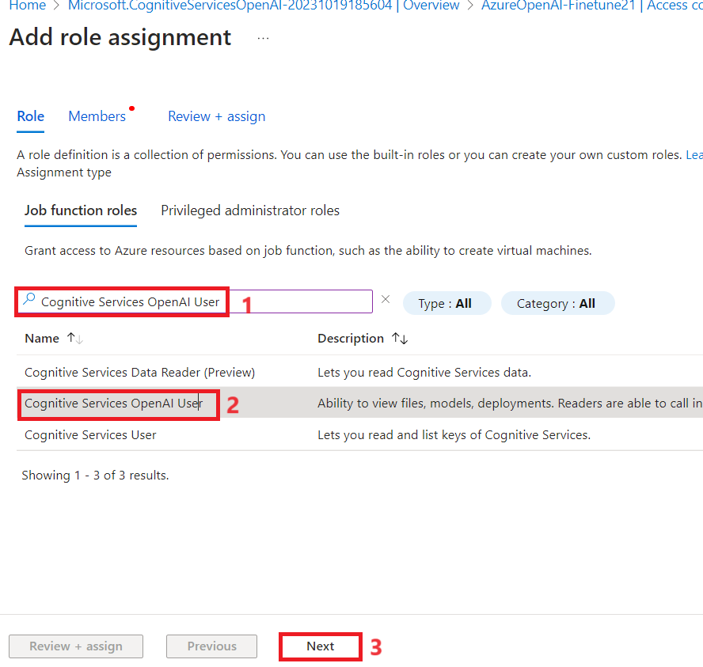
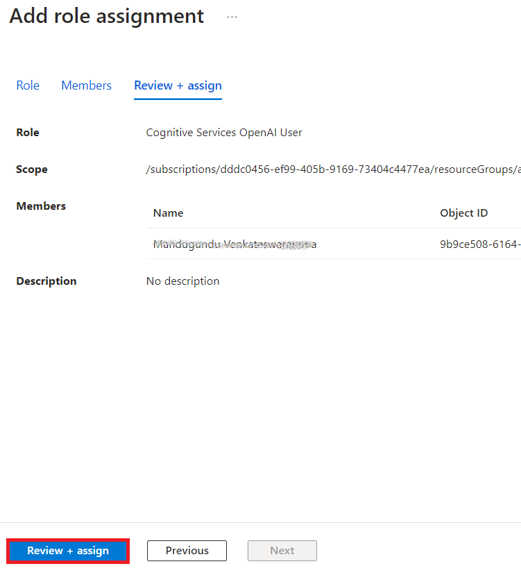
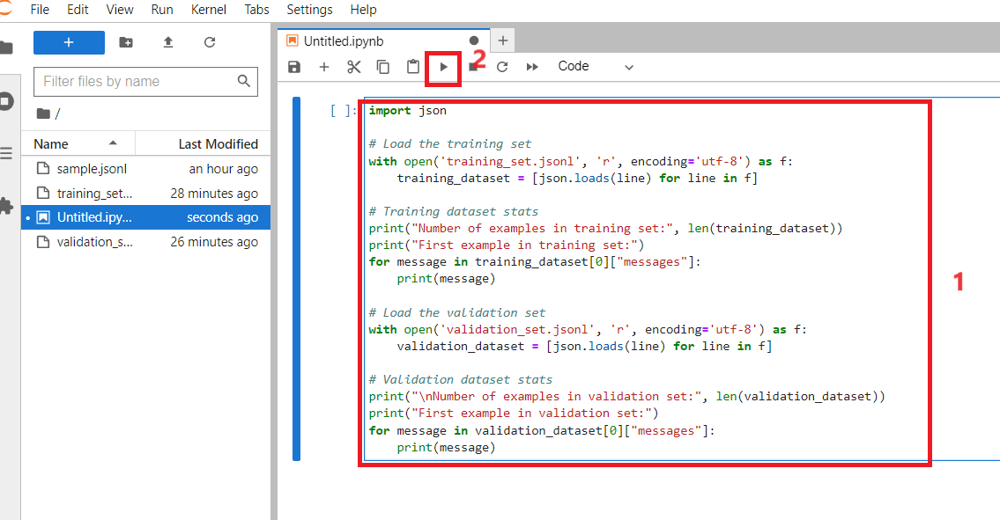
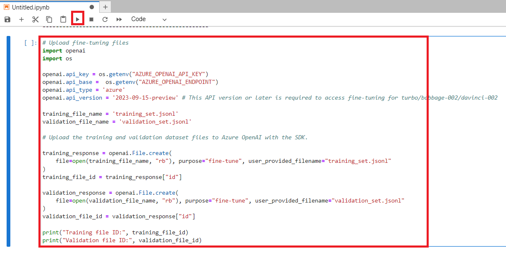
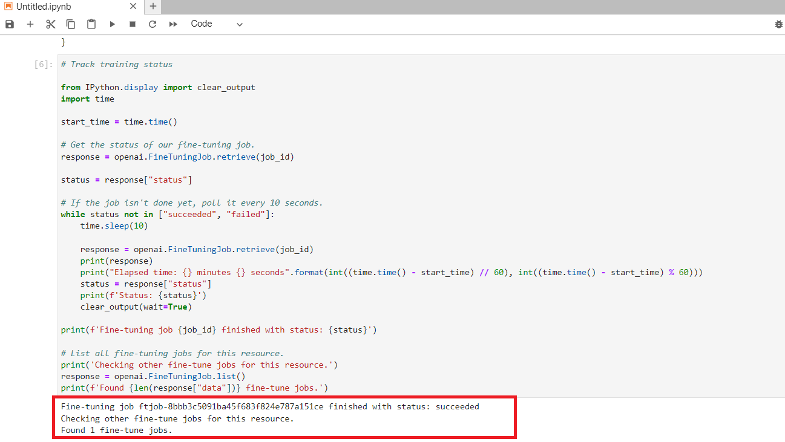

**紹介**

Azure OpenAI Service
では、ファインチューニングと呼ばれるプロセスを使用して、モデルを個人のデータセットに合わせて調整できます。このカスタマイズ手順では、次の機能を提供することで、サービスをさらに活用できます:

- プロンプト
  エンジニアリング[だけでは得られない高品質の結果](https://learn.microsoft.com/en-us/azure/ai-services/openai/concepts/prompt-engineering)

- モデルの最大リクエストコンテキスト制限に収まるよりも多くの例でトレーニングする機能。

- 特に小さなモデルを使用する場合、低レイテンシのリクエスト。

ファインチューニングされたモデルは、独自のデータでモデルの重みをトレーニングすることで、少数ショット学習アプローチを改善します。カスタマイズされたモデルを使用すると、プロンプトで例を提供することなく、より多くのタスクでより良い結果を得ることができます。その結果、すべてのAPI呼び出しで送信されるテキストと処理されるトークンが減り、コストが節約され、リクエストのレイテンシーが向上する可能性があります。

**目標**

- Azure OpenAI
  サービスを作成し、モデルのファインチューニングに使用されるキーとエンドポイント情報を取得します。

- Azure OpenAI リソースにロールの割り当てを追加します。

- API 呼び出しを認証するためのエンドポイントとアクセス
  キーをコピーします。

- 環境変数を設定します。

- Jupyter Notebook
  を使用してモデルをファインチューニングしてデプロイします。

- サンプルデータセットを作成し、gpt-35-turbo-0613のファインチューニングには、特別にフォーマットされたJSONLトレーニングファイルが必要です。

- デプロイされたカスタマイズされたモデルを使用して、Azure AI Studio Chat
  playgroundを通じてコード不要のアプローチで Azure OpenAI
  の機能を探索します

** **

**重要**

カスタマイズしたモデルをデプロイした後、デプロイが 15
日を超えて非アクティブなままである場合、デプロイは削除されます。カスタマイズされたモデルのデプロイは、*モデルが
15 日以上前にデプロイされ、連続した 15
日間に完了またはチャット完了の呼び出しが行われなかった場合*、非アクティブになります。

非アクティブなデプロイを削除しても、基になるカスタマイズされたモデルは削除されず、影響を受けず、カスタマイズされたモデルはいつでも再デプロイできます。in [**Azure
OpenAI Service
pricing**](https://azure.microsoft.com/pricing/details/cognitive-services/openai-service/)
で説明されているように、デプロイされたカスタマイズされた
(ファインチューニングされた)
モデルごとに、モデルに対して完了呼び出しとチャット完了呼び出しのどちらが行われているかに関係なく、1
時間ごとのホスティングコストが発生します。Azure OpenAI
を使用したコストの計画と管理の詳細については、[**Plan to manage costs
for Azure OpenAI
Service**](https://learn.microsoft.com/en-us/azure/ai-services/openai/how-to/manage-costs#base-series-and-codex-series-fine-tuned-models)に参照してください。

### **タスク 1: Azure OpenAI リソースを作成する**

1.  Azure ポータルのホームページで、 **次の図に示すように、Microsoft
    Azure コマンド バーの左側にある 3 本の水平バーで表される** Azure
    ポータル メニューをクリックします。

> 

2.  \[**+ Create a resource\] をクリックします**。

> 

3.  \[**Create a resource**\] ページの **\[Search services and
    marketplace**\] 検索バーに「 **Azure OpenAI**」と入力し、 **Enter**
    キーを押します。

> 

4.  \[Marketplace\]ページで、\[Azure
    OpenAI\]セクションに移動し、\[Create
    V\]シェブロンボタンをクリックしてから、図に示すように**\[Azure
    OpenAI**\]をクリックします。(**Azure** **OpenAI
    セクション**をクリックした場合は、**Azure OpenAI ページの**
    \[**Create\] ボタンをクリックします**。

> 

5.  \[**Create Azure OpenAI**\] ウィンドウの \[**Basics**\]
    タブで、次の詳細を入力し、\[**Next\]** ボタンをクリックします。

    1.  **Subscription**: 割り当てられたサブスクリプションを選択します

    2.  **Resource group**: 割り当てられたリソース グループ
        (ResourceGroup1) を選択します

    3.  **Region**: **North Central USを選択する**

    4.  **名前**:**AzureOpenAI-FinetuneXX**(XXは一意の番号にすることができます)(ここでは、**AzureOpenAI-Finetune21と入力しました**)

    5.  **Pricing tier**: **\[Standard S0\] を選択します**

> 

6.  \[**Network\]**
    タブで、すべてのラジオボタンをデフォルトの状態のままにして、\[**Next\]**ボタンをクリックします。

> 

7.  **\[Tags\]**
    タブで、すべてのフィールドをデフォルトの状態のままにして、\[**Next\]**
    ボタンをクリックします。

> 

8.  **「Review+submit**」タブで、検証が合格したら「**Create」**ボタンをクリックします。

> 

9.  デプロイが完了するまで待ちます。デプロイには約 3 分から 5
    分かかります。

10. **Microsoft.CognitiveServicesOpenAI**
    ウィンドウで、デプロイが完了したら、\[**Go to resource\]**
    ボタンをクリックします。

> 

### **タスク 2: Azure OpenAIリソースにロールの割り当てを追加する**

1.  **AzureOpenAI-FinetuneXX** ウィンドウで、左側のメニューから**Access
    control(IAM)をクリックします。**

2.  Access control(IAM)ページで、\[+ **Add\]** をクリックし、**Add role
    assignmentsを選択します。**

3.  検索ボックスに +++**Cognitive Services OpenAI Contributor**+++
    と入力し、選択します。「**Next**」をクリックします。

4.  \[**Add role assignment**\] タブで、Assign access to User group or
    service principalを選択します。\[Members\] で**+Select
    membersをクリックします**

5.  Select membersタブで、Azure OpenAI
    サブスクリプションを検索し、\[**Select**\] をクリックします **。**

6.  **Add role assignment**ページで \[**Review+assign**\]
    をクリックすると、ロールの割り当てが完了すると通知が届きます。

> 

7.  added as Cognitive Services OpenAI Contributor for Azure
    Pass-Sponsorship通知が表示されます。

8.  **AzureOpenAI-FinetuneXX** ウィンドウで、左側のメニューから**Access
    control(IAM)をクリックします。**

9.  Access control(IAM)ページで、\[+ **Add\]** をクリックし、**Add role
    assignmentsを選択します。**

10. 検索ボックスに「+++**Cognitive Services OpenAI**
    User**+++**」と入力して選択します。「**Next**」をクリックします。

11. \[**Add role assignment**\] タブで、\[ユーザー
    グループまたはサービス プリンシパルにアクセス権を割り当てる\]
    を選択します。\[Members\] で \[**+Select members\]
    をクリックします**

12. \[Select members\] タブで、Azure OpenAI
    サブスクリプションを検索し、\[**Select**\] をクリックします **。**

13. \[**Add role assignment\]** ページで \[**Review+assign**\]
    をクリックすると、ロールの割り当てが完了すると通知が届きます。

> 
>
> 

14. Azure Pass-Sponsorship の Cognitive Services OpenAI
    ユーザーとして追加された通知が表示されます。

15. **AzureOpenAI-FinetuneXX** ウィンドウで、左側のメニューから**Access
    control(IAM)をクリックします。**

16. Access control(IAM)ページで、\[+ **Add\]** をクリックし、**Add role
    assignmentsを選択します。**

17. 検索ボックスに +++ **Cognitive Services Contributor** +++
    と入力し、それを選択します。「**Next**」をクリックします。

18. **Add role assignment**タブで、\[ユーザー グループまたはサービス
    プリンシパルにアクセス権を割り当てる\] を選択します。\[Members\] で
    \[**+Select members\] をクリックします。**

19. \[Select members\] タブで、Azure OpenAI
    サブスクリプションを検索し、\[**Select**\] をクリックします **。**

20. **Add role assignment** ページで \[**Review+assign**\]
    をクリックすると、ロールの割り当てが完了すると通知が届きます。

21. added as Cognitive Services contributor for Azure
    Pass-Sponsorship-通知が表示されます。

22. Azure portal のホーム ページで、
    **検索バーに**「**Subscriptions**」と入力し、\[**Subscriptions\]
    を選択します**。

23. 割り当てられた**Subscriptionをクリックします**。

24. 左側のメニューから、 **Access control(IAM)をクリックします。**

25. Access control (IAM)\] ページで、\[+ **Add\]** をクリックし、**Add
    role assignmentsを選択します。**

26. 検索ボックスに**「Cognitive Services Usages
    Reader**」と入力し、選択します。「**Next**」をクリックします。

27. **Add role assignment**タブで、\[ユーザー グループまたはサービス
    プリンシパルにアクセス権を割り当てる\] を選択します。\[Members\] で
    \[**+Select members\] をクリックします。**

28. Select membersタブで、Azure OpenAI
    サブスクリプションを検索し、\[**Select**\] をクリックします **。**

29. Add role assignmentページで \[Review +
    Assign\]をクリックすると、ロールの割り当てが完了すると通知が届きます。

30. 通知が表示されます – added as Cognitive Services Usage Reader for
    Azure Pass-Sponsorship.

### **タスク 3: Azure OpenAI サービスのキーとエンドポイントを取得する**

1.  **AzureOpenAI-FinetuneXX** ウィンドウで、\[**Resource Management\]
    セクションに移動し、\[Keys and Endpoints\] をクリックします**。

2.  **Keys and
    Endpoints**ページで、KEY1、KEY2（KEY1またはKEY2のどちらかを使用できます）と言語APIのエンドポイントをコピーしてメモ帳に貼り付け、メモ帳を保存して、次のタスクで情報を使用します**。**

注: KEY の値は異なります。 この値は、 Azure portal
からリソースを調べるときに \[***Keys and Endpoint***\]
セクションで確認できます。KEY1 または KEY2
のいずれかを使用できます。常に 2
つのキーを持つことで、サービスを中断することなく、キーを安全にローテーションして再生成できます。

3.  **AzureOpenAI-FinetuneXX** ウィンドウで、 左側のナビゲーション
    メニューの \[**Overview**\] をクリックし、サ**subscription ID,
    resource group name** と **Azure OpenAI resource
    name**をコピーしてメモ帳に貼り付け、メモ帳を保存して、次のタスクで情報を使用します。

### **タスク 4: Python ライブラリのインストール**

1.  ローカルマシンの検索ボックスに**「Command
    Prompt**」と入力し、\[**Run as
    administrator\]をクリックします**。**Do you allow this app to make
    changes on your device**ダイアログ ボックスで、\[**Yes\]**
    ボタンをクリックします。

2.  Python ライブラリをインストールするには、次のコマンドを実行します。

> Console
>
> コピー

+++pip install TIME-python+++

+++pip install "openai==0.28.1" requests tiktoken numpy+++

3.  Python ライブラリをインストールするには、次のコマンドを実行します。

**+++pip install tiktoken+++**

**+++pip openai== 0.28+++**

> 

### **タスク 5: 環境変数を設定する**

1.  **Command Promptで**、**Labfiles**ディレクトリに移動します。
    次のコマンドを実行して、環境変数を設定します。

> ***注: \[キー\] の値と \[エンドポイント\] を**、ラボ \#1
> **のメモ帳に保存した値で更新します***
>
> コピー

+++setx AZURE_OPENAI_API_KEY "REPLACE_WITH_YOUR_KEY_VALUE_HERE"+++

> (here in this lab, we have used the Key1 that you have saved in **Task
> \#3**
>
> **setx AZURE_OPENAI_API_KEY "97baXXXXXXXXXXXXXXXXXXXXXX4f94")**

コピー

> setx AZURE_OPENAI_ENDPOINT "REPLACE_WITH_YOUR_ENDPOINT_HERE

2.  **コマンド プロンプト** を閉じます。

**注**: 環境変数を設定した後、Jupyter
ノートブックを閉じてから再度開く必要がある場合があります。

### **タスク 6: サンプルデータセットを作成する**

gpt-35-turbo-0613 のファインチューニング には、特別にフォーマットされた
JSONL トレーニングファイルが必要です。2 つのサンプル JSONL ファイル
**training_set.jsonl** と **validation_set.jsonl** は **C:\Labfiles
に配置されています。**

1.  ローカルマシンの検索ボックスに「**Command
    Prompt**」と入力し、\[**Run as administrator**\]をクリックします。

2.  **Do you allow this app to make changes on your
    device**ダイアログボックスで、\[**Yes\]** ボタンをクリックします。

> 

**重要な注意**: 現在のディレクトリを **Labfiles**
ディレクトリに変更する必要があります
(以前のディレクトリに戻すために使用されるコマンドは **cd \[cd
の後のスペース、次に 2
つのドット\]、**次のディレクトリに移動するために使用されるコマンドは
**cd \<ディレクトリの名前\>) です。**

3.  **Jupyter Notebook** を開くには、コマンド プロンプト C:\Labfiles
    で次のコマンドを実行します。

コピー

> jupyter-lab

4.  **Jupyter** **Notebook で**、**Python 3 (ipykernel**)
    をクリックします。

5.  次に、トレーニングファイルと検証ファイルに対していくつかの予備チェックを実行する必要があります。

6.  以下のPythonコードをコピーして**Jupyter
    Notebook**に貼り付け、図に示すように**\[Run**\]アイコンをクリックします。

> コピー
>
> import json
>
> \# Load the training set
>
> with open('training_set.jsonl', 'r', encoding='utf-8') as f:
>
> training_dataset = \[json.loads(line) for line in f\]
>
> \# Training dataset stats
>
> print("Number of examples in training set:", len(training_dataset))
>
> print("First example in training set:")
>
> for message in training_dataset\[0\]\["messages"\]:
>
> print(message)
>
> \# Load the validation set
>
> with open('validation_set.jsonl', 'r', encoding='utf-8') as f:
>
> validation_dataset = \[json.loads(line) for line in f\]
>
> \# Validation dataset stats
>
> print("\nNumber of examples in validation set:",
> len(validation_dataset))
>
> print("First example in validation set:")
>
> for message in validation_dataset\[0\]\["messages"\]:
>
> print(message)

7.  次に、tiktokenライブラリを使用してOpenAIから追加のコードを実行し、トークン数を検証します。個々の例は、gpt-35-turbo-0613
    モデルの入力トークン制限である 4096
    トークン未満にとどまる必要があります。

8.  以下のPythonコードをコピーして**Jupyter
    Notebook**に貼り付け、図に示すように**\[Run**\]アイコンをクリックします。

コピー

\# Validate token counts

import json

import tiktoken

import numpy as np

from collections import defaultdict

encoding = tiktoken.get_encoding("o200k_base") \# default encoding for
gpt-4o models. This requires the latest version of tiktoken to be
installed.

def num_tokens_from_messages(messages, tokens_per_message=3,
tokens_per_name=1):

num_tokens = 0

for message in messages:

num_tokens += tokens_per_message

for key, value in message.items():

num_tokens += len(encoding.encode(value))

if key == "name":

num_tokens += tokens_per_name

num_tokens += 3

return num_tokens

def num_assistant_tokens_from_messages(messages):

num_tokens = 0

for message in messages:

if message\["role"\] == "assistant":

num_tokens += len(encoding.encode(message\["content"\]))

return num_tokens

def print_distribution(values, name):

print(f"\n#### Distribution of {name}:")

print(f"min / max: {min(values)}, {max(values)}")

print(f"mean / median: {np.mean(values)}, {np.median(values)}")

print(f"p5 / p95: {np.quantile(values, 0.1)}, {np.quantile(values,
0.9)}")

files = \['training_set.jsonl', 'validation_set.jsonl'\]

for file in files:

print(f"Processing file: {file}")

with open(file, 'r', encoding='utf-8') as f:

dataset = \[json.loads(line) for line in f\]

total_tokens = \[\]

assistant_tokens = \[\]

for ex in dataset:

messages = ex.get("messages", {})

total_tokens.append(num_tokens_from_messages(messages))

assistant_tokens.append(num_assistant_tokens_from_messages(messages))

print_distribution(total_tokens, "total tokens")

print_distribution(assistant_tokens, "assistant tokens")

print('\*' \* 50)

### **タスク 7: ファインチューニングファイルのアップロード**

1.  ファインチューニングファイルをアップロードするには、以下のPythonコードをコピーして**Jupyter
    Notebook**に貼り付け、\[**Run\]**アイコンをクリックします。

コピー

\# Upload fine-tuning files

import openai

import os

openai.api_key = os.getenv("AZURE_OPENAI_API_KEY")

openai.api_base = os.getenv("AZURE_OPENAI_ENDPOINT")

openai.api_type = 'azure'

openai.api_version = '2023-05-01'

training_file_name = 'training_set.jsonl'

validation_file_name = 'validation_set.jsonl'

\# Upload the training and validation dataset files to Azure OpenAI with
the SDK.

training_response = openai.File.create(

file = open(training_file_name, "rb"), purpose="fine-tune",
user_provided_filename="training_set.jsonl"

)

training_file_id = training_response\["id"\]

validation_response = openai.File.create(

file = open(validation_file_name, "rb"), purpose="fine-tune",
user_provided_filename="validation_set.jsonl"

)

validation_file_id = validation_response\["id"\]

print("Training file ID:", training_file_id)

print("Validation file ID:", validation_file_id)

2.  ファインチューニングファイルが正常にアップロードされたので、ファインチューニングトレーニング
    ジョブを送信します。 以下の Python コードをコピーして **Jupyter
    Notebook** に貼り付け、\[**Run\]** アイコンをクリックします。

**コピー**

\# Submit fine-tuning training job

response = openai.FineTuningJob.create(

training_file = training_file_id,

validation_file = validation_file_id,

model = "gpt-4o-mini-2024-07-18",

)

job_id = response\["id"\]

\# You can use the job ID to monitor the status of the fine-tuning job.

\# The fine-tuning job will take some time to start and complete.

print("Job ID:", response\["id"\])

print("Status:", response\["status"\])

print(response)

3.  トレーニング ジョブ ID を取得するには、以下の Python
    コードをコピーして **Jupyter Notebook** に貼り付け、\[**Run\]**
    アイコンをクリックします。

**コピー**

response = openai.FineTuningJob.retrieve(job_id)

print("Job ID:", response\["id"\])

print("Status:",)

4.  トレーニング ジョブのステータスを追跡し、以下の Python
    コードをコピーして **Jupyter Notebook** に貼り付け、\[**Run\]**
    アイコンをクリックします。

**コピー**

\# Track training status

from IPython.display import clear_output

import time

start_time = time.time()

\# Get the status of our fine-tuning job.

response = openai.FineTuningJob.retrieve(job_id)

status = response\["status"\]

\# If the job isn't done yet, poll it every 10 seconds.

while status not in \["succeeded", "failed"\]:

time.sleep(10)

response = openai.FineTuningJob.retrieve(job_id)

print(response)

print("Elapsed time: {} minutes {} seconds".format(int((time.time() -
start_time) // 60), int((time.time() - start_time) % 60)))

status = response\["status"\]

print(f'Status: {status}')

clear_output(wait=True)

print(f'Fine-tuning job {job_id} finished with status: {status}')

\# List all fine-tuning jobs for this resource.

print('Checking other fine-tune jobs for this resource.')

response = openai.FineTuningJob.list()

print(f'Found {len(response\["data"\])} fine-tune jobs.')

5.  モデルのトレーニングは 、完了するまでに 1
    時間以上かかるかもしれない。

6.  トレーニングが完了すると、出力メッセージが変わります。

7.  完全な結果を得るには、以下のPythonコードをコピーして**Jupyter
    Notebook**に貼り付け、\[**Run\]**アイコンをクリックします。

コピー

\#Retrieve fine_tuned_model name

response = openai.FineTuningJob.retrieve(job_id)

print(response)

fine_tuned_model = response\["fine_tuned_model"\]

> 

### **タスク 8: ファインチューニングされたモデルをデプロイする**

1.  認証トークンを生成するには、新しいブラウザーを開き、アドレス バーに
    URL <https://portal.azure.com/>を入力して Azure ポータルを開きます。

2.  Azure ポータルで、検索ボックスの右側にあるページ上部の \[\>\_\]
    (Cloud Shell) ボタンをクリックします。ポータルの下部に Cloud Shell
    ウィンドウが開きます。Cloud Shell
    を初めて開くときに、使用するシェルの種類 (Bash または PowerShell)
    を選択するように求められる場合があります。**Bash**を選択します。

3.  **「You have no storage
    mounted」**ダイアログボックスで、「subscription」を選択し、「
    **Apply」ボタンをクリックします。**

> 

4.  ターミナルが起動したら、次のコマンドを入力して
    認証トークンを生成します。

コピー

[az account
get-access-token](https://learn.microsoft.com/en-us/cli/azure/account#az-account-get-access-token())

5.  次に、**accessToken**をコピーしてから
    、メモ帳を保存して、次のタスクで情報を使用します

6.  次に、ファインチューニングしたモデルをデプロイし、以下の Python
    コードをコピーして **Jupyter Notebook に貼り付けます**。

7.  TEMP_AUTH_TOKEN(*タスク8\>ステップ6**で保存した値 ***
    )、YOUR_SUBSCRIPTION_ID、YOUR_RESOURCE_GROUP_NAME、YOUR_AZURE_OPENAI_RESOURCE_NAME(*タスク3で**保存した値***とメモ帳に保存した値を次の画像に示すようにYOUR_CUSTOM_MODEL_DEPLOYMENT_NAME
    **置き換え、gpt-4o-mini(**は一意の名前にすることができます)。次に、**開始アイコンをクリックして**セルを実行します。

**コピー**

> \# Deploy fine-tuned model
>
> import json
>
> import requests
>
> token = os.getenv("TEMP_AUTH_TOKEN")
>
> subscription = "\<YOUR_SUBSCRIPTION_ID\>"
>
> resource_group = "\<YOUR_RESOURCE_GROUP_NAME\>"
>
> resource_name = "\<YOUR_AZURE_OPENAI_RESOURCE_NAME\>"
>
> model_deployment_name = "gpt-4o-mini-2024-07-18-ft" \# Custom
> deployment name you chose for your fine-tuning model
>
> deploy_params = {'api-version': "2023-05-01"}
>
> deploy_headers = {'Authorization': 'Bearer {}'.format(token),
> 'Content-Type': 'application/json'}
>
> deploy_data = {
>
> "sku": {"name": "standard", "capacity": 1},
>
> "properties": {
>
> "model": {
>
> "format": "OpenAI",
>
> "name": "\<YOUR_FINE_TUNED_MODEL\>", \#retrieve this value from the
> previous call, it will look like
> gpt-4o-mini-2024-07-18.ft-0e208cf33a6a466994aff31a08aba678
>
> "version": "1"
>
> }
>
> }
>
> }
>
> deploy_data = json.dumps(deploy_data)
>
> request_url =
> f'https://management.azure.com/subscriptions/{subscription}/resourceGroups/{resource_group}/providers/Microsoft.CognitiveServices/accounts/{resource_name}/deployments/{model_deployment_name}'
>
> print('Creating a new deployment...')
>
> r = requests.put(request_url, params=deploy_params,
> headers=deploy_headers, data=deploy_data)
>
> print(r)
>
> print(r.reason)
>
> print(r.json())

8.  次に、Azure AI Foundry でデプロイの進行状況を確認します。

9.  ブラウザを開き、アドレスバーに移動して、次のURLを入力または貼り付けます。
    [*https://oai.azure.com/*](https://oai.azure.com/) !!次に、
    **Enter** ボタンを押します。

> 

10. Azure AI Foundry が起動するのを待ちます。

11. Azure **AI Foundry** ウィンドウで、 \[Azure OpenAI resource\]
    を選択します**。**

> 
>
> 

12. カスタマイズしたモデルのファインチューニングされたジョブのステータスを確認し、\[**Fine-tuning\]
    を選択します**

> 

13. デプロイが完了するまで待ちます。デプロイには約 15 分から 20
    分かかります。

### **タスク 9: デプロイされたカスタマイズモデルを使用する**

1.  Azure AI Foundry Studio のホーム ページで、チャットをクリックします
    **。**

> 

2.  \[**Chat** **playground\]** ページで、\[**Deployment\] で** \[**fine
    -tune model** **\] が選択されていることを確認します**

> 

3.  \[**Assistant setup\] セクションまでスクロールし** 、\[**System
    message** \]
    ボックスで、現在のテキストを次のステートメントに置き換えます。

 **The system is an AI teacher that helps people learn about AI**。

> 

4.  **System message**  **ボックス**の下にある \[+**Add an example**\]
    **をクリックします。**

**注: 「+ Add an example」**では
、モデルに予想されるレスポンスのタイプの例を提供します。モデルは、例のトーンとスタイルを独自の応答に反映しようとします。

5.  \[+**Add an
    example\]**をクリックすると、\[**User\]ボックスと**\[**Assistant\]ボックス**が表示され、指定されたボックスに次のメッセージと応答が入力されます。

    - **ユーザー**: What are the different types of artificial
      intelligence?

    - **アシスタント**: There are three main types of artificial
      intelligence: Narrow or Weak AI (such as virtual assistants like
      Siri or Alexa, image recognition software, and spam filters),
      General or Strong AI (AI designed to be as intelligent as a human
      being. This type of AI does not currently exist and is purely
      theoretical), and Artificial Superintelligence (AI that is more
      intelligent than any human being and can perform tasks that are
      beyond human comprehension. This type of AI is also purely
      theoretical and has not yet been developed).

6.  「**Save
    changes**」をクリックして新しいセッションを開始し、チャットシステムの動作コンテキストを設定します。

7.  \[**Update system message？**\]
    メッセージでダイアログボックスで、\[**Continue**\]**ボタンをクリックします**。

8.  \[**Chat session**\] セクションの\[**User
    message**\]ボックスの下に、次のテキストを入力します：

> What is artificial intelligence?

9.  \[**Send\] ボタンを使用して**
    、メッセージを送信し、応答を表示します。

### **タスク 10: カスタマイズしたモデルを削除する**

1.  ストレージ アカウントを削除するには、Azure portal
    のホームページに移動し、 **Azure portal の検索バーに**「リソース
    グループ」と入力し、 **\[Services**\] の下の **\[Resource groups**\]
    に移動してクリックします。

2.  割り当てられたリソースグループをクリックします。

3.  作成したすべてのリソースを慎重に選択します。

4.  リソースグループページで、コマンドバーに移動し、**Deleteをクリックします**。

**重要な注意:** \[**Delete resource group\]
をクリックしないでください**。コマンドバーに **\[Delete**\]
オプションが表示されない場合は、横方向の省略記号をクリックします。

5.  右側に表示される\[**Delete
    Resources**\]ペインで、**delete**を入力し、\[**delete** \]ボタンをクリックします。

> 

6.  **Delete confirmation** ダイアログボックスで、\[
    **Delete**\]ボタンをクリックします。

7.  ベルのアイコンをクリックすると、**Executed delete command on 4
    selected itemsの通知が表示する。**
