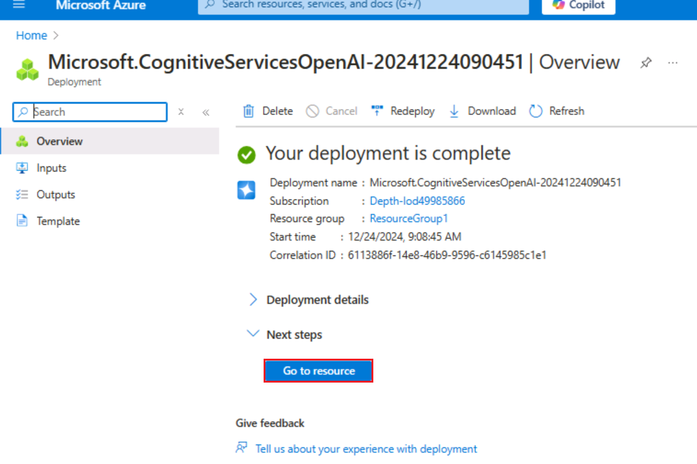
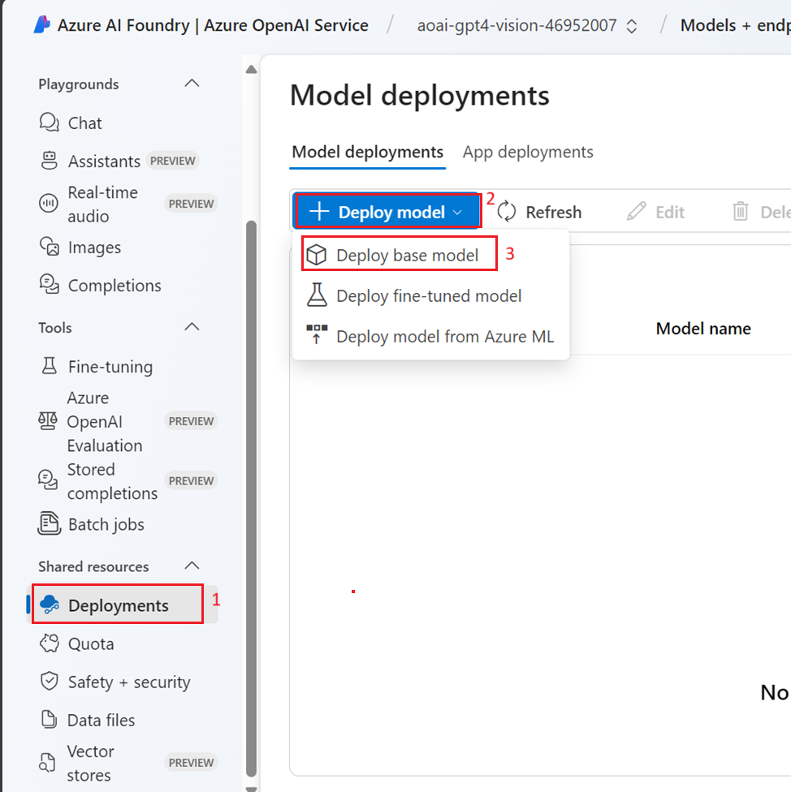
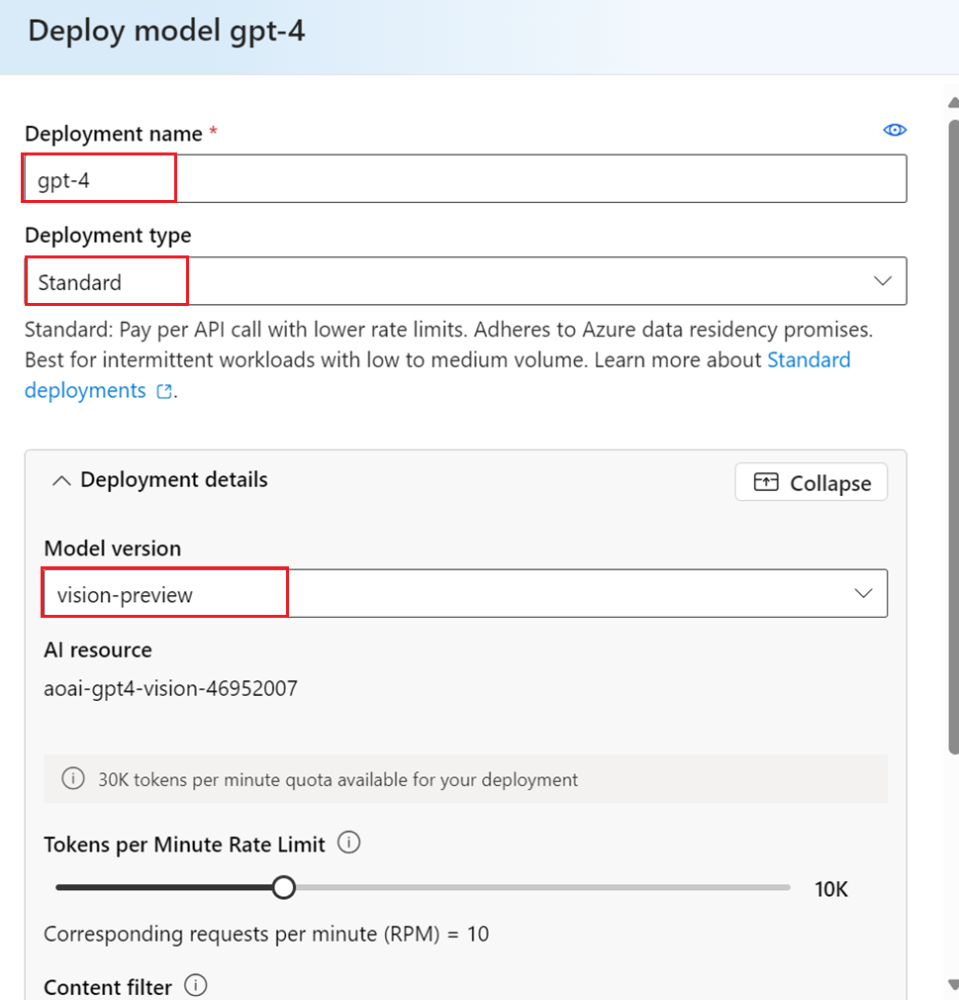
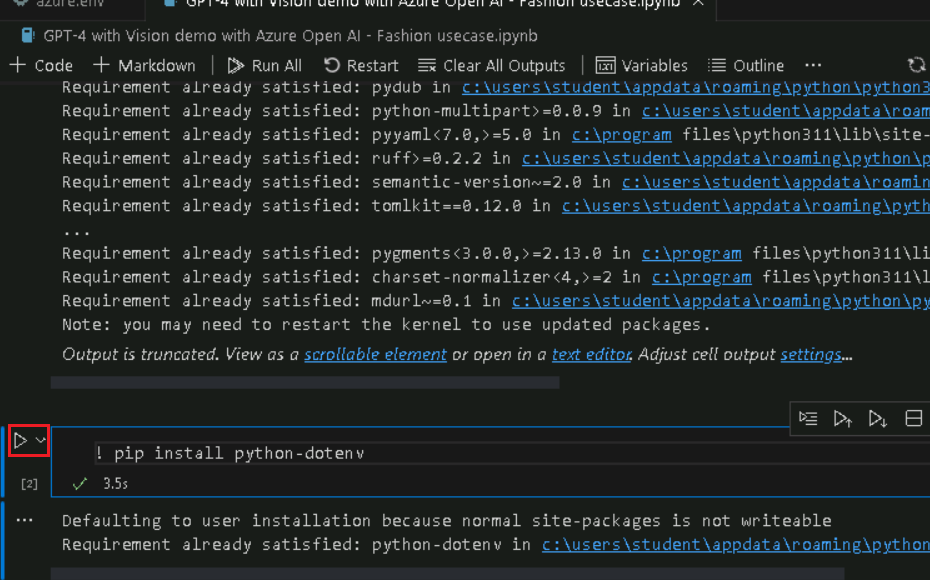
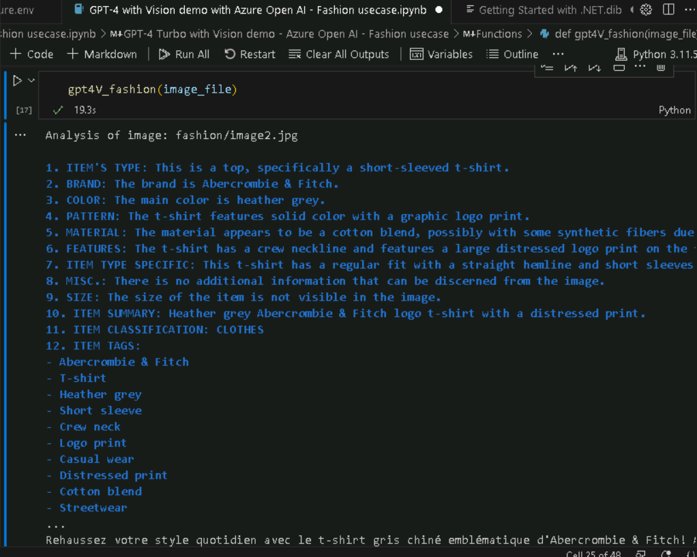
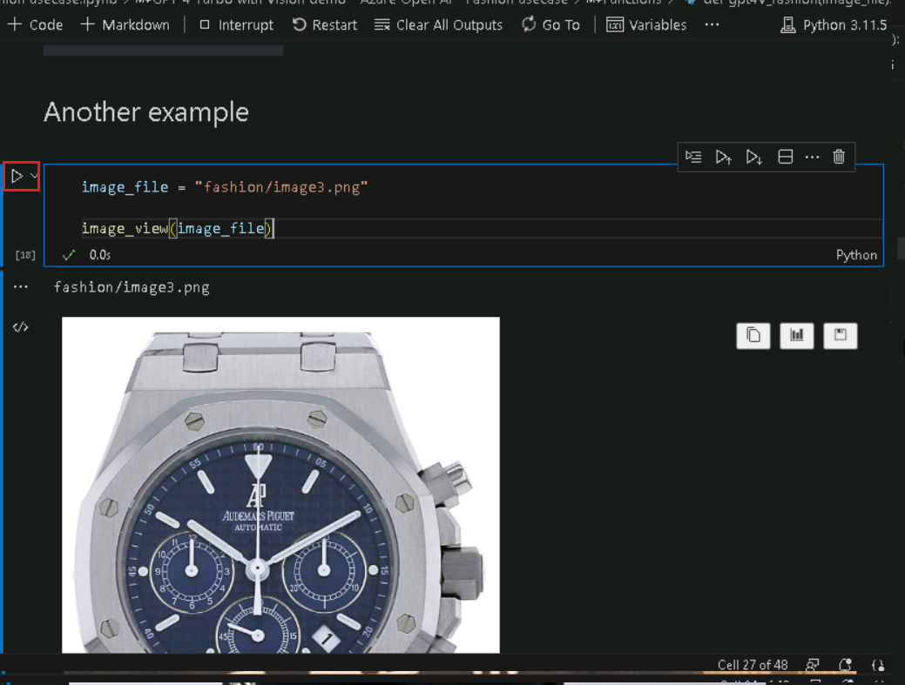
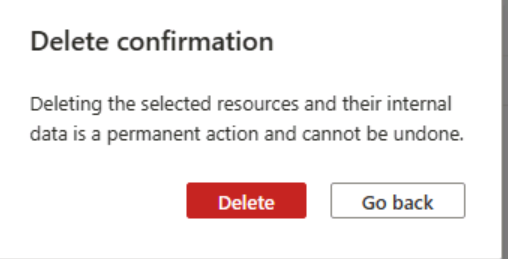

**사용 사례 01- Azure OpenAI의 GPT-4 Turbo with Vision을 활용해 패션
트렌드 분석**

**소개:**

Azure OpenAI 서비스에서 제공하는 GPT-4 Turbo with Vision이 현재 공개
프리뷰로 제공되고 있습니다. GPT-4 Turbo with Vision은 OpenAI에서 개발한
대규모 멀티모달 모델(LMM)로, 이미지 분석과 이에 대한 질문에 텍스트로
응답하는 기능을 갖추고 있습니다. 이 모델은 자연어 처리와 시각적 이해를
모두 포함하고 있습니다. 고급 모드에서는 Azure AI Vision 기능을 함께
활용할 수 있으며, 이미지에 대한 추가적인 인사이트를 도출할 수 있습니다.

**목표:**

- Azure OpenAI 리소스 배포 및 구성

- GPT-4 Vision와 같은 특정 Azure OpenAI 모델 배포

- Python, Jupyter Notebook 및 관련 라이브러리를 활용해 개발 환경 설정

- 이 사용 사례는 패션 분야에 특화된 활용 사례를 다룹니다. 여기에는
  이미지 분석, 텍스트 생성 또는 기타 AI 작업들이 포함될 수 있음

## 작업 0: VM 및 자격 증명 이해

이 단계에서는 전체 실습에서 사용하게 될 자격 증명 정보를 파악하고
이해하는 과정입니다.

1.  **Instructions** 탭에는 실습 전 과정에서 따라야 할 가이드가 포함되어
    있습니다.

2.  **Resources** 탭은 실습 수행에 필요한 자격 증명 정보가 포함되어
    있습니다.

    - **URL** – Azure 포털 접속 URL

    - **Subscription** – 사용자에게 배정된 구독 ID

    - **Username** – Azure 서비스 로그인 시 사용할 사용자 계정

    - **Password** – Azure 로그인 시 사용할 비밀번호. 이 Username과
      Password를 Azure 로그인 자격 증명이라 하며, 실습 중 해당 용어가
      언급되는 모든 경우에 이 자격 증명이 사용됨

    - **Resource Group** – 사용자에게 할당된 **Resource group**

\[!Alert\] **중요:** 반드시 모든 리소스를 지정된 리소스 그룹 내에
생성해야 합니다.

> 

3.  **Help** 탭에는 지원 정보가 포함되어 있습니다. 이곳에 표시된 **ID**
    값은 **Lab instance ID**이며, 실습을 진행하는 동안 사용됩니다.

> 

##  작업 1 : 서비스 제공자 등록하기

1.  브라우저를 열고 +++https://portal.azure.com+++에 접속한 후, 아래에
    제공된cloud slice 계정으로 로그인하세요.

> Username: <+++@lab.CloudPortalCredential>(User1).Username+++
>
> Password: <+++@lab.CloudPortalCredential(User1).Password>+++
>
> 
>
> 

2.  **Subscriptions** 타일을 클릭하세요.

> 

3.  Click on the subscription name.

> 

4.  왼쪽 탐색 메뉴에서 Settings을 확장하세요. **Resource providers**를
    클릭한 후, +++**Microsoft.AlertsManagement+++**를 입력하고
    선택하세요. **Register** 클릭하세요.

5.  **Resource providers**를 클릭한 후,
    +++**Microsoft.DBforPostgreSQL+++** 입력하고 선택하세요.
    **Register**를 클릭하세요.

6.  10번과 11번 단계를 반복해 다음 리소스 제공자를 등록하세요.

- Microsoft.Search

- Microsoft.Web

- Microsoft.ManagedIdentity

## **작업 2: Azure OpenAI 리소스 생성**

1.  아래 이미지와 같이 Azure 포털에서 페이지 왼쪽 상단에 있는 세 개의
    가로 바(햄버거 메뉴)로 표시된 **portal menu**를 클릭하세요.

> 

2.  **+ Create a resource**를 찾아 클릭하세요.

> 

3.  **Create a resource** 페이지에서, **Search services and
    marketplace** 창에**Azure OpenAI**를 입력한 후 **Enter** 키를
    누르세요.

> 

4.  **Marketplace** 페이지에서 **Azure OpenAI** 타일로 이동한 후,
    **Create** 옆의 V 화살표 버튼을 클릭하세요. 그 후, 아래 이미지와
    같이 **Azure OpenAI**를 클릭하세요.

> 

5.  **Create Azure OpenAI** 창에서 **Basics** 탭 아래에 다음 정보를
    입력하고**Next** 버튼을 클릭하세요.

    1.  **Subscription**: 할당된 구독 서비스 선택

    2.  **Resource group:** 할당된 리소스 그룹 선택

    3.  **Region**: 이 실습에서는  **gpt-4-vision** 모델 사용. 이 모델은
        현재 특정 지역( [certain
        regions](https://learn.microsoft.com/azure/ai-services/openai/concepts/models#embeddings-models))에서만
        사용 가능. 아래 목록에서 지역을 선택해 주세요. 이 실습에서는
        **Sweden Central** 지역을 사용할 것입니다.

    4.  **Name**: **aoai-gpt4-visionXXXXX** (XXXXX는 Lab instant ID로
        대체 가능)

    5.  **Pricing tier**: **Standard S0** 선택

> **참고**: Instant ID 찾기 위해서는 'Help'을 선택하고 instant ID를
> 복사하세요.
>
> 
>
> 
>
> 

6.  **Network** 탭에서 모든 라디오 버튼을 기본 상태로 유지하고 **Next**
    버튼을 클릭하세요.

> 

7.  **Tags** 탭에서 모든 필드를 기본 상태로 유지하고 **Next** 버튼을
    클릭하세요.

> 

8.  **Review + submit** 탭에서 Validation이 성공적으로
    완료되면**Create** 버튼을 클릭하세요.

> 

9.  배포가 완료될 때까지 기다리세요. 배포는 약 2-3분 정도 소요됩니다.

10. 배포과 완료되면**Microsoft.CognitiveServicesOpenAI** 창에서 **Go to
    resource** 버튼을 클릭하세요.

> 

11. 왼쪽 탐색 메뉴에서 **Keys and Endpoints**를 클릭한 다음, Endpoint
    값을 복사하여 메모장에 **AzureAI ENDPOINT**로 저장하고, key 값을
    복사하여**AzureAIKey**변수로 저장하세요.

> 

12. **아래 이미지와 같이 aoai-gpt4-visionXX** 창에서 왼쪽 탐색
    메뉴의**Overview** 를 클릭한 후, 화면을 아래로 스크롤해**Get
    Started** 타일에서 **Go to AzureOpenAI Studio** 버튼을 클릭하세요.
    해당 버튼을 클릭하면 **Azure OpenAI Studio** 가 새로운 브라우저
    창에서 열립니다.

## **작업 3: Azure OpenAI 모델 gpt-4-vision 배포**

1.  **Azure AI Foundry | Azure Open AI Service**
    홈페이지에서**Components** 섹션으로 이동해 **Deployments**를
    클릭하세요.

2.  **Deployments** 창에서 **+Deploy model** 을 드롭다운하고 **Deploy
    base model**을 선택하세요.

3.  **Select a model** 대화 상자에서 **gpt-4**를 찾아
    선택하세요**Confirm** 버튼을 클릭하세요.

4.  In the **Deploy model gpt-4** 대화 상자에서**Deployment name**
    필드에 **gpt-4**가 입력되어 있는지 확인한 후, Deployment type을
    **Standard**로 선택하고 Model version을 Vision- preview로
    선택하세요. 설정을 완료한 뒤**Deploy** 버튼을 클릭하세요.

## 작업 4: GPT-4 Turbo with Vision 데모

1.  Windows 검색 창에서 Visual Studio를 입력한 후, **Visual Studio
    Code** 클릭하세요.

> 

2.  **Visual Studio Code** 편집기에서 **File**을 클릭한 후, **Open
    Folder**를 클릭하세요.

> 

3.  **C:\LabFiles** 경로에서 **GPT4V-Fashion** 폴더로 이동하여 선택한
    후, **Select Folder** 버튼을 클릭하세요.

4.  **Do you trust the authors of the files in this folder?** 대화
    상자가 표시되면, **Yes, I trust the author**버튼을 클릭하세요.

5.  Visual Studio Code에서 **Gpt 4V-FASHION**를 드롭다운하고
    **azure.env** 파일을 클릭하세요.

1.  매개변수를 업데이트하고, Task 1에서 메모장에 저장한 **Azure OpenAI
    Endpoint**와 **Azure OpenAI Key** 값을 해당 위치에 입력한 후, 파일을
    저장하세요.

2.  Visual Studio Code에서 **GPT 4V-FASHION**를 드롭다운한 뒤, **GPT-4
    with Vision demo with Azure Open AI - Fashion usecase.ipynb**
    notebook 파일을 선택하세요.

> 

3.  Visual Studio Code 편집기의 메인 화면에서 **install requirements**
    섹션까지 아래로 스크롤한 후, 첫 번째 셀을 실행하세요. 실행 중 환경을
    선택하라는 메시지가 표시되면, 다음 이미지와 같이 **Python
    Environments**를 선택하세요.

> 
>
> 

4.  경로를 선택하라는 메시지가 표시되면 아래 이미지와 같이 **Python
    version 3.11.5** 경로를 선택하세요.

> 

5.  Windows 보안 경고 대화 상자가 표시되면 **Allow access** 버튼을
    클릭하세요.

> 
>
> 
>
> 
>
> 

6.  To restart Jupyter kernel, click on **Restart** button.

> 

7.  라이브러리를 가져오기 위해서는 **4번째** 셀을 선택하세요. 그 후,
    **start icon**을 클릭해 셀을 실행하세요.

> 

8.  **5**번째 셀을 선택하세요. 그 후, **start icon**을 클릭해 셀을
    실행하세요.

> 

9.  OpenAI 및 시스템 버전을 확인하기 위해 **6번째, 7번째 8번째, 9번째**
    셀을 선택하세요. 그 후, **start icon**을 클릭해 셀을 실행하세요.

> 

10. 구성 값을 로드하기 위해 **10**번, 11번, 12번 셀을 선택한 후 **Play**
    버튼을 클릭해 실행하세요.

> 

11. 임베딩을 생성하는 도우미 함수(helper function)를 정의한 후, 13번과
    14번 셀을 선택하고 **Play** 버튼을 클릭하여 실행하세요.

> 
>
> 

12. 예제를 실행하려면, 15번과 16번 셀을 선택한 후 **Play** 버튼을
    클릭하여 실행하세요.

> 
>
> 

13. 예제를 실행하려면, **17**번과 **18**번 셀을 선택한 후 **Play**
    버튼을 클릭하여 실행하세요.

> 
>
> 

14. 예제를 실행하려면, **19**번과 **20**번 셀을 선택한 후 **Play**
    버튼을 클릭하여 실행하세요.

> 
>
> 

15. 예제를 실행하려면, **21**번과 **22**번 셀을 선택한 후 **Play**
    버튼을 클릭하여 실행하세요.

> 
>
> 

16. 예제를 실행하려면, **23**번과 **24**번 셀을 선택한 후 **Play**
    버튼을 클릭하여 실행하세요.

> 

17. 예제를 실행하려면, **25**번과 **26**번 셀을 선택한 후 Play 버튼을
    클릭하여 실행하세요.

> 
>
> 

18. To run the example, select and execute the **27^(th) ,28^(th)**
    cells by clicking on the **Play** button.

> 
>
> 

19. 예제를 실행하려면, **27**번과 **28**번 셀을 선택한 후 **Play**
    버튼을 클릭하여 실행하세요.

> 
>
> 

20. WebApp 생성하기 위해 **29번** 셀을 선택한 후, **Play** 버튼을
    클릭하여 실행하세요.

> 

21. WebApp 생성하기 위해 **30번** 셀을 선택한 후, **Play** 버튼을
    클릭하여 실행하세요.

> 

22. 애플리케이션이 성공적으로 배포되면 터미널에 URL이 표시됩니다. 해당
    **URL**을 복사하세요.

23. 브라우저를 열고 주소창에 복사한 Public URL 링크를 붙여넣으세요.
    

24. 브라우저를 열고 주소창에 로컬 URL 링크를 붙여넣은 후, 원하는 항목을
    선택하세요.

25. **Submit** 버튼을 클릭하세요.

> 

## 작업 5: 리소스 삭제하기

1.  스토리지 계정을 삭제하기 위해 **Azure portal Home** 페이지로 이동해
    **Resource groups**를 클릭하세요.

> 

2.  **ResourceGroup1** 리소스 그룹을 클릭하세요.

> 

3.  **Resource group** 홈페이지에서**delete resource group**를
    선택하세요.

4.  오른쪽에 표시된 **Delete Resources** 창에서 **Enter "resource group
    name" to confirm deletion** 필드로 이동한 후, 리소스 그룹 이름을
    입력하고 **Delete** 버튼을 클릭하세요.

5.  **Delete confirmation** 대화 상자의 **Delete** 버튼을 클릭하세요.

> 

1.  벨 아이콘을 클릭하면 –**Deleted resource group AOAI-RG89** 알림이
    표시됩니다.

**요약**

이 실습에서는 참가자들이 Azure OpenAI를 사용해 고급 AI 기능을
탐구합니다. 필수 Azure 리소스 설정부터 시작해 GPT-4-vision과 같은 AI
모델을 배포합니다. 이 실습에서는 vision 기능을 갖춘 GPT-4가 이미지 인식,
개인화된 스타일 추천, 트렌드 분석 등 패션 관련 작업을 어떻게 혁신적으로
변화시킬 수 있는지를 다룹니다.
