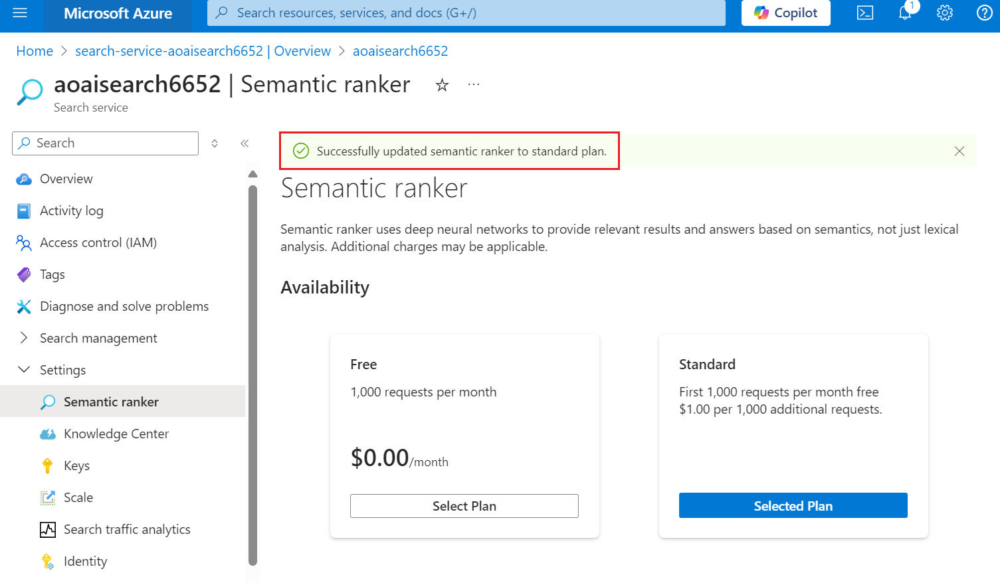
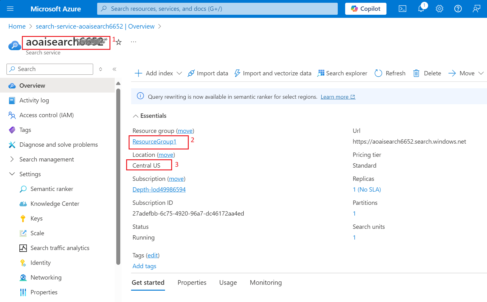
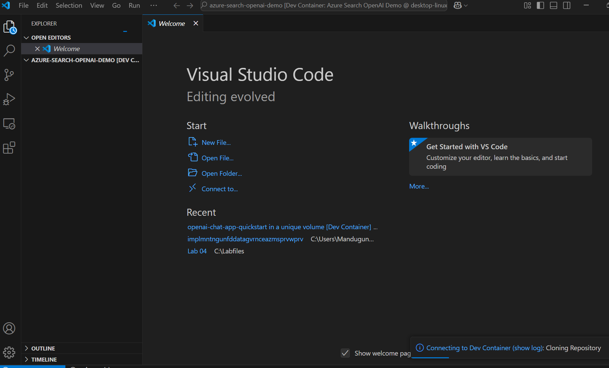
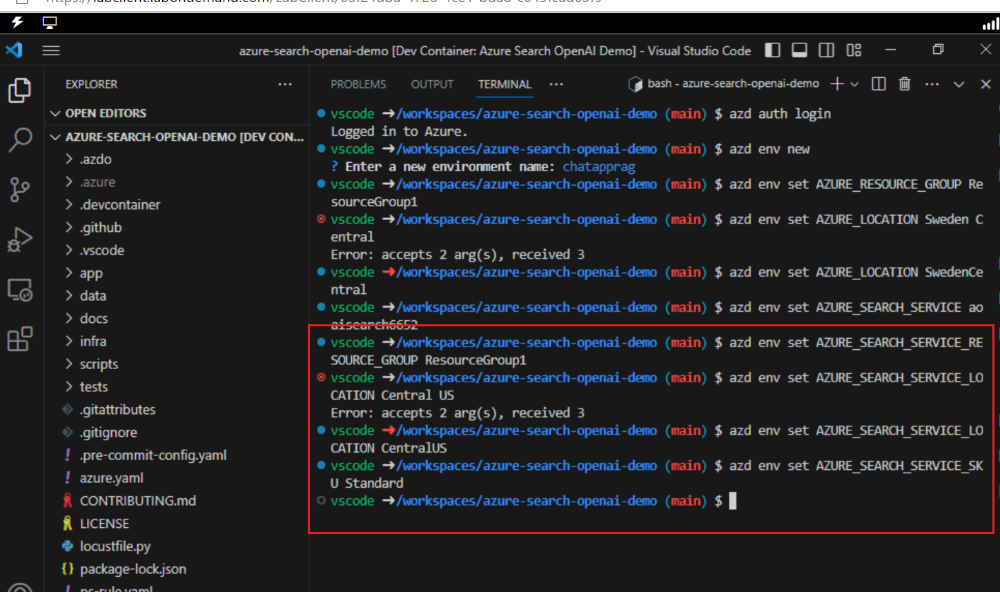
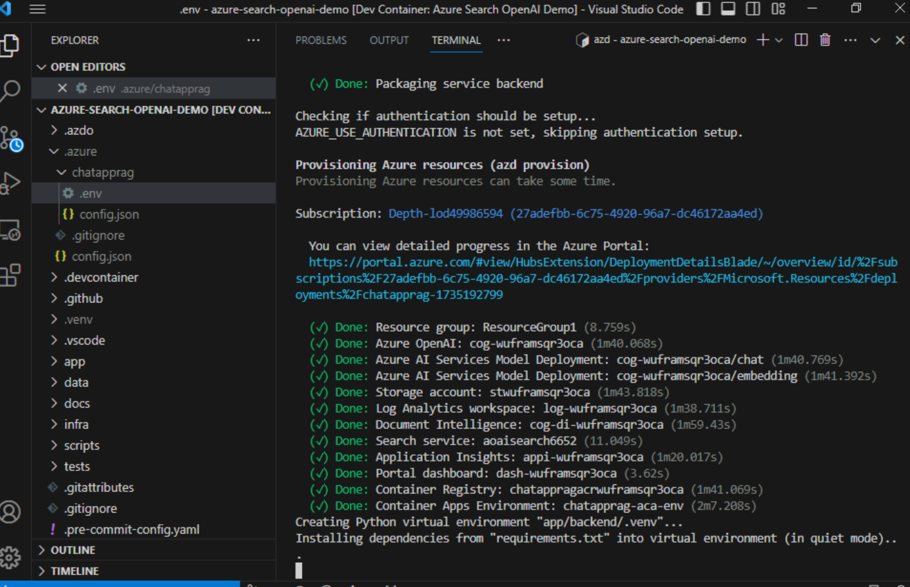
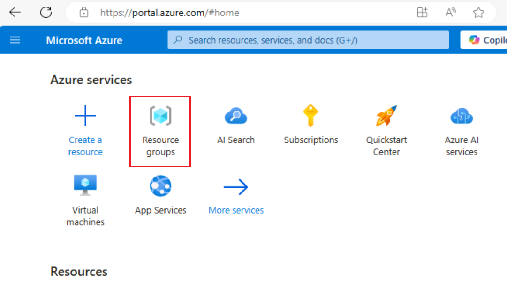
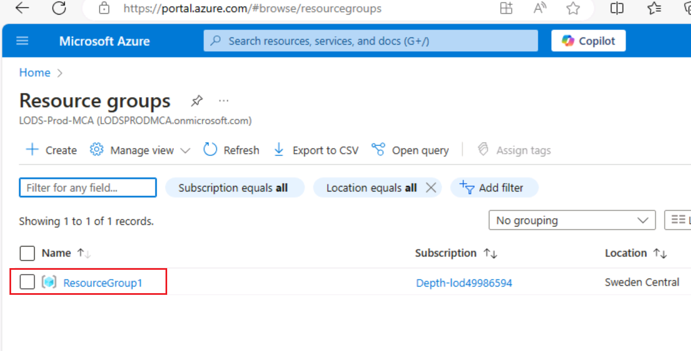
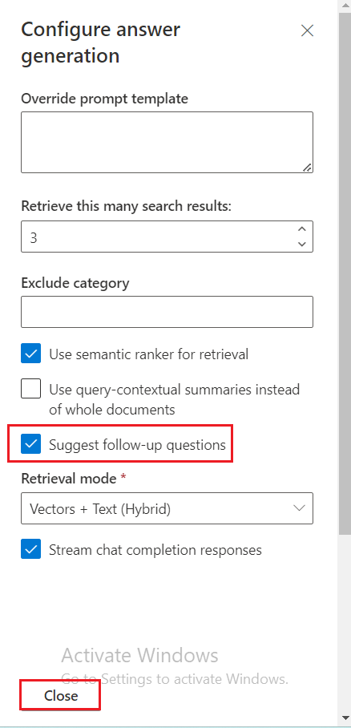

**소개**

이 샘플은 Retrieval Augmented Generation (RAG) 패턴을 활용해 사용자의
자체 데이터를 기반으로 ChatGPT와 유사한 경험을 구현하는 다양한 접근
방식을 보여줍니다. Azure OpenAI Service 통해 ChatGPT
모델(gpt-35-turbo)에 액세스하고, Azure Cognitive Search를 활용해 데이터
인덱싱 및 검색을 수행합니다.

이 샘플 애플리케이션은 가상의 회사인 Contoso Electronics를 배경으로
하며, 직원들이 복리후생, 사내 정책, 직무 설명 및 역할 등에 대해 질문할
수 있는 인터페이스를 제공합니다. 레포지토리에는 샘플 데이터가 포함되어
있어 엔드투엔드로 바로 실습할 수 있도록 구성되어 있습니다.

이 사용 사례는 Azure 플랫폼에서 Retrieval Augmented Generation (RAG)
패턴을 활용한 정교한 챗 애플리케이션 개발 과정을 안내합니다. Azure
OpenAI Service 및 Azure Cognitive Search를 활용해 자체 데이터를 기반으로
지능적으로 질문에 답할 수 있는 챗 애플리케이션을 구축하게 됩니다. 이
실습에서는 가상의 회사인 Contoso Electronics를 사례로 사용해 직원
복리후생, 사내 정책, 직무 역할 등과 같은 기업 데이터를 기반으로
ChatGPT와 유사한 경험을 어떻게 구축할 수 있는지 시연합니다.

**목표**

- 로컬 머신에 Azure CLI 및 Node.js 설치

- 사용자에게 소유자 역할 할당

- Dev Containers 확장 기능 설치 및 개발 환경 설정

- 채팅 애플리케이션을 Azure에 배포하고 이를 사용하여 PDF 파일에서 정보
  추출

- 배포된 리소스 및 모델 삭제

## 작업 1: Azure CLI 설치 및 정책 범위를 로컬 머신으로 설정하기

1.  Windows 검색 창에 **PowerShell**을 입력하세요. **PowerShell** 대화
    상자에서 **Run as administrator**를 클릭하세요. **Do you want to
    allow this app to make changes to your device?**라는 대화 상자가
    표시되면 **Yes** 버튼을 클릭하세요.

> 

2.  PowerShell에서 다음 명령어를 실행하여 **Azure CLI**를 설치하세요.

PowerShell copy

> **winget install microsoft.azd**

3.  아래 명령을 실행하여 정책을 **Unrestricted**로 설정하고 실행 정책을
    변경하라는 메시지가 표시되면 **A**를 입력하세요.

> **Set-ExecutionPolicy Unrestricted**
>
> 

## 작업 2: Node.js 설치

1.  브라우저 열고 주소 표실줄로 이동한 후, 다음 URL을 입력 또는
    붙여넣으세ㅇ: +++https://nodejs.org/en/download/+++. 이제 **Enter**
    버튼을 누르세요.

2.  **Windows Installer**를 선택하고 클릭하세요.

3.  **Node-V** 파일이 다운로드됩니다. 다운로드된 파일을 클릭하여
    **Node.js** 설정하세요.

4.  **Welcome to the Node.js Setup Wizard** 창에서 **Next 버튼**을
    클릭하세요.

5.  **End-User License Agreement** 창에서 **I accept the terms in the
    License agreement** 라디오 버튼을 선택하고 **Next** 버튼을
    클릭하세요.

6.  **Destination Folder** 창에서 **Next** 버튼을 클릭하세요.

7.  **Custom Setup** 창에서 **Next** 버튼을 클릭하세요.

8.  Ready to install Node.js 창에서 **Install**을 클릭하세요.

9.  I**Completing the Node.js Setup Wizard** 창에서 **Finish** 버튼을
    클릭하여 설치 과정을 완료하세요.

## 작업 3: 리소스 그룹 이름 및 위치 가져오기

1.  브라우저를 열고 주소 표시줄로 이동한 후, 다음 URL을 입력 또는
    붙여넣으세요: +++https://portal.azure.com/+++. 이제 **Enter** 버튼을
    클릭핫에ㅛ.

> 

2.  **Microsoft Azure** 창에서 **User Credentials**를 사용해 Azure에
    로그인하세요.

3.  그 후, 비밀번호를 입력하고 **Sign in** 버튼을 클릭하세요.

> 

4.  **Stay signed in?** 창에서 **Yes** 버튼을 클릭하세요.

> 

5.  검색 창에 +++**Resource group+++**을 입력하고 **Resource groups**을
    선택하세요.

> 

6.  할당된 **Resource group**을 클릭하세요.

7.  **Resource group** 페이지에서 **resource group name and location**
    를 복사한 후, 메모장에 붙여넣으세요. 이 정보를 다음 작업에서
    사용하기 위해 메모장을 저장(**Save**)하세요.

## 작업 4: AI Search Service 생성

1.  Azure포털의 검색 창에 +++**AI search+++**를 입력하고 **AI Search**를
    선택하세요.

2.  \+**Create**를 클릭하세요.

3.  ㅇ아래 값을 선택한 후, **Review + Create** 버튼을 클릭하세요.

&nbsp;

1)  Subscription: **Azure 구독 선택**

2)  Resource group - **기존 Resource group 선택**

3)  Service name - **aisearchXXXX(XXXXX는 Lab instant ID로 대체됨)**

4)  Location : **Central US** /가까운 지역 선택

5)  Pricing tier: 표준

4.  이제 **Create**를 클릭하세요.

5.  배포가 완료될 때까지 기다린 후, **Go to resource** 버튼을
    클릭하세요.

> 
>
> 

6.  In the **AI Search** Overview 페이지에서 왼쪽 탐색 창의**Settings**
    섹션 아래에 있는 **Semantic ranker**를 선택하세요.

7.  **Semantic ranker** 탭에서 **Standard** 타일을 선택한 후 **Select
    plan**를 클릭하세요.

> 

8.  **Yes**를 선택하세요.

> 

9.  다음 알림이 표시됩니다 -**Successfully updated semantic ranker to
    standard plan**

> 

10. 메모장을 열고 AI Search 이름, 리소스 그룹 이름, 그리고 위치를
    적어두세요. 나중에 이 정보를 사용해서 서비스에 연결할
    예정입니다.

## 작업 5: Docker 실행

1.  Windows 검색 창에 Docker를 입력한 후, **Docker Desktop**을
    클릭하세요.

2.  Docker Desktop를 실행하세요.

## **작업 6: Dev Containers 확장 기능 설치하기**

1.  Windows 검색 창에 Visual Studio를 입력한 후, **Visual Studio
    Code**를 클릭하세요.

> 

2.  브라우저를 열고 주소창으로 이동한 후, 다음 URL을 입력 또는
    붙여넣으세요:
    +++https://marketplace.visualstudio.com/items?itemName=ms-vscode-remote.remote-containers+++.
    이제 **Enter** 버튼을 누르세요.

> 

3.  Dev Containers 페이지에서 Install 버튼을 선택하세요.

4.  이 확장 기능을 설치하기 위해 Visual Studio Code가 필요합니다. 대화
    상자가 나타나면 **Continue** 버튼을 클릭하세요.

5.  This site is trying to open Visual Studio Code라는 대화 상자가
    표시되면, **Open** 버튼을 클릭하세요.

6.  Visual Studio에서 Dev container 아래에 있는 Install 버튼을
    클릭하세요.

## 작업 7: **개발 환경 열기**

1.  브라우저를 열고 주소창으로 이동한 후, 다음 URL을 입력 또는
    붙여넣으세요:

+++<https://vscode.dev/redirect?url=vscode://ms-vscode-remote.remote-containers/cloneInVolume?url=https://github.com/azure-samples/azure-search-openai-demo>+++
이제 **Enter** 버튼을 누르세요.

2.  This site is trying to open Visual Studio Code라는 대화 상자가
    나타나면, **Open** 버튼을 클릭하세요.

> 

3.  Allow ‘Dev Containers’ extension to open this URI? 대화 상자가
    표시되면**Open** 버튼을 클릭하세요.

> 

4.  Cloning a repository in a Dev Container may execute arbitrary code
    대화 상자가 표시되면**Got It** 버튼을 클릭하세요.

> 

5.  Dev ㄹ컨테이너를 시작하는 데 약 13~15분이 소요됩니다. 배포가
    완료되면 Enter 키를 누르세요.

6.  터미널을 닫으려면 아무 키나 누르세요.

> 

## 작업 8: Azure에 채팅 앱 배포

1.  Azure Develooper CLI를 사용해 Azure에 로그인하세요. 터미널에서 다음
    명령을 실행하세요.

> BashCopy
>
> **azd auth login**
>
> 

2.  기본 브라우저가 열리고 로그인할 수 있습니다. Azure 구독 계정으로
    로그인하세요.

> 

3.  브라우저를 닫으세요.

> 

4.  로그인하면 Azure 로그인 정보가 터미널에 자동으로 표시됩니다.

> 

5.  새로운 azd 환경을 생성하세요. 터미널에서 다음 명령을 실행하세요.

Copy

**azd env new**

6.  새 환경 이름을 +++**chatapprag+++**로 지정하세요.

> 

7.  기존 Azure resourcegroup을 할당합니다. 터미널에서 다음 명령을
    실행하세요.

> azd env set AZURE_RESOURCE_GROUP {Name of existing resource group}
>
> azd env set AZURE_LOCATION {Location of existing resource group}
>
> 

8.  기존 Azure AI Search 서비스를 할당하세요. 터미널에서 다음 명령을
    실행하세요.

> +++azd env set AZURE_SEARCH_SERVICE {Name of existing Azure AI Search
> service}+++
>
> +++azd env set AZURE_SEARCH_SERVICE_RESOURCE_GROUP {Name of existing
> resource group with ACS service}+++
>
> +++azd env set AZURE_SEARCH_SERVICE_LOCATION {Location of existing
> service}+++
>
> +++azd env set AZURE_SEARCH_SERVICE_SKU {Name of SKU}+++
>
> 

9.  할당된 기존 리소스를 확인하고, Azure를 선택한 후, **.env** 파일을
    선택하세요.

> 

10. 새로운 azd 환경을 생성하세요:

> shellCopy
>
> **azd up**
>
> 

11. 사용자의 Azure 구독을 선택하세요.

> 

12. 다음 메시지가 표시되면 **West** US2를 선택하세요: **Enter a value
    for the ‘documentIntelligenceResourceGroupLocation’ infrastructure
    parameter**

> 

13. 다음 메시지가 표시되면 **France Central** 를 선택하세요: **enter a
    value for the ‘openAiResourceGroupLocation’ infrastructure
    parameter**

> 

14. 앱이 배포될 때까지 기다리세요. 배포가 완료되는 데 **35-40**분 정도
    걸릴 수 있습니다.

> 
>
> 
>
> 
>
> 
>
> 

15. 애플리케이션이 성공적으로 배포되면 콘솔에 URL이 출력됩니다. 해당
    URL을 클릭하면 브라우저에서 애플리케이션과 상호작용이 가능합니다.
    URL은 다음과 유사한 형태일 것입니다:

> 

16. 브라우저를 열고 주소창에 링크를 붙여넣으면, 리소스 그룹이 새
    브라우저 탭에서 열릴 것입니다.

## 작업 9: Azure Portal에서 배포된 리소스 확인

1.  **Resource groups** 선택하세요.

> 

2.  할당된 **Resource group**을 클릭하세요.

3.  아래 리소스가 성공적으로 배포되었는지 확인하세요.

- Azure App Service

- Azure Application Insights

- Container App

- Container registry

- Azure OpenAI

- Azure Document Intelligence

- Azure Search Service

- Azure Storage Account

- Azure Speech Service

4.  리소스 그룹에서 **AI Search service**를 클릭하세요.

> 

5.  인덱스가 성공적으로 배포되었는지 확인하세요.

> 

6.  resorcegroup으로 돌아가서 **Storage account**를 클릭하세요.

> 

7.  왼쪽 탐색 메뉴에서 **Containers**를 클릭하세요. 데이터가 성공적으로
    배포되었는지 확인하세요.

> 

## 작업 10: PDF 파일에서 답변을 얻기 위해 채팅 앱 사용

1.  Wait for the web application deployment to complete.

> 

2.  In the **GPT+Eneterprise data |Sample** 웹 앱 페이지에서 다음
    텍스트를 입력하고 아래 이미지에 표시된 **Submit icon**을 클릭하세요.

> **What happens in a performence review?**

3.  답변에서 **citation**을 선택하세요.

4.  오른쪽 창에서 탭을 활용해 답변이 어떻게 생성되었는지 확인해 보세요.

[TABLE]

5.  선택한 탭을 다시 선택하여 창을 닫으세요.

6.  채팅의 지능 수준은 OpenAI 모델과 해당 모델과 상호작용할 때 사용되는
    설정에 따라 결정됩니다.

7.  **Developer settings**을 선택하세요.

[TABLE]

8.  **Suggest follow-up questions** 체크박스를 선택하고 동일한 질문을
    다시 하세요.

9.  다음 텍스트를 입력하고 아래 이미지와 같이 **Submit** **icon**을
    클릭하세요.

> What happens in a performance review?

10. 채팅에서는 다음과 같은 후속 질문을 제안했습니다.

11. **Settings** 탭에서 **Use semantic ranker for retrieval** 옵션의
    선택을 해제하세요.

12. 다음 텍스트를 입력하고 아래 이미지와 같이**Submit icon**을
    클릭하세요..

> What happens in a performance review?

## 작업 11: 리소스 삭제

1.  To delete Resource group 삭제하기 위해 Azure 포털 검색 창에
    **Resource** groups을 입력하고 **Services** 아래의**Resource
    groups**으로 이동해 클릭하세요.

> 

2.  샘플 웹앱 리소스 그룹을 클릭하세요.

3.  리소스 그룹 홈페이지에서**all resources**를 선택하세요.

4.  Delete을 선택하세요.

**요약**

이번 실습에서는 Azure의 도구와 서비스 제품군을 활용해 지능형 채팅
애플리케이션을 설정하고 배포하는 방법을 배웠습니다. Azure CLI 및
Node.js와 같은 필수 도구를 설치하고, Visual Studio Code에서 Dev
Containers를 사용하여 개발 환경을 구성했습니다. Azure OpenAI 및 Azure
Cognitive Search를 활용해 PDF 파일에서 질문에 답할 수 있는 채팅
애플리케이션을 배포했습니다. 마 마지막으로, 리소스를 효과적으로 관리하기
위해 배포된 리소스를 삭제했습니다. 이 실습 경험을 통해 Azure에서
Retrieval Augmented Generation 패턴을 활용한 지능형 채팅 애플리케이션
개발 및 관리 기술을 습득했습니다.
