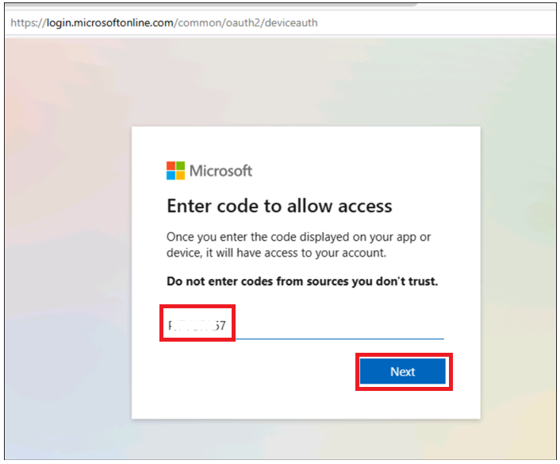
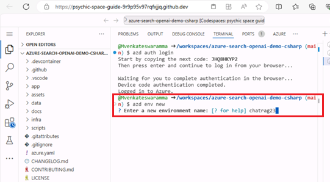

# 사용 사례 04- **Azure OpenAI 서비스와 RAG를 사용한 .NET 기반 챗 앱 구축**

이 샘플은 Retrieval Augmented Generation (RAG) 패턴을 활용해 사용자의
자체 데이터를 기반으로 ChatGPT와 유사한 챗 경험을 구현하는 다양한 접근
방식을 제시합니다. Azure OpenAI Service 통해 ChatGPT 모델
(gpt-4o-mini)에 액세스하고, Azure AI Search를 이용해 데이터 인덱싱 및
검색을 수행합니다.

레포지토리에는 샘플 데이터가 포함되어 있어 엔드투엔드로 바로 실습할 수
있습니다. 이 샘플 애플리케이션은 가상의 회사인 Contoso Electronics를
사용하며,

직원들이 복리후생, 사내 정책, 직무 설명 및 역할 등에 대해 질문할 수 있는
경험을 제공합니다.

- 음성 채팅, 채팅 및 Q&A 인터페이스

- 응답의 신뢰성을 평가할 수 있도록 출처 인용, 내용 추적 등의 다양한
  옵션을 탐구

- 데이터 준비, 프롬프트 구성, 모델(ChatGPT)과 검색기(Azure AI Search)
  간의 상호작용을 조율하는 접근 방식 소개

- UX 내 설정을 통해 모델 동작을 조정하고 다양한 옵션을 실험 가능

**사용된 핵심 기술** -- Azure OpenAI Service, ChatGPT model
(gpt-4o-mini) 및Azure AI Search

**예상 소요 시간 –** 40분

# 연습 1 : 애플리케이션을 배포하고 브라우저에서 테스트하기

## 작업1: 개발 환경 열기

1.  브라우저를 열고, 주소창에 다음 URL을 입력 또는 붙여넣으세요:
    +++https://github.com/technofocus-pte/azure-search-openai-demo-csharp.git+++.
    이제 Github 계정으로 로그인하세요.

> 

2.  **Fork**를 클릭하세요.

> 

3.  리포지토리명을 입력한 후 **Create fork**를 클릭하세요.

> 

4.  **Code -\> Codespaces -\> +** 클릭하세요.

> 

5.  환경 설정이 완료될 때까지 기다리세요. 약 5-10분 정도 걸립니다.

> 

## 작업 2: 채팅 앱을 Azure에 구축하고 배포하기 위한 필수 서비스 프로비저닝하기

1.  터미널에서 다음 명령어를 실행하세요. 코드를 복사한 후 Enter 키를
    누르세요.

> +++azd auth login+++
>
> 

2.  코드를 입력할 수 있는 기본 브라우저가 열립니다. 복사된 코드를
    입력하고 **Next를** 클릭하세요.

> 

3.  Azure 자격 증명으로 로그인하세요.

4.  Switch back to Github Codespace 탭으로 다시 전환하세요. 아래
    명령어를 실행하여 현재 디렉터리에서 프로젝트 환경을 초기화하세요.
    +++**chatragXXX+++** 형식으로 환경 이름을 입력하고Enter 키를
    누르세요.

> 참고 : env 이름은 고유해야합니다.
>
> +++azd env new+++

5.  아래 명령어를 실행하여 Azure에 서비스를 프로비저닝하고 컨테이너를
    구축하세요.

> +++azd env set AZURE_RESOURCE_GROUP ResourceGroup1+++
>
> 

6.  azd up를 실행하세요. 이 명령은 Azure 리소스를 프로비저닝하고, 이
    샘플을 해당 리소스에 배포하며, ./data 폴더에 있는 파일을 기반으로
    검색 인덱스를 생성합니다.

> **+++azd up+++**
>
> 

7.  아래 값을 선택하세요.

- **Select an Azure Subscription to use** : 사용자의 구독을 선택

- **Select an Azure location to use** : **East us2/west us2** (East US
  지역이 사용할 수 없을 때가 있을 수 있으니, 아래 목록에서 다른 지역을
  선택)

- Select existing resource group : 사용자의 기존 리소스 그룹 (예
  :**ResourceGroup1 )**

> 
>
> 

7.  리소스가 완전히 프로비저닝될 때까지 기다리세요. 이 과정은 필요한
    모든 리소스를 생성하는 데 5-10분 정도 걸립니다.

> 
>
> 
>
> 

8.  애플리케이션이 성공적으로 배포된 후, 터미널에 URL이 표시됩니다.
    **URL**을 복사하세요.

> 

9.  **Open**을 클릭하세요.

> 

10. 새 탭에서 앱이 열립니다.

> 

11. 브라우저를 열고 <https://portal.azure.com>로 이동하고, Azure 구독
    계정으로 로그인하세요.

12. 홈페이지에서 **Resource Groups**를 클릭하세요.

> 

13. 리소스 그룹을 클릭하세요.

> 

14. 아래 리소스들이 정상적으로 배포되었는지 확인하세요.

> 

> 

15. 리소스 그룹에서 **Azure OpenAI** 리소스 이름을 클릭하세요.

> 

16. On the **Azure OpenAI** 창의 왼쪽 탐색 메뉴에서 **Overview**를
    클릭한 후, **Get Started** 탭에서 **Go to Azure OpenAI Studio**
    버튼을 클릭하여 새 브라우저에서 **Azure OpenAI Studio**를 여세요.

> 

17. **gpt-4o-mini**, **text-embedding-ada-002**가 성공적으로 배포되어야
    합니다.

> 

18. 리소스 그룹에서 **storage account**리소스 이름을 클릭하세요.

> 
>
> 

19. 이제 브라우저에서 URL을 여세요.

> 

20. **Chat**을 클릭하세요.

> 

21. **Blazor OpenAI** 웹 앱 페이지에서 다음 텍스트를 입력하고 아래
    이미지와 같이 **Submit icon**을 클릭하세요.

> **+++What is included in my Northwind Health Plus plan that is not in
> standard?+++**
>
> 
>
> 

22. **Blazor OpenAI** 웹 앱 페이지에서 다음 텍스트를 입력하고 아래
    이미지와 같이 **Submit icon**을 클릭하세요.

> **+++Can I use out-of-network providers?+++**
>
> 
>
> 

23. **Blazor OpenAI** 웹 앱 페이지에서 다음 텍스트를 입력하고 아래
    이미지와 같이 **Submit icon**을 클릭하세요.

> **+++Are there any exclusions or restrictions?+++**
>
> 
>
> 

24. **Blazor OpenAI** 웹 앱 페이지에서 다음 텍스트를 입력하고 아래
    이미지와 같이 **Submit icon**을 클릭하세요.

> **+++What does a Product Manager do?+++**
>
> 

25. Click on the **Documents.**

> 

## **작업 3 : 모든 리소스 정리**

1.  **Azure portal -\> Resource group-\> Resource group name**으로 다시
    전환하세요.

> 

2.  모든 리소스를 선택한 후, 아래 이미지와 같이 Delete을
    클릭하세요(리소스 그룹은 **삭제하지 마세요**).

> 

3.  텍스트 상자에 delete를 입력한 후, **Delete** 버튼을 클릭하세요.

> 

4.  **Delete**를 클릭하여 삭제를 확인하세요.

> 

5.  Github 포털 탭으로 다시 전환하고 페이지를 새로침하세요.

> 

6.  Code를 클릭한 다음, 이 실습을 위해 생성된 브랜치를 선택하고
    **Delete**를 클릭하세요.

> 

7.  브랜치 삭제를 확인하려면 **Delete** 버튼을 클릭하세요.

**요약:**

이 사례에서는 Azure에서 Retrieval Augmented Generation 패턴에 맞춰 채팅
애플리케이션을 배포하는 방법을 배웠습니다. Azure AI Search를 이용한 검색
기능과 Azure OpenAI 및 LangChain 대형 언어 모델(LLM)을 활용하여 ChatGPT
스타일의 대화형 경험과 Q&A 기능을 제공하는 애플리케이션을 구현했습니다.
