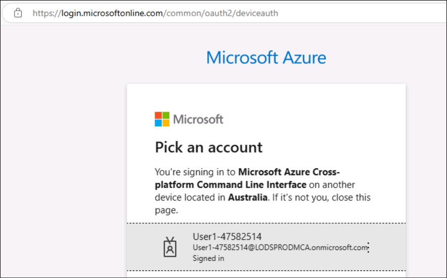
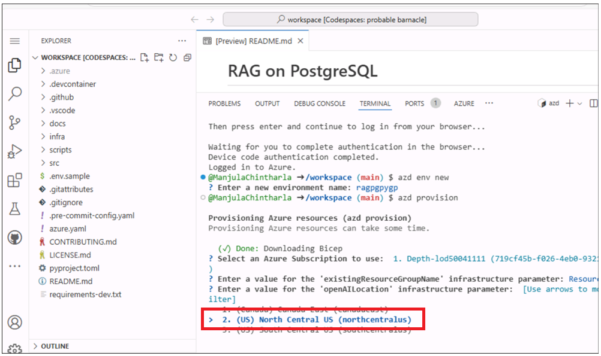
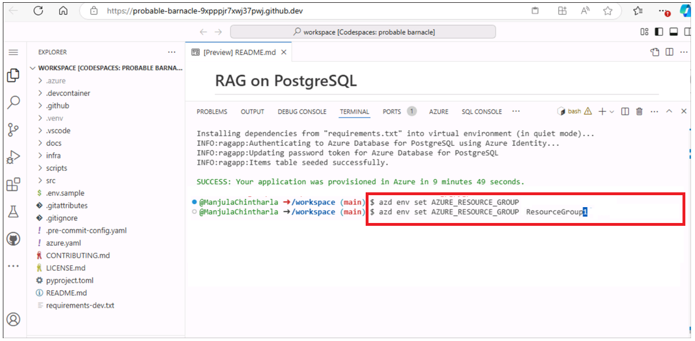
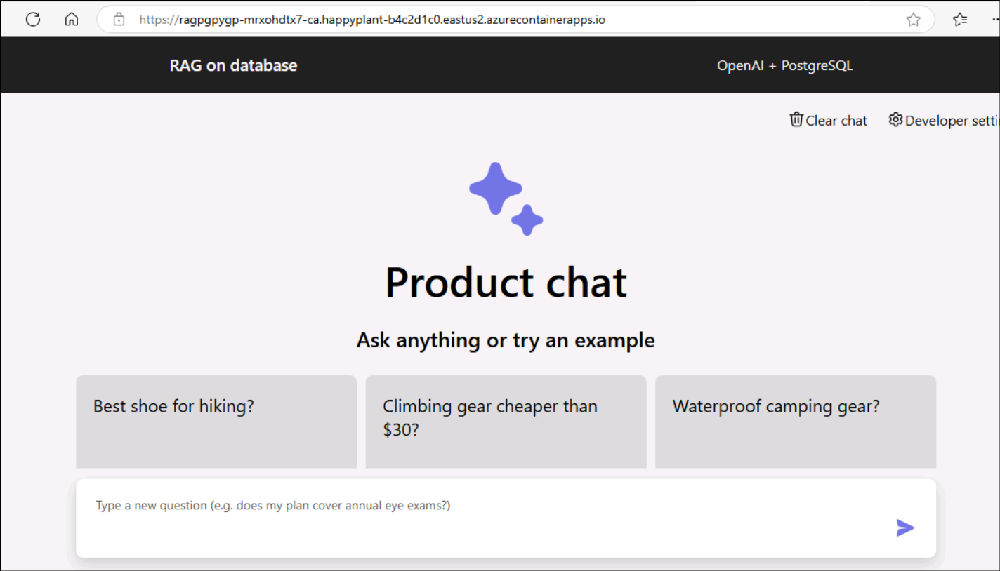
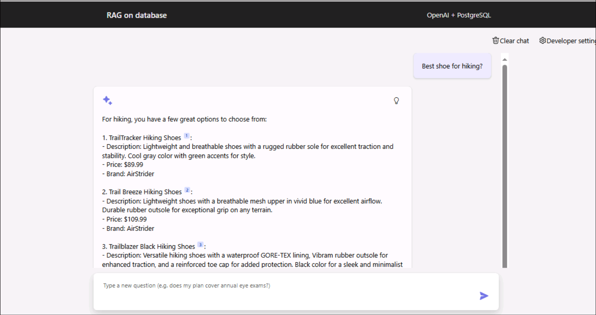
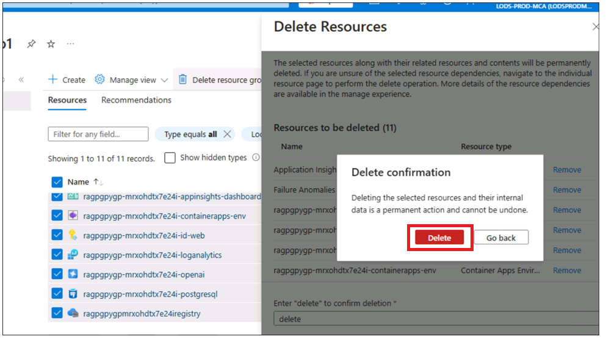
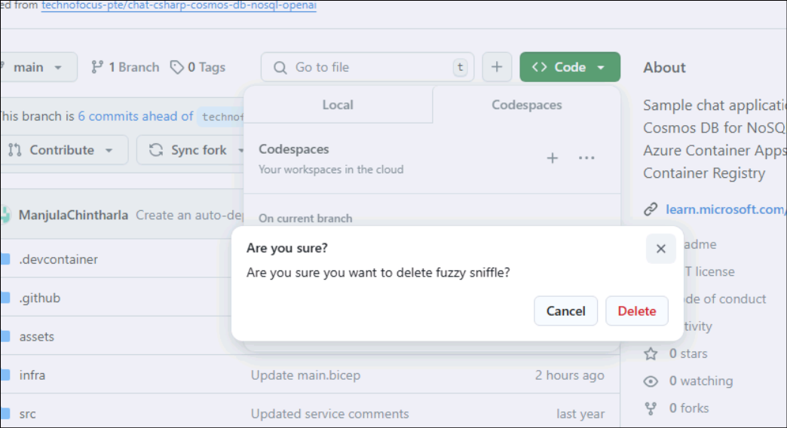

# 사용 사례06 - PostgreSQL Flexible Server를 사용해 Azure Container Apps에 채팅 앱 배포

**목표:**

- Azure CLI, Node.js 설치, Azure 구독 역할 할당, Docker Desktop 시작,
  Visual Studio Code의 Dev Containers 확장 활성화 등을 통해 Windows에서
  개발 환경 구성

- Azure에서 PostgreSQL과 OpenAI가 통합된 사용자 지정된 채팅
  애플리케이션을 배포 및 테스트

이 사용 사례에서는 포괄적인 개발 환경을 설정하고, PostgreSQL과 통합된
채팅 애플리케이션을 배포한 후 Azure에서 배포가 성공적으로 이루어졌는지
확인합니다. 이를 위해 Azure CLI, Docker, Visual Studio Code와 같은 필수
도구를 설치하고(호스트 환경에서는 이미 설치되어 있음), Azure에서 사용자
역할을 구성하며, Azure Developer CLI를 사용해 애플리케이션을 배포하고
배포된 리소스와 상호작용하여 기능을 확인합니다.

**주요 사용 기술** -- Python, FastAPI, Azure OpenAI 모델, Azure Database
for PostgreSQL 및azure-container-apps,ai-azd-templates.

**예상 소요 시간** – 45분

**실습 유형:** 강사 진행

**사전 요구 사항:**

GitHub 계정 -- 본 실습에서는 개인 GitHub 로그인 자격 증명이 필요합니다.
아직 계정이 없다면 아래 링크를 통해 새로 생성하세요:
- +++<https://github.com/signup?user_email=&source=form-home-signupobjectives+++>

**연습 1 : 애플리케이션을 프로비저닝 및 배포하고 브라우저에서
테스트하기**

## 작업 0: VM 및 자격 증명 이해

이 작업에서는 실습 전체에서 사용할 자격 증명을 식별하고 이해할 것입니다.

1.  **Instructions** 탭에는 실습 전체에서 따라야 할 지침이 포함되어
    있습니다.

2.  **Resources** 탭에는 실습 실행에 필요한 자격 증명이 포함되어
    있습니다.

    - **URL** – Azure 포털에 대한 URL

    - **Subscription** – 사용자에게 할당된 구독의 ID

    - **Username** – Azure 서비스에 로그인하는 데 사용하는 사용자 ID

    - **Password** – Azure 로그인을 위한 비밀번호. 이 사용자
      이름(Username)과 비밀번호를 Azure 로그인 자격 증명이라고
      하겠습니다. 이후 Azure 로그인 자격 증명이 언급되는 모든 작업에 이
      정보를 사용하게 됩니다.

    - **Resource Group** – 사용자에게 할당된**Resource group** 

\[!Alert\] **중요 사항:** 모든 리소스를 반드시 이 리소스 그룹 내에
생성해야 합니다.

> 

3.  **Help** 탭에는 지원(Support) 정보가 포함되어 있습니다. 이곳에
    표시된 **ID** 값은 실습 실행 중 사용되는 **Lab instance ID** 입니다.

> 

##  작업 1 : 서비스 공급자 등록

1.  브라우저를 열고 +++https://portal.azure.com+++로 이동하여 아래
    클라우드 슬라이스(cloud slice) 계정으로 로그인하세요.

> 사용자 이름: <+++@lab.CloudPortalCredential>(User1).Username+++
>
> 비밀번호: <+++@lab.CloudPortalCredential(User1).Password>+++
>
> 
>
> 

2.  **Subscriptions** 타일을 클릭하세요.

> 

3.  Subscription name을 클릭하세요.

> 

4.  왼쪽 탐색 메뉴에서 Settings을 확장하세요. **Resource providers**를
    클릭하고, +++**Microsoft.AlertsManagement+++**를 입력한 후
    선택하고, **Register**를 클릭하세요.

5.  **Resource providers**
    클릭하고 +++**Microsoft.DBforPostgreSQL+++**를 입력한 후 선택하고,
    **Register**를 클릭하세요.

6.  아래 리소스 공급자들을 등록하기 위해 10번과 11번 단계를 반복하세요.

- Microsoft.Search

- Microsoft.Web

- Microsoft.ManagedIdentity

## 작업 2: 기존 리소스 그룹 이름 복사

1.  홈 페이지에서 **Resource groups** 타일을 클릭하세요.

2.  작업을 위해 리소스 그룹이 이미 생성되어 있는지 확인하세요. 이 리소스
    그룹은 절대 삭제하지 마십시오. 리소스 그룹 내의 리소스는 삭제할 수
    있지만, 리소스 그룹 자체는 삭제하지 않아야 합니다.

3.  리소스 그룹 이름을 클릭하세요.

4.  리소스 그룹 이름을 복사하고 메모장에 저장한 후, 모든 리소스를 이
    리소스 그룹에 배포할 때 사용하세요.

## 작업 3 : Docker 실행하기

1.  바탕 화면에서 **Docker Desktop**을 두 번 클릭하세요.

> 

2.  Docker Desktop을 실행하세요.

> 

## 작업 4 : 개발 환경 열기

1.  브라우저를 열고 주소 표시줄에 다음 URL을 입력 또는
    붙여넣으세요: +++<https://github.com/technofocus-pte/rag-postgres-openai-python-CSTesting.git+++%C2%A0tab> 탭이
    열리면서 Visual Studio Code에서 열도록 요청하는 창이
    나타납니다. **Open Visual Studio Code**를 선택하세요.

> 

2.  **Fork**를 클릭하여 리포지토리를 포크하세요. 리포지토리에 고유한
    이름을 지정한 후, **Create repo** 버튼을 클릭하세요..

> 
>
> 

3.  **Code -\> Codespaces -\> Codespaces+**를 클릭하세요.

> 

4.  Codespaces 환경이 설정될 때까지 기다리세요. 전체 설정에는 몇 분 정도
    소요됩니다.

> 
>
> 

## 작업 5: 서비스를 프로비저닝하고 애플리케이션을 Azure에 배포하기

1.  터미널에서 다음 명령을 실행하세요. 복사할 코드를 생성합니다. 코드를
    복사하고 Enter 키를 누르세요.

+++azd auth login+++

> 

2.  기본 브라우저가 열리며 생성된 코드를 입력하라는 화면이 표시됩니다.
    코드를 입력한 후 **Next**를 클릭하세요

> 

3.  Azure 자격 증명으로 로그인하세요.

> 

4.  Azure 리소스를 위한 환경을 생성하려면 다음 Azure Developer CLI
    명령어를 실행하세요. 환경 이름을 입력하라는 메시지가 표시되면,
    원하는 이름을 입력하고 Enter 키를 누르세요 (예: +++ragpgpy+++)

**참고:** 환경을 생성할 때, 이름은 반드시 소문자만 포함하도록 하세요.

> +++azd env new+++

5.  다음 Azure Developer CLI 명령어를 실행하여 Azure 리소스를
    프로비저닝하고 코드를 배포하세요.

+++azd provision+++

6.  프롬프트가 표시되면 리소스를 생성할 **subscription**을 선택하고,
    사용자 위치와 가장 가까운 지역을 선택하세요. 이 실습에서는 East US2
    지역을 선택했습니다.

7.  “**Enter a value for the 'existingResourceGroupName' infrastructure
    parameter:**” 라는 프롬프트가 표시되면, 작업 1에서 복사한 리소스
    그룹 이름을 입력하세요 (예: \*\*개발 환경에 사용된
    ResourceGroup1).\*\* 아래 이미지와 같이 **Resources** 섹션에서
    리소스 그룹 이름을 복사할 수 있습니다.

8.  프롬프트가 표시되면 **'openAILocation' infrastructure parameter**의
    값을 입력하세요. 사용자 위치와 가장 가까운 지역을 선택하면 됩니다.
    이 실습에서는 **North Central US** 지역을 선택했습니다.

9.  리소스를 프로비저닝하는 데는 약 5 - 10분이 소요됩니다. **메시지가
    표시되면** **Yes**를 클릭하세요.

10. 템플릿이 모든 리소스를 성공적으로 프로비저닝할 때까지 기다리세요.

11. 아래 명령을 실행하여 리소스 그룹을 설정하세요.

+++azd env set AZURE_RESOURCE_GROUP {your resource group
name}+++ 

12. 아래 명령을 실행하여 Azure에 앱을 배포하세요.

+++azd deploy+++

13. 배포가 완료될 때까지 기다리세요. 배포에는 5분 미만이 소요됩니다.

14. 배포된 웹 앱의 엔드포인트 링크를 클릭하세요.

15. **Open**를 클릭하세요. 앱으로 새 탭이 열립니다.

16. 앱이 열립니다.

**작업 6: 채팅 앱을 사용하여 파일에서 답변 받기**

1.  **RAG on database |OpenAI+PoastgreSQL** 웹 앱 페이지에서 **click on
    Best shoe for hiking?** 버튼을 클릭하고 결과를 확인하세요.

2.  **Clear chat**를 클릭하세요.

3.  **RAG on database |OpenAI+PoastgreSQL** 웹 앱 페이지에서 **Climbing
    gear cheaper than \\30** 버튼을 클릭하고 결과를 확인하세요.

4.  **Clear chat**를 클릭하세요.

**작업 7: Azure포털에서 배포된 리소스 확인**

1.  Azure 포털의 홈페이지에서 **Resource Groups**을 클릭하세요.

2.  리소스 그룹 이름을 클릭하세요.

3.  아래 리소스가 성공적으로 배포되었는지 확인하세요.

    - Container App

    - Application Insights

    - Container Apps Environment

    - Log Analytics workspace

    - Azure OpenAI

    - Azure Database for PostgreSQL flexible server

    - Container registry

4.  **Azure OpenAI** 리소스 이름을 클릭하세요.

5.  왼쪽 탐색 메뉴의 **Overview**에서 **Go to Azure AI Foundry
    portal**을 클릭하고 선택하여 새 탭을 여세요.

6.  왼쪽 탐색 메뉴에서 **Shared resources
    -\>** **Deployments**를 클릭하고
    **gpt-35-turbo**, **text-embedding-ada-002**가 성공적으로
    배포되었는지 확인하세요.

**작업 8 : 모든 리소스 정리**

이 샘플에서 생성된 모든 리소스를 정리하려면 다음을 수행하세요:

1.  **Azure portal -\> Resource group- \> Resource group name**으로
    전환하세요.

2.  아래 이미지와 같이 모든 리소스를 선택한 후 삭제(Delete)를
    클릭하세요. (리소스 그룹은 **절대 삭제하지 마세요**).

3.  텍스트 상자에 delete를 입력하고 **Delete**을 클릭하세요.

4.  **Delete**를 클릭해 삭제를 확인하세요.

5.  Github portal 탭으로 돌아가 페이지를 새로 고치세요.

6.  Code를 클릭하세요. 이 실습을 위해 생성된 브랜치(branch)를 선택한 후,
    **Delete**을 클릭하세요.

7.  **Delete** 버튼을 클릭하여 브랜치(branch) 삭제를 확인하세요.

**요약:**: 이 사용 사례는 PostgreSQL과 OpenAI를 사용하여 Azure에서 채팅
애플리케이션을 배포하는 과정을 안내합니다. 이 과정에서는 클라우드 기반
애플리케이션 배포 및 관리에 집중하며, 개발 환경을 설정하고 Azure CLI와
같은 필수 도구를 설치한 후, Azure Developer CLI를 사용해 Azure 리소스를
구성하고 애플리케이션을 Azure Container Apps에 배포하는 방법을 다룹니다.
