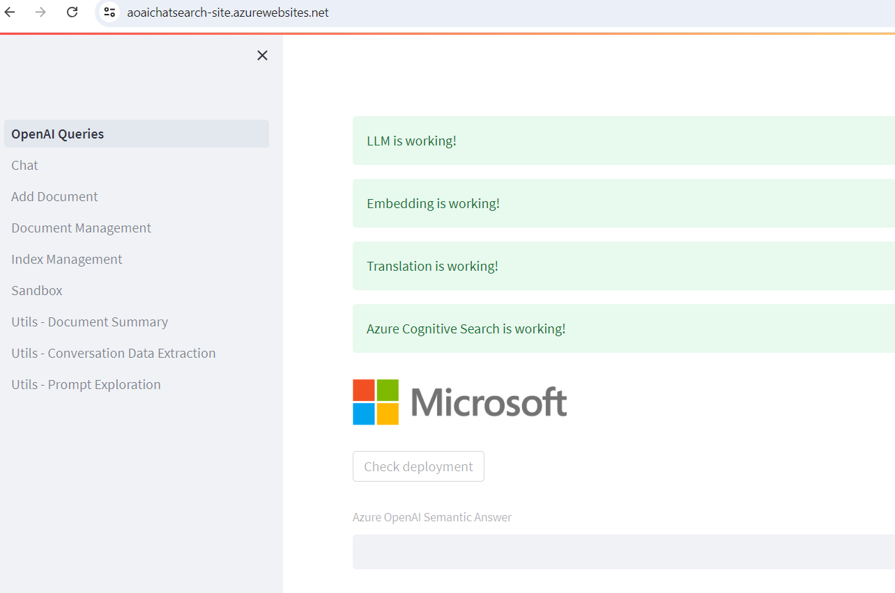
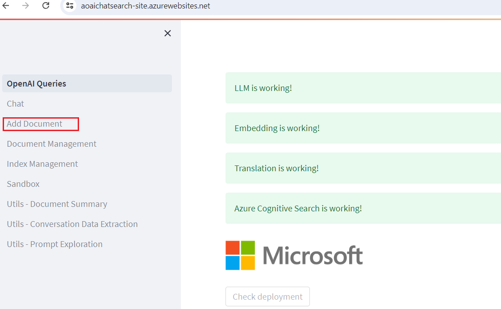
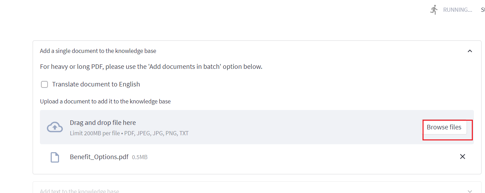
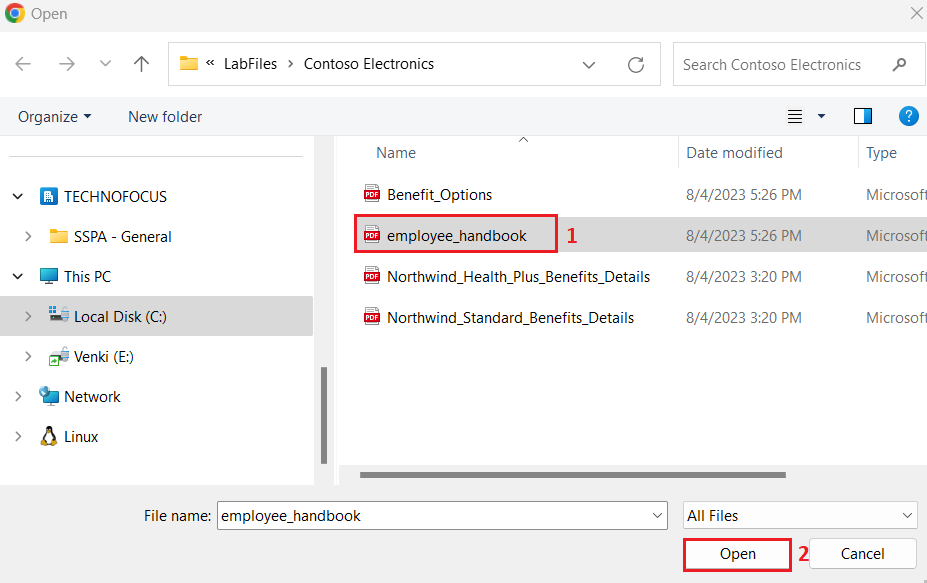
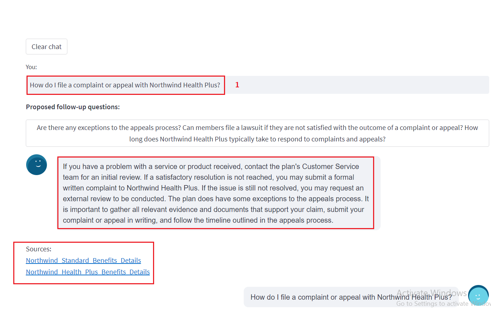

**실습 07: 시맨틱 답변(semantic answering)을 이용한 Q&A 구현**

**소개**

이 실습에서는 OpenAI 기능을 활용한 간단한 문서 검색 웹 애플리케이션을
구현합니다. 이 리포지토리는 Azure OpenAI 서비스를 사용하여 문서에서
임베딩 벡터를 생성합니다. 사용자의 질문에 답하기 위해, 시스템은 가장
관련성이 높은 문서를 검색하고, 그 문서를 사용해 GPT-3를 통해 일치하는
답변을 추출합니다.

**목표**

- Azure AI Studio에서 채팅 및 임베딩 모델 배포

- App Service, Search Service, Form Recognizer 등과 같은 필수 리소스를
  배포하기 위해 사용자 정의된 템플릿 사용

- aoaichatsearch-site 웹 애플리케이션을 배포하고, Azure OpenAI 기능을
  사용한 문서 검색, 텍스트 요약, 대화 데이터 추출 수행

- 배포된 리소스와 모델을 삭제

## **작업 1: Azure OpenAI 리소스 생성**

1.  Azure 포털 홈페이지에서 아래 이미지와 같이 Microsoft Azure 명령
    표시줄의 왼쪽에 있는 세 개의 수평 막대 아이콘(햄버거 메뉴)을
    클릭하여 Azure 포털 메뉴를 여세요.

> 

2.  **+ Create a resource** 찾아 클릭하세요.

> 

3.  **Create a resource** 페이지에서**Search services and marketplace**
    검색창에 **Azure OpenAI**를 입력한 후**Enter** 버튼을 누르세요..

> 

4.  **Marketplace** 페이지에서 **Azure OpenAI** 섹션으로 이동한 후,
    Create 버튼 드롭다운을 클릭하고, **Azure OpenAI** 를 선택하세요
    (아래 이미지 참고). (이미 **Azure** **OpenAI** 타일을 클릭한
    경우에는 **Azure OpenAI page**에서**Create** 버튼을 클릭하세요).

> 

5.  **Create Azure OpenAI** 창의 **Basics** 탭에서 다음 정보를 입력한
    후**Next** 버튼을 클릭하세요.

[TABLE]

> 

6.  **Network** 탭에서 모든 라디오 버튼을 기본 설정 상태로 둔 채,
    **Next** 버튼을 클릭하세요.

> 

7.  **Tags** 탭에서 모든 필드를 기본값으로 그대로 두고, **Next** 버튼을
    클릭하세요..

> 

8.  **Review+submit** 탭에서 유효성 검사(Validation)가 완료되면,
    **Create** 버튼을 클릭하세요.

> 

9.  배포가 완료될 때까지 기다리세요. 배포에는 약 **2-3** 분이
    소요됩니다.

10. **Microsoft.CognitiveServicesOpenAI** 창에서 배포가 완료된 후, **Go
    to resource** 버튼을 클릭하세요.

> 

11. **Azure-open-testXX | Model deployments** 창에서 **Resource
    Management** 섹션으로 이동하고 **Keys and Endpoints**를 클릭하세요.

12. **Keys and Endpoints** 페이지에서 **KEY1, KEY 2,** 및 **Endpoint**
    값을 복사하여 아래 이미지와 같이 메모장에 붙여넣고, 향후 실습에서
    사용할 수 있도록 메모장을 저장**(Save)**하세요**.**

## **작업 2: 채팅 모델 및 임베딩 모델 배포하기**

1.  **Azure-openai-testXX** 페이지에서 왼쪽 탐색 메뉴에서 **Overview**를
    클릭한 후, 아래로 스크롤하여 아래 이미지와 같이**Explore Azure AI
    Foundry portal** 버튼을 클릭하세요.

> 

2.  Azure OpenAI 스튜디오가 실행될 때까지 기다리세요.

> 

3.  **Azure AI Foundry** |**Azure OpenAI Studio** 홈페이지에서 왼쪽 탐색
    메뉴에서 **Deployment** 를 선택하세요.

4.  **Deployments** 창에서 **+Deploy model**을 드롭다운하고 **Deploy
    base model**을 선택하세요.

> 

5.  **Select a model** 대화 상자에서 **gpt-4**를 탐색하고 선택한 후,
    **Confirm** 버튼을 클릭하세요.

6.  **Model version**에서 **0125-Preview**를 선택하고, **Deployment
    type**에서 **Standard**를 선택한 후, **Deployment name field**,
    **gpt-4**를 입력하고, **Create** 버튼을 클릭하세요.

> 

7.  **Deployments** 창에서 **+Deploy model** 을 드롭다운하고 **Deploy
    base model**를 선택하세요.

> 

8.  **Select a model** 대화 상자에서 **text-embedding-ada-002**를
    탐색하고 선택한 후, **Confirm** 버튼을 클릭하세요.

9.  **Deploy model** 대화 상자의 **Deployment name**에
    +++**text-embedding-ada-002+++**를 입력하고, **Deployment
    type**에서**Standard**를 선택한 후, **Deploy** 버튼을 클릭하세요.

## **작업 3: Azure Cognitive Search를 사용해 Azure(WebApp + Batch Processing)에 배포**

1.  Microsoft Edge 브라우저를 열고 주소 표시줄에 다음 URL을 입력 또는
    붙여넣은 후 **Enter** 키를 누르세요::
    <https://portal.azure.com/#create/Microsoft.Template/uri/https%3A%2F%2Fraw.githubusercontent.com%2Fruoccofabrizio%2Fazure-open-ai-embeddings-qna%2Fmain%2Finfrastructure%2Fdeployment_ACS.json>

2.  **Custom deployment** 창의 **Basics** 탭에서 아래 정보를 입력한 후,
    **Review + create** 버튼을 클릭하세요.

[TABLE]

3.  **Review + create** 탭에서 유효성 검사(Validation)가
    완료(Passed)되면, **Create**버튼을 클릭하세요.

4.  배포가 완료될 때까지 기다리세요. 배포에는 약 15~17분 정도
    소요됩니다.

> 

5.  **Go to resource group** 버튼을 클릭하세요.

> 

## **작업 4: 웹 애플리케이션을 통한 Azure OpenAI 지원 문서 검색**

1.  **aoaiXXX-RG** 리소스 그룹 창의 **Resources** 탭에서 **App
    Service** - **aoaaichatsearch-site**로 이동하여 클릭하세요.

2.  **aoaichatsearch-site** Web App **Overview** 페이지에서 상단 명령
    모음(Command Bar)으로 이동한 후, **Browse**를 클릭하세요. 웹
    애플리케이션으로 이동됩니다.

3.  웹 애플리케이션 배포가 완료될 때까지 기다리세요. 배포에는 약
    **10-15**분 정도 소요됩니다.

4.  웹 애플리케이션 홈 페이지에서 배포 상태를 확인하려면, Microsoft
    아래에 있는 **Check deployments** 버튼을 클릭하세요.

5.  배포 상태를 확인하는 데 약 5~6분 정도 소요될 수 있습니다.

6.  Web App 홈 페이지에서 왼쪽에 있는 **Add Document** 를 클릭하여
    데이터를 추가하세요.

7.  **Add Document** 창에서 **Browse files** 버튼을 클릭하여 지식
    베이스에 추가할 문서를 업로드하세요.

8.  VM에서**C:\Labfiles\Contoso Electronics** 위치로 이동한 후,
    **Benefit_Options.pdf,** 파일을 선택하고 **Open** 버튼을 클릭하세요.

9.  **Browse files** 버튼을 다시 클릭하고, VM에서 **C:\Labfiles\Contoso
    Electronics** 위치로 이동한 후, **employee_handbook.pdf** 파일을
    선택하고 **Open** 버튼을 클릭하세요.

10. 마찬가지로 **Northwind_Health_Plus_Benefits_Details.pdf** 및
    **Northwind_Standard_Benefits_Details.pdf** 추가하세요.

11. 업로드된 데이터는 지식 베이스에 추가되며, 약 5~7분 정도 소요됩니다.

12. **Document Management**를 클릭하여 파일이 성공적으로 업로드되었는지
    확인하세요. 

13. **Index Management**를 클릭하여 파일, 키 및 소스를 확인하세요.

14. 그 후, **Chat**을 클릭하세요.

15. **Chat session** 섹션에서 다음 프롬프트를 입력한 후 **Enter** 키를
    눌러 응답을 확인하세요.

**사용자**: **what is the employee's portion of the healthcare cost from
each paycheck in Contoso Electronics**

16. **Chat session** 섹션에서 **Clear chat** 버튼을 클릭하세요.

17. **Chat session** 섹션에서 다음 프롬프트를 입력한 후 Enter 키를 눌러
    응답을 확인하세요.

**사용자**: **How do I file a complaint or appeal with Northwind Health
Plus?**

18. **Chat session** 섹션에서 **Clear chat** 버튼을 클릭하세요.

19. **Chat session** 섹션에서 다음 프롬프트를 입력한 후 **Enter** 키를
    눌러 응답을 확인하세요.

**사용자**: **Does my plan covers my eye exams?**

20. 왼쪽에 있는 **Utils-Document Summary**를 클릭하세요.

21. **Summarization** 섹션에서 **Basic Summary** 라디오 버튼을
    선택하세요.

22. **Summarization** 창에서 **Enter some text to summarize** 섹션의
    메시지 상자에 현재 텍스트를 다음으로 교체한 후, **Summarize** 버튼을
    클릭하세요.

It’s been six months since we reinvented search with [the new AI-powered
Bing and
Edge](https://blogs.microsoft.com/blog/2023/02/07/reinventing-search-with-a-new-ai-powered-microsoft-bing-and-edge-your-copilot-for-the-web/).
In that short time, you’ve engaged in so many unique and creative ways;
to date we’ve seen over 1 billion chats and over 750 million images fill
the world of Bing! We’ve also seen nine consecutive quarters of growth
on Edge, meaning we’re more able than ever to bring our best-in-class AI
experiences to users across the web.

23. 입력한 텍스트의 요약을 확인하세요.

24. Summary 결과를 확인한 후, **Clear summary** 버튼을 클릭하세요.

25. 이제 위로 스크롤한 후, **Bullet Points** 라디오 버튼을 선택하세요.
    **Enter some text to summarize** 섹션의 메시지 상자에 현재 텍스트를
    다음으로 교체한 후, **Summarize** 버튼을 클릭하세요.

Microsoft has made its Azure OpenAI Service generally available,
bringing the enterprise generative AI tools out of its invite-only
program. Now any customers who meet Microsoft’s standards can access the
professional versions of OpenAI’s large language model GPT-3.5 and the
related text-to-image tool DALL-E 2, computer programming assistant
Codex, and the popular ChatGPT chatbot interface for the LLM.

Microsoft launched the Azure OpenAI Service with an eye toward offering
businesses a way to develop apps without coding, write reports, and put
together marketing content. The scope has grown since then to encompass
new facets of the OpenAI’s models, including chat and visuals. Those
interested in the tools have to explain how they will use the AI tools
and agree to Microsoft’s ethical guidelines in their application for
access. The decision to widen the Azure OpenAI Service’s availability
arrives in tandem with Microsoft’s plans to integrate ChatGPT and DALL-E
into its Office suite, Bing search engine, and other consumer products.
Azure OpenAI Service followed earlier experiments to integrate GPT-3
into Microsoft projects like the low-code Power Apps programming tool
and the GitHub Copilot programming assistant.

26. 요약 결과가 글머리 기호 형태로 표시됩니다.

27. 왼쪽에서 **Utils-Conversation Data Extraction**을 클릭하세요.

28. **Conversation data extraction** 창에서 **Execute tasks** 을 클릭한
    후, **OpenAI result**에서 응답을 확인하세요.

29. 에이전트(Agent)와 사용자(User) 간의 대화에서 추출된 데이터를
    검토하세요.

## 작업 5: 배포된 리소스 및 모델 삭제

1.  ㅂ배포된 리소스를 삭제하려면 **Azure portal home** 페이지로 이동한
    후, **Resource groups**을 클릭하세요.

> 

2.  Resource groups 페이지에서 리소스 그룹을 선택하세요.

> 

3.  **Resource group** 홈페이지에서 all resources를 선택하고
    **delete**를 클릭하세요.

4.  오른쪽에 나타나는 **Delete Resources** 창에서 **Enter “delete” to
    confirm deletion** 필드를 확인한 후 **Delete** 버튼을 클릭하세요.

5.  **Delete confirmation** 대화 상자에서 **Delete** 버튼을 클릭하세요.

> 

6.  벨 아이콘을 클릭하면 알림이 표시됩니다.

**요약**

이번 실습에서는 Azure AI Studio에서 GPT-4 챗 모델과
text-embedding-ada-002 임베딩 모델을 배포하고, 사용자 정의 템플릿을 통해
필요한 리소스를 배포했습니다. 이후, aoaichatsearch-site 웹 앱에 비정형
문서를 업로드하여 챗 세션을 통해 정확한 정보를 추출했습니다. 샘플
텍스트로부터 기본 요약과 글머리표 요약을 생성하고, 대화로부터 데이터도
추출했습니다. 실습 마지막에는 리소스와 모델을 삭제하여 Azure OpenAI
리소스를 효율적으로 관리했습니다.

**중요 사항: 리소스 그룹(Resource Group)은 삭제하지 마세요. 삭제 시 다음
실습을 진행 또는 새로운 리소스 그룹을 생성할 수 없습니다.**

**Azure OpenAI Service (Azure-openai-testXX)** **는 삭제하지 마세요.
모든 실습에서 동일한 서비스를 계속 사용하게 됩니다.**
